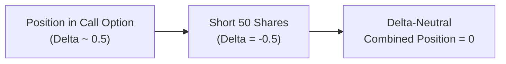

## 7.5 Delta

Delta is one of the most fundamental concepts in options trading and pricing. It helps quantify how an option’s value changes when the price of the underlying asset moves. Think of it like a speedometer that tells you, “If the underlying asset’s price creeps up by one dollar, the option’s price will probably move by X dollars.” That X is Delta. 

In this section, we’ll look at Delta from multiple angles. We’ll see how it relates to probabilities, hedging, risk management, and how it’s used in practice. I remember when I first encountered Delta, it felt like I’d discovered a secret decoder ring that told me exactly how “in sync” an option was with its underlying stock or commodity. But as I learned more, I realized that Delta—like every Greek—is anything but static. It changes over time because other factors (such as Gamma) come into play.

Below, we’ll break down Delta step by step, sprinkle in some personal anecdotes, share practical uses, and highlight CIRO’s regulatory frameworks and guidelines related to risk management. My hope is you’ll walk away feeling super confident about Delta and how it can fit into your own (or your clients’) trading and hedging strategies.

### Overview of Delta

At its core, Delta measures how sensitive an option’s price is to a one-dollar change in the price of the underlying asset. If you have a call option with a Delta of +0.50, it suggests that if the underlying stock climbs by $1, the call’s premium is expected to rise by about $0.50. If the underlying instead drops by $1, the same call is expected to lose about $0.50 in value (assuming all else stays the same, which in reality it never does—but more on that later).

• Calls have Delta values that range between 0 and +1.  
• Puts have Delta values that range between –1 and 0.

So, if you see a put option with a Delta of –0.30, it means the put option will lose $0.30 for every $1 that the underlying’s price rises, again assuming all other factors remain static.

### Probability Interpretation

One of the most common mental shortcuts is interpreting Delta as a rough gauge of the probability that an option will end up in-the-money by expiration (especially in a risk-neutral world for European-style options). For instance, if a European-style call has a Delta of +0.30, some traders might interpret that as a 30% chance of finishing in-the-money. But hold up—this interpretation isn’t perfect. Actual probability of finishing in-the-money depends on factors like time to maturity, volatility, and interest rates. Still, Delta offers a quick approximation that many traders find useful for intuitive, ballpark odds.

### Delta as a Hedge Ratio

Besides being a measure of price sensitivity, Delta also doubles as a hedge ratio. For example, suppose you’ve written (sold) one call option on a stock that has a Delta of +0.50. That means your net position has a “long Delta” of +0.50 (because you’ve effectively collected premium from selling a call, but are short the call’s Delta). To flatten or neutralize your Delta exposure, you might short 50 shares of the underlying stock. The short stock position has a Delta of about –1.00 per share, so shorting 50 shares results in a –50 Delta. Add that to the +0.50 Delta of the call option (multiplied by 100 shares per contract, typically in North America), and your overall position can become Delta-neutral.

That might sound complicated, but it really just means that small changes in the underlying price won’t affect your overall profit/loss too dramatically—at least in theory. The world is rarely static, so if the underlying stock moves significantly or implied volatility shifts, your Delta will change. That’s where Gamma steps in.

Below is a simple Mermaid diagram illustrating the concept of Delta-neutral hedging:

### Delta and Gamma

Delta is never truly a locked-in constant. As the underlying stock or commodity moves, your Delta moves too. That shift is driven by Gamma, which measures the rate of change in Delta. If you’re dealing with an at-the-money option, you’ll likely see a moderate Delta that changes quickly when the stock price fluctuates (i.e., high Gamma). When the option is deep in-the-money, Delta might hover near +1.00 for a call (or –1.00 for a put), meaning it’ll move almost in tandem with the underlying. But ironically, once it’s very deep in-the-money (or out-of-the-money), Delta doesn’t change as dramatically, because Gamma is relatively lower.

### Real-World Practical Examples

Let’s step away from theory and consider a real-world example—one from my early days trading a modest portfolio:

• Underlying Stock (ABC Corp): $100/share  
• Strike Price of the Call Option: $100 (at-the-money call)  
• Option Premium: $5 (just an example)  
• Delta: +0.50  

Scenario 1: The stock rises to $101.  
If you have one call option, and Delta stays roughly at +0.50 during that small move, your option’s price might climb from $5 to about $5.50.

Scenario 2: The stock drops to $99.  
Your call option might fall from $5 to approximately $4.50.  

Of course, in real life, everything from implied volatility to time decay is also evolving, but Delta helps you see that immediate relationship between the stock’s movement and the option’s price.

### Deeper In-the-Money vs. Out-of-the-Money

If the underlying stock soared to $120 and your strike is still $100, your call option would likely have a Delta close to +1.00. That means it pretty much behaves like the underlying stock because there’s so much intrinsic value, and it’s extremely likely to expire in-the-money. Conversely, if the stock plummets to $80, an out-of-the-money $100 call might have a Delta near +0.05 or +0.02—so it barely moves in price when the underlying changes because it’s so unlikely to finish in-the-money.

### Why Delta Actually Matters

• Hedging: If you’re a risk manager, or if you’re in charge of a derivatives desk, you care deeply about your total “portfolio Delta.” CIRO guidance encourages robust risk management, including tracking Greek exposures to ensure you maintain sufficient capital and mitigate outsized risk.  
• Strategy Selection: Whether you’re bullish, bearish, or neutral, Delta helps you design strategies that fit your market outlook. Higher Delta calls help you capitalize on upward moves with quicker profit buildup, while lower Delta calls might be a cheaper way to speculate on a potential big move.  
• Probability Approximation: It’s nice to have a quick sense of whether you’ll expire in-the-money. Though not 100% accurate, the “Delta as probability” perspective is a go-to heuristic for many traders.  

### Delta-Neutral Strategies

Many professional traders aim for “delta neutrality.” They might be bullish on implied volatility or want to collect time decay, so they’ll structure trades (combinations of calls and puts, plus underlying positions) so that the net Delta is near zero. That way, small movements in the underlying don’t cause a big headache. But as soon as the underlying moves a bit, your net Delta also shifts, requiring you to rebalance the hedge. I had an experience once where I thought I was totally Delta-neutral—until the stock moved 5% one way, and my net Delta changed so dramatically. Suddenly, I had to scramble to rebalance by either buying back some short stock or adjusting my option positions. Talk about a hectic day.

### Factors Influencing Delta

1. Moneyness: At-the-money options have a Delta near +0.50 for calls or –0.50 for puts, often changing rapidly. Deep in-the-money calls approach +1.00, and deep out-of-the-money calls might hover near 0.  
2. Time to Expiration: As options near expiration, Delta can shift more dramatically, especially if the strike is near the current market price.  
3. Implied Volatility: High volatility can flatten the “Delta curve” because there’s a wider range of possible outcomes at expiration.  
4. Underlying Price Behavior: A big upward or downward move can shift your option from out-of-the-money to in-the-money (or vice versa), drastically changing your Delta.  

### Regulatory Considerations (CIRO)

Since January 1, 2023, the Canadian Investment Regulatory Organization (CIRO) has overseen investment dealers and mutual fund dealers in Canada, effectively replacing the old IIROC and MFDA. CIRO emphasizes robust risk oversight, especially for derivative products. They expect member firms to track aggregate Delta (among other Greeks) to ensure the firm has enough capital and margin to cover potential losses from sudden market moves.

CIRO’s guidelines also mention the importance of stress-testing for larger portfolios—so if your net Delta is significantly positive (or negative), you should be prepared for major swings in your P&L. If you want more details, check out CIRO’s website at https://www.ciro.ca, where you can find updated rule books and references to risk models that delve into Delta and other Greeks.

### Open-Source Tools and Frameworks

If you’re interested in calculating Delta beyond the simplistic “approximate approach,” you can turn to open-source libraries such as QuantLib. These libraries allow you to compute Greeks using standard pricing models—like Black–Scholes–Merton—or more advanced methods (e.g., binomial trees or Monte Carlo simulations). Python’s “QuantLib” bindings, R’s “RQuantLib” package, and other finance libraries typically let you specify variables (spot price, strike, volatility, risk-free rate, and time to expiration) and then spit out a Delta value. It’s a good idea to do a sanity check—compare the library’s output to your quick mental estimate.

### Best Practices and Common Pitfalls

• Monitor Delta Continuously: Don’t assume your initial Delta will hold. Reassess your Greek exposures each time the underlying moves.  
• Understand Implied Volatility Effects: Rising implied volatility can cause the option premium to increase even if the underlying doesn’t move—a phenomenon not fully captured by Delta (look at Vega for that).  
• Beware The Probability Shortcut: Interpreting Delta as the probability of finishing in-the-money can be misleading if you ignore volatility, dividends, or interest rates.  
• Use Protective Stops: Even if you hedge Delta, the market can move faster than you can adjust your position. Stop-loss orders or pre-set risk limits can keep you from large unexpected losses.  
• Stay Compliant with CIRO: If you’re a registered professional, ensure your internal risk systems meet current CIRO guidelines. They may ask for evidence that you routinely measure Greek exposures, not just Delta but Gamma, Vega, Theta, etc.  

### A Quick KaTeX Example for Delta (Black–Scholes–Merton)

While you can estimate Delta in many ways, one common formula for a European call option in the Black–Scholes–Merton framework is:


\Delta_{\text{call}} = \Phi(d_1)


where \\(\Phi(\cdot)\\) is the cumulative distribution function for the standard normal distribution, and \\(d_1\\) is defined as:


d_1 = \frac{\ln\left(\frac{S_0}{K}\right) + \left(r + \frac{\sigma^2}{2}\right) T}{\sigma \sqrt{T}}


Here:  
• \\(S_0\\) is the current underlying price.  
• \\(K\\) is the strike price.  
• \\(r\\) is the risk-free interest rate.  
• \\(\sigma\\) is the volatility.  
• \\(T\\) is the time to maturity (in years).  

### Personal Reflection

I remember the first time I tried to hedge a position using Delta alone. I thought, “This is great! If I just offset my Delta, I’m basically safe.” Well, as soon as the market moved and my option’s Delta morphed, I quickly realized hedging isn’t a one-and-done affair. It’s a continuous process requiring you to keep an eye on Gamma, Vega, and Theta. Still, Delta is a pretty awesome starting point—like the front door to the “option Greeks house.”

### Conclusion

Delta is more than just a partial derivative in an option pricing model. It’s a lens through which you can see your risk exposure, gauge probabilities, and formulate hedging strategies. Deep in-the-money calls or puts have Deltas close to ±1.00 and move almost in lockstep with their underlying. At-the-money options often exhibit moderate Delta values that can change rapidly if the underlying’s price starts drifting in or out of the money.

No matter your experience level, if you’re handling options, you’ll soon discover that Delta is your friend, your risk metric, and sometimes a mischief-maker if you forget to update it frequently. Keep a close watch, especially in fast-moving markets, and remember to consult more advanced Greeks and risk measures for a well-rounded perspective. Above all, remain aligned with CIRO’s guidelines on derivatives—particularly if you’re working with client accounts or managing a firm’s compliance. A robust strategy should factor in all moving pieces, but Delta is a fantastic place to begin.

---

## Sample Exam Questions: Mastering Delta Fundamentals



### Delta is best described as which of the following?

- [x] The rate of change of an option’s price relative to a $1 change in the underlying price
- [ ] The implied volatility measure of an option
- [ ] The time decay measure of an option
- [ ] The risk-free interest rate applied to an option

> **Explanation:** Delta indicates how much the option price is expected to shift for every $1 change in the underlying asset. It does not measure implied volatility, time decay, or interest rates.

### Considering a European-style call option with a Delta of +0.40, which informal interpretation might a trader use?

- [x] There is roughly a 40% chance of finishing in-the-money at expiration
- [ ] There is a 60% chance of expiring worthless
- [ ] The underlying will definitely rise if the Delta is positive
- [ ] This option cannot lose value if the stock price falls

> **Explanation:** Some traders use Delta as a rough guide to the probability of expiring in-the-money, though this is not an exact likelihood. The +0.40 Delta does not guarantee the underlying’s direction nor protect the option from losses.

### Which statement about Delta and time to expiration is correct?

- [ ] Delta remains constant regardless of time to expiration
- [x] Delta can change more dramatically as an option approaches expiration, especially for at-the-money options
- [ ] Delta frequently becomes positive for all puts near expiration
- [ ] Delta automatically drops to zero if your account is fully hedged

> **Explanation:** As expiration nears, at-the-money options can experience swift Delta changes because their probability of expiring in-the-money can shift rapidly with even small price movements.

### A put option with a Delta of –0.60:

- [x] Decreases by approximately $0.60 if the underlying goes up by $1
- [ ] Moves in the same direction as the underlying price
- [ ] Means it is an at-the-money option
- [ ] Implies a probability of 0.60 for finishing out-of-the-money

> **Explanation:** A put with Delta –0.60 suggests the premium will lose about $0.60 if the underlying rises by $1 (all else constant). That negative sign reflects how put prices typically move inversely to the underlying.

### In a delta-neutral hedge using one at-the-money call (Delta = +0.50):

- [x] Shorting 50 shares of the underlying helps neutralize Delta
- [x] You might need to rebalance if the stock price moves
- [ ] Buying 50 shares of the underlying helps neutralize Delta
- [ ] The hedged position never needs adjusting once established

> **Explanation:** To neutralize a call’s +0.50 Delta, a trader often shorts 50 shares. Because Delta is not static, the position may require rebalancing if the stock moves significantly.

### Which of the following is a common pitfall when using Delta?

- [x] Assuming Delta remains constant as the underlying price changes
- [ ] Failing to understand that Delta values can be both positive and negative
- [ ] Overcomplicating the relationship between Delta and Gamma
- [ ] Using Delta to hedge both time decay and volatility risk

> **Explanation:** A big mistake is forgetting that Delta shifts as the market moves (Gamma effect). Delta is not suitable on its own for hedging time decay (Theta) or volatility (Vega) risk.

### You hold a deep in-the-money call with a Delta of +0.95. What does this generally imply?

- [x] The call’s price will move almost in lockstep with the underlying
- [ ] The call has minimal intrinsic value
- [x] The option behaves like having 95 shares of the underlying
- [ ] The option is worthless if the underlying falls by $2

> **Explanation:** A Delta near +1.00 suggests the deep in-the-money call closely tracks the underlying’s moves and has substantial intrinsic value. It behaves similarly to holding many shares of the underlying.

### If you want to remain delta-neutral, you must:

- [x] Frequently rebalance as the underlying price changes
- [ ] Only rebalance once per year
- [ ] Ignore Gamma because Delta is sufficient
- [ ] Maintain the same number of underlying shares at all times

> **Explanation:** Maintaining a delta-neutral position requires ongoing rebalancing since Delta changes as the underlying’s price moves. Gamma causes Delta to shift constantly.

### According to CIRO guidelines, which of the following is recommended?

- [x] Monitoring aggregate portfolio Delta for risk management
- [ ] Using Delta to ignore position limits
- [ ] Relying solely on time decay for margin calculations
- [ ] Adhering to old IIROC regulations, as CIRO is not authoritative

> **Explanation:** CIRO (the new regulator) recommends robust risk oversight, including managing total portfolio Delta. They have replaced IIROC and MFDA, and their rules and guidelines are the current standard.

### True or False: Delta can be interpreted as a perfect indicator for the exact probability of expiring in-the-money.

- [x] False
- [ ] True

> **Explanation:** While traders often interpret Delta as a rough guide to the probability of finishing in-the-money, it is not a perfect measure due to other influencing factors like implied volatility, dividends, and risk-free rates.


