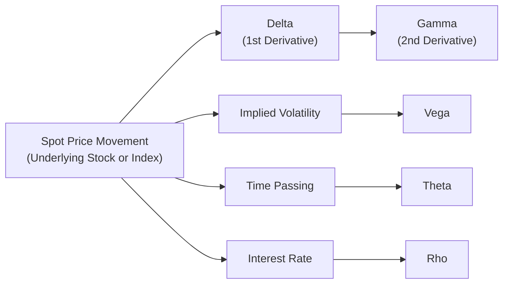

## 7.6 Advanced Greeks (Gamma, Theta, Vega, Rho)

So, you’ve probably heard about Delta, right? It’s that first derivative telling you how much an option’s price changes when the underlying asset price fluctuates by one unit. But—maybe this is just my experience—once you start trading more complex option strategies, you realize that Delta isn’t the whole story. You might buy a call thinking you’re covered if the underlying stock edges up, but the reality is, as the price moves, your Delta might shift significantly. This is why we have some additional measures, commonly referred to as the “Advanced Greeks”: Gamma, Theta, Vega, and Rho.

It might feel a bit overwhelming if you’re new to this. I get it. But trust me, once you see how these Greeks shape every little movement in your options portfolio—well, it’s a bit like turning on the lights in a dark room. Let’s break them down one by one.

---------------------------------
### Understanding the Full Picture of Option Greeks

An option’s price isn’t just about tracking the underlying asset’s price. It’s also about how the option is affected by changes in volatility, time decay, and interest rates. Let’s take a quick snapshot:

• Gamma: Measures how fast your Delta changes if the underlying moves.  
• Theta: Tells you how much value (usually extrinsic) your option loses as time passes.  
• Vega: Shows your gains or losses when implied volatility shifts by 1%.  
• Rho: Monitors how changes in interest rates affect your option price.

In essence, if Delta is the steering wheel that aims you in a direction, the Advanced Greeks are the suspension, tires, and engine performance. They shape the ride in ways you might not notice at first—but they matter a whole lot in the long run.

Here’s a small diagram showing how each Greek flows from the underlying factors and affects an option’s premium:

Each node helps you see how the price of an option changes under various inputs. Delta is that first measure, but then Gamma, Theta, Vega, and Rho add more depth.

---------------------------------
### Gamma: The Acceleration of Delta

Gamma is, in mathematical terms, the second derivative of the option’s price with respect to changes in the underlying’s price. If Delta is the speed at which your option price is changing, Gamma is the acceleration. Whenever you see large swings in the underlying, high Gamma can be both a blessing and a curse.

• **High Gamma:**  
  - Your Delta adjusts rapidly if the underlying moves.  
  - There can be added cost in constantly re-hedging if you’re trying to maintain a neutral Delta.  
  - On the flipside, if you’re long Gamma (for instance, you own calls or puts outright), these rapid changes in Delta can work to your advantage when markets are volatile.

• **Low Gamma:**  
  - Delta remains relatively stable.  
  - There’s less rebalancing for delta-hedged positions, but also fewer chances to profit from big price swings.  
  - Common when trading deep in-the-money (ITM) or far out-of-the-money (OTM) options that have relatively flatter changes in Delta.

An anecdote: the first time I realized Gamma’s impact was when an underlying stock soared on unexpected earnings. My short calls ramped up in Delta so quickly that I was underwater before I could even blink. That’s Gamma in action. If you **short** options, you’re short Gamma, and that can get very expensive if the market moves against you.

#### Gamma Scalping

There is a popular strategy called “Gamma Scalping,” often used by professional traders, where you hold a long option position and then continually re-hedge your Delta. If the underlying hops around enough, you might lock in small profits from the frequent adjustments. However, it takes close monitoring and can rack up transaction costs. For retail traders or smaller professional desks, it’s crucial to weigh potential gains against the costs (spreads and commission). 

From a regulatory standpoint, especially under the Canadian Investment Regulatory Organization (CIRO) guidelines, large institutions must track their “Greek exposures,” including Gamma, to ensure they don’t breach capital or firm-level risk controls. So advanced risk systems typically require real-time or near real-time Greek calculations.

---------------------------------
### Theta: Time is Money (Really!)

Theta is the measure of how much an option’s time value decays as the clock ticks away—usually quoted in terms of dollars wasted (or gained) per one day’s passage. You’ll see options traders talk about “the weekend risk” or “overnight Theta,” referencing how, once the markets close, you’re still paying for the time your option holds if you’re long. 

- **Negative Theta:**  
  - Long calls or puts typically have negative Theta.  
  - Means you’re losing premium each day if nothing else changes. 
  - This is often the “cost of carry” for your directional bet on the underlying.

- **Positive Theta:**  
  - If you short an option, you typically collect Theta.  
  - But shorting also means you have unlimited risk potential if the market moves strongly against you.  
  - Theta gains help offset some of that risk, but you must be prepared to handle the rebalancing if underlying prices spike.

I once met a trader who said, “Ah, it’s the weekend, time to earn some Theta.” He was short a stack of options that were close to expiry, so he expected that Monday morning’s opening bell would see those options heavily deflated in time value. But keep in mind, if big news hits over the weekend, implied volatility might jump, overshadowing any daily time decay. That’s the interplay between Theta and Vega—time decay can be counteracted by a big change in volatility. We’ll get to that next.

#### Managing Time Decay

For short-term trading strategies, Theta can be your friend or your enemy:
- Spread strategies (like Calendars or Diagonals) can help isolate Theta in a way that suits your market outlook.  
- Beyond that, enacting stop-loss orders or adjusting positions can be key to balancing Theta decay with other Greeks.  

CIRO regulations require that you provide risk disclosures to ensure clients understand Theta ramifications, especially if you recommend short option strategies designed to collect premium.

---------------------------------
### Vega: Navigating Volatility Swings

Vega might be my personal favorite (don’t ask me why—I guess volatility is just fun!). Vega tells you how sensitive your option’s price is to a 1% change in the underlying asset’s implied volatility (IV). If implied volatility spikes, your long options can get a significant price boost, even if the underlying stays put. If implied volatility collapses, you might watch your calls and puts lose value rapidly, no matter how little or how much the underlying has moved.

- **High Vega:**  
  - Long straddles thrive if the underlying experiences abrupt volatility expansions.  
  - If you buy options before a big earnings announcement (when implied volatility is usually pumped up), you may actually see your option’s premium get hammered after the event if implied volatility deflates (often called a “vol crush”).

- **Low Vega:**  
  - Short options can profit if you’re expecting volatility to remain subdued.  
  - But if you’re short Vega and volatility explodes, the option premium you owe can skyrocket.

#### Volatility Strategies

Common volatility strategies include:
- **Straddle/Strangle:** Pure volatility plays. If you anticipate big moves, you go long both calls and puts. If you think markets will remain calm, you might short them.  
- **Vega Hedging:** If you hold a large portfolio of options, you may reduce volatility risk using offsetting positions (like buying or selling VIX futures or VIX options in the U.S. context) or by adjusting your option strategies on the Bourse de Montréal.  

Pro tip: watch for “implied vs. realized volatility.” If implied is greater than realized, shorting premium might be attractive—but only if you can handle Gamma risk in a big market move.  

#### Regulatory Perspective

In the Canadian market, especially for portfolio managers or dealers within CIRO’s supervision, large Vega exposures can require additional margin or capital. There are also obligations to show that your risk management system can handle tail events—like a massive volatility spike. You can find references in the CIRO rulebook about ensuring proper stress testing for volatility changes. For more specialized resources, you might check the Global Association of Risk Professionals (GARP) to understand best practices in multi-Greek hedging.

---------------------------------
### Rho: The Interest Rate Conundrum

People often ignore Rho in short-term trading, but it can be quite significant for longer-dated options. Rho measures how the option’s price changes when interest rates shift by 1%. 

- **Calls and Interest Rates:**  
  - Higher rates can boost call options slightly, because holding a call can be a partial substitute for holding the stock itself and possibly financing that purchase at the ongoing interest rates.  
- **Puts and Interest Rates:**  
  - Higher rates often weigh slightly on put values, because the present value of the exercise proceeds is discounted at a higher rate.  

This might sound a bit academic, but if you deal in LEAPS (Long-Term Equity AnticiPation Securities) or trade far-out expiration index options—and if rates are no longer near 0%—Rho can increasingly matter. Also, keep your eye on the Bank of Canada’s policy announcements if you’re trading longer-dated positions. A 1% shift in rates, while not super frequent, can happen in periods of tightening or loosening monetary policy.

From a compliance viewpoint, Rho sensitivity is typically overshadowed by Delta and Vega net exposures. But if you’re a large institution, you can’t afford to ignore near-term changes in the prime rate or government bond yields, especially if you manage big leaps or structured positions that combine multiple Greeks.

---------------------------------
### Putting It All Together: Multi-Greek Risk Management

Gamma, Theta, Vega, and Rho rarely move in isolation. Let’s say you’re holding a short position in calls that are slightly out-of-the-money. If the underlying stock jumps:
- Your negative Gamma means Delta moves more against you the further the stock rallies.
- Your negative Theta might seem great—because you’re collecting premium—but if the market moves swiftly and dramatically, you could be in trouble before time decay helps you.
- Your short Vega might amplify losses if implied volatility also spikes at the same time the stock is moving.
- Rho might not be a big factor unless you’re dealing with leaps or sudden interest rate changes.

One approach is a “Greeks matrix,” where traders outline how each position’s Delta, Gamma, Vega, Theta, and Rho would change if the underlying price moves by a certain amount (e.g., ±5%), or if implied volatility changes by some fraction (±2% IV), or if interest rates jump or drop by a fraction of a percent. This kind of scenario analysis is common practice in professional risk management, and something that’s strongly encouraged by both global risk associations (like GARP) and local regulators (CIRO in Canada).

---------------------------------
### Common Practical Examples

1. **Earnings Iron Condor:**  
   - You might sell an Iron Condor around expected quarterly results. You collect time value (positive Theta), but you’re short Gamma and short Vega. If the stock hardly moves post-earnings, the trade can be profitable. But if volatility remains high or the stock leaps or plummets, your short Gamma and short Vega can inflict heavy losses.

2. **Long Straddle on a Commodity ETF:**  
   - Suppose you believe a commodity (like crude oil) is about to see major short-term disruptions. You buy calls and puts on a commodity ETF. Here, you’re looking for a big move in the underlying or a jump in implied volatility, so you’re effectively long Gamma and long Vega. Time works against you, so you have negative Theta. If the big move doesn’t come quickly, those daily Theta costs can chew into your position value.

3. **Rho Sensitivity in a Long-Dated Call:**  
   - Maybe you buy a 2-year bank stock call, expecting interest rates to shift. If interest rates climb, your call’s Rho might favor you a bit. But if the stock hasn’t performed well or volatility remains low, you might see minimal net benefit compared to the cost of tying up capital in that position.

---------------------------------
### Glossary of Key Terms

• **Gamma (Γ):** The second derivative of an option’s price with respect to movements in the underlying. Tells you how fast Delta will change if the underlying’s price changes.  
• **Theta (Θ):** The time decay component of an option’s price. Usually negative for long positions and positive for short positions.  
• **Vega (v):** The sensitivity of an option’s price to changes in implied volatility. Not a Greek letter in the strict sense, but crucial for volatility-based strategies.  
• **Rho (ρ):** An option’s sensitivity to changes in the risk-free interest rate. Typically more relevant for longer-dated options.  
• **Gamma Scalping:** A trading technique where you try to capture small, frequent gains by rebalancing a long Gamma position if the market moves in your favor.

---------------------------------
### CIRO Compliance Note & Additional Resources

The Canadian Investment Regulatory Organization (CIRO) states that investment dealers should maintain robust risk management systems capable of calculating and aggregating Greeks across client accounts, especially for institutional and large retail portfolios. If you’re a portfolio manager advising pension funds or large institutional investors, you may need to file periodic risk reports showing your net Gamma, Vega, and other exposures.  

• **CIRO Website:**  
  Visit [https://www.ciro.ca](https://www.ciro.ca) for official regulatory updates, rules, and bulletins related to derivatives trading.  

• **GARP Publications:**  
  The Global Association of Risk Professionals offers in-depth materials on Value-at-Risk (VaR), stress testing, and advanced Greek modeling—well worth examining if you manage complex derivatives overall.  

• **Open-Source Financial Tools:**  
  - **QuantLib (C++ Library):** A widely used, open-source library for quantitative finance that can compute Greeks for a variety of option types.  
  - **Python Libraries (NumPy, Pandas, PyTorch, etc.):** Many Python-based open-source solutions offer fairly easy calculations for Greeks.  

Reading widely is key: the more perspectives you gather, the better you’ll understand how to juggle these Greeks in a dynamic market environment.  

---------------------------------
### Best Practices and Pitfalls

**Best Practices:**  
- Use scenario analysis and stress testing to see how Gamma, Theta, Vega, and Rho collectively behave under sharply different market conditions.  
- Keep an eye on implied volatility trends, especially leading up to major events like earnings releases or macroeconomic announcements (e.g., the Bank of Canada’s rate statements).  
- If you’re short options, budgeting for re-hedging costs is critical. Gamma events can get very expensive fast.  

**Common Pitfalls:**  
- Ignoring Gamma until it’s too late, especially with short OTM options that suddenly become ATM.  
- Over-reliance on Theta harvest strategies (like short straddles) without factoring in potential volatility expansions and gap risk.  
- Underestimating Rho’s impact on LEAPS in a changing interest rate environment.  

---------------------------------
### Personal Takeaway

Honestly, I used to ignore Rho completely until I got bitten in a long-dated treasury futures option trade. Rates moved up a tad about six months after I opened the position, and my option’s price responded more than I’d expected—yikes! Every Greek can matter in the right environment. So, be mindful, balance your exposures, and always double-check your risk in frictionless times so you don’t panic during times of major market stress.

---------------------------------
### Real-World Case Study: Gamma and Vega Clash

Let’s paint a real-world scenario (the numbers are hypothetical, but the setup is typical):

• You hold 100 short put options on a large Canadian energy company.  
• You’re short Gamma (since you wrote puts), short Vega, but you’re collecting Theta daily—which is nice.  
• Suddenly, commodity prices slump drastically, and implied volatility shoots up (the market is spooked).  
• Your short puts now have a much higher Delta (the underlying is dropping) and the option price is higher (spike in implied volatility).  
• This is a double whammy. Gamma is sending your Delta from -0.30 to -0.70 quickly, and your short Vega is amplifying your losses as volatility rises.  
• Even though you collect daily Theta, it’s nowhere near enough to compensate for the jump in option premium.  

Moral of the story: short option strategies can earn you that daily Theta income, but you must be ready for the short Gamma + short Vega pitfall if markets shift swiftly.

---------------------------------
### Conclusion

Advanced Greeks can feel pretty intimidating, I know. But once you grasp how Gamma, Theta, Vega, and Rho connect to your positions, you’ll have a vantage point that helps you tailor your strategies and risk management. Whether you’re a student of derivatives, a practicing trader, or a portfolio manager subject to CIRO’s oversight, these metrics provide that deeper layer of insight beyond what Delta alone can offer.

Think of the Greeks as your personal risk “dashboard.” Each meter or gauge tells you if something might be overheating or if your engine (portfolio) is at risk of stalling. Keep an eye on them, rebalance when necessary, and you’ll be better equipped to handle the exciting (and occasionally nerve-racking) world of options.

---------------------------------
#### References and Further Reading

- CIRO: [https://www.ciro.ca](https://www.ciro.ca)  
- Global Association of Risk Professionals (GARP): [https://www.garp.org](https://www.garp.org)  
- QuantLib Project: [https://www.quantlib.org](https://www.quantlib.org)  
- “Options, Futures, and Other Derivatives” by John C. Hull  
- “Dynamic Hedging” by Nassim Nicholas Taleb  

---------------------------------

## Sample Exam Questions: Advanced Greeks (Gamma, Theta, Vega, Rho)



### 1. Which statement best describes Gamma?

- [ ] Gamma is the rate at which an option’s time value decays.  
- [x] Gamma captures how quickly Delta changes with respect to the underlying price.  
- [ ] Gamma is the sensitivity of an option price to changes in implied volatility.  
- [ ] Gamma measures the option’s sensitivity to interest rates.  

> **Explanation:** Gamma is the second derivative of the option’s price with respect to the underlying. It influences how Delta shifts when the underlying price moves.

### 2. If you have a short call position with a high negative Gamma, what is a major risk you face?

- [ ] Earning too little time decay on the position.  
- [x] Facing rapidly increasing Delta losses if the underlying price rises sharply.  
- [ ] Missing out on potential changes in implied volatility.  
- [ ] Having to pay no interest on margin.  

> **Explanation:** Negative Gamma means if the stock price jumps, Delta moves further against your position, causing potentially larger losses.

### 3. In which scenario would a trader benefit most from a high positive Theta?

- [ ] Owning a long call before an earnings announcement.  
- [ ] Holding a long put on a volatile index.  
- [ ] Going long a straddle on a stock with no upcoming events.  
- [x] Writing short options on an underlying expected to remain stable.  

> **Explanation:** If you write (short) options in a stable market, you earn positive Theta as each day passes and the options lose time value.

### 4. What effect does a spike in implied volatility typically have on a position with positive Vega?

- [ ] The position’s value remains unaffected.  
- [ ] The position’s value decreases.  
- [x] The position’s value increases.  
- [ ] There is no relationship between volatility and Vega.  

> **Explanation:** Positive Vega means you profit when implied volatility rises, as option prices generally expand with higher volatility.

### 5. In the context of Rho, what type of option is generally most affected by rising interest rates?

- [ ] Short-term puts near expiry.  
- [x] Long-dated calls with significant time to expiration.  
- [ ] Near-the-money puts expiring in one week.  
- [ ] Deep in-the-money call options expiring today.  

> **Explanation:** Rho is more impactful for longer-dated options, particularly calls, which can see an increase in value when interest rates rise.

### 6. If you are “long Gamma” and the underlying stock experiences frequent small swings up and down:

- [x] You can potentially earn profits through frequent re-hedging (Gamma scalping).  
- [ ] You will lose Theta at a higher rate.  
- [ ] You are less exposed to changes in the underlying.  
- [ ] Your Delta doesn’t have to be adjusted at all.  

> **Explanation:** Long Gamma positions benefit from the underlying moving back and forth, allowing the trader to scalp Delta profitably.

### 7. A portfolio manager wants to hedge Vega exposure. Which approach might they consider?

- [ ] Buying more near-term OTM puts on the same underlying.  
- [ ] Holding short call options exclusively.  
- [x] Using VIX futures or already heavily traded volatility ETFs to offset implied volatility risk.  
- [ ] Increasing Rho by adding more long-dated options.  

> **Explanation:** Common practice for hedging Vega is to use products directly tied to volatility, such as VIX futures or other volatility-driven instruments.

### 8. If an investor believes the Bank of Canada will cut interest rates by 1% unexpectedly, which Greek would they primarily be monitoring for a large impact on a 2-year call option?

- [ ] Gamma  
- [ ] Theta  
- [ ] Vega  
- [x] Rho  

> **Explanation:** Rho measures how option prices respond to interest rate changes, making it particularly relevant for longer-dated options.

### 9. Which combination of Greeks collectively represents the most direct risk to a short straddle holder when the market moves unexpectedly?

- [ ] Delta and Rho  
- [x] Gamma and Vega  
- [ ] Theta and Rho  
- [ ] Theta and Delta  

> **Explanation:** A short straddle is negative Gamma and negative Vega, leaving it vulnerable to both large market moves and volatility spikes.

### 10. True or False: An option with a low Gamma but high Theta would be highly sensitive to underlying price volatility.

- [ ] True  
- [x] False  

> **Explanation:** Low Gamma means the option’s Delta does not adjust rapidly to price changes. Even if the option exhibits high Theta, that primarily relates to time decay rather than sensitivity to price volatility.


