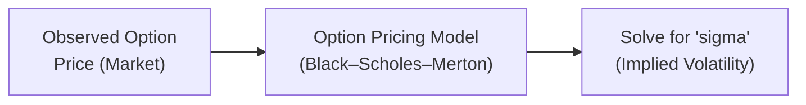
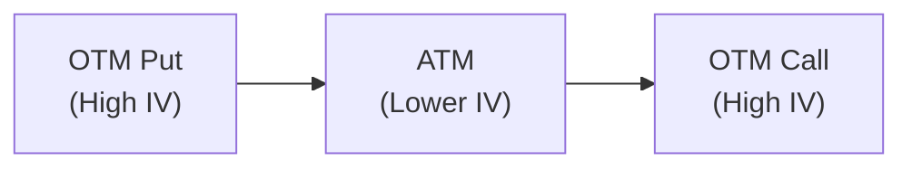

## 7.7 Implied vs. Realized Volatility (Vol Skew, Vol Smile)

There’s something a bit wonderful (and sometimes nerve-racking) about watching options prices move up and down in tune with traders’ expectations of future market fluctuation. We call that expectation “implied volatility.” And if we’re looking at actual, past movements of a stock or commodity, that’s “realized volatility.” At some point, you might find yourself scratching your head: “Why do these numbers differ so often?” or “Why do certain option strikes cost more, relatively speaking?” That’s what this section is all about. So, let’s talk implied vs. realized volatility and how skew or smile shapes the cost of options at different strike prices.

Understanding these concepts can help you stand out in a world where volatility is both a measure of risk and an opportunity for profit. In my experience, some hedgers love to buy expensive downside puts for protection, while speculators might sell them, aiming to collect option premium. Let’s see what’s going on in detail.

---

### Implied Volatility (IV)

Implied Volatility (IV) is the market’s forecast of how much an underlying asset will move in the future, based on **current** option prices. It’s not a recognition of what did happen; rather, it’s a forward-looking metric. You might think of IV as the “pulse” of the options market. When traders get frightened (say, ahead of major corporate earnings or big economic data releases), implied volatility can spike because demand for options (especially puts) jumps. During calmer times, implied volatility might simmer down.

#### How Is Implied Volatility Derived?

The standard approach is to take the trading price of an option (e.g., a call or put) and input it into an option pricing model like Black–Scholes–Merton. Then, you solve for “volatility” using all other known variables (strike price, time to expiry, interest rates, dividends, etc.). The resulting volatility figure is the market’s consensus measure—i.e., the implied volatility.

Below is a simplified diagram that shows how people typically extract implied volatility from observable option prices.

In Canada, quoted implied volatilities for equity, currency, or index options listed on the Bourse de Montréal are widely used by traders to understand how “rich” or “cheap” options might be.

---

### Realized Volatility (RV)

Realized Volatility (RV), also known as **historical volatility**, is an **actual** measure of how much an asset’s price has fluctuated over a specific past period. To calculate realized volatility, you typically:

1. Gather daily price returns (for example, the daily percentage change).  
2. Compute the standard deviation of these returns.  
3. Annualize it (usually by multiplying the standard deviation by the square root of 252, approximating business days in a year).

If your dataset is 20 trading days (about one month), you could say, “Our realized volatility for the month was X%.” Realized volatility is a factual, backward-looking number.

#### Why Do We Care?

From a practical standpoint, realized volatility is your scoreboard—it tells you how choppy the market actually was. Implied volatility is more like the referee’s speculation: “I think the next game will be this intense.” Of course, reality can differ from expectations.

---

### Volatility Risk Premium (IV – RV)

So what happens when implied volatility is consistently higher or lower than realized volatility? That gap is often called the **volatility risk premium**. Historically, for many equity markets, implied volatility tends to be higher on average than realized volatility. The logic is, “Investors pay a premium for insurance.” Traders who systematically sell options (i.e., write calls or puts) may attempt to collect this premium in the long run, hoping realized volatility remains lower than the implied volatility they sold. That’s not guaranteed, though—major market shocks can easily blow up this strategy.

If you’re curious about whether such a gap exists in specific Canadian equities or indexes like the S&P/TSX 60, you can consult historical data from premium data providers (Bloomberg, Refinitiv) or open-source tools like Python’s “yfinance” library for realized volatility calculations. Then compare it with the implied volatility published in end-of-day or intraday option quotes from the Bourse de Montréal’s market data.

---

### Volatility Skew and Volatility Smile

#### What Is Volatility Skew?

Skew refers to the pattern in which implied volatility differs across strikes. For equity options, it’s common to see **higher implied volatility** for lower strike prices (out-of-the-money puts) and somewhat lower implied volatility for higher strike prices (out-of-the-money calls). This inclination is often driven by two main factors:

1. **Fear of Significant Downside** – Markets often drop faster than they rise. So, puts can get expensive because everyone wants insurance.  
2. **Supply-Demand Imbalances** – Some participants (e.g., large institutional managers) might systematically buy downside puts to hedge their portfolios.

Many times, you’ll see this phenomenon graphed. It might look like an implied volatility curve that slopes downward as you move from lower strikes to at-the-money and then again slopes upward at very high strikes, creating a “smile” or “skew.”

#### What Is Volatility Smile?

A “smile” is a shape on the implied volatility chart across strikes. You might notice that if you head far out of the money on both the put and call sides, implied vol tends to rise. This is more evident in certain assets like commodities or currency options, where both extremes are perceived to have higher risk.

Here’s a simplified mermaid diagram to illustrate the shape.

In equity options, however, the skew can look more like a “smirk” than a “smile,” with a steep slope on the downside and a flatter slope on the upside. Traders call it a “volatility skew” or “smirk.” The Bourse de Montréal’s website might list these implied vol surfaces for the SXO Index (Options on the S&P/TSX 60 Index), giving you an at-a-glance appreciation of the differences in implied vol across strikes.

---

### The Rationale Behind Skew and Smile

#### Downside Protection

For many equity market participants—pension funds, mutual funds, individual investors—the biggest fright is a big drop in stock prices. As a result, out-of-the-money puts have a built-in demand, driving up their prices and implied volatilities. As a friend of mine once sighed, “I’d rather pay a bit more for insurance than be left unprotected during a sudden crash.” That kind of mentality fosters the skew.

#### Risk Reversals in FX and Commodities

Outside equities, in FX and commodity markets, participants can experience big moves in either direction. Sometimes you’ll see:

- A “smile” if the asset can jump significantly up or down.  
- Or you’ll see a “reverse skew” if the big risk is on the upside (certain commodity supply shocks, for example).

Either way, you’ll typically hear about it in terms of “risk reversals,” a measure that compares implied volatility of out-of-the-money calls to out-of-the-money puts. If calls are priced more richly, the risk reversal might be positive, and vice versa.

---

### Practical Examples in a Canadian Context

Suppose you’re looking at an S&P/TSX 60 ETF that trades at $30. Let’s imagine we have the following call and put quotes for one-month expiries:

| Strike | Option Type | Premium | IV (Annualized) |
|--------|------------|---------|-----------------|
| 25     | Put (OTM)  | $0.20   | 28%             |
| 30     | Put (ATM)  | $1.00   | 25%             |
| 30     | Call (ATM) | $1.10   | 25%             |
| 35     | Call (OTM) | $0.20   | 26%             |

You can see that the out-of-the-money put (25) commands a higher implied volatility (28%) than the ATM (25%). The out-of-the-money call (35) might have a slightly different implied vol (26%). If, hypothetically, we moved to a much lower strike put, you might see IV jump to 30%, 32%, or higher. That’s the skew—investors often paying more for the downside.

---

### Leveraging Vol Skew in Trading Strategies

#### Buying “Cheap” Calls vs. Selling “Expensive” Puts

One practical approach is to buy calls when their implied volatility is relatively low compared to puts. Another approach is to systematically sell those high-IV puts if you believe the market fear is overblown and you’re willing to take on the risk (i.e., being assigned and buying the underlying at a lower strike in a downturn).

#### Option Spreads That Exploit Skew

A variety of vertical spreads—like put spreads in a skewed market—can be used to your advantage. For instance, you might buy a near-the-money put and partially finance it by writing a further out-of-the-money put that has a steep implied volatility. If you’re comfortable with that risk exposure, you can take advantage of the skew to reduce your net cost.

**Caution**: Remember CIRO guidelines for margin and suitability. Selling out-of-the-money naked puts still requires adequate margin. If the market falls significantly, you could be required to meet variation margin calls. So always weigh your strategy with your overall risk tolerance and account size.

---

### Common Pitfalls

1. **Ignoring the Volatility Risk Premium**: Some novice traders forget that implied vol is often higher than realized vol, so frequently buying options can mean paying a “premium.”  
2. **Overlooking Skew in a Single Strike**: You might pick an at-the-money option but fail to notice that the skew is heavily affecting out-of-the-money options.  
3. **Not Accounting for Rapid Market Shifts**: Volatility can spike suddenly, especially around major earnings announcements or macro events. During these times, even your best-laid calculations might get tossed into the wind.  
4. **Regulatory Oversight**: CIRO has requirements around margin, position limits, and best-execution practices. Failing to respect these can lead to compliance issues.

---

### Incorporating Regulatory and Market Data Resources

1. **Bourse de Montréal**: Check their official site for implied volatility quotes for different underlyings, plus bulletins and updates on new derivative products.  
2. **CIRO**: Since 2023, the new self-regulatory organization for Canadian investment dealers and mutual fund dealers has replaced the defunct IIROC and MFDA. CIRO rules cover proficiency, margin, and best execution for derivatives.  
3. **Open-Source Tools**: Python’s `pandas`, `numpy`, and `yfinance` libraries can help you download historical data and compute realized volatility. You can fetch implied vol data from specialized APIs or process manual data downloaded from the exchange.  
4. **Bloomberg/Refinitiv**: If you’re working in a professional setting, you’ll likely use these platforms for advanced analytics, backtesting, and comparing implied vs. realized volatility.  

---

### A Personal Look at the Skew

Years ago, I was analyzing a series of energy producer stocks around the time global oil prices were extremely volatile. I remember being amazed that out-of-the-money puts often traded at doubling or tripling the implied vol of at-the-money options. At first, I thought, “Hey, that’s overpriced!” But after a few unexpected supply shocks, those “overpriced” puts ended up proving their worth. So was it expensive or fair? Well, that’s the essence of skew—sometimes the pricing is stating a real risk that might be more probable than we realize.

---

### Additional Resources

• “Options as a Strategic Investment” by Lawrence G. McMillan – a classic text on options strategies and volatility.  
• “Volatility and Correlation” by Riccardo Rebonato – a deeper dive into multi-asset volatility concepts.  
• CIRO’s official website (<https://www.ciro.ca>) – for updated rules, regulatory notices, and guidance.  
• Bourse de Montréal’s official website (<https://www.m-x.ca>) – for real-time and historical data on listed options.  
• Python yfinance library (<https://pypi.org/project/yfinance/>) – for historical stock price data to calculate realized volatility.  

---

### Conclusion

Implied vs. realized volatility can sometimes feel like a puzzle. Implied volatility is the market’s forward-looking guess and often contains a premium, while realized volatility is what actually materializes. Whether you’re hedging, speculating, or just plain curious, paying attention to both is crucial. The skew or smile in implied volatility across strikes is another layer that reveals how traders perceive risk across prices.

In a nutshell, if you see a steep skew on a Canadian equity option, it’s likely because investors are shelling out for downside insurance. If you’re comfortable with that risk, you might harvest the extra premium. But never forget—volatility can shift in a heartbeat, and there’s a reason some folks pay for protection. Balancing the theoretical with real-world constraints (like margin and capital requirements under CIRO) is the built-in challenge of derivatives trading. Ultimately, it’s all about staying informed, using the right data, and ensuring your strategies match your risk tolerance.

---

## Sample Exam Questions: Implied and Realized Volatility in Options Markets



### Implied volatility vs. realized volatility

- [ ] Implied volatility always equals realized volatility in efficient markets.
- [x] Implied volatility is a forward-looking metric derived from option prices, while realized volatility is based on historical underlying price movements.
- [ ] Realized volatility is typically used in option pricing models instead of implied volatility.
- [ ] Realized volatility and implied volatility are both always backward-looking measures.

> **Explanation:** Implied volatility is an estimate gleaned from current market prices for an option, whereas realized volatility is computed based on historical price data.

### Volatility risk premium

- [x] Often arises because investors pay a premium for downside protection or insurance.
- [ ] Refers to the difference between money market yields and bond yields.
- [ ] Eliminates the possibility of arbitrage in equity markets.
- [ ] Does not exist in Canadian equity options markets.

> **Explanation:** Investors frequently exhibit higher willingness to pay for optionality (particularly puts), leading to implied vol being higher than the underlying’s eventual realized volatility.

### Volatility skew definition

- [ ] Occurs only if realized volatility is zero.
- [x] Is the pattern of implied volatilities varying across different option strikes.
- [ ] Indicates that high strike calls always have lower implied volatility than at-the-money calls.
- [ ] Only applies to currency options.

> **Explanation:** Volatility skew or smile reflects how implied vol differs for out-of-the-money (OTM), at-the-money (ATM), and in-the-money (ITM) strikes.

### Skew in equity markets

- [x] Often shows higher implied volatility for OTM puts than for OTM calls.
- [ ] Only appears in bull markets.
- [ ] Reflects that calls are usually much more expensive than puts.
- [ ] Indicates the total absence of a volatility risk premium.

> **Explanation:** The fear of downside risk leads investors to purchase puts, pushing up their implied volatility relative to calls.

### Role of the Bourse de Montréal in volatility data

- [ ] Provides only realized volatility data for equities listed in Canada.
- [x] Offers implied volatility quotes on Canadian-listed options, helping traders gauge the market’s forecast of future volatility.
- [ ] Is not allowed to publish implied volatility surfaces.
- [ ] Exclusively trades foreign currency pairs.

> **Explanation:** The Bourse de Montréal is Canada’s primary derivatives exchange, offering market data and implied vol surfaces for different strikes and expirations.

### Python and open-source tools

- [x] Can be used to calculate realized volatility from historical price data.
- [x] Provide free libraries like yfinance to download stock prices.
- [ ] Can only be used to obtain real-time implied volatility quotes without third-party APIs.
- [ ] Cannot perform volatility analysis when dealing with Canadian stocks or indices.

> **Explanation:** Python is a flexible environment for financial analysis (yfinance, pandas, numpy). Real-time implied vol usually requires specialized data feeds, but you can certainly compute realized volatility for many Canadian or global assets.

### Downside protection

- [ ] Implied volatility for puts and calls are always equal.
- [x] Higher demand for puts often leads to higher implied volatility on lower strikes.
- [x] Institutional investors often buy puts to protect large equity positions.
- [ ] Implied puts and calls do not play any role in skew.

> **Explanation:** Demand for puts drives up their implied vol, creating the skew typically seen in equity options.

### Volatility smile

- [x] May occur when both downside and upside OTM options exhibit higher IV than ATM options.
- [ ] Does not exist in currency or commodity markets.
- [ ] Is always identical for each underlying asset.
- [ ] Reflects that there is no difference between implied and realized volatility.

> **Explanation:** A smile or smirk shape appears on a chart of implied volatility against strike price. This is common in certain crosses or markets (FX, commodities) and sometimes in equity or index options.

### Vol risk premium exploitation

- [ ] Involves never trading options during earnings announcements.
- [x] Can be done by systematically selling options if implied volatility is frequently above realized volatility.
- [ ] Is guaranteed to produce positive returns.
- [ ] Is illegal in Canadian markets.

> **Explanation:** A systematic short-vol strategy aims to harvest the difference between prevailing implied volatility and eventual realized volatility, although risks can escalate in turbulent markets.

### True or False: 

- [x] True
- [ ] False

“The term ‘volatility skew’ specifically refers to the observation that out-of-the-money put options often carry a higher implied volatility than at-the-money or out-of-the-money call options in equity markets.”

> **Explanation:** Volatility skew in equity markets commonly shows higher IV for OTM puts than for other strikes, stemming from fear of large downward moves and robust demand for downside protection.


