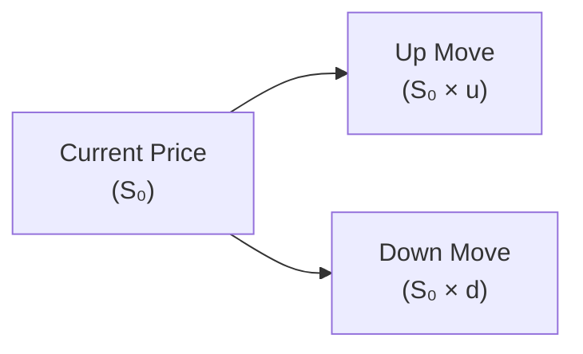
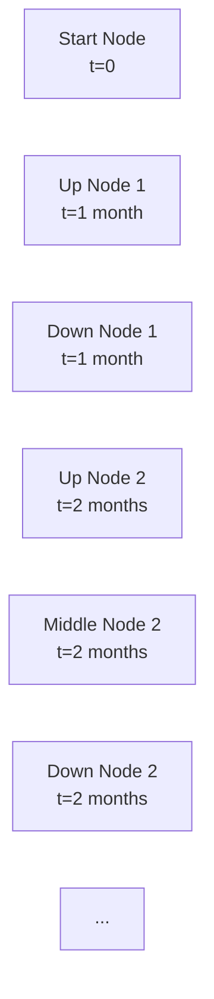

## 7.8 Black–Scholes–Merton and Binomial Model Overviews

Have you ever wondered how traders, analysts, and risk managers come up with those fancy theoretical prices for call and put options? You know, those neat numbers that flicker on your screen, making you think some mystical formula is at play? Well, you’re not too far off. Essentially, two major modeling approaches—the Black–Scholes–Merton (BSM) model and the Binomial model—form the backbone of modern option pricing.

Below, we’ll dig into each of these frameworks, share some personal impressions, and highlight their uses, advantages, and challenges. So buckle up (or maybe hold on to your cup of coffee) because we’re about to tour the fundamentals of how the world typically prices those elusive option contracts.

---

## Why We Need Pricing Models

Before diving into the specific models, let’s do a quick recap: an option’s price is made up of various moving parts. You’ve got:
• The underlying asset’s price  
• The strike price  
• Time to expiration  
• Volatility  
• Risk-free interest rate  
• Dividends (if any)

Different models attempt to capture how these factors shape the option’s fair value. The Black–Scholes–Merton approach is a continuous-time model that revolutionized finance, while the Binomial approach is a discrete-time model that’s tremendously flexible and especially helpful for American-style options.

---

## Black–Scholes–Merton Model

### Origins and Key Assumptions

Sometimes called the “holy grail” of option pricing, the Black–Scholes–Merton model was introduced in the early 1970s by Fischer Black, Myron Scholes, and Robert Merton. Originally crafted for European-style options, it gives an analytical (closed-form) formula for the fair price of a call or put option.

But here’s the kicker: the model has some assumptions that might sound a bit too perfect. For instance, it assumes:
• Markets have no frictions (no transaction costs or liquidity constraints).  
• Volatility remains constant over the option’s life.  
• You can borrow or lend at the risk-free rate continuously (i.e., continuously compounding).  
• Underlying price movements follow a lognormal distribution.  
• No dividends, or at least they are handled in a simplified manner (later modifications do incorporate dividends).

Now, do real-world markets obey these assumptions? Not exactly—volatility can change wildly in a short period, for one. Still, the BSM formula remains widely used and is often the go-to benchmark for quoting theoretical prices.

### The Mathematics in Brief

In the BSM framework, the price of a European call option C on a non-dividend-paying stock is typically given by:

(Using a simple representation for clarity)

C = S₀ Φ(d₁) – K e^(–rT) Φ(d₂)

where:
• S₀ is the current stock price.  
• K is the strike price.  
• T is the time to maturity (in years).  
• r is the continuously compounded risk-free rate.  
• Φ() is the cumulative distribution function (CDF) of the standard normal distribution.  
• d₁ and d₂ are given by  

d₁ = [ ln(S₀ / K) + (r + σ²/2) T ] / [ σ √T ]  

d₂ = d₁ – σ √T  

• σ is the volatility (standard deviation of the stock’s returns).

In plain English: We take the current stock price; multiply it by the probability (under the model) that the option will end up in-the-money. Then we subtract the present value of the strike payment, again multiplied by a similar probability factor. It’s like a balancing act of how much we expect the stock to exceed the strike versus how much we’d owe at expiry if the stock’s above the strike.

### Continuous Compounding and the Magic of “No Arbitrage”

Black, Scholes, and Merton used the so-called “risk-neutral” world, where everyone’s indifferent to risk, to get their pricing formula. No arbitrage means you can’t design a sure-win strategy out of thin air (or so the theory says). They used continuous compounding to ensure the math worked out nicely in a continuous-time setting.

### Adjustments and Real-World Tweaks

For markets that pay dividends, you can modify S₀ by subtracting the present value of expected dividends, or incorporate a dividend yield q. In that adjusted form, we’d use something like S₀ e^(–qT) in the formula. That’s helpful for pricing equity index options or single-stock options that pay known or assumed dividends.

But, as real as it might sound, it’s still a model. In practice, observed market prices can depart significantly from the BSM’s predictions. Implied volatility could vary by strike or maturity (known as the volatility smile/skew). Traders constantly calibrate the model to the market by updating implied volatilities for each option strike and expiry. This is one reason BSM is seen more as a framework or starting point rather than a final truth.

### Personal Tangent

I remember the first time I saw the BSM formula in a graduate finance class. My mind spun with all those “Greek” letters and exponentials. But after you see it in practice—like pulling up an option chain on your trading platform and noticing how changing implied volatility influences the option’s declared theoretical price—it clicks. It’s a powerful but idealized tool, and it’s often the place pros start when trying to gauge if an option is “cheap” or “expensive.”

---

## Binomial Model

### A Step-by-Step Price Tree

Now, the Binomial model is a bit different. Rather than using continuous-time calculus, it breaks up time into discrete intervals or steps. At each step, the price of the underlying can go “up” by a factor u or “down” by a factor d. The user picks a probability p that represents the “risk-neutral” chance of an up or down move. Once you move through all these branches in a “tree” fashion, you can eventually backtrack to the present to find the option’s fair value.

Here’s a small snippet of how you might visualize a single-period binomial tree:

- A is your starting point (S₀).  
- B is the “up” node: S₀ × u.  
- C is the “down” node: S₀ × d.

But in actual practice, you can break the entire time to expiration into multiple steps, building a large lattice or tree where each node splits into an “up” or “down” path. This approach is often called a “lattice” method.

### American vs. European Options

One of the superpowers of the Binomial model is that it can easily handle American-style options—i.e., options that can be exercised any time before the expiry. At each node (each time step), you check whether it’s optimal to exercise the option right then or hang on a bit longer. By comparing the “immediate exercise” value to the “hold” value, you can incorporate the possibility of early exercise. This is especially relevant for American puts on dividend-paying stocks.

### The Math Under the Hood

In each step:
1. S goes “up” with probability p to S × u.  
2. S goes “down” with probability (1 – p) to S × d.  
3. Risk-neutral logic sets p so that the expected return on the stock equals the risk-free rate.

At a node in the last period, the intrinsic value of the call or put is easy to compute. Then we keep discounting these payoffs backward, node by node, until we get to the option’s present value. If it’s an American option, we do an extra check at each node to see if immediate exercise is more profitable than continuing to hold.

### Personal Impression

The Binomial model can feel a bit more “hands-on” or “brute force” than the elegantly compact BSM formula. But that’s part of its charm. If you’ve ever tried to implement the Binomial method in a spreadsheet or a coding project, it’s straightforward: you just start at the end, pick your up/down parameters, your discount factor, and keep rolling backward. It might be a bit tedious, but it’s conceptually intuitive. Often, for teaching, it’s the very first model used to show how an option’s fair value is built step by step.

---

## Continuous vs. Discrete: Which One Should I Use?

### When Black–Scholes–Merton Shines

• You’re dealing with European-style options and you need a quick, closed-form solution.  
• The underlying pays no dividend (or you’re comfortable with a flat dividend yield).  
• You want a consistent “benchmark” for implied volatility.  

### When Binomial Steps Up

• American-style options dominate your trading strategy, and early exercise is on the table.  
• You need to handle discrete dividend payments at known times and amounts.  
• You like the clarity of a forward-looking lattice that can incorporate changing volatility or interest rates at each node.

Ultimately, you’ll see that real-world trading desks use a patchwork of methods, from the BSM approach with customized volatility surfaces to binomial or trinomial trees handling exotic payoffs. Sometimes, advanced Monte Carlo simulation or PDE-based finite difference methods come into play. (Yes, all that is a mouthful, but it underscores that real markets can be complex or “messy.”)

---

## Modern Extensions: Combining and Upgrading Models

### Monte Carlo & Beyond

Ever confronted a derivative that’s too complex for a neat formula or even a simple tree? That’s where Monte Carlo simulations come in handy. In a nutshell, you simulate thousands—even millions—of price paths for the underlying, compute the derivative’s payoff for each path, and then average and discount those payoffs back to present. Monte Carlo gives you a flexible approach that handles path-dependent options (like Asian options, where the payoff depends on the average price).

### Custom Volatility Structures

Sometimes, you just can’t assume volatility is constant. In practice, many quants input volatility “smiles” (or “skews”) so that different strike prices have different implied vol levels. For the binomial approach, you might let the volatility differ in each step. For BSM, you take the implied volatility from market data for each option. In reality, you’re constantly calibrating these models to the actual quotes you see in the order book.

### Continuous Monitoring with Tech Tools

If you want to experiment, the open-source QuantLib library is fantastic. It offers robust implementations for both BSM and Binomial trees, among many other fancy methods. Many professional risk management systems incorporate a variety of these models (and more) to manage large portfolios of derivatives in real time.

---

## Practical Canadian Regulatory Context

Now, if you’re in Canada, you might be asking: “Which model do I use to comply with CIRO guidelines for portfolio valuations?” Great question. According to the Canadian Securities Administrators (CSA), fund managers are expected to carry derivatives at fair value. That means your chosen approach—be it Black–Scholes–Merton, Binomial trees, or something else—must be justifiable, transparent, and consistent. Auditors typically look for “level 2” or “level 3” valuations for certain derivatives, ensuring that your approach is quite rigorous.

Also, the Bourse de Montréal’s Derivatives Fundamentals training modules, as well as CIRO’s official continuing education resources, highlight the importance of accurate pricing for compliance with capital requirements and risk oversight. If the derivative is especially complex, you might rely on specialized third-party valuations or advanced modeling.

---

## Common Pitfalls and Best Practices

• Overreliance on the BSM’s constant volatility assumption. Markets are dynamic, so implied volatility for each strike can vary day to day.  
• Ignoring discrete dividends in a model that only uses continuous dividend yield can cause mispricings for equity and index options.  
• Failing to adapt the Binomial model’s up/down steps to actual market volatility or interest rates may give inaccurate results.  
• Not stress-testing for “vol shocks.” In times of turmoil, the standard model assumptions can break down spectacularly.  
• Neglecting early exercise conditions for American options, especially with puts.  

On the plus side, these pitfalls can be avoided by continuously calibrating your model to prevailing market conditions, staying on top of dividend changes, and verifying that your modeling choices match the actual option contract specifications.

---

## Using Both Approaches in Real Life

Traders and risk managers often use the BSM formula for quoting and quick analysis. Meanwhile, a binomial or trinomial tree might stand behind the scenes to handle American-style idiosyncrasies. Even advanced practitioners will do a “reality check” with both methods to see if they converge or if there’s something unusual going on in the market (e.g., an upcoming dividend that’s not fully accounted for in the standard BSM approach).

---

## Example: Pricing a European Call with Black–Scholes–Merton

Let’s consider a simplified scenario:

• The stock’s current price (S₀) is $100.  
• The strike price (K) is $105.  
• Time to maturity (T) is 0.5 years (six months).  
• The risk-free rate (r) is 3% per annum, continuously compounded.  
• The volatility (σ) is 25% (annualized).  
• No dividends.

Walking Through the Steps:

1. Compute d₁:  
   – d₁ = [ ln(100 / 105) + (0.03 + 0.25²/2) × 0.5 ] / [ 0.25 × √0.5 ]

2. Compute d₂:  
   – d₂ = d₁ – 0.25 × √0.5  

3. Use the standard normal CDF Φ(d₁) and Φ(d₂) from a statistical table or software.

4. Plug into the formula:  
   – Call Price = 100 × Φ(d₁) – 105 × e^(–0.03 × 0.5) × Φ(d₂).

While I’m not dropping the exact numeric result here, you can see how formulaic it is. By adjusting any one of these inputs, you can quickly see how the resulting call price changes.

---

## Example: Pricing an American Put with a 3-Step Binomial Tree

Imagine we want to price a put option on a stock that pays a small discrete dividend in 1 month. Let’s break the time to expiration into three intervals. Each interval is 1 month for a total of 3 months to maturity.

1. We set up u and d factors. Possibly, u = e^(σ√Δt) and d = 1/u.  
2. We define a risk-neutral probability p = [ e^(rΔt) – d ] / (u – d ).  
3. Move forward in time: from the current stock price, you either go up or down after 1 month. The stock may pay a discrete dividend at the end of that month.  
4. Keep building the tree. At the final nodes (t = 3 months), the put’s payoff is max(K – S, 0).  
5. Discount each expected payoff backward to the previous node. For an American option, compare that discounted payoff to the payoff from early exercise (K – S if in the money).  
6. Continue discounting step by step until you reach t = 0. That final result is the American put’s fair value.  

That’s it in a nutshell. Sure, it can get complicated (especially if the dividend amount is uncertain, or if volatility changes monthly), but the general principle remains the same—even in advanced versions, like the Cox-Ross-Rubinstein (CRR) or Jarrow-Rudd binomial trees.

---

## References and Further Resources

• Bourse de Montréal Derivatives Fundamentals: Check out their online modules about futures and options. These often touch on pricing models and real-case examples for Canadian markets.  
• CIRO Guidelines: For official updates on how regulated Canadian dealers must handle derivatives valuations, see: [https://www.ciro.ca](https://www.ciro.ca)  
• CSA (Canadian Securities Administrators) Notices: Provide guidance on the fair value measurement of securities and derivatives in investment funds.  
• QuantLib (Open Source): A robust library implementing BSM, Binomial, Monte Carlo, and more. Perfect for students and professionals alike who want to experiment.  
• Online Course Platforms: Coursera, edX, and many universities offer free or low-cost courses discussing advanced derivative pricing and risk management techniques in detail.  

---

## Concluding Thoughts

Do you see now how these models shape the entire practice of options trading? The Black–Scholes–Merton model offers an elegant formula that powers so many trading systems. The Binomial model, with its flexible step-by-step approach, is an intuitive tool for exploring how an option’s value evolves—and for managing the quirks of early exercise. In the end, real professionals rarely rely on any single model in isolation. Instead, they adapt, combine, and calibrate them to fit changing market realities and regulatory requirements.

By working through examples, you can appreciate not only the theoretical beauty but also the practical limitations of these models. Embrace them as starting points—formulas that give you a sense of fair value and risk exposures. And remember, an informed trader or risk manager is always checking those assumptions against real data, scenarios, and sometimes a dash of gut feeling!

This completes our overview of the two foundational pricing frameworks for listed options. Next, we’ll explore more in-depth approaches to volatility and risk management, but for now, pat yourself on the back: You’ve just met the mathematical wizards behind the curtain.

---

## Sample Exam Questions: Mastering Black–Scholes–Merton and Binomial Model Overviews



### Which assumption is a key feature of the original Black–Scholes–Merton model?

- [ ] Volatility changes randomly over time.
- [ ] The underlying asset pays discrete dividends.
- [ ] Markets include significant transaction costs.
- [x] Volatility remains constant throughout the option’s life.

> **Explanation:** The original Black–Scholes–Merton model assumes constant volatility and frictionless markets, making it a simplified viewpoint of real-world conditions.

### Which approach is generally preferred for pricing American-style options?

- [x] Binomial tree model.
- [ ] Black–Scholes–Merton with no modifications.
- [ ] Black–Scholes–Merton with continuous dividends.
- [ ] Fixing volatility for each node.

> **Explanation:** The Binomial model easily accommodates early exercise features typically associated with American-style options by working through each node in the lattice.

### In Black–Scholes–Merton, which statement regarding “d₂” is correct?

- [ ] d₂ = d₁ × σ × √T
- [x] d₂ = d₁ – σ × √T
- [ ] d₂ = ln(σ) – d₁
- [ ] d₂ cannot be computed in closed form

> **Explanation:** Under BSM, d₂ is d₁ minus σ times the square root of time.

### The discrete-time framework for pricing options where an option price is computed at each node is known as:

- [x] The Binomial model.
- [ ] The Monte Carlo simulation.
- [ ] The Gamma–Theta approach.
- [ ] The Delta–Vega approach.

> **Explanation:** Binomial models build a tree (or lattice) of up/down movements to price the option step-by-step.

### In an American-style put option within a Binomial model, at each node you compare:

- [x] The value if held vs. the value if exercised immediately.
- [ ] The intrinsic value only.
- [ ] The call value at the same strike.
- [ ] The stock price movement at the next node.

> **Explanation:** American options can be exercised early, so you have to compare the immediate exercise value to the expected hold value at each step.

### One advantage of the Black–Scholes–Merton model is:

- [x] It gives a closed-form solution for European-style options.
- [ ] It automatically accounts for early exercise.
- [ ] It values interest rate swaps better than binomial methods.
- [ ] It adjusts automatically for discrete dividends.

> **Explanation:** BSM is a continuous-time closed-form solution for European-style options; it doesn’t handle early exercise or discrete dividends without modifications.

### In the Binomial model, the “risk-neutral” probability p is derived such that:

- [ ] The underlying price always goes up.
- [ ] The option payoff is zero at maturity.
- [x] The expected return of the underlying matches the risk-free rate.
- [ ] Dividends are canceled out.

> **Explanation:** In risk-neutral valuation, we align the expected growth of the underlying to the risk-free rate, allowing the model to be arbitrage-free.

### If a stock pays a discrete dividend during the life of an option, which model typically provides a straightforward way to incorporate this?

- [ ] The basic Black–Scholes–Merton formula without modifications.
- [x] The Binomial model using an adjusted price at the dividend node.
- [ ] The dividend yield approach from BSM alone.
- [ ] None of the above.

> **Explanation:** The Binomial model can easily handle discrete dividends by reducing the stock price at the ex-dividend dates, making it well-suited for dividend-paying stocks.

### Why might traders still use the Black–Scholes–Merton model even if markets deviate from its assumptions?

- [x] It’s a convenient benchmark and trading language for implied volatility.
- [ ] It perfectly captures all real markets.
- [ ] Regulators mandate it for American options.
- [ ] It always generates higher option prices than the Binomial model.

> **Explanation:** Despite its simplifying assumptions, BSM remains a common language among traders for quoting and comparing implied volatilities, making it a key benchmark.

### True or False: Monte Carlo simulation is a continuous-time closed-form solution used only for European options.

- [ ] True
- [x] False

> **Explanation:** Monte Carlo simulation is a more general numerical method for modeling all sorts of derivatives (including path-dependent) and is not a closed-form solution.


