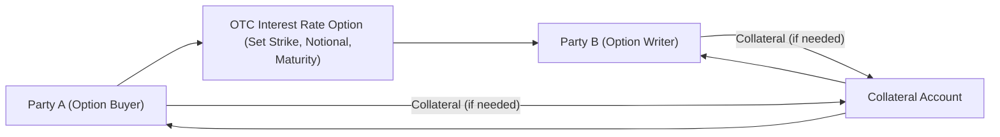
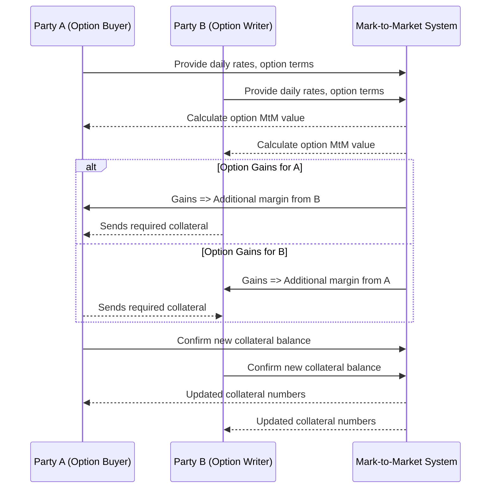

## 8.1 Over-the-Counter Interest Rate Options

Over-the-counter (OTC) interest rate options can feel both exciting and a bit perplexing at first, right? They’re a type of derivative that grants the holder the right, but not the obligation, to pay or receive a specified interest rate on a notional principal. In other words, it’s a handshaken deal (structured and documented carefully, of course) between two parties, designed to manage or speculate on fluctuations in interest rates without relying on big, centralized exchanges. Let’s start by exploring why these products even exist, and then zoom in on their features, pricing, and the regulatory framework around them.

You might remember from our earlier chapters that exchange-traded derivatives typically involve standardized contracts, with set contract sizes, maturities, and underlying rates or assets. OTC derivatives, on the other hand, get negotiated directly between two parties. They take customization to a whole new level. Let’s check out the main reasons why institutions and corporates turn to these flexible instruments.

---

### The Growing Need for Flexibility

Sometimes standardization just doesn’t cut it. I once chatted with a corporate treasurer who was desperately trying to manage a unique cash flow challenge. She said, “The off-the-shelf interest rate futures and exchange-traded options were too generic for our deadlines and payment cycles.” That’s precisely where OTC interest rate options come into play. They’re custom, they’re precise, and they’re all about matching your unique financial needs.

• A corporate borrower may want to cap the interest rate on a planned loan for exactly 42 months. Good luck finding an exchange-listed option with that maturity date.  
• A financial institution might need a multi-currency interest rate option that references uniquely structured underlying rates, such as a soon-to-be phased-out reference (like CDOR) transitioning to CORRA.  
• Sometimes you also want an option with an unusual notional amount, plus a specific strike rate that’s not offered on standard exchanges.  

In short, it’s that freedom to tailor the contract’s maturity, notional principal, and reference rate that makes OTC interest rate options so appealing.

---

### Key Features of OTC Interest Rate Options

An OTC interest rate option is basically a privately negotiated contract entitling one party (the buyer) to lock in a specific interest rate or path of rates without being forced to do so. Unlike your typical commodity or equity option, the underlying here is an interest rate index, such as:

• CORRA (Canadian Overnight Repo Rate Average) in Canada  
• SOFR (Secured Overnight Financing Rate) in the U.S.  
• SONIA (Sterling Overnight Index Average) in the U.K.  
• EURIBOR in the Eurozone  

and so on. The flexibility of the contract is the main difference from listed derivatives. Because they’re negotiated in private markets:

• The notional amount can be set to any dollar (or other currency) figure you like.  
• The option’s tenor (maturity) can be as short as a month or as long as multiple years—whatever meets your needs.  
• Payment structures, such as how and when the option premium is paid, can be customized.  
• The strike rate may use references like the forward curve on CORRA or an alternative measure of short-term interest rates.  

All of this gets documented under an ISDA Master Agreement. Think of it like a big rulebook covering everything from how trades are confirmed, to what happens if one party defaults, to how collateral is posted and managed.

---

### Bespoke Structures

Unlike the standard call and put structure in the equity world, OTC interest rate options can be shaped in many ways. For instance, you might find:

• Interest Rate Caps: A series of interest rate call options, each one covering a specific period, effectively creating a “cap” on borrowing costs.  
• Interest Rate Floors: A series of interest rate put options that set a minimum rate on floating receipts. If rates dip below the floor level, the floor writer compensates the floor buyer.  
• Collars: Combine a cap and a floor to keep your effective rate within a certain band.  
• Asian-Style or Barrier Features: You might even incorporate exotic provisions, like average rate payoffs or knock-out triggers if the rate hits a certain threshold.

OTC interest rate options can get very creative—so creative, in fact, that I’ve seen deals with overshadowing complexity that left everyone scratching their heads. That’s why it’s essential to maintain clarity and thoroughly document all terms.

---

### Underlying Benchmarks

The world is in the midst of a massive shift away from older benchmarks like LIBOR and CDOR toward risk-free rates like SOFR (U.S.) and CORRA (Canada). You can still find some legacy transactions referencing benchmarks on their way out, but new trades often use the updated reference rates.

• In Canada, CORRA has become a critical interest rate benchmark; it’s administered by the Bank of Canada and is more reflective of actual overnight funding conditions.  
• In the U.S., SOFR replaced LIBOR as the go-to benchmark for many dollar-denominated instruments.  

Because OTC contracts can be highly flexible, they can incorporate whatever reference rate you’d like. But the same flexibility can introduce additional complexity when the reference rate is new, less liquid, or hasn’t fully stabilized yet. That’s another reason you’ll see special fallback language in these contracts—just in case your chosen benchmark becomes unavailable or drastically changes.

---

### Pricing Approaches

Most practitioners rely on models such as the Black (1976) model, Black–Scholes–Merton adaptations, or short-rate models like Hull–White to value OTC interest rate options. To illustrate, let’s glance at a simplified version of the Black model for interest rate caps and floors.

If you’re pricing a caplet on an interest rate \\( L(t_{i}, t_{i+1}) \\) with strike \\( K \\), maturity \\( t_i \\), notional \\( N \\), the payoff at \\( t_{i+1} \\) might look like:


\text{Payoff} = N \times \left( L(t_{i}, t_{i+1}) - K \right)^+ \times \delta


where \\(\delta\\) is the day count fraction for the period. The standard Black formula for the caplet value at time 0 might be something like:


\text{Caplet Value} = N \, P(0,t_{i+1}) \Big[ L_f \Phi(d_1) - K \Phi(d_2) \Big] \delta


where \\( L_f \\) is the forward interest rate for the period \\((t_i, t_{i+1})\\), \\( P(0,t_{i+1}) \\) is the discount factor, and \\(\Phi(\cdot)\\) is the cumulative distribution function of the standard normal distribution. Terms \\( d_1 \\) and \\( d_2 \\) reflect volatility, time to maturity, and the relationship between \\( L_f \\) and \\( K \\). While these formulas can look intimidating, specialized libraries (like the open-source QuantLib) handle much of the math for you.

Of course, real-world pricing also considers credit spreads, the optionality embedded in the contract, and the term structure of interest rates. If your chosen reference rate is something like CORRA, you might adjust the volatility assumption to reflect its historical fluctuations, since CORRA’s behavior can differ from older benchmarks like CDOR.

---

### Risk Management & Collateralization

Let’s talk about risk—always a critical topic in derivatives. One of the biggest considerations with OTC interest rate options is counterparty credit risk: the chance the other party can’t meet its obligations. To mitigate this, counterparties typically negotiate a Credit Support Annex (CSA) as part of their ISDA agreement. Under the CSA, each side might post collateral (like cash or high-quality securities) based on daily mark-to-market valuations.

Below is a simplified diagram illustrating how two parties might structure an OTC interest rate option, along with collateral flows:

In this setup, both Party A and Party B post collateral into a segregated account (or bilateral accounts) whenever the market value of the position moves beyond certain thresholds. If one party fails to meet a margin call, the other can terminate the contract and use the posted collateral to offset potential losses.

---

### Practical Examples in the Canadian Context

When it comes to Canada, I’ve seen corporate treasurers use OTC interest rate options to hedge exposure to floating rates under a syndicated bank loan. Rather than using an exchange-traded interest rate future or options tied to a narrower set of maturities, they negotiate an OTC cap that precisely mirrors their loan’s principal repayment schedule and reference rate, which might be transitioning from CDOR to CORRA. This ensures that, if Canadian interest rates spike, the cap “kicks in,” limiting borrowing costs.

On the flip side, a Canadian pension fund might sell a floor on rates if they believe rates are unlikely to erode further, or if they have matching offset in other portions of their portfolio. By receiving premium income from writing that floor, they can enhance yield. The key is ensuring their interest rate exposure aligns with that position—otherwise, it’s a pure speculation bet.

---

### Relevant Regulations and Market Infrastructure

In Canada, the Canadian Investment Regulatory Organization (CIRO) and the Canadian Securities Administrators (CSA) mandate transparency and stability in OTC derivatives markets. If you’re entering a trade, you need to:

• Report transactions to a designated trade repository (TR). The TR collects data on notional amounts, counterparties, and key contractual terms.  
• Assess whether a transaction must be cleared through a central counterparty (CCP). While plain vanilla interest rate swaps often face mandatory clearing under certain thresholds, interest rate options may or may not be subject to these rules, depending on evolving regulations and trade size.  
• Comply with CSA Staff Notices (like 94-101) that outline the scope of derivatives reporting, clearing thresholds, and more.

The guidelines keep evolving, especially as reference rate reforms progress. Always check the CIRO website (https://www.ciro.ca/) or the CSA website for the most current details.

---

### Trade Reporting & Clearing

It can feel like a maze, but the RBCDs (Reporting, Booking, Clearing, Documentation) steps are vital:

• Reporting: Once the option is executed, each participant (or one delegated reporting party) must send transaction data to the designated TR, typically by T+1 (the day after the trade).  
• Booking: Document the trade in your internal system, ensuring it matches the ISDA confirmation.  
• Clearing: If your trade meets mandatory clearing requirements, you must clear it through an approved clearinghouse. Many interest rate swaps are subject to these rules, and some interest rate options might be drawn into that category.  
• Documentation: The ISDA Master Agreement and CSA remain your foundational legal documents. You might sign a separate confirmation that references these main agreements for each transaction’s specific details.

---

### Common Pitfalls and Best Practices

While the flexibility of OTC interest rate options is amazing, watch out for these pitfalls:

• Over-Complexity: Adding too many embedded features or exotic triggers can confuse both parties. Keep it as simple as your needs allow.  
• Creditworthiness: If your counterparty faces financial distress, your carefully planned hedge might evaporate unless you have robust collateral arrangements.  
• Misaligned Benchmarks: Let’s say your floating loan is pegged to CORRA but your purchased option references CDOR or an older benchmark. The mismatch can create a basis risk you didn’t expect.  
• Documentation Gaps: Inconsistent or incomplete paperwork under your ISDA and CSA can lead to major headaches down the line.  
• Unrealistic Volatility Assumptions: Pricing requires a good handle on implied and realized volatilities. Underestimating potential interest rate swings can cause big losses.

If you’re new to OTC derivatives, you might consider partnering with a reputable financial institution or advisor who can help you with best practices, from initial structuring to final settlement.

---

### Case Study: A Corporate Borrower Using an OTC Interest Rate Call Option

Imagine a mid-sized Canadian exporter that expects to draw down a floating-rate line of credit in six months, aiming to expand its production. They’re worried about rates spiking just as they ramp up borrowing. They want a 3-year maturity option that caps their borrowing cost at a comfortable level, say 5.5%.

1. They negotiate an OTC interest rate call option (cap) with their bank referencing CORRA.  
2. The notional amount matches the size of their upcoming loan (CAD 50 million).  
3. The strike is set at 5.5%, and the bank charges a premium for this protection.  
4. The day they draw on the line of credit, if CORRA plus the credit spread on the loan is above 5.5%, the option pays them the difference. If rates stay below 5.5%, the option expires worthless (but they keep peace of mind).  
5. Operationally, they sign an ISDA Master Agreement with the bank, plus a CSA outlining daily collateral calls, especially if the option’s market value moves significantly in their favor.

Anyway, that’s the gist of how a custom OTC interest rate option might shield a real-world borrower from interest rate shock.

---

### Additional Mermaid Diagram: Collateral Call Sequence

Let’s illustrate a possible daily valuation and collateral call scenario:

Note how the daily mark-to-market steps guide how much collateral each party must post or receive.

---

### References, Tools, and Resources

• CIRO Rules & Guidance: Check https://www.ciro.ca/ for updates on OTC derivatives reporting requirements, margin guidelines, and potential clearing obligations.  
• CSA (Canadian Securities Administrators): For bulletins on OTC derivatives, see notices like CSA Staff Notice 94-101.  
• QuantLib: Open-source library for pricing interest rate options (https://www.quantlib.org/).  
• “Interest Rate Markets” by Siddhartha Jha: A detailed book on interest rate derivatives, including OTC structures.  
• New York Institute of Finance online modules: Deepen your understanding of interest rate derivatives.

---

### Encouragement for Further Study

OTC interest rate options might initially sound complicated. But trust me, once you see how they can be sculpted to fit unique situations—like capping a corporate loan, creating structured yield products, or hedging a bank’s mortgage portfolio—they become downright addictive. The key is balancing that flexibility with an awareness of the complexities, from credit risk to regulatory compliance.

If you’re curious to learn more, test out some open-source pricing libraries, or check out advanced courses that delve deeper into stochastic modeling and multi-curve frameworks. And keep an eye on how reference rate reforms (like CORRA in Canada and SOFR in the U.S.) continue to shape best practices for building these instruments.  

Embrace the challenge: it’s a chance to customize your own sanctuary from the whirlwind of rising or falling interest rates.

---

## Sample Exam Questions: Over-the-Counter Interest Rate Options



### Which of the following best describes why market participants might choose OTC interest rate options instead of exchange-traded options?

- [x] They need more flexibility in setting notional amounts, maturities, and strike rates.
- [ ] They are looking to trade smaller, standardized contract sizes.
- [ ] They prefer the higher liquidity associated with standardized exchange products.
- [ ] They want to avoid using ISDA Master Agreements.

> **Explanation:** OTC interest rate options provide flexibility in customizing the strike, maturity, and notional amounts. Exchange-traded options are standardized, making them less adaptable to unique hedging or speculation needs.

### In Canada, which locally administered benchmark is replacing CDOR for many derivatives?

- [ ] LIBOR
- [ ] SOFR
- [x] CORRA
- [ ] EONIA

> **Explanation:** CORRA (Canadian Overnight Repo Rate Average) is the new primary risk-free reference rate in Canada, gradually replacing CDOR in many OTC interest rate derivative contracts.

### A company wants to use an OTC interest rate call option to limit borrowing costs on a future loan. The maximum rate at which they can borrow is known as:

- [ ] The floating rate
- [x] The strike rate
- [ ] The premium
- [ ] The margin rate

> **Explanation:** The strike rate in an interest rate call option sets the maximum interest cost a borrower pays. If the market rate exceeds that strike, the option compensates the holder for the difference.

### Which provision in an ISDA Master Agreement governs the posting of collateral for OTC derivatives?

- [ ] The Schedule to the ISDA
- [x] The Credit Support Annex (CSA)
- [ ] The Default Annex
- [ ] The Reporting Schedule

> **Explanation:** The CSA (Credit Support Annex) specifies how collateral is handled, including daily margin calls, types of collateral accepted, and thresholds for posting.

### Under the Black (1976) model for a caplet, which parameter primarily captures the market’s future uncertainty regarding interest rates?

- [ ] The discount factor
- [x] The implied volatility
- [ ] The day count fraction
- [ ] The strike adjustment

> **Explanation:** Implied volatility is used in the model’s \\( d_1 \\) and \\( d_2 \\) calculations, reflecting the market’s expectation of future variability in interest rates.

### What is a key risk associated with entering an OTC interest rate option without a CSA?

- [ ] You cannot exercise the option at maturity.
- [ ] The premium is determined by the exchange.
- [x] Counterparty credit risk increases significantly.
- [ ] The strike rate becomes invalid.

> **Explanation:** Without a Credit Support Annex, there is no agreed-upon mechanism for daily collateral posting. That heightens counterparty credit risk if the option goes deeply in-the-money for one party.

### Which regulatory body in Canada oversees dealer compliance and sets guidelines for OTC derivatives reporting?

- [x] CIRO
- [ ] IIROC (still active)
- [ ] MFDA (still active)
- [ ] FINTRAC

> **Explanation:** As of 2023, the new Canadian Investment Regulatory Organization (CIRO) has oversight for investment dealers and derivatives, replacing the legacy IIROC and MFDA bodies.

### Why might a lender write an interest rate floor?

- [ ] To fix a floating rate at the current level.
- [x] To hedge against lower interest income on floating-rate assets.
- [ ] To reduce margin requirements with an exchange clearinghouse.
- [ ] To eliminate the need for collateral posting.

> **Explanation:** A floor pays the buyer if interest rates fall below the strike, thus the writer of a floor typically benefits from premium income if it believes rates won’t drop significantly. It can also offset interest rate risk on floating-rate loans.

### Which of the following references is NOT commonly used in global OTC interest rate options?

- [ ] SOFR
- [ ] CORRA
- [ ] SONIA
- [x] Bitcoin network hash rate

> **Explanation:** Bitcoin’s network hash rate is unrelated to standard interest rate benchmarks. CORRA, SOFR, and SONIA are established benchmarks in Canada, the U.S., and the U.K., respectively.

### True or False: An OTC interest rate option can be structured with exotic features such as barrier triggers and Asian averaging.

- [x] True
- [ ] False

> **Explanation:** OTC derivatives are highly customizable and can include exotic payoff features, such as barriers or averaging mechanisms, to meet specific hedging or speculative needs.


