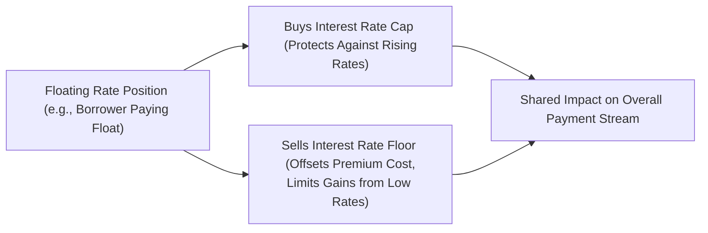

## 8.2 Interest Rate Caps, Floors, Collars

Interest rates can sometimes feel like the ocean tide—constantly moving and not always predictable. For companies (and individuals) dealing in floating-rate debt, this motion can create some stress. Will your borrowing rate shoot up next quarter? Could it drop below your comfort zone if you’re the lender? To reduce that element of suspense, the financial world created interest rate caps, floors, and collars. These tools (often referred to collectively as “interest rate derivatives”) are like life jackets or, maybe more accurately, seatbelts for interest rate fluctuations: they keep you secured within a certain range, so you can plan ahead. Let’s explore how.

Introduction  
Have you ever found yourself awake at 2 a.m., secretly wishing for “maximum on my mortgage interest rate”? Sure, that might not be a common statement with a friend over coffee, but it’s the kind of conversation that arises in boardrooms: “How do we protect ourselves from rates skyrocketing?” or “How do we make sure our income doesn’t crater if rates collapse?” In these situations, interest rate caps, floors, and collars come into play.

An interest rate cap is usually the go-to for borrowers who want an upper boundary on their floating-rate debt. An interest rate floor is for those with floating-rate assets (like lenders) who want a minimum guaranteed return. A collar, as you might guess, is something in between, combining a cap and a floor to create a range. Let’s talk about each one in detail.

## Basic Concepts of Interest Rate Caps
If you’re taking out a floating-rate loan, you’re likely exposed to the possibility that interest rates could rise and significantly increase your costs. Enter the interest rate cap: a series of call options (often called caplets) on a particular interest rate index (for instance, 3-month CDOR if you’re in Canada, or 3-month LIBOR in historical contexts, though we now talk more about CORRA or SOFR after benchmark reforms).

• The buyer of a cap pays an upfront premium.  
• Each caplet covers a single interest period in your floating rate schedule (e.g., every three months).  
• If the reference interest rate goes above the cap strike, you receive a payment that essentially compensates you for the extra interest cost.  

In effect, you’re locking in a maximum interest rate. So if rates surge, you’re covered. If they stay low or moderate, the cap never gets “activated,” but you’ve still paid your insurance premium.

Imagine you’re CFO of a mid-sized Canadian manufacturer, and you’ve got a floating-rate loan linked to the 3-month CDOR. You’re worried that if rates jump from 3% to, say, 5% or 6%, your interest expense takes a big bite out of company profits. By buying a cap with a strike at 4%, you’re sure that in any quarter when CDOR goes above 4%, you get paid the difference. It’s like capping your interest cost at 4%.

## Why Caps (and Floors) Matter
It might sound obvious, but limiting risk in a finance setting can be the difference between a stable business and one that can’t pay its bills. Borrowers typically love caps because it sets a ceiling on floating rates. Conversely, lenders often hold floating-rate instruments—like a variable-rate corporate loan they provided to a borrower, or floating-rate notes—and they prefer floors. Why? Because if rates tumble too much, their interest income does the same. By using a floor, they ensure a minimum return, even if the reference rate plummets.

Many years ago, I chatted with a credit manager who recalled, “Ah, I remember that time in 20XX when rates fell by 2% in a matter of months—we had no floor in place, so our return sank, and we scrambled to find alternative ways to keep up revenue.” That’s the essence of a floor.

## Structure of Caps, Floors, and Collars
Both caps and floors can be built from a series of individual options. Each single-period option is known as a caplet (call option on interest rates) or a floorlet (put option on interest rates). Why multiple options rather than just one big contract? Because floating rates reset periodically—every 1, 3, or 6 months, etc. By structuring the instrument in these distinct segments, the hedger can tailor each reset date’s coverage.

A collar typically involves:  
• Buying a cap (to set an upper limit on the interest rate).  
• Simultaneously selling a floor (to generate premium income that reduces or offsets the cost of the cap).  

Or it can be reversed: you might buy a floor (to set a minimum rate of return) and fund it by selling a cap. In any case, you’re creating a range: you won’t pay more than the cap, but you also won’t benefit from rates dropping below the floor (if you sold the floor).

The collar structure is visually represented below:

In this diagram, you can see how the borrower uses a cap to hedge the risk of rising rates while selling a floor to reduce or eliminate the cost of that hedge.

## Caplets and Floorlets Explained
Each caplet or floorlet applies to one interest period. For instance, if you have a 3-year floating-rate loan with quarterly resetting, you might have 12 caplets to cover 12 resets. Each caplet pays off if the reference rate ends up above the strike (for a cap) or below the strike (for a floor). The total value of a cap or floor is generally the sum of these individual caplets or floorlets, each discounted back to present value.

## Pricing Considerations
Pricing interest rate caps, floors, and collars can get quite technical, but here’s the gist:

• Forward Rates: You look at the market’s prediction for future interest rates (the forward curve).  
• Volatility: The more uncertain or higher the potential fluctuations in rates, the more expensive the caplet or floorlet.  
• Discount Factors: Each payoff is in the future, so you discount that payoff back to today using the appropriate discount rate.  

In practice, a quant or treasury team might use sophisticated models like Black’s model, which is a variant of the Black–Scholes approach tailored to interest rate derivatives. They’ll plug in forward rates for each period, an assumed volatility surface, and then calculate the present value for each caplet. Summing those up gives you the total cap premium. Floors follow the same logic, except they’re effectively put options on rates instead of calls.

## Zero-Cost Collar and Its Trade-Offs
One of the most popular collar strategies is the “zero-cost collar.” In a perfect scenario, the amount you receive from selling the floor exactly offsets the premium you pay to buy the cap. So you pay nothing upfront, but be aware: there’s no free lunch. By accepting a lower bound on your interest rate advantage (if rates fall, you won’t benefit below that floor level), you get the upper-limit protection at no upfront cost.

Why might a company choose that? For CFOs with tight budgets, zero-cost collars can be appealing: no immediate cash outlay. The trade-off is that if rates drop significantly, the borrower doesn’t reap the full benefit, because they’re effectively paying the sold floor strike. This can also be reversed—if you’re on the lender side, you might buy a floor and sell a cap.

## Real-World Applications
Borrowers often use caps to control their floating-rate risk. Think about a real estate developer with a construction loan that resets monthly. This developer wants enough capital to finish building an apartment complex but doesn’t want to get hammered if rates go up in the next year. A cap addresses that possibility.

Lenders use floors so that if rates collapse, at least they still get, for instance, 2% or 3% as a minimum yield on the loan. Collars can be used when you want both protection and a way to lower net premium costs. For instance, a Canadian oil and gas firm with large floating-rate lines of credit might lock in a collar to ensure interest expenses don’t balloon if the Bank of Canada hikes rates, while also tolerating that if rates slip, they won’t get the full savings.

## Practical Example: A Canadian Borrower’s Hedge
Let’s say a Canadian food manufacturer has a $10 million floating-rate loan tied to 3-month CDOR plus a small spread. To protect itself, the manufacturer buys a 3-year cap at a 4% strike. The cost of the cap is, hypothetically, $200,000 (paid upfront).

But the CFO finds that $200k a bit steep. So to lower the cost, the CFO sells a 2% floor. Now the floor sale yields, for example, $150,000 in premium. So the net cost for the collar is only $50,000. The firm accepts that if CDOR goes below 2%, they save less on interest, but they’re shielded if CDOR jumps above 4%.

In each quarter during the 3-year term:  
• If the 3-month CDOR is above 4%, the cap pays the difference for that period on $10 million.  
• If the 3-month CDOR is below 2%, the company owes the difference to the floor buyer (offsetting the interest savings below 2%).  
• Between 2% and 4%, the company just pays the floating rate normally without any compensation or obligation under the collar.  

## Regulatory Considerations and Best Practices
Because caps, floors, and collars are usually traded over the counter (OTC)—as opposed to exchange-traded options—there are various regulations to consider. In Canada, these regulations are overseen by the Canadian Investment Regulatory Organization (CIRO). Historically, you might have heard of IIROC and the MFDA, but those are now defunct since 2023; CIRO is the current integrated SRO. Some best practices include:

• Reviewing CIRO’s guidelines on OTC derivatives margin requirements.  
• For financial institutions, ensuring compliance with CSA (Canadian Securities Administrators) rules on trade reporting and clearing for certain OTC derivatives.  
• Checking if your counterparty requires a signed ISDA Master Agreement (International Swaps and Derivatives Association), which formalizes netting and collateralization.  

It’s also prudent to consult resources from the Bank of Canada (https://www.bankofcanada.ca/) for data on official interest rates, forward rate curves, and policy announcements. Doing so helps you gauge how much volatility you might face.  

## Whale Watching: Pitfalls and Strategy
One big pitfall with any derivative strategy is misunderstanding your true exposure. Someone might think, “Great, I have a cap, so I’m safe!” only to realize their notional is bigger than they can handle, or the resets aren’t timed with their loan payments. Another potential hazard is liquidity. If you need to exit the strategy early, you might deal with wide bid-ask spreads.

It’s also crucial to keep your board and your team informed about the nature of these derivatives. So many times, I’ve heard from neighbors in finance saying, “We set up a perfect hedge, but management didn’t fully understand we sold a floor.” Then rates plummeted and management was confused why they weren’t benefiting from the lower rates. Communication is key.

## Pricing Illustration Using Simplified Math
Consider a 1-year cap with quarterly resets on a $1 million notional, a 3% strike, and a forward curve that suggests interest rates might go from 2.8% to 3.5% over the year. Imagine we do a simplistic approach (not as robust as real Black’s model calculations, but just to illustrate):

1. Calculate potential payoffs in each quarter:  
   • Q1 payoff expected if forward rate > 3%.  
   • Q2 payoff if that forward rate > 3%, etc.  

2. Factor in a volatility measure. The higher the volatility, the more valuable the option.  

3. Discount each payoff back to present value using the appropriate discount rate.  

4. Sum them. That sum is your approximate fair premium for the cap.  

If you do the same for a floor with a 2% strike, you get a certain premium. If you wanted a zero-cost collar with a 3% cap and 2% floor, you’d find a strike combination where the premiums offset each other. 

## References and Additional Resources
• CIRO (https://www.ciro.ca): Canada’s main self-regulatory body, with guidance on OTC derivatives rules, margin guidelines, and compliance updates.  
• Bank of Canada (https://www.bankofcanada.ca/): Official interest rate data, forward curves, and policy announcements.  
• John C. Hull, “Options, Futures, and Other Derivatives”: Classic textbook with comprehensive coverage of interest rate options, including real exam-style questions.  
• Coursera’s “Financial Engineering and Risk Management” series: Great for deeper dives into the mathematics behind interest rate caps, floors, and collars, and for practical assignment-based learning opportunities.  
• ISDA (https://www.isda.org/) Master Agreements and protocols: Essential for understanding legal and netting aspects of OTC derivatives.  

## Conclusion
In essence, caps, floors, and collars give floating-rate borrowers and lenders the power to stabilize their interest costs or returns within a comfortable range. They’re like an adjustable thermostat for your interest rates: if it gets too hot, the cap cools things down; if it gets too cold, the floor warms it up. And for those who want the best of both worlds (with a dash of compromise), a collar seals the deal.  

But keep in mind the usual disclaimers: these are specialized instruments and come with complexities (premium costs, potential offsets, or early termination issues). Always do thorough due diligence, consult with finance and legal advisors, and ensure that your strategy aligns with your broader risk management framework. With the right understanding and precise execution, interest rate derivatives can be a powerful way to address the unpredictability of floating interest rates.

---

## Sample Exam Questions: Mastering Interest Rate Caps, Floors, and Collars



### For borrowers with floating-rate debt, an interest rate cap is generally used to:
- [ ] Ensure a minimum rate of return on deposits.
- [x] Set a maximum interest cost if rates rise above the strike.
- [ ] Provide unlimited interest rate exposure.
- [ ] Eliminate credit risk from counterparties.

> **Explanation:** By buying a cap, the borrower’s effective interest rate never exceeds the cap’s strike rate, mitigating the adverse effect of rising interest rates.

### Which of the following statements is true about interest rate collars?
- [ ] A collar refers to buying a cap and refraining from any other transaction.
- [ ] Collars are only possible if the premium for the cap is zero.
- [x] A collar usually involves buying a cap and selling a floor (or vice versa) to offset premium costs.
- [ ] A collar can only be used by central banks.

> **Explanation:** A collar typically consists of a cap and floor. Selling one option offsets the cost of buying the other, creating a range for the user’s effective interest rate.

### When pricing an interest rate cap, which factor is least relevant?
- [ ] The volatility of interest rates.
- [ ] The forward rate curve.
- [x] The current foreign exchange rate.
- [ ] The discount factors for each period.

> **Explanation:** While foreign exchange rates could matter in cross-currency settings, in a standard domestic interest rate cap, FX rates are not directly relevant. Volatility, forward rates, and discount factors are all crucial.

### How does a zero-cost collar typically get structured to have no upfront premium?
- [x] The premium from selling a floor (or cap) offsets the premium of buying a cap (or floor).
- [ ] By eliminating references to the notional amount.
- [ ] By using only physically settled options instead of cash settled ones.
- [ ] Only by employing synthetic call spreads.

> **Explanation:** Zero-cost collars combine the purchase and sale of options (cap and floor) so that the premiums swap out, resulting in little to no net cost.

### A firm that wants to protect against falling interest rates on a floating-rate asset while reducing premium costs might:
- [ ] Buy a cap and buy a floor simultaneously.
- [x] Buy a floor and sell a cap, forming a collar.
- [ ] Only buy a cap and ignore floors.
- [ ] Already be perfectly hedged with no additional action needed.

> **Explanation:** Owning a floating-rate asset benefits from higher rates but is hurt by lower rates. Buying a floor would lock in a minimum rate, and selling a cap offsets that premium.

### In the context of Canadian markets, which rate is a common reference for setting strikes on interest rate caps and floors?
- [ ] EONIA.
- [x] 3-month CDOR or CORRA-based rates.
- [ ] EURIBOR.
- [ ] GBP LIBOR only.

> **Explanation:** In Canada, 3-month CDOR (and increasingly CORRA-related indices) are popular references. Historically LIBOR was used internationally, but domestic markets favor local benchmarks.

### The cost of an interest rate cap:
- [ ] Decreases when volatility goes up.
- [ ] Is not dependent on discount factors.
- [ ] Only depends on the final settlement date.
- [x] Increases when the implied volatility of interest rates is higher.

> **Explanation:** Like all options, caps gain value (and cost more) as volatility rises because there’s a greater chance rates may move above the strike.

### An interest rate floor:
- [ ] Caps the interest rate a floating-rate borrower will pay.
- [x] Guarantees a minimum interest rate a floating-rate investor will receive.
- [ ] Is structured as a series of call options.
- [ ] Eliminates all credit risk of lenders.

> **Explanation:** Floors protect those receiving a floating rate by assuring a minimum rate if the market’s reference rate falls below the set strike.

### One potential downside of selling a floor as part of a collar is:
- [ ] Unlimited liability in the event of rising interest rates.
- [x] Forgone benefits if interest rates decline below the sold floor strike.
- [ ] The immediate compensation from the counterparty is too large.
- [ ] No offset in premium cost.

> **Explanation:** Selling a floor means you collect premium upfront, but if interest rates drop below your sold floor strike, you lose the benefit of those lower rates (or must compensate the buyer).

### True or False: By using a collar, a borrower can pay no premium and still enjoy complete flexibility if interest rates move below the floor strike.
- [x] True
- [ ] False

> **Explanation:** This is a trick question—collars generally eliminate upfront premium, but “complete flexibility” might be misleading. Typically, the borrower forgoes some benefit if rates go below the floor strike. However, many marketplace practitioners refer to these zero-premium structures as existing while still acknowledging constraints. The question’s phrasing suggests it is “True” in the sense that no premium is paid, but the trade-off is limiting gains below the floor; the question could be seen as ambiguous. In strict terms, the correct reading is that the collar is zero-cost but it does not grant complete freedom below the floor. Always read carefully!


