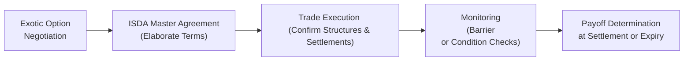

## 8.3 Exotic Options

Exotic options belong to a fascinating category of derivatives that go beyond the plain-vanilla calls and puts traded on organized exchanges. They are typically negotiated in the Over-the-Counter (OTC) market, which means traders and counterparties can tailor the contract terms to match very specific hedging, speculation, or investment objectives. If you’ve ever wished an option payoff could activate only when a certain barrier is hit, or you wanted your payout to be based on the average value of an index over a few months, exotic options might just be what you’re looking for.

But let’s be honest: these products can be pretty darn complicated. While there’s something exhilarating about the infinite possibilities, exotic options require a healthy dose of caution and thorough understanding. Sometimes, a friend in a corporate treasury department will mention using a barrier option that only kicks in if oil prices cross USD 80 a barrel. It sounds brilliant in theory—until there’s confusion about whether that price was hit intraday or at the close, or whether it must be sustained for two days instead of one. In other words, the complexity can create misunderstandings if the contract terms aren’t ironclad.

Below, we’ll unpack the core concepts of exotic options, explore their most common structures, talk about pricing approaches, and discuss the regulatory piece—particularly from a Canadian standpoint under the oversight of the Canadian Investment Regulatory Organization (CIRO) and the Canadian Securities Administrators (CSA).

---

## What Are Exotic Options?

An exotic option is any option contract incorporating features that diverge from the standard payoff structure of a call or put. These features can turn the payoff into something path-dependent (where the path the underlying asset takes matters), time-dependent (where certain time windows or specific dates matter), or contingent upon multiple underlying assets or conditions. 

Traders and risk managers often select exotic options when they need a hedge or trading position that can’t be replicated by a simple combination of vanilla options. For instance, a corporate hedger might want a payoff to start protecting against currency risk only if the exchange rate crosses a critical threshold that threatens profitability.

---

## Key Features and Characteristics

### Path Dependence

Path dependence means the value of the option depends not only on where the underlying asset ends up at expiration, but also on how it travels to get there. In a standard European call or put, the final price of the underlying near or at expiration is all that really matters. In an exotic option like a knock-in barrier option, though, the option might not even exist unless the underlying hits a certain barrier price at any point over the life of the contract.  

Here’s a quick example: Suppose we have a knock-in barrier option on gold with a barrier level of USD 2,000 per ounce. If gold never trades at or above USD 2,000 during the life of the option, the derivative simply never “activates.” This is path dependence at work—sometimes one quick price spike is enough to change your payout scenario altogether.

### Time Dependence

Some exotic options only become interesting (i.e., “alive”) during certain time windows. Consider a “window barrier” option that only monitors the underlying’s price during one week of each month. If the barrier is reached in that specific window, the barrier triggers—outside of that window, it doesn’t matter how wild the underlying moves.

### Complex Payoffs

Exotic options can have payoffs that are far from straightforward. For instance, a digital (binary) option pays a fixed amount of cash if the underlying is above (or below) a particular price at expiration. An Asian option uses an average of the underlying’s price over time rather than just the final day’s price to determine the payoff.  

---

## Common Types of Exotic Options

### Barrier Options (Knock-In and Knock-Out)

Barrier options activate or deactivate once a specified barrier price is reached. A “knock-in” barrier requires the underlying to hit or exceed (or drop below, in the case of a down barrier) a predetermined level before the option becomes valid. A “knock-out” barrier option ceases to exist if the barrier is touched.

• Up-and-In: The option appears only if the underlying price goes up to the barrier.  
• Up-and-Out: The option disappears if the underlying price goes up to the barrier.  
• Down-and-In: The option appears only if the underlying price dips to the barrier.  
• Down-and-Out: The option disappears if the underlying price dips to the barrier.  

And yes, there can be double barrier options, partial barrier options, and many more variations. It’s like customizing a pizza, but each topping drastically changes the entire risk and payoff profile.

### Digital (Binary) Options

Digital or binary options pay a fixed amount of cash (or nothing) depending on whether the underlying meets a specified condition. If you think an index will close above 4,000 points next Friday, you might take a digital call option that pays USD 1,000 if correct (and pays zero otherwise). These can be appealing to speculators looking for a straightforward, all-or-nothing bet, but keep in mind these can also be tricky to hedge and often have significantly higher implied volatility.

### Asian Options

An Asian option’s payoff depends on the average price of the underlying asset throughout the life of the option (or a specified period). For instance, a call option might pay out if the average price of oil from January 1 to March 31 is above USD 75. This averaging feature helps reduce the impact of very short-term price jolts, often making Asian options popular in commodities markets where spot prices can fluctuate wildly on a daily basis.

### Other Notable Exotic Options

• Lookback Options: The payoff depends on the optimal (lowest or highest) price of the underlying over the option’s life, allowing the holder to “look back” and pick the best price.  
• Compound Options: An option on an option—where you might have the right to buy a specific call (or put) at a future date.  
• Cliquet/Ratcheted Options: The strike resets at certain intervals, and gains might be locked in periodically.  

---

## A Quick Flow of How Exotic Options Work

Below is a simple diagram to illustrate the basic workflow of setting up and using an exotic option. Though every step can be more involved in real life, this flowchart should help you visualize the bigger picture:

• Negotiation involves deciding on the type of exotic option, strike prices, barrier triggers, notional amounts, and settlement style.  
• Documentation is usually done under an International Swaps and Derivatives Association (ISDA) Master Agreement, which spells out the standard legal terms. For exotics, there might be a schedule or special definitions appended to the standard ISDA framework.  
• After execution, both parties keep a close eye on the triggers. If it’s a barrier option, the relevant barrier levels must be monitored—ideally with robust data feeds—so there’s no dispute about intraday hits.  
• Finally, if the option remains valid until expiry (i.e., it wasn’t knocked out or never knocked in if that’s part of the conditions), you settle the payoff in cash or physically exchange the underlying asset.  

---

## Why Use Exotic Options?

• Customized Risk Management: A corporate treasurer might want to hedge currency risk but only if the exchange rate crosses a certain threshold that makes production unprofitable.  
• Cost Efficiency: An exotic structure could allow a company to lock in partial protection at a lower premium if the barrier is never reached.  
• Speculative Opportunities: Some hedge funds love the higher risk-return profiles that exotics can offer, especially digital options that can yield big payoffs if a forecast is right on point.  
• Unique Market Views: If you strongly believe that an asset’s price will remain within a tight band, a double-no-touch barrier option could let you profit handsomely by betting on market calm.

Of course, these instruments carry more complexity—so “cheaper” or “more precise” needs to be weighed against the difficulties of modeling, liquidity risk, and potential misunderstandings between counterparties.

---

## Pricing Exotic Options

Vanilla calls and puts often get priced using the Black–Scholes–Merton formula. Exotic options, however, require more advanced techniques. Because path dependency is central to many exotics, you’ll frequently see:

• **Monte Carlo Simulation:** Pricing is done by simulating thousands (or millions) of random price paths for the underlying. You track how often the barrier is hit, observe the average price for an Asian option, or check if the digital condition is met in each simulated path.  
• **Lattice (Tree) Models:** Binomial or trinomial trees can be extended to handle exotic features, especially if the barrier triggers can be evaluated at discrete time steps.  
• **Partial Differential Equations (PDEs):** In some cases, advanced PDE solvers are used for certain path-dependent payoffs, particularly if the payoff structure is identified early in a well-defined range.

These models are computationally heavier than plain-vanilla approaches, and they require more inputs—especially about volatility “surfaces,” interest rates, and correlation assumptions (if there are multiple underlying assets).

### Open-Source Tools

Fortunately, you don’t have to reinvent the wheel (or code your own PDE solver from scratch!) to explore exotic option pricing:

• [QuantLib](https://www.quantlib.org/): A robust C++ library (with Python wrappers) that includes capabilities for pricing various exotic options.  
• PyTorch or TensorFlow: While more commonly known for machine learning, these libraries can be used to build sophisticated neural-network approaches or partial differential equation solvers for complex pricing.  
• R’s “fOptions” package: Provides tools for pricing some exotic options (especially barrier options), although advanced features may require custom code.

---

## Risk Management and Documentation

OTC derivatives, especially exotic options, can introduce disputes if terms are not painstakingly documented. A small difference in the definition of “barrier observation” (e.g., “intra-day tick” vs. “closing price only”) can unravel deals and lead to major legal battles.

• **ISDA Master Agreement:** Nearly all large institutions that trade OTC derivatives rely on the ISDA Master Agreement and the ISDA Definitions. The 2002 ISDA Definitions provide a standardized language for exotic features—like specifying how “knock-in” is determined or how final payoffs are calculated.  
• **Counterparty Credit Risk:** The more complex the option, the more challenging it can be to hedge. Strong credit lines, collateralization, and netting provisions are crucial.  
• **Ongoing Monitoring:** Automated triggers or event notices help reduce confusion over whether a barrier was breached or not.  

---

## Regulatory Considerations in Canada (CIRO/CSA)

Within Canada, complex OTC derivatives fall under the scrutiny of the Canadian Investment Regulatory Organization (CIRO) and the CSA. While CIRO continues many of the regulatory functions that were historically split between IIROC and the MFDA (which are now defunct), the environment for OTC derivatives has evolved significantly in the past few years. Here are a few key points:

• **CSA OTC Derivatives Rules:** The CSA has introduced a suite of rules around trade reporting, registration, business conduct, and clearing requirements. Many exotic options, especially those with large notional amounts, could trigger mandatory reporting obligations to recognized trade repositories.  
• **CIRO Requirements:** While many small or “traditional” OTC trades might not be exchange-traded or cleared, overarching market integrity and investor protection guidelines still apply. CIRO encourages robust record-keeping, suitable margin or collateral policies, and regulatory audits to ensure participants fully understand the complexities of these instruments.  
• **Harmonization with Global Reforms:** Post-financial-crisis reforms (driven by bodies like IOSCO and the FSB) have nudged Canada toward more transparent and standardized OTC derivatives markets. Although exotic options aren’t standardized, the push for central clearing—where possible—continues to grow.  

When dealing with a new, exotic structure, it’s prudent to consult with your firm’s compliance team to ensure the contract aligns with any new provincial or federal regulations, as well as CIRO’s guidelines for risk management and best execution.

---

## Practical Example: A Knock-In Barrier Currency Option

Let’s say we have a U.S.-based company concerned about USD/CAD exchange rates dropping below 1.20, which would hurt their revenue when converting from CAD to USD. They enter a knock-in barrier option with a barrier at 1.20:

1. **Structure:** The company buys a call option that knocks in if USD/CAD hits 1.20 anytime in the next six months.  
2. **Payoff Goal:** If USD/CAD actually trades at or below 1.20, the option “knocks in,” giving the company the right to convert CAD at a more favorable rate if it continues to drop further.  
3. **Possible Outcome:** If the barrier is never touched, the option never becomes active, so the company saves on premium relative to a standard call but forfeits any potential payoff if the barrier wasn’t reached.  
4. **Settlement Style:** Let’s say it’s cash-settled. The company receives the difference between the spot rate at expiry and the option strike, multiplied by their contract notional, if in-the-money.  
5. **Regulatory and Documentation:** This all goes under an ISDA schedule with explicit barrier observation criteria, and the notional is reported per CSA requirements to a recognized trade repository.

---

## Challenges and Pitfalls

• **Illiquidity:** Exotic options typically trade in less liquid OTC markets. If you want to exit an exotic position early, it’s not like a vanilla option you can just sell on an exchange.  
• **Complex Modeling:** Barrier triggers, multiple underlying assets, or time windows can lead to intricate models. A small misestimation in volatility or correlation can lead to mispricing.  
• **Disputes Over Trigger Events:** “Wait, the underlying touched 1.1998 at 3:01:15 PM. That is not 1.20, so the barrier wasn’t breached!” This level of forensic detail can create real tension if not handled properly in contract terms.  
• **Higher Counterparty Risk:** With more customized structures, you’re likely to deal with a single counterparty or a small group. If that counterparty fails to honor the contract, or if there’s a dispute over the payoff, it can be complicated to resolve and enforce.  

---

## Best Practices for Using Exotic Options

• **Clarity in ISDA Documentation:** Spell out barrier observation mechanics, time windows, settlement styles, triggers, fallback provisions—be as specific as possible.  
• **Accurate Modeling:** Ensure your valuation model is robust. Use Monte Carlo or other numerical methods that can capture the exotic features.  
• **Stress Testing:** Because of path dependence, it’s vital to run scenario analyses that incorporate outlier moves, even if you think “that’ll never happen.”  
• **Credit and Collateral Arrangements:** Hedge your exposure to the possibility that your counterparty can’t pay.  
• **Regulatory Compliance:** Register your trades properly with recognized trade repositories and keep an eye on any new rules from CIRO or CSA that may impact how you must structure or report these instruments.  

---

## Real-World Anecdote

I once heard about a mining company that wanted a barrier option on copper prices. After months of negotiation, they hammered out the details—only to discover that the data feed for copper futures they were using sometimes had a five-second delay. Well, guess what? One day, copper soared in the actual (motion in the) market, triggered the barrier, but the delayed feed made it look like it hadn’t triggered. Cue confusion, phone calls, and a quick upgrade to real-time quotes! The moral? Don’t underestimate the importance of data quality and timing alignment.

---

## Additional References and Resources

• **CIRO Website (https://www.ciro.ca):** The authoritative source for Canadian derivatives market integrity guidelines and membership rules.  
• **CSA’s OTC Derivatives Framework:** Check your local provincial/territorial regulator for exact reporting requirements and business conduct rules.  
• **ISDA 2002 Definitions:** A must-have for standardized language covering exotic option triggers and settlement.  
• **QuantLib (https://www.quantlib.org/):** Great open-source library in C++/Python for advanced derivative pricing.  
• **“Exotic Options and Hybrids” by Mohamed Bouzoubaa and Adel Osseiran:** A comprehensive text that delves into structuring and pricing.  
• **EDHEC Business School’s MOOCs on Advanced Derivatives:** Programs covering exotic payoff structures, including barrier and digital derivatives.  

---

## Encouraging a Deeper Dive

Exotic options can be exhilarating to study—honestly, once you realize how creative you can get with unique payoffs, it’s an endless sandbox. But with that creativity comes a responsibility to manage the risks, ensure clarity in legal definitions, and comply with all regulatory requirements (especially around trade reporting and risk management). If you decide to explore exotic options further, consider building a small prototype pricing model in Python using QuantLib or reading up on real-world case studies from international banks or corporations that use barrier and Asian options to manage commodity or currency exposures.

No matter your motivation—hedging, speculating, or just geeky curiosity—the complexities of exotic options demand diligence, a willingness to learn, and an appreciation for thorough, precise documentation. They are not for the faint of heart, but with the proper foundation, they can prove to be powerful tools in your financial toolbox.

---

## Sample Exam Questions: Exotic Options Knowledge Check



### Which of the following best describes a path-dependent exotic option?

- [ ] An option whose payoff depends only on the final underlying price at expiry.
- [ ] An option that is always exchange-traded. 
- [x] An option whose payoff depends on the entire price trajectory of the underlying during the life of the option.
- [ ] An option that pays a fixed amount if in the money.

> **Explanation:** Path dependence means that what happens at every point (or certain points) in time can affect the option's eventual payoff, unlike a standard vanilla option.

---

### Which of the following is the fundamental characteristic of a barrier option?

- [ ] It allows for unlimited profit with zero risk.
- [x] It activates or deactivates if the underlying crosses a predefined price level.
- [ ] It always requires physical delivery of the underlying.
- [ ] It resets its strike price at regular intervals.

> **Explanation:** Barrier options have “knock-in” or “knock-out” features tied to specific trigger prices. Crossing that threshold either creates or cancels the option.

---

### Which technology or software library is commonly used in pricing complex exotic options through Monte Carlo simulations?

- [x] QuantLib
- [ ] Microsoft Word
- [ ] Bloomberg Chat 
- [ ] Adobe Acrobat  

> **Explanation:** QuantLib is an open-source library widely used to price a range of derivatives, including exotics, via simulation and other numerical methods.

---

### In an Asian option, the payoff is determined by:

- [x] The average of the underlying price over a specified time.
- [ ] The highest price of the underlying during the contract's life.
- [ ] A guaranteed fixed premium regardless of how the underlying moves.
- [ ] The exchange rate on the final day of trading only.

> **Explanation:** Asian options take an average (arithmetic or geometric) of the underlying's price across a pre-defined timeframe to determine the final payoff.

---

### What is a key regulatory concern for exotic options trading in Canada's OTC market?

- [x] Accurate and timely trade reporting to recognized trade repositories.
- [ ] Eliminating all risk of negative payoffs for retail accounts.
- [ ] Transferring all contract settlement to the Bourse de Montréal.
- [ ] Allowing unlimited leverage for all market participants.

> **Explanation:** The CSA and CIRO emphasize robust risk management and mandatory reporting for OTC derivatives under Canada’s regulatory framework.

---

### Which best describes a digital (binary) option?

- [ ] An option that pays a variable amount depending on daily closing prices.
- [x] An option that pays a fixed amount if the option is in the money at expiry (or upon a triggering event).
- [ ] An option that can only be exercised monthly.
- [ ] An option that automatically unwinds at a pre-set time daily.

> **Explanation:** Binary (digital) options provide a fixed payoff if the underlying meets or exceeds a specific threshold, often making them “all or nothing.”

---

### What is the main benefit of using an Asian option for a commodity hedger?

- [ ] It allows them to choose any settlement date after seeing final prices.
- [x] It reduces exposure to extreme short-term price spikes by averaging.
- [ ] It guarantees a profit in volatile markets.
- [ ] It never requires an ISDA Master Agreement.

> **Explanation:** By using an average price, Asian options moderate the impact of sudden price movements, which is beneficial for certain hedging strategies.

---

### Which statement about exotics is correct?

- [x] Their complex payoffs often require advanced numerical methods like Monte Carlo to price accurately.
- [ ] They are simpler to price than vanilla options.
- [ ] They always have higher liquidity than vanilla options.
- [ ] They are only used by retail traders.

> **Explanation:** Path dependency and customized triggers introduce modeling complexity for exotic options, making advanced computational methods essential.

---

### What is a common pitfall with barrier options?

- [ ] They often trade exclusively on regulated exchanges, eliminating disputes.
- [ ] They never have a variable payoff.
- [ ] They are cost-free to both parties.
- [x] Disagreements can occur over whether the barrier was triggered, especially with intraday price data.

> **Explanation:** Barrier triggers can be subject to disputes if contract terms or market data (e.g., intraday ticks vs. closing prices) aren’t established clearly.

---

### True or False: An ISDA Master Agreement is rarely used for documenting exotic options.

- [ ] True
- [x] False

> **Explanation:** ISDA Master Agreements, along with any relevant schedules, are commonly used to establish the legal and operational framework for OTC derivatives, including exotics.


