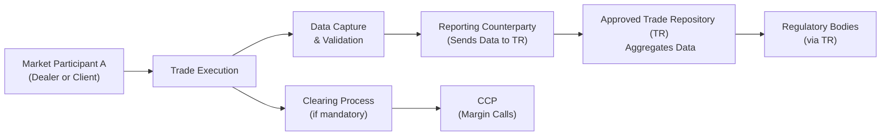

## 8.4 CIRO/CSA Guidelines on OTC Derivatives Reporting & Clearing

Over-the-counter (OTC) derivatives have long been a crucial way for businesses, financial institutions, and even some individual investors to manage a variety of risks—from interest rates to currency fluctuations. But as you might suspect, with great flexibility comes a fair amount of regulatory complexity. That’s where CIRO (the Canadian Investment Regulatory Organization) and the Canadian Securities Administrators (CSA) step in, setting guidelines on how these contracts are reported, cleared, and ultimately kept in check to protect everyone involved. 

You know, I once chatted with a friend who was setting up an OTC interest rate swap for his midsized company. He initially found the concept exciting—a customized hedge to stabilize borrowing costs. Then the dreaded compliance aspect kicked in: trade repositories, margin calls, daily valuations, and this big swirl of acronyms (CSA, CCP, TR, and so on). He told me it felt like learning an entirely new language. That’s precisely why a clear understanding of the rules can reduce a lot of that stress. So, let’s take a thorough (yet slightly informal) journey through these regulations and hopefully demystify the entire process.

---

## Regulatory Foundations: A Quick Refresher

### Canada’s Multi-Regulator Environment

If you’ve ever dealt with Canadian financial regulations, you’ll know it’s a bit unique because each province and territory retains some sovereignty over its securities rules. But in the interest of national consistency (and to avoid a patchwork of local laws), the Canadian Securities Administrators (CSA) proposes harmonized frameworks. CIRO, which now oversees investment dealers (formerly the purview of IIROC) and mutual fund dealers (previously the MFDA’s domain), works closely with the CSA to implement and enforce these frameworks.

### Why Regulate OTC Derivatives?

• OTC derivatives are often bilateral (i.e., traded privately between two parties) and can be highly customized.  
• Historically, they operate outside of traditional exchanges and clearinghouses, raising concerns about transparency and systemic risk.  
• Lessons from the 2008 financial crisis showed the ripple effects caused by un-cleared and under-collateralized derivatives.  
• Regulators require trade reporting to shine a light on the size and scope of these markets. They also encourage or mandate central clearing where possible, to mitigate counterparty credit risk.

---

## Key Terminologies

Before diving deeper, let’s decode some of the main terms you’ll see in any discussion of OTC derivatives reporting and clearing:

- **Trade Repository (TR):** A centralized registry that gathers information on OTC derivative transactions (e.g., notional amounts, counterparties, effective dates). Once reported, regulators can analyze the data to monitor for potential market abuses or emerging risks.

- **Mandatory Clearing:** A regulation requiring certain standardized derivatives to be cleared through a central clearing counterparty (CCP). This also means margin requirements will apply, ensuring each participant posts sufficient collateral.

- **Central Clearing Counterparty (CCP):** The entity that stands in between the buyer and seller once a trade is cleared. By becoming the “buyer to every seller” and the “seller to every buyer,” the CCP guarantees performance to both parties, drastically reducing credit risk.

- **Initial Margin:** Collateral posted at the start of a derivatives contract to cover potential future exposures. Think of it as a security deposit that the CCP (or bilateral counterparty) can hold onto in case the position sours.

- **Variation Margin:** Collateral exchanged on a periodic basis (often daily) to reflect changes in market value. If the derivative moves against you, you pay variation margin; if it moves in your favor, you might collect variation margin.

- **Systemic Risk:** The possibility that the failure of one institution or disruption in a market segment could spread to the broader financial system. This is exactly what regulators hope to address by imposing reporting and clearing obligations.

- **Regulatory Penalties:** Fines, sanctions, or other measures that regulators can impose for failing to comply with rules. Nobody wants them, so you definitely want to pay attention here.

- **Threshold:** A specified volume or notional level above (or below) which certain obligations—like mandatory clearing—may apply. Firms have to keep an eye on these thresholds as their trading activity ebbs and flows throughout the year.

---

## Overview of Reporting Requirements

### Purpose of TR Reporting

The idea behind mandatory reporting is simple: regulators and market participants need a holistic view of who is exposed to what risk. By requiring each OTC derivatives trade to be reported to an approved Trade Repository (TR), regulators can identify:

1. Concentration of counterparty exposures.  
2. Potential correlated risks across institutions, regions, and asset classes.  
3. Early warnings for liquidity crunches or solvency concerns.

It’s like turning the lights on in a dark room so that everyone can see if there are obstacles to avoid.

### Who Reports?

Under CIRO/CSA rules, generally the “reporting counterparty” takes on the responsibility of transmitting complete and accurate trade data to an approved TR. The determination of which side is the reporting counterparty can depend on factors like:

• Whether one side is a “derivatives dealer” authorized or recognized under provincial regulations.  
• Whether a global entity is facing a locally registered dealer.  
• Specific provincial or territorial guidelines that may set up a waterfall approach (dealers, then large institutions, etc.) to decide who must report.

### What Gets Reported?

Trade details typically include:

• Counterparty information: Type of entity, location, business type, etc.  
• Trade economics: Notional amount, effective date, termination date, payment frequencies, rates, and so on.  
• Value terms: The present value or mark-to-market (where relevant).  
• Collateral: The amount and type of collateral posted, including if it’s cash, government securities, or something else.

### Timelines and Accuracy

Regulations often specify tight deadlines for reporting—often T+1 (the day after the trade) or even same-day if the infrastructure supports it. Accuracy is of paramount concern, since outdated or incorrect data doesn’t help regulators and can expose you to compliance risk. Firms must have robust middle- and back-office systems, or rely on external service providers, to ensure data integrity.

---

## Mandatory Clearing Obligations

### Why Mandatory Clearing?

Back in the day, OTC derivatives lived exclusively off-exchange, so participants bore direct credit risk to each other. After the 2008 crisis, policymakers globally agreed that standardized derivatives should go through central clearinghouses (CCPs) whenever possible. Clearing reduces bilateral credit risk, because:

• Each party faces the CCP. If one party defaults, the CCP steps in to ensure the other side remains whole.  
• CCPs manage risk daily through margin calls and real-time system monitoring.  
• The clearing process fosters standardized contracts, thereby streamlining risk management.

### Which Derivatives Fall Under Mandatory Clearing?

Not all OTC derivatives must be cleared. But a chunk of them—especially certain interest rate swaps in major currencies (like CAD, USD, EUR, GBP) and some credit default swaps—may fall under these rules. The CSA, in cooperation with CIRO, periodically updates the list of derivatives subject to mandatory clearing.

Market participants should keep a close watch on relevant CSA notices (for example, published on the CSA’s website: [https://www.securities-administrators.ca/](https://www.securities-administrators.ca/)) and check for expansions of the clearing obligation to other asset classes, such as foreign exchange derivatives in certain or newly added currency pairs.

### Exemptions and Thresholds

It’s important to note that certain “end-users” or smaller participants might qualify for exemptions if they stay below designated thresholds. For instance, a small agricultural cooperative hedging commodity price risk might get an exemption from mandatory clearing if its total notional amount in derivatives stays under a certain limit. However, these thresholds can change, so it’s wise to regularly check for updates. Non-compliance (e.g., failing to clear when you’re mandated to do so) can lead to regulatory penalties.

### Clearing Mechanism and Collateralization

Once a derivative is accepted for clearing, the clearinghouse (CCP) requires that each side post initial margin. Variation margin follows daily (or more frequently in periods of high volatility). The aim is to ensure that, at any given point, the CCP has enough collateral to manage the default of one or more clearing participants. 

This approach, while beneficial to overall stability, does demand that participants maintain liquid assets which can be posted as margin. In essence, clearing can significantly raise the cost of trading OTC derivatives, especially for buy-side institutions that do not net out their exposures across many counterparties.

---

## Operational Systems & Reporting Workflow

Let me be honest: The technology bit can be daunting if you’re new to it. You need solid systems or third-party solutions that can handle:

1. **Trade Capture**: The moment a trade is executed, details feed into a system that normalizes and cleans data.  
2. **Valuation & Lifecycle Event Management**: Swaps can have resets, calls, or even triggers that affect the notional. Your system must track it all in real time.  
3. **Collateral Management**: As initial and variation margins shift, you’ll want automated workflows to notify you of margin calls, generate statements, and handle any collateral settlements.  
4. **Reporting**: T+1 can be tight, so your system must feed trade data to the relevant TR in the correct format. If you rely on manual spreadsheets, watch out for errors.  

To illustrate how this process might look in a simplified workflow, see the Mermaid diagram below:

In the above, once a transaction is executed (B), the details flow to your system for cleansing and validation (C). The designated reporting counterparty then sends the data to the Trade Repository (D and E). Simultaneously, if it’s a product under mandatory clearing, the participants must route it through a clearinghouse (G) which handles margin calls (H). Finally, regulators can access that data from the TR to keep an eye on market stability (F).

---

## Collateralization and Margin Requirements

### Initial Margin

Think of initial margin as your “down payment” on a derivatives transaction. For transactions subject to central clearing, this margin is set by the CCP based on parameters like historical price volatility, liquidity of the underlying, and default risk. Bilateral (i.e., uncleared) trades may also require initial margin per CSA guidelines—especially for large financial institutions. 

### Variation Margin

Variation margin is basically the daily (or sometimes intraday) settlement of losses and gains. If you’re losing on your position, margin payments will flow out of your account. If you’re gaining, funds might flow in, or at least reduce your net margin requirement. This ensures that each party’s position is marked-to-market on an ongoing basis, preventing large uncollateralized exposures from building up.

### Standardization of Margin Rules

In Canada, margin rules for bilateral trades have been gradually harmonized in line with global efforts such as the BCBS-IOSCO (Basel Committee on Banking Supervision and International Organization of Securities Commissions) framework. In fact, there’s a push for standardized calculation methodologies and endorsements of independent third-party margin models. This standardization fosters consistency, reduces the risk of a race to the bottom in margin practices, and helps to prevent a systemic crisis if, say, a major participant defaults.

---

## Non-Compliance Risks and Penalties

You might be thinking, “What if my firm’s compliance department overlooks some of these obligations?” The short answer is: Don’t. Non-compliance can lead to a host of regulatory penalties, from monetary fines to stricter oversight, or in severe cases, restrictions on your capacity to trade derivatives. 

CIRO and the CSA regularly publish enforcement bulletins highlighting cases where participants have either misreported trades, failed to clear standardized derivatives, or missed margin calls. It’s a bit like those moral-of-the-story tales: you learn from others’ mistakes so you’re not the one paying the penalty.

---

## Keeping Up with Regulatory Evolutions

Remember when your teacher used to remind you that “Math is cumulative”? In Canadian derivatives regulation, it’s not only cumulative—it’s also constantly evolving. The CSA regularly updates the list of mandated derivative products for clearing and the associated thresholds. So if your notional volumes creep up, you could pass from the “exempt” category into the “mandatory” clearing bucket before you realize it. Checking for rule amendments and bulletins on the CIRO or CSA websites is essential.

Additionally, you may see expansions in the use of distributed ledger technology or other innovations that could streamline reporting (or even real-time data sharing). The point is: Stay flexible. Keep your processes nimble so you can pivot if, say, the CSA decides that more foreign-exchange swaps require clearing next year.

---

## Practical Example: Clearing a Standardized CAD Interest Rate Swap

Let’s walk through a hypothetical scenario. Suppose your firm wants to enter a standard five-year interest rate swap in Canadian dollars—fixed rate for floating CDOR (although, remember that Canada is phasing out CDOR in favor of CORRA, so interest rate benchmarks are evolving, too).

1. **Execution:** Your trading desk agrees on a 2.50% fixed rate in exchange for a floating rate referencing CDOR plus a certain spread.  
2. **Eligibility for Clearing:** Per the current CSA list, standardized CAD interest rate swaps with a typical notional and maturity might be subject to mandatory clearing.  
3. **Clearing Submission:** Because your firm is a derivatives dealer, it’s automatically subject to clearing obligations once it crosses the threshold. You promptly submit the swap to a recognized CCP (e.g., LCH, CME Clearing, or another CCP recognized in Canada).  
4. **Margin Posting:** The CCP calculates an initial margin requirement for your position. Let’s say it’s CAD 2 million for a CAD 100 million notional swap. You post that in cash or government bonds, depending on what the CCP accepts.  
5. **Daily Variation Margin:** As the swap’s mark-to-market moves, you might pay or receive variation margin daily. If interest rates rise, your fixed rate position might lose value, prompting you to pay margin (and vice versa).  
6. **Reporting to TR:** Because you’re a reporting counterparty, you also send your trade details to an approved TR. This includes the notional amount, start date, end date, and the key terms.  
7. **Regulatory Access:** CIRO or other provincial regulators can tap into the TR database and see your position. If there’s a sudden market displacement, they can spot that your exposure is accounted for within the clearinghouse framework.

This example should give you a flavor of how these processes integrate. And hopefully, it feels less daunting when you see the big picture.

---

## Best Practices and Common Pitfalls

### Best Practices

1. **Automation**: The more you automate reporting and margin processes, the less likely you’ll slip up on T+1 deadlines or data accuracy.  
2. **Regular Training**: Keep your team updated on regulatory changes, especially those from CIRO or CSA bulletins.  
3. **Collaborate with Legal/Compliance**: Maintain open lines of communication so that if thresholds or obligations shift, the trading desk gets the memo promptly.  
4. **Internal Controls**: Periodically audit your processes. Check if your data feed is correct, and if your margin calculations align with CCP or bilateral margin models.

### Common Pitfalls

1. **Inconsistent Data**: Failing to update the TR if a trade is amended can lead to a mismatch between your books and official records.  
2. **Threshold Complacency**: Sitting just below the clearing threshold and not paying attention to new trades that push you over.  
3. **Misidentifying the Reporting Counterparty**: If you think the other party is reporting, but in reality, the responsibility rests on you, that’s a big problem.  
4. **Late or Inaccurate Margin Payments**: CCPs can penalize late calls, and regulators can see a pattern of tardiness as a risk factor.

---

## Additional Resources

If you’re hungry for more in-depth exploration:

- **CIRO OTC Derivatives FAQs**: [https://www.ciro.ca/](https://www.ciro.ca/)  
  Provides compliance resources on clearing, reporting, and margin requirements.  

- **Canadian Securities Administrators (CSA)**: [https://www.securities-administrators.ca/](https://www.securities-administrators.ca/)  
  A hub for provincial notice updates and harmonized regulations on derivatives.  

- **Bank of Canada CCP Whitepapers**  
  The Bank of Canada publishes whitepapers discussing the salient benefits and challenges of central clearing in Canadian markets.

- **Global Association of Risk Professionals (GARP) – “Central Clearing for OTC Derivatives”**  
  An online course offering a deep dive into how clearing works globally, and how these processes are evolving in the post-2008 era.

- **National Instrument 94-101 & 94-102**  
  These Canadian instruments detail mandatory clearing requirements and derivative data reporting obligations. Though the actual text can be a bit dense, it’s well worth referencing for exact compliance thresholds and definitions.

---

## Wrapping Up: Embrace the Framework

I know that figuring out all the ins and outs of OTC derivatives rules might feel a bit like trying to navigate a maze. But just like anything else in finance, once you see how the pieces fit together—trade execution, reporting, clearing, margining—it starts to click. The regulatory structure set by CIRO and the CSA is really about building a safer, more transparent marketplace. Is it extra work? Sure. But in many ways, it’s also an opportunity to adopt best practices, strengthen risk management, and prevent those sleepless nights wondering if your counterparty might default without warning.

At the end of the day, keep your eyes peeled for new bulletins, maintain robust systems, and never be afraid to reach out to compliance or legal experts when in doubt. If you approach these obligations methodically—and maybe add a dash of humor here and there—they become part of the normal course of doing derivatives business in Canada.

---

## Sample Exam Questions: CIRO/CSA Guidelines on OTC Derivatives Reporting & Clearing



### Which entity in Canada works closely with the CSA to enforce OTC derivatives reporting and clearing requirements?

- [ ] MFDA  
- [ ] IIROC  
- [x] CIRO  
- [ ] CIPF  

> **Explanation:** Since 2023, the Canadian Investment Regulatory Organization (CIRO) replaced IIROC and MFDA. It now collaborates with the Canadian Securities Administrators (CSA) to ensure consistent application of reporting and clearing rules.

### What is the primary purpose of reporting OTC derivatives to a Trade Repository (TR)?

- [ ] To publish trades on a public exchange for price discovery  
- [x] To improve market transparency and help regulators monitor systemic risk  
- [ ] To allow counterparties to avoid margin posting  
- [ ] To facilitate insurance against default  

> **Explanation:** Regulators require reporting to TRs mainly to enhance market transparency, identify risk concentrations, and reduce systemic risk by keeping track of open exposure.

### Which of the following is a benefit of mandatory clearing through a CCP?

- [ ] It eliminates all risk for the counterparties  
- [x] It reduces credit risk by interposing a central counterparty  
- [ ] It allows participants to bypass margin requirements  
- [ ] It eliminates the need for trade repositories  

> **Explanation:** Clearing reduces bilateral credit risk by having the CCP become the buyer to every seller and the seller to every buyer, thereby offering a strong guarantee of settlement.

### Under Canadian regulations, which standardized swaps are most likely subject to mandatory clearing obligations?

- [x] Certain interest rate swaps in major currencies  
- [ ] All commodity swaps, regardless of size  
- [ ] All OTC derivatives without exception  
- [ ] Very small foreign exchange forward contracts  

> **Explanation:** The CSA identifies specific classes of swaps—particularly certain interest rate swaps and credit default swaps in major currencies—as falling under clearing obligations. Small or end-user transactions may be exempt.

### Firms below certain notional thresholds may qualify for exemptions to mandatory clearing. Which term best describes these volume-based limits?

- [ ] Variation Margin  
- [x] Threshold  
- [ ] Settlement Price  
- [ ] Final Beneficial Ownership  

> **Explanation:** These volume-based levels are called “thresholds.” Firms trading below these levels might be exempt from mandatory clearing obligations.

### What is the main difference between initial margin and variation margin in a cleared OTC derivative?

- [x] Initial margin is posted at the start of a trade to cover potential future exposure, while variation margin is exchanged periodically to reflect current market value changes  
- [ ] They are essentially the same type of margin, just words used interchangeably  
- [ ] Variation margin is never used for interest rate swaps  
- [ ] Variation margin is returned at the end of each trading day  

> **Explanation:** Initial margin is the upfront collateral deposit to cover potential exposure. Variation margin is continually adjusted to reflect mark-to-market gains or losses.

### Who typically has the responsibility to report a new OTC derivative transaction to a Trade Repository in Canada?

- [x] The designated reporting counterparty, often a registered derivatives dealer  
- [ ] Only the buyer of the derivative  
- [ ] Both parties must submit identical reports separately  
- [ ] It is entirely optional for non-dealer participants  

> **Explanation:** In Canada’s framework, a designated reporting counterparty (often the dealer) must transmit complete and accurate data to an approved TR. Rules specify who qualifies as the reporting counterparty.

### Which of the following is a common pitfall in OTC derivatives reporting?

- [x] Failing to amend TR data when trades are restructured or change terms  
- [ ] Reporting trades within 24 hours of execution  
- [ ] Using a system to automate data flow  
- [ ] Separating initial and variation margin calculations  

> **Explanation:** Inconsistent or outdated data can cause significant compliance issues. Ensuring that every lifecycle event or restructuring is captured in the TR is vital.

### A clearing organization that becomes the buyer to every seller and seller to every buyer is typically called:

- [ ] Trade Repository (TR)  
- [ ] Prime Broker  
- [x] Central Clearing Counterparty (CCP)  
- [ ] Self-Regulatory Organization  

> **Explanation:** A CCP interposes itself between the original counterparties to minimize or eliminate their bilateral credit exposures.

### True or False: Non-compliance with reporting or clearing requirements in Canada can lead to regulatory penalties.

- [x] True  
- [ ] False  

> **Explanation:** CIRO and the CSA can impose fines, sanctions, and other penalties for non-compliance, reinforcing the importance of adhering to reporting and clearing obligations.


