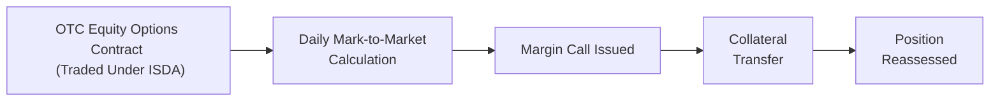

## 8.5 Collateralization & ISDA Master Agreements

When I first encountered the term “ISDA Master Agreement,” I thought, “Wow, that sounds like something you’d see in a legal thriller.” It turns out, in the world of Over-the-Counter (OTC) derivatives, the ISDA Master Agreement really is a centerpiece of every major storyline. OTC options, often tailor-made to fit a particular risk exposure, rely on solid legal and operational structures. The ISDA Master Agreement gives you that framework. But it doesn’t end there. The Credit Support Annex (CSA) steps in to clarify critical issues around collateralization, ensuring both parties protect themselves if their carefully-designed trades go awry. 

Below is a comprehensive look at how these agreements and frameworks come together under Canadian regulatory oversight, plus a few real-life insights to remind everyone: it’s not just about fancy documents; it’s about real money, real risks, and real obligations.

### Understanding the ISDA Master Agreement

The ISDA (International Swaps and Derivatives Association) Master Agreement is the global standard contract that underpins most OTC derivatives—interest rate swaps, currency forwards, equity swaps, and, yes, those flexible but potentially complex OTC options. Think of it as your big umbrella that covers the fundamental legal, credit, and operational terms between two counterparties. 

It’s designed to streamline negotiations, reduce legal disputes, and—most importantly—ensure that parties know their rights and obligations before they begin trading. For instance, it covers how parties will handle defaults, how netting (the process of offsetting multiple contracts to find a net payable or receivable) works, and how they might terminate trades in the event the other counterparty goes under. 

One nice thing about the ISDA Master Agreement is that it's basically universal in the derivatives universe. Whether you’re a major bank in Toronto or a pension fund in Vancouver, you’ll likely sign a version of the same base agreement. Of course, your schedule to the ISDA Master Agreement (often called simply “the Schedule”) will be customized to reflect your unique credit terms, operational preferences, and local regulatory constraints. 

### The Role of the Credit Support Annex (CSA)

When folks talk about “collateralization,” they usually mean the CSA—or Credit Support Annex—which is an addendum to the ISDA Master Agreement. It’s in the CSA that you’ll find all the crucial details about how collateral is posted, monitored, and returned. 

Some major points in a CSA include:

• Eligible Collateral. This is the type of collateral accepted. It might be cash in certain currencies (commonly USD or CAD) or high-quality government bonds (like Canadian government bonds or U.S. Treasuries).  
• Haircuts. Because collateral isn’t always risk-free, both parties typically agree to apply a discount—known as a “haircut”—on the market value of collateral. If you pledge a government bond worth CAD 1,000,000, maybe the agreement says it’s only counted as CAD 980,000 for margin purposes, ensuring some buffer for price fluctuations.  
• Thresholds and Minimum Transfer Amounts. If you only have a small mark-to-market movement of CAD 2,000, but your minimum transfer amount is CAD 10,000, you don’t have to post or request new collateral for such a minor move.  
• Variation Margin. This is posted daily (or more frequently) when the market moves, requiring either you or your counterparty to post more collateral if the trade moves against you. It’s basically the day-to-day reflection of last night’s mark-to-market.  
• Initial Margin. Sometimes there’s an extra layer of margin that regulators mandate, especially when dealing with more significant positions or less liquid instruments. This “initial margin” is designed to protect against potential future exposure—like if markets gap drastically in between margin calls.  

The CSA is, in many ways, the living, breathing heart of the collateral process. If the ISDA Master Agreement is the big umbrella, the CSA is your day-to-day weather forecast, letting you know how much you might need to bring in extra coverage when storm clouds gather in the markets.

### Eligible Collateral & Margin Calls

Picture yourself in the middle of a fast-moving market day. The energy sector just got hammered by unexpected supply cuts, your commodity-linked OTC options are whipsawing in value, and the phone rings. It's a margin call from your counterparty. Now, you might say, “Um, do I post government bonds or should I post cash? And do I use USD or CAD?” 

That’s precisely what the CSA is designed to clarify. If your CSA says that you can only post CAD or U.S. Treasuries, then you’re stuck with those forms of collateral. If you want to post less conventional forms of collateral—like corporate bonds or emerging market securities—well, you’d need your CSA to say so (though that’s typically less common, especially if you want to keep the negotiation process straightforward).

Once the margin call is triggered, most agreements give you a set amount of time—commonly by the end of the next business day—to post collateral. If you fail to meet that call, you could be deemed in default, and the entire web of your trades might unravel through a close-out netting process. 

### Haircuts, Thresholds, and Minimum Transfer Amounts

“Haircut” sometimes sounds like an ominous word if you’ve ever had to take a real-life loss on a forced sale of collateral—but in the derivatives world, it’s just a standard risk management tool. It acknowledges that collateral can fall in value before you can liquidate it. 

For instance, if you’re posting a basket of U.S. Treasuries with a face value of CAD 1,000,000 as collateral, a 2% haircut means your counterparty only credits you with CAD 980,000 worth of coverage. It’s like being at the bank that’s slightly skeptical about the real resale value of your security. 

Thresholds represent how big of a net exposure you can have to your counterparty before you must start posting collateral. If you’re a very safe credit, you might negotiate a higher threshold, so you don’t need to post collateral until your negative mark-to-market reaches a certain point. But keep in mind, your counterparty might not love that if they consider you riskier than you think you are.

Minimum transfer amounts help cut down on administrative hassle. No one wants to transfer tiny increments of thousands of dollars when dealing with multi-million-dollar trades. Setting a minimum transfer amount (say CAD 100,000) means you only move collateral once your net exposure surpasses that figure.

### Close-Out Netting in Canada

One of the top reasons everyone in the OTC derivatives market uses an ISDA Master Agreement is the legal enforceability of close-out netting. Imagine you have 10 trades with a counterparty, some in a gain position and some in a loss position. If that counterparty defaults, close-out netting says: “Let’s net all those positions together so that only the net sum is owed.” 

Under Canadian law, netting provisions in ISDA Master Agreements are enforceable, which is a major plus for banks, funds, and other large players. It provides certainty that if your counterparty collapses, you won’t be stuck trying to enforce each trade separately in a messy bankruptcy process.

And from a purely practical standpoint, netting transforms a swarm of potential exposures into a single net figure—making risk management more predictable and feasible. 

### Collateral Management Best Practices

Collateral management might not be the spiciest topic in derivatives, but ignoring it can lead to massive headaches. Let’s say your record-keeping is sloppy, and you lose track of the exact amount of collateral posted last week. In stable markets, maybe it’s not the end of the world. But in chaotic markets, that mismatch can cost you tens of thousands—or more—if you can’t prove you posted enough last month and your counterparty demands more.

Here are some best practices:

• Maintain rock-solid records of every collateral posting, return, or substitution. A single spreadsheet might cut it for small players, but bigger shops often use specialized collateral management software.  
• Regularly reconcile your collateral statements with your counterparty. It’s not enough to trust that their numbers always match your numbers.  
• Stay aware of upcoming corporate actions if you hold bonds or other securities as collateral (like a partial call or coupon payment). That can affect valuations in ways you need to track.  

### Legal Enforceability and Regulatory Considerations

One phrase that often pops up in discussions about the ISDA Master Agreement is “close-out netting.” We’ve touched on it, but let’s emphasize: in Canada, netting is recognized by our legal framework, offering a consistent environment if a default scenario arises. This is not always guaranteed in other jurisdictions—some legal systems don’t treat netting the same way, which can lead to more complexity.

Additionally, the rise of regulated initial margin requirements for certain OTC derivatives means you can’t rely purely on your credit officer’s internal judgement. The Canadian Investment Regulatory Organization (CIRO) offers guidelines on margin calculations and collateral posting. Especially after some of the more volatile market events in recent years, regulators want to ensure every major OTC derivatives player is well-collateralized. 

If you’re dealing with cross-border transactions, keep in mind that other regions—like the U.S. or the EU—have their own margin rules. The good news? A robust ISDA Master Agreement architecture often smoothly integrates with these frameworks.

### Real-World Example

Let’s say you’re a Canadian pension fund with a large portfolio of OTC equity options. You’ve negotiated an ISDA Master Agreement and CSA with a global bank. One day, global equity markets drop dramatically. Your mark-to-market on those options becomes negative, and the bank issues you a variation margin call of CAD 5 million. Because your CSA states you can post cash in either CAD or USD, and you’re required to meet transfers above CAD 1 million the next business day, you scramble to ensure you have the necessary liquidity. 

Here’s a simple flowchart demonstrating how the margin process might look:

In this scenario, you review your internal records, confirm you owe the CAD 5 million, transfer the cash to your bank’s designated account by the next day, and get your margin call off your back. Meanwhile, your bank logs that posted collateral in its ledger. If the market recovers, you might eventually call back some or all of that collateral.

### Key Regulatory Considerations

Just a few years ago, we talked mostly about IIROC or MFDA in Canada, but those bodies were amalgamated into the Canadian Investment Regulatory Organization (CIRO) on January 1, 2023. Today, CIRO sets the bar for margin rules and risk management for investment dealers that engage in derivatives activity.

CIRO’s guidance helps shape:

• The minimum margin that must be held for certain OTC derivatives.  
• How quickly variation margin calls must be met.  
• Reporting obligations, ensuring that major market participants promptly disclose big positions or potential exposures to the regulators.

CIRO is also influenced by the global push from organizations such as the Basel Committee on Banking Supervision, which has advocated stronger margin requirements for non-cleared OTC derivatives. Even if some trades clear through central counterparties, many large institutions still have bilateral agreements that rely on ISDA Master Agreements.

### Operational Tips and Pitfalls

• Know Your Counterparty. Not all counterparties are created equal. If you sense your trading partner might have a shaky credit profile, negotiations over the CSA can get thorny—like demanding huge haircuts or zero threshold.  
• Understand the Fine Print. Don’t assume your communications department or external legal counsel will keep track of every detail. If the market turns against you, you need to know your deadlines, the type of collateral you must post, and your next steps if you can’t gather that collateral in time.  
• Dispute Resolution. If you and your counterparty can’t agree on how much is owed in a margin call, the CSA typically spells out a dispute resolution process. It might state how often you must exchange data, whether a third-party valuation agent is used, and how you escalate disputes to senior management.  
• Data Management. Maintaining robust systems is essential for capturing real-time valuations and margin workflows. Tools from vendors like OpenGamma or TriOptima can help, but don’t rely entirely on black-box solutions. Check your outputs carefully.  

### Additional Resources

If you’re looking for more detailed, nitty-gritty discussion of the ISDA Master Agreement and collateral frameworks:

• ISDA Website (https://www.isda.org/) – The ultimate repository of standard documentation, protocols, and legal opinions.  
• CIRO Collateral Management Rules (https://www.ciro.ca) – Canada’s self-regulatory body for investment dealers has official guidelines, best practices, and margin requirements.  
• “Mastering Collateral Management and Documentation” by Paul C. Harding – A well-rounded book if you love diving deep into the legal/operational synergy.  
• The Chartered Institute for Securities & Investment (CISI) – Offers advanced collateral management training modules that guide you through real-world scenarios.  
• Finance and Law Journals – For a more academic approach, check out publications like the Journal of Financial Regulation and Compliance.

It’s also worth huddling with your legal counsel or compliance team to keep abreast of new regulations, especially as the markets evolve. Because if there’s one constant in the derivatives world, it’s that the rules keep shifting, and you need your documents to keep up.

Collateralization and ISDA Master Agreements might sound intimidating at first glance, but think of them as well-established guardrails on a tricky highway. They don’t eliminate the twists and turns of the market, but they help make your journey far safer—and a lot less nerve-racking.

---

## Sample Exam Questions: Collateralization & ISDA Master Agreements



### Which document typically dictates the rules for posting collateral in an OTC derivatives transaction under an ISDA Master Agreement?

- [ ] The main body of the ISDA Master Agreement 
- [x] The Credit Support Annex (CSA) 
- [ ] A letter of credit from a bank
- [ ] The schedule relating to regulatory reporting

> **Explanation:** The Credit Support Annex (CSA) outlines the specific terms and conditions for collateral (including eligible collateral, haircuts, margin calls, etc.) in an OTC derivatives transaction.

### What is a “haircut” in the context of collateral posted under a CSA?

- [ ] The process of renewing a contract after expiration
- [x] A discount applied to the face value of collateral to protect against market risk
- [ ] A penalty fee charged by clearinghouses
- [ ] An incremental tax on posted collateral

> **Explanation:** A haircut reduces the recognized value of posted collateral to account for potential declines in its market value, thereby protecting the party receiving collateral.

### In a close-out netting scenario, how are multiple open positions generally handled under an ISDA Master Agreement?

- [ ] Each position is settled independently
- [x] Offsetting amounts are netted to a single pay/receive figure
- [ ] All gains are forfeited, and only losses are recognized
- [ ] The defaulting party chooses which positions to net

> **Explanation:** Close-out netting allows parties to consolidate or offset the values on multiple trades, arriving at a single net amount owed.

### Which Canadian regulatory organization currently oversees margin and collateral guidelines for investment dealers and OTC derivatives?

- [x] CIRO (Canadian Investment Regulatory Organization)
- [ ] IIROC (Investment Industry Regulatory Organization of Canada)
- [ ] MFDA (Mutual Fund Dealers Association)
- [ ] CDCC (Canadian Derivatives Clearing Corporation)

> **Explanation:** Following the amalgamation of MFDA and IIROC, CIRO became the self-regulatory body. IIROC and MFDA references are historical.

### Why might a CSA include a minimum transfer amount?

- [ ] To ensure counterparties post collateral even for small exposures
- [ ] To prohibit the use of cash as collateral 
- [ ] To align with interest rate movements
- [x] To avoid frequent postings of insignificant amounts

> **Explanation:** A minimum transfer amount is set so parties aren’t constantly posting or calling back tiny increments of collateral, preventing administrative burdens.

### A "threshold" in the context of collateral under the CSA is:

- [ ] The maximum legal collateral that can be posted
- [ ] A penalty for late margin payments
- [x] The amount of credit exposure allowed before collateral must be posted
- [ ] The maximum haircuts applicable on posted collateral

> **Explanation:** The threshold is how much net exposure is permitted without triggering a margin call. Beyond that amount, collateral posting becomes mandatory.

### Which of the following is typically considered eligible collateral under a CSA?

- [ ] High-risk corporate bonds
- [x] Cash in a major currency, such as CAD or USD
- [ ] Non-fungible tokens (NFTs)
- [ ] Stock in small-cap private companies

> **Explanation:** CSAs usually restrict eligible collateral to highly liquid, lower-risk assets like cash or government bonds. Risky assets are rarely accepted or require significant haircuts.

### Which best describes variation margin?

- [x] Collateral adjustments made to reflect daily changes in the market value of open trades
- [ ] Initial funds posted at the start of a trade to cover future exposures
- [ ] A monthly reporting requirement to regulators
- [ ] A fix for negative credit ratings

> **Explanation:** Variation margin is posted or returned based on regular mark-to-market fluctuations in the value of open positions.

### Why is robust recordkeeping crucial for collateral management?

- [ ] It discourages the use of hedges
- [ ] It simplifies the use of structured products
- [ ] It replaces the need for verification of margin calls
- [x] It helps reconcile collateral postings and reduces disputes during market turmoil

> **Explanation:** Detailed records provide clear evidence of collateral movements and postings, which is essential for settling disputes or verifying exposures under volatile conditions.

### True or False: In Canada, close-out netting under an ISDA Master Agreement is not enforceable.

- [ ] True
- [x] False

> **Explanation:** Close-out netting is recognized and enforceable under Canadian law, providing certainty for participants in the event of a counterparty default.


