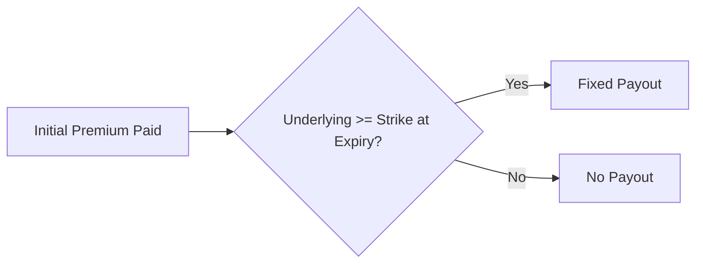
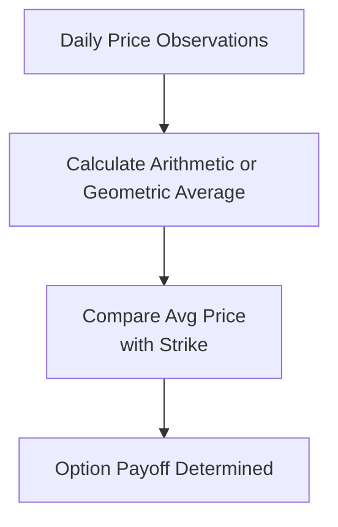

## 8.6 Other Exotic Options (Barrier, Binary/Digital, Asian)

Sometimes you stroll into a trading desk and spot all these esoteric-sounding option names that make you wonder, “Why on earth would anyone use something called a ‘knock-in’ or ‘knock-out’?” I remember the first time I heard a colleague quoting a barrier option on a commodity. I was so puzzled that I literally said: “Wait, the option just disappears if the price touches some line in the sand?” That was my introduction to barrier options—where triggers, boundaries, or “barriers” can make or break your position.  

Below, we'll dig into three types of exotic over-the-counter (OTC) options—barrier, binary (often called digital), and Asian options. These instruments are typically more complex than the vanilla calls and puts because their payoffs can depend on the path or average price of the underlying. They’re generally used by hedgers or speculators who want unique risk-management profiles not offered by standard options, and they’re traded outside of formal exchanges, usually between two private parties under bilateral agreements.

Barrier, binary, and Asian options can also appear in the exchange-traded world in certain jurisdictions, but the wide scope for customization (like tailoring barrier levels or payoff structures) means they remain quite popular in the OTC market. As you read on, keep in mind that the Canadian Investment Regulatory Organization (CIRO) supervises these OTC derivatives transactions under Canadian regulations. Additionally, the Canadian Securities Administrators (CSA) has guidelines monitoring their reporting and documentation. Let’s jump right in.

Barrier Options

Barrier options add a delicate twist to a standard option by introducing a condition: once the underlying crosses or touches a specific price level (the barrier), something dramatic happens. It might activate the option (knock-in) or terminate the option (knock-out). If you’re hedging, this can be a cost-effective way to protect against certain price movements when you’re fairly sure a barrier won’t get breached, but it also introduces the risk that you lose protection if the barrier triggers unexpectedly.

Knock-In Barrier  
A knock-in barrier option begins its life as “latent.” This means it isn’t active until the underlying price crosses the barrier. For a knock-in call, for example, you have no payoff potential unless and until the price jumps above a certain threshold. Once that barrier is hit, your call option “knocks in” and starts functioning like a normal call. If the barrier is never reached, you’ve paid a premium but never get the standard option payoff.  

Knock-Out Barrier  
In contrast, a knock-out barrier option starts alive (like a plain vanilla option), but if the underlying crosses a certain price level, that option ceases to exist. A knock-out put that’s protecting you from downside risk might be cheaper to buy, because you lose your hedge the moment the underlying crosses the designated barrier (knocking your option out).  

Practical Example: Imagine a Canadian oil producer wanting to hedge against declining oil prices but convinced the market won’t crash below a certain level. They might purchase a knock-out barrier put with a knock-out set at a very low price. The premium is cheaper than a standard put. But if, say, WTI oil plunges—touches or drops below that barrier—poof, the option self-destructs.  

Try to picture it this way:

Because barrier options hinge on these triggers, robust risk management is crucial. You or your trading desk must closely monitor the underlying’s price. If the underlying is something very volatile—like a small-cap equity or a commodity subject to wild price swings—barrier triggers might breach quicker than you’d ever imagine.  

Binary (Digital) Options

Binary options (often labeled “digital” options) are about as all-or-nothing as it gets. They’re typically structured so that if the underlying ends above (for call) or below (for put) a certain strike price at expiry, the option pays a fixed amount. If not, the payout is zero. So it’s not your traditional payoff curve that rises or falls proportionally; it’s basically: “Do I cross the line at expiration or not?”  

Traders who have strong views on short-term directional movement or event-driven outcomes love these. For instance, let’s say there’s a big central bank announcement next week. You strongly believe interest rates will jump, sending bond prices down. If you’re right, the binary put on a bond future might pay a fixed sum, no matter how far the underlying fell—just that it finished below the strike. If you’re wrong, your entire premium is gone. Simple.  

While binary options are straightforward in concept, they can be risky because the entire payoff depends on a single condition at one point in time (often the expiration date). Additionally, from a regulatory perspective, certain jurisdictions have specific rules on marketing or distributing binary products to retail investors. In Canada, any dealer offering binary options must comply with CIRO guidelines and CSA regulations, which might involve disclaimers, risk warnings, or restrictions on marketing short-duration digital options to unsophisticated clients.

An illustration:

Because the payout is binary, pricing them can involve modeling the probability of finishing in-the-money under a certain implied volatility. They’re highly sensitive near the strike, which is sometimes referred to as a “digital payout profile.” The implied volatility skew or smile can significantly affect digital option prices, especially if the strike sits in a region where the market’s volatility happens to spike.  

Asian Options

Asian options, sometimes known as average-rate options, settle based on the average price of the underlying over a certain observation period rather than the spot price at a single moment in time. If you’re dealing with commodities that can experience day-to-day whipsaws, you might appreciate the smoothing effect of an Asian option.

Types of Asian Options  
• Average Price Option: The payoff might be determined by comparing the average settlement price over time to a strike price.  
• Average Strike Option: The final strike is the average price over the observation window, and then you settle based on the final spot price.  

In commodities, imagine a metals producer (say a nickel miner) wants to hedge daily volatility. Buying a standard put might be expensive because nickel prices fluctuate wildly from day to day. An Asian put that references the monthly average nickel price effectively lowers the cost of volatility risk and captures a more stable representation of price movements.

Schematic view:

The path-dependent nature means you can’t just look at a single date or single price quote. The average is typically computed on a daily or weekly basis, depending on how the option is structured. For risk management, it’s crucial to know how often the price is sampled and whether it’s an arithmetic or geometric mean (yes, the math can get a bit geeky).  

Risk Management and Operational Considerations

All these exotic structures—barrier, binary, and Asian—are more complex to price and monitor than vanilla options. Risk management teams often rely on advanced pricing models, such as Monte Carlo simulations or partial differential equation solvers. The complexities include:

• Trigger Monitoring. For barrier options, you have to track the underlying’s price to see if it crosses the barrier. With high-frequency market moves, the “monitoring frequency” can matter: a continuous barrier vs. daily or weekly barrier checks.  
• Path Dependency. Both barrier and Asian options have path-dependent payoffs. This means the entire price trajectory matters, not just the final price at expiry.  
• Volatility Smile/Skew. The implied volatility environment often influences how you price barrier triggers and digital payouts. You might see a pronounced skew for commodities or equity indexes in stressed markets.  
• Liquidity and Model Risk. Because these are typically OTC, liquidity can be an issue if you want to exit early, and model risk can be higher since there’s no transparent exchange marking the price daily.  

Firms employing these products should have robust internal controls and specialized knowledge. For instance, a single missed barrier breach on a knock-out option could translate into massive financial mismatches if staff wrongly assume the option is still active.  

Regulatory and Documentation Requirements

In Canada, the overarching guidelines from the CSA and CIRO’s oversight emphasize thorough reporting for OTC derivatives whenever feasible. Even if certain exotic options aren’t subject to mandatory clearing (like some interest-rate swaps might be), parties often have bilateral collateral agreements to mitigate credit risk. Key steps include:

• ISDA Master Agreement. The International Swaps and Derivatives Association (ISDA) Master Agreement forms the backbone of most OTC derivatives transactions, specifying how collateral is posted, how default is handled, and what happens if a barrier is triggered.  
• Confirmation Documents. For exotics, confirmations must detail all triggers, barrier levels, settlement procedures, observation frequencies, and fallback provisions.  
• Collateralization. If not cleared, exotic option transactions typically require posting initial margin or variation margin to mitigate counterparty risk.  
• Reporting. Under CSA regulations, many OTC derivatives trades must be reported to an approved trade repository. The new SRO—CIRO—will want to ensure that participants keep robust records and meet trade reporting standards in line with national instruments.

Additionally, if these exotics are sold to non-institutional clients, there might be specific requirements such as standardized risk disclosure, product appropriateness checks, and guidelines on marketing materials.

Practical Examples and Case Studies

Event-Driven Hedging with Digital Options  
Suppose a corporate treasurer at a large Canadian firm expects a Bank of Canada rate hike that will drive the Canadian dollar to strengthen. The treasurer secures a binary call option on CAD/USD. If loonie (CAD) surges above the strike, the payoff is a fixed $2 million. If not, the payoff is zero. This approach is cheaper than a range of vanilla call options but either yields a big payoff or nothing.  

Knock-Out Commodity Protection  
Let’s say you’re an agricultural producer worried about a mild drop in canola prices. You buy a knock-out put with the barrier significantly below your worst-case scenario. The premium is much cheaper than an outright vanilla put. However, if canola prices absolutely collapse and cross the barrier, your put disappears, leaving you fully exposed. Sometimes you can add a “reinstatement” clause, but that introduces new complexities and higher premiums.  

Asian Options for Energy Firms  
In the energy sector, monthly or quarterly average pricing is common. A natural gas distributor might prefer an Asian call that hinges on the average monthly Henry Hub natural gas price. This smooths out the daily spikes or collapses that often plague the gas market. If they only need a stable average purchase price, an Asian option can be more aligned with that budget target than a vanilla contract.  

Complex Pricing Methodologies

Because these options are path-dependent or have path-dependent triggers (like barrier crossing), the usual Black–Scholes–Merton formula is either heavily adapted or replaced by advanced numerical methods:

• Monte Carlo Simulation: Running thousands (or millions!) of random price paths for the underlying to see how often it crosses a barrier or how the daily average evolves for an Asian.  
• Lattice Models (Binomial/Trinomial Trees): Building a tree of possible price movements over discrete time steps, then working backward to compute the option’s value, factoring in barrier triggers or average calculations.  
• Partial Differential Equations (PDEs): For continuous monitoring of triggers, PDE approaches like the finite difference method can be used to solve for the derivative’s price, capturing complex boundary conditions.  

In practice, advanced computational libraries such as “FinMath” (in Python or R) can streamline the process, though traders and risk managers typically must calibrate these models carefully to reflect real-world market conditions (e.g., volatility skew, interest rate curves, correlation structures).

Where to Learn More

• CIRO Website (https://www.ciro.ca): Reviews and guidance notes on OTC derivatives and market integrity.  
• CSA (Canadian Securities Administrators) Notices: Check for rules on derivatives reporting and clearing.  
• ISDA (https://www.isda.org): Offers standardized definitions for barrier or digital options, plus the standard Master Agreement templates.  
• “Exotic Options Trading” by Frans de Weert: A detailed book explaining different exotic payoff structures and real-life use cases.  
• Wilmott.com: Online quantitative finance forum—lots of in-depth discussions on exotic pricing.  

You might also find software tutorials or open-source code on GitHub for pricing barrier and digital options, especially in the Python or R ecosystem—just do a search for, say, “Asian option Monte Carlo.”

Best Practices and Common Pitfalls

Some folks get enamored by the cheaper upfront cost of barrier or binary options, ignoring the ramifications if the barrier triggers or if the condition is not met at expiration. Here are some best practices:

• Thorough Stress Testing: Model how the option might behave in extreme markets. Barriers can be triggered more quickly than you expect.  
• Ongoing Monitoring: Keep track of the underlying not just on the final settlement date. If you have a continuous barrier or an average price window, you need reliable real-time data.  
• Documentation Check: Exotics can have complicated confirmation terms. Double-check that the barrier type (knock-in vs. knock-out), the monitoring frequency, and the settlement method are all correct.  
• Regulatory Compliance: Even though it’s an OTC deal, it’s still subject to Canadian derivatives regulation. Make sure your trades are reported and documented properly.  
• Disclosures for Retail: If you’re ever selling these exotics to a smaller client (though more commonly they’re for institutional counterparties), ensure compliance with CIRO’s and the CSA’s restrictions and investor protection mandates.

Embracing or Avoiding Exotic Options

So, are barrier, binary, or Asian options best avoided or eagerly embraced? Like anything else in finance, it depends on your strategy, market outlook, and risk appetite. A well-informed commodity trader might reduce premium costs with a knock-out barrier. A corporate treasurer might quickly lock in a payoff for an event-driven view with a digital. An energy firm might choose an Asian structure to reflect monthly average gas or oil prices.

However, it’s essential not to let the novelty overshadow the fundamentals. Implementing an exotic option without understanding how or when its payoff will be triggered can result in big misalignments—like thinking you’re fully hedged while the exposure is actually gone if a barrier’s triggered. If you’re a new or smaller participant, you might want to practice with simpler vanilla options before venturing into exotics.

A Quick Informal Anecdote

Years ago, a friend and I were exploring currency hedging for a philanthropic trip. We had some USD exposure, and I recall joking about buying a digital option that’d pay if the CAD/USD soared beyond a certain level, basically a mini lottery ticket for our budget. Our bank politely warned that a “binary currency option” wasn’t typically offered to retail amateurs like us unless we met certain net worth or sophistication guidelines—highlighting how carefully these products are controlled. Even though we didn’t end up with that digital trade, it was a memorable lesson that exotics can be powerful but come with caveats.

In Conclusion

Barrier, binary/digital, and Asian options each serve specialized hedging or speculative uses in the OTC market. They share a common theme of path dependency or special triggers that make them more complex to price and risk-manage. From a regulatory standpoint, especially under the watchful eyes of CIRO and the CSA, you’ll need robust documentation, reporting, and controls to stay compliant.  

If you decide they fit your strategy—fantastic. If not, standard vanilla options or other hedging mechanisms might be simpler alternatives. But that’s the beauty of modern finance: the tools are there, each with a unique flavor, as long as you know how to wield them responsibly.

## Sample Exam Questions: Other Exotic Options (Barrier, Binary/Digital, Asian)



### A barrier call option that ONLY becomes activated if the stock price rises above a certain level is called:

- [ ] A knock-out call
- [ ] A binary call
- [x] A knock-in call
- [ ] An Asian call

> **Explanation:** Knock-in options remain dormant until the underlying’s price crosses a predetermined barrier (in this case, above a certain level). Once that barrier is reached, the option becomes active.

### Which exotic structure awards a fixed payout if the underlying meets a specified condition at expiration?

- [ ] Barrier option
- [x] Binary (or digital) option
- [ ] Vanilla forward
- [ ] Asian option

> **Explanation:** Binary or digital options provide a fixed, all-or-nothing payout if certain conditions are met.

### An Asian option’s payoff is determined by:

- [ ] The spot price at option expiration only
- [x] The average of the underlying’s price over a specified period
- [ ] The highest underlying price observed during the option’s life
- [ ] The difference between the underlying’s opening price and closing price

> **Explanation:** Asian options commonly use an average price—daily, weekly, etc.—to determine the final payoff, reducing the impact of sudden price swings at any single point in time.

### A knock-out barrier option:

- [x] Terminates if the underlying price crosses a specified barrier
- [ ] Activates if the underlying never crosses a specified level
- [ ] Pays a fixed amount regardless of the underlying’s price
- [ ] Is unaffected by day-to-day volatility

> **Explanation:** In a knock-out structure, once the barrier is breached, the option ceases to exist, effectively “knocking out” the position.

### Why might a commodity producer choose an Asian option over a standard vanilla option?

- [ ] To maximize gamma exposure near expiration
- [ ] To reduce the premium cost by losing the right to exercise
- [x] To smooth out price volatility by averaging over time
- [ ] To receive a fixed payout at expiration

> **Explanation:** Asian options average the underlying’s price over a specified period, providing a payoff that’s less sensitive to individual price spikes or dips on any single day, which is beneficial to many commodity hedgers.

### What is a key regulatory consideration when trading these exotic OTC options in Canada?

- [ ] They must be traded only on the TSX
- [ ] They are exempt from all reporting duties to CIRO
- [x] They are often subject to CSA/CIRO trade reporting and documentation requirements
- [ ] They cannot be traded by Canadian entities

> **Explanation:** OTC derivatives, including exotics, frequently fall under CSA and CIRO oversight, requiring appropriate trade reporting and risk disclosures.

### What is a significant risk in a knock-out option structure?

- [ ] The option can become more valuable if the barrier is breached
- [x] Sudden crossing of the barrier can cancel the hedge completely
- [ ] It has higher premiums than vanilla options
- [ ] It lacks path-dependency

> **Explanation:** A knock-out structure can unexpectedly terminate if the barrier is triggered, resulting in the loss of any protective hedge and making risk management tricky if the barrier is breached sooner than anticipated.

### Which of the following statements is TRUE about binary (digital) options?

- [ ] Their payoff is linearly related to the underlying’s final price
- [x] They pay out a fixed amount if in-the-money, otherwise zero
- [ ] They only exist on regulated futures exchanges
- [ ] They cannot be used in event-driven strategies

> **Explanation:** A digital option pays a predetermined fixed amount if it expires in-the-money and nothing if it does not.

### If a trader implements an “average-rate call” on a commodity, which statement best describes the settlement process?

- [x] The underlying’s price is sampled periodically and averaged; that average is compared to the strike to determine payoff
- [ ] The commodity’s highest daily close is used to calculate payoff
- [ ] The payoff is determined entirely by the final spot price on expiry
- [ ] The trader receives a fixed sum immediately upon purchase

> **Explanation:** An average-rate call (a type of Asian option) calculates the payoff by comparing the averaged price of the underlying over the contract period with the strike price.

### A digital option pays out if it expires in-the-money. True or False?

- [x] True
- [ ] False

> **Explanation:** By definition, a digital option provides a binary payoff, typically paying a fixed amount if it expires in-the-money.


