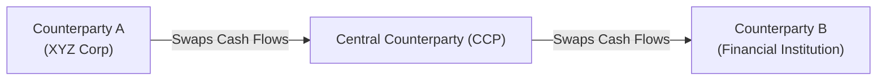

## 9.1 Overview of the Swap Market

Swaps are one of those financial instruments that, at first glance, might seem like some kind of mysterious wizardry. If you’ve ever found yourself thinking, “Who on earth would willingly exchange one stream of payments for another?”—well, welcome to the conversation! Let’s dive into what swaps really are, why they matter, and how they’re used in the real world.

Swaps lie at the heart of the Over-the-Counter (OTC) derivatives arena. They allow two parties—often large financial institutions, corporations, or governmental entities—to exchange, or “swap,” sets of cash flows tied to underlying rates or prices. These could be interest rates, foreign exchange rates, commodity prices, or even credit exposures (in the case of credit default swaps).

Swaps emerged in response to real market needs—companies wanted stable costs of borrowing, financial institutions craved ways to offset or hedge exposure, and speculators enjoyed additional ways to express market views. And, yes, central banks and government entities also found them handy for managing currency or rate risk.

Anyway, let’s explore the major aspects of the swap market, focusing on the Canadian perspective and tying everything together with global insights. We’ll look at the role of regulators like the Canadian Investment Regulatory Organization (CIRO), the overarching frameworks from the Canadian Securities Administrators (CSA), and share a few practical examples along the way.

A Quick Personal Note: When I first encountered swaps in a finance course years ago, I was literally scratching my head. I couldn’t for the life of me figure out why an organization would want to pay a floating rate to someone else. Then I discovered that it’s sort of like exchanging your variable-rate mortgage for someone else’s fixed-rate mortgage, so each party ends up with the payment stream they desire. That’s when it clicked—swaps are just structured deals to meet mutual needs.

Understanding that perspective can really open your eyes to the beauty of swaps. So let’s get to it.

The Origins of Swaps and Growth of the Market  
In the early days of interest-rate markets, corporations and banks rapidly recognized that being tied to a certain rate (floating or fixed) could be problematic if market conditions shifted down the road. Some soared while others, well, took a tumble. Companies needed a mechanism for smoothing out their finances and managing exposure. This spelled the beginning of the swap market in the late 1970s and early 1980s. Large financial institutions partnered with corporations to swap payment streams, effectively transforming risk profiles.

The market exploded in size through the 1990s and 2000s as interest rates, currency regimes, and credit spreads all became more volatile. Today, the global swap market is enormous. The Bank for International Settlements (BIS) estimates that the notional amounts outstanding run in the hundreds of trillions of dollars, making swaps one of the largest derivative products in existence.

Key Participants in the Swap Space  
When it comes to swaps, these are the main folks you might expect to see around the table:

• Major Financial Institutions: Think banks, broker-dealers, and other specialized derivatives dealers. They’re often market makers, quoting prices (swap rates or spreads) to potential counterparties.  
• Corporate Treasurers: They use swaps to manage interest-rate exposure, currency risk, or commodity prices. If a Canadian mining firm wants to fix the price of diesel fuel, they might enter into an OTC commodity swap.  
• Asset Managers and Investment Funds: Portfolio managers might use swaps for hedging or to gain quick exposure to certain segments of the market—like equitizing cash using equity swaps.  
• Government Entities and public-sector bodies: They tap into swaps for liability management. A municipal government might, for instance, convert a floating-rate loan into a fixed-rate obligation if it’s more favorable.  
• Speculators: Hedge funds and proprietary trading desks can use swaps to take positions on interest rates, credit spreads, or currency exchange rates without necessarily holding any underlying physical securities.  

How Swaps Work (The Core Idea)  
Let’s say we have two companies to illustrate a simple interest rate swap. One is “Company A,” who currently pays a floating rate (maybe tied to a reference index like 3-month CDOR in Canada). Company A is worried about rate hikes, so it wants to lock in a fixed rate right now. Meanwhile, “Company B” holds a fixed-rate obligation but oddly enough prefers floating rates—maybe they expect rates to drop. So, A and B broker a deal:

• A receives floating from B (pegged to the reference rate)  
• A pays fixed to B (a rate negotiated between them)  

What’s the result? A’s floating payments are offset by the floating receipts from B. In effect, A has turned its floating-rate liability into a fixed one. B has done the opposite. At the agreed-upon intervals (usually every quarter or semi-annually), the net payment is exchanged. One party typically pays the difference, if any, to the other, so they’re not literally swapping gross amounts each time.

This bilateral agreement is called a “plain vanilla interest rate swap,” which is the simplest kind of swap. Similar logic applies if we’re dealing with currency swaps, credit swaps, or even commodity swaps—just with different underlying reference variables.

Bilateral vs. Cleared Swaps  
Historically, swaps were purely bilateral contracts, negotiated directly between two counterparties. That could be a bit risky. If one party defaulted (called “counterparty risk”), the other might find itself with a huge open exposure. That’s no one's idea of a good day.

To mitigate this, regulators worldwide, including the CSA in Canada, encouraged central clearing following the 2008 financial crisis. Clearing means that a central counterparty (CCP), such as LCH or clearinghouses recognized in Canada, “steps in the middle.” Essentially, the CCP becomes the buyer to every seller and the seller to every buyer. This significantly reduces counterparty risk because the CCP uses margin requirements and other risk management tools.

Of course, not all swaps are cleared. Certain bespoke or exotic structures remain bilateral, either because they’re too customized to fit into a clearing model, or because the volume is too low to justify the costs associated with clearing.

Regulatory Environment in Canada  
Swaps are subject to the regulatory purview of the Canadian Securities Administrators (CSA), which develops harmonized rules for Canada’s provinces and territories, and CIRO, which is the national self-regulatory body formed by the amalgamation of the former IIROC and MFDA on January 1, 2023. CIRO sets out rules regarding market conduct, risk management, and trade reporting obligations. The big aim is to ensure transparent markets, decent liquidity, and protection against systemic risk.

It’s essential for Canadian swap market participants to comply with these reporting and clearing requirements. Indeed, many standardized interest rate swaps in Canada now clear through recognized central clearing platforms, offering that extra measure of stability. You can find official regulatory guidelines at:
• CIRO: https://www.ciro.ca  
• CSA: https://www.securities-administrators.ca  

Additionally, the Bank of Canada offers insights on derivatives within the broader financial system:  
• Bank of Canada’s Financial System Hub: https://www.bankofcanada.ca/research/financial-system  

Motivations for Using Swaps  
The ultimate question: Why do we do all this swapping in the first place? There are multiple reasons, but let’s highlight some big ones:

Hedging: Many participants want to reduce or neutralize a particular risk. For instance, an exporter might hedge currency risk. An oil producer might hedge price risk through a commodity swap.

Speculation: Others might see an opportunity to profit from anticipated movements in market rates or spreads. If you think interest rates are about to go up, you could structure a swap that profits from that scenario.

Arbitrage: Sometimes price discrepancies across markets allow “risk-free” (or near risk-free) profit opportunities, though these are typically pursued by sophisticated market makers.

Customized Financing Costs: Picture a firm that’s locked into a floating-rate loan but wants to take advantage of stable fixed rates. They can swap out their exposure. Conversely, a firm with a fixed-rate loan who’s anticipating a rate decline might want to convert to floating. Both parties benefit by achieving their desired financing costs.

Access to Otherwise Restricted Markets: Some institutions gain exposure to foreign markets or nominal yield curves through currency swaps or other specialized swap structures, without directly issuing foreign-currency-denominated debt.

Practical Example—Swapping from Fixed to Floating  
Let’s lay out an example in detail. Suppose “XYZ Corp,” a Canadian-based technology firm, has $100 million in fixed-rate debt at 4% for five years. The CFO of XYZ Corp is convinced that interest rates will drop sharply over the next couple of years—leading to cheaper financing. Instead of refinancing right away (which might lead to penalties or large fees), the CFO can enter into a swap. 

XYZ Corp enters a swap with Big Bank. Under this swap:  
• XYZ pays Big Bank a floating rate (tied to 3-month CDOR) on $100 million notional.  
• Big Bank pays XYZ a fixed rate of 4%.  

Effectively, if 3-month CDOR is lower than 4%, XYZ ends up paying less net interest. They pay a floating rate to Big Bank but receive 4% from Big Bank. The net effect is that XYZ’s interest obligations on that $100 million are mostly floating now. Meanwhile, Big Bank has turned a portion of its exposure from floating to fixed. They might have had other floating obligations they wanted to offset. Everybody’s happy—assuming the CFO’s rate forecast is correct.

Common Swap Structures  
Although the plain vanilla interest rate swap is extremely common, the market offers various flavors:

• Interest Rate Swaps (Fixed-for-floating, floating-for-floating, basis swaps)  
• Currency Swaps (Exchange principal and interest in two currencies)  
• Credit Default Swaps (CDSs, which transfer credit risk of a reference entity)  
• Commodity Swaps (Crude oil, natural gas, metals, agricultural products)  
• Equity Swaps (Based on equity indexes or individual stocks)  

Each version addresses a different source of risk or market exposure. Commodity swaps, for example, help energy companies or airlines lock in stable fuel costs. Credit default swaps help bond investors or lenders hedge credit risk.

The Role of Central Counterparties (CCPs)  
Clearing has become more common after global regulatory reforms, so let’s illustrate how it works in a diagram:

Instead of being directly exposed to each other, A and B each face the CCP for margining and default management. This arrangement significantly reduces counterparty risk and helps the overall market function smoothly, even in times of stress.

Risk Management Considerations  
You know how life is unpredictable? The same can be said for markets. Swaps can be brilliant in stabilizing your finances if used prudently. But if used recklessly, or if you fail to manage credit risk, oh boy, it can result in hefty losses. That’s why clearing is so important these days, and why robust documentation (like the ISDA Master Agreement) is essential. The Master Agreement sets out netting provisions and other risk mitigation techniques that reduce the counterparty risk in the event of a default.

In Canada, the CSA and CIRO (since its formation on January 1, 2023) have been actively implementing frameworks for trade reporting, margin requirements for non-centrally cleared derivatives, and risk management guidelines.

Other Resources for Swap Valuation and Infrastructure  
Ever wonder how professionals figure out the fair price of a swap? Often, they rely on advanced mathematical models, analyzing discounted cash flows, forward rates, and credit spreads. Numerous open-source analytics libraries can help with this valuation:

• OpenGamma (https://opengamma.com/). This platform offers open-source analytics for interest rate swaps, capturing things like the forward curve construction and risk sensitivities.  
• QuantLib, another open-source project, also provides robust tools for swap valuation.  

If you want to dive deeper academically, “Derivatives Markets” by Robert L. McDonald is a widely recommended text. It covers theoretical foundations and offers plenty of numerical examples.

Common Pitfalls, Best Practices, and Lessons Learned  
Let’s share a few bits of wisdom gleaned from both good times and bad times in the swap world:

• Over-Leverage: Some participants might overestimate their ability to handle potential adverse movements, especially if the swap is non-centrally cleared.  
• Liquidity Issues: Certain specialized or exotic swaps can be illiquid, meaning it’s tough to exit early without steep costs.  
• Mismatched Hedge: A sloppy mismatch between a firm’s underlying exposure and the terms of the swap can undermine the entire exercise. If you’re hedging Caribbean currency exposure with a swap denominated in euros, that’s probably not going to help much.  
• Documentation Oversight: Failing to pay close attention to the ISDA Master Agreement terms can result in confusion over who owes what when, especially in event of a credit default.  
• Regulatory Non-Compliance: Missing the correct filing dates for trade reports or ignoring margin requirements can lead to fines or even regulatory sanctions.  

Despite these pitfalls, many market participants see swaps as a core tool in their risk-management arsenal. With proper governance, monitoring, and robust data analytics, swaps can be quite powerful.

A Small Anecdote on Surprises: I once worked with a small energy company that had locked in a high fixed rate for natural gas, anticipating a price surge. It turned out that natural gas prices crashed instead. The CFO was initially upset about paying above-market rates, but the lesson was that you can’t time the market perfectly. The company had effectively purchased peace of mind—a stable cost of inventory. In the grand scheme, that’s often worth the cost of being “wrong” on short-term price movements.

Conclusion  
And there you have it: the swap market in a nutshell. From its early beginnings in simple interest rate deals to today’s sophisticated structures and global clearinghouses, swaps remain crucial for modern finance. In Canada, the regulatory environment—spearheaded by CIRO and the CSA—focuses on ensuring transparency, preventing systemic shocks, and encouraging prudent risk management. Whether you’re a corporate treasurer wanting to lock in stable interest rates, an investor hedging currency risk, or a speculator aiming to profit from credit spreads, swaps offer flexible, customized solutions.

The real key is understanding how swaps align with your broader financial objectives. It’s not about gambling but about picking the right instrument to meet your risk tolerance and strategic goals.

If you want to learn more, be sure to check out the resources from:
• CIRO (https://www.ciro.ca)  
• CSA (https://www.securities-administrators.ca)  
• Bank of Canada’s Financial System Hub (https://www.bankofcanada.ca/research/financial-system)  
• OpenGamma for open-source analytics (https://opengamma.com/)  
• “Derivatives Markets” by Robert L. McDonald  

Keep learning and stay curious—there’s plenty more to explore in the ever-evolving world of swaps!

---

## Sample Exam Questions: Mastering the Swap Market Basics



### Which of the following best describes the purpose of a swap?
- [x] It allows parties to exchange one set of cash flows for another to meet hedging or investment objectives.
- [ ] It is used only for high-frequency trading.
- [ ] It is a security listing on a national stock exchange.
- [ ] It can be traded exclusively on retail brokerage platforms 24/7.

> **Explanation:** Swaps are OTC derivatives that enable participants to exchange cash flow streams (e.g., fixed for floating) for hedging, speculation, or other strategic objectives.

### What is the primary motivation behind central clearing of swaps?
- [x] To reduce counterparty credit risk by having a CCP stand between the two parties.
- [ ] To eliminate all swap market regulation.
- [ ] To force each trade onto a blockchain-based system.
- [ ] To make swaps only accessible to retail investors.

> **Explanation:** Central counterparties (CCPs) help mitigate counterparty risk and foster greater stability in the OTC derivatives market.

### In a typical plain vanilla interest rate swap where Party A pays fixed and receives floating, which statement is true?
- [x] Party A’s floating payments are offset by the floating amounts it receives from the counterparty.
- [ ] Party A receives fixed payments and pays floating payments.
- [ ] Party A’s cash flows are unaffected by any changes in the reference rate.
- [ ] Party A does not face any risk once the swap is executed.

> **Explanation:** In a plain vanilla swap, the net effect is that Party A trades its floating payment obligation for a fixed-rate payment, effectively “locking in” a constant interest cost (though credit risk is still a concern).

### Which regulatory body in Canada oversees investment industry participants dealing in derivatives (including swaps) as of 2023?
- [x] CIRO (Canadian Investment Regulatory Organization)
- [ ] IIROC (Investment Industry Regulatory Organization of Canada) 
- [ ] MFDA (Mutual Fund Dealers Association of Canada)
- [ ] FINRA (Financial Industry Regulatory Authority)

> **Explanation:** As of January 1, 2023, IIROC and MFDA merged into CIRO, which is now the national SRO for investment dealers and mutual fund dealers in Canada.

### What is the main purpose of an ISDA Master Agreement in a swap transaction?
- [x] To provide a standardized legal framework that outlines netting, collateral, and default provisions between parties.
- [ ] To serve as a lease agreement for real estate swaps.
- [x] To reduce credit risk by establishing consistent documentation for OTC trades.
- [ ] To automatically convert all swaps to exchange-traded futures.

> **Explanation:** The ISDA Master Agreement standardizes the legal terms for OTC derivative contracts, helping reduce credit risk through netting and collateral arrangements.

### Which of the following is a key feature of a currency swap?
- [x] It may involve exchanging principal amounts in two different currencies at the start and at maturity.
- [ ] It never involves interest payments.
- [ ] It is strictly for commodities like crude oil or natural gas.
- [ ] It is the same as a digital option.

> **Explanation:** Currency swaps often involve exchanging not only interest payments but also principal amounts in different currencies.

### What might happen if one party to a swap fails to properly hedge its exposure?
- [x] They could experience losses in times of adverse market movements.
- [ ] They receive free payments from the counterparty.
- [x] They eliminate market risks entirely with no consequences.
- [ ] They automatically convert the swap into a forward contract.

> **Explanation:** Failing to hedge exposure or improperly structuring a swap can lead to significant financial losses if the market moves unfavorably.

### How do margin requirements in a cleared swap typically differ from those in a non-cleared (bilateral) swap?
- [x] Cleared swaps require daily margining and collateral through the CCP, reducing counterparty credit risk.
- [ ] Non-cleared swaps have zero margin requirements.
- [ ] Cleared swaps defer all margin calls until the end of the swap’s life.
- [ ] Non-cleared swaps cannot be terminated early.

> **Explanation:** Central clearing typically involves more stringent, frequent margin and collateral requirements, which reduce the overall system’s credit risk.

### What is one main advantage of a commodity swap for a producer of natural gas?
- [x] It allows the producer to lock in a price and protect themselves from falling market prices.
- [ ] It allows them to stop producing natural gas entirely.
- [ ] It ensures a zero-cost loan from the counterparty.
- [ ] It automatically hedges equity market volatility.

> **Explanation:** A commodity swap helps the producer lock in forward prices, stabilizing revenue against potential price declines.

### Under a plain vanilla swap, if floating rates rise significantly above the agreed fixed rate, which party benefits the most?
- [x] The party paying fixed and receiving floating.
- [ ] The party paying floating and receiving fixed.
- [ ] Both parties benefit equally.
- [ ] Neither party is affected by rate increases.

> **Explanation:** If floating rates rise, the party receiving floating and paying fixed gains because their received payments increase while their payments remain fixed.


