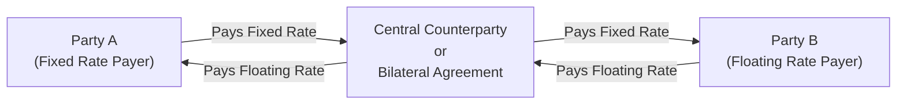

## 9.2 What Is a Swap?

Swaps are an essential—and often fascinating—part of the derivatives world. They’re a step up in complexity compared to something like a simple future or option, but the core idea isn’t too tough: two parties agree to exchange sets of cash flows (payments) over time. In many cases, these payments are based on different interest rates, different currencies, or different reference points (like credit events). Believe it or not, a quick coffee-shop conversation once helped me finally “get” swaps: A friend casually mentioned how her company pays a fixed rate but prefers floating, while another company wanted the opposite. Turns out, they just swapped obligations. Let’s explore what that means on a more detailed level.

---
### Defining a Swap in Plain English

At its most basic, a swap is a contract where two parties decide to trade (or exchange) one stream of cash flow for another. These exchanges are usually designed around things like:
• Fixed interest rates vs. floating interest rates  
• Different currencies (e.g., Canadian dollars vs. U.S. dollars)  
• Different types of exposures (like credit default swaps)  

Unlike many other derivatives, swaps can be heavily customized. You want a three-year contract? Great. Six months with monthly payments? Sure. Notional amounts in the billions or just a few million? All negotiable. That flexibility is one big reason why swaps have become so widespread.

---
### Why Do Swaps Exist?

Swaps let parties tailor their exposure to market conditions. It’s that simple. If you have a loan with a fixed interest rate but you think markets look better for floating, you might enter into a swap that effectively changes your fixed rate payment into a floating rate payment. This can reduce or increase your risk, depending on your outlook.

• Hedging Risk: Corporations often use swaps to protect themselves from interest rate movements or currency fluctuations.  
• Reducing Financing Costs: Sometimes a company can borrow at a lower fixed rate, but it would rather pay floating (or vice versa). Through a swap, it aligns its payments with its preferences and can sometimes lower its overall cost of funding.  
• Managing Currency Risk: Think about a Canadian company generating revenue in U.S. dollars but paying many bills in Canadian dollars. A currency swap can help cover that mismatch.  
• Enhancing Returns: Sometimes, speculators or investors use swaps if they see an opportunity to profit from changing rates or currency moves.  

---
### Fundamentals of Swap Mechanics

In a typical swap, we talk about two legs (payment streams). Let’s say you and I have a swap contract:  
• I pay you a fixed interest rate (like 5%) on a notional amount.  
• You pay me a floating rate (like CORRA plus a spread) on that same notional.  

Crucially, the notional principal is often used only to calculate payment amounts—it doesn’t necessarily change hands. If we’re dealing with a currency swap, though, the principal amounts can actually be exchanged at the start or the end of the contract (or both), each in different currencies.

To visualize this, consider the following diagram. It’s a simplified flow of how an interest rate swap might look when there’s a clearinghouse or, in some cases, a bilateral agreement:

Here, “Party A” and “Party B” do not make direct payments to each other; they each face the central counterparty (often called a CCP). If there’s no CCP, then it’s a bilateral swap, and each party is directly exposed to the credit risk of the other.

---
### Customizing the Swap

One beauty of swaps is that they’re super flexible. Indeed, they’re like that custom-tailored suit or dress you can’t buy off the rack. In practical terms, that means:

• Maturity: Could be a few months or 30 years.  
• Payment Frequency: Monthly, quarterly, semi-annually—whatever you negotiate.  
• Notional Amount: Almost any size, as long as both parties agree.  
• Collateralization: You might have an arrangement that says, “If the value of this swap moves in my favor by more than X, you post collateral,” and vice versa.  

In the Canadian market context, you’ll often see references to relevant rules from CIRO—Canada’s national self-regulatory organization. Regulations specify how these swaps are reported, cleared, and collateralized.

---
### Key Terms to Keep in Mind

Here’s a quick glossary for clarity:

**Notional Amount**  
The face value used to determine payments in the swap. In many interest rate swaps, no one actually exchanges this principal. We just need it to compute the interest payments.

**Fixed Rate**  
A set interest rate that won’t change for the contract’s duration. For instance, 5% annual interest on a CAD 10 million notional.

**Floating Rate**  
An interest rate that varies, typically tied to a reference like CORRA (Canadian Overnight Repo Rate Average) or a global benchmark such as SOFR. Sometimes there’s an added or subtracted margin (e.g., CORRA + 0.5%).

**Collateralization**  
Swaps can expose each side to credit risk. Collateral is posted—often in the form of cash or high-quality securities—to mitigate that. If the swap’s value moves against you, you might owe collateral to your counterparty (and get it back when the market moves in the other direction or the swap expires).

**Central Counterparty (CCP)**  
A clearinghouse that inserts itself between the buyer and seller. A CCP helps manage credit risk by requiring daily margin payments and having robust default procedures. It’s a big part of how regulators seek to make the derivatives market safer.

---
### Credits, Collateral, and the Clearing Conundrum

Before the 2008 financial crisis, many swaps were traded bilaterally (just between two parties). However, one big lesson from that crisis was that credit risk in these markets could be massive. If one large player failed, it could domino. Now, regulators worldwide require central clearing for many standardized swap contracts. In Canada, for instance, CSA National Instrument 94-101 mandates central clearing of certain derivative transactions, including standard interest rate swaps denominated in CAD, USD, EUR, or GBP.

Clearing these swaps typically involves a clearinghouse—like the London Clearing House (LCH) or in some cases the Canadian Derivatives Clearing Corporation (CDCC). The clearinghouse stands between you and your counterparty, so your risk is primarily with the CCP, not with the other party.

And if you’re not required to clear your swap, or your swap is more customized and not subject to clearing, you’ll likely consider a Credit Support Annex (CSA) to your ISDA Master Agreement. This is a fancy contract that explains how and when collateral is to be posted, how valuations are done, etc.

---
### Example: Interest Rate Swap

You might be wondering: how does all of this look in real life? Let’s walk through a (fictional) scenario with numbers.

1. Company Maple Stream borrows CAD 10 million at a fixed 5% annual rate for five years from a bank.  
2. However, Maple Stream really wants to pay a floating rate—maybe it believes that rates might go down or it’s comfortable with variable payments.  
3. Maple Stream enters into an interest rate swap with a dealer (the other side). Maple Stream agrees to pay floating and receive fixed at 5%.  
4. On the notional of CAD 10 million, it will pay, say, CORRA + 0.25% to the dealer. The dealer will pay Maple Stream the 5% fixed rate.  

In effect, Maple Stream:  
• Pays 5% to the bank (the original loan).  
• Receives ~5% from the swap.  
• Pays CORRA + 0.25% in the swap.  

So the 5% from the swap helps offset the 5% it pays to the bank, leaving Maple Stream effectively paying just CORRA + 0.25%. Mission accomplished: Maple Stream effectively moved from paying fixed to paying floating.

Of course, if CORRA goes way up, Maple Stream could end up paying a lot more. That’s the risk. A swap is not free lunch; it’s simply exchanging one set of exposures for another.

---
### Example: Currency Swap

Let’s see how currency swaps might work. Suppose a Canadian firm, EhExports Inc., borrowed CAD 1 million in Canada at a 4% fixed rate for three years but needs to pay suppliers in euros. At the same time, a European company, EuroMakers GmbH, might have borrowing in euros at a low rate but wants CAD for expansion in Canada.

In a typical currency swap:
• EhExports Inc. might pay interest in euros (and eventually repay the euro principal) to EuroMakers.  
• EuroMakers pays interest in Canadian dollars and eventually repays the CAD principal to EhExports.  

These principal amounts may actually be exchanged at the start or the end of the swap. This arrangement helps each side manage the currency it truly needs without going through multiple foreign exchange transactions over time.

---
### Risks and Mitigations

Okay, so we know swaps are flexible and widely used, but, like any derivative, they come with risks:

• **Credit Risk/Counterparty Risk**: What if the other side can’t make its payments? Central clearing and collateralization help with this.  
• **Market/Interest Rate Risk**: If rates move in an unexpected direction, you can lose out.  
• **Liquidity Risk**: Not all swaps are easy to exit. You can’t just close a swap position as easily as closing a futures position on an exchange. Sometimes you have to negotiate an unwind.  
• **Operational Risk**: Complex documentation can lead to errors or misunderstandings.  

Best practices to mitigate these risks include thoroughly negotiating an ISDA Master Agreement (with robust definitions of everything), setting up or participating in central clearing, and ensuring continuous valuation plus margin posting.

---
### Regulatory Framework in Canada

In Canada, CIRO (the Canadian Investment Regulatory Organization) oversees investment dealers, ensuring compliance with rules to protect investors and bolster market integrity. CIRO has replaced IIROC and MFDA as of 2023, so if you see references to those, keep in mind they’re now defunct SROs. When it comes to swaps:
• **Trade Reporting**: You typically need to report swap activity to an approved trade repository.  
• **Clearing**: Many standardized interest rate swaps must be centrally cleared according to CSA NI 94-101.  
• **Capital & Margin Requirements**: Firms may need to hold sufficient capital and margin to cover potential exposures.

On the institutional side, big banks, pension funds, and asset managers also keep an eye on the guidelines set by organizations like the Basel Committee on Banking Supervision, which influences how capital charges and margin requirements are determined for derivatives.  

For official updates, see:
• [CIRO](https://www.ciro.ca)  
• [ISDA](https://www.isda.org)  
• [CSA NI 94-101](https://www.securities-administrators.ca)

---
### Everyday Relevance

Someone might ask, “So, how does this matter to me personally?” You know, it’s true: many retail investors don’t directly use swaps. But the large, seemingly invisible scaffolding behind your mortgage rate might very well link to the swaps market. Banks with floating-rate mortgage portfolios often shift risk using interest rate swaps. Pension funds might use swaps to better match their liabilities, so retirees’ pensions remain stable. Even the local municipal government might rely on interest rate swaps to manage the cost of infrastructure borrowing. Swaps, though behind the scenes, can influence interest rates and credit availability, indirectly touching everyday life.

---
### Brief Personal Anecdote

I once worked with a small manufacturing company that supplied parts to the U.S. auto market. They were paid in U.S. dollars, but their main operating costs were in Canadian dollars. When the CAD appreciated, they found their profit margins got hammered, because the same U.S. revenue converted into fewer Canadian dollars. They eventually used a currency swap—arranged through a bank—to lock in an effective exchange rate. It was surprisingly straightforward to do, although the documentation was lengthier than expected. It was a good lesson in how these instruments, though complicated on paper, can provide straightforward risk management solutions.

---
### Real-World Tools and Resources

Swaps aren’t something you just do in a vacuum—there are tools out there that can help with pricing and risk:

• **Bloomberg Terminal** or **Reuters Eikon**: For real-time pricing and analytics on interest rates, yield curves, and currency quotes.  
• **ISDA Master Agreement Templates**: Found on the [ISDA website](https://www.isda.org). These are the backbone for swap transactions.  
• **CSA NI 94-101**: The Canadian regulation around mandatory CCP clearing.  
• **Open-Source Tools** (like QuantLib): Provide libraries for pricing interest rate swaps and other derivatives, including day count conventions, date roll rules, and yield curve building logic.  

---
### Key Takeaways

• A swap is a contract for exchanging future cash flows (like fixed interest for floating) on a notional amount.  
• Customization is key—swaps are versatile in terms of maturity, rates, payment frequency, etc.  
• Credit risk is an important consideration. Collateralization or central clearing can reduce it.  
• Swaps serve an essential role in financial markets, allowing companies and investors to hedge, reduce costs, or speculate.  
• In Canada, CIRO oversees dealers’ compliance, and clearing is often mandated for standardized swap contracts.

That about sums up the gist of “What is a Swap?”—the next time you hear about interest rate or currency hedging, you’ll know somebody somewhere is swapping away to meet their financial goals.

---

## Sample Exam Questions: Mastering the Basics of Swaps



### Which statement best describes a swap?

- [x] A contract in which two parties exchange sets of cash flows based on different underlying rates or assets.
- [ ] A spot transaction in the currency market with immediate exchange of principal.
- [ ] A fully standardized product traded exclusively on public exchanges with daily settlement.
- [ ] A fixed-rate security issued by governments for long-term funding.

> **Explanation:** A swap is a bilateral or centrally cleared contract involving exchanges of cash flows. It’s not a spot transaction or an exchange-traded standardized product.

### In a plain-vanilla interest rate swap, one party typically pays:

- [ ] A call option premium and receives a put option premium.
- [x] A fixed interest rate and receives a floating interest rate, or vice versa.
- [ ] A flexible premium structure with embedded barrier options.
- [ ] Nothing at all; payment occurs only when interest rates exceed a threshold.

> **Explanation:** By definition, a plain-vanilla interest rate swap involves exchanging fixed and floating rates on a notional principal.

### What is a notional amount in a swap?

- [ ] The actual amount exchanged by both parties at the conclusion of the swap.
- [ ] The discounted value of the swap's final settlement.
- [x] A reference amount used to calculate the periodic interest payments.
- [ ] A collateral value allocation used for posting margin.

> **Explanation:** The notional is often not exchanged physically; it’s used as a basis to calculate interest or other payments.

### One reason companies enter into currency swaps is to:

- [x] Obtain financing in a more favorable currency or interest rate environment.
- [ ] Speculate on stock price movements in equity markets.
- [ ] Dodge all regulatory oversight by avoiding standardized contracts.
- [ ] Temporarily eliminate internal cross-department liabilities.

> **Explanation:** Currency swaps allow firms to access better rates or reduce currency risk. It’s not about speculating on equity markets or circumventing regulations.

### Which entity typically steps in between counterparties to reduce credit risk in standardized swaps?

- [ ] The original commercial bank that issued the swap agreement.
- [x] A central counterparty (CCP).
- [ ] A private equity fund providing rescue financing.
- [ ] A mutual fund trustee.

> **Explanation:** The CCP stands between swap counterparties and manages credit exposure through margining and default mechanisms.

### Why is collateralization important in a bilateral swap?

- [x] It mitigates credit risk by requiring the posting of assets when a swap position is out-of-the-money.
- [ ] It ensures that the contract never deviates from a breakeven point.
- [ ] It simplifies the legal documentation and eliminates the need for an ISDA Agreement.
- [ ] It fixes the market price of the swap so parties no longer face interest rate risk.

> **Explanation:** Collateralization helps reduce credit risk but doesn’t fix the price or void the need for proper documentation.

### What is the primary function of an ISDA Master Agreement?

- [ ] It eliminates the need to calculate margin calls.
- [ ] It forces all swaps to be standardized with fixed maturities.
- [x] It sets standard legal terms and conditions, laying out how swaps will operate.
- [ ] It replaces all references to notional amounts with actual principal exchanges.

> **Explanation:** The ISDA Master Agreement is a legal framework that defines the terms, default procedures, and other conditions for OTC derivatives, including swaps.

### Under CSA National Instrument 94-101, certain interest rate swaps in Canada must:

- [ ] Be exclusively settled in physical commodities.
- [ ] Be reported only to the local branch of the Bank of Canada.
- [x] Be cleared through a recognized central counterparty.
- [ ] Be executed on a recognized exchange with daily price limits.

> **Explanation:** NI 94-101 mandates central clearing for many standardized derivatives, including standard interest rate swaps.

### Which scenario best describes the outcome for a company paying fixed and receiving floating on an interest rate swap if interest rates rise significantly?

- [ ] The company will pay more, as it’s on the floating side.
- [x] The company benefits, because it receives floating payments that increase with the reference rate.
- [ ] Both parties have to terminate the contract immediately.
- [ ] The notional principal is automatically converted to floating.

> **Explanation:** If a company receives floating and rates rise, it receives higher payments, improving its swap position.

### True or False: In a currency swap, principal amounts are never exchanged.

- [ ] True
- [x] False

> **Explanation:** In many currency swaps, the parties exchange principal at the inception or maturity (or both) to manage currency exposure.  


