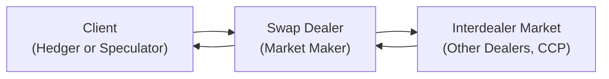

## 9.3 Role of the Swap Dealer

Swap dealers are the vital spark plugs in the machinery of over-the-counter swap markets. Seriously—without them, the entire system would feel disjointed, liquidity would suffer, and hedgers looking to manage big monetary exposures might be stuck. But how do swap dealers operate under the watchful eye of Canada’s regulatory environment? How do they balance their own risk positions while serving as a market facilitator for their clients? In this section, we’ll talk through the role of the swap dealer, blending in just enough informal commentary to keep it relatable. We’ll highlight core concepts, real-world examples, and share a few personal anecdotes along the way.

Before we dive in, let’s do a quick refresher on what we mean by “swaps.” Broadly, a swap is a legally binding derivative contract wherein two parties exchange or “swap” cash flows, typically based on different interest rates, different currencies, or even different credit exposures. The swap dealer is the entity that stands at the center of all this—offering quotes, matching counterparties, and making sure the trades flow smoothly. Ready? Let’s get rolling.

---

### Understanding the Intermediary Role

Swap dealers are commonly large financial institutions, like banks or specialized divisions within investment firms, that focus on making markets in swap contracts. A typical day for a swap dealer could include tasks like:

• Negotiating swap pricing with corporate treasury teams.
• Talking to institutional investors about hedging currency exposures.
• Reviewing the internal “book” of open swaps to see if there’s an unbalanced risk that needs offsetting.
• Entering trades into clearing systems to comply with mandatory clearing regulations.

These folks serve as facilitators (often referred to as “market makers”) by continuously quoting prices to potential swap counterparties. In other words, a swap dealer can help fix your interest rate if you’re worried about market volatility. Maybe you’re an oil producer in Alberta that wants to lock in a floating-to-fixed interest rate swap for your capital expansion plans. Or you’re a bank in Toronto wanting to regulate your foreign exchange exposures for cross-border transactions. You’d call up your swap dealer. They’d quote you a rate, enter into that swap, and then manage the risk on their own books.

#### Swap Dealer as Market Maker

In the most basic sense, a **market maker** is someone or some entity that stands ready to buy and sell a particular financial instrument at any given time, ensuring there’s ongoing liquidity. For swaps—especially large, over-the-counter swaps—this role can be a sophisticated and complicated dance. Let me share a quick anecdote: Many moons ago, I visited a friend working on a derivatives desk. I was in awe watching them simultaneously negotiate over the phone with a corporate client, swap messages with interdealer brokers, and monitor multiple screens charting yield curves. The complexity was dizzying, but it boiled down to a fairly simple premise: they were always prepared to give a price—any time, any day.

---

### Facilitating Hedging and Speculation

Swap dealers cater to a wide range of clients, from small corporate entities to major multinational institutions. Hedgers come in to mitigate risk, while speculators seek to profit from interest rate or currency movements. Let’s break this down:

• Hedgers: Suppose you’re a local municipality in Québec with floating-rate debt. You want the certainty of fixed interest payments. A swap dealer can structure a floating-to-fixed interest rate swap, so you pay a stable rate and receive a floating rate (offsetting your debt liability).  
• Speculators: An asset manager in Vancouver might believe interest rates will fall over the next year. They can enter a pay-fixed/receive-floating swap to profit from a potential decline in rates.

The swap dealer’s job? Quote the terms, finalize the contract, and stand as the counterparty so the trade can happen.

---

### Managing Risk Through the Interdealer Market

Whenever swap dealers match a client’s swap, they immediately acquire risk. Let’s say the bank has just entered into a 5-year floating-to-fixed interest rate swap with a client. Now the bank must pay floating and receive fixed, or vice versa, depending on the contract. If the bank does nothing else, it is exposed to potential changes in interest rates. This is where the **interdealer market** enters the picture.

• **Interdealer Market**: A space where large financial institutions trade with one another to rebalance exposures. In practice, a dealer might lay off some or all the risk from a new swap trade by entering an offsetting transaction with another dealer, a prime broker, or a central clearinghouse.  

By continuously redistributing these risks, swap dealers try to maintain (at least close to) a balanced book. However, “balanced” doesn’t always mean zero exposure. Some swap dealers will keep certain positions open if they hold a house view on interest rates or see potential for profit from short-term mispricing. But generally, they want to keep parameters within strict risk limits set by their internal risk committees.

A quick personal note: Managing that interdealer offset is so crucial. I recall a senior swap trader remarking, “If we forget to hedge or offset just once, we might wake up in the morning with a million-dollar surprise. And that’s not the fun kind of surprise.” This underscores how important the risk offset process is.

---

### Regulatory Oversight: CIRO Registration and CSA Guidelines

Canada’s derivative landscape changed significantly on January 1, 2023, when the Mutual Fund Dealers Association of Canada (MFDA) and the Investment Industry Regulatory Organization of Canada (IIROC) were amalgamated into the Canadian Investment Regulatory Organization (CIRO). For anyone seeking to conduct swap dealing activity in Canada, CIRO is the main gatekeeper supervising registration, sales practices, and ongoing regulatory obligations.

Swap dealers in Canada typically must:

• Register with CIRO under the appropriate derivatives dealer category.  
• Maintain sufficient capital to ensure that the dealer can withstand market shocks.  
• Comply with the Canadian Securities Administrators (CSA) guidelines on trade reporting, risk management, and margin collection for derivatives transactions. (See the CSA website at https://www.securities-administrators.ca for more detail.)

Adherence to these rules helps preserve the integrity and stability of Canadian markets. As a result, participants can trust that swap dealers will meet daily obligations such as posting collateral, collecting margin, and properly disclosing trades to recognized repositories. If you ever want to geek out on the nitty-gritty of these requirements, you can check out official bulletins and staff notices on the CIRO site at https://www.ciro.ca.

---

### Central Clearing and Margin Requirements

Prior to the 2008 financial crisis, many over-the-counter swaps were bilateral, meaning the two counterparties simply traded with each other without sending the contract to a central clearinghouse. However, regulatory evolutions—especially those shaped by the Dodd-Frank Act in the U.S. and mirrored by global frameworks like those from the Bank for International Settlements—significantly changed that model.

Today, large portions of standardized swaps must be cleared through a central clearing counterparty (CCP). In the Canadian context, clearing often goes through recognized clearinghouses such as the Canadian Derivatives Clearing Corporation (CDCC) or global clearing providers if cross-border trades are involved. So how does a swap dealer fit in?

• **Initial Margin**: When a new swap trade is submitted to clearing, the CCP calculates an initial margin requirement to account for potential future exposures. The swap dealer is responsible for collecting that margin from the client and posting it to the CCP (unless the client is also a direct clearing member, which is less common for smaller players).  
• **Variation Margin**: Over time, as interest rates or exchange rates move, the value of the swap changes. Gains or losses are tallied each day (or even more frequently in volatile markets), and margin calls go out. The swap dealer ensures these daily or intraday margin calls (variation margin) are posted or collected, maintaining the financial integrity of the entire system.

In essence, the swap dealer orchestrates the process of taking a client’s swap and funneling it into the clearing system so that the positions are accounted for in a timely manner. There’s a lot of behind-the-scenes operational choreography, from matching trade details (i.e., verifying notional amounts, fixed rates, payment schedules) to ensuring margin is properly segregated.

---

### Diagram: How a Swap Dealer Interacts with Clients and the Interdealer Market

Below is a simplified mermaid diagram showing how a swap dealer stands between clients and the interdealer market:

• Step 1: The client approaches the swap dealer for a quote.  
• Step 2: The swap dealer takes on the new trade.  
• Step 3: The swap dealer then offsets this risk in the interdealer market or via central clearing.  
• Step 4: The cycle continues, keeping liquidity flowing.

---

### Risk Management and Internal Book Management

A swap dealer’s “book” is a constantly moving puzzle. Each new swap modifies the overall exposures—interest rate, currency, or credit. The dealer’s risk management desk monitors these exposures in real time:

• **Interest Rate Risk**: Sensitivity to changes in rates across different maturities.  
• **Currency Risk**: For cross-currency swaps, the dealer might have open exposures to foreign exchange movements.  
• **Counterparty Credit Risk**: The possibility that a client or another dealer might not fulfill their obligations.  
• **Liquidity Risk**: The risk that the dealer might not be able to offset a position quickly if the market seizes up.

To manage these risks, dealers may employ advanced analytics, scenario analyses, and complex hedging strategies. For example, if the dealer sees that 80% of their swaps are currently receiving a fixed rate and paying a floating rate in Canadian dollars, they might look to put on an offsetting swap in the interdealer market or even enter a futures contract on an interest rate benchmark to balance out interest rate exposure.

Another interesting aspect is how dealers sometimes rely on short-term interest rate futures (like BAX or CORRA-based futures in Canada) to hedge the near-term portion of a swap’s floating rate. A swap can have a 10-year lifespan, so layering on multiple short-term futures to replicate that floating exposure can be complex. But it can also be cost-effective and flexible.

---

### Compliance with CIRO Capital Requirements

If anything, the 2008 crisis taught the world about the importance of robust capital reserves. Under CIRO’s rules, swap dealers must maintain higher levels of capital to absorb unexpected losses. This ensures that if there’s a sudden shift in rates or a counterparty defaults, the swap dealer can handle the wrinkles without collapsing.

Capital requirements can cover:

• Tier 1 and Tier 2 capital calculations (similar to Basel principles adopted by the Office of the Superintendent of Financial Institutions (OSFI) in Canada).  
• Additional buffers for credit valuation adjustment (CVA) risk—basically, the risk that the dealer could suffer a loss in marking their counterparty risk to market.  
• Leverage ratio constraints to prevent dealers from building up too much exposure relative to their underlying capital.

This not only keeps the Canadian marketplace stable but also instills confidence in clients who rely on swap dealers for major interest rate or currency exposures.

---

### Evolution of the Advisor-Dealer Relationship

As the market evolves, many dealers also provide advisory services. They’ll help a corporation carve out a hedging strategy, or they might guide a pension fund on portfolio rebalancing. In some ways, the lines are blurring between purely executing trades and offering advanced insight. However, under CIRO guidelines, there’s a clear legal distinction between an entity acting as a registered dealer (executing trades) and one acting as an advisor (offering advice on derivatives strategy). Institutions that straddle both roles must carefully manage conflict-of-interest rules, disclosure requirements, and best execution policies.

---

### Potential Pitfalls and Challenges

Despite their vital role, swap dealers can encounter several challenges:

• **Regulatory Arbitrage**: If a dealer operates globally, they may face different margin or clearing requirements in other jurisdictions (e.g., the U.S. or the EU), which complicates compliance.  
• **Market Volatility**: Sudden spikes in volatility—especially in times of unexpected central bank announcements—can catch swap dealers off guard, leading to large margin calls or losses.  
• **Liquidity Events**: While dealers typically stand ready to make markets, extreme events (like a pandemic shock or a major sovereign default) can dry up swap liquidity, forcing dealers to hold unbalanced positions for longer than intended.  
• **Operational Risks**: Managing a complex global network of interdealer relationships, clearinghouses, and daily treasury functions can create operational risk, from settlement errors to technology failures.

But with robust risk-management frameworks, these hurdles become more manageable. Tools like real-time position monitoring, automated margin-call systems, and thorough stress tests are now standard. Additionally, global capital rules have introduced new “buffers” to reduce the likelihood of meltdown scenarios.

---

### Practical Example: Interest Rate Swap on a Ten-Year Bond

Let’s consider a simple hypothetical. Suppose you’re the CFO of a mid-sized tech firm in Ontario. You’re about to issue a 10-year fixed-rate bond at 5%, but you believe interest rates might drop soon. You’d rather have floating-rate debt, or at least you want to see if you can benefit from falling rates. A swap dealer can:

1. Sign a swap with you where you pay floating rates (based on 3-month CORRA) and receive fixed (5%).  
2. The net effect is that you effectively convert your fixed-rate bond issuance into a floating-rate liability.  
3. The dealer, now receiving fixed and paying floating to you, will hedge by entering another offsetting swap in the interdealer market or possibly offset it with a futures position.

Through this arrangement, you—our hypothetical CFO—lock in a beneficial structure aligned with your interest rate outlook and risk appetite. Meanwhile, the swap dealer picks up the spread on both sides of the transaction, adds to their inventory of offsetting swaps, and ensures the overall book remains balanced (or as close to balanced as desired).

---

### Personal Observations on Trading Desks

I once overheard a swap dealer chuckling about how each new client trade was like a piece of a giant puzzle. Place one piece, and you discover three other edges that need matching. “You know,” he said, “sometimes I feel like I’m constantly juggling flaming swords, but at least it keeps me awake.” That sense of controlled chaos is part of the daily grind of life on a swap desk. Yet it’s precisely that environment that fosters creativity in risk management and leads to innovative custom solutions for clients.

---

### Best Practices for Clients Working with Swap Dealers

From a client perspective, it pays to:

• **Shop Around**: Different dealers offer different swap rates, influenced by their market view and risk appetite.  
• **Understand Credit Terms**: Carefully review credit support annexes (CSAs) that detail your margin obligations, rating triggers, and steps to resolve disputes.  
• **Monitor Collateral**: Keep track of your daily margin calls and ensure you have sufficient liquidity.  
• **Review Documentation**: Swaps are governed by ISDA Master Agreements—a standardized contract. Make sure you understand the definitions, early termination clauses, and any new protocols that might apply (e.g., the new fallback rates for CDOR in Canada or LIBOR in other countries).  

---

### Glossary

• **Market Maker**: An entity obligated or prepared to provide bids and offers in a financial instrument to foster liquidity.  
• **Interdealer Market**: A network where financial institutions deal directly with each other—often used by dealers to offset or hedge their positions.  
• **Initial Margin**: Collateral required at the outset of a cleared swap to mitigate potential future exposure if one party defaults.  
• **Variation Margin**: Daily or intraday collateral exchanged to cover changes in the market value of outstanding swaps.  

---

### Recommended References

• CIRO Registration Categories: https://www.ciro.ca  
• CSA Guidance on Dealer Oversight: https://www.securities-administrators.ca  
• Risk Journals at Risk.net: https://www.risk.net/  
• Moody’s Analytics and S&P Global Market Intelligence for credit analysis.  

For deeper exploration, consider the following resources:  
• “Swaps and Other Derivatives” by Richard Flavell provides an in-depth look at swap structuring.  
• The Office of the Superintendent of Financial Institutions (OSFI) guidelines on capital adequacy in Canada.  
• Global best practices from the International Swaps and Derivatives Association (ISDA) regarding standard documentation and protocols.

---

### Bringing It All Together

In the grand tapestry of derivatives, the swap dealer is that critical node weaving together the threads. They help corporate treasurers, pension funds, insurers, and even other banks achieve their hedging or speculative goals. At the same time, dealers juggle their own balance sheets, constantly reorienting exposures in the interdealer market or via futures and other hedging vehicles. Without their role, we’d likely see huge gaps in liquidity, less efficient pricing, and higher risk for everyone.

Whether you’re brand new to the idea of swaps or deeply familiar but wanting to refine your understanding, the key takeaway is this: a swap dealer is not just a sales agent. They are risk managers, market makers, clearing facilitators, and compliance experts all rolled into one. Under Canada’s post-2023 CIRO regime, these responsibilities are as pressing as ever. So next time you see those sometimes cryptic references to “Swap Valuation Adjustments” or “CSA Collateral Terms,” just remember—there’s a lot going on behind the scenes, and the dealer is right in the thick of it.

---

## Sample Exam Questions: Role of the Swap Dealer



### Which of the following best describes the role of a swap dealer in the financial markets?

- [x] They provide liquidity by quoting prices and acting as an intermediary for swap transactions.
- [ ] They only serve as a regulator for currency swaps in Canada.
- [ ] They are solely responsible for collecting taxes on derivatives trading.
- [ ] They exclusively take large speculative positions but do not hedge risk.

> **Explanation:** A swap dealer’s primary function is to make markets and facilitate customer transactions, not simply to speculate or regulate. They provide liquidity by quoting buy and sell rates and act as an intermediary that helps customers hedge or speculate.

### A swap dealer offsets the market risk of a newly executed swap in the interdealer market in order to:

- [x] Maintain a balanced or hedged internal book of exposures.
- [ ] Completely eliminate all risk in one fell swoop from the marketplace.
- [ ] Increase the overall margin obligations they must post.
- [ ] Inflate transaction costs for clients.

> **Explanation:** Once a dealer executes a new swap with a client, it often offsets (or “lays off”) that risk by entering another position in the interdealer market. This helps the dealer maintain a balanced portfolio rather than accumulating large unhedged positions.

### In Canada, which regulatory body oversees the registration and conduct of swap dealers as of 2025?

- [x] The Canadian Investment Regulatory Organization (CIRO).
- [ ] The Investment Industry Regulatory Organization of Canada (IIROC).
- [ ] The Mutual Fund Dealers Association of Canada (MFDA).
- [ ] Office of the Superintendent of Financial Institutions (OSFI) alone.

> **Explanation:** As of January 1, 2023, the MFDA and IIROC amalgamated into CIRO. CIRO is now the primary self-regulatory body for investment and mutual fund dealers, including the oversight of swap dealers. OSFI still supervises banks’ capital requirements, but CIRO handles day-to-day registration and conduct rules for dealers.

### What is a key regulatory requirement for swap dealers regarding cleared derivatives?

- [x] Ensuring that initial and variation margin requirements are collected and posted to the CCP.
- [ ] Refusing to clear any swaps with credit risk.
- [ ] Holding no capital reserves for swap exposures.
- [ ] Reporting only profitable trades to regulators.

> **Explanation:** Swap dealers must submit eligible swaps for central clearing, collect initial margin from clients when the position is opened, and ensure daily (or intraday) variation margin is posted to the central clearing counterparty. This is a core post-crisis reform.

### How does a swap dealer typically manage interest rate risk for a swap where it pays fixed and receives floating?

- [ ] It leaves the position unhedged to profit from interest rate movement.
- [x] It may enter an offsetting swap or use futures/treasury securities to hedge.
- [ ] It converts all floating portions to another currency.
- [ ] It seeks immediate liquidation by unwinding the swap the same day.

> **Explanation:** Entering offsetting trades (either with other dealers or via futures/treasury derivatives) is a common way for the swap dealer to manage and hedge interest rate risk. Holding unhedged positions can be risky and usually contradicts internal risk limits.

### Which of the following describes the interdealer market?

- [ ] A place where only retail investors can trade.
- [x] A network where major financial institutions trade swaps with each other to lay off or acquire risk.
- [ ] A community forum for discussing daily swap quotes with the public.
- [ ] A mandatory clearinghouse for all Canadian swaps.

> **Explanation:** The interdealer market is where large institutional dealers trade with each other. By doing so, they redistribute risk from their client deals and maintain liquidity.

### A swap dealer’s “book” can include which types of risk?

- [x] Interest rate, currency, liquidity, and counterparty credit risks.
- [ ] Only operational risk, with no market risks involved.
- [ ] Exclusively stock market price risk.
- [ ] No risk whatsoever, as swaps are always perfectly hedged.

> **Explanation:** A swap dealer deals with an array of exposures, such as interest rate risk, foreign exchange risk (in cross-currency swaps), credit risk, and liquidity risk. They continually monitor and hedge these risks.

### Why must swap dealers in Canada maintain adequate capital and adhere to CIRO rules?

- [x] To protect market integrity and ensure they can withstand potential losses from trades or counterparty defaults.
- [ ] To avoid paying taxes on high-leverage positions.
- [ ] To guarantee zero losses for all clients.
- [ ] To avoid the requirement of any margin for swaps trading.

> **Explanation:** Keeping adequate capital is crucial because it ensures a dealer can sustain unexpected market shifts or credit events without collapsing. CIRO enforces these requirements to maintain a stable and trustworthy marketplace.

### A Canadian swap dealer is helping a client hedge floating-rate debt with a fixed-for-floating interest rate swap. Which margin procedure typically applies if the swap is cleared?

- [x] The dealer must collect initial margin upon trade execution and post variation margin daily to the CCP.
- [ ] The client posts a single large margin at maturity.
- [ ] Margin requirements are optional for cleared swaps in Canada.
- [ ] The client must post zero collateral if the notional is under $10 million.

> **Explanation:** Under central clearing mandates, both initial margin (at trade inception) and variation margin (daily or intraday) are standard. This approach reduces systemic risk by ensuring that changes in the trade’s value are regularly collateralized.

### True or False: A swap dealer is typically restricted to offering only standardized swap contracts, with no flexibility to customize terms for clients.

- [ ] True
- [x] False

> **Explanation:** One key difference between over-the-counter swaps and exchange-traded derivatives is customization. Swap dealers often tailor contract terms (notional, maturity, payment frequency) to fit a client’s exact needs, unlike standardized exchange contracts.


