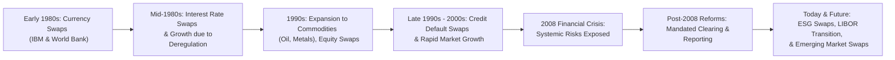

## 9.4 History of Swaps

So, let's talk about swaps—those financial instruments that let two parties exchange (or “swap”) cash flows, risks, or returns. The idea can feel abstract at first, but think of it like swapping your fixed-rate mortgage for your neighbor’s variable-rate mortgage if you both preferred the other’s terms. It’s not exactly the same in legal terms, but that’s the general idea.

Anyway, in this section, we’ll check out where swaps came from, how they grew popular, and how they’ve evolved—especially in light of a few big shocks (yes, I’m looking at you, 2008 financial crisis!). Some of my earliest exposures to swaps involved hearing stories of big corporations like IBM and the World Bank basically saying, “Hey, we’re each holding debt in the wrong currency. Let’s figure out how to fix that together.” And that’s where the first formal swap was born. 

Before diving into the origin story, let’s remember what a swap is in practice: Typically, two parties exchange payment streams tied to different interest rates, currencies, or even commodity prices. Over time, the concept expanded to credit default swaps and many other variations. These trades are commonly done over the counter (OTC) or, in certain cases, through central clearing. Although the earliest ones were hammered out on telephones, it’s now a multi-trillion-dollar daily business.

Let’s go back in time…

---

Early 1980s: The Birth of Currency and Interest Rate Swaps  
Well, the early 1980s were a wild time in finance anyway—interest rates were sky-high in some countries, deregulation was sweeping across the globe, and computers were becoming more powerful. Banks and big companies needed efficient ways to manage the risk from fluctuating interest rates and currency exchange rates. 

The earliest recognized swap is often cited in connection with IBM and the World Bank. The rumor—and by rumor, I mean well-documented history—says that IBM had borrowed money denominated in Swiss francs and German marks. IBM was worried that those currencies could change in value in ways that might put them at a disadvantage if they held on to that debt. Meanwhile, the World Bank wanted Swiss francs and German marks but also had better access to U.S. dollar funding. So, the two found a solution: each party swapped their debt obligations, effectively converting their currency exposures. 

It was a classic example of “win-win,” assuming, of course, the arrangement was properly papered and the new exposures aligned with each party’s needs. This was a direct currency swap, but the concept quickly got borrowed and retooled for interest-rate-only transactions. 

---

Growth of the Interest Rate Swap Market  
In the 1980s, the notion of risk management exploded. Especially in the U.S. and U.K., deregulation was changing how banks and corporations could raise funds. At the same time, interest rate volatility was fierce. If you were a bank with many floating-rate assets, you might prefer to pay fixed and receive floating to reduce your exposure to rising rates. If you were an insurance company with a lot of fixed products to pay out, you might want the opposite. Each side saw an opportunity to hedge their risk or get better financing rates—if only they could find a partner with the reverse needs.

That’s basically the impetus for interest rate swaps: two counterparties with opposite bread-and-butter exposures. You can almost imagine two CFOs at a cocktail party in 1983: “We’re worried about interest rates ticking up.” “Oh, no kidding; we’re worried they’ll tick down. Let’s talk on Monday.” Bingo, a deal is born.  

In time, banks took on a new role as swap dealers. They’d either find a matching counterparty or warehouse the risk for a fee, building up big swaps desks. Before we knew it, swap volumes soared. If you check out Bank for International Settlements (BIS) data from that era, you’ll see a remarkable climb in notional outstanding in interest rate swaps from the mid-1980s onward.  

---

Expansion to Commodities, Equities, and Credit  
It didn’t stop with interest rates. As soon as someone had the bright idea to swap currency exposures, another said, “Why not do this for oil or gold?” Indeed, commodity swaps rushed in. For example, an airline might lock in fuel costs via a swap tied to an oil price index, while an oil producer might do the opposite.  

Then, market participants realized they could swap equity returns. Suddenly, we had total return swaps on stock indexes or individual securities, giving folks exposure to the upside (or downside) without needing to hold the underlying asset. This approach gained popularity with hedge funds and prime brokers, especially in equity financing trades.  

Credit default swaps (CDSs), introduced in the 1990s, brought swapping to the realm of credit risk. Picture a bank holding a corporate bond who’s worried that the issuer might default. That bank can buy protection from a swap “protection seller,” essentially insuring itself against default. Meanwhile, the protection seller—perhaps a hedge fund—collects a premium. That’s how credit default swaps were born. CDS usage took off, culminating in a huge market by the 2000s.  

---

Systemic Threats and the 2008 Financial Crisis  
Now, we can’t talk about the evolution of swaps without mentioning the 2008 financial crisis. Leading up to that crisis, the OTC derivatives market, including swaps, had grown extremely large and complex. Banks had created intricate webs of credit default swaps that covered all sorts of mortgage-backed securities, corporate debt, and more.  

And, guess what? When subprime mortgages started going bad, the credit default swap market suddenly faced massive payouts. Firms like AIG had sold a lot of protection and found themselves in trouble. Meanwhile, the interconnected nature of these swaps introduced systemic risk. A default in one corner of the market could ripple over to others.  

Regulators and policymakers realized that insufficient collateral, lack of transparency, poor risk management, and a general “too-big-to-fail” mentality had created this meltdown possibility. So, post-crisis reforms sought to address these gaps—pushing large classes of swaps into central clearinghouses, requiring standardized documentation, and imposing stricter margin requirements.  

The crisis was a wake-up call that, while swaps can do wonders in managing risk, they can also amplify hidden risk if not used prudently. To me, it’s like driving a sports car. Sure, it’s faster and can get you places in style, but you’d better make sure you know how to handle it, or you’ll skid off the road.  

---

Evolution Toward Central Clearing  
Following the crisis, G20 members (including Canada) called for major derivatives market reforms. Authorities placed particular emphasis on clearing standard swaps through central counterparties (CCPs). A CCP basically stands between swap counterparties—it becomes the buyer to every seller and the seller to every buyer, mitigating credit risk with margin and default fund contributions.  

For instance, in Canada, the Canadian Investor Protection Fund (CIPF) is now the sole investor protection fund, while the Canadian Derivatives Clearing Corporation (CDCC) provides the clearing for many exchange-traded derivatives. And although historically we might reference IIROC or MFDA, as of January 1, 2023, they’re defunct and replaced by the Canadian Investment Regulatory Organization (CIRO). CIRO’s platform ensures standardization and improved oversight.  

This shift to central clearing is a huge milestone in the history of swaps. Now, many standardized interest rate swaps and credit default swaps must go through clearing. It has significantly reduced counterparty risk because if one party defaults, the clearinghouse steps in and covers that exposure under its default management procedures.  

Not all swaps get cleared, though. Highly customized or bespoke swaps might not fit standard clearing protocols and remain OTC, subject to bilateral collateral agreements. Even so, regulators like CIRO and the CSA in Canada require robust reporting and risk management for these instruments.  

---

The Ongoing Transformation and New Frontiers  
These days, swaps keep evolving. We see sustainability-linked swaps that tie payments to environmental or social metrics. Commodity swaps continue to expand—like carbon swaps aimed at managing emissions costs. And of course, the shift from LIBOR to alternative risk-free rates (e.g., CORRA in Canada or SOFR in the U.S.) is rewriting the documentation for existing and new interest rate swaps.  

Another area that’s garnered attention is cross-currency swaps in emerging markets. Their liquidity, volatility, and accessibility can be drastically different from those in G10 currencies, prompting new structures and risk considerations. Meanwhile, big data and technology—especially algorithmic tools—have enabled more precise swap pricing and risk management.  

Suffice it to say, the story of swaps is far from over.  

---

A Personal Anecdote About Early Swaps  
I remember a conversation years ago with an ex-treasurer of a manufacturing firm who reminisced about “the day the swap changed the company’s fortunes.” They needed to fund a new facility in Europe but had only attractive interest rates in Canada. Their CFO set up a cross-currency swap to effectively transform their Canadian-dollar borrowing into euros. “It was like a magic trick,” the ex-treasurer said. “We locked in a stable euro rate, saved on financing costs, and didn’t have to worry as much about currency swings.”  

Though that might oversimplify the complexities, it underscores how these instruments can be truly game-changing for corporate strategy when used responsibly.  

---

Key Glossary Terms from Our Journey  

• Credit Default Swap (CDS): A contract that transfers the credit exposure of fixed-income products from one party to another. A buyer of protection pays a premium; a seller of protection stands ready to compensate if a “credit event” (like default) happens.  

• Deregulation: The relaxation or removal of government restrictions in the financial sector, often intended to increase competition and innovation. It opened the floodgates for creative financial instruments.  

• Systemic Risk: The potential domino effect in the financial system where the failure of one participant or entity leads to broader market upheaval. Swaps, if unregulated, can link many counterparties in complex ways, amplifying systemic risk.  

---

Regulatory References and Canadian Context  
Since the 1980s, Canadian regulators have watched the swaps market closely, implementing rules that ensure transparency and protect market integrity. Here are a few key resources and reference points:

• CIRO (Canadian Investment Regulatory Organization): For the latest self-regulatory guidelines on derivatives oversight, margin requirements, and reporting obligations, visit https://www.ciro.ca.  

• CSA (Canadian Securities Administrators): Provincial securities regulators under the CSA framework provide harmonized rules on OTC derivatives, trade reporting, and clearing.  

• Canadian Derivatives Clearing Corporation (CDCC): Responsible for clearing exchange-traded derivatives in Canada. They also handle the clearing of certain interest rate swap products.  

• Bank for International Settlements (BIS): Tracks global swap and derivatives markets. Historically, its monthly or quarterly bulletins chart the growth of outstanding notional amounts in interest rate, currency, and credit swaps (https://www.bis.org). 

• Academic Papers from Rotman School of Management (University of Toronto): A treasure trove of academic research on the early days of swaps and the role of Canadian market participants.  

• The “Swap Markets and Exchange Rate Risk: How IBM and the World Bank Innovated the Swap” case study: Chronicles that early and now-famous currency swap transaction.  

---

Mermaid Diagram: Historical Evolution of Swaps

Below is a simple flow diagram showing how the swaps market evolved from currency swaps to advanced forms like CDS.

1. Early 1980s: Classic currency swaps appear, bridging needs of multinational firms.  
2. Mid-1980s: Interest rate swaps become big business, fueled by deregulation and global financial innovation.  
3. 1990s: Commodity and equity swaps gain ground, offering specialized hedging.  
4. Late 1990s to 2000s: CDS usage grows rapidly for credit risk mitigation.  
5. 2008 crisis: Overexposure and poor regulation reveal systemic flaws.  
6. Post-crisis reforms push central clearing, margin requirements, and tighter oversight.  
7. Today: Innovations continue—sustainability-linked, cross-currency in emerging markets, and so forth.  

---

Practical Example of an Interest Rate Swap  
This is a simplified scenario, but let’s see if it helps clarify how an interest rate swap can come about (one of the earliest forms after the currency swap). Suppose:

• Company A: Has $10 million in floating-rate debt (prime + 2%). They’re worried about rising interest rates because if the prime rate goes up, they owe more. They want the certainty of a fixed rate.  

• Company B: Has $10 million in fixed-rate debt at 6%. They think interest rates might fall (or at least, they’re comfortable paying floating).  

They enter into a swap where:  
• Company A agrees to pay Company B 6% (the “fixed” rate).  
• Company B agrees to pay Company A prime + 2% (the “floating” rate).  

The notional ($10 million) never actually changes hands between them—it’s just used to compute interest payments. By “swapping” these payment streams:  
• Company A gets effectively “fixed” payments (they pay out 6%, but they receive floating from B which can offset their floating debt to the bank).  
• Company B’s net cost is now floating.  

Yes, each still has the original debt with its respective lender, but the swap transforms each company’s net risk exposure to match their preferences. That’s basically how it’s been since the 1980s.  

---

Swaps Post-2008: Central Clearing, Collateralization, and Reform  
One of the big changes post-2008 is that many interest rate swaps must be cleared through a clearinghouse if they’re standardized. Counterparties now post initial margin and variation margin daily, so the as-of-yet-unpaid gains/losses are settled with the CCP. This drastically reduces counterparty default risk but adds operational and liquidity challenges (because you need to come up with margin).  

In Canada, the CSA has set forth rules on mandatory clearing for certain interest rate swaps denominated in CAD, USD, EUR, and GBP after they surpass certain volume thresholds. Firms also have to register their swap data in recognized trade repositories. Meanwhile, CIRO oversees that investment dealers meet margin and capital requirements.  

The point here is that, historically, swaps were the “wild west” with a patchwork of ISDA Master Agreements. Today, they’re definitely more regulated—yet still evolving.  

---

Potential Risks and Common Pitfalls  
Let me just highlight a few pitfalls people have discovered (sometimes the hard way).  

• Basis Risk: Even if you lock in an interest rate swap, the reference rate on your original loan might not match perfectly with your swap. Then you have a mismatch.  
• Counterparty Risk: If you’re in a non-cleared swap, the other party might fail to deliver. This was a big reason for the meltdown in 2008.  
• Liquidity Risk: During crisis periods, trying to “unwind” a swap can be costly. The market might not be there at the price you expect.  
• Regulatory Complexity: Post-crisis rules can be a headache if you don’t keep pace with mandatory clearing or reporting obligations.  

But, as always, used responsibly, swaps can be a near-magical tool for risk management.  

---

Best Practices  
To wrap up the best practices in a neat list:  
• Always document your swaps using standardized agreements such as the ISDA Master Agreement and relevant schedules or confirmations.  
• Understand your net exposures thoroughly. Swaps can offset risk, but you need to see the bigger picture of your entire balance sheet.  
• Keep an eye on regulatory changes. The rules are constantly evolving, especially around clearing and reporting.  
• Price them carefully. Use open-source financial analytics libraries (like QuantLib) or in-house pricing tools to do scenario analyses and measure interest rate, currency, and credit exposures.  
• Manage collateral properly. If your swap is cleared, margin calls can come daily. Plan your cash flow!  

---

References & Additional Resources  
• Bank for International Settlements (BIS): https://www.bis.org – For historical data on swap volumes and notional amounts.  
• “Swap Markets and Exchange Rate Risk: How IBM and the World Bank Innovated the Swap”: A classical case study showing how these deals came about.  
• University of Toronto, Rotman School of Management Publications: For academic research on Canada’s early adoption of swaps.  
• CSA, CIRO Websites: https://www.securities-administrators.ca and https://www.ciro.ca – For up-to-date regulations on OTC derivatives, trade reporting, margin, and clearing in Canada.  

(Just so you know, in practice, it’s worth also checking out the relevant statutes in each province—like the Ontario Securities Commission—for local rules, though they’re harmonized through the CSA.)

Anyway, that’s the story. Historically, swaps have grown from a simple tool to manage currency risk to a complex but crucial pillar of modern finance. If you look at the entire progression, you’ll see how it all started with a handful of creative bankers—and blossomed into a massive global market. 

And that is the short version of the mighty swap’s backstory.

---

## Sample Exam Questions: History of Swaps



### Which pioneering transaction is often credited as one of the first currency swaps in history?
- [x] A deal involving IBM and the World Bank in the early 1980s
- [ ] A cross-border swap between two Canadian banks in the 1970s
- [ ] A Japanese trading house swapping oil futures in the 1990s
- [ ] The introduction of equity swaps by a major U.S. brokerage in the late 1980s

> **Explanation:** IBM and the World Bank entered into an arrangement to exchange obligations on different currencies, often cited as one of the earliest currency swaps.

### Which of the following best describes one of the major factors that spurred the growth of the interest rate swap market in the 1980s?
- [x] Deregulation of financial markets and rising interest rate volatility
- [ ] The standardization of 30-year fixed mortgage contracts
- [ ] A boom in credit default swaps
- [ ] The decline in computational technology for banking systems

> **Explanation:** The interest rate swap market benefited from increased deregulation and high volatility in rates, prompting corporations and banks to find new ways to hedge interest rate risk.

### How did the 2008 financial crisis affect the swaps market?
- [x] It exposed systemic risks, leading to reforms and a push for central clearing of standardized swaps
- [ ] It caused all swaps to be traded exclusively on regulated exchanges
- [ ] There was no significant impact on the swaps market post-crisis
- [ ] It ended the use of credit default swaps altogether

> **Explanation:** The crisis highlighted the interconnected nature and risk of OTC swaps, spurring major reforms such as mandatory clearing for many standardized swaps.

### In a typical plain vanilla interest rate swap, what do the two parties usually exchange?
- [x] A fixed interest rate payment for a floating interest rate payment
- [ ] Currency principal amounts at the start of the contract
- [ ] Shares of stock on the settlement date
- [ ] A call option for a put option

> **Explanation:** A standard interest rate swap involves one party paying a fixed rate on a notional principal and receiving a floating rate from the other.

### What role do clearinghouses (CCPs) play in the modern swaps market?
- [x] They act as the buyer and seller to each transaction, reducing counterparty risk
- [ ] They ban the trade of swaps other than interest rate swaps
- [ ] They regulate all financial markets and set benchmark interest rates
- [ ] They provide credit ratings for swap counterparties

> **Explanation:** Clearinghouses interpose themselves between swap counterparties, mitigating default risk by managing collateral and guaranteeing settlement.

### Which of the following was a direct consequence of post-2008 financial reforms concerning OTC derivatives, including swaps?
- [x] Mandatory trade reporting and, for many standardized swaps, central clearing
- [ ] Elimination of the ISDA Master Agreement
- [ ] Complete ban on credit default swaps
- [ ] Transition of all swap trading to physical exchanges only

> **Explanation:** G20-led reforms included requiring standardized swaps to be centrally cleared and reported to trade repositories.

### Why did companies like IBM originally seek to use currency swaps in the early 1980s?
- [x] To manage foreign currency-denominated debt more efficiently
- [ ] To gain a speculative position on emerging market currencies
- [ ] To reduce equity volatility in their share prices
- [ ] To comply with newly introduced strict regulations on interest rates

> **Explanation:** IBM, along with other corporations, used currency swaps to convert or hedge foreign currency obligations into more favorable exposures.

### What is one significant risk for an OTC swap that is not centrally cleared?
- [x] Counterparty credit risk
- [ ] The existence of trading halts
- [ ] That it requires daily margin calls from all market participants
- [ ] The inability to embed an ISDA Master Agreement

> **Explanation:** In a non-cleared environment, each party bears the risk that the other might default, which is a major problem if collateral arrangements are weak.

### Which event highlighted the potential for systemic risk within the credit default swap market?
- [x] The near-collapse of AIG during the 2008 financial crisis
- [ ] The IBM currency swap in the early 1980s
- [ ] The first equity swap introduced by a major investment bank
- [ ] The transition from LIBOR to risk-free rates like CORRA

> **Explanation:** AIG’s struggles revealed how interconnected financial institutions could be at risk when a major seller of credit protection can’t meet obligations.

### True or False: All swaps were mandated to be exchange-traded after 2008.
- [x] False
- [ ] True

> **Explanation:** Not all swaps are exchange-traded. Many standardized swaps must be cleared, but plenty remain OTC with bilateral risk management and collateral requirements.


