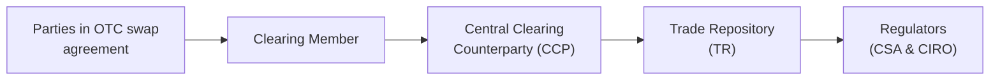

## 9.5 OTC Derivatives Market Reform

Regulatory reforms for over-the-counter (OTC) derivatives have become a major force shaping modern financial markets. After the 2008 global financial crisis, governments worldwide introduced measures to improve transparency, reduce systemic risk, and ensure robust risk management. Some folks might recall that time vividly—I, for one, was sitting in a small office, scanning headlines about major banks and how their massive derivative exposures were creating all sorts of jitters in the global markets. It was definitely unsettling. In this section, let’s walk through why these reforms happened, how they work, and why they matter, especially from a Canadian perspective.

**Regulatory Overview**  
The global financial crisis of 2008 was a wake-up call for regulators: the largely unregulated OTC derivatives market was enormous in scale and complexity. Swaps—particularly credit default swaps (CDSs)—were implicated in amplifying the risk exposure across financial institutions. International bodies such as the Financial Stability Board (FSB) and the International Organization of Securities Commissions (IOSCO) recommended reforms. Various countries introduced their own versions of new laws, such as the Dodd-Frank Act in the U.S. and the European Market Infrastructure Regulation (EMIR) in the EU. Meanwhile in Canada, the Canadian Securities Administrators (CSA) and, subsequently, the Canadian Investment Regulatory Organization (CIRO), set out complementary frameworks.

These frameworks generally share some fundamental ideas:  
• Moving standardized OTC derivatives (including many interest rate swaps and credit default swaps) to central clearing.  
• Requiring all OTC derivative trades to be reported to a trade repository.  
• Strengthening margin requirements and collateral management, even for uncleared swaps.  
• Enhancing transparency so that regulators and market participants can reliably track positions and exposures.

**Central Clearing and CCPs**  
Central clearing is often seen as the centerpiece of OTC derivatives reform. In the old days, if you wanted to enter into an interest rate swap, you’d do so bilaterally with a counterparty (like another bank, or sometimes a corporate entity). Nobody else was really involved. If your counterparty defaulted, you might be stuck with substantial losses.

Central counterparty clearing (CCP) changes this dynamic by placing a well-capitalized clearinghouse in the middle of the transaction: you now face the CCP as your counterparty rather than the original entity. The CCP nets trades, collects margins, and monitors risk in near-real time. If a default occurs, the CCP steps in to cover losses, using a waterfall of resources that include defaulted member collateral, default funds, and its own capital. This means a single firm’s failure is less likely to cause an avalanche of defaults across the market.

Anytime I think of central clearing, I’m reminded of a scenario a colleague faced in 2009, just as clearing mandates were rolling out. He was used to dealing directly with a half-dozen different banks for swaps, each with its own set of legal documents. Suddenly, he had to route everything through one clearinghouse. At first, it frustrated him because it added new “middle-man” steps. But ironically, after about six months, he admitted it was more efficient and gave him clearer insight into his margin obligations.

**Trade Repositories**  
Regulators felt that in 2008, they were basically flying blind. They didn’t know the size of the market or who held which positions. Enter the trade repository (TR). In many jurisdictions, all OTC derivative trades—whether ultimately cleared or not—must be reported to a designated TR. A TR is essentially a giant database that collects and stores the details of each trade: the counterparties involved, the price, the notional amount, maturity, collateral, and so on.

The idea is straightforward: by collecting data, regulators (like CIRO in Canada) can see who holds which swaps and identify potential trouble spots early on. They can also develop a macro-level view of market exposures. For instance, if a particular bank is building up huge positions in left-handed cat swap trades (just being a bit silly—let’s pretend that’s a new derivative for demonstration’s sake), the regulator might want to investigate to ensure that really aligns with that bank’s risk tolerance and capital adequacy.

Trade reporting is mandated under various national instruments in Canada, including NI 94-101 and NI 94-102, implemented by the CSA. Market participants must comply with specific reporting timelines, data fields, and accuracy standards. Meanwhile, if you are used to old manual processes, you might find this shift somewhat burdensome—reporting data in near-real time is no small feat. However, open-source financial tools and standardized reporting formats (like FpML—Financial products Markup Language) have sprung up, making this a bit more manageable.

**Margin and Collateral Requirements**  
Even with central clearing, not all derivative contracts are “clearable” under current regulations. Many swaps remain non-standard or highly customized, so they can’t easily be netted or guaranteed at a CCP. These Uncleared Swaps come with extra risk. Some folks have referred to them as “the wild side of the pool,” where margin disputes can get more complicated.

To address this, various global regulations introduced robust margin and collateral mandates for bilateral (uncleared) trades. ISDA (International Swaps and Derivatives Association) has played a huge role in drafting standardized documentation on Uncleared Margin Rules (UMR). These rules typically require both initial margin (to cover future exposures if a counterparty defaults) and variation margin (to cover day-to-day changes in mark-to-market). Collecting proper margin helps keep both sides of the trade honest, ensuring that if one party’s position moves out of the money, there’s enough collateral posted to mitigate potential losses.  

**Canadian Regulatory Approach**  
In Canada, both the CSA and CIRO have stepped up to integrate global reforms into the Canadian market structure. Historically, Canada’s approach to financial regulation has been a patchwork of provincial and territorial securities commissions. But with derivatives specifically, the CSA channeled a more or less harmonized approach:

• Mandatory Clearing Rules: Certain types of interest rate swaps (in Canadian dollars, U.S. dollars, euros, or British pounds) and credit default swaps meet standardized criteria for clearing. Market participants above particular volume thresholds or institutional designations must clear these products through recognized central counterparties.  
• Trade Repository Reporting: Through NI 94-101 and NI 94-102, trades must be reported to authorized repositories, ensuring regulators can monitor risk levels.  
• Customer Collateral Protection: The rules outline how customer collateral must be segregated and protected from a clearing member’s default.  
• Registration and Oversight: CIRO now supervises investment dealers, market participants, and clearing members that trade OTC derivatives. CIRO also enforces margin requirements to ensure firms are well-capitalized.  

At times, clarifying your obligations under multiple sets of rules can feel daunting. But each directive aims for transparency and stability. If you’ve ever toggled between provincial and federal guidelines for your business, you might empathize with how complicated it can get. The good news is that the Canadian approach is fairly consistent with global standards, minimizing cross-border friction.

**Going Global**  
While the focus in this chapter is on the Canadian framework, it’s important to recognize how it interacts with regulations from other jurisdictions. Many Canadian entities trade swaps in the U.S. or Europe. They must comply not only with local rules but also with CFTC regulations (in the U.S.) or EMIR (within the EU). This cross-border nature of swaps can mean dual reporting or complex equivalency determinations—where regulators from different countries confirm that their respective rules are broadly comparable.

During some of my early days examining cross-border trades, I confess I got lost in the labyrinth of equivalency. The main saving grace is that many compliance teams rely on robust legal counsel and standardized operational workflows to handle these complexities. That’s certainly a scenario where you can’t wing it!

**Challenges and Best Practices**  
• **Data Accuracy**: Reporting inaccurate or incomplete data to trade repositories is a major pitfall. Maintain consistent trade capture systems and robust controls to ensure data is reconciled daily.  
• **Collateral Management**: Uncleared Margin Rules require precise calculations of initial and variation margin for each counterparty. Using an external margin calculation platform with well-tested risk models can help avoid margin disputes.  
• **Operational Complexity**: Adopting central clearing means new legal documentation (the clearing agreement), new margin calls, and new operational processes. Train staff thoroughly to reduce errors.  
• **Regulatory Updates**: CIRO frequently issues bulletins or notices on consolidated OTC Derivatives Rules. Keep an eye on the official website (https://www.ciro.ca) to stay up to date with margin guidelines or new clearing mandates.  
• **Holistic Risk Management**: Even with clearing and margin in place, it’s crucial that institutions perform stress tests, scenario analyses, and track liquidity risk. You never want to discover liquidity shortfalls under crisis conditions.

**Real-World Example**  
Imagine a mid-sized Canadian asset manager frequently entering into interest rate swaps to hedge the interest rate exposure of a corporate bond fund. The manager previously did these transactions bilaterally with a couple of major investment banks. Post-2008 reforms, the manager finds that many of these swaps must now be cleared through a recognized CCP. So, the manager signs a clearing agreement with an approved clearing member. Then, each swap transaction gets submitted to the CCP for clearing, with initial and variation margins posted accordingly.

Simultaneously, the manager reports the trade details to a trade repository recognized by the CSA. Let’s say it’s a USD-CAD cross-currency swap that doesn’t qualify for mandatory clearing. In that case, the manager must post bilateral margin under the Uncleared Margin Rules with the executing bank, typically governed by an ISDA Master Agreement plus a credit support annex (CSA) or new regulatory variation margin documentation. If the manager’s daily mark-to-markets move out of scope, the bank’s risk system automatically triggers a margin call for more collateral to cover additional risk. This ensures the manager can handle fluctuations in interest rates or exchange rates without threatening the broader financial system.

**Mermaid Diagram of Clearing and Reporting Flow**

Above, we see how a swap between two parties typically flows through a clearing member and ultimately ends up at the central counterparty. Simultaneously, details about the trade get sent to a trade repository, providing CSA and CIRO with oversight.

**Timeline of Key Reforms**  
• **2009** G20 Pittsburgh Summit: World leaders committed to central clearing, trade reporting, and capital requirements for OTC derivatives.  
• **2010** U.S. Dodd-Frank Act: Brought comprehensive reform to U.S. derivatives markets.  
• **2012** EU EMIR Legislation: Laid out requirements for central clearing and reporting in Europe.  
• **2016** CSA Introduced NI 94-101 for mandatory clearing of certain derivatives in Canada.  
• **2017–2021** Phased implementation of Uncleared Margin Rules in major jurisdictions, including Canada.  
• **2023 Onward** CIRO is established, consolidating oversight of investment dealers and further refining exchange/OTC derivatives regulations in Canada.

**Conclusion**  
The OTC derivatives market reforms that emerged after 2008 represent a massive shift toward transparency, risk mitigation, and accountability. For many market participants, these reforms require adopting central clearing, robust trade reporting, and stringent margin practices, either through recognized CCPs or bilateral arrangements. In Canada, this is all anchored by rules from the CSA, carried out under CIRO’s consolidated oversight. Yes, it can feel overwhelming at first, but these changes aim to keep the financial system more stable and significantly reduce the chance of repeating the turbulence we saw back in 2008. If you’re a newcomer to the swaps world, the best approach is to stay current on regulatory bulletins, harness the right technology solutions to handle data and margin, and cultivate strong relationships with both your clearing members and regulators.

For more detailed reading, check out:

• [CSA National Instrument 94-102 (“Derivatives: Customer Clearing and Protection of Customer Collateral and Positions”)](https://www.securities-administrators.ca)  
• [CIRO Bulletins on Consolidated OTC Derivatives Rules](https://www.ciro.ca)  
• [ISDA Documentation on Uncleared Margin Rules (UMR)](https://www.isda.org)  

---------------------------------------

## Sample Exam Questions: OTC Derivatives Market Reform



### Which global event mainly triggered the widespread regulatory reforms aimed at OTC derivatives markets? 
- [ ] The 2001 Dot-com Bubble
- [ ] The 2005 Commodity Rally
- [x] The 2008 Global Financial Crisis
- [ ] The 2020 COVID-19 Pandemic

> **Explanation:** The 2008 crisis highlighted the systemic risks embedded in opaque OTC derivatives, prompting global frameworks like mandatory clearing, trade reporting, and margin rules.

### What is the primary purpose of a central counterparty (CCP)?
- [x] To interpose itself between two counterparties, mitigating counterparty risk 
- [ ] To serve as a trade repository for derivatives
- [ ] To impose capital controls on market participants
- [ ] To calculate taxes for cross-border transactions

> **Explanation:** A CCP stands between the buyer and the seller of a derivative and reduces risk by ensuring adequate collateral and default management protocols.

### In the context of OTC derivatives, what key function do trade repositories perform?
- [ ] They automatically clear all standardized swaps
- [x] They collect, store, and disseminate trade data 
- [ ] They create legal frameworks for derivative contracts 
- [ ] They provide default support for bankrupt counterparties

> **Explanation:** Trade repositories facilitate transparency by reporting details of OTC derivative transactions to regulators, enabling oversight of systemic risk.

### Why did regulators introduce stricter margin requirements for uncleared swaps?
- [ ] To discourage the trading of all swaps
- [ ] To eliminate the need for collateral altogether
- [x] To mitigate counterparty risk in the absence of central clearing
- [ ] To replicate the functionality of a trade repository

> **Explanation:** Uncleared swaps remain bilateral and do not benefit from CCP risk management. Stricter margin rules ensure each counterparty posts collateral to manage potential defaults.

### Which Canadian regulatory body was formed by the amalgamation of the Mutual Fund Dealers Association of Canada (MFDA) and the Investment Industry Regulatory Organization of Canada (IIROC)?
- [ ] CSA
- [ ] OCC
- [ ] Bank of Canada
- [x] CIRO

> **Explanation:** On January 1, 2023, the MFDA and IIROC joined forces to become the Canadian Investment Regulatory Organization (CIRO).

### According to Canadian National Instruments (e.g., NI 94-101, NI 94-102), what does mandatory clearing typically apply to?
- [x] Standardized interest rate swaps and credit default swaps
- [ ] Only foreign exchange forwards 
- [ ] All equity options 
- [ ] Non-deliverable forward contracts only

> **Explanation:** Canada’s mandatory clearing rules focus on specific types of interest rate swaps and CDS that meet standardized criteria.

### Which of the following is a best practice for managing operational complexity under the new OTC derivative reform?
- [ ] Delegating all responsibilities to a third party without oversight
- [ ] Ignoring margin calls if they’re less than a fixed threshold
- [x] Providing comprehensive training for staff and maintaining robust systems
- [ ] Only monitoring positions once every quarter

> **Explanation:** Given the complexity of clearing and reporting, well-trained staff and reliable systems are essential to avoid mistakes and regulatory breaches.

### A Canadian corporate entity has pledged $1 million in collateral for a cleared interest rate swap. The swap moves out-of-the-money for the entity by an additional $100k. How would this typically be addressed under a central clearing arrangement?
- [ ] The central counterparty cancels the swap automatically
- [x] A margin call is made for the additional $100k 
- [ ] The corporate entity pays extra fees but no new collateral
- [ ] The swap is converted into a forward contract

> **Explanation:** Variation margin calls are part and parcel of central clearing. The corporate entity must provide more collateral if the mark-to-market moves against it.

### What was one major rationale for implementing trade repositories in global OTC derivative markets?
- [ ] To reduce CCP membership fees
- [ ] To provide guaranteed returns for derivative investors
- [ ] To eliminate the use of bilateral negotiations
- [x] To improve transparency and monitoring of overall market exposures

> **Explanation:** Before trade repository mandates, regulators had limited visibility into who held what. TRs give a clear view of exposures, helping mitigate systemic risk.

### True or False: Uncleared swaps still require margin and collateral arrangements under post-2008 reforms. 
- [x] True
- [ ] False

> **Explanation:** Even though some swaps aren’t suitable for central clearing, they are subject to margin requirements to mitigate bilateral counterparty credit risk.


