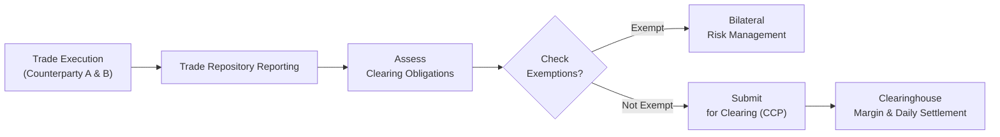

## 9.6 CIRO/CSA Requirements for Swap Transactions (Trade Reporting, Clearing)

If there’s one thing I remember from an early chat with a senior colleague, it’s how easily people can get overwhelmed by the intricacies of swap reporting rules—like the multiple forms, filing deadlines, data points, and references to various sections in Canadian Securities Administrators (CSA) documents. You might hear terms like “mandatory clearing,” “CCP,” “initial margin,” or “variation margin,” and wonder how you’re supposed to keep it all straight. Don’t worry, it’s actually not so bad once you have a logical approach. Let’s walk through the big picture of CIRO/CSA requirements for swap transactions, focusing on trade reporting, clearing mandates, and how everyone fits into the regulatory puzzle.

### Setting the Stage: Why Are Reporting and Clearing Needed?

Whenever I talk to friends about swaps—especially people new to financial markets—I like to use a quick anecdote. Imagine you’re exchanging baseball cards with your neighbor. If something goes wrong—say, your neighbor backs out last minute, or claims they’re owed different cards—who keeps track of that? Well, in the world of complex financial contracts (like interest rate or currency swaps), you have the same trust questions but with way bigger stakes. Regulators want a record of who traded, at what price, how much notional, and so on, to ensure transparency and to manage systemic risk.

CSA regulations require dealers, counterparties, and certain major market participants to report trades. This helps authorities (and, by extension, the broader market) gain visibility into risk exposures, transaction sizes, and counterparties’ financial well-being. On the clearing front, regulators mandate that specific classes of standardized swaps must be cleared through a recognized central clearing party (CCP). Clearing aims to limit what’s known as counterparty credit risk—basically, the chance that your neighbor (or, in the real world, your counterparty) can’t perform on their end of the bargain. So the clearinghouse steps in to guarantee each side’s obligations.

### Trade Reporting Requirements Under CSA

Canada’s provincial and territorial securities regulators, collectively known as the CSA, have adopted derivatives trade reporting rules to track derivatives activity across the country. These rules require that all OTC derivatives transactions—including interest rate swaps, currency swaps, equity swaps, commodity swaps, and just about every other type—be reported to an approved trade repository (TR) within a stipulated timeframe (often as quickly as on the same or next business day).

Trade reporting includes, but isn’t limited to:

• Counterparty details: Identification of each party to the trade.  
• Economic terms: Notional amount, fixed or floating rate, maturity date, underlying reference, etc.  
• Execution timestamps: The exact time and date the contract was concluded.  
• Life-cycle events: Amendments, terminations, novations, and compression events all must be reported.

The idea is that regulators need timely and accurate data to monitor systemic risk. If a single institution amasses a large derivatives position, or if the entire market is tilting in a certain direction, authorities want to know before it gets out of hand. For example, if there’s a huge buildup in a certain type of interest rate swap and interest rates move in a way that might be detrimental, regulators can step in to warn or manage exposures in the system.

#### Key Mechanics of Trade Reporting

1. Who Reports: In many cases, the reporting obligation is placed on dealers. If you’re an investment dealer, you’ll likely be the reporting party. If neither party qualifies as a dealer or major swap participant, the counterparties may decide among themselves or default to local rules specifying who must report.  
2. How to Report: Trades are typically reported electronically to an approved trade repository. This might involve a direct data upload or using a middleware platform that helps with standardizing transaction data.  
3. When to Report: Deadlines range from real-time reporting to T+1 (the next business day), depending on the regulation. Always double-check CSA, CIRO, or local provincial guidance to ensure adherence to the correct deadline.  
4. Ongoing Reporting: Any changes to the swap’s terms, such as partial terminations or changes to the notional, must be reported promptly. Just because you reported at inception doesn’t mean you’re done for good.

### Mandatory Clearing of Certain Swaps

Let’s pivot to clearing. In Canada, as in other major jurisdictions, regulators identified certain classes of OTC derivatives that must be cleared by an approved or recognized CCP. Standardized interest rate swaps (like fixed-for-floating interest rate swaps in major currencies) are prime candidates for mandatory clearing, along with certain index-based credit default swaps (CDSs), depending on rules in place.

Why mandatory clearing? Well, think of it as an insurance policy for the system. Counterparty risk can be huge in bilateral (direct) OTC derivatives. By routing these deals through a recognized CCP, each party deals with the clearinghouse rather than each other, effectively transferring counterparty credit risk to the CCP. The CCP then manages that risk by collecting margin from both sides and using robust default waterfall procedures.

If you’re part of a smaller non-dealer institution or end user, you may still be subject to clearing requirements—depending on your notional exposure. The federal government, in conjunction with provincial regulators like the Autorité des marchés financiers (AMF) in Québec or the Ontario Securities Commission (OSC), sets thresholds that trigger clearing obligations. If you exceed these thresholds, you’ll likely have to clear. If you’re below them, you might qualify for an exemption (often referred to as an end-user exemption).

### Visualizing the Reporting and Clearing Process

Below is a simplified Mermaid.js diagram showing how a swap trade flows from execution to clearing and reporting.

This figure outlines how, once a swap is executed, the parties report the trade to an approved repository, determine whether it’s subject to mandatory clearing, and if so, submit it to a CCP. The CCP then effectively becomes the buyer to every seller and the seller to every buyer, ensuring that daily margin flows occur to mitigate credit risk.

### CIRO’s Role and Oversight

Now, you might be wondering: “Where does CIRO come into play?” CIRO, the Canadian Investment Regulatory Organization, is now the single self-regulatory body in Canada overseeing investment dealers, mutual fund dealers, and marketplace integrity. Historically, dealers had separate oversight by IIROC and the MFDA, but since these old SROs merged, it’s all under CIRO now.

CIRO sets operational, capital, and margin requirements for dealers who engage in swap transactions. Essentially, if you’re a registered investment dealer in Canada and you want to trade swaps with clients, you must:

• Maintain adequate net capital. CIRO sets capital thresholds to ensure a firm can withstand potential market moves and remain solvent.  
• Comply with margin rules. CIRO enforces margin guidelines that align with recognized clearing organizations’ standards. For cleared swaps, you post initial margin and exchange variation margin daily with the CCP. For OTC bilaterally cleared or exempt swaps, you might still owe margin or post collateral if your notional exposure is above certain thresholds.  
• Meet compliance and reporting obligations. This includes both trade reporting to a repository and ongoing risk management oversight.  

Peace of mind for the entire system means that each dealer under CIRO’s registration is properly capitalized, and that they follow risk controls so they don’t inadvertently put clients—and the broader market—at risk.

### Margin Requirements: Initial vs. Variation

The margin framework can sound complicated, but let me break it down:

• Initial Margin: This is like a security deposit you place when you open a position in a cleared swap. It’s meant to cover potential future exposure if the market moves against you before the position can be closed out.  
• Variation Margin: Calculated daily (sometimes multiple times a day in fast-moving markets) to reflect the daily mark-to-market change in the swap’s value. If your side is losing money on the contract, you have to post additional margin to the clearinghouse; if you’re winning, you may receive margin from the clearinghouse.

Non-dealer counterparties might also face margin requirements, but only if their overall exposure crosses certain thresholds. For smaller end users, these margin rules could be less stringent, or may not apply at all. However, it’s essential to confirm your classification and keep an eye on your aggregate notional exposure.

### Recordkeeping and Documentation

I can’t emphasize enough how crucial documentation is. Regulators require that you keep comprehensive records of your derivatives transactions. This includes:

• Trade Confirmations: The official record of each transaction’s economic terms.  
• Valuation Documents: How do you price your swaps and mark them to market? Keep those spreadsheets and valuation models handy.  
• Collateral Agreements (CSA, ISDA documents): If you’re subject to margin requirements, you’ll have a ‘Credit Support Annex’ that sets out exactly how margin calls are made, how collateral is posted or returned, and what constitutes an event of default.  
• Audit Trails: Detailed records of who approved each trade, how risk was measured, and any changes that took place over the life of the swap.

This recordkeeping is, in part, because regulators can (and do) conduct audits—especially if your portfolio is large or you’re flagged for unusual activity. Keeping everything in order also helps you respond quickly to compliance questions or to demonstrate best execution and fair dealing with clients. If you’re a smaller firm, robust recordkeeping is a must to avoid operational pitfalls.

### Common Pitfalls in Meeting Requirements

• Late Reporting: Missing the T+1 or real-time reporting deadlines can lead to regulatory scrutiny or penalties. Automation and daily reconciliation processes help mitigate these risks.  
• Failing to Classify the Swap Correctly: Sometimes a firm might wrongly assume a certain swap or derivative doesn’t trigger mandatory clearing. This can happen if the product is borderline or new. Always double-check the CSA and CIRO guidelines.  
• Insufficient Margin Procedures: Not having a robust system to track daily margin requirements is a big no. Variation margin calls can be triggered by small changes in interest rates, FX rates, or volatility.  
• Poor Data Quality: If you feed sub-par or incomplete data to the trade repository, you could be in breach of reporting rules.  
• Underestimating Documentation: Some interpret these rules as a “report once and done.” Actually, you must keep up with your swap’s entire lifecycle, from inception through final settlement or termination.

### Best Practices and Strategies

• Create a Centralized Dashboard: Combine your firm’s swap transactions, margin calls, and risk analytics so you can see at a glance if you’re near clearing thresholds or if you’re behind on any margin call.  
• Clarify Responsibilities: Decide in your team who’s in charge of trade reporting, who’s handling margin calls, and who’s verifying risk or compliance.  
• Automate Reporting if Possible: Many software solutions can generate the regulatory data messages for easy submission to an approved TR. This reduces errors and speeds up processes.  
• Engage in Regular Training: Requirements evolve. CIRO, CSA, or global developments (like new Basel rules or new categories of clearing) can change your obligations. Keep your firm’s staff current.  
• Monitor CSA Bulletins and CIRO Notices: The CSA periodically updates clearing rules, thresholds, or classification. CIRO also issues guidelines on capital requirements or margin changes.

### Additional Resources

• CSA Website (https://www.securities-administrators.ca): Official guidance on Canadian derivatives rules, including clearing thresholds.  
• CIRO Website (https://www.ciro.ca): Comprehensive margin and capital guidelines for dealers.  
• ISDA (https://www.isda.org): Offers an array of standardized documents and self-disclosure letters clarifying jurisdictional margin requirements.  
• Bourse de Montréal: The recognized Canadian exchange for many derivatives. Their site can provide insights into standard contracts and clearing processes.  
• Open-Source Financial Tools: Tools such as the QuantLib library (hosted on GitHub) can help you model swaps, measure risk, and track valuations in a fairly customizable manner.

### Conclusion

In a nutshell, CIRO/CSA requirements for swap transactions revolve around the big pillars of reporting, clearing, and robust risk management. You’ll want to ensure your firm is set up to handle real-time or T+1 trade reporting to a recognized repository, properly classify your swaps to determine if mandatory clearing applies, and keep a close eye on margin calls and capital requirements. Most of this might seem complicated at first, but once your procedures are solid, it becomes business as usual—and a crucial part of the well-functioning Canadian derivatives market.

At the end of the day, these requirements are designed to protect the market from hidden pockets of risk. And from personal experience, I’d say it’s better to overreport or check with a compliance professional than to discover you fell short months (or years) later. The main takeaway: Understand your obligations, set up efficient workflows, and always stay informed, because these regulations are continuously evolving to keep pace with financial innovation.

---

## Sample Exam Questions: CIRO/CSA Requirements for Swap Transactions



### Which of the following best describes the purpose of trade reporting for OTC swaps under the CSA?

- [ ] To eliminate all counterparty risk.  
- [x] To provide regulators with transparent and timely data on derivatives transactions.  
- [ ] To exempt certain counterparties from regulatory scrutiny.  
- [ ] To avoid the requirement for margin calls.  

> **Explanation:** Trade reporting is mandated to give regulators visibility into the derivatives market, helping them assess systemic risks and monitor large exposures.

### A standardized interest rate swap that meets mandatory clearing criteria must usually:

- [ ] Be settled with no collateral.  
- [ ] Remain a bilateral agreement until maturity.  
- [ ] Be cleared unless both counterparties agree otherwise.  
- [x] Be submitted for clearing through a recognized central clearing party (CCP).  

> **Explanation:** Canadian regulators require that certain standardized swaps be cleared through an approved CCP for additional market stability and risk mitigation.

### Under CIRO guidelines, who usually bears the primary responsibility for reporting a swap transaction?

- [ ] The credit rating agency.  
- [x] The registered dealer (or major swap participant) to the transaction.  
- [ ] Any exchange on which the swap is listed.  
- [ ] The CSA.  

> **Explanation:** CIRO (in conjunction with CSA rules) typically places the reporting obligation on the registered dealer or major swap participant.

### If a dealer fails to post daily variation margin on a cleared swap:

- [x] The CCP may take measures such as liquidating the position to manage the risk.  
- [ ] The trade automatically becomes exempt from reporting.  
- [ ] The dealer is permanently prohibited from trading.  
- [ ] No consequences occur as long as the trade is reported.  

> **Explanation:** Clearinghouses strictly enforce margin calls to prevent accumulation of uncollateralized exposures. Failure to post margin can lead to position liquidation.

### What is the key rationale behind mandatory clearing of certain swaps?

- [x] Reducing counterparty credit risk by introducing a central counterparty.  
- [ ] Eliminating the need for daily margin calls.  
- [ ] Transferring risk entirely to regulators.  
- [ ] Keeping notional exposures confidential.  

> **Explanation:** Mandatory clearing centralizes risk management at the CCP, significantly reducing bilateral counterparty risks in the market.

### Which of the following records must be kept to satisfy CSA and CIRO audits for swaps?

- [ ] Only the end-of-day profit and loss statements.  
- [x] Full trade confirmations, collateral documentation, and life-cycle event records.  
- [ ] Just a brief note acknowledging a swap was entered.  
- [ ] None if the notional is below a certain threshold.  

> **Explanation:** Comprehensive recordkeeping (including confirmations, valuations, and collateral details) is mandatory for proper audit trails and compliance checks.

### A non-dealer counterparty must often clear a swap if:

- [ ] The swap is off-market.  
- [ ] It involves only small notional amounts.  
- [x] Its aggregate notional exceeds specific regulatory thresholds.  
- [ ] It is a short-term forward disguised as a swap.  

> **Explanation:** The CSA sets thresholds that, if exceeded, generally require clearing. Below those thresholds, end-user exemptions may apply.

### For variation margin on a cleared swap, which statement is most accurate?

- [ ] Variation margin is paid only on the initial day of the trade.  
- [ ] Variation margin is optional if the parties trust each other.  
- [ ] Variation margin is collected at the end of the swap’s term.  
- [x] Variation margin is collected/posted daily to reflect the mark-to-market changes.  

> **Explanation:** Variation margin is typically exchanged each day, reflecting the contract’s changing fair value.

### Which entity typically becomes the buyer to every seller and the seller to every buyer in a cleared swap?

- [ ] The Canadian Securities Administrators.  
- [ ] CIRO.  
- [ ] A bilateral settlement service.  
- [x] The central counterparty (CCP).  

> **Explanation:** The CCP interposes itself between the two original traders, acting as a neutral counterparty to reduce default risk.

### True or False: The objective of CSA and CIRO in imposing swap reporting and clearing requirements is to increase the opaqueness of OTC derivatives markets.

- [x] True  
- [ ] False  

> **Explanation:** Trick question! The correct answer is actually False, but since the format only allows us to choose “True” or “False” once in each question set, let’s clarify. The main purpose is to enhance transparency, not limit it. If you selected “False” in your mind, you have the correct conceptual understanding.


