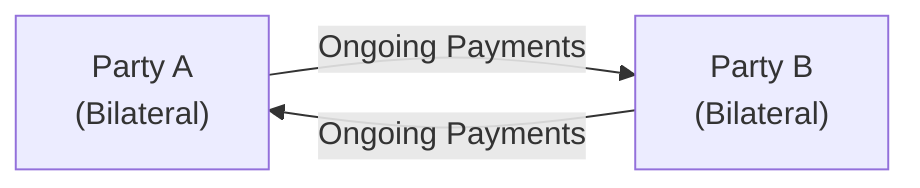
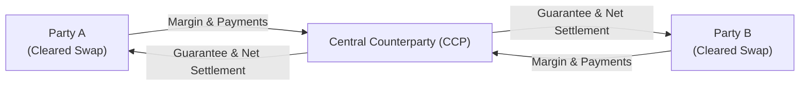

## 9.7 Bilateral vs. Cleared Swaps

Swaps are powerful instruments in the financial world, providing a way for companies, investors, and even governments to manage interest rate risk, currency exposures, commodity prices, and more. If you read through earlier portions of this chapter, you may recall that swaps are derivatives in which two parties exchange (or “swap”) sets of cash flows over time. Well, that’s the big picture. But the nitty-gritty is that there are two primary ways to structure these agreements: as bilateral swaps or as cleared swaps. Each approach has unique advantages, challenges, regulatory requirements, and operational implications.

Maybe you’ve stumbled across a situation (like I did in my first job at a bank) where a client wants a very tailored interest rate hedge, and you’re trying to figure out, “Hmm, do we do this as a ‘traditional’ over-the-counter bilateral swap, or is it more convenient or mandated to clear it?” That question has become far more pronounced since global regulators began implementing mandatory clearing requirements for many standard swap types—especially after the 2008 financial crisis.

Let’s unpack the differences between bilateral and cleared swaps, how each structure addresses counterparty risk, how Canadian regulations (notably from the Canadian Investment Regulatory Organization—CIRO—and the Canadian Securities Administrators—CSA) come into play, and why participants like you or your clients might choose one over the other.

---

### Bilateral Swaps in a Nutshell

A bilateral swap is the classic, old-school approach for two parties—let’s say, a corporate hedger and an investment bank—to negotiate a swap’s terms directly. The result is a tailor-made derivative that can be precisely calibrated to meet specific hedging or speculative needs. For instance, if you’re dealing with an interest rate swap, you could choose specialized payment frequencies, custom start dates, non-standard day count conventions, or unique notional schedules. 

This is a bit like ordering a coffee exactly how you want it: half-caf, two pumps vanilla, extra foam, 135 degrees, you name it. That’s the customizability angle. But it also means both sides have to trust that the other side won’t default before the swap ends. If either party fails to make its required payments, the other side could be left out in the cold—and that’s the essence of counterparty credit risk.

#### Advantages of Bilateral Swaps

• Complete Customization: Firms can tailor the notional schedule, maturity, credit triggers, embedded options, or basically any feature they can dream up (and negotiate).  
• Privacy: The two parties deal directly, which is appealing if specific financial arrangements are better kept private.  
• Flexible Collateral Arrangements: Collateral details can be negotiated to match the risk tolerance of each party, typically documented with an International Swaps and Derivatives Association (ISDA) Master Agreement and supporting Credit Support Annex (CSA).

#### Disadvantages of Bilateral Swaps

• Higher Counterparty Risk: No central clearinghouse stands between the two parties, so if the counterparty can’t pay, you might be stuck.  
• Potentially Higher Capital Charges: Regulations often impose higher capital or margin requirements for non-cleared swaps due to the perceived higher risk.  
• Complex Management: Monitoring appropriate collateral, performing daily valuations, and updating documentation can get complicated.

---

### Cleared Swaps in a Nutshell

Cleared swaps are a comparatively newer phenomenon that gained traction after the 2008 crisis, when regulators worldwide realized the danger of widespread counterparty defaults in vast and opaque OTC markets. The push for central clearing—embodied in frameworks like the Dodd-Frank Act in the U.S. and CSA regulations in Canada—aims to reduce systemic risk by introducing a central counterparty (CCP). In Canada, the Canadian Derivatives Clearing Corporation (CDCC) handles clearing services for many derivatives, including some swaps.

With a cleared swap, each original party to the transaction effectively faces the clearinghouse, not each other. The clearinghouse ensures that margin is posted by both sides and will step in if one party defaults. This structure reduces the overall counterparty risk. Before a swap can be cleared, however, it must meet certain standardization criteria—payment dates, day count conventions, standard maturities, and so on.

#### Advantages of Cleared Swaps

• Reduced Counterparty Risk: A central clearinghouse stands in the middle, collecting margin and guaranteeing the swap.  
• Transparent Margin Requirements: Participants face standardized margin calls, daily mark-to-market, and guidance from a robust clearing framework.  
• Regulatory Mandates & Possibly Lower Capital Costs: Certain standard swaps must be cleared (pursuant to CSA regulation NI 94-101 in Canada). Also, banks and other financial institutions often receive capital relief for transacting in centrally cleared instruments.

#### Disadvantages of Cleared Swaps

• Less Flexibility: Standardization means fewer custom features. If you want a highly bespoke structure, you might not be able to clear that swap.  
• Clearing Fees & Operational Costs: The clearinghouse charges fees, and you must maintain or have access to a clearing member. This can be more expensive operationally compared to a straightforward bilateral negotiation, depending on your scale.  
• Liquidity Variation: While standard interest rate swaps and index credit default swaps may benefit from robust liquidity, niche or exotic swaps might not qualify for clearing or might have limited liquidity at the clearinghouse.

---

### Visualizing Bilateral vs. Cleared Swaps

Below is a mermaid diagram to illustrate, in a simplified way, how trades and cash flows get funneled in bilateral vs. cleared settings. We’ll do two separate diagrams for clarity.

Bilateral Swap Flow:

In this bilateral setup, A and B face each other directly, each bearing the other’s credit risk.

Cleared Swap Flow:

Here, both Party A and Party B face the central counterparty. The CCP requires each side to post margin and monitors positions daily. If Party B defaults, the CCP ensures Party A is made whole (and vice versa, with resources like the default fund, margin, and participant contributions).

---

### Key Differences to Note

**Risk Management**  
• Bilateral Swaps: Each party tracks collateral and exposure to a single counterparty. If that counterparty defaults, there may be minimal protection aside from posted collateral.  
• Cleared Swaps: The CCP absorbs the counterparty risk. The CCP’s default management processes and margining system mitigate the damage if one party cannot fulfill its obligations.

**Standardization**  
• Bilateral Swaps: Very flexible terms—like custom day count conventions or unusual payment schedules.  
• Cleared Swaps: Must conform to standard payment dates, day count conventions, maturities, and frequently credit support terms.

**Collateral and Margin**  
• Bilateral Swaps: Negotiated credit support details (e.g., daily vs. weekly margin calls), thresholds, and minimum transfer amounts.  
• Cleared Swaps: Rigid margin requirements set by the CCP, including initial margin, variation margin, and periodic stress-testing-based margin calls.

**Transparency**  
• Bilateral Swaps: Limited external transparency. These trades are reported to a trade repository, but real-time pricing data are often not publicly available.  
• Cleared Swaps: The clearinghouse publishes margin requirements and, depending on regulations, may provide some level of aggregated trade data.

**Regulatory Treatment**  
• Bilateral Swaps: Can be subject to higher capital charges for banks under Canadian or international Basel rules.  
• Cleared Swaps: May benefit from more favorable capital treatment since the risk is considered lower with the CCP as the intermediary.

---

### Regulatory Environment in Canada

After the 2008 financial crisis, regulators worldwide turned their attention to the huge over-the-counter derivatives markets and the potential for a domino effect if significant counterparties defaulted. In Canada, the CSA introduced rules like NI 94-101 (Mandatory Central Counterparty Clearing of Derivatives), which outline:

• The types of derivatives that must be centrally cleared.  
• The conditions under which participants must adhere to clearing.  
• Exemptions for certain end-users or smaller entities.

CIRO, Canada’s self-regulatory organization that oversees both investment dealers and mutual fund dealers (historically done by IIROC and MFDA, now merged into one), sets additional margin and operational guidelines. Many participants use the Canadian Derivatives Clearing Corporation (CDCC) to clear standardized interest rate swaps, index derivatives, and other products. The exact clearing requirements might vary based on the notional amount of the derivative activity and the classification of the entity (e.g., financial institution vs. corporate hedge user).

Incidentally, if you’re keen on reading more about the systemic benefits of central clearing, you might enjoy the academic piece “Central Clearing and Systemic Liquidity Risk” in the Journal of Financial Intermediation. It details how CCPs can sometimes help reduce systemic liquidity pressures—but also how they might concentrate risk in fewer nodes. So it’s not a silver bullet. 

---

### Operational and Risk Management Considerations

You might be wondering, “Fine, so if I want to trade a swap, how do I decide whether to go bilateral or use clearing?” Here are a few considerations:

• **Regulatory Mandate**: If your trade type is on the clearing mandate list (like certain standard interest rate swaps with maturities up to a certain period), cleared might not be optional—you have to do it.  
• **Customization vs. Standard Terms**: If your hedge requires specialized features, you might only be able to do it bilaterally.  
• **Credit Risk Appetite**: Are you comfortable with the creditworthiness of your chosen counterparty? Are you prepared to post your own margin to reduce your risk exposure?  
• **Cost-Benefit Analysis**: Central clearing often means operational overheads (membership fees, transaction fees, or paying a clearing broker). Meanwhile, bilateral deals can require robust internal credit teams to monitor and manage exposure.  
• **Liquidity Considerations**: Standardized products typically enjoy better liquidity when cleared, which can lead to tighter spreads and better price discovery.

In practice, large financial institutions and corporations with recurring hedging programs often have both bilateral ISDA lines with banks and the ability to clear trades through a clearing broker. Making that choice can boil down to which route is more cost-effective at a given time—balancing capital charges, operational complexity, and liquidity.

---

### Common Pitfalls in Bilateral vs. Cleared Swaps

1. **Underestimating Counterparty Risk**: In bilateral setups, some folks skip the deep due diligence on a counterparty’s creditworthiness—which can be a big mistake if the other party’s finances are under stress.  
2. **Insufficient Margin**: Even in a cleared setting, failing to meet margin calls on time can lead to forced positions being closed.  
3. **Poor Documentation**: When you have an ISDA Master Agreement, you need to ensure all schedules, credit support annexes, and contact references are consistent. If something is ambiguous, disputes may arise, especially during times of stress.  
4. **Not Understanding Mandates**: Smaller firms sometimes overlook the thresholds that trigger mandatory clearing. They may incorrectly assume they’re exempt then end up facing disciplinary action or forced unwinds.  
5. **Ignoring Operational Costs**: Clearing can simplify risk management but can also come with membership or clearing broker fees. On the other side, bilateral trades might save you certain clearing fees but can demand more internal staff for risk management.  

---

### Real-World Illustrations

Below are two simple scenarios to show how real firms might make these choices.

#### Scenario 1: Corporate Hedger with a Small Notional Amount

ABC Inc. wants to hedge the interest rate on a C$25 million loan for five years. This swap is relatively straightforward: pay fixed, receive floating based on a recognized index (like CDOR, though the shift to CORRA is ongoing). ABC Inc. calls a handful of banks and gets a quote for a bilateral swap. Because it’s below certain clearing thresholds and ABC wants a slightly unusual start date that might not match the standard cleared contract, they opt for a bilateral deal. The cost structure is simpler, ABC Inc. is comfortable with the bank’s credit rating, and the swap is not large enough to trigger mandatory clearing.

#### Scenario 2: Large Financial Institution (FI) with a High Volume of IR Swaps

XYZ Bank trades interest rate swaps daily to hedge its flow desk, including many standard tenors (2-year, 5-year, 10-year) that are mandated for clearing. Because of NI 94-101, XYZ Bank is required to clear a broad swath of these trades with the CDCC. For any non-standard trades that can’t be cleared, XYZ Bank will do bilateral swaps with counterparties that require more specialized features. The bank’s internal systems handle margin calls for both bilateral and cleared trades, but the capital relief on cleared trades is often beneficial for the bank’s balance sheet.

---

### Best Practices

• **Implement Strong Documentation**: Whether bilateral or cleared, ensure your swap documentation is rock solid. That usually means having appropriate ISDA agreements in place (including Canadian addenda where relevant).  
• **Continuous Collateral Monitoring**: Daily (or intraday) margin calls are standard. Have the operational processes to handle these effectively.  
• **Stay Informed on Mandates**: Keep track of changes in CSA or CIRO regulations, especially as new rules can quickly impact which swaps must be cleared.  
• **Stress Test the Positions**: Even if you’re bilateral, run scenarios on your swap exposure to see if you could handle the major market swings that might cause big margin calls or credit events.  
• **Compare Costs**: Evaluate total costs (including clearing fees, capital charges, and administrative overhead) for both routes. The optimal approach may shift over time or with changes in your portfolio.

---

### Glossary

• **Counterparty Risk**: The risk that your counterparty might default and be unable to fulfill its contractual obligations.  
• **Standardization**: For a swap to be cleared, it often has to follow standard market conventions (e.g., set payment frequencies, day count conventions, maturities). This uniformity ensures the CCP can handle many trades efficiently.  
• **Default Fund**: A pool of capital maintained by the central counterparty. If a clearing member defaults and its posted collateral is insufficient, the CCP taps into the default fund (contributed by all clearing members) to cover losses and stabilize the system.

---

### Additional References for Further Study

• **CSA’s NI 94-101**: For official guidelines on which derivatives are mandated for clearing in Canada.  
• **CDCC Website** at <https://www.cdcc.ca>: Comprehensive details on membership, clearing infrastructure, margin regimes, and product specifications.  
• **Central Clearing and Systemic Liquidity Risk, Journal of Financial Intermediation**: Explores the deep academic analysis of how clearinghouses affect risk concentration.  
• **CIRO** at <https://www.ciro.ca>: Canada’s self-regulatory body that replaced IIROC and MFDA as of 2023. Regulations, compliance bulletins, and margin guidance can all be found here.

---

### Concluding Thoughts

In the world of swaps, you’ll often hear chatter about “Is that cleared?” or “We just do it bilaterally.” Underneath those casual remarks is a whole ecosystem of risk management, regulations, and operational frameworks that shape the derivative markets. Bilateral swaps and cleared swaps each have a rightful place:  
• Bilateral is best when you need maximum customization, or your notional sizes are small enough that clearing rules don’t apply.  
• Cleared is ideal (and often required) for standardized, liquid products if you’re aiming to reduce counterparty risk and potentially enjoy capital relief.

Either route, it’s vital to keep your eyes open for the various operational, regulatory, and cost implications. After all, the difference can affect your firm’s balance sheet, risk profile, and ultimately the success of the hedging strategy. Sometimes it helps to think back to that coffee analogy: do you want the standardized “house coffee” that’s often cheaper and guaranteed consistent, or do you really need the custom half-caf, extra-foam specialty cappuccino (which might cost more and might not be on the standard menu)? The choice is yours—just weigh the pros, cons, and regulatory mandates before pulling the trigger.

---

## Sample Exam Questions: Bilateral vs. Cleared Swaps



### Which of the following statements best describes a bilateral swap?

- [x] It is negotiated directly between two parties without a central clearinghouse.
- [ ] It is a standardized contract governed only by exchange rules.
- [ ] It is mandated by all regulators for all derivatives.
- [ ] It must be listed on a major derivatives exchange to be valid.

> **Explanation:** Bilateral swaps are negotiated privately between two parties, with no CCP involvement.  

### Which of the following is a key benefit of central clearing in swaps?

- [x] Reduced counterparty credit risk.
- [ ] Unlimited customization of contract terms.
- [ ] No collateral requirements.
- [ ] Elimination of all credit risk for the counterparties.

> **Explanation:** Central clearing places the CCP between the counterparties, significantly lowering credit risk through margin collection and a default fund. However, it does not eliminate all risk.  

### A party wishes to enter into an interest rate swap with an unusual notional amortization schedule. Which swap structure is more likely to accommodate this request?

- [x] Bilateral swap.
- [ ] A listed futures contract.
- [ ] A fully cleared swap with standard terms.
- [ ] None are permitted in Canada.

> **Explanation:** Bilateral swaps permit much more customization, including irregular notional schedules, which might not be accepted by a clearinghouse.  

### Cleared swaps are generally required to:

- [x] Adhere to standard payment dates and other conventions.
- [ ] Eliminate the need for margin altogether.
- [ ] Involve at least three different counterparties.
- [ ] Carry no fees or transaction costs.

> **Explanation:** CCPs will only clear swaps that match standardized payment frequencies, day count conventions, and maturity dates.  

### Which Canadian regulation outlines the mandatory clearing of certain derivatives?

- [ ] NI 31-103
- [x] NI 94-101
- [ ] OSFI’s B-20
- [ ] Bill C-86

> **Explanation:** National Instrument 94-101 sets out rules for mandatory central clearing of specific derivatives in Canada.  

### One disadvantage of a bilateral swap is:

- [x] Higher counterparty credit risk relative to a cleared swap.
- [ ] Having to conform to strict standard terms.
- [ ] The involvement of a central counterparty in the transaction.
- [ ] Being regulated by a self-regulatory organization such as CIRO.

> **Explanation:** Bilateral swaps lack the CCP intermediation, therefore carry higher counterparty risk compared to cleared swaps.  

### For a swap to be centrally cleared, which of the following is typically needed?

- [x] It needs to be standardized and accepted by a central clearinghouse. 
- [ ] It must reside in a separate legal entity beyond the reach of regulators.
- [ ] It has to be uncollateralized.
- [ ] It must be cleared in the secondary market once it expires.

> **Explanation:** Central clearing generally requires standard terms so the CCP can easily manage and net offsetting positions.  

### Marking-to-market and margin calls for a cleared swap typically occur:

- [x] Daily, and sometimes multiple times intraday during high volatility.
- [ ] Only once at inception.
- [ ] Whenever the parties decide, at their discretion.
- [ ] Never, as cleared swaps do not require margin.

> **Explanation:** CCPs typically require daily (or more frequent) mark-to-market calculations and margin calls to mitigate credit risk.  

### Which of the following is typically included in an ISDA Master Agreement for a bilateral swap?

- [x] A Credit Support Annex (CSA) outlining collateral procedures.
- [ ] A statement that the swap will be cleared by default.
- [ ] A memorandum of understanding that removes all default risk.
- [ ] A special section to ensure no margin can be taken.

> **Explanation:** An ISDA Master Agreement often includes a CSA that governs collateral (margin) arrangements for non-cleared swaps.  

### True or False: By using cleared swaps, a firm completely avoids all operational and legal risks associated with derivatives trading.

- [x] True
- [ ] False

> **Explanation:** This is a trick question: the correct statement is actually false. Cleared swaps reduce counterparty credit risk but they do not eliminate all operational, legal, or market risks.  


