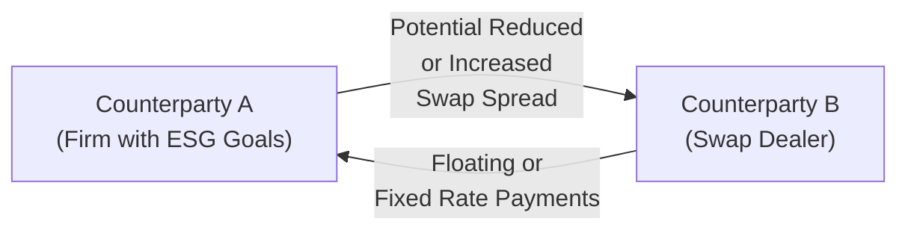
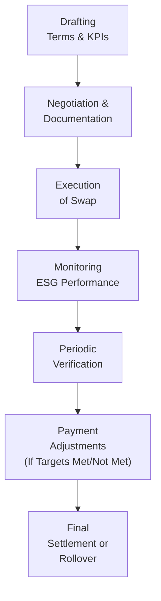

## 9.8 ESG & Sustainability-Linked Swaps

Sustainability is on everyone’s mind these days—especially among financial professionals who are looking for ways to align traditional hedging strategies with corporate social responsibility goals. ESG (Environmental, Social, and Governance) considerations are transforming how we look at investments, risk management, and returns. And while we used to think of swaps mainly in terms of interest rates or credit exposures, we now see a new breed of instrument gaining traction: ESG and sustainability-linked swaps.

I remember chatting with a colleague at a conference in downtown Toronto—over way too many cups of coffee—about how companies were getting hammered by stakeholders for not meeting their greenhouse gas (GHG) reduction promises. We both wondered how you could tie real sustainability improvements to financial products beyond simply taking out “green” loans or issuing “green” bonds. Well, sustainability-linked swaps are a solid example of a next step: they link real ESG performance with the economics of a swap agreement, creating incentives (or penalties) for meeting certain environmental or social objectives.

Below, we’ll discuss how these swaps are structured, how ESG metrics come into play, how the Canadian regulatory environment is evolving, and why the risk of greenwashing is a hot topic. We’ll also take a peek into some real-world examples and explore best practices for ensuring that sustainability-linked swaps deliver the accountability, transparency, and authenticity the market expects.

### Understanding ESG & Sustainability-Linked Swaps

ESG & sustainability-linked swaps are over-the-counter derivatives designed to align a counterparty’s financial obligations with sustainability or social responsibility targets. Think of a traditional interest rate swap: one party wants to pay a fixed rate and receive a floating rate (or vice versa) to manage interest rate risk. Now layer in a sustainability performance metric. If the borrower or issuer meets a prescribed target—say, reducing carbon emissions by X% over a certain period—the swap’s spread might decrease, lowering its cost of capital. Fail to meet that goal, and the spread might increase. It’s a tangible way to hold the organization accountable for ESG performance.

Unlike green bonds or other designated “green” or “social” products that strictly earmark funds for specific projects, sustainability-linked swaps can be used for any general corporate purpose. The key is that the financial terms are linked to performance on agreed-upon sustainability metrics. That’s what makes them flexible yet potentially powerful for encouraging good environmental or social practices in day-to-day business operations.

#### A Quick Structure Overview

Below is a simple flowchart illustrating how two counterparties might interact in a sustainability-linked interest rate swap, where one party’s payments (e.g., the fixed rate) adjust if certain ESG goals are met:

• Counterparty A has specific ESG objectives—like reducing emissions or improving workforce diversity.  
• If the ESG targets are achieved, Counterparty A may enjoy a lowered cost of the swap (e.g., a reduction in the fixed rate they pay).  
• If those ESG targets are missed, the swap spread might widen in favor of the swap dealer.

### Key Building Blocks of Sustainability-Linked Swaps

There are a few core components that characterize these swaps:

• Measurable ESG Key Performance Indicators (KPIs): Examples might include greenhouse gas emissions intensity, water usage, supply chain labor standards, or board diversity quotas.  
• Sustainability-Linked Pricing: The swap’s pricing—like the spread—will be adjusted up or down depending on KPI performance.  
• Third-Party Verification Procedures: Many deals require an external auditor or consultant’s verification that the KPIs are legitimate and the performance data is accurate.  
• Potential Regulatory Disclosures: According to the Canadian Securities Administrators (CSA), certain swaps must be reported to trade repositories. And, if the transaction or its underlying objectives are deemed material to the issuer’s overall risk profile, it might trigger additional disclosure requirements.

### Integrating ESG Metrics

To figure out which KPIs to include in a swap, the counterparties generally look for metrics that:

• Are relevant and material to their core business.  
• Can be measured relatively easily and verified by an independent party.  
• Align with recognized ESG standards or reporting frameworks, such as the Task Force on Climate-related Financial Disclosures (TCFD) or the Global Reporting Initiative (GRI).

For instance, if your firm is in mining, you might link your swap’s spread to how effectively you’re managing tailings disposal or energy efficiency. Or, if you’re a bank trying to promote diversity and inclusion, you might anchor the swap to metrics on representation in leadership roles. In essence, you pick metrics that truly reflect the “E,” “S,” or “G” elements in which your stakeholders are most interested.

The big idea: By pegging a financial payoff or penalty to these metrics, you’re putting real money at stake—and that can drive the organization to walk the talk on sustainability.

#### Example: Emissions Reduction Target

Let’s say Company X signs a sustainability-linked swap with a major financial institution. The initial swap rate is 3% fixed, which Company X pays, while receiving a floating rate. If Company X reduces its Scope 1 and Scope 2 emissions by 5% year-over-year, the swap rate might drop to 2.85%. But if it fails, maybe it goes up to 3.15%. On an $800 million notional amount, that’s a meaningful difference in costs, which can significantly motivate the firm to meet its emissions targets.

### Regulatory Oversight & The Canadian Perspective

Given that ESG is still a relatively new frontier in finance, regulators are actively shaping the rules. In Canada, the CSA has put forward guidelines on ESG-related disclosures, focusing on consistency and transparency. They’re especially wary of “greenwashing,” which we’ll discuss in more detail later.

As of 2023, the Investment Industry Regulatory Organization of Canada (IIROC) and the Mutual Fund Dealers Association of Canada (MFDA) have amalgamated into a new self-regulatory entity, the Canadian Investment Regulatory Organization (CIRO). CIRO oversees Canada’s investment dealers and ensures market integrity on both equity and debt marketplaces. Any references to IIROC or MFDA are now historical; CIRO is the regulatory body in place. This single SRO’s approach to derivatives helps unify oversight for both traditional swaps and ESG or sustainability-linked swaps.

In addition, the Canadian Investor Protection Fund (CIPF) remains in place as the primary fund for investor protection if a CIRO member firm becomes insolvent. While CIPF does not directly address ESG issues, its role in protecting investors’ assets indirectly affects how dealers manage innovative products like sustainability-linked swaps.

#### CSA and Sustainability-Related Disclosures

The CSA’s ongoing push for enhanced disclosures ensures that companies offering sustainability-linked derivatives are transparent about:

• Which metrics they use.  
• How those metrics are measured and verified.  
• Any third-party assurance or review processes.  
• Potential conflicts of interest or complications related to achieving ESG targets.

The idea is that market participants should be able to rely on consistent, comparable data when evaluating the ESG performance embedded in financial deals. The CSA also wants to discourage deals that label themselves as “sustainable” without providing clarity on the actual sustainability-linked terms. This is exactly the reason we see greenwashing concerns on the rise.

#### The TCFD Framework

The Task Force on Climate-related Financial Disclosures (TCFD) is a global framework that many Canadian firms reference for climate-related risk assessment and reporting. Firms with TCFD-aligned disclosures might find it easier to identify and track meaningful metrics that can anchor a sustainability-linked swap. Although the TCFD is not mandatory in all jurisdictions, the impetus to tighten climate-related disclosure requirements has grown significantly in recent years. The TCFD guidelines encourage transparency on everything from governance and strategy to scenario analysis.

### Potential Pitfalls and Greenwashing

Greenwashing is basically the marketing spin that makes a company or product appear more environmentally responsible than it really is. In practice, a firm could claim to be “sustainably hedged” but set such lenient performance targets that it’s practically guaranteed a discount on its swap cost. Alternatively, the data verifying the targets might be incomplete or not independently audited.

Lawmakers and regulators around the world are zeroing in on this. The CSA is also looking at how to define “green” or “sustainable” in a way that’s standardized and not easy to manipulate. Sustainability-linked swaps are a prime area where these definitions matter. If we’re not consistent, one firm’s “sustainability success” might be another firm’s status quo.

#### Reducing the Risk of Greenwashing

• Use recognized global standards: Make sure the metrics align with frameworks like TCFD or GRI.  
• Employ external auditors: Bring in reputable third-party verifiers who certify that the targets are met or missed.  
• Specific, time-bound targets: Vague pledges like “We’ll do better on emissions at some point” won’t cut it. Good practice is to define your baseline, your target level, and the timeframe.  
• Clear consequences: The swap documentation should clearly outline how the financial terms change if the targets are or aren’t met, ensuring that there’s a genuine, tangible incentive to improve sustainability practices.

### Practical Examples and Case Studies

Let’s walk through a hypothetical scenario—complete with a bit of personal reflection:

I once visited a Canadian retail conglomerate (let’s call it CR Co.) that had a chain of warehouses across the country. Their supply chain used a whopping amount of energy. CR Co. wanted to reduce electricity consumption by installing solar panels at five major distribution centers. They worked with a large multi-national bank to lock in a three-year interest rate swap. The deal:

• Notional amount: CA$500 million  
• Fixed rate: 2.90% (CR Co. pays)  
• Floating rate: 3-month CDOR + 50 bps (bank pays)  
• Sustainability KPI: 10% reduction in aggregate warehouse energy consumption by the end of Year 1.  
• Incentive: A 15 bps discount on the swap’s fixed rate if CR Co. meets or exceeds the 10% reduction. Conversely, a missed target adds 15 bps to the rate.

Because an external engineering firm verified the energy usage levels, the bank and CR Co. had confidence that the data was legit. In the end, CR Co. pulled it off—signed better supply deals with renewable energy providers, installed solar arrays, and met the KPI by the 12-month mark. They saved 15 bps on a CA$500 million notional, which wasn’t chump change. Moreover, they also got better public relations mileage by showcasing how they met their sustainability-linked swap target. A win-win scenario.

### Role of Market Players

Banks: Typically serve as swap dealers and counterparties to corporate clients. They have an incentive to encourage strong ESG performance from clients, as it can reduce risk in loan portfolios or enhance the bank’s own green credentials.

Institutional Investors: Pension plans and asset managers might push the companies in their portfolio to adopt sustainability-linked derivatives, ensuring they integrate ESG concerns into risk management.

Corporate Issuers: They’re the ones that define the sustainability targets in a swap. The more robust and transparent these targets, the more credible (and effective) the swap will be.

Regulators (CSA, CIRO, etc.): Enforce disclosure standards, track trade reporting, and facilitate the modernization of swap rules to encompass ESG or sustainability metrics. The Bourse de Montréal (Montréal Exchange) offers derivative products and fosters an environment where new ESG-related products are continuously explored, although sustainability-linked swaps typically remain in the OTC space.

### Diagram of Sustainability-Linked Swap Lifecycle

Below is another quick visual that breaks down the phases of a sustainability-linked swap lifecycle. This helps show how ESG performance measurement gets embedded at specific intervals:

### Best Practices for Sustainability-Linked Swap Implementation

• Align with Overall Corporate Strategy: Companies that embed sustainability efforts in their core business strategy can implement and monitor ESG metrics more effectively.  
• Define Hard but Realistic Targets: If KPI thresholds are too easy, you risk claims of greenwashing. Too tough, and you could generate undue financial strain.  
• Transparency: Provide regular updates, ideally in a standard reporting format recognized globally (like TCFD).  
• Verify with Credible Parties: Independent ESG auditors or rating agencies can vouch for your performance data.  
• Stay Aware of Regulatory Changes: The ESG space is evolving. Check in often with CSA bulletins and the Sustainable Finance Action Council (SFAC) for updates.  
• Ensure Data Integrity: Invest in proper data collection systems and track your progress meticulously. You really don’t want to discover errors in your emissions or energy usage tallies months after your final reporting date—no one’s going to be happy about that.

### Canadian Context and Future Directions

Canada’s Federal Department of Finance launched the Sustainable Finance Action Council (SFAC) to support standard-setting and best practices in sustainable finance. Resources are available at:  
• https://www.canada.ca/en/department-finance/programs/financial-sector-policy/sustainable-finance.html

The Bourse de Montréal (https://www.m-x.ca) has also been an advocate for ESG-related product innovation. While many ESG & sustainability-linked swaps remain OTC, there’s chatter about potential exchange-traded variations in the future—although none have gained wide traction just yet. Still, the impetus for new products is strong, particularly as the global push for net-zero carbon emissions intensifies.

In the near term, we might see more standardized templates for sustainability-linked swaps, possibly curated by industry bodies like the International Swaps and Derivatives Association (ISDA). And as the guidelines for what is truly “sustainable” become more rigorous, participants will have to remain vigilant against misrepresentation and data manipulation.

### Additional Resources

• CSA Publications on ESG Disclosures (various notices available via https://www.securities-administrators.ca/)  
• Montréal Exchange Thought Leadership (https://www.m-x.ca)  
• Sustainable Finance Action Council Resources (https://www.canada.ca/en/department-finance/programs/financial-sector-policy/sustainable-finance.html)  
• Task Force on Climate-related Financial Disclosures (https://www.fsb-tcfd.org)  
• Global Reporting Initiative (GRI) (https://www.globalreporting.org)

### Conclusion

Sustainability-linked swaps are an exciting new chapter in how we think about derivatives. By linking real-world ESG performance to swap economics, companies can leverage financial markets to encourage better environmental and social behavior. In Canada, we see robust regulatory attention to ensure that these products don’t slide into superficial greenwashing. Well-structured sustainability-linked swaps can catalyze positive change—just be sure your ESG metrics, documentation, and verification processes are bulletproof enough to inspire market confidence.

That’s the heart of it: bridging the gap between finance and moral responsibility is never simple, but sustainability-linked swaps offer a tangible framework to align the two. If you’re an advisor or registrant under CIRO, keep your finger on the pulse of the evolving regulatory guidelines—both domestically and internationally—and watch for new best practices. Because as more firms tie their brand reputation (and their wallets) to these sustainability metrics, we’ll see a deeper integration of ESG concerns into everyday corporate and financial strategies.

-----

## Sample Exam Questions: ESG & Sustainability-Linked Swaps



### Which best describes a sustainability-linked swap?

- [ ] A derivative product that only trades on the Montréal Exchange.  
- [x] A derivative where certain payment terms change based on environmental or social targets.  
- [ ] A short-term money market instrument with a fixed coupon.  
- [ ] A bond issuance that exclusively finances green projects.  

> **Explanation:** Sustainability-linked swaps adjust financial terms, such as the spread, based on the participating party’s achievement of specified ESG goals.

### In a sustainability-linked interest rate swap, how might the fixed rate typically change if the ESG targets are met?

- [ ] It will be waived entirely.  
- [x] It will decrease by a specified margin.  
- [ ] It will revert to a floating rate.  
- [ ] It will increase proportionally to the rate of inflation.  

> **Explanation:** Generally, the issuer’s cost of capital is reduced if they achieve their sustainability targets, so the fixed rate is lowered by a pre-defined discount.

### Which Canadian regulatory body formed after the amalgamation of IIROC and MFDA?

- [x] CIRO (Canadian Investment Regulatory Organization).  
- [ ] CIPF (Canadian Investor Protection Fund).  
- [ ] OSC (Ontario Securities Commission).  
- [ ] CSA (Canadian Securities Administrators).  

> **Explanation:** As of 2023, the IIROC and MFDA merged into CIRO, the new self-regulatory organization overseeing investment dealers and mutual fund dealers plus market integrity on equity and debt marketplaces.

### What is the primary role of third-party verification in ESG & sustainability-linked swaps?

- [ ] To remove all existing regulations that apply to the swap.  
- [x] To confirm the accuracy of sustainability data and ensure targets are met.  
- [ ] To eliminate the need for other regulatory disclosures.  
- [ ] To convert the swap into an exchange-traded product.  

> **Explanation:** External verifiers provide independent assurance that the metrics used to determine payment changes are valid and have been accurately reported, which is crucial for credibility.

### Which framework is widely recognized for guiding climate-related financial disclosures?

- [ ] Basel III  
- [ ] IFRS  
- [x] TCFD  
- [ ] FDIC  

> **Explanation:** The Task Force on Climate-related Financial Disclosures (TCFD) is the recognized global standard for reporting climate-related risks and opportunities.

### A potential risk of sustainability-linked swaps is “greenwashing.” Which statement best describes greenwashing?

- [ ] Fraudulent manipulation of floating interest rates.  
- [ ] Hedging only a portion of a currency exposure.  
- [x] Making misleading claims about environmental or social performance.  
- [ ] Canceling a swap without meeting counterparties’ obligations.  

> **Explanation:** Greenwashing occurs when organizations appear to be more environmentally or socially responsible than they really are, often by misrepresenting achievements or setting lax targets.

### Under a sustainability-linked swap, if an ESG target is not met, what is the most likely result for the paying counterparty?

- [ ] The paying counterparty receives a premium rebate.  
- [ ] The notional amount is reduced automatically.  
- [x] The swap spread or fixed rate may increase.  
- [ ] The swap is immediately terminated.  

> **Explanation:** If the firm fails to meet set ESG targets, there’s often a penalty or adverse shift in pricing terms, such as an increased spread.

### Which of the following is a best practice to reduce greenwashing in sustainability-linked swaps?

- [ ] Using highly subjective metrics that cannot be verified.  
- [ ] Relying on the company’s internal reporting without audits.  
- [ ] Allowing indefinite timeframes for meeting targets.  
- [x] Employing independent third-party verifiers and adhering to recognized standards.  

> **Explanation:** Clear, time-bound metrics, external verification, and alignment with recognized frameworks like TCFD help mitigate greenwashing.

### The Canadian Investor Protection Fund (CIPF):

- [x] Protects customer assets if a CIRO member becomes insolvent.  
- [ ] Acts as the regulatory body for ESG derivatives.  
- [ ] Is an arm of the Montréal Exchange.  
- [ ] Is responsible for setting interest rates in Canada.  

> **Explanation:** CIPF provides coverage if an investor’s member firm fails, ensuring a degree of protection. It does not regulate ESG derivatives.

### True or False: Sustainability-linked swaps can only be used for environmentally focused targets, such as reducing carbon emissions.

- [ ] True  
- [x] False  

> **Explanation:** Sustainability-linked swaps can link to social or governance metrics as well, like diversity targets or board governance standards.


