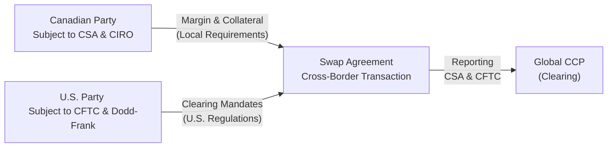

## 9.9 Cross-Border Swaps Considerations

Cross-border swaps refer to any swap transaction where the counterparties, or at least one of the counterparties, are located in different jurisdictions. For example, you might have a Canadian bank entering into an interest rate swap with a U.S. hedge fund—or vice versa. In these scenarios, multiple and sometimes overlapping regulations can complicate matters. So, let’s explore these complexities in a way that feels straightforward (well, at least more straightforward than your typical legal treatise).

Cross-border rules might seem a bit intimidating, but take it from me: the first time I worked on a cross-border swap deal with a London-based bank, I felt like I was on a Ferris wheel of compliance steps. One minute I was thinking about margin requirements in Canada under CIRO/CSA guidelines, and the next I was knee-deep in an EMIR (European Market Infrastructure Regulation) clearing requirement. And that swirl of obligations is precisely why we’re here—to break down the essential considerations so that next time you hop on that compliance Ferris wheel, you’ll buckle in comfortably instead of gripping the railing.

---

### Understanding the Extraterritorial Dimension

Regulation doesn’t recognize borders the way we might hope. A rule in one country can sometimes reach across borders to apply to foreign entities. This reach is known as extra-territoriality. Take the U.S. Dodd-Frank Act, for example. It can apply to transactions conducted by a U.S. swap dealer with a Canadian counterparty, even if the trade is booked outside the U.S.

It’s somewhat like trying to watch two TV channels at once. Each channel (jurisdiction) might have its own rules for trading, clearing, and reporting. And guess what? You might need to comply with both simultaneously, or publicly demonstrate that local rules are equivalent to the other set of rules. For compliance staff at global financial institutions, that can mean referencing detailed legal opinions, bridging collateral solutions, or using specialized trade repositories that dutifully produce data for multiple regulators all at once.

---

### Key Regulatory Frameworks in Cross-Border Swaps

While there are many countries in the world—each with its own legal system—three big frameworks repeatedly show up in cross-border contexts:  
• Canadian Securities Administrators (CSA) and CIRO guidelines in Canada.  
• Dodd-Frank Act in the United States (with oversight by the Commodity Futures Trading Commission, or CFTC).  
• EMIR in the European Union, administered by the European Securities and Markets Authority (ESMA).  

There are others, of course—like the UK’s onshored EMIR post-Brexit, as well as various frameworks in Asia-Pacific. But these three are probably the most common ones you’ll deal with if you’re working in North American or European markets.

Let’s walk through each of these briefly:

#### Canadian CSA/CIRO Rules
Canada’s CSA (Canadian Securities Administrators) fosters a harmonized approach to derivatives regulation across its various provincial regulators. CIRO (the Canadian Investment Regulatory Organization), which replaced IIROC and the MFDA as of 2023, oversees much of the enforcement and market integrity considerations for dealers and cleared derivatives in Canada.

In a cross-border deal, a Canadian bank or investment dealer must ensure that the transaction is consistent with CSA’s local rules on trade reporting, margin, and clearing. If the trade involves a recognized clearing agency, the counterparties must confirm that the clearinghouse is acceptable under Canadian regulations.

#### U.S. Dodd-Frank (CFTC Oversight)
The Dodd-Frank Act drastically changed the U.S. financial regulatory landscape in 2010, setting up a range of new requirements—including mandatory clearing, margin rules for uncleared swaps, and extensive reporting obligations. The CFTC is one of the main regulators tasked with oversight of swaps under Dodd-Frank (though the SEC also plays a role for certain types of swaps, such as security-based swaps).

Here’s where extra-territoriality enters. If one side of your swap is a “U.S. Person,” or if the trade is arranged, negotiated, or executed (ANE) in the U.S., you could be subject to various Dodd-Frank rules, even if you’re physically located elsewhere.

#### EMIR (European Market Infrastructure Regulation)
EMIR aims to improve transparency and reduce risk in the European OTC derivatives market. Key features include mandatory clearing for assets that meet specific thresholds, risk mitigation for uncleared trades (e.g., margin), and trade reporting to an approved European repository. If you’re dealing with a counterparty in an EU member state—or dealing through a branch in the EU—EMIR likely comes into play.

One interesting phenomenon is that EMIR can be recognized as “equivalent” to local rules in other jurisdictions (and vice versa). This equivalence can smooth out compliance demands for global dealers. But if no equivalence determination exists, you might have to comply with the local rules and the EU’s rules simultaneously, which can be double the complexity and costs.

---

### Clearing Mandates and Recognized CCPs

When it comes to cross-border swaps, clearing can be a big puzzle. Which central counterparty (CCP) do you use to clear the trade? Is it recognized by all relevant regulators? If not, your swap might not qualify as a “cleared swap” for certain regulatory relief or margin benefits.

For instance, suppose a Canadian bank is dealing with a U.S. entity. The trade may need to be cleared through a CCP recognized by both Canadian authorities and the CFTC. If the CCP is recognized in Canada but not in the U.S. (or vice versa), you might have to choose a different clearinghouse or structure the transaction in a way that satisfies both sets of rules.

---

### Margin Requirements for Uncleared Swaps

Most major jurisdictions now impose margin requirements for uncleared swaps. In Canada, margin rules for non-centrally cleared derivatives often mirror international standards set by institutions like the International Organization of Securities Commissions (IOSCO). In the U.S., Uncleared Margin Rules (UMR) under Dodd-Frank also reflect these standards, but with specific thresholds and documentation demands that can differ.

If you’re dealing cross-border, it’s important to figure out which side’s margin rules apply—or whether both sets of rules apply. A global bank might be subject to corporate group margin thresholds under Canadian law, while the other side might be subject to the U.S. threshold. The interplay is often sorted out contractually, using legal opinions to verify compliance pathways, so no one ends up in a regulatory black hole.

---

### Transaction Reporting in Multiple Jurisdictions

Remember those parallel TV channels? You might have to report the same swap data in multiple ways, using different formatting or platforms. Canada has a set of reporting rules that revolve around recognized trade repositories; the U.S. requires real-time public reporting to swap data repositories (SDRs). The EU has its own trade repositories authorized under EMIR.

So how do you juggle them all? Sometimes large dealers rely on specialized reporting platforms or third-party service providers to manage multi-jurisdictional reporting. Firms might mirror records: one set is fed into the local repository recognized by the CSA, another set is pinged off to a U.S. SDR for the CFTC, and so on. It can be quite data-intensive, but technology has improved significantly over the years to help handle these parallel obligations.

---

### Practical Example of Cross-Border Coordination

Let’s say you have a Canadian hedge fund (Party A) that wants to enter a swap with a U.S. bank (Party B) to hedge interest rate risk. Here’s how it might play out:

• Party A coordinates with a local counsel in Toronto to check compliance with CSA and CIRO guidelines (including margin thresholds, clearing requirements, and recognized trading platforms).  
• Party B, as a U.S. swap dealer, checks if Dodd-Frank’s requirements for clearing or margin apply. If so, B would prefer the swap be cleared at a CCP recognized by the CFTC. They also confirm if that CCP is recognized by Canadian regulators, ensuring the trade’s clearing is valid in both jurisdictions.  
• Both parties designate a trade repository service that can route data to the relevant agencies. They sign amendments to their ISDA Master Agreement, specifying how margin amounts will be exchanged, how trade reporting obligations are allocated, and which legal opinions will govern if there’s a conflict.  

The outcome? A properly documented, cleared, and reported cross-border swap that meets both sets of rules. Overly complicated? Possibly. But necessary to avoid hefty fines or regulatory hiccups.

---

### A Quick Mermaid Diagram

Below is a simple diagram that illustrates the basic flow in a cross-border swap involving Canada and the U.S. The arrow directions show the relationships among the parties, the swap, and the clearing arrangement.

As you can see, each party has its own local rules, but the swap itself requires a bridging mechanism—such as a recognized CCP—that helps keep the transaction squarely within compliance.  

---

### Managing Global Compliance: Best Practices

• Obtain Legal Opinions: Before you close a deal, get written opinions from counsel that the swap is enforceable and properly recognized under relevant laws.  
• Use Industry Protocols: Many cross-border complexities are addressed by adhering to standard ISDA protocols that specify how trades are reported, how margin is calculated, and how extraterritorial rules are handled.  
• Maintain Robust Documentation: Keep clear, consistent, and up-to-date records. If a regulator knocks on your door asking for evidence, you’ll have a well-documented trail showing compliance.  
• Stay Informed on Equivalence Determinations: Check whether one jurisdiction recognizes another jurisdiction’s rules as “equivalent.” If equivalence applies, you might only have to comply with one set of rules.  
• Adapt to Changing Rules: Regulators often revise cross-border guidelines. Being proactive—maybe even attending global conferences or reading the latest bulletins—can keep you from scrambling at the last minute.  

---

### Bridging Collateral Solutions

One practical headache with cross-border swaps is deciding where and how to hold collateral. If your counterparty is in a different country, each side might have different requirements for eligible collateral and how it’s segregated. Some solutions might include:

• A global custodian bank that offers multi-jurisdictional collateral services.  
• Collateral transformation (like turning corporate bonds into highly liquid instruments) to meet both sides' margin eligibility lists.  
• Clear contractual provisions in the ISDA Credit Support Annex (CSA) so each party knows whose rules apply if there's a dispute.

---

### Using Global Trade Repositories

To simplify compliance, many participants prefer global trade repositories that operate in multiple jurisdictions. These repositories can generate the necessary reporting data for each jurisdiction’s regulatory format, so you don’t have to enter the same trade multiple times. While the initial setup with these repositories might be pricey, it usually pays off through streamlined reporting in the long run.

---

### Common Pitfalls

• Not Confirming Whether a CCP is Recognized: You can’t assume every global CCP is recognized in your jurisdiction.  
• Failing to Exchange Sufficient Margin: Each jurisdiction might have a slightly different formula or threshold. Skipping even small details can lead to regulatory penalties.  
• Overlooking Real-Time Reporting: Some jurisdictions (like the U.S.) require near-instant disclosure of swap data. Missing that window can be costly down the line.  
• Relying on Outdated Equivalence Determinations: Equivalence status can change, especially as rules evolve over time.  

---

### Resources for Further Exploration

• CSA guidance on equivalency determinations for foreign derivatives rules:  
  [https://www.securities-administrators.ca](https://www.securities-administrators.ca)

• CFTC website for cross-border general guidance:  
  [https://www.cftc.gov](https://www.cftc.gov)

• European Securities and Markets Authority (ESMA) resources on EMIR compliance:  
  [https://www.esma.europa.eu](https://www.esma.europa.eu)

• Norton Rose Fulbright’s Regulation Tomorrow blog or Lexology for global legal insights.  

These sites contain official documentation, interpretive letters, and sometimes even user-friendly FAQs. If you’re the kind of person who loves to dive into footnotes, these references can be a gold mine.

---

### CIRO Oversight in Cross-Border Swaps

In Canada, the new self-regulatory organization, CIRO, is responsible for ensuring its members comply with the relevant derivatives rules. While provincial regulators (under the CSA umbrella) create the actual derivatives regulations, CIRO enforces them for investment dealer members. It also coordinates with other international bodies to ensure that cross-border trades remain safe and transparent.

Given the swirl of global regulation, you might see memorandums of understanding (MOUs) between Canada’s authorities and the CFTC or ESMA. These MOUs facilitate cross-border supervision and enforcement actions, which means if something goes off the rails in a multi-jurisdiction deal, regulators have channels to coordinate investigations and share data.

---

### The Takeaway

So, maybe you’re thinking, “Wow, that’s a lot. Should I just avoid cross-border swaps altogether?” In many cases, you can’t—especially if you have global business operations or if your best pricing and liquidity come from a foreign counterparty. The good news? With a bit of planning and a healthy respect for the complexities, executing cross-border swaps can be seamless (or at least less chaotic). 

It boils down to a few fundamental principles: Know which rules apply, document everything carefully, and coordinate with legal, compliance, and operations teams to ensure each step gets done right. It’s a balancing act, but by paying close attention to the details, you can harness cross-border swaps effectively to manage your risk or tap global capital markets—without incurring the wrath of regulators.

---

## Sample Exam Questions: Cross-Border Swaps Best Practices



### Which of the following best describes “extraterritoriality” in the context of cross-border swaps?

- [ ] A situation in which both counterparties are located in the same jurisdiction.  
- [ ] A scenario where participants can ignore foreign regulations if they have a local clearinghouse.  
- [x] The principle where a jurisdiction’s regulations apply beyond its own national boundaries.  
- [ ] The concept of collateralizing swaps with foreign currency only.  

> **Explanation:** Extraterritoriality refers to the idea that one jurisdiction's laws can apply even outside its borders, as commonly seen with U.S. Dodd-Frank rules affecting foreign counterparties.

### A Canadian dealer enters into a swap with a U.S. counterparty. Under which conditions could both CIRO/CSA and U.S. Dodd-Frank rules potentially apply?

- [x] If the Canadian dealer is subject to Canadian regulations and the U.S. counterparty is classified as a U.S. Person.  
- [ ] Only if the swap is physically settled in U.S. dollars.  
- [ ] Only when the notional amount exceeds $100 million.  
- [ ] If neither party is using a recognized CCP under local rules.  

> **Explanation:** Whenever a U.S. Person is involved, Dodd-Frank typically applies. The Canadian dealer also has to comply with CIRO/CSA rules. Both sets of regulations could simultaneously apply to the trade.

### Which of the following best characterizes a “recognized CCP” in a cross-border context?

- [ ] A CCP that solely handles spot FX transactions.  
- [x] A CCP that has gained approval or recognition from regulators in each involved jurisdiction.  
- [ ] A CCP that applies only to margin for uncleared swaps.  
- [ ] A CCP that exempts dealers from reporting obligations.  

> **Explanation:** For a clearinghouse to serve both parties in a cross-border swap, it must be recognized (or “approved”) by each relevant regulator, ensuring each side receives credit for clearing the swap.

### In a cross-border swap, what is the main purpose of equivalence determinations between different regulatory frameworks?

- [ ] To reduce the need for executing trades on regulated exchanges.  
- [ ] To enforce the use of identical margin thresholds across all jurisdictions.  
- [x] To determine whether a foreign set of rules is sufficiently similar, allowing compliance under one framework instead of duplicative compliance.  
- [ ] To standardize the currency in which swaps can be denominated.  

> **Explanation:** Equivalence means one jurisdiction recognizes that a foreign regulatory regime meets similar standards, so participants don’t have to fully comply with two sets of nearly identical rules.

### Which best practice can help parties avoid duplication when reporting a cross-border swap?

- [ ] Using only local repositories and ignoring foreign requirements.  
- [x] Employing a global trade repository that can distribute data to each jurisdiction’s regulators.  
- [ ] Eliminating reporting altogether if the swap is privately negotiated.  
- [ ] Using a local CCP that doesn’t have a reporting function.  

> **Explanation:** A global trade repository can significantly streamline the reporting process by taking the same trade data and delivering it to multiple jurisdictions in the appropriate format.

### Which of the following statements about margin requirements is accurate?

- [x] Major jurisdictions often follow IOSCO-informed frameworks, but local thresholds and procedures can differ.  
- [ ] Margin requirements are entirely optional for global institutional swaps.  
- [ ] Margin is never exchanged in cross-border contexts.  
- [ ] Margin standards never align closely across multiple jurisdictions.  

> **Explanation:** Most large economies use IOSCO-based frameworks for margin in uncleared derivatives. However, each jurisdiction might have slightly different thresholds, timelines, or documentation requirements.

### When a Canadian party trades with an EU counterparty obligated under EMIR, which of the following might cause added complexity?

- [ ] Using a cross-currency swap with CAD/EUR as the underlying.  
- [x] Failing to use a CCP recognized in both Canada and the EU for clearing mandated products.  
- [ ] Negotiating an ISDA Master Agreement.  
- [ ] Opting for a short-dated forward that matures in under one week.  

> **Explanation:** If the asset class is subject to mandatory clearing by EMIR, but the chosen CCP isn’t authorized in both Canada and the EU, that can complicate compliance for both sides.

### What is a common reason parties might require additional legal opinions in cross-border swaps?

- [ ] To determine which party is the official winner if litigation occurs.  
- [ ] To verify that each party has an outstanding credit rating.  
- [x] To ensure enforceability under two or more sets of national regulations.  
- [ ] To confirm the swap is physically deliverable.  

> **Explanation:** Legal opinions help confirm that a swap agreement is legally valid and enforceable across multiple jurisdictions, ensuring compliance with each local legal framework.

### In a cross-border swap subject to Dodd-Frank, what is the role of “real-time” reporting requirements?

- [ ] They ensure that trades are publicized only after 30 days to protect commercial privacy.  
- [ ] They are only mandated if the trade’s notional surpasses $1 billion.  
- [x] They require near-instantaneous disclosure of certain trade details to a swap data repository.  
- [ ] They apply solely to physically settled commodity swaps.  

> **Explanation:** Under Dodd-Frank, certain swaps must be reported in real time—with just a brief delay for large trades—so the market receives timely information about pricing and volume.

### Cross-border swaps often require bridging collateral solutions because:

- [x] Different jurisdictions may have distinct rules on eligible collateral and segregation requirements.  
- [ ] It is mandatory to post only equity securities as collateral.  
- [ ] They help remove all reporting obligations.  
- [ ] They eliminate the need for a Master Agreement.  

> **Explanation:** Cross-border swaps frequently involve different collateral eligibility standards and rules for how collateral must be held. Bridging solutions help ensure consistency and compliance on both sides.


