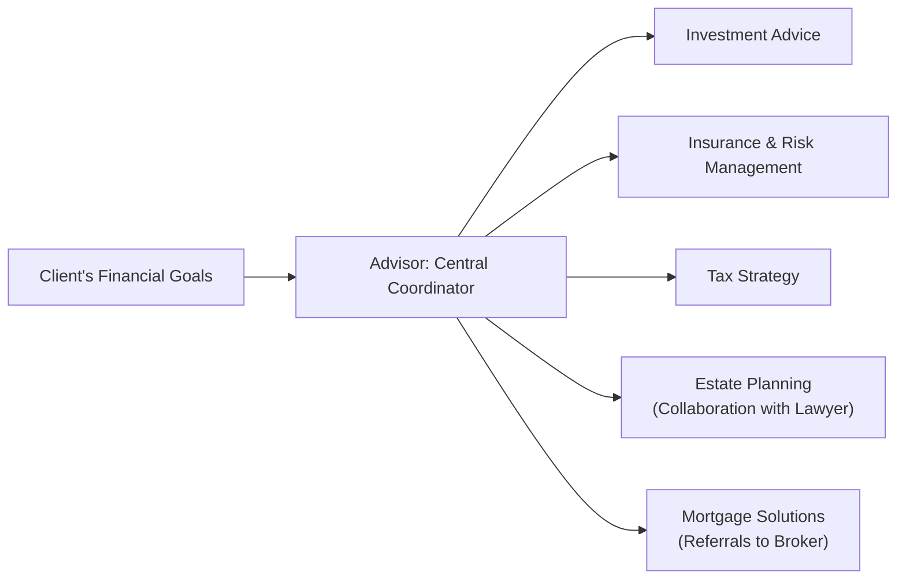

## 1.3 The Full Service Offer

Offering a truly “full service” financial solution is a lot like organizing a big family gathering—think of the advisor as the host who makes sure that everyone’s needs are met, from dietary restrictions to seating arrangements. In a financial context, though, these “needs” are the client’s investment, tax, retirement, insurance, estate, and everyday borrowing needs. The holistic approach ensures each area of someone’s financial life works cohesively with the others so the client feels cared for, well-informed, and supported throughout their journey.

It might sound daunting, right? But once you see how all these components fit together, it often clicks (like that aha! moment when you realize the puzzle pieces do, in fact, create a coherent picture). So let’s explore what it means to offer full-service financial planning, why it matters, who’s involved, and how to actually make it happen without getting overwhelmed.

---

## Making Sense of “Full Service” and Why It Matters

To put it simply, “full service” means you’re integrating several important areas of expertise into a single, cohesive experience for your client. Rather than merely selling products—like mutual funds or insurance policies—in siloed conversations, you’re guiding clients through each aspect of their financial life. That includes:

• Investment Advice (stocks, bonds, mutual funds, ETFs, and more)  
• Insurance and Risk Management (life, disability, health, home, auto)  
• Tax Strategies (optimizing deductions, credits, and structures)  
• Estate Planning (wills, powers of attorney, beneficiary designations)  
• Retirement Planning (RRSPs, RRIFs, RPPs, government plans, TFSAs)  
• Budgeting and Debt Management (personal loans, credit, mortgages)  

It’s a bit like running a multidisciplinary clinic for finances. Each specialist, whether an accountant, lawyer, or mortgage broker, plays a critical role. But the advisor is the one who sees the entire client “chart” and makes sure everything is working well together.

### From Transactional to Holistic

Historically, many advisors focused on transactions: opening an account, buying a mutual fund, or setting up an RRSP deposit. “Job done, see you next year, hopefully!” But client expectations have evolved. Regulatory reforms—such as the new guidelines under the Canadian Investment Regulatory Organization (CIRO)—emphasize an advisor’s duty to act in a client’s best interest and to ensure products fit not merely an investor’s risk tolerance but also their broader life situation.

That’s where the full service offer comes in. By extending beyond transactional interactions, you become a trusted partner in your client’s financial journey. You’re not just there to sell them a product; you’re actively watching out for risks, scouting for opportunities, and adapting to their changing life circumstances—like a new job, an inheritance, market volatility, or a personal milestone such as marriage or the birth of a child.

---

## Key Characteristics of a Full Service Approach

Below are the pillars that often define a full service approach in a financial advisory practice. Imagine them as the supporting beams that keep the whole structure from collapsing:

### Central Coordination

At the heart of a holistic financial plan lies the advisor, acting as the primary point of contact. You gather the information from all parts of a client’s financial life—investment portfolios, insurance policies, credit profiles, tax returns—and weave them together into a cohesive plan.

If you’ve ever led a group project, you know how valuable one central person is who knows exactly who’s doing what, and when. Without a coordinator, details slip through the cracks. One of my first experiences working with a client who had multiple IRAs, RRSPs, and a separate locked-in plan taught me this lesson fast. I had to wear the “project manager” hat to ensure each piece was updated consistently across the board. Honestly, it was a bit of a juggling act, but the outcome was that the client felt everything was “under one umbrella.”

### Collaboration with Specialists

No one can be an absolute expert in everything—there are only so many hours in a day, after all! This is why connecting with an extended team of professionals is essential. For example:

• Seeking guidance from accountants or tax lawyers on complex tax strategies.  
• Consulting with real estate specialists and mortgage brokers for clients looking to acquire property or refinance their homes.  
• Partnering with insurance specialists to assess appropriate products for life, disability, or critical illness coverage.  

The client sees you (the advisor) as the conductor, and the specialists as part of the orchestra. When everyone’s playing in harmony, you get a fabulous performance.

### Regular Touchpoints

Markets fluctuate, personal circumstances change, and regulatory environments evolve. The best advisors don’t wait for the client to call; they schedule check-ins. Sometimes, a quick phone call or a video chat can be enough to catch up on any life changes—like a child heading off to college or sudden changes in personal health. Other times, a deep dive meeting might be necessary to reassess risk tolerances or update estate documentation.

Either way, this proactive approach ensures you’re not playing “catch up” when something big happens. Instead, you’re prepared to pivot and adjust the client’s financial plan as needed.

### Comprehensive Documentation

In a regulated environment—especially under CIRO—best practices tell us that if it isn’t documented, it didn’t happen! Tracking every conversation, plan detail, and client affirmation is not just about covering your bases legally (though that matters, too). It’s also about keeping organized records so you can reference them quickly if a client’s circumstances or preferences shift.

Maintaining thorough documentation also facilitates continuity of service. For instance, if you partner with a new associate or pass the client on to another team member, everyone can see the original notes on how the financial plan is structured and why certain decisions were made.

### Ongoing Service and Proactive Engagement

Full service means continuous care. Think of it like membership in a club that never ends. The client pays for that guidance, and you deliver frequently-updated recommendations, performance reviews, and new insights when relevant. It’s not about “sell it and forget it.” Instead, your clients know you’ll reach out if market turbulence arises, if new regulations come into play, or if you uncover a more advantageous strategy.

---

## Key Benefits: Why Offer Full Service?

• Stronger Client Relationships: When you ensure that investment, risk management, tax, legal, and estate factors are considered in tandem, clients come to see you as indispensable.  
• Client Satisfaction and Retention: A client who feels well-supported is more likely to stay with your firm long term—so you’ll spend less time hustling for new business.  
• Regulatory Alignment: CIRO and other financial oversight bodies encourage (and often require) advisors to adopt a holistic approach, ensuring that all advice is in the best interest of clients.  
• Differentiation in a Crowded Market: The financial industry can be a sea of options, and offering a well-rounded, integrated service helps you stand out from transactional competitors.

---

## The Full Service Flow: A Visual Overview

Below is a simple Mermaid diagram illustrating how an advisor coordinates multiple financial services for a single client. Picture the advisor as a “traffic controller,” ensuring each interaction (investments, insurance, tax strategy, etc.) is aligned with the client’s overall goals.

From left to right, you see how the advisor is the center of communication, ensuring each external or internal specialist is well-informed about the client’s broader situation.

---

## Case Study: Building a Holistic Plan for the McIntyre Family

Let’s consider a fictional example: the McIntyre family—Emma and Jonathan—who have two young kids, a family cottage, a mortgage on their home, and a small engineering business on the side. They consult you for a financial review.

1. Investment Review:  
   • They hold mutual funds in a TFSA and a non-registered account that has not been rebalanced in years.  
   • You perform a risk-tolerance assessment and discover they’re comfortable with moderate risk.

2. Insurance & Risk Management:  
   • Emma has a small life insurance policy through work, but Jonathan has none.  
   • There’s a mortgage insurance on their home but no coverage on the family cottage.

3. Tax Strategy:  
   • Their business is structured as a sole proprietorship. Emma wonders if incorporating might save on taxes or reduce personal liability.  
   • They have minimal knowledge of how to leverage credits and deductions available to small-business owners.

4. Estate Planning:  
   • They have a will drafted 10 years ago, pre-kids. It doesn’t mention guardians for the children.  
   • Their named executor is Emma’s father, who’s had recent health issues.

5. Mortgage Solutions:  
   • Their mortgage rate is up for renewal. Current market rates might present a cost-saving opportunity.

With a full-service approach, you would:  

• Coordinate a sit-down with a trusted accountant to evaluate the potential tax benefits of incorporating their business.  
• Bring in an insurance specialist to determine the best coverage for their family situation.  
• Refer them to a mortgage broker to explore the best rate and terms for their upcoming renewal.  
• Schedule a follow-up with an estate lawyer to update their will and ensure guardianship is properly documented.

All the while, you, as the advisor, document recommendations, keep track of next steps, and follow-up on any unresolved items. You’d also confirm that each proposed change aligns with the McIntyres’ long-term plan—rather than treat each request as an isolated transaction.

---

## Compliance and Regulatory Considerations

Compliance is critical—not just because it’s the law, but because it fosters trust. Under CIRO (Canada’s self-regulatory organization since the amalgamation of the Mutual Fund Dealers Association [MFDA] and the Investment Industry Regulatory Organization of Canada [IIROC] into one entity on January 1, 2023), advisors have clear guidelines:

• You must fully disclose fees, conflicts of interest, and the nature of any recommendations you provide.  
• You should align your advice with the client’s “Know Your Client” (KYC) information and their long-term goals.  
• You are responsible for abiding by the Code of Conduct from CIRO, ensuring fairness, integrity, and professionalism.

Years ago, referencing the MFDA or IIROC would have been standard, but now these predecessor organizations no longer exist as separate entities. Today, it’s CIRO that sets and enforces the rules. Any official updates or clarifications can be found at https://www.ciro.ca.

### Client-Focused Reforms

In Canada, multiple reforms have been introduced that shift the focus onto what’s best for the client. This includes enhanced disclosure, robust suitability checks, and ensuring advisors manage any potential conflicts of interest diligently. For instance, if you also receive compensation for referring clients to a particular mortgage broker, you must disclose this arrangement.

---

## Best Practices and Common Pitfalls

If you’re aiming to implement a full service approach, watch out for these areas:

• Lost Details: When you juggle multiple aspects—investments, insurance, estate planning—sometimes details slip. Keep an updated task list and client record.  
• Specialist Collaboration Without Clarity: If you refer your client to a lawyer, an accountant, and a mortgage broker, but fail to clearly communicate each person’s role, it can lead to confusion. Write out each collaborator’s responsibilities.  
• Inconsistent Follow-Up: Scheduling annual reviews but not actually following through is a quick way to lose trust. Implement a robust calendar system for check-ins and updates.  
• Overpromising: Full service doesn’t mean you need to solve every single issue personally. Rather, it’s about effectively managing or coordinating specialized tasks. Don’t promise services outside your regulatory scope or professional expertise.  

---

## Glossary of Key Terms

• Holistic Financial Planning: An integrated approach that considers all aspects of a client’s financial situation—investments, insurance, taxes, retirement, and estate planning—in a unified strategy.  

• Client-Focused Reforms: Ongoing regulatory updates emphasizing best interest, enhanced disclosure, and prevention of conflicts of interest. These reforms serve to align your professional practice with the evolving expectations of regulators and clients.  

• Specialist Referral: Collaborations or partnerships with subject matter experts (e.g., accountants, lawyers, mortgage brokers) to address complex financial needs. For instance, you might refer a client with complicated estate issues to a legal expert for specialized guidance.  

• Comprehensive Documentation: The practice of maintaining complete, up-to-date records of client interactions, product details, performance metrics, and compliance disclosures. Comprehensive documentation is crucial in a regulatory setting.  

---

## Practical Tools and Additional References

• Code of Conduct from CIRO (https://www.ciro.ca) – Guidance on business conduct expectations under today’s self-regulatory environment.  
• The Canadian Bar Association (https://www.cba.org/) – Resources and legal professionals listings to assist with estate planning considerations.  
• The Canadian Institute of Financial Planners (https://www.cifps.ca/) – Educational materials and community for breadth-focused financial planning.  
• “Comprehensive Financial Planning” from the Canadian Securities Institute – Great reading to advance your knowledge of cross-functional, integrated planning.  

Additionally, consider exploring open-source financial tools—budgeting apps, retirement calculators, and estate planning checklists. While many professional-grade tools require subscription fees, sometimes basic versions or downloadable templates can streamline your workflow and keep you organized.

---

## Encouraging Critical Thinking

If you feel a bit overloaded, that’s understandable. You’re dealing with multiple moving parts. Take a breath and appreciate that guiding others through this complexity can be profoundly rewarding. By applying best practices of full service planning, you’ll strengthen your credibility, client relationships, and overall professional satisfaction.

Ask yourself:  
• Do you have a well-defined process for each area of financial planning?  
• Have you established a network of reliable specialists for referrals?  
• Are you documenting every recommendation thoroughly to align with both compliance standards and best practices?  

Evaluating how you respond to these questions can be a good starting point in optimizing your full service approach.

---

## Conclusion

Adopting a full service financial planning model is about amplifying the client experience by caring for every facet of their financial well-being. From tax strategies and insurance coverage to investment guidance and estate planning, you’re the coordinator who makes sure it all ties together seamlessly. By collaborating with reliable specialists, maintaining robust documentation, meeting clients proactively, and adhering to regulatory obligations, you position yourself as more than an advisor—you become a trusted partner in the client’s life journey.

Yes, it takes work (and a lot of organized calendars, spreadsheets, and phone calls!), but the payoff is substantial: deeper client trust, long-term retention, a more sustainable business model, and a true sense of fulfillment in helping clients thrive financially. You’ll see them through the key transitions of their lives and build relationships that span generations.

---

## Test Your Knowledge: The Full Service Financial Planning Quiz



### 1. Which of the following best reflects a “full service” financial planning approach?

- [ ] Focusing solely on building an investment portfolio to meet short-term goals.  
- [x] Integrating investment, insurance, tax, and estate considerations in a cohesive plan.  
- [ ] Providing basic mortgage referrals without discussing debt management strategies.  
- [ ] Exclusively selling life insurance products as a stand-alone service.

> **Explanation:** A full service approach looks at the entire picture—investments, taxes, risk management, and estate planning—rather than focusing on isolated segments of the client’s financial life.

### 2. What is the main role of the advisor in a “full service” model?

- [ ] To handle only transactions authorized by the client.  
- [x] To serve as the central coordinator, ensuring all aspects of the client’s plan work together smoothly.  
- [ ] To delegate all tasks to external specialists without following up.  
- [ ] To create the will and complete all legal filings on behalf of the client.

> **Explanation:** The advisor’s role is to manage and integrate different financial aspects and rely on or collaborate with specialists where necessary, rather than perform every specialized task personally.

### 3. Why are regular client touchpoints important in a full service approach?

- [ ] They only serve as promotional meetings to sell more products.  
- [ ] They allow the advisor to avoid compliance requirements.  
- [x] They help monitor ongoing changes in the client’s life and market conditions, enabling timely adjustments.  
- [ ] They replace the need for annual KYC updates.

> **Explanation:** Markets and personal circumstances can shift quickly, so consistent communication is key to proactively adjusting the financial plan.

### 4. When discussing insurance coverage within a full service model, what is a best practice?

- [x] Collaborating with an insurance specialist to assess appropriate coverage and product options.  
- [ ] Automatically recommending the policy that pays the highest commission to the advisor.  
- [ ] Ignoring the client’s existing workplace benefits.  
- [ ] Advising the client to hold off on insurance because it’s not related to investment planning.

> **Explanation:** In-depth, tailored advice is pivotal, and usually involves coordination with or referral to an insurance professional.

### 5. Which of the following statements about documentation is correct?

- [x] Advisors should maintain comprehensive, organized records of client recommendations, communications, and approvals.  
- [ ] Documentation is optional if the client signs a waiver.  
- [x] Documentation helps ensure compliance and continuity in case other team members need client information.  
- [ ] It’s enough to verbally inform the client and not keep any written records.

> **Explanation:** Proper documentation not only satisfies compliance but also ensures any future changes or personnel transitions happen smoothly.

### 6. Which of these is a common pitfall in a full service approach?

- [x] Failing to delegate tasks to qualified professionals and instead trying to handle all aspects alone.  
- [ ] Exercising thorough research before presenting product recommendations.  
- [ ] Regularly following up with clients.  
- [ ] Keeping accurate and detailed documentation of discussions.

> **Explanation:** Mismanaging time and expertise by attempting to do everything personally can lead to stress, errors, and potential compliance issues.

### 7. What is the primary advantage for clients in having an advisor who uses a full service model?

- [x] They receive a comprehensive, coordinated plan addressing multiple aspects of their finances.  
- [ ] They only pay lower fees.  
- [x] They never have to do any research on their own.  
- [ ] They receive specialized legal advice directly from the advisor.

> **Explanation:** Clients benefit because they get an integrated solution tailored to their holistic needs. However, note that specialized legal advice should come from licensed legal professionals.

### 8. In Canada, which organization currently oversees both mutual fund dealers and investment dealers?

- [x] The Canadian Investment Regulatory Organization (CIRO).  
- [ ] The Mutual Fund Dealers Association of Canada (MFDA).  
- [ ] The Investment Industry Regulatory Organization of Canada (IIROC).  
- [ ] The Canadian Securities Administrators (CSA).

> **Explanation:** As of January 1, 2023, the MFDA and IIROC amalgamated into CIRO. References to MFDA or IIROC are historical.

### 9. Which resource could you consult for best practices on sharing financial planning responsibilities with other specialists?

- [x] The Canadian Institute of Financial Planners (CIFPs).  
- [ ] Local gardening club resources.  
- [ ] The CIA’s official website.  
- [ ] The Canada Revenue Agency homepage.

> **Explanation:** The CIFPs provides comprehensive resources specifically aimed at financial planning coordination among multiple professionals.

### 10. True or False: Full service financial planning requires thorough documentation, regular client interaction, and an integrated approach.

- [x] True  
- [ ] False

> **Explanation:** Full service planning is holistic, continuous, and supported by proper documentation to ensure appropriate guidance and compliance.


