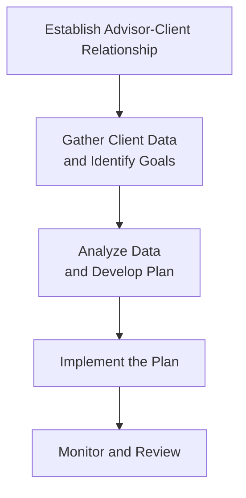

## 1.4 The Financial Planning Process

Sometimes, when we talk about developing a financial plan, we picture something super fancy that only the wealthy need. But honestly, the fundamental process is the backbone of all successful advising, no matter the budget size or net worth. I remember when I started out as a rookie advisor—sitting there with my first client, not entirely sure how to manage all the different pieces of their life story: their family obligations, their hopes of early retirement, the mortgage they wanted to pay off quickly, and even that dream vacation. But it turned out that following a disciplined approach (and yes, a bit of trial and error) was key to actually guiding them in the right direction.  

A well-defined financial planning process ensures you’re consistent, transparent, and, of course, fully compliant with regulations at every turn of the journey. No matter how the model is tweaked—some folks prefer five steps, others might use six steps—the underlying principle is the same: build a structured framework that addresses every aspect of a client’s financial situation, from A to Z.

Below, we’ll explore the most common process that financial professionals use in Canada. This approach aligns closely with guidelines from FP Canada (formerly known as the Financial Planning Standards Council, FPSC) and the CFP Board in the U.S. (though we’re focusing on Canadian markets). We’ll also call out specific references to important regulatory bodies, such as CIRO (Canadian Investment Regulatory Organization), and highlight how technology streamlines everything.  

### Establishing the Advisor-Client Relationship
The first phase in almost every recognized financial planning approach is forging that relationship with your client. Now, I get it—this sounds pretty obvious, but let’s be real: if your client doesn’t trust you or know exactly how you operate, it’s really difficult for them to open up about their finances.  

• Service Scope: Be transparent about the range of services you provide. Do you only work with investments, or do you also handle insurance needs, retirement planning, estate matters, and budgeting? You want your client to know exactly what to expect.

• Compensation Model: Are you fee-only, do you accept commissions, or is it a hybrid? Disclosing your compensation method is not just a best practice; it’s also a regulatory requirement. CIRO emphasizes the importance of transparent fee disclosure to avoid any conflict-of-interest issues.

• Mutual Responsibilities: Clearly indicate the parts you’ll handle versus what rests with the client. For instance, if you need their budgeting data or updated investment statements, let them know how and when to provide it.  

This is also the phase where you can leverage technology—think secure client portals or online forms. An online intake portal could simplify the data-collection process significantly. It also sets the tone for consistent record-keeping and compliance checks.  

### Gathering Client Data and Identifying Goals
After you’ve established trust and hammered out responsibilities, it’s time to delve into your client’s financial life story. I like to think of this as a detective adventure—searching for clues about their financial health.  

• Personal and Financial Details: That’s everything from basic demographics (age, marital status, dependents) to in-depth data (income, expenses, assets, liabilities). This step might remind clients of a medical checkup—some folks would rather not “get on the scale,” so to speak. It may be uncomfortable. But remind them it’s just part of diagnosing their current state.  

• Goals—Short, Mid, and Long Term: Do they hope to buy a new home in three years? Retire by age 60? Pay off debt within five years? Big or small, goals guide the planning process.  

• Risk Tolerance and Investment Preferences: If they absolutely can’t sleep when markets drop 2% in a day, you’ll need to be mindful of that. Tools like questionnaires or risk-profiling software can help gauge how comfortable a client is with volatility.

• Other Constraints or Preferences: This might include ethical investing concerns, family obligations, or inheritance expectations.  

### Analyzing Data and Developing a Plan
Now comes the meaty part—turning raw data into a solid, actionable game plan. In many ways, this step is like diagnosing and prescribing a course of treatment after you’ve done all the lab tests.  

• Current Financial Status: Start by assessing baseline measures, such as net worth, current asset allocation, credit obligations, and insurance coverage.

• Integration of Strategies: Consider how all the pieces fit together. For instance, does it make sense to prioritize registered accounts first (RRSPs, TFSAs) or unregistered accounts? Should you recommend term life insurance or permanent life insurance? How do their taxes look?  

• Scenario Analysis: Sometimes, you’ll want to present multiple scenarios to the client—like a best-case vs. worst-case scenario for retirement or a certain mortgage strategy. Tools like MoneyGuidePro or NaviPlan (or even open-source spreadsheets) come in handy here, letting you run different “what-if” analyses quickly.  

Advisors often find it helpful to create an initial plan, review it, and then refine the recommendations. That’s because once you start analyzing, you might realize new insights about your client’s risk capacity or changing goals.

### Implementing the Plan
Clients come to you for solutions, so once you agree on the plan, you need to “make it happen.”  

• Product Recommendations: This stage might involve setting up new investment accounts, registering for TFSAs, purchasing insurance policies, or restructuring debt. This is where compliance is critical—every recommendation should be suitable to the client’s profile.  

• Clear Communication: Implementation should never feel like a black box. Outline why a particular investment or insurance product is chosen, and walk the client through the application process.  

• Partnerships with Other Professionals: Sometimes you’ll collaborate with tax experts, lawyers, or other specialists—particularly for complex estate or business-planning needs.  

### Monitoring and Reviewing the Plan
Financial plans are never static. Life changes, markets evolve, and so do the client’s goals. This final stage ensures that you don’t just set it and forget it.  

• Scheduled Check-In Meetings: Maybe it’s annual, maybe semi-annual—whatever suits the client’s complexity. This is when you consult them about major life changes: new jobs, marriage, births, divorces, or changes in the market that might influence the plan.

• Adjustments: If a client’s risk tolerance changes or they receive an inheritance (lucky them!), you might need to rebalance or update certain strategies.  

• Performance Tracking: Keep an eye on the client’s progress toward their goals. Are they saving enough, reducing debt, building an emergency fund, or staying ahead of any potential shortfall in projected retirement income?

Below is a concise diagram illustrating this five-step flow:

### Leveraging Technology
We’re in an era where you can hold a video conference instead of an in-person meeting, and clients might prefer uploading documents through a secure portal. Good financial planning software can automatically generate net worth statements, develop retirement projections, or even flag potential tax optimization tricks.  

Furthermore, digital tools can promote transparency by allowing clients to see, in real time, their portfolio risks and returns, or check what fees they’re paying. Just ensure you incorporate robust cybersecurity practices—after all, you’re dealing with sensitive data.  

### Compliance and Regulatory Considerations
Whether you’re brand new or a seasoned pro, never underestimate the significance of compliance. CIRO currently oversees investment dealers, mutual fund dealers, and market integrity across Canada’s equity and debt marketplaces, following the amalgamation of the former IIROC and MFDA (both now defunct) into one entity. Full disclosure of fees, commissions, and potential conflicts of interest is essential.  

If your firm became insolvent, the Canadian Investor Protection Fund (CIPF) is now the sole investor protection fund that safeguards client assets, remaining independent from CIRO. Making sure your practice is aligned with these regulatory frameworks not only protects you but also fosters trust with your clients.  

### The Importance of Client Education and Engagement
It’s not enough to just hand the client a document filled with fancy graphs and charts. Many individuals (including some with sizable assets) genuinely need help understanding financial concepts.  

• Ongoing Education: If your client invests in a mutual fund, explain what that means, how it’s structured, and how it differs from an ETF. If your client purchases creditor insurance, clarify how the premiums are determined, and the coverage specifics.  

• Engagement: Encourage clients to ask questions, attend seminars, or check out resources on your website. The more they understand, the more likely they will stick to the plan during market volatility or personal life changes.  

### Common Pitfalls and Challenges
Even the best advisors might struggle with certain pitfalls:  

• Inconsistent Updates: You create a perfect plan—but then you forget to revisit it for two or three years. This can leave your client’s portfolio misaligned with current trends and their evolving goals.

• Overlooking Behavioral Factors: Financial planning isn’t purely rational. Clients can be motivated by fear, greed, or confusion. Addressing these emotional triggers proactively can be as critical as picking the right product.

• Unclear Fee Structures: If clients feel blindsided by hidden fees or commissions, trust evaporates. Upfront, consistent disclosure is your friend.  

• Narrow Focus: Sometimes an advisor focuses too heavily on investments and neglects tax, estate, or insurance matters. A holistic perspective is vital.

### Glossary
• **Financial Planning Process:** A systematic approach to creating and maintaining a strategy that aligns a client’s risk tolerance, life goals, and personal circumstances with their financial realities.  
• **Implementation Phase:** The period where you put the agreed-upon recommendations into action, whether that’s buying insurance, opening an RRSP, or restructuring debt.  
• **Periodic Review:** A scheduled checkup of the client’s objectives, market trends, and plan performance, ensuring adjustments can be made as life evolves.  
• **Disclosure:** Transparent communication of fees, commissions, conflicts of interest, and details of recommended products, crucial to maintaining trust and complying with regulations.  
• **Client Education:** Ongoing efforts to help clients grasp key financial concepts, thereby enabling them to make more confident and informed decisions.  

### Resources for Further Exploration
• **CIRO Proficiency Requirements:** Access up-to-date guidelines at [https://www.ciro.ca](https://www.ciro.ca).  
• **Financial Planning Software:** MoneyGuidePro, NaviPlan, or open-source spreadsheets to conduct orphan scenario testing and robust forecasting.  
• **FP Canada:** (former Financial Planning Standards Council) offers guidelines supporting a six-step approach to financial planning.  
• **CFP Board’s “Financial Planning Competency Handbook”:** Though U.S.-oriented, it provides great global insights into best practices.  
• **Chapter 2 in This Course:** “Budgeting and Consumer Lending” for deeper dives into personal finance foundations—like debt management and savings.

### Conclusion
The financial planning process lays the groundwork for everything else that follows in your relationship with a client. Stick to its systematic nature—knowing when to gather data, analyze, strategize, implement, and review—and you’ll not only stay compliant but also build stronger, more trusting relationships. In the upcoming chapters of this FP1 course, we’ll walk you through crucial topics such as budgeting, lending, taxes, and estate considerations that feed directly into this overarching framework. Keep your curiosity open, embrace technology, and always remember: the point of a financial plan is to help real people live more secure, confident lives.

---

## Test Your Knowledge: The Comprehensive Financial Planning Process Quiz



### Which of the following best describes the initial step in the financial planning process? 
- [x] Establishing the scope of the advisor-client relationship 
- [ ] Conducting initial risk assessment 
- [ ] Asset allocation and portfolio construction 
- [ ] Regular performance reporting 

> **Explanation:** The very first step is to clarify the advisor’s and the client’s roles, responsibilities, and expectations—laying the foundation for mutual trust and transparency.

### Which of the following is NOT typically part of “Gathering Client Data and Identifying Goals”? 
- [x] Finalizing the product purchase 
- [ ] Determining a client’s financial objectives 
- [ ] Collecting net worth and other vital data 
- [ ] Identifying a client’s risk tolerance 

> **Explanation:** Implementing or finalizing product purchases comes later in the process, after thorough data gathering and plan development.

### When analyzing data and developing a plan, which of the following tools can help advisors compare multiple “what-if” scenarios? 
- [x] Financial planning software, such as MoneyGuidePro or NaviPlan 
- [ ] A client’s general observations about market trends 
- [ ] Unverified social media tips 
- [ ] Outdated spreadsheets from 10 years ago 

> **Explanation:** Software solutions like MoneyGuidePro or NaviPlan (or updated spreadsheets) allow advisors to run various projections and effectively test alternative scenarios.

### In the implementation phase, what is the primary focus of the advisor? 
- [x] Executing agreed-upon recommendations 
- [ ] Only providing research materials without tangible action 
- [ ] Focusing strictly on the next client meeting 
- [ ] Ignoring compliance requirements 

> **Explanation:** Implementation is about putting the recommendations into action (e.g., opening accounts, purchasing insurance) while maintaining regulatory compliance.

### A periodic review of a client’s financial plan should typically involve: 
- [x] Revisiting client goals and market conditions 
- [ ] Only focusing on past performance 
- [x] Adjusting the plan if circumstances change 
- [ ] Avoiding changes to the original plan 

> **Explanation:** In periodic reviews, you look at both how the plan performed and whether any changes in the client’s life or the market require updates.

### Which Canadian regulatory body now oversees both investment dealers and mutual fund dealers following the 2023 amalgamation? 
- [x] CIRO 
- [ ] IIROC 
- [ ] MFDA 
- [ ] CIPF 

> **Explanation:** CIRO (the Canadian Investment Regulatory Organization) now supervises what IIROC and MFDA previously handled separately. IIROC and MFDA are defunct.

### What is one important benefit of using client portals and other online tools in the financial planning process? 
- [x] They can promote transparency and streamline data collection 
- [ ] They eliminate the need for compliance 
- [x] They help maintain organized records that can be easily updated 
- [ ] They assure zero technology risks 

> **Explanation:** Online client portals and digital tools improve efficiency, compliance tracking, and transparency. However, there are always security risks that need managing.

### Which of the following might be a major pitfall in financial planning? 
- [x] Failing to conduct regular plan reviews 
- [ ] Implementing a plan after it’s agreed upon 
- [ ] Disclosing fees up front 
- [ ] Keeping up with regulatory changes 

> **Explanation:** A significant pitfall is neglecting to reevaluate the plan over time, risking misalignment with shifting goals and market conditions.

### Why is robust client education considered a core element of the financial planning process? 
- [x] It empowers clients to make informed decisions 
- [ ] It only benefits the advisor, not the client 
- [ ] It complicates the advisor’s compliance 
- [ ] It diminishes trust between advisor and client 

> **Explanation:** Informed clients are more comfortable with their decisions and more likely to remain disciplined throughout market shifts and life changes.

### True or False: The implementation phase should occur before analyzing client data to save time. 
- [x] False
- [ ] True

> **Explanation:** There’s no way to implement a suitable plan without first analyzing the client’s data, goals, and risk tolerance. Jumping ahead can lead to poor decisions.


