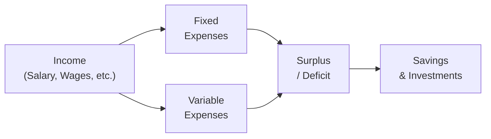

## 2.1 Cash Flow and Budgeting

Let’s talk about something that I’m sure many of us have grappled with at some point—figuring out where our money goes every month. You might be thinking, “I earn a salary, I pay my bills, but somehow it feels like my money disappears faster than I can keep track of it.” Well, that’s exactly what this section is about: understanding the flow of money into and out of your life, and learning how to budget in a way that keeps your finances on steady ground.

Making sense of cash flow and establishing a solid budget is one of the first big steps toward financial stability. I remember when I first started working with clients, I’d often say, “Let’s track your expenses for a month—every single snack, subscription, or breath mint—just to see if we can find those sneaky little spending habits.” Often, my clients would be genuinely surprised (and sometimes slightly embarrassed) at just how much they spent on takeout or daily cappuccinos. But hey, that’s normal—no judgment here! The point is to transform those insights into better decisions.

Below, we’ll break down why cash flow matters, how to organize your earnings and expenses, and how to forecast and track so you don’t end up scrambling to pay bills or going too heavy into high-interest debt. We’ll also talk about the importance of building an emergency fund. Afterwards, you’ll find a glossary of key terms along with references to some helpful Canadian financial regulations, institutions, and other resources.

### Understanding the Importance of Cash Flow

Cash flow is basically the movement of money in and out of your accounts over a particular period of time. If your income (inflow) is greater than your expenses (outflow), you have a positive cash flow. This sweet spot typically means there’s extra money left over for savings, investments, or maybe the occasional treat. On the other hand, a negative cash flow (where expenses exceed income) sends up a warning flag that adjustments need to be made—like reducing costs or looking for additional income sources—otherwise debt can spiral out of control.

Positive cash flow is more than just a nice figure on a spreadsheet. It’s the foundation that allows you or your clients to:

• Contribute to savings or retirement.
• Invest in opportunities like equities, bonds, or real estate.  
• Maintain an emergency fund for unexpected events.
• Enjoy discretionary spending without the stress of going into debt.

In contrast, negative cash flow often indicates:

• Accumulation of credit card balances or other forms of high-interest debt.  
• Potential credit score damage if bills are not paid consistently on time.  
• Ongoing financial stress and inability to manage unexpected costs.

From a financial planning perspective, managing one’s cash flow means creating sustainable habits. You can’t very well focus on long-term investment growth if you’re constantly juggling overdue bills or paying 20% interest on credit cards. That’s why we put so much emphasis on effective budgeting—it’s literally the bedrock upon which the rest of your financial planning is built.

### Identifying Income Sources

Let’s start with the fun part—money coming in! Income doesn’t necessarily come from one place. The more streams of income, the sturdier your financial situation might be. Common sources include:

• Salaries or wages (most commonly your primary job).  
• Contract or freelance work (for side hustles or small businesses).  
• Investment income (like dividends or interest payouts from stocks and bonds).  
• Rental income (if you own rental properties).  
• Government benefits or pensions (e.g., Canada Pension Plan, Old Age Security, child benefits, disability benefits).

In many cases, it helps to separate “reliable” income (like a monthly salary) from “less predictable” streams (like freelance gigs or variable investment returns). This distinction allows you to create a more precise budget. For instance, you might allocate your stable salary to cover fixed living costs (e.g., rent, mortgage payments, groceries), while freelance or variable investment income might go into discretionary spending or savings.

### Categorizing Expenses

Now for the part that might cause you to cringe: expenses. We all have them, and they can be broken down into two main categories: fixed and variable.

• Fixed Expenses are those that remain predictable from month to month or year to year. Think mortgage payments, rent, insurance premiums, car loan payments, and property taxes. They’re often considered “non-negotiable.”  
• Variable Expenses are, well, variable. They change month to month and include things like groceries, utilities, transportation costs, and certain subscription services that fluctuate (e.g., a phone bill with data overages). 

A critical aspect of budgeting is to keep track of these expenses accurately. Sometimes, you’ll see something like your grocery bill vary significantly depending on how often you eat out, social gatherings, or just general inflation in food prices. Identifying where your “pain points” are in variable expenses can help you pinpoint where to scale back if you need to free up extra cash for other goals—like an emergency fund or more investment.

### Discretionary vs. Non-Discretionary Spending

If you want to go further, it’s often helpful to think of your expenses in terms of essential (non-discretionary) versus optional (discretionary) spending:

• Non-discretionary Spending covers the essentials. This includes housing, utilities, groceries, transportation, and any mandatory obligations you can’t just skip.  
• Discretionary Spending is more about lifestyle choices, such as vacations, dining out, gym memberships, entertainment subscriptions, and any “extra” items you don’t strictly need for day-to-day survival.

So, the next time you drool over the latest smartphone or that fancy dinner out, it might help to label it in your mind: “This is discretionary. Do I still want to do it?” There’s no per se “right or wrong” answer, but consistently evaluating your decisions in these terms helps you stay conscious of how you spend your money.

### Forecasting and Tracking

Cash flow is never just guesswork. Forecasting and tracking are essential to ensure you maintain a stable path forward:

• Forecast future expenses monthly or quarterly, especially if you have big expenses on the horizon—like annual insurance premiums or holiday-related spending.  
• Use budgeting tools or personal finance apps to track your actual spending. There are plenty of free or low-cost options out there (Mint, YNAB, and so on), each helping you categorize and compare your projected spending versus actual spending.  
• Adjust your forecasts regularly. Life happens. You might have underestimated a bill or splurged on a well-deserved vacation. The key is to adapt your budget so it remains a reflection of reality, not a piece of fiction.  
• Keep an eye on “budget variance,” which is the difference between forecasted and actual amounts. Large, growing variances indicate your spending patterns or income patterns aren’t matching your plan.

Below is a simple flowchart that conceptually outlines how money might move through your budget each month:

• “Income” flows to two main categories: Fixed Expenses and Variable Expenses.  
• After covering those, you’re left with either a Surplus or a Deficit.  
• A surplus can go toward Savings and Investments (or discretionary wants). A deficit signals you need to reduce costs or increase income.

### Emergency Fund Allocation

Alright, here’s a personal story: My friend once had his water heater burst right in the middle of winter. He ended up spending thousands of dollars on emergency repairs and temporary lodging. It was a nightmare, but he was thankful he had enough cash stashed in an emergency fund so he didn’t have to whip out a high-interest credit card. 

Unexpected events happen—job loss, medical emergencies, major home repairs, car breakdowns, you name it. The rule of thumb suggests stashing away three to six months’ worth of essential expenses in an easily accessible form, like a high-interest savings account or a short-term GIC if you’re comfortable with the liquidity constraints. The point is: an emergency fund is your financial cushion, giving you relief from panic or high-interest debt in stressful times.

### Client-Focused Discussions

If you’re a financial advisor, you know that open and honest dialogue about cash flow changes everything. Encourage your clients to:

• Keep track of monthly income and expenses.  
• Prioritize building or replenishing an emergency fund before making large discretionary purchases.  
• Understand how stable cash flow can reduce reliance on high-interest debt and improve overall financial well-being.

The same is true if you’re managing your own finances—review your budget regularly (I recommend monthly or quarterly) to ensure you’re still aligned with your goals. If you’re consistently coming in under budget (yay!), maybe you can invest more or top up your emergency fund. If you’re overspending, identify where it’s happening. Then strategize how to cut back or maybe look for additional income sources.

### Glossary

• **Cash Flow Statement:** A record showing money flowing into and out of a client’s accounts over a specific period.  
• **Forecasting:** The process of estimating future financial outcomes based on past and current data (e.g., predicting next month’s cash flow).  
• **Discretionary Spending:** Spending on non-essentials, generally wants rather than needs (e.g., luxury items or vacation trips).  
• **Non-discretionary Spending:** Essential spending required for basic living, such as rent, utilities, groceries, and insurance.  
• **Emergency Fund:** A dedicated reserve of cash or near-cash assets set aside for unexpected events or expenses.  
• **Budget Variance:** The difference between what you predicted (projected expenses or income) and what actually happened.  
• **Spending Pattern:** A client’s habitual way of allocating their income across various expenses.  
• **Financial Well-being:** The overall health of a person’s monetary situation, including how much they have saved, the reliability of their cash flow, and whether they can meet financial obligations comfortably.

### Key Canadian Financial Regulations, Institutions, and Additional Resources

• **CIRO (Canadian Investment Regulatory Organization):** As Canada’s national self-regulatory organization for investment dealers, mutual fund dealers, and marketplace integrity, CIRO (https://www.ciro.ca) sets regulatory standards. While you might think regulations apply mostly to investing, CIRO guidelines also encourage advisors to maintain good practices when discussing budgeting, client lending, and financial counseling.

• **Financial Consumer Agency of Canada (FCAC):** (https://www.canada.ca/en/financial-consumer-agency.html) The FCAC is a treasure trove of resources for budgeting calculators, webinars, and worksheets. They even have interactive tools to help individuals compare banking services and track overall spending.

• **Chartered Professional Accountants (CPA) Canada:** CPA Canada regularly publishes personal financial management and budgeting guidelines. These can be great for deeper dives into tax planning, advanced budgeting techniques, and more sophisticated forecasting methods.

• **Open-Source Financial Tools and Frameworks:**  
  - GnuCash (https://www.gnucash.org) is a free, open-source accounting tool that’s surprisingly robust for personal budgeting.  
  - KMyMoney, similar to GnuCash, is also known for being user-friendly and open-source.

• **Books & Resources:**  
  - “The Wealthy Barber” by David Chilton: A Canadian classic that highlights the importance of consistent saving, investing discipline, and effective cash flow management.  
  - “Cash Flow Planning: The Nuts and Bolts of Budgeting”: An online course covering everything from personal money management basics to advanced forecasting.

Putting it all together, effective cash flow management isn’t just about numbers and spreadsheets. It’s also about habit formation, conscious decisions, and a willingness to adapt as your life and finances evolve. Don’t worry if you slip up a bit one month. Keep an eye on your budget variance, stay aligned with your goals, and lean on regulatory bodies and recognized financial organizations for guidance and best practices. Above all, consistent planning plus a watchful eye on your day-to-day spending helps you (or your clients) feel in control and prepared for life’s surprises.

And remember, budgeting doesn’t have to feel restrictive. Think of it more like a roadmap that shows you how to get where you want to be financially—and maybe you’ll even have a little fun along the way.

---

## Test Your Knowledge: Cash Flow and Budgeting Quiz



### Which of the following best describes a positive cash flow?

- [ ] Expenses exceed income over a specific period.
- [ ] Expenses and income are exactly equal.
- [x] Income exceeds expenses over a specific period.
- [ ] No money is spent on discretionary items.

> **Explanation:** Positive cash flow occurs when incoming funds surpass outgoing expenses, providing surplus funds for saving or investing.

### What is typically considered a non-discretionary expense?

- [ ] Vacation resort fees
- [ ] Movie streaming subscriptions
- [x] Monthly mortgage or rent payments
- [ ] Online gaming subscriptions

> **Explanation:** Non-discretionary expenses refer to necessities, such as housing costs, which remain essential for daily living.

### Which of the following is an example of a variable expense?

- [ ] Fixed rent payment
- [ ] Car loan with a set monthly payment
- [x] Groceries
- [ ] Monthly insurance premium

> **Explanation:** Variable expenses fluctuate month to month. Groceries can vary due to changing prices and consumption patterns.

### Which statement about emergency funds is most accurate?

- [x] They generally should cover three to six months of essential expenses.
- [ ] They are usually invested entirely in long-term equities.
- [ ] They only matter if you have a stable, high-paying job.
- [ ] They are optional if you have a strong credit card limit.

> **Explanation:** Emergency funds of three to six months’ expenses are widely recommended, providing financial cushioning against unexpected costs.

### Why is regularly reviewing and adjusting a budget so critical?

- [x] Because actual spending habits may differ from initial forecasts
- [ ] Because forecasting is illegal in Canada 
- [x] Because life circumstances (like job changes) can alter cash flow
- [ ] Because budgeting is a one-time exercise only

> **Explanation:** Budgets should be agile; real-world spending or income changes require updates to keep the plan accurate and relevant.

### What is the purpose of a budget variance analysis?

- [x] To compare the difference between projected and actual expenses
- [ ] To determine the best stocks to purchase
- [ ] To predict the performance of government bonds
- [ ] To calculate compound interest on investments

> **Explanation:** A budget variance analysis helps identify differences between forecasted figures and actual figures, guiding spending adjustments.

### Which resource or organization is most closely related to setting and enforcing standards for investment dealers in Canada?

- [x] CIRO (Canadian Investment Regulatory Organization)
- [ ] FCAC (Financial Consumer Agency of Canada)
- [x] Defunct predecessor SROs IIROC or MFDA if historically referenced
- [ ] KMyMoney

> **Explanation:** CIRO is Canada’s current self-regulatory body for investment dealers, mutual fund dealers, and market integrity. IIROC and MFDA were the former entities.

### Which of the following income types is considered the most predictable?

- [x] Salary or wages
- [ ] Dividend payments
- [ ] Rental income from short-term rentals
- [ ] Freelance contract work

> **Explanation:** Salaries or wages typically offer a stable, predictable cash flow, whereas investment returns or short-term rentals can fluctuate.

### What is one primary reason to have both fixed and variable expenses in separate categories?

- [x] It helps in identifying exactly where you can make adjustments more easily
- [ ] It ensures your debt-to-income ratio remains constant
- [ ] It allows access to specialized government rebates
- [ ] It is necessary only for high-income earners

> **Explanation:** Separating fixed and variable expenses clarifies which costs are stable and which can be adjusted in lean months.

### True or False: An emergency fund should be invested in long-term, high-risk assets to maximize growth.

- [x] True
- [ ] False

> **Explanation:** This is a trick question. While it might be tempting to chase higher returns, an emergency fund typically belongs in a liquid, low-volatility vehicle (like a high-interest savings account) so it’s accessible when emergencies strike.


