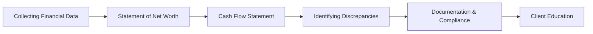

## 2.2 Preparing Client Statements

Preparing client statements might sound like a dry, mechanical task, but it’s actually one of the most rewarding parts of financial planning—well, at least in my humble opinion. There’s something almost magical about taking a pile of documents, scribbled notes, pay stubs, and receipts, and transforming them into a clear financial snapshot that helps your client negotiate their day-to-day life and dream for the future. Let’s explore how it all works, with practical tips and a friendly, slightly informal approach.

### Introduction

Whenever we talk about preparing official client statements—like a Statement of Net Worth and a Cash Flow Statement—it can feel a bit overwhelming. After all, you’re dealing with intimate details of someone’s financial world, so seriousness and accuracy definitely matter. But the process can be a lot simpler and more straightforward than it first appears. And once you get the hang of it, you’ll find it’s an art form to piece together all the data, cross-check the numbers, and paint a picture that helps people make better decisions.

Financial statements are also key to fostering trust. Think about it this way: if someone is entrusting you with their finances, you want to respect that trust by being meticulous, compliant, and caring. Let’s walk step by step—from collecting every relevant bit of data to creating that final set of statements.

### Collecting Financial Data

Collecting financial data is a bit like going on a treasure hunt—seriously! For an accurate set of financial statements, you need detailed information on:

• Assets: Registered accounts (e.g., Registered Retirement Savings Plan (RRSP)), non-registered investments, personal property, business interests, and physical assets like real estate and vehicles.  
• Liabilities: Mortgages, credit card debts, student loans, car loans, lines of credit—really anything that requires the client to repay someone else.  
• Income Records: Recent pay stubs (or T4 slips in Canada), tax returns (like the T1 for Canadians), or other forms that document how much money they earn.  
• Expense Records: Monthly or annual expenses such as rent, mortgage payments, utilities, insurance, groceries, and personal entertainment.

I remember one of my very first clients forgetting entirely about a small credit card she rarely used. When I asked her to pull her credit report, there it was: a balance of C$250 that had slipped her mind. That’s why it’s crucial to double-check all possible documentation. The more thorough your request for information, the fewer surprises show up later.

Also, collecting data isn’t just about rummaging through a shoebox of receipts. You’ll need a systematic approach, especially as your practice grows. Set up checklists, create templates in a spreadsheet tool like LibreOffice Calc (an open-source, free alternative to commercial software), or use a comprehensive financial software like GnuCash. These tools make it easier to track the data consistently and spot omissions.

### Statement of Net Worth

Once you have the data, you’ll create a Statement of Net Worth. This statement breaks down the client’s total assets minus total liabilities at a set point in time. It’s basically a snapshot: “As of June 30, 2025, here’s what you own and what you owe.” Why is that so important? Because net worth is a straightforward way to measure financial health and progress over time.

• Assets might include cash, TFSAs, RRSPs, stocks, bonds, property holdings, or even gold bars in a safety deposit box.  
• Liabilities include mortgages, lines of credit, or that auto loan you took out for the shiny new car.

Below is a simple example of a net worth statement in tabular form. The values are fictional, but they illustrate how you might present the data:

| Asset Description             | Amount (C$)  |
|-------------------------------|-------------:|
| Checking & Savings Accounts   |      10,000 |
| Registered Retirement Savings |      40,000 |
| Non-Registered Investments    |      25,000 |
| Personal Residence (Market)   |     400,000 |
| Automobile (Estimated Value)  |      15,000 |
| **Total Assets**              | **490,000** |

| Liability Description         | Amount (C$)  |
|-------------------------------|-------------:|
| Mortgage on Residence         |     280,000 |
| Car Loan                      |       5,000 |
| Credit Cards                  |       2,000 |
| **Total Liabilities**         | **287,000** |

Net Worth = Total Assets - Total Liabilities  
Net Worth = C$490,000 - C$287,000 = C$203,000  

That’s your net worth figure. One of the coolest parts of tracking net worth is seeing how it changes over time—hopefully, in a positive direction. And if not, well, you have a clear signal that something needs adjusting.

### Cash Flow Statement

A Cash Flow Statement details where money comes from (income sources) and how it’s spent (expenses). And, trust me, when you lay it all out, you discover interesting patterns. A client may think they’re only spending C$100 a month on coffee shops and takeout, and the statement reveals it’s more like C$300. That can be an “Ah!” moment that spurs important changes.

Common components include:  
• Income: Salaries or wages, business income, dividends, rental income, government benefits.  
• Expenses: Rent/mortgage, utilities, groceries, insurance, entertainment, etc.  

The goal: ensure actual spending aligns with (or at least realistically fits in) the client’s bigger goals, such as paying off debt or saving for a dream vacation. If you notice the lifestyle expenses overshadowing essential savings, that might indicate a deeper conversation is needed.

### Identifying Discrepancies

Sometimes statements and your client’s actual day-to-day financial reality don’t line up perfectly. Discrepancies might pop up between the net worth statement and tax returns or between the amounts reported on the client’s credit card statements and what they listed as monthly expenses.

I still remember a time when a client insisted they only spent about C$200 on groceries. After reconciling their bank statements for a month, we realized it was closer to C$500. They had a habit of using two different grocery stores and also making small top-up trips. Tracking these was the key to bridging the gap.

When you spot inconsistencies:

• Politely ask questions to clarify. Sometimes clients simply forget.  
• Compare multiple records—bank statements, official statements from financial institutions, and credit reports.  
• Look for patterns. If there’s a monthly mismatch, it might be because of an overlooked subscription or an unknown service fee.

You can also examine credit reports (free to request from Canada’s major credit bureaus) to cross-check posted liabilities. Trust me—reconciling them early saves everyone headaches down the line.

### Documentation and Compliance

In Canada, compliance regulations are mainly overseen by government bodies and the Canadian Investment Regulatory Organization (CIRO). (Historically, there were separate self-regulatory organizations, such as the MFDA (Mutual Fund Dealers Association) and IIROC (Investment Industry Regulatory Organization of Canada), but these merged to become CIRO, effective June 1, 2023.)

When handling personal financial data, keep in mind:

• Privacy Regulations: The Personal Information Protection and Electronic Documents Act (PIPEDA) is key. It mandates how private-sector organizations collect, use, and disclose personal information.  
• Secure Storage: Keep records safe—password-protected folders, encryption, secure cloud-based solutions.  
• Accuracy and Timeliness: If a regulator requests client documentation, you must be able to pull up accurate files.  
• CIRO Jurisdiction: CIRO now oversees investment dealers, mutual fund dealers, and marketplace integrity. Always keep up to date with their investor and compliance guidelines (https://www.ciro.ca).  

You must also follow the Canadian Investor Protection Fund (CIPF) guidelines, which protect client assets in the event of a firm insolvency. If you have any doubt on a compliance detail, it’s better to double-check with the official CIRO website. 

### Client Education

So, you’ve gathered the data, prepared the statements, identified discrepancies, and complied with all relevant rules. The next part is a bit overlooked by some advisors but equally essential: client education. Explaining the statements helps clients see what’s actually going on and urges them to become more proactive in tracking their finances.

Sure, the net worth statement is fairly straightforward—here’s what you own, here’s what you owe—but you may need to clarify how intangible assets (e.g., certain types of investments) work. Explain what liquidity really means (how quickly an asset can be turned into cash without losing value) and why that matters in an emergency. Show them how different segments of their money might be locked into specific investments.

For the Cash Flow Statement, use everyday language: “Here’s your monthly income. Your expenses are broken down into fixed expenses—like rent and loan payments—and variable expenses—like entertainment and dining. If you can reduce the variable expenses a bit, you can save more or pay down your credit card faster.”

Often, I like to encourage my clients to do a quick monthly reconciliation themselves. Let them see how close their projected expenses were to their actual spending. This fosters stronger financial awareness and discipline.

### A Visual Overview of the Process

To help illustrate how everything fits together, here’s a short Mermaid diagram showing the basic flow from collecting data to educating the client:

### Practical Notes and Examples

• Decluttering Data: Sometimes your client hands you crumpled receipts from the local coffee shop or grocery store. Encourage them to keep these in an organized file or spreadsheet. Digital receipts are even better—no more rummaging in the couch.  
• Open-Source Tools: If you or your client prefer free options, check out GnuCash (https://www.gnucash.org/) or LibreOffice Calc (https://www.libreoffice.org/). They’re robust and can handle most small to mid-size planning needs without the overhead of an expensive subscription.  
• Ensure CRA Alignment: The Canada Revenue Agency (CRA) (https://www.canada.ca/en/revenue-agency.html) has official forms and guidelines that align well with financial statements. For instance, verifying T1 envelopes or digital tax slips to ensure all income is accounted for can help you fully align the statements with tax data.  
• Government of Canada’s Online Services: Clients can access their personal tax information online, which can help in verifying tax slips, child benefits, or other government benefits.

### Common Pitfalls and Best Practices

• Pitfall: Overlooking small liabilities, like departmental store credit cards or even “buy now, pay later” setups.  
• Pitfall: Using net worth statements that are outdated. Not updating property values or missing new liabilities can give a distorted picture.  
• Best Practice: Regular reviews—quarterly or semi-annually—so clients see progress and remain motivated.  
• Best Practice: Demonstrate how lifestyle changes can directly impact the net worth and cash flow. For instance, trimming C$50 a week in discretionary spending can lead to big savings over a year.

### Glossary

• **Net Worth Statement**: A snapshot of all assets minus all liabilities at a specific point in time.  
• **Liquidity**: How easily an asset can be converted into cash without significant loss of value.  
• **Compliance**: Adhering to regulations, guidelines, and standards set by governing bodies.  
• **Privacy Regulations**: Laws that govern the collection, use, and disclosure of personal information (e.g., PIPEDA in Canada).  
• **Discrepancy**: A difference or inconsistency found when comparing financial figures in statements.  
• **Reconciliation**: The process of ensuring that two sets of financial records agree with one another.  
• **Omissions**: Missing or overlooked financial items that should be included in statements.  
• **T1 Tax Return**: A personal income tax form used in Canada to file annual taxes.

### Further Reading and References

• **CIRO (Canadian Investment Regulatory Organization)**. For updated compliance guidelines and investor protection rules. (https://www.ciro.ca)  
• **Canada Revenue Agency (CRA)**. Official forms and guidelines on tax reporting. (https://www.canada.ca/en/revenue-agency.html)  
• **Government of Canada’s Online Services**. Allows access to personal tax information and direct deposit settings.  
• **PLEI (Public Legal Education and Information)**. Province-specific resources on privacy acts and related regulations.  
• **LibreOffice Calc**. (https://www.libreoffice.org/) An open-source office suite for spreadsheets and other productivity tasks.  
• **GnuCash**. (https://www.gnucash.org/) A popular free software for personal bookkeeping, small business accounting, and financial statement creation.

Finishing off, let me just say that preparing client statements is a bit like putting together a puzzle. All the pieces—income, expenses, assets, liabilities—have their place, and once you fit them together, you get this bright, clear picture of someone’s financial standing. With thorough data collection, robust compliance practices, and client-centric education, you can be an indispensable resource in helping people take control of their financial lives.

## Test Your Understanding of Preparing Client Statements Quiz



### Which of the following best describes a Statement of Net Worth? 
- [ ] A summary of monthly income and expenses.
- [ ] A list of only mortgage and credit card debts.
- [x] A snapshot of all assets minus all liabilities at a specific point in time.
- [ ] A record of government benefits collected in a fiscal year.

> **Explanation:** A Statement of Net Worth shows total assets and total liabilities at a certain date. It’s not just about monthly income or expenses.

### What is the primary purpose of collecting multiple financial documents, such as pay stubs and T1 tax returns, when preparing client statements?
- [x] To ensure all income and liabilities are accurately captured.
- [ ] To reduce the client's tax liability.
- [ ] To identify the best mutual fund investment.
- [ ] To hide irregularities in spending.

> **Explanation:** Collecting multiple documents avoids forgotten liabilities and income sources, ensuring an accurate, all-encompassing financial picture.

### What is one of the key benefits of preparing a regular Cash Flow Statement for a client?
- [ ] It automatically eliminates all overdraft fees.
- [x] It helps identify and categorize spending to align with goals.
- [ ] It replaces the need for any credit reports.
- [ ] It is mandatory to file with the CRA.

> **Explanation:** A Cash Flow Statement shows where money is coming from and where it’s going, helping to align a client’s day-to-day finances with their bigger goals.

### When identifying discrepancies in a client’s records, what should you do first?
- [x] Ask clarifying questions and compare multiple records to understand the cause. 
- [ ] Immediately call the CRA to report fraud.
- [ ] Close the client’s credit card accounts.
- [ ] Cease consultations until all inconsistencies are resolved by the client alone.

> **Explanation:** Start by asking questions to clarify. Often, clients simply forget or misplace information, so open communication is key.

### Why is it crucial to keep client data secure under PIPEDA in Canada?
- [x] To comply with privacy regulations and protect personal information.
- [ ] Because clients are required to share their data publicly.
- [x] To avoid potential legal consequences for mishandling data.
- [ ] To reduce the net worth of the client.

> **Explanation:** PIPEDA enforces secure handling of personal data, and non-compliance can lead to serious legal repercussions.

### CIRO (Canadian Investment Regulatory Organization) is:
- [x] Canada’s national self-regulatory body for investment and mutual fund dealers.
- [ ] A defunct group that replaced CIPF.
- [ ] A federal banking institution offering personal loans.
- [ ] A group that only oversees credit card statements.

> **Explanation:** CIRO now replaces the former MFDA and IIROC, overseeing investment dealers, mutual fund dealers, and market integrity.

### Which of the following statements about net worth is true?
- [x] It’s calculated by subtracting total liabilities from total assets.
- [ ] It cannot be updated regularly.
- [x] It helps track financial progress over time.
- [ ] It is irrelevant for retirement planning.

> **Explanation:** Net worth is total assets minus liabilities. As net worth changes over time, it’s a crucial indicator for financial planning purposes, including retirement.

### What is one of the most common pitfalls when preparing a Statement of Net Worth?
- [x] Forgetting to include smaller debts like store credit cards.
- [ ] Documenting only real estate property.
- [ ] Including too many assets that are not owned by the client.
- [ ] Refusing to use any financial records.

> **Explanation:** People often forget lines of credit or small credit card balances, which can lead to inaccurate statements.

### How can open-source tools such as GnuCash aid in preparing client statements?
- [x] They allow for detailed tracking of income, expenses, and assets without expensive software fees.
- [ ] They automatically retrieve the client’s data from private bank servers.
- [ ] They serve solely as entertainment platforms.
- [ ] They replace the need for professional advice.

> **Explanation:** GnuCash simplifies data tracking and provides robust functionality without costly subscription fees, though it won’t replace a qualified advisor.

### True or False: A Cash Flow Statement measures assets versus liabilities. 
- [x] False
- [ ] True

> **Explanation:** A Cash Flow Statement focuses on income versus expenses, while a Statement of Net Worth compares assets and liabilities.


