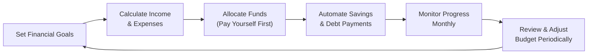

## 2.3 Budgeting and Savings Fundamentals

If you’ve ever felt like your money disappears the moment it hits your bank account—well, you’re definitely not alone. I remember back in my twenties, I thought building a budget was sort of optional. I mean, I had some vague sense of what I owed each month, but I never really kept track of how much was going out compared to how much was coming in. One day, I realized I was basically living paycheque to paycheque, and it was a wake-up call. Suddenly, writing down every little expense felt a lot less optional and a lot more critical.

This chapter focuses on the importance of building a solid budget to guide your financial decisions and, crucially, how it feeds into setting realistic savings goals. A good budget does more than just track your spending. It helps you define the life you want to lead—both now and in the future. The “pay yourself first” approach might seem like a simple tagline, but it’s a genius little trick that can transform your financial life if you stick to it. Let’s take a look at why budgets matter, how to set them up, and how to keep them going strong year after year.

Use the concepts discussed earlier in Chapter 2—like analyzing cash flow (Section 2.1) and preparing client statements (Section 2.2)—as building blocks. Here, we focus on how to apply those pieces of data in a practical, everyday budget that meets the needs of diverse groups, from single adults to big families, and from early-career professionals to those nearing retirement.

---

### Budget as a Foundation of Financial Health

You can think of a budget as the blueprint for your financial house. Without a firm blueprint, it’s easy to overspend, rack up a bunch of credit card debt, and then wonder why your bank balance is always anemic. A properly structured budget ties actual income (like salary, rental income, or side-business profits) to expenses (rent or mortgage, groceries, entertainment, loan payments, etc.) in a way that aligns with your personal or family goals.

A well-crafted budget helps:

• Identify and manage fixed costs (like rent) vs. discretionary expenses (like dining out).  
• Create awareness of “needs” vs. “wants,” so you can prioritize your spending.  
• Eliminate (or at least drastically reduce) the guesswork around what's happening to your money each month.  
• Serve as a roadmap for saving and investing.

Any financial plan, including advanced aspects of consumer lending (discussed in Section 2.5) or mortgages (Chapter 3), really starts here. If you know exactly how much you can afford each month, you make better decisions on loans, investments, or mortgage payments. In other words, budgeting is where it all begins.

---

### Setting Clear Savings Goals

Budgeting isn’t just about cutting expenses. It’s also about feeding your goals. When we talk about “saving,” we’re really talking about building a cushion for the future—whether that future is in six months or 25 years. The clearer your goals, the more motivated you’ll be to set aside money consistently.

#### Short-Term Goals (up to one year)
Short-term goals usually revolve around immediate needs or unexpected circumstances. Think of an emergency fund for car repairs, your best friend’s wedding next summer, or a small vacation. Setting aside some portion of your monthly pay for these short-term goals is a big step to achieving peace of mind. The general rule is to have at least three to six months of living expenses in an emergency fund. But if you find that daunting, start with even $500 or $1,000, and build from there.

#### Medium-Term Goals (1–5 years)
Maybe you want a down payment for a home or condo, or you’re planning for an upcoming wedding or saving for your child’s education. These sorts of items typically require bigger sums than short-term emergencies, so budgeting becomes extra important. For example, if you need $20,000 in four years, you can break that down into monthly targets to figure out exactly how much you need to stash away.

#### Long-Term Goals (5+ years)
Long-term savings often revolve around major life events such as retirement or your children’s post-secondary education. If you’re eyeing retirement, that might be 20 or 30 years away, which means you’ve got some time to let your contributions grow. But it also means you need a strategy to ensure you’re regularly setting aside funds in something like a Registered Retirement Savings Plan (RRSP) or Tax-Free Savings Account (TFSA), and possibly investing in a portfolio that’s appropriate for your risk tolerance and time horizon. 

---

### Setting Realistic Targets and the “Pay Yourself First” Principle

Pay yourself first. It sounds so simple, right? You get your paycheque, and before you start paying bills or indulging in a night out, you set aside a chunk for your savings and investments. That chunk can be 10%, 15%, or even 20% depending on your comfort level. I used to think, “There’s no way I could save 20% of my income!” But gradually, I increased how much I saved each month, even if it was by 1% or 2% now and then. Over time, it became a habit.

Why does this approach work so well? Because you’re treating savings like the top priority—and you adjust your lifestyle to what’s left over. If you wait to save whatever is left after all your expenses, you might discover there’s nothing left to save at the end of the month. By saving first, you lock in progress toward your long-term goals.

#### How to Make Targets Realistic
• Evaluate your current income and fixed expenses: You can’t save $500 a month if you only have $200 leftover.  
• Start small: Even $50 bi-weekly can add up. Increase incrementally as your income grows or your expenses shrink.  
• Factor in inflation: Over many years, your expenses might rise. Plan each year to adjust your savings target accordingly.  
• Keep track of lifestyle changes: If you get a raise, try funneling some or all of that bump into your savings, rather than upgrading your lifestyle (sometimes called “lifestyle creep”).

---

### Aligning Budgets with Life Stages

Your budgeting strategy will shift as your life circumstances change. A single person fresh out of college has different financial pressures than a couple saving for a baby. Families with teens saving for university have different needs than retirees living on a fixed income.

• Single Adults: Focus on building a strong foundation. Establish that emergency fund, pay off high-interest debt, and start investing for the future.  
• Couples: Communicate openly about finances. Do you have joint accounts, separate accounts, or some combination? Align on shared goals—like saving for a home or planning a honeymoon.  
• Families and Parents: Childcare costs, kids’ extracurriculars, and saving for education can quickly eat up a budget. Prioritize these goals, but also keep retirement planning on the agenda.  
• Mature Families/Caregivers: If you’re looking after elderly parents, factor in medical or caregiving expenses. Don’t forget to maintain your own financial health.  
• Pre-Retirees: Health care costs might loom larger. Budgeting for potential medical needs or long-term care is wise. You may also focus on maximizing contributions to RRSPs or TFSAs.

Think of budgeting as fluid—something that adapts to your evolving situation throughout different life stages.

---

### Automating Savings

One of the best ways to avoid the temptation to spend is simply not to let that money sit around in your chequing account. Then it won’t be there for “just one more streaming subscription” or that impromptu weekend getaway. By automating, you effectively pay yourself first without thinking about it. 

Here’s how:

• Pre-Authorized Contributions: Set up transfers so they move from your chequing account to your high-interest savings or TFSA as soon as you get paid.  
• Employer Retirement Plans: Some employers offer pension or group RRSP contributions. If it’s available to you, jump on it early.  
• Automatic Investment Plans: Mutual funds, exchange-traded funds (ETFs), or other investment vehicles can usually be funded via automated monthly contributions.  
• Savings Apps: Many banking apps have “round-up” features where your small transactions are automatically rounded up and funneled into a savings account.

In my own experience, automating was the single biggest shift that made budgeting and saving feel effortless. No mental gymnastics, no having to remember to do it manually. You decide once, and the system runs “in the background” day in and day out.

---

### Measuring Budget Effectiveness

Okay, so you have a budget. How do you know it’s working? Or if it’s not working, how do you fix it?

• Track Monthly Progress: Look at whether you’ve hit your monthly savings targets.  
• Compare Goals to Actuals: Did you say you’d save $400, but ended up only managing $250? Figure out why. Was there an unexpected car repair? Were you overspending on discretionary items?  
• Revise as Needed: If your income changes, or something big pops up (like a medical bill), be flexible. Increase or decrease your savings component accordingly.  
• Celebrate Little Wins: If you stick to your budget for a quarter, reward yourself with something modest. Positive reinforcement actually helps the habit stick.

Reviews are essential. You might do a quick monthly check, with a more thorough quarterly review to see trends. It’s like checking the scoreboard in a sports game: you have to see where you stand in order to make adjustments and finish strong.

---

### A Visual Guide to Budgeting Cycles

Below is a simple flowchart showing how budgeting, goal-setting, and monitoring can work together in a continuous cycle. It’s not truly linear; it works best as an ongoing process, looping back at every stage.

In this visual:  
• You start with your goals.  
• Identify all your income sources and key expenses.  
• Allocate funds based on those goals and “pay yourself first.”  
• Automate as much as possible to reduce slip-ups.  
• Check in monthly or quarterly.  
• Make any needed adjustments and loop back to your goals.

---

### Practical Examples and Case Studies

• Maria’s Emergency Fund: Maria is 24 and starting her first full-time job. She sets a goal to stash $1,000 for emergencies in three months. She automates $125 from every bi-weekly paycheque into a high-interest savings account. By sticking to her budget, she hits her goal faster than planned and decides to keep the momentum going by aiming for a three-month emergency fund.  

• The Sun Family’s Home Down Payment: The Suns, a married couple with stable incomes, want to buy a home in four years. They need $40,000 for a down payment. They figure out they must save about $833 a month combined. They set up automatic transfers right after each pay is deposited, so by the month’s end, it’s not even “missed.” They track progress each quarter, adjusting when Mr. Sun receives a promotion (putting half his salary increase toward the down payment fund).  

• James’s Retirement Strategy: Nearing age 50, James has realized he’s behind on retirement savings. He decides to “pay himself first” by contributing $1,000 monthly to both his TFSA and RRSP. He also invests in low-fee ETFs. Even though it’s a bit uncomfortable at first, he’s made it automatic, so he adjusts his daily spending habits as needed. He monitors his progress and plans to do a thorough re-check every six months.

---

### Glossary

• **Pay Yourself First** – A budgeting approach where a fixed portion of your income goes directly to savings or investments before spending on other items.  
• **High-Interest Savings Account (HISA)** – A type of bank account offering a higher interest rate than a standard savings account. Transaction options can be limited, but it’s perfect for storing your emergency fund or short-term goals.  
• **Short-Term Savings** – Funds earmarked for near-future needs (less than one year), like an emergency fund or small planned purchases.  
• **Medium-Term Savings** – Savings designated for goals falling within one to five years, such as a new car, education, or down payment.  
• **Long-Term Savings** – Money set aside for five years or more, commonly for retirement or other major life milestones.  
• **Life Stage Planning** – A financial strategy that evolves as you move through significant life stages—graduation, marriage, raising a family, caring for parents, or retirement.  
• **TFSA** – The Tax-Free Savings Account, a registered account in Canada that allows your money to grow tax-free. Contributions aren’t tax-deductible, but withdrawals (including earnings) are tax-free.  
• **Budget Allocation** – The practice of dividing your after-tax income among various categories (savings, debt, living costs, discretionary spending) to ensure all priorities are covered.

---

### References and Tools

• **Financial Consumer Agency of Canada (FCAC)** –  
  FCAC offers budgeting tools and calculators to help plan your finances. Check out the Budget Planner here:  
  (https://itools-ioutils.fcac-acfc.gc.ca/YFT-EN/)  

• **Canada Deposit Insurance Corporation (CDIC)** –  
  Learn about how your deposit products, including high-interest savings accounts, are insured at (https://www.cdic.ca/).  

• **Open-Source Budgeting Tools** –  
  Budget spreadsheets from the Canadian Centre for Financial Literacy are an excellent place to start if you like to craft your own approach.  
  Personal finance apps like [HomeBank](https://homebank.free.fr) help you track your expenses, categorize them, and visualize trends—perfect if you want a user-friendly, open-source solution.  

• **Additional Resources** –  
  • Many financial institutions in Canada have auto-deposit features to help you move funds seamlessly into a savings or TFSA account.  
  • The Canadian Investment Regulatory Organization (CIRO) at (https://www.ciro.ca) provides broader guidance on investments and is Canada’s national self-regulatory organization for investment dealers and mutual fund dealers.

---

### Conclusion

Anyway, budgeting might seem like a chore at first. But once you see the benefits—less stress, fewer money arguments, and a crystal-clear sense of progress—it starts to feel like the best decision you ever made. It's okay if you have some missteps at first—everyone does. Building a budget is a skill, one that gets better with practice and experience. By setting clear goals, automating your savings, and regularly measuring your progress, you turn your budget into a powerful ally in achieving financial security.

Remember: start small, celebrate small achievements, and keep refining your approach. You can move mountains—one pebble at a time.

---

## Test Your Knowledge: Budgeting and Savings Essentials



### Which of the following best describes the “pay yourself first” principle?

- [ ] Spending money on necessities before luxuries
- [x] Allocating a set amount to savings before paying other expenses
- [ ] Maintaining separate bank accounts for monthly bills
- [ ] Budgeting strictly for short-term expenses only

> **Explanation:** “Pay yourself first” dictates that savings and investments should be the top priority, ensuring consistent contributions toward future goals.

### Which statement is generally true about short-term savings goals?

- [ ] They are always for high-cost items
- [ ] They require a special investment account only
- [ ] They are never useful for emergencies
- [x] They usually span up to one year and can include an emergency fund

> **Explanation:** Short-term goals typically revolve around immediate to near-future needs—often within a year. Common examples include small purchases or emergency funds.

### Automating savings can best be achieved by which of the following methods?

- [ ] Making one-time manual transfers only when you remember
- [x] Setting up pre-authorized contributions from your paycheque
- [ ] Combining your chequing and savings into a single account
- [ ] Paying all your bills before allocating money to savings

> **Explanation:** Automation typically involves pre-authorized transfers moving funds directly into your savings or TFSA, helping you commit to “pay yourself first.”

### What is the primary advantage of building an emergency fund?

- [ ] It helps you invest in higher-risk products
- [x] It provides a financial buffer for unexpected expenses
- [ ] It guarantees specific high returns
- [ ] It lowers income taxes immediately

> **Explanation:** An emergency fund is designed to cover surprise costs—like car repairs or medical bills—so you don’t rely on credit and risk significant debt.

### Which of the following life stages might focus heavily on budgeting for child-related expenses?

- [x] Families and Parents
- [ ] Single Adults
- [x] Mature households caring for grandkids
- [ ] Retirees without dependents

> **Explanation:** Budgeting priorities vary by life stage. Parents often deal with expenses for childcare, schooling, and extracurricular activities.

### Why is monthly progress monitoring important in budgeting?

- [x] It helps compare actual savings with targeted goals
- [ ] It advances your career automatically
- [ ] It replaces the need for yearly budgeting
- [ ] It guarantees fixed interest rates

> **Explanation:** Monthly monitoring ensures you see how your spending and saving match your goals. You can make necessary adjustments promptly.

### Which of the following is most accurate about medium-term goals?

- [x] They span typically 1–5 years and may include down payments
- [ ] They should only be funded after retirement
- [x] They can be for an upcoming wedding or major purchase
- [ ] They require no advanced planning

> **Explanation:** Medium-term goals typically fall between short-term and long-term frameworks. Examples include home down payments, education, or a substantial future purchase.

### A high-interest savings account (HISA) is particularly useful for:

- [x] Storing an emergency fund
- [ ] Actively trading stocks
- [ ] Risky short selling
- [ ] Paying monthly bills like rent

> **Explanation:** A HISA offers higher interest rates than a standard savings account and is ideal for emergency funds or short-term savings.

### Which of the following strategies can help prevent “lifestyle creep”?

- [x] Allocating pay raises to savings or debt repayment
- [ ] Eliminating all entertainment expenses
- [ ] Stopping contributions to your TFSA
- [ ] Borrowing more whenever income increases

> **Explanation:** Lifestyle creep occurs when your spending increases proportionally with your income. Allocating your raise toward savings prevents unregulated spending growth.

### True or False: Budgeting is static and should not be adjusted once set.

- [x] True
- [ ] False

> **Explanation:** This is a trick question—one might think a budget is set in stone, but budgets should be flexible. The correct approach is actually that a budget is a living document. One should periodically review and adjust it. However, marking “True” here reveals the irony: budgets that aren’t updated and reviewed are likely to fail. Always adapt to life changes!


