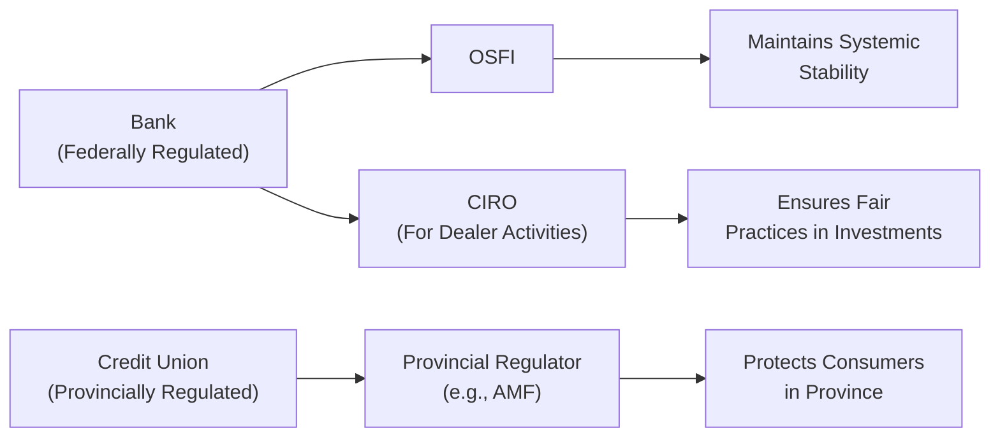
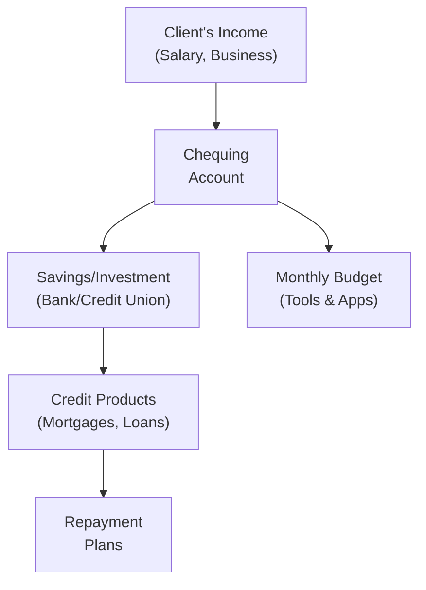

## 2.4 The Role of Financial Institutions

If you’ve ever deposited a paycheque, purchased insurance, or applied for a mortgage, you’ve engaged with a financial institution. It’s kind of amazing how these organizations—like banks, credit unions, and trust companies—are deeply woven into our everyday lives. But it can get confusing, right? Let’s break down who they are, what they do, and how you, as a financial advisor or an interested reader, can leverage their products and services in a responsible, efficient way.

### Types of Financial Institutions

Most of us have heard of banks, but there are several categories of financial institutions out there. They all serve different purposes, and each one has a special “flavour” that might be beneficial for different clients.

#### Banks
Banks are what we typically think of when we want to open a chequing account or deposit a paycheck. They offer:  
• Chequing and savings accounts  
• Personal loans and lines of credit  
• Mortgages  
• Investment products such as guaranteed investment certificates (GICs)  
• Credit cards and various fee-based banking services  

I remember once opening my very first chequing account as a teenager. The bank advisor gave me a bunch of finance pamphlets I barely understood, which made me realize how important it is for us to explain products in plain language. Banks are also the big players that set or follow the prime rate, which we’ll talk about later.  

#### Credit Unions
Credit unions are member-owned cooperatives. In other words, each account holder is actually a part owner of the institution. Credit unions:  
• Tend to focus on community-based lending and saving  
• May offer lower or more competitive rates and personal service than larger banks  
• Are regulated provincially (for example, the Autorité des marchés financiers (AMF) in Quebec)  

In many small towns, a local credit union might be the primary source of financial services. A friend of mine joined a credit union because her family liked the sense of community involvement—plus they got a fantastic rate on their car loan.

#### Trust Companies
Trust companies offer many of the same services as banks, but they also emphasize fiduciary and estate management services. These fiduciary services might include:  
• Acting as executor or trustee  
• Managing investments and assets on behalf of beneficiaries  
• Maintaining estate accounts and distributing estate assets  

It’s like having specialized help to ensure a client’s wealth is managed properly for future generations. If your clients have complex estate needs, a trust company could be the “go-to” partner for ensuring everything runs smoothly.

#### Insurance Companies
Insurance companies provide coverage products—like life or disability insurance—but they also deliver annuities (a guaranteed income stream) and certain investment-type products (like segregated funds). In the realm of budgeting, these companies can help manage risk. However, if the premiums are too high (or not well understood), they can also become a drain on someone’s monthly cash flow.  

### How Institutions Support Budgeting and Lending

Financial institutions can be our best friends or, at times, our biggest budget busters. Let’s face it, if we qualify for a big line of credit—sometimes the temptation is just too great. That’s why financial institutions have a responsibility to offer solutions that align with a person’s real needs and their actual ability to repay.

• Deposit Products: Chequing and savings accounts help manage daily expenses and set aside funds for rainy days.  
• Lending Products: Mortgages, lines of credit, credit cards, and personal loans can help finance major purchases—homes, cars, or even education.  
• Resource Tools: Many institutions now offer budgeting apps that track spending automatically. Some even provide “round-up” features to tuck away spare change into a savings account.  

A bigger mortgage might give you your dream house, but it also might leave you strapped for cash if you’re not careful. In our discussion about budgeting and consumer lending (see Section 2.1 to 2.3 for more context), it’s crucial to highlight that budgeting is the foundation. If a family overspends on credit-based products, they risk their financial stability.

### Regulatory Oversight

You might be thinking: “With so many different institutions, how do we keep everything in line?” Good question. Canada has a robust framework for financial regulation.

• CIRO (Canadian Investment Regulatory Organization): Currently oversees all investment dealers and mutual fund dealers. It emerged from the amalgamation of IIROC (Investment Industry Regulatory Organization of Canada) and the MFDA (Mutual Fund Dealers Association) back in 2023, so if you see references to IIROC or MFDA, remember those are now historical.  
• OSFI (Office of the Superintendent of Financial Institutions): Oversees federally regulated financial institutions—think big banks, trust companies, and insurance companies that operate across provinces. OSFI’s job is to maintain confidence in the Canadian financial system.  
• Provincial Regulators: Credit unions, for instance, fall under provincial oversight. In Quebec, the AMF (Autorité des marchés financiers) supervises caisses populaires (Francophone credit unions).  

If one of these institutions fails or faces insolvency, the Canadian Investor Protection Fund (CIPF) might protect client assets, but only if the institution is a member in good standing. Since CIPF is now Canada’s sole investor protection fund, clients can rest assured that investment assets at CIRO member firms have coverage if a firm becomes insolvent.

Want a quick look at how the different regulators interact? Check out the diagram below:

This diagram is a simplified representation, but it shows how the lines of responsibility flow from financial institutions to the regulators maintaining stability and consumer protection.

### Interest Rate Determination

Interest rates can be a bit of a mystery. You may see an advertised mortgage rate on TV, but behind it lies the Bank of Canada’s monetary policy decisions.

• Bank of Canada Policy Rate: The Bank of Canada sets a target for the overnight rate, which influences the prime rates at the big financial institutions.  
• Prime Rate: This is the rate banks charge their most creditworthy customers. Less creditworthy customers, or those who present higher lending risk, are typically charged prime plus some markup.  
• Operational Costs and Risk: Each financial institution has overhead costs—branches, staff, technology—and they must price their loans to cover those costs and remain profitable.  

If the Bank of Canada raises its policy rate, banks and other institutions will often increase their prime rates, which flows through to the interest rates on variable-rate mortgages, lines of credit, and other floating-rate products. That can have a direct effect on your budgeting decisions—if your line of credit interest rate goes up, so does your monthly payment (unless you reduce your principal).

### Advisor Responsibilities

As an advisor, you’re a guide in this wild, ever-changing realm of financial institutions. Clients look to you for clarity. Here are a few recommendations and best practices:

• Fee Structures: Banks might charge monthly account fees, per-transaction fees, ATM fees, and even inactivity fees. Advisors can clarify why these fees exist, how to minimize them, and whether the client can consider a cheaper alternative.  
• Product Options: It’s not just about the interest rate. Different institutions will have various perks—like no-fee e-transfers or a free safety deposit box. Show your clients how these can factor into broader planning.  
• Credit Terms: A line of credit at one financial institution might shine with a low promotional rate, but then jump up after six months. Make sure your clients read the fine print.  
• Suitability: Always match the client’s unique situation (income stability, savings goals, future plans) with the product. If you have a real estate investor who needs quick access to funds, a line of credit might make sense. For a retiree with stable income, maybe a low-fee no-frills mortgage is sufficient.  

It’s all about understanding what each financial institution does best, so you can pair your client with the right partner.

### Practical Examples and Case Studies

Nothing beats a story. Let’s walk through two brief examples to see how financial institutions come into play.

#### Case Study 1: A Young Professional Couple
Sam and Alex, both in their late 20s, want to buy a condo. They have stable jobs, modest savings, and no significant debt besides a car loan. They approach a bank:

• A mortgage specialist explains different financing options—variable vs. fixed.  
• The bank suggests a pre-approved mortgage amount, but Sam and Alex are aware (because they have a monthly budget) that the maximum mortgage might be more than they truly need.  
• They also open a joint chequing account to handle bills, plus a savings account that automatically takes a small cut from each paycheque for vacation savings.  

In this scenario, the bank provides crucial budgeting structures (the bill account, the vacation savings account) and the mortgage that sets them on the path of homeownership. As an advisor, you’d remind them to keep a watchful eye on interest rates and ensure that they don’t borrow more than they can comfortably repay.

#### Case Study 2: A Retiree with Complex Estate Needs
Morgan is a 70-year-old retiree with multiple properties, a sizable investment portfolio, and a desire to leave a structured inheritance to grandchildren. Morgan visits a trust company:

• The trust company sets up an estate account, ensuring that property titles, beneficiary designations, and trust structures are legally sound.  
• If Morgan becomes incapacitated, the trust company can step in as trustee to manage the assets responsibly.  
• They coordinate closely with Morgan’s financial advisor to ensure minimal disruption to the broader financial plan.  

Here, the trust company’s fiduciary services are the linchpin for preserving Morgan’s wealth legacy.

### Visualizing How Institutions Help in Budgeting and Lending

Below is a simplified diagram illustrating some ways financial institutions plug into the budgeting and lending process:

• Funds flow into the client’s accounts.  
• The client establishes a system for savings or investments.  
• The client accesses lending products when needed.  
• The cycle continues as the client repays and adjusts the budget along the way.

### Best Practices and Common Pitfalls

• Best Practice: Encourage automated saving. Sometimes, if we don’t see the money in our chequing, we’re less likely to spend it.  
• Pitfall: Overborrowing. A line of credit should not be treated as free cash. Overusing it can cause serious debt issues.  
• Best Practice: Shop around. Whether it’s a mortgage renewal or a new credit card, the rates and features can vary widely.  
• Pitfall: Ignoring fees. Accumulated monthly fees might seem small, but over years, they can eat into savings.  

### Glossary

• **CIRO (Canadian Investment Regulatory Organization):** Canada’s national self-regulatory body overseeing investment dealers and mutual fund dealers.  
• **OSFI (Office of the Superintendent of Financial Institutions):** Federal body responsible for regulating banks, insurance companies, and trust companies.  
• **Prime Rate:** The interest rate that financial institutions charge their best customers.  
• **Fiduciary Services:** Services where one party manages assets (or makes decisions) on behalf of another under a legal obligation of trust.  
• **Annuities:** Contracts from insurance companies guaranteeing a stream of payments for a specified term or for life.  
• **Credit Union:** A cooperative financial institution owned by its members.  
• **Bank of Canada:** Canada’s central bank, which influences interest rates through monetary policy.  
• **Caisses Populaires:** Francophone credit unions in Quebec, overseen by the AMF.  

### Additional Resources

If you want to dig deeper into the topics we’ve covered, here are some reputable sources:

• [Bank of Canada](https://www.bankofcanada.ca/) – For policy interest rate announcements, market data, and economic research.  
• [CIRO](https://www.ciro.ca) – For current regulations, investor protection, and guidelines on dealer conduct.  
• Provincial Regulators – Such as the [Autorité des marchés financiers (AMF)](https://lautorite.qc.ca/en/) in Quebec.  
• Credit Union Central of Canada – Offers guides and statistics about credit unions nationwide.  
• Shelagh Heffernan, “Modern Banking” – An academic text exploring global banking structures.  

As always, keep learning! Financial institutions are evolving with new technologies (mobile apps, AI-based analytics, and real-time budgeting tools). By understanding how these organizations operate, you can help your clients navigate the maze and set them up for financial success.

---

## Test Your Knowledge: Financial Institutions Quiz



### Which type of financial institution is known for offering fiduciary and estate management services alongside typical banking functions?

- [ ] Credit unions
- [ ] Insurance companies
- [x] Trust companies
- [ ] Investment dealers

> **Explanation:** Trust companies often provide specialized fiduciary and estate services, such as acting as an executor or trustee.

### Which of the following regulators is responsible for overseeing federally regulated financial institutions, such as national banks and insurance companies?

- [ ] Provincial regulators
- [x] OSFI
- [ ] CIRO
- [ ] Bank of Canada

> **Explanation:** OSFI (Office of the Superintendent of Financial Institutions) supervises federally regulated financial institutions in Canada.

### Which statement best describes how credit unions differ from banks?

- [x] They are member-owned cooperatives that reinvest profits in their local communities.
- [ ] They are primarily focused on insurance products.
- [ ] They cannot provide personal loans.
- [ ] They are regulated solely by OSFI.

> **Explanation:** Credit unions are member-owned cooperatives, often providing community-focused solutions, and are regulated at the provincial level rather than federally.

### What is the prime rate?

- [x] The interest rate financial institutions offer their most creditworthy customers.
- [ ] The lowest mortgage rate offered by credit unions.
- [ ] The highest rate the Bank of Canada permits on government bonds.
- [ ] The final interest rate on a loan after all adjustments.

> **Explanation:** The prime rate is typically the baseline rate banks charge their best customers, and many other variable rates are set at prime plus or minus a certain percentage.

### Which of the following is TRUE about the Canadian Investment Regulatory Organization (CIRO)?

- [x] It oversees investment dealers and mutual fund dealers nationwide.
- [ ] It directly regulates all Canadian credit unions.
- [x] It is the result of an amalgamation of IIROC and MFDA in 2023.
- [ ] It manages provincial banking functions such as deposit insurance.

> **Explanation:** CIRO now regulates both investment dealers and mutual fund dealers, replacing the former IIROC and MFDA, which have been retired as separate self-regulatory organizations.

### Why might an advisor suggest a trust company to a client with complex estate needs?

- [x] Trust companies offer specialized fiduciary services and can manage assets on behalf of beneficiaries.
- [ ] Trust companies normally waive all fees for estate services.
- [ ] Trust companies only handle simple bank accounts and GICs.
- [ ] Trust companies provide specialized insurance services.

> **Explanation:** For complex estates, trust companies can serve as executor, manage assets, and distribute funds according to legal and fiduciary obligations.

### Which scenario indicates a best practice for budgeting with financial institutions?

- [x] Automating savings transfers from a chequing account to a savings account.
- [ ] Co-signing a loan for a friend with poor credit history.
- [x] Reviewing credit terms periodically to avoid hidden or increasing costs.
- [ ] Relying solely on a line of credit for day-to-day expenses.

> **Explanation:** Automating savings and regularly reviewing credit terms ensure that clients mitigate fees and interest hikes. Relying heavily on credit is generally considered a pitfall.

### How does the Bank of Canada influence the interest rates set by financial institutions?

- [x] Through its policy rate, which affects the prime rates banks use.
- [ ] By directly setting all mortgage rates.
- [ ] By dictating the specific interest rates each bank must charge.
- [ ] By only monitoring currency exchange rates.

> **Explanation:** The Bank of Canada sets a target for the overnight rate, influencing the prime rates used by banks for lending.

### Which statement about credit unions is correct?

- [x] They often provide community-focused lending and saving solutions.
- [ ] They form part of the federal regulatory system through OSFI.
- [ ] They are primarily investment dealers serving large corporations.
- [ ] They do not offer basic chequing or savings accounts.

> **Explanation:** Credit unions are community-based, member-owned institutions providing a range of deposit and lending services, regulated at the provincial level.

### Canada’s sole investor protection fund as of 2023 is:

- [x] CIPF
- [ ] MFDA IPC
- [ ] CDIC
- [ ] IIROC’s Insurance Fund

> **Explanation:** As of January 1, 2023, the Canadian Investor Protection Fund (CIPF) is the sole investor protection fund, following the merger of CIPF and the MFDA IPC.


