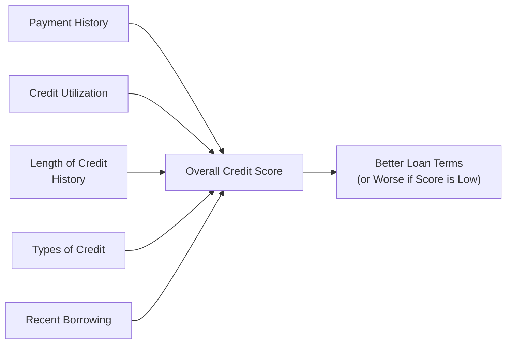

## 2.5 Credit Fundamentals

Have you ever wondered why everyone keeps talking about "building good credit"? I used to ask myself the same question when I got my first credit card back in college. It felt so powerful—swipe, purchase, sign, and worry about it later. But it wasn’t until I tried getting a car loan that reality sank in: financial institutions will judge my “creditworthiness,” which practically determines if I can borrow money easily and how much I’ll pay in interest. So, yeah, credit matters. Let’s figure out why.

Credit is essentially the ability to access money (or goods and services) now, based on a promise you’ll pay it back later. This extension of trust makes our financial world turn—imagine trying to purchase a house without a mortgage or a car without a loan. Credit is also pivotal when you need funds to handle unexpected expenses that pop up. When used responsibly, credit can be a powerful ally. Abused or misunderstood, however, it can become a heavy financial burden. So, let's really dig into the nitty-gritty of credit fundamentals.

### The Importance of Credit

Credit isn't just about buying big-ticket items, like a home or a car—though that’s a huge part of it. It also affects everyday events that might surprise you:

• Getting a cell phone plan.  
• Renting an apartment.  
• Applying for certain jobs (some employers run a credit check).  
• Setting up utilities without large deposits.  

But let's be real here: mistakes happen. We might rack up a credit card balance over the holidays or miss a couple of payments if life gets hectic. That’s why it’s crucial to know how credit works and how to fix or maintain it. If you keep track of your borrowing and repayment habits, you can establish a strong credit profile that saves you loads of money in interest and fees over your lifetime.

#### A Quick Personal Anecdote on Consequences

A few years back, I forgot to update my autobill payment after switching banks (yes, it was a total facepalm moment). My credit card bill went unpaid for two months, and it took my credit score on a slight detour. I quickly fixed it, but that brief slip taught me how sensitive (and important) credit history reporting can be. In short: ignoring credit can cost you.

### Types of Credit

Credit often comes in different shapes and sizes. Two major categories you’ll come across are revolving credit and installment credit. Understanding these will help you tailor your borrowing strategy to best fit your needs.

#### Revolving Credit

Revolving credit is like a reusable supply of funds you can tap into as needed—credit cards and lines of credit are prime examples. The lender sets a credit limit, and you can borrow against it repeatedly. Each time you make a purchase or withdraw, you use part of your available limit. As you pay down the balance, your credit limit frees up. But watch out: revolving credit usually carries higher interest rates, especially on credit cards. If you don’t pay off your balance on time, it can snowball into a hefty financial burden.

A personal line of credit can be a lifesaver for unexpected emergencies, like car repairs or a broken furnace. You only pay interest on the amount you actually use. But again, the convenience can be a double-edged sword if you’re tempted to overspend and not repay promptly.

#### Installment Credit

Installment credit covers loans that you pay back in regular, fixed installments over a set term. Think car loans, personal loans, or even mortgages (which are a specialized form of installment financing, though we explore mortgages in detail elsewhere in this course). For installment credit:

• You borrow a lump sum upfront.  
• Repayment happens in fixed amounts (including principal and interest) over months or years.  
• Once it’s repaid, the loan is done.  

This type of credit can be comforting because you know exactly how much you owe and when you’ll be debt-free, assuming you make all payments on time. The interest rates on installment credit are often lower than typical credit card rates, especially if the loan is secured by collateral (like a house or a car).

### Factors Influencing Creditworthiness

Okay, so how do lenders decide if they’ll trust you with a loan or credit card? In Canada, creditworthiness is often captured by your credit score and credit report, which summarize how you've managed your borrowing in the past. Here are the big factors:

• Payment History: This is about how consistently and on time you make your debt payments. Late payments or defaults drag your score down.  
• Credit Utilization: This ratio measures how much of your available credit you’re using at any given time. High utilization (e.g., maxing out your cards) can signal a risk to lenders.  
• Credit History Length: The longer your history of responsible credit usage, the better. That’s why closing old credit accounts might adversely affect your score, even if you don’t need them anymore.  
• Types of Credit: A healthy mix of revolving credit (credit cards, lines of credit) and installment credit (loans) demonstrates that you can handle different forms of borrowing.  
• Recent Borrowing: Opening multiple new accounts in a short period can trigger alarms. Lenders see this as “credit seeking” behavior that might signal financial stress.  

In Canada, credit scores often range from around 300 to 900. A higher score generally means better interest rates and loan terms. Many lenders consider the good-to-excellent range to start around 700, but each institution has its own thresholds.

#### A Mermaid Diagram of Credit Score Components

Below is a simple Mermaid flowchart that illustrates how various credit factors lead to your overall credit score—and then influence loan terms:

The flow starts with your behaviors—payment history, utilization, credit length, types of credit, and recent borrowing—and ends with the practical outcome: the loan terms that lenders extend to you. Keep those behaviors in check, and you’ll usually see more favorable offers.

### Understanding Equifax, TransUnion, and More

Canada’s two major credit bureaus, Equifax and TransUnion, collect information about your borrowing habits. They gather data from banks, credit card issuers, retailers, and other lenders to prepare credit reports. These reports show:

• How many credit accounts you have open.  
• Whether you pay on time.  
• How much you owe.  
• Any late or missed payments, bankruptcies, and more.  

Both bureaus use somewhat different scoring models, so your score may vary between them. It’s a good idea to check in with both at least once a year. Not only can you detect inaccuracies—like an old loan listed as still active—but you can also spot signs of identity theft or credit card fraud early on. The Financial Consumer Agency of Canada (FCAC) provides guidance on how to dispute errors in your credit report. If you suspect fraudulent activity, address it immediately.

### Advisor Guidance

Imagine you’re the financial advisor in this scenario. Your role? Empower your clients by explaining basic credit concepts and encouraging responsible use of credit. Here’s what that might look like in practice:

• Discuss the true cost of borrowing, including annual percentage rates (APR) and any additional fees. Many people get stuck on the “interest rate” without considering annual fees or other service charges.  
• Encourage on-time payments. Emphasize setting up automatic bill payments or reminders in the calendar to avoid missed payments.  
• Help clients rein in high credit card balances. Sometimes, consolidating debt into a lower-interest loan or line of credit can significantly cut down total interest paid.  
• Remind clients to maintain reasonable credit utilization—ideally no more than 30% of the available credit limit. Going beyond that threshold can harm credit scores.  
• Explain the perk of having a longer credit history. If your client is thinking about closing an old credit card, have them consider the potential negative impact on their average credit age.  
• Highlight the importance of checking credit reports frequently—at least once or twice a year, or more if there’s suspicion of fraud.  

A golden rule: Don’t borrow more than you can comfortably repay. That might sound obvious, but it’s amazing how often credit can be misused when you see that brand-new gadget you “must” have. As an advisor, you can help shift that perspective from “can I get the credit?” to “can I afford the payments if my income changes or if unexpected expenses arise?”

#### APR Basics

When you see “APR,” it refers to the Annual Percentage Rate. It’s effectively the average annual cost of borrowing, including interest and specific fees, expressed as a percentage. For instance, if you borrow $1,000 at an APR of 19% on a credit card and pay it off over one year, you’ll pay roughly $190 in interest (excluding any compounding factors or extra fees). However, compounding can boost the real cost, so always compare the APR of different lenders to get a sense of your total financial commitment.

### Putting It All Together with an Example

Let’s look at a hypothetical scenario. Suppose you have a client, Ashley, who wants to purchase a new car. She’s considering:

• A line of credit with a variable APR of 8%.  
• A car loan at a fixed rate of 6%.  
• A credit card with a 19% APR.  

Ashley loves the idea of using her line of credit because it’s convenient and flexible. However, you compare total interest costs over a five-year period, and it turns out the fixed car loan saves her more money because its interest rate is lower and stable. Even better, it’s an installment loan, so it’s easier to keep track of progress and maintain discipline by paying a set amount every month. By showing her the math, you empower Ashley to see how even a few percentage points can drastically affect total costs over time.

### Additional Resources

• Equifax Canada:  
  [https://www.equifax.ca/](https://www.equifax.ca/)  
  Request free credit reports and investigate how they compile your data.

• TransUnion Canada:  
  [https://www.transunion.ca/](https://www.transunion.ca/)  
  Offers credit score monitoring, fraud alerts, and dispute assistance.

• Financial Consumer Agency of Canada (FCAC):  
  Provides resources on credit ratings, dispute processes, and general financial literacy tips for Canadian consumers.

• “Credit Secrets for Canadians” by Diane McCurdy:  
  This book goes into advanced strategies (and simple tips) for building and maintaining a stellar credit profile.

• Open-Source Credit Monitoring Apps:  
  Some free apps let you track your credit score and full report more frequently—just verify privacy and security before signing up.

• Regulatory Note:  
  The Canadian Investment Regulatory Organization (CIRO) is the current national self-regulatory organization overseeing how registered dealers conduct their business. If you’re dealing with a financial advisor affiliated with a firm that’s CIRO-regulated, they should be well-informed about industry best practices regarding credit counseling, debt management, or general consumer lending advice.

### Glossary

Credit Score  
A numerical representation of a borrower’s creditworthiness, typically ranging from 300 to 900 in Canada. The higher, the better.

Credit History  
A record of how you’ve managed debt obligations, including payment patterns, credit limits, and outstanding balances.

Credit Utilization  
The ratio that compares the amount of credit used to the total available credit limit. Keeping this ratio low is key to maintaining a healthy credit score.

Annual Percentage Rate (APR)  
The annualized cost of borrowing, including interest and applicable fees. This is the figure you want to compare when shopping for loans or credit cards.

Revolving Credit  
A type of credit you can use repeatedly, up to your established limit. You only pay interest on the portion you actually use.

Installment Loan  
A loan you pay back at regular intervals over a predetermined period. The interest rate can be fixed or variable, depending on the product.

Credit Bureau  
An organization that gathers and researches individual credit information. In Canada, Equifax and TransUnion are the two big players.

Credit Limit  
The maximum amount of credit extended to you by a lender. Going near or over your limit can harm your credit score and trigger penalties.

---

Overall, building strong credit is simpler than it seems: pay your bills on time, keep balances in check, borrow only what you need, and keep an eye on your credit reports. That’s basically it—but of course, life’s full of surprises that can put even the best-laid financial plans off track. The good news is, as you move forward with knowledge and discipline, you’ll be well-placed to secure better interest rates, access more borrowing options, and achieve your financial goals on your own terms.  

And let’s be honest: it’s nice to have lenders competing to give you a good deal rather than the other way around.

## Test Your Knowledge: Credit Fundamentals Quiz



### Which of the following best describes credit utilization?

- [ ] The process of repeatedly using credit up to its limit
- [x] The ratio of credit used to total credit available
- [ ] The total amount of credit you can apply for in a given period
- [ ] The fee structure for a line of credit

> **Explanation:** Credit utilization specifically measures how much credit you’re using out of your total available credit. Lenders often prefer this ratio to be below 30%.

### A good credit score generally results in:

- [x] Lower interest rates on loans
- [ ] Higher monthly loan payments
- [ ] A smaller credit limit
- [ ] Automatically approved credit line increases

> **Explanation:** Lenders reward higher credit scores with lower interest rates and better terms because you’re deemed less risky.

### What is the primary difference between revolving credit and installment credit?

- [x] Revolving credit can be used multiple times up to a limit; installment credit has fixed payments for a set term
- [ ] Revolving credit always offers lower interest rates, while installment credit always has higher rates
- [ ] Revolving credit is not reported to credit bureaus
- [ ] Installment credit has no fixed payment schedule

> **Explanation:** Revolving credit allows you to draw from a credit limit over and over, whereas installment credit involves a one-time lump sum with fixed payments.

### Equifax and TransUnion in Canada:

- [x] Are two major credit bureaus that compile individual credit information
- [ ] Are government agencies that control mortgage rates
- [ ] Provide guaranteed fixed interest rates for borrowers
- [ ] Do not allow consumers to see their own credit reports

> **Explanation:** Equifax and TransUnion collect and organize credit data into credit reports. They also provide credit scores based on this information.

### Which factor most directly impacts your credit score?

- [x] Payment history on loans and credit cards
- [ ] The type of car you drive
- [x] How much of your available credit limit you’re using
- [ ] The kind of job you have

> **Explanation:** Payment history and credit utilization are major components that significantly influence your credit score.

### What does APR stand for?

- [x] Annual Percentage Rate
- [ ] Average Payment Rate
- [ ] Annual Principal Repayment
- [ ] Adjustable Principal Rate

> **Explanation:** APR stands for Annual Percentage Rate, which indicates the annualized cost of borrowing, including interest and fees.

### Why might an installment loan be preferable to a credit card for a large purchase?

- [x] It often has a lower, fixed interest rate
- [ ] It never requires a credit check
- [x] Payments are more predictable with fixed installments
- [ ] All installment loans come with rewards programs

> **Explanation:** Installment loans typically feature lower, often fixed, interest rates and a preset repayment schedule, making budgeting simpler.

### What is one thing a financial advisor should do regarding a client’s credit?

- [x] Explain interest rate calculations and advise on responsible use of credit
- [ ] Encourage the client to max out their credit cards
- [ ] Hide information about interest rates
- [ ] Tell the client that credit reports are unimportant

> **Explanation:** Advisors aim to empower clients with knowledge about how credit and interest rates work, helping them make responsible choices.

### A high credit utilization ratio (e.g., using 90% of an available limit) might:

- [x] Lower your credit score
- [ ] Improve your credit score substantially
- [ ] Have zero impact on your score
- [ ] Lead to an automatic interest rate reduction

> **Explanation:** Using most of your available credit can signal higher risk, which usually brings your credit score down.

### Revolving credit generally:

- [x] Can be used repeatedly up to the credit limit
- [ ] Must be repaid in fixed installments
- [ ] Expires once you pay it off
- [ ] Does not charge interest

> **Explanation:** Revolving credit (e.g., credit cards, lines of credit) allows you to borrow up to a certain limit repeatedly; interest is charged if a balance is carried forward.


