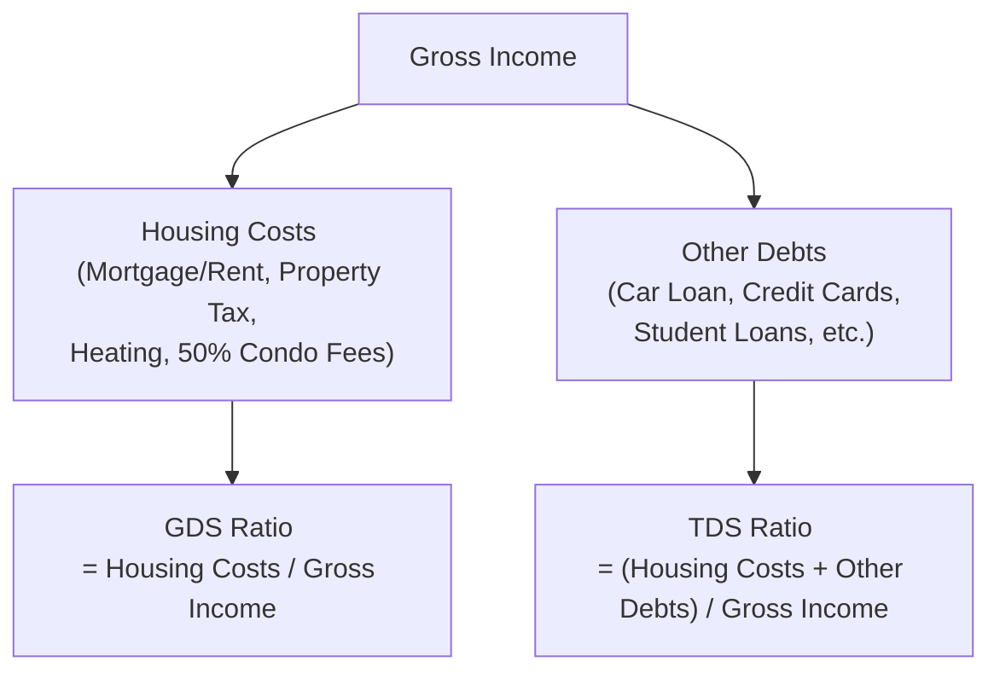

## 2.6 Debt Service Ratios

Debt Service Ratios (DSRs) are central to evaluating a client’s ability to manage their financial obligations—particularly their mortgage, rent, and other consumer loans. Maybe you’ve known a friend who bought a house without budgeting properly, only to be overwhelmed by monthly bills. That’s sort of the perfect example of why DSRs matter. If you’re looking for a systematic way to determine whether you, a client, or someone you know is heading for financial strain, DSRs are it. They provide a simple snapshot of how large a client’s debt repayment obligations are compared to their total income.  

Despite sounding technical, DSRs revolve around very basic mathematical principles. Lenders in Canada rely heavily on two main calculations:  
• The Gross Debt Service Ratio (GDS) – measuring housing-related expenses relative to gross income.  
• The Total Debt Service Ratio (TDS) – measuring all debt obligations relative to gross income.  

When GDS and TDS are well-managed, it usually means a more secure financial scenario for the borrower and easier approvals from lenders. Let’s take a deep dive into how these ratios are calculated, how lenders use them, what recommended thresholds look like, and how financial planners (like you or me) can guide clients who might be flirting with dangerous debt levels.

---
  
### Understanding Gross Debt Service Ratio (GDS)

The Gross Debt Service Ratio (GDS) measures the portion of your gross annual income dedicated solely to housing costs. These housing expenses typically include:  
• Mortgage or rent payments  
• Property taxes  
• Heating costs  
• 50% of condominium fees, if applicable  

Alright, let’s say you’re paying $2,000 per month for your mortgage (including principal and interest), $200 for property taxes, $100 for heating (like natural gas or electricity for keeping that place warm during winter), and $120 in monthly condo fees (of which we only include half: $60). That means your effective monthly housing cost is $2,000 + $200 + $100 + $60 = $2,360.  

If your gross monthly income is $6,000, the monthly GDS ratio is:

( $2,360 ÷ $6,000 ) × 100 = 39.3%

However, lenders and financial professionals often like to use annual figures, so you might see:

• Annual housing costs: $2,360 × 12 = $28,320  
• Gross annual income: $6,000 × 12 = $72,000  

Thus, the GDS ratio would be:

( $28,320 ÷ $72,000 ) × 100 ≈ 39.3%

It’s basically the same ratio, but some lenders prefer annual data for consistency.  

Many Canadian lenders rely on guidance from organizations such as the Canada Mortgage and Housing Corporation (CMHC). Don’t worry, we’ll talk more about recommended thresholds in just a bit.

---
  
### Understanding Total Debt Service Ratio (TDS)

While GDS focuses exclusively on housing-related debt, the Total Debt Service Ratio (TDS) looks at all monthly debt payments relative to gross annual income. It’s essentially everything:  
• Housing costs (mortgage, rent, taxes, heating, half condo fees)  
• Car loan or lease payments  
• Student loans  
• Credit card payments  
• Lines of credit  
• Other monthly obligations

TDS is often considered the more comprehensive gauge of a person’s real debt burden because it accounts for other responsibilities beyond just housing. If, for instance, you also have a $300 monthly car loan payment and pay $150 minimum on your credit card debts, your total monthly obligations might jump to $2,810. With the same $6,000 monthly gross income, your TDS ratio is:

( $2,810 ÷ $6,000 ) × 100 = 46.8%

Again, we can convert that to an annual calculation if we prefer.  

High TDS often signals a big risk to lenders. If a person is dedicating nearly half of their gross income to debt, it doesn’t leave much leeway for covering life’s other expenses—like groceries, child care, or building an emergency fund.

---
  
### Why Lenders Rely on Debt Service Ratios

If you’re like me, you might recall chatting with an over-enthusiastic friend who tried convincing you to buy property beyond your comfortable budget. “Don’t worry,” they’d say, “the bank will totally give you the mortgage!” The truth is, lenders weigh risk meticulously. They’re not just handing out mortgages; they’re investing in your ability to repay over the long haul.

• Lower DSRs = Lower lending risk. If the GDS or TDS is within recommended caps, lenders see it as a sign that you’re more likely to make those monthly payments without defaulting.  
• Higher DSRs = Elevated risk. When GDS or TDS is too high, the chance of debt trouble, default, or skipping payments is bigger.  

For Canadians, organizations like CMHC and the Financial Consumer Agency of Canada (FCAC) publish guidelines on recommended thresholds. Borrowers with DSRs below these thresholds are more likely to secure favorable loan terms, including interest rates and prepayment privileges.  

---

### Recommended GDS and TDS Limits

In practice, many lenders look for:  
• GDS ratio under approximately 32%  
• TDS ratio under approximately 40%  

These aren’t absolute lines in the sand—some lenders might have slightly stricter or looser criteria. For instance, a prime borrower with an excellent credit score might get away with hitting 42% TDS under special circumstances. But generally speaking, surpassing these levels indicates to lenders that a borrower’s finances might be too tight.

Keep in mind that these guidelines aren’t simply random. They’re influenced by historical data on mortgage defaults, consumer loan delinquencies, and overall economic conditions. The Canada Mortgage and Housing Corporation (CMHC) frequently updates its guidelines, so it’s worth checking their resources (https://www.cmhc-schl.gc.ca) to keep up with changes or new mortgage insurance benchmarks.

---
  
### Calculation Best Practices

So how do you actually calculate these ratios in real life? If you’re an advisor or a proactive client, accuracy is paramount. Here’s your best-practice checklist:

• Tally all relevant debts: Don’t forget about small monthly commitments like store credit cards, personal lines of credit, or even “buy now, pay later” plans.  
• Use consistent measurement periods: Convert everything to monthly or annual, then do the ratio. Mixing monthly for some data and annual for others can produce misleading results.  
• Convert variable payments to consistent estimates: If a client’s heating bill fluctuates across seasons, guess an average or weigh peak usage months. Same for property taxes if they’re paid in a lump-sum once a year.  
• Keep re-checking: Lifestyles change, interest rates go up or down, and new credit lines open. Debt service ratios are not a “set it and forget it” type of measurement.

---

### Potential Consequences of High Debt Service Ratios

When GDS or TDS is above recommended guidelines, or creeping dangerously close, it’s a major red flag for potential financial stress. Perhaps you know someone who can barely keep up with their minimum monthly payments. Maybe that’s you, hopefully not, but let’s consider the potential realities:

• Tighter monthly cash flow. If too much of your paycheque goes to debt, you’ll have a tough time paying for your daily groceries, let alone saving for emergencies.  
• Higher interest rates. A less favorable DSR might cause lenders to offer you a loan at a higher interest rate—if they agree to lend, that is.  
• Loan rejections. Lenders may simply refuse to issue new credit if they believe your TDS ratio is too high.  
• Risk of default. Ultimately, if you’re stretched too thin, missing a payment is way more likely. Defaulting not only damages your credit score but can shape your long-term financial trajectory.

---

### Strategies for Clients with High DSRs

Let’s say you’re an advisor and you see your client’s TDS ratio come out at 47%. That’s well above the 40% usual recommended threshold. The immediate question: “What do we do now?”  

1) Debt Consolidation:  
   • Rolling multiple high-interest debts into one lower-interest loan might reduce the overall monthly payment.  
   • Make sure to compare interest rates and account for possible setup fees.  

2) Expense Reductions:  
   • Sometimes trimming unnecessary spending is enough to bring DSRs to more comfortable levels.  
   • This can include lifestyle changes: simpler vacations, fewer restaurant meals, or renegotiating cable or phone bills.  

3) Income Increases:  
   • If expenses can’t be cut enough, consider ways to boost income: picking up side gigs, renting out a spare room (if it fits your living situation), or negotiating a raise.  

4) Refinancing Existing Loans:  
   • Extended amortization or different loan terms might reduce monthly obligations.  
   • Check if a lower interest rate or new loan terms can reduce overall monthly payments, though be mindful of potential penalties.  

5) Seek Professional Guidance:  
   • Don’t forget that a licensed financial professional can offer tailored advice. Plus, they stay updated on new guidelines from the Canadian Investment Regulatory Organization (CIRO) and resources from the Financial Consumer Agency of Canada (FCAC).

---

### Regulatory Considerations

It’s important to note that many references to the Mutual Fund Dealers Association of Canada (MFDA) or the Investment Industry Regulatory Organization of Canada (IIROC) are now historical. As of January 1, 2023, these organizations have amalgamated into a single self-regulatory organization known as the Canadian Investment Regulatory Organization (CIRO). Every advisor must refer to the guidelines and responsibilities set forth by CIRO (https://www.ciro.ca).  

Additionally, the Canadian Investor Protection Fund (CIPF) now stands as Canada’s sole investor protection fund after merging with the MFDA Investor Protection Corporation. CIPF’s role remains important in reassuring clients that if a member firm becomes insolvent, eligible client assets have coverage—it’s a vital part of maintaining confidence in Canadian capital markets.

When it comes to consumer lending, CIRO’s standards require advisors to thoroughly understand a client’s risk profile, including an assessment of their debt levels, which directly ties back to GDS and TDS. And it’s not just the SROs; the Financial Consumer Agency of Canada (FCAC) also encourages borrowers to understand their debt capacity before taking on new loans.

---

### Diagrams and Visual Aids

To help visualize the relationship between GDS and TDS, here’s a simple Mermaid diagram illustrating how these ratios sum up different monthly obligations:

• B references typical housing expenses that form the numerator for the GDS ratio.  
• C references all additional debts that combine with housing costs to form the TDS ratio.  
• Each ratio is divided by the Gross Income, found at the top of the diagram.

---

### Practical Example

Let’s run through a quick scenario to tie it all together:

• Monthly Income (gross): $8,500 (that’s $102,000 per year).  
• Mortgage Payment: $1,700/month.  
• Property Taxes: $300/month.  
• Heating Costs: $150/month.  
• 50% of Condo Fees: $100/month (assuming a $200 total fee).  
• Car Loan Payment: $400/month.  
• Credit Card Payment: $200/month.  

Step 1: Calculate GDS

1) Total monthly housing costs = $1,700 + $300 + $150 + $100 = $2,250.  
2) Gross monthly income = $8,500.  
3) GDS ratio = $2,250 ÷ $8,500 = 0.2647 (26.47%).  

Step 2: Calculate TDS

1) All monthly debts = $2,250 (housing) + $400 (car) + $200 (credit cards) = $2,850.  
2) TDS ratio = $2,850 ÷ $8,500 = 0.3353 (33.53%).  

Both GDS (around 26%) and TDS (around 34%) are quite comfortably below standard thresholds. A lender would likely see this client as low-to-moderate risk.

---

### Advisor Action Steps

• Educate Clients on Debt Service Ratios: Clients don’t always realize that new car payments or credit card balances can push them into risk territory. Show them the math!  
• Watch for Red Flags: If a client’s GDS or TDS breaks 32% or 40% respectively, talk about strategies—maybe an expense elimination project or seeking out second income streams.  
• Leverage Online Tools: The Government of Canada’s Mortgage Affordability Calculator is a popular open-source tool that can help clients experiment with different interest rates and monthly payments.  
• Stay Current with Regulations: CIRO may periodically update best practices, so keep an eye on (https://www.ciro.ca) for any changes that might affect how you counsel clients.  
• Partner With Other Professionals: For complex situations, consider engaging mortgage brokers, credit counselors, or accountants to create a stronger, more holistic plan for your client.

---

### Real-World Anecdote

I remember working with a young couple—call them Carmen and Ron—who wanted to buy a condo downtown. They had decent salaries, but also a car loan, student loans, and big living expenses. When I ran their TDS, it came out around 46%. They were shocked. “We had no idea our monthly payments were so high,” they said. By eliminating a few unnecessary luxuries and postponing major purchases, they brought their TDS ratio closer to 38% within six months. This allowed them to qualify for a better mortgage rate, and eventually, they snagged their dream condo without feeling suffocated by monthly bills.

---

### Glossary

• **Gross Debt Service Ratio (GDS)**: The portion of a borrower’s gross income required for mortgage or rent payments, property taxes, heating, and half of condominium fees.  
• **Total Debt Service Ratio (TDS)**: The portion of a borrower’s gross income used to service all debt obligations, including housing and non-housing debts.  
• **Debt Consolidation**: Combining multiple debts into one (often with a lower overall interest rate or simplified payment structure).  
• **Financial Stress**: A condition where debt payments exceed a comfortable portion of a borrower’s income, putting them at risk of missing bills or depleting savings.  
• **Risk Profile**: An assessment of a borrower’s propensity to default, based on factors like DSRs, credit history, and income stability.  
• **Default**: Failure to meet the legal obligations (or conditions) of a loan, like missing the due payments.  
• **Housing Expenses**: Costs associated with owning or renting a home (e.g., mortgage payments, rent, property tax, utility bills).  
• **Condominium Fees**: Monthly fees for the upkeep of shared spaces in a condo (e.g., hallways, gyms, pools, or parking garages). Typically, only 50% is counted toward GDS and TDS calculations.

---

### References and Further Reading

• [Canada Mortgage and Housing Corporation (CMHC)](https://www.cmhc-schl.gc.ca) – Offers detailed guidelines on mortgage qualification, GDS, TDS, and insurance.  
• [CIRO](https://www.ciro.ca) – Canada’s current self-regulatory organization that oversees industry standards and best practices.  
• [Financial Consumer Agency of Canada (FCAC)](https://www.canada.ca/en/financial-consumer-agency.html) – Provides iterations of debt ratio calculators, debt management tips, and consumer education.  
• [Government of Canada Mortgage Affordability Calculator](https://www.cmhc-schl.gc.ca/en/finance-and-investing/mortgage-loan-insurance/homebuying-calculators) – Handy tool for personal budgeting and mortgage estimates.

---
  
## Debt Service Ratios Mastery Quiz



### 1. Which of the following monthly expenses is included in the calculation of Gross Debt Service Ratio (GDS)?  
- [x] Property taxes  
- [ ] Auto insurance  
- [ ] Medical bills  
- [ ] Cell phone bills  

> **Explanation:** GDS is based on mortgage or rent, property taxes, heating costs, and half of condominium fees.

### 2. The Total Debt Service Ratio (TDS) typically includes which types of obligations?  
- [x] Mortgage, car payments, and credit card debts  
- [ ] Only mortgage and property taxes  
- [ ] Student loans but not lines of credit  
- [ ] None of the above  

> **Explanation:** TDS includes all significant monthly debt obligations (both housing and non-housing).

### 3. A recommended TDS threshold for most Canadian lenders is:  
- [ ] 25%  
- [ ] 32%  
- [x] 40%  
- [ ] 45%  

> **Explanation:** Many lenders suggest a TDS of no more than 40%.

### 4. A client has housing costs of $2,400 per month, plus a monthly car payment of $300 and a credit card payment of $200. Their gross monthly income is $7,000. What is their TDS ratio?  
- [ ] 30%  
- [ ] 35%  
- [x] 41%  
- [ ] 27%  

> **Explanation:** ( ($2,400+$300+$200) ÷ $7,000 ) × 100 = 41%.

### 5. If a person’s GDS ratio is already high, which of the following strategies might help them reduce it?  
- [x] Refinancing their mortgage at a lower interest rate  
- [ ] Increasing their retirement contributions  
- [x] Reducing monthly spending on housing or related costs  
- [ ] Ignoring the debt ratio until it declines on its own  

> **Explanation:** Lowering interest costs or cutting housing expenses can reduce DSRs; ignoring the problem doesn’t correct it.

### 6. Which organization currently oversees investment dealers and mutual fund dealers in Canada for regulatory compliance?  
- [x] CIRO  
- [ ] MFDA  
- [ ] IIROC  
- [ ] CIPF  

> **Explanation:** As of January 1, 2023, the MFDA and IIROC have been consolidated into CIRO.

### 7. Debt Consolidation is designed to:  
- [x] Combine multiple debts into a single debt, often at a lower interest rate  
- [ ] Increase the total number of debts a client has  
- [x] Simplify debt repayments into one monthly bill  
- [ ] Hide a borrower’s debt from credit reports  

> **Explanation:** Consolidation streamlines debt into (hopefully) one manageable payment—no magic hiding of debt is involved.

### 8. Which ratio focuses strictly on housing-related expenses?  
- [x] Gross Debt Service Ratio (GDS)  
- [ ] Total Debt Service Ratio (TDS)  
- [ ] Debt Consolidation Ratio (DCR)  
- [ ] Loan-to-Value Ratio (LTV)  

> **Explanation:** GDS is the measure that includes mortgage or rent, property taxes, heating, and half of condo fees.

### 9. Amounts for which of the following can significantly affect TDS calculations if overlooked?  
- [x] Credit card balances  
- [ ] Gross salaries  
- [ ] Employer’s tax deductions at source  
- [ ] Vacation days  

> **Explanation:** Credit card payments are a common form of non-housing debt. Overlooking them understates your real TDS.

### 10. True or False: A DSR exceeding recommended thresholds always means a borrower will be denied new credit.  
- [x] True  
- [ ] False  

> **Explanation:** In most situations, lenders are cautious and may deny credit. However, some lenders might still work through alternative programs or require other conditions for approval.


