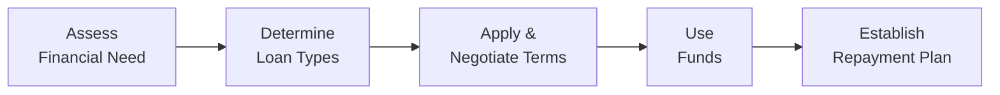

## 2.7 Personal Borrowing Options

Sometimes, we get a little nervous about borrowing—like that sweaty-palm feeling you get when you think you've got more month left than money. But personal borrowing can be a powerful financial tool when used responsibly. It can help folks reach important life goals, such as buying a car to get to that new job, financing a child's education, or consolidating high-interest debt into a more manageable structure. So let’s explore the ins and outs of personal borrowing options.

---
### The Role of Personal Borrowing in Financial Planning

When we talk about personal borrowing, we’re referring to funds that individuals borrow for personal use—credit cards, personal loans, car loans, lines of credit, and so on. It’s totally crucial in the context of financial planning because it ties directly into budgeting (see sections 2.1 through 2.3) and debt service ratios (see section 2.6). If we manage our debts responsibly, they can help us build a stable financial future. But if we overextend ourselves, well, that can lead to a crazy amount of stress and long-term problems.

Here’s a quick five-step diagram to visualize the typical borrowing process from a personal finance perspective:

• A["Assess  Financial Need"]: Identify the reason for borrowing (e.g., purchase a car, consolidate debt).  
• B["Determine  Loan Types"]: Choose from secured, unsecured, lines of credit, etc.  
• C["Apply &  Negotiate Terms"]: Submit application and negotiate rates.  
• D["Use  Funds"]: Actually spend or invest the borrowed money.  
• E["Establish  Repayment Plan"]: Budget for payments to stay on track.

Anyway, let’s get into the specifics of each major form of personal borrowing!

---
### Secured Loans

Secured loans are backed by collateral. In plain language, that means you promise something valuable—like your house, your car, or another substantial asset—to the lender. If you don’t or can’t pay them back, they have the right to seize that collateral. That might sound scary, but offering collateral typically means the lender takes on less risk. That can lead to lower interest rates and better borrowing terms.

#### Common Examples
• Auto Loans: You pledge your vehicle as security. If you default, the lender can repossess the car.  
• Home Equity Loans or HELOCs (see more under Lines of Credit): You put up your home equity to get a loan or line of credit.

#### Pros and Cons
Pros:
• Lower interest rates compared to unsecured loans  
• Easier approval if you have imperfect credit

Cons:
• You risk losing your collateral  
• There might be added legal or administrative fees if you default

Imagine you buy a car with a secured loan. You’re excited about your new wheels, but keep in mind that if you suddenly lose your job or run into other cash flow issues and can’t pay the car loan, the lender might repossess your vehicle. That’s a hefty price to pay. But if you maintain consistent payment habits, you might get a better interest rate than if you’d tried an unsecured approach.

---
### Unsecured Loans

If you go the unsecured route, the lender doesn’t require collateral. Because they can’t seize your property if you fail to pay back the debt, they may charge higher interest rates or demand a stronger credit score to compensate for their higher risk.

#### Typical Uses
• Debt consolidation (we’ll talk more about that in a bit)  
• Education loans (some can be partially secured, partially unsecured)  
• Medical expenses or other personal needs

#### Pros and Cons
Pros:
• No collateral involved—your assets are safe from direct seizure in case of default  
• Often less paperwork than secured loans

Cons:
• Higher interest rates  
• Requires solid creditworthiness to qualify for better rates

Unsecured loans can come from banks, credit unions, or alternative lenders. By the way, if your credit score is too low to get a decent interest rate, you might consider working on improving your credit before plunging into an unsecured loan. In section 2.3, we discussed ways to strengthen budgeting and savings, which can help you avoid high-cost borrowing.

---
### Lines of Credit

A line of credit (LOC) is a flexible way to borrow. Instead of getting a lump sum upfront, you’re approved for a maximum borrowing limit. You can tap into these funds as needed and only pay interest on the outstanding balance—basically, it’s like having a financial safety net. Let’s detail two major forms:

#### Personal Lines of Credit
Personal lines of credit are typically unsecured. The bank says something like, “You have a $10,000 limit. You can pull out money as you need it, up to that $10,000.” You pay interest on whatever portion you’ve used. You might pay interest-only monthly or have minimum payments.

#### Home Equity Lines of Credit (HELOCs)
A HELOC is secured because it uses the equity in your home as collateral. A HELOC generally has a lower interest rate than an unsecured personal line of credit. It’s also great for folks who need repeated access to cash—like if you’re renovating your house in stages or investing in short bursts.

#### Pros and Cons
Pros:
• Revolving credit—great for irregular or intermittent cash needs  
• Pay interest only on what you actually use  
• Often lower rates than a standard credit card

Cons:
• If secured by your home, you’re putting that home at risk  
• Variable interest rates can fluctuate

I had a friend who used a HELOC for a major kitchen renovation. She only drew down the amount she needed for each stage—no big chunk of interest piling up on unneeded funds. That was neat. But if she had defaulted, the bank could force a sale of her house to recover what she owed, so the risk is real.

---
### Credit Cards

We often joke that a credit card can feel like magical plastic (or metal) that buys you anything you want without immediate cost. But carrying a balance from month to month comes with some of the highest consumer interest rates out there.

#### Key Features
• Handy for everyday shopping or short-term financing  
• Revolving credit limit that resets as you pay down the balance  
• Possible rewards or points, but any “free travel miles” will lose their shine fast if you let your balance balloon and start paying 20%+ in interest

#### Watch Out for:
• Annual fees, especially on premium reward cards  
• Cash advance fees (often at even higher interest rates)  
• The temptation to overspend, because that “Tap and Go” convenience is so darn easy

Some folks like to use their credit cards to collect reward points or cash back, then pay the entire balance each month to avoid interest charges. That’s a good strategy in theory—if you really trust yourself to pay off the full amount by the due date. In section 2.6 (Debt Service Ratios), we learned that credit card debt can quickly sabotage your financial ratios if you’re not careful.

---
### Payday Loans and Alternative Lenders

Ah, payday loans. The ones we usually see in neon signs at strip malls. They’re there for those moments when you’re super desperate—like you need rent money tomorrow or your car broke down and you have to tow it in for repairs. But they also tend to have eye-popping interest rates and hefty fees.

#### Why They’re a Last Resort
• Extremely high interest rates—well above typical credit cards  
• Can trap borrowers in a cycle of “renewal” fees and interest if not repaid quickly  
• Typically need proof of employment, but not much else

#### Alternative Lenders
Beyond payday lenders, the “alternative lender” space includes online loans, peer-to-peer platforms, and private microfinance outlets. They can be beneficial in some circumstances, especially if you have a low credit score and can’t get bank financing. But be prepared for more expensive terms.

Provincial authorities heavily regulate payday lending, capping the maximum fees that can be charged for each $100 borrowed and limiting “rollovers” or repeated reborrowing. If you step into a payday loan store, be fully aware of your payment schedule and the total cost you’re expected to pay back.

---
### Debt Consolidation Loans

Debt consolidation means combining multiple debts—like credit cards, lines of credit, or smaller personal loans—into one new loan. Suppose you’ve got three credit cards: a standard one at 19%, a store card at 23.9%, and a balance on a line of credit at 10%. If you consolidate all that into a single loan at, say, 10–12%, you might lower your overall interest cost. Plus, it streamlines your monthly payment obligations into just one.

#### Advantages
• Potentially lower your interest rate  
• Simplify bill management  
• Can improve cash flow if the monthly consolidated payment is less than the sum of the old payments

#### Considerations
• Need good enough credit to qualify for a beneficial interest rate  
• Might require collateral, depending on loan type  
• If not used carefully, you risk running your credit cards back up—making your situation worse

A friend of mine used a debt consolidation strategy to pay off her credit cards and personal line of credit. Guess what happened a year later? She maxed out her credit cards again, effectively doubling her debt load. So if you consolidate, that’s a great step—but only if you also address the spending patterns or life circumstances that got you in trouble to begin with.

---
### Regulatory and Compliance Considerations

Now, let’s talk about the regulatory environment in Canada. This is pretty important for all personal borrowing. Primarily, your biggest lenders will be banks and credit unions, all regulated federally by the Bank Act or provincially for smaller institutions. Credit unions in some provinces have their own rules, but they generally abide by the same consumer protection guidelines.

#### Provincial Legislation
• Each province sets maximum fees and interest rates for short-term lending (like payday loans).  
• Provincial Ministries of Consumer Services: They publish guidelines on fair lending practices, maximum allowable interest for payday loans, and more.

#### CIRO’s Oversight
Historically, the Mutual Fund Dealers Association (MFDA) and the Investment Industry Regulatory Organization of Canada (IIROC) oversaw dealers and advisors. After January 1, 2023, these organizations were amalgamated into the Canadian Investment Regulatory Organization (CIRO). Now, CIRO is Canada’s national self-regulatory body that oversees investment dealers, mutual fund dealers, and market integrity on Canada’s equity and debt marketplaces.

Financial advisors who discuss borrowing options with clients should always ensure their advice is in the client’s best interest, keep up to date on CIRO rules, and provide clear risk disclosure. So if your advisor is referencing “MFDA” or “IIROC” for compliance, remember that those are now defunct bodies. CIRO is the place to go for the latest guidelines and resources (https://www.ciro.ca).

#### CIPF for Investor Protection
Since January 1, 2023, the Canadian Investor Protection Fund (CIPF) is the only investor protection fund in Canada. While CIPF doesn’t specifically insure your borrowing, it exists to protect client assets when a member firm becomes insolvent. Although CIPF is separate from CIRO, they work together to protect investors.

---
### Best Practices and Common Pitfalls

Let’s highlight a few best practices to help keep you (or your clients) on track:

**Best Practices**  
• Compare interest rates and fees from multiple lenders. It’s like shopping for a new phone—you want the best deal, right?  
• Monitor your credit score. A stronger score can help you land better interest rates.  
• Borrow only what you really need. Just because you qualify for a $50,000 line of credit doesn’t mean you should max it out.  
• Align your repayment plan with your cash flow. Make sure your budgets (see 2.1–2.3) and debt service ratios (2.6) can handle the monthly obligation.

**Common Pitfalls**  
• Taking on more debt than you can handle. Easy credit can lead to big trouble if you overspend.  
• Carrying credit card balances at high interest for years. That can cost thousands more than originally borrowed.  
• Overlooking fees, like origination fees, annual fees, or prepayment penalties.  
• Borrowing from payday lenders or high-interest lenders without fully understanding the costs and consequences.

---
### Real-World Case Study: Consolidation Gone Right

I once met a couple—let’s call them Sam and Alex—who had accumulated about $25,000 in credit card debt split across four cards. They were drowning, paying hundreds per month just in interest. So they worked with a reputable financial institution to consolidate their debts into a single unsecured personal loan at 10%. This was way better than the average 19% they had been paying. By continuing their monthly payments and cutting back on discretionary spending (no more random online shopping sprees for a while!), they paid off the consolidated loan in about three-and-a-half years.

**Key Takeaways**  
• They slashed their interest costs.  
• They simplified their monthly payments.  
• They didn’t re-accumulate credit card debt.

This scenario is a shining example of how borrowing options, when used carefully, can provide real relief. But remember, consolidation only helps if you address the underlying habits that led to the debt. Otherwise, it’s like putting out a fire with water on one side while tossing lighter fluid on the other.

---
### Tools, Resources, and Further Reading

• **Canadian Bankers Association (CBA)** – (https://cba.ca). Offers consumer-friendly resources on credit, mortgages, and debt management.  
• **Financial Consumer Agency of Canada (FCAC)** – Great place to learn about comparing credit cards, lines of credit, and personal loans.  
• **Provincial Ministries of Consumer Services** – For region-specific regulations on payday loans, alternative lenders, and maximum interest rates.  
• **Credit Counselling Canada** – A non-profit that provides free or low-cost counseling for consumers in debt trouble.  
• **CIRO** – (https://www.ciro.ca). For compliance guidelines and important bulletins related to advisors’ regulatory obligations.  

Open-source tools often come in handy for financial planning. For example:  
• **Budgeting spreadsheets on GitHub** – Community-made templates to help you track your debt payments and figure out a debt snowball or avalanche strategy.  
• **Online calculators** from CBA, FCAC, or from open-source communities that let you compare interest costs between different borrowing options.

---
### Glossary

• **Secured Loan**: A loan requiring collateral to secure repayment.  
• **Unsecured Loan**: A loan granted without collateral, typically at higher rates.  
• **Collateral**: An asset pledged as security for a loan.  
• **HELOC**: Home Equity Line of Credit, a revolving line of credit secured by the equity in a home.  
• **Rewards Credit Card**: A credit card that offers benefits like points, miles, or cash back.  
• **Payday Loan**: A short-term, high-interest personal loan, often regulated by provincial payday lending laws.  
• **Debt Consolidation Loan**: A single loan used to pay off multiple existing debts.  
• **Alternative Lenders**: Non-traditional financial institutions offering loans, often at higher interest rates.

---
### Final Thoughts

Personal borrowing options can unlock opportunities, but they also carry risks. If used carefully—as part of a broader financial plan that respects budgeting, cash flow management, debt service ratios, and long-term goals—borrowing can be a powerful ally. If misused, it can create cycles of debt and financial stress. So the key is always going to be knowledge, discipline, and good planning. After all, financial well-being isn’t just about how much money you earn; it’s about how you manage and grow what you have.

That’s about it, folks. If you can remember to keep your borrowing straightforward, your interest costs manageable, and your eyes on the prize (like your bigger life goals—retirement, a home, or your kids’ education), then personal borrowing can be a friend rather than a foe. And if you ever feel stuck, your financial advisor, your local bank, and reputable tools and resources can help you map out the best path forward.

---

## Test Your Knowledge: Mastering Personal Borrowing Options



### Which of the following describes a secured loan?

- [x] A loan backed by collateral such as a house or car
- [ ] A loan with no interest for the first six months
- [ ] A loan approved without consideration of the borrower's credit history
- [ ] A loan guaranteed by the government

> **Explanation:** Secured loans are backed by tangible assets like homes or cars, making them less risky for lenders.

### What is the main advantage of a line of credit over a standard personal loan?

- [x] You only pay interest on the amount of credit you actually use
- [ ] You can use the line of credit for free
- [ ] The interest rate is always fixed and never changes
- [ ] There are no application requirements

> **Explanation:** A line of credit lets you borrow incrementally, paying interest only on what you've drawn, rather than on a fixed lump sum.

### Which of the following statements is true regarding credit cards?

- [x] They often have high interest rates if balances are carried month to month
- [ ] They never charge annual fees
- [ ] They require collateral for approval
- [ ] They cannot be used for online transactions

> **Explanation:** Credit cards commonly carry high interest rates if you don’t pay off the balance, making them an expensive form of borrowing.

### When is a payday loan most likely to be considered?

- [x] As a last resort when immediate funds are needed and no other options are available
- [ ] Whenever you want to earn additional loyalty rewards
- [ ] When your credit score is exceptional
- [ ] Only if you fully own your home

> **Explanation:** Payday loans are high-cost short-term loans. Regulators caution that they should only be used if absolutely necessary.

### Which of the following accurately describes a HELOC?

- [x] A revolving line of credit secured by the equity in your home
- [ ] A permanent fixed-rate loan with monthly installments
- [x] It often offers lower interest rates than unsecured credit
- [ ] A federally guaranteed student loan

> **Explanation:** A HELOC is a secured, revolving line of credit that usually comes with lower interest rates, given it’s backed by home equity.

### What is the primary purpose of a debt consolidation loan?

- [x] To combine multiple debts into one loan for easier management and potentially lower interest
- [ ] To create multiple repayment schedules for different creditors
- [ ] To eliminate the need for credit checks
- [ ] To remove the obligation of repaying underlying debts

> **Explanation:** Debt consolidation streamlines multiple debts into a single monthly payment, often at a lower interest rate.

### Which organization replaced both the MFDA and IIROC starting January 1, 2023?

- [x] CIRO
- [ ] CMHC
- [x] CIRO
- [ ] FINTRAC

> **Explanation:** The Mutual Fund Dealers Association (MFDA) and the Investment Industry Regulatory Organization of Canada (IIROC) amalgamated into the Canadian Investment Regulatory Organization (CIRO).

### What is one inherent risk of using a secured loan?

- [x] Loss of the collateral if you default
- [ ] No possible credit improvement
- [ ] Guaranteed unlimited credit line
- [ ] Automatic interest-free borrowing

> **Explanation:** Because secured loans are backed by collateral, the lender can seize the asset if you fail to repay.

### Why might an individual consider avoiding credit card debt?

- [x] Credit cards often charge high interest rates for carried balances
- [ ] Credit cards never offer any form of reward points
- [ ] Credit card debt is not regulated by the government
- [ ] Credit card debt cannot affect your credit score

> **Explanation:** Credit cards can charge very high interest rates if you hold a balance each month, making it costly.

### A personal line of credit is always more expensive than a credit card.

- [x] False
- [ ] True

> **Explanation:** Many personal lines of credit have lower interest rates than credit cards, and you pay interest only on the amount used.


