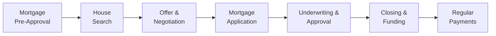

## 3.1 Mortgage Options

Buying a home in Canada can be... well, let’s just say it’s often one of the biggest financial decisions we’ll make in our lifetimes. There’s excitement, fear, hope, and, of course, this thing called a mortgage that we hear everyone talk about. A mortgage is essentially a loan secured by the property you’re buying—like a handshake deal, but with a lot more paperwork. In this section, we’ll walk through some of the most common mortgage options available in Canada, exploring how they differ, why they matter, and how you, as a financial advisor (or an interested reader), can guide clients or yourself to the right choice.

If you're already a pro in finance, this might be a refresher with a few new angles. If you’re brand new, let’s make it simple: mortgages are basically how everyday folks buy a house without emptying their bank accounts (or piggy banks) all at once. It’s a secure form of lending where the property acts as collateral for the lender. That’s why there’s so much talk about approvals, down payments, and insurance—nobody wants to lose a home due to misunderstandings or poor calculations. Let’s dive in, shall we?

### Understanding Mortgage Basics

A mortgage has three basic components: principal, interest, and amortization. Principal is the amount borrowed, while interest is essentially the cost of borrowing (paid to the lender). Amortization refers to how many years it’ll take to pay off the mortgage fully—commonly 25 years in Canada, though 30-year amortizations exist in certain circumstances. 

But there's more to your monthly payment than just principal and interest; it can include property taxes, and if you have a high-ratio mortgage, you may have mortgage default insurance premiums rolled in. Understanding these components is crucial before you even begin to compare different mortgage products.

### Types of Mortgages: Conventional vs. High-Ratio

Mortgages in Canada are often talked about in terms of "conventional" versus "high-ratio." 

• Conventional Mortgage:  
  - This is when the buyer makes a down payment of at least 20% of the home’s purchase price (or appraised value, whichever is lower).  
  - No mortgage default insurance is required here.  
  - The loan-to-value (LTV) ratio is 80% or lower, reflecting the mortgage as a maximum of 80% of the property value.  

• High-Ratio Mortgage:  
  - A down payment less than 20% means the LTV is higher than 80%.  
  - Mortgage default insurance is mandatory, providing protection to the lender if the borrower defaults.  
  - In Canada, mortgage insurance is typically provided by the Canada Mortgage and Housing Corporation (CMHC), Sagen (formerly Genworth), or Canada Guaranty.  

Why does this matter? Well, if you recall your earliest lemonade-stand lessons, the less equity you have in something, the greater the risk to the lender. Requiring insurance helps both the lender and the broader financial system. However, insurance costs can add to your monthly or overall mortgage payment, so factor that into your budget.

#### A Quick Look at LTV

In more formal terms, the Loan-to-Value ratio can be written as:


\text{LTV} = \frac{\text{Mortgage Amount}}{\text{Property Value}}


If LTV > 80%, it becomes a high-ratio mortgage and requires default insurance. Clients who have saved up a 20% or more down payment automatically reduce the LTV to 80% or less, qualifying for a conventional mortgage and potentially saving on insurance premiums.

### Choosing a Lender: Banks, Credit Unions, and Private Lenders

You might assume all mortgages come from the biggest banks—and historically, the "Big Five" Canadian banks are indeed major players. But there are plenty of other options, including credit unions and private lenders:

• Banks: Typically provide a wide variety of mortgage products and can bundle other services (like insurance or investment accounts). They usually have competitive rates but might have stricter requirements.  

• Credit Unions: These are member-owned financial cooperatives. They might offer more flexible lending criteria (helpful for people with unique financial situations, like the self-employed or those with bruised credit).  

• Private Lenders: Often come into play if traditional lenders turn you down or your needs are highly specialized. Private lenders may impose higher interest rates or more stringent terms to offset their higher perceived risk.  

From an advisor standpoint, it’s wise to help your clients understand the trade-offs—banks can be straightforward and well-resourced, but credit unions can be more community-minded and flexible. Private lenders might be the last resort if the borrower is otherwise unbankable, but can be a stepping stone if structured carefully.

### Fixed vs. Variable Rate Mortgages

Beyond the question of conventional versus high-ratio, borrowers need to choose between fixed and variable interest rates. Let’s explore the main differences:

• Fixed-Rate Mortgage:  
  - The interest rate stays the same throughout the term (for example, five years), so your monthly payments remain constant.  
  - This makes budgeting easier because you know exactly how much you pay each month.  
  - The downside? If market rates drop significantly, you’re still locked into the higher rate unless you break the mortgage (which might incur penalties).  

• Variable-Rate Mortgage:  
  - The interest rate fluctuates based on changes in a reference rate, often the prime rate.  
  - Monthly payments might stay the same, but the ratio of principal to interest in each payment can change; or the payments themselves can go up or down depending on the contract.  
  - In a falling rate environment, you might pay less interest. But in a rising rate environment, your payments could go up, making some borrowers nervous.  

In my opinion—um, I guess it’s more of a personal story—I once opted for a variable rate when rates were rock-bottom low. Sure, it felt a little risky, but it worked out in my favor that time around. However, friends who did the same during a rising rate cycle ended up paying more than they initially expected. So it depends on your comfort level with risk and the broader economic forecasts.

### Mortgage Pre-Approval

If you’re helping a client (or just yourself), it’s often recommended to get pre-approved for a mortgage before house-hunting. Mortgage pre-approval is basically the lender’s rough promise: “We’re likely able to lend you up to X dollars, subject to certain conditions.” Pre-approvals are incredibly handy because they:

• Give you a realistic budget for your house search.  
• Show sellers that you’re serious and can back up your offer.  
• Lock in an interest rate for a set time (often 90 to 120 days).  

Remember, a pre-approval is not a guarantee—it’s an estimate based on your current information. If your financial situation changes drastically (like you quit your job or buy a car with monthly payments), the actual mortgage approval might look different.  

### Term Lengths: Shorter vs. Longer Terms

In Canada, the mortgage term (commonly between six months and five years, though terms can be longer) is the period your interest rate agreement lasts, which is different from your overall amortization period. 

Why pick a short term (like one or two years)? You might anticipate rates to drop or believe your situation could significantly change (maybe you’ll move soon). But a short term can mean more frequent negotiations and possible rate fluctuations when you renew.

A longer term (like five years) gives you more stability—especially if you lock into a fixed rate—and can sometimes shield you from short-term interest rate spikes. The trade-off is you might be stuck with higher rates if the market rate falls significantly. 

### The Mortgage Stress Test

A quick tip about qualification: Canadian regulators introduced the mortgage stress test guidelines to ensure borrowers can handle higher rate scenarios. This means even if your actual rate is, say, 5%, you must qualify as though it’s higher (for instance, around 7% or 2% above the contract rate, whichever is higher—exact details can vary over time). 

Clients who had hoped to borrow up to $500,000 might see their limit dropped to $450,000 or less under the stress test. While it can be frustrating, it’s designed to prevent over-borrowing. In a rising interest rate environment, that cushion can save some borrowers from financial surprise.

### Mortgage Insurance (Default Insurance vs. Creditor Insurance)

Here’s one area that can get confusing: mortgage default insurance (often just called mortgage insurance) is different from creditor insurance on a mortgage. 

• Mortgage Default Insurance: Required on high-ratio mortgages (down payments under 20%). Protects the lender if the borrower defaults.  
• Creditor Insurance (like mortgage life insurance): Pays off (or pays down) the mortgage if the borrower dies or is otherwise unable to pay (for example, through serious disability).  

Under Canadian regulations, if you have less than a 20% down payment, you’ll likely require CMHC or another entity’s insurance coverage. That default insurance premium can be paid upfront or rolled into your monthly payments. Meanwhile, creditor insurance is optional but can be valuable. Some folks prefer private life insurance policies for potentially better coverage or rates. 

One big note: Be mindful of bank-offered creditor insurance, where the premium might be integrated into your mortgage payment. Always ensure you and your client read the fine print, confirm coverage, and compare it to other options. Also, regulators such as CIRO oversee how financial professionals discuss and sell creditor insurance. Make sure no pressure tactics are involved and that clients receive the proper disclosures.

### Prepayment Privileges

Okay, so you’ve nailed down your mortgage type, your rate, and your term—congrats. But keep an eye on prepayment privileges. These are the rules that let you pay off extra amounts ahead of schedule without penalty. For instance, your lender might allow you to put 10% or 20% of the original principal balance down each year in one lump sum. Another common method is to double-up on payments.

Why might this matter? Because any extra money you pay down early goes directly to the principal, decreasing the total interest you pay over the life of the mortgage. If you come into a sudden windfall—like a work bonus or an inheritance—these privileges help you pay off your mortgage faster, potentially saving thousands in interest. But watch out for the dreaded “prepayment penalty” if you exceed these privileges or break the mortgage early.

### Common Pitfalls and How to Avoid Them

• Overextending on Monthly Payments: Many Canadians, excited about home ownership, stretch themselves too thin. Remind clients (or yourself) to leave a buffer for emergencies, property taxes, insurance, and general living costs—rather than maxing out your mortgage approval limit.  

• Ignoring Rate Hikes: If you’re in a variable-rate mortgage, you need a plan for how you’ll handle rate increases. If a minor increase shakes your budget, you might need to reconsider your mortgage structure.  

• Not Reviewing the Mortgage Contract: Terms like “posted rate,” “prepayment penalty,” or “non-transferable mortgage” can cause confusion and cost money later. Encourage reading everything or consulting a lawyer or mortgage professional for clarity.  

• Relying on the Minimum Down Payment: That 5% baseline might seem like a dream scenario, but remember the default insurance cost. Sometimes waiting a bit longer to save for a 20% down payment can be more cost-effective over time.  

### Real-World Scenario: Rate Fluctuations

Imagine you have a variable-rate mortgage at 4.0%, and your monthly payment is manageable. The economy shifts, rates jump to 5.5%, and suddenly your monthly interest portion surges. Maybe you can’t handle that extra burden. If you can’t quickly pivot to a fixed rate or pay down a chunk of your principal, you might face serious challenges.

Alternatively, consider a friend who locked into a fixed rate for five years at 3.8%. Right in the middle of the term, the central bank drastically cuts rates, and new mortgage holders can grab loans at 2.5%. Your friend is stuck paying more. They could theoretically break the mortgage and refinance, but that might come with stiff penalties (thousands of dollars, in some cases).

### Diagram: Basic Mortgage Process

Below is a simple visual workflow of the mortgage process, from pre-approval right through to completing the purchase:

• A: Mortgage Pre-Approval helps you figure out your budget.  
• B: You find the ideal property within that budget.  
• C: You make an offer; if accepted, you move into the next stage.  
• D: You formalize the mortgage application with your chosen lender.  
• E: Lender underwrites the loan and, if successful, issues a final approval.  
• F: The mortgage is funded on the closing date—keys in hand!  
• G: Repayment begins, typically on a monthly, bi-weekly, or accelerated schedule.

### Client Suitability: Matching Mortgages to Goals

In practice, part of an advisor’s job is asking, “Does this mortgage setup align with your client’s or your own long-term plans?” If a client wants to be mortgage-free in 15 years, push them to consider more aggressive payment strategies or open mortgages offering extra flexibility. If a client is more concerned with stable, predictable payments, a longer-term fixed-rate mortgage might be the key.

### Stress Testing Your Mortgage

Let’s say your client can comfortably manage a $1,900 monthly payment at today’s rates. Encourage them to see if they can handle $2,300 or $2,400 monthly by setting aside that difference in a savings or emergency fund. If that extra chunk of money doesn’t pinch their lifestyle, it’s a good sign they can handle rate hikes. If it’s too tight, a variable rate mortgage might not be ideal.

### Regulatory Perspective

In Canada, mortgage lending is influenced by federal and provincial regulations. For instance:

• The Office of the Superintendent of Financial Institutions (OSFI) sets guidelines for federally regulated lenders, including stress test rules (often referred to as Guideline B-20 for residential mortgages).  
• Brokerages and individual advisors are overseen by CIRO (the Canadian Investment Regulatory Organization), formed by the amalgamation of the defunct MFDA and IIROC. CIRO ensures best practices for advisors who may provide mortgage-related advice alongside investment advice.  
• The Financial Consumer Agency of Canada (FCAC) ensures that consumers receive accurate information on financial products and are protected against abusive practices.  

Keeping track of these bodies and rules ensures compliance and helps protect clients. Clients looking for deeper consumer-focused guidance can consult FCAC’s resources (https://www.canada.ca/en/financial-consumer-agency.html). 

### Using Open-Source Tools and Further Resources

If you (or your client) want to get extra hands-on to compare mortgage options, you can check out:

• Canadian Mortgage and Housing Corporation (CMHC) website (https://www.cmhc-schl.gc.ca) for guidelines, calculators, and insurance rules.  
• FCAC website (https://www.canada.ca/en/financial-consumer-agency.html) for budget worksheets and mortgage calculators.  
• Various open-source mortgage calculator projects on GitHub that let you tweak interest rates, terms, and see amortization schedules in real-time.  
• CIRO (https://www.ciro.ca) for advisor regulations and continuous updates on lending and investment compliance.  

For an introductory deep dive, you might also pick up a copy of “Mortgage Made Easy” by Douglas Gray, which is a plain-language guide to understanding the ins and outs of Canadian mortgages.

### Putting It All Together

So, what’s the big takeaway? A mortgage is more than just a quick transaction—it’s often a multi-year or multi-decade commitment that shapes your finances and lifestyle. The best mortgage for you or your client depends on multiple factors: down payment size, tolerance for interest rate risk, the desire for flexibility (prepayment, early payout), and long-term financial goals.

Don’t forget about those little disclaimers embedded in your mortgage contract. Penalties can be brutal if you break a fixed-rate mortgage early, or you neglect your prepayment privileges. Also, be mindful that saving up more for a bigger down payment can pay off significantly in reduced monthly costs and fewer insurance fees.

Once you understand the fundamentals—conventional vs. high-ratio, fixed vs. variable, short term vs. long term, and how the stress test can shape a client’s borrowing capacity—you’re in an excellent position to give (or get) solid advice. With each client, it’s about creating a plan that fits their lifestyle and risk tolerance. And if those terms sound too fancy, just remember: clients want a home they can love without losing sleep over their monthly bills.

Being an advisory superhero often means balancing cold, hard numbers with real-world empathy. Guide your clients to ask the right questions, do the math, consider your own experiences (positive and negative), and ensure there's wiggle room for life’s twists and turns. That, in a nutshell, is how you help folks navigate mortgage options effectively.

---

## Test Your Knowledge: Mortgage Options in Canada Quiz



### Which down payment percentage is generally required for a mortgage to be considered “conventional” in Canada?

- [ ] 5% or more
- [x] 20% or more
- [ ] Exactly 10%
- [ ] Over 25%

> **Explanation:** A conventional mortgage typically requires a down payment of at least 20%. Anything less is considered high-ratio and requires mortgage default insurance.

### What is the main purpose of the mortgage stress test?

- [ ] To push borrowers into shorter mortgage terms
- [x] To ensure borrowers can handle possible rate increases
- [ ] To encourage clients to use private lenders
- [ ] To eliminate variable rate mortgages

> **Explanation:** The mortgage stress test makes sure that borrowers can afford their mortgage if interest rates go up. It’s a safeguard against overextending borrowing capacity.

### Which Canadian organization primarily provides mortgage default insurance on high-ratio mortgages?

- [ ] The Financial Consumer Agency of Canada (FCAC)
- [x] Canada Mortgage and Housing Corporation (CMHC)
- [ ] The Canadian Investment Regulatory Organization (CIRO)
- [ ] Credit Unions of Canada

> **Explanation:** CMHC is the most commonly recognized provider of mortgage default insurance in Canada, though Sagen and Canada Guaranty also operate in this space.

### Which of the following is a key difference between fixed-rate and variable-rate mortgages?

- [x] Fixed-rate mortgages have a constant interest rate for the term, whereas variable-rate mortgages can change with market rates.
- [ ] Variable-rate mortgages never have penalties for early repayment, while fixed-rate mortgages always do.
- [ ] Fixed-rate mortgages always have lower interest rates than variable-rate.
- [ ] Variable-rate mortgages must be insured by CMHC.

> **Explanation:** A fixed-rate mortgage provides a constant interest rate over the term, while a variable-rate mortgage fluctuates with the prime rate or another benchmark.

### In Canada, which regulatory body oversees mortgage advice provided by investment and mutual fund dealers after January 1, 2023?

- [x] CIRO
- [ ] IIROC
- [x] MFDA
- [ ] CIPF

> **Explanation:** Since the amalgamation of MFDA and IIROC into the Canadian Investment Regulatory Organization (CIRO), CIRO is now responsible for overseeing the rules and advice provided by investment and mutual fund dealers. Note that IIROC and MFDA remain defunct historical SROs.

### A mortgage with a down payment of 10% requires:

- [ ] No additional insurance cost under any circumstances
- [ ] A fixed interest rate
- [x] Mandatory mortgage default insurance
- [ ] A private lender

> **Explanation:** Any mortgage in which the down payment is less than 20%, resulting in an LTV over 80%, is considered high-ratio and requires mortgage default insurance.

### Why do borrowers often seek a mortgage pre-approval before shopping for a home?

- [ ] It legally guarantees the loan amount for two years
- [ ] It eliminates the need for home inspections
- [x] It helps establish how much they can borrow and locks in an interest rate for a limited time
- [ ] It finalizes a contract with the seller before any negotiation

> **Explanation:** A mortgage pre-approval gives the borrower a sense of how much the lender will provide, subject to conditions, and often locks in a rate for 90–120 days.

### What is one major reason a borrower might choose a longer-term mortgage (like five years) over a short-term mortgage?

- [ ] To avoid monthly payments altogether
- [ ] To immediately lower their credit score
- [x] To secure predictability and stability in interest rates
- [ ] To guarantee a future drop in interest rates

> **Explanation:** Longer terms provide stability because the borrower locks in the rate and payment for a set period, offering protection against sudden rate increases.

### Which option typically refers to insurance that pays off your mortgage if you die or become disabled?

- [ ] High-ratio insurance
- [ ] Title insurance
- [ ] Homeowner’s insurance
- [x] Creditor insurance (sometimes called mortgage life insurance)

> **Explanation:** Creditor insurance (or mortgage life and disability insurance) is designed to cover the mortgage balance if the borrower passes away or is otherwise unable to make payments.

### True or False: When you break a fixed-rate mortgage early, you may have to pay a penalty.

- [x] True
- [ ] False

> **Explanation:** Commonly, lenders charge an interest rate differential or another form of penalty if you break a fixed-rate mortgage before the term ends. This can be costly.


