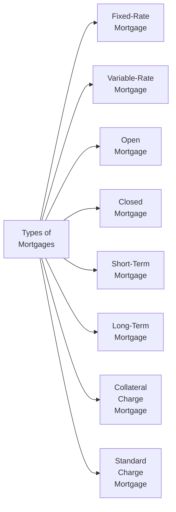

## 3.2 Types and Features of Mortgages

Mortgages are, in many ways, the cornerstone of real estate financing here in Canada. They’re the big loans that help folks own homes much sooner than if they saved up the entire purchase price in cash. But, well, if you’ve ever looked closely at mortgage brochures or dived into a lender’s website, you’ve probably seen a dizzying variety of products: fixed-rate vs. variable-rate, open vs. closed, short-term vs. long-term, collateral charge vs. standard charge. Maybe you’ve found yourself asking, “Which one’s the best for me or for my client?” The honest (and oh-so-common) answer is: it depends. 

In this section, we’ll explore the most common types of mortgages and the features that define them, providing you with a practical look at how each product works. And yes, I remember feeling a lot of anxiety at 25, shopping for my first mortgage, not having a clue what was going on with these terms. So, fear not—it’ll all make sense soon enough. Let’s walk through them one by one.

---

### Overview Diagram of Mortgage Types

To start, here’s a simple diagram illustrating the main categories of mortgages we’ll cover. Don’t worry if it feels like a lot; we’ll break them all down in the following sections.

Use this as a quick reference map in case the vocabulary starts to blur.  

---

### Fixed-Rate Mortgages

A fixed-rate mortgage is, in many ways, the definition of “certainty.” The interest rate remains the same throughout the term of the mortgage. For example, if you have a five-year term at 5% annual interest, you’ll be paying that 5% rate for the entire five-year term, no matter how the economic winds blow.

• Key Pros  
  - Payment Stability: Your principal and interest payments remain constant each month, which is super helpful for budgeting.  
  - Protection from Rising Rates: If the Bank of Canada (or your lender’s prime rate) shoots upward, you keep your cozy fixed rate.  

• Key Cons  
  - Possibly Higher Rates: A fixed rate can sometimes be higher than an introductory or current variable rate, especially when rates are stable or trending downward.  
  - Prepayment Penalties if you break the mortgage: If you decide to refinance or sell your home before the term is up, you could face steep charges—commonly referred to as Interest Rate Differential (IRD) penalties.  

#### Case Study: Maria’s First Home  
Maria, a teacher with stable income and an eye for predictable household finances, chose a five-year closed fixed-rate mortgage. She was anxious about the potential for future rate increases, so a variable-rate just felt too risky. She sleeps a little better at night knowing that if rates spike, her monthly payment won’t budge. In her scenario, the sense of security outshone the possibility of maybe saving on interest had she gone variable.  

---

### Variable-Rate Mortgages

Variable-rate mortgages move with your lender’s prime lending rate, which is typically influenced by the Bank of Canada’s rate decisions. Let’s say you start at 4.5% interest. Depending on economic conditions, that interest rate might become 4.2% in six months—or it might become 5.0%.  

• Key Pros  
  - Potentially Lower Cost: Historically, variable rates have often been lower on average than fixed rates. Over a long period, you might save on interest if rates trend flat or downward.  
  - Flexibility in Conversion: Some lenders allow you to lock into a fixed rate later if you sense rates might shoot up.  

• Key Cons  
  - Rate Fluctuations: Your monthly payment could alter unexpectedly (or the ratio of principal to interest in your payment could shift), making budgeting trickier.  
  - Emotional Stress: If you’re the type who hates uncertainty, a variable rate can leave you feeling anxious whenever there’s talk of inflation or prime rate hikes.  

#### Example: Sam’s Risk-Reward Play  
Sam, a freelance graphic designer, took a variable-rate mortgage with the hope of capitalizing on historically low interest rates. He’s comfortable with potential payment fluctuations because his partner’s steady salary can buffer any shock. Over time, if the prime rate remains stable or dips, Sam might save an amount that he can funnel into accelerated payments or other investments.

---

### Open Mortgages

An open mortgage is flexible and, well, wide open to prepayments. You can pay off the mortgage in full, make lump-sum payments, and typically avoid nasty penalties for doing so. Sounds perfect, right? Except it usually comes with one catch—an interest rate that’s higher than what you’d pay on a closed mortgage of the same term.

• Key Pros  
  - Prepayment Freedom: Pay off as much as you want, whenever you want. Great for someone expecting a windfall (like a year-end bonus or an inheritance).  
  - Short Commitment: Often you see open mortgages with shorter terms (e.g., six months).  

• Key Cons  
  - Higher Interest Rates: That extra freedom usually translates to banks charging a premium.  
  - Not Always Cost-Effective: If you end up not taking advantage of the prepayment freedom, you might’ve been better in a closed mortgage at a lower interest rate.  

#### Real-World Example:  
I remember a friend who inherited some money unexpectedly mid-year. They had an open mortgage. They just threw the entire inheritance at the mortgage, cleared it out, and walked away with zero penalty. That was an ideal scenario for them. If they’d had a closed mortgage, they might have faced prepayment charges.  

---

### Closed Mortgages

Closed mortgages lock you in for the duration of the term. But “closed” doesn’t mean you can’t prepay at all—most lenders allow certain prepayment options (like 10% or 20% of the original principal per year) without penalty. Anything beyond that typically triggers a fee.  

• Key Pros  
  - Generally Lower Rates: Lenders offer more competitive rates than their open counterparts.  
  - Predictable Terms: You’ll know exactly what your payment privileges are (e.g., 10% lump-sum annually).  

• Key Cons  
  - Limited Prepayment: Want to fully clear the mortgage mid-term? Expect a penalty that could be quite hefty.  

### Advisor Tip: Evaluate the Likelihood of Sale or Refinance  
As an advisor, you want to highlight that a closed mortgage is best for someone not expecting to move or refinance before the term is finished. The penalty for breaking a closed mortgage can be a big financial setback.  

---

### Short-Term vs. Long-Term Mortgages

Canadians typically choose mortgage terms ranging from a few months to 10 years, with five years being the most common. Generally, short-term mortgages mean a term of one or two years (or sometimes just six months). Long-term mortgages might be seven or even 10 years.

• Short-Term Mortgages  
  - Pros: Often have lower interest rates than longer terms and let you “test the waters.” If rates drop, you can renew soon at a potentially lower rate.  
  - Cons: Renewal Risk. If the market interest rates jump at the end of your short term, you might be forced into a higher-rate scenario.  

• Long-Term Mortgages  
  - Pros: You lock into a rate for a longer period, giving you considerable stability in your payments. You don’t have to worry about renewal each year or two.  
  - Cons: Possibly higher interest rates because lenders assume more risk over a longer time span. Also, if you need to break the mortgage halfway through, your penalty might be substantial, especially with a fixed-rate product.  

#### Example: Chris’s Four-Year Plan  
Chris is quite certain they’ll move to a new city to start a different job within four years. A short-term mortgage, maybe a three-year fixed, could be wise. If Chris took a seven-year mortgage but ended up moving in four, they’d pay a penalty to break it.  

---

### Collateral vs. Standard Charge Mortgages

This distinction is often overlooked, but it can significantly affect your client’s flexibility and future borrowing options.  

• Collateral Charge Mortgage  
  - Registered for a higher amount than the initial loan, allowing clients to borrow additional funds (for example, a secured line of credit) without needing to refinance or register a new charge.  
  - Easier to access more credit in the future, but switching lenders can be more complex and sometimes costly, because a new lender may not accept the collateral charge, requiring a discharge and re-registration.  

• Standard Charge Mortgage  
  - Registered strictly for the actual principal borrowed.  
  - Easier to transfer from one lender to another, since standard charges are commonly accepted in direct “switch” programs.  
  - If you want extra funds beyond the original mortgage amount, you typically need to refinance and pay legal or registration fees again.  

Think of a collateral charge mortgage like a credit card with a high limit that you might or might not use. Meanwhile, a standard charge mortgage is more limited in borrowing capacity but is easy to reshuffle between lenders.  

---

### The Role of the Advisor

Your role as a financial advisor (even if your specific license or designation might not let you formally “sell” mortgages) is to present and clarify the advantages and drawbacks of each mortgage type to your clients. You want to help them explore questions like:  
• Will I keep the property long enough to benefit from a certain type of mortgage?  
• How stable is my job and my future income?  
• Am I comfortable with interest rate fluctuations?  
• Am I planning large prepayments, or do I want to keep monthly payments consistent?

### Impact of Interest Rate Changes

When interest rates shift, it can directly affect the monthly payment on a variable-rate mortgage. Even with a fixed-rate mortgage, a hike in rates at renewal can mean suddenly higher payments if you haven’t planned for it. Encourage your clients to map out different scenarios using an amortization schedule or open-source financial tools (for instance, you can search GitHub for “amortization calculator Canada” to find free calculators that illustrate how these changes affect total interest paid).  

---

### Best Practices and Common Pitfalls

• Best Practice 1: Prepayment Opportunities  
  - Check a mortgage’s prepayment privileges. Even closed mortgages often let you pay off a percentage of the outstanding balance each year without penalty.  

• Best Practice 2: Build in a Buffer  
  - If you have a variable-rate mortgage, budget as if your rate might rise by 1% or 2%. That extra cushion can help you avoid financial strain if the prime rate jumps.  

• Common Pitfall 1: Ignoring Renewal Terms  
  - Don’t just sign on the dotted line when your lender sends a renewal notice. Sometimes lenders don’t automatically offer their best rates. Shop around if you can.  

• Common Pitfall 2: Breaking a Mortgage Mid-Term  
  - Life changes happen—marriage, kids, job relocation. If you might move or refinance, understand your penalty.  

• Common Pitfall 3: Overborrowing with Collateral Mortgages  
  - The ability to borrow more money against your home can be tempting, but it can also lead to unmanageable debt loads if you’re not careful.  

---

### Additional Resources for Canadian Mortgage Regulations and Guidance

When it comes to mortgages in Canada, you’ll find several reliable sources:

1. **Office of the Superintendent of Financial Institutions (OSFI)**  
   Visit <https://www.osfi-bsif.gc.ca> for guidelines on capital requirements, risk management, and other regulatory frameworks affecting Canadian banks and mortgage lenders.

2. **Mortgage Professionals Canada**  
   Their site <https://www.mortgageproscan.ca> offers industry reports, best practices, and listings of accredited mortgage professionals. They also provide continuing education materials for those wanting deeper insights.

3. **Canadian Real Estate Association (CREA)**  
   At <https://www.crea.ca>, you’ll find updates on housing markets, insights into real estate trends, and data that could influence your mortgage considerations.

4. **CIRO (Canadian Investment Regulatory Organization)**  
   After the amalgamation of the Mutual Fund Dealers Association (MFDA) and the Investment Industry Regulatory Organization of Canada (IIROC), CIRO is the current self-regulatory organization overseeing investment dealers and mutual fund dealers in Canada. Find updates at <https://www.ciro.ca>. Although mortgages often fall outside direct CIRO oversight, changes in regulation or overall market conditions can potentially affect broader financial product offerings.

5. **Open-Source “Amortization Schedule” Tools**  
   Basic spreadsheets or open-source software (on GitHub, for instance) let you see a side-by-side comparison of what happens when you tweak mortgage amounts, interest rates, and prepayment schedules.

---

### Putting It All Together

Every mortgage is a balancing act among interest costs, payment flexibility, term length, and your own comfort with risk. A variable-rate mortgage might suit a client who’s feeling bullish on stable or decreasing interest rates—but a risk-averse family might opt for a five-year fixed mortgage at a slightly higher rate for peace of mind. An open mortgage might be terrific if you anticipate finishing payments early, but it might be overkill if you rarely make extra lump-sum contributions.  

As an advisor, keep the conversation going. Ask your clients if they expect any big life changes in the near future. Are they planning to start a family or switch jobs? How quickly do they hope to be mortgage-free? And maybe most importantly: how would they feel if interest rates suddenly soared or if their property value dipped?  

Encourage them to run multiple scenarios (some lenders or third-party websites offer scenario calculators) and compare how each mortgage type might look in the short term and over the long haul. Framing mortgage decisions in the broader context of a financial plan also helps. For instance, if fixed monthly payments free up your client’s mental space so they can focus on building an investment portfolio, they might prefer a stable, fixed-rate option. On the other hand, if they understand the risk of payment variations and want to channel potential interest savings into an RRSP or TFSA, a variable-rate product might fit the bill.  

Remember: mortgages aren’t just about getting the biggest house with the lowest apparent rate. They’re about balancing your client’s financial goals, risk tolerance, and lifestyle needs.  

---

## Test Your Knowledge: Mortgage Types and Features Quiz



### Which statement best describes an open mortgage?

- [ ] It always has a fixed interest rate for the entire term.
- [ ] It can’t be prepaid without penalty.
- [x] It allows partial or full prepayment at any time, often at a higher interest rate.
- [ ] It locks in the interest rate for at least 10 years.

> **Explanation:** Open mortgages give borrowers the flexibility to prepay at any time without penalty, but typically charge higher interest rates to offset that privilege.

### Which of the following is NOT a common advantage of a fixed-rate mortgage?

- [ ] Predictable monthly payments
- [x] Lower interest rates guaranteed throughout the term
- [ ] Protection from rate increases
- [ ] Easier budgeting

> **Explanation:** While fixed-rate mortgages do provide predictable payments and protection from rising rates, they aren’t always guaranteed to be lower than variable rates. Sometimes a variable rate may be cheaper.

### Which factor is MOST likely to increase renewal risk for a borrower?

- [ ] Choosing a 10-year term
- [ ] Making annual lump-sum prepayments
- [x] Selecting a short-term mortgage in a potentially rising rate environment
- [ ] Refinancing for a lower rate during the term

> **Explanation:** Short-term mortgages require more frequent renewals, so if interest rates are rising, there’s a bigger chance the borrower will face higher rates at renewal.

### What is the primary reason collateral charge mortgages can be harder to switch between lenders?

- [ ] Because they’re usually restricted to high-ratio mortgages only.
- [ ] They can only be transferred within the same banking institution.
- [x] They often require discharge and re-registration, which can be costly.
- [ ] They don’t allow line-of-credit features.

> **Explanation:** Collateral charge mortgages are registered at a higher amount than initially borrowed. Lenders often won’t accept a collateral charge transfer from another lender, meaning you have to discharge and re-register (and typically pay new legal fees).

### Which of the following is typically a distinct feature of a closed mortgage?

- [ ] The easiest transfer process to another lender
- [ ] Interest rates that fluctuate monthly
- [ ] Almost unlimited prepayment options
- [x] Generally lower interest rates than an open mortgage

> **Explanation:** Closed mortgages generally offer lower rates compared to open mortgages. However, closed mortgages have limited prepayment options without incurring a penalty.

### When might an open mortgage be ideal?

- [x] If you expect a large sum of money soon and plan to pay off your mortgage quickly
- [ ] If you prioritize the lowest possible interest rate over everything else
- [ ] If you are comfortable with interest rate fluctuations
- [ ] If you have no intention of moving or refinancing

> **Explanation:** An open mortgage is well-suited for someone who anticipates paying off their mortgage in the near future without wanting to face prepayment penalties.

### A typical advantage of variable-rate mortgages is:

- [x] Potential savings when interest rates remain stable or decline
- [ ] Guaranteed lower rates than fixed-rate mortgages
- [x] Option to switch to a fixed rate later at some lenders
- [ ] No risk of monthly payment fluctuation

> **Explanation:** Variable-rate mortgages sometimes start with lower rates. Borrowers also keep the option to lock into a fixed rate with some lenders. However, there is no guarantee rates won’t rise.

### One common pitfall with a fixed-rate mortgage is:

- [x] Large penalties if you break the mortgage mid-term
- [ ] Rapid changes in monthly payment if interest rates increase
- [ ] Limited access to extra borrowing like a line of credit
- [ ] Lack of stability in monthly payments

> **Explanation:** Fixed-rate mortgages often carry hefty penalties (the Interest Rate Differential, or IRD) if you break them before the end of the term.

### What is a primary benefit of a standard charge mortgage?

- [ ] Always includes a built-in line of credit
- [ ] Typically offers a lower overall interest rate
- [x] Easier to switch lenders because many accept standard charges
- [ ] No legal fees involved in registering the mortgage

> **Explanation:** Standard charge mortgages are generally straightforward to switch between lenders because they’re registered for the exact amount of the loan and are widely accepted.

### A borrower is looking for stable payments and immunity to immediate rate hikes. Is a fixed-rate mortgage likely a suitable option?

- [x] True
- [ ] False

> **Explanation:** A fixed-rate mortgage ensures monthly payments won’t change during the term, offering protection from sudden rate increases.


