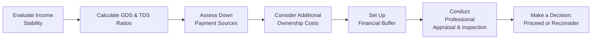

## 3.3 Assessing Home Affordability

If you’ve ever talked to someone who bought a home and felt totally overwhelmed, you know how stressful it can be to figure out what you can truly afford. I remember when I was buying my first condo – it felt like I was opening a gigantic (and slightly scary) financial can of worms. My real estate agent showed me multiple places, and each one had its own set of potential costs: mortgage payments, property taxes… even weird condo fees I had never even considered! So, if you find yourself itching to own a home, you’ll want to explore a few basic points on affordability. Let’s walk through these ideas together, step by step.

Understanding Why Home Affordability Matters  
Home affordability is about knowing how much you can comfortably pay over a long period of time without sacrificing your overall financial well-being. If you overshoot your budget, you might wind up with a gorgeous property but struggle to cover maintenance costs or other important life expenses. On the other hand, if you undershoot, you may hold back from an investment that could build substantial equity (but only if it still aligns well with your broader financial plan).

When we talk about affordability, we consider more than just the price of a home. We delve into your overall financial situation – your income, job stability, current debts, and the rainy-day cushion you have for unexpected events. Ultimately, if you can’t see yourself confidently making mortgage payments over the long haul (and dealing with all the hidden costs that crop up like property tax hikes or roof repairs), it’s best to rethink your approach.

Evaluating Income Stability and Future Prospects  
Income is the foundation of any mortgage repayment plan. Knowing that you have a steady paycheck coming in – or a set of reliable income streams if you’re self-employed – is essential. Consider not just your present earning potential, but also your confidence in the future:

• Is your career stable, or are there looming layoffs in your industry?  
• Do you anticipate a steady salary increase or bonus structure?  
• Are you planning a job or career change in the near future that might dramatically alter your monthly cash flow?

While no one can predict the future with absolute certainty, walking into homeownership with both eyes open about your professional life helps ensure you aren’t committing to a mortgage that might stress you out down the line.

Debt Service Ratios: The GDS & TDS  
Your debt service ratios, often referred to as the Gross Debt Service (GDS) and Total Debt Service (TDS) ratios, provide a snapshot of how much of your income is going toward debt payments. These ratios are central to the mortgage approval process in Canada, helping lenders gauge the risk level of providing you with a loan.

• Gross Debt Service (GDS) Ratio: This ratio focuses purely on your housing-related costs (mortgage payments, property taxes, heating, and half of any condo fees) as a percentage of your gross annual income.  
• Total Debt Service (TDS) Ratio: Your TDS ratio looks at all your monthly debts, including car loans, credit card repayments, and other liabilities, in addition to your housing-related costs.

A quick rule of thumb used by many lenders:  
• Keep your GDS ratio at or below 32%.  
• Keep your TDS ratio at or below 40%.  

Of course, these are general guidelines, and different financial institutions may have their own standards. But they’re great benchmarks to ensure you’re not biting off more mortgage than you can comfortably handle.

Let’s use a simplified example for clarity:

Imagine you earn a gross annual income of C$72,000 (that’s C$6,000 monthly).  
• Suppose your prospective monthly mortgage payment is C$1,500, plus property taxes (~C$200/month), heating (~C$150/month), and 50% of condo fees (~C$100/month if the total is C$200).  
• Your total housing costs per month would be C$1,950.  

So your GDS ratio is:  
GDS = (1,950 ÷ 6,000) × 100 = 32.5%  

If that GDS ratio surpasses 32%, your lender might raise an eyebrow or tweak the conditions of your mortgage. Try also factoring in your other debts. If you have a car loan of C$300/month and a credit card payment of C$100/month, then your total monthly debts become C$2,350.  

So your TDS ratio is:  
TDS = (2,350 ÷ 6,000) × 100 = 39.2%  

At 39.2%, you are still under 40% (just barely!), so your TDS ratio might be accepted by many lenders. Remember, near the limit means you have less financial wiggle room if unexpected bills pop up.

Down Payment Sources  
The bigger your down payment, the smaller your mortgage and ongoing monthly costs. Especially in Canada, lenders look favorably on buyers who can put forward a sizable down payment. Plus, if your down payment is under 20% of the home’s purchase price, you’re generally required to get mortgage loan insurance (often with Canada Mortgage and Housing Corporation, or CMHC), which adds an extra premium to your monthly payment.

Where do you get this down payment? It could be from your own savings, a tax refund, a gift from family, or perhaps your Registered Retirement Savings Plan (RRSP). The RRSP Home Buyers’ Plan (HBP) lets first-time buyers withdraw up to a specific limit (commonly C$35,000 per individual, but check the CRA website for the latest details) without tax consequences, as long as the money is repaid over 15 years. If you’re married or in a common-law partnership, that withdrawal amount can effectively double if both you and your spouse are first-time buyers.

However, using your RRSP savings for a house also means you’re pulling money out of longer-term retirement investments. So, weigh the pros and cons carefully: while you can get into the real estate game sooner, it could slow down your retirement fund growth if you don’t replenish those funds diligently.

Additional Ownership Costs  
Whew, there are more costs than most first-timers realize. Owning a home typically involves:  
• Property taxes: Typically paid monthly or quarterly to your municipality.  
• Utilities: Electricity, water, gas, or certain condo utilities.  
• Maintenance and repairs: Anything from new light bulbs to roof repairs. Over time, small fixes add up, so plan for them.  
• Renovations and upgrades: Whether you’re updating your kitchen or finishing the basement, these projects can cost thousands of dollars.  
• Insurance costs: Home insurance is vital to protect against damage or liability claims.

It’s like adopting a pet. You buy the dog, but you also have to spend on dog food, vet bills, grooming, and the occasional dog-sitter. Homeownership, similarly, can lead to cost surprises if you don’t budget wisely. So, keep a line in your budget for “housing contingencies.” A good rule of thumb is to set aside at least 1%-3% of your home’s value each year for maintenance and upcoming repairs.

Creating a Buffer  
If you’ve read the previous sections on budgeting and consumer lending (especially in Chapter 2), you’ll know that flexibility in your finances is huge. Life happens. Mortgage interest rates can rise when you’re up for renewal. Your income might drop if your job situation changes. You could face unexpected medical costs, or your kids might suddenly need braces. The list goes on and on.

Having a small financial cushion can spare you the anxiety of living too close to the edge. Typically, advisors recommend keeping three to six months’ worth of essential expenses in an emergency fund, though the ideal figure depends on your personal circumstances and comfort level. This buffer ensures that in the event of a gap in employment, you won’t scramble to make your mortgage payments.

Professional Appraisals and Property Inspections  
No matter how thrilled you are about that “dream house,” it’s smart to get a property appraisal and inspection before you lock in. An appraisal, done by a certified professional, estimates how much the property is actually worth. This ensures that you’re not paying an inflated purchase price, and it provides the lender with confidence about the property’s value in case it needs to foreclose (worst-case scenario, which hopefully you’ll never encounter).

Meanwhile, a thorough home inspection checks the house’s structural soundness, the condition of the roof, plumbing, electrical systems, and more. Trust me: it’s better to shell out for an inspection in advance than to find out after closing that your dream home needs thousands of dollars in repairs. If you skip an inspection, you may assume unnecessary financial risk. Think of it like taking a used car to a mechanic for a once-over before buying – you want to know exactly what you’re getting into.

Visualizing the Affordability Planning Process  

Below is a simple Mermaid diagram showing the major steps in assessing home affordability:

This flowchart helps highlight how each step builds on the previous one. If you find that your GDS ratio is too high, for example, you might revisit your down payment strategy or reconsider the property price range that fits within your budget.

Leaning on Online Tools and Resources  
• Financial Consumer Agency of Canada (FCAC) provides an excellent Mortgage Affordability Calculator (https://itools-ioutils.fcac-acfc.gc.ca/MABC-CCAB/mortgageaffordabilitycalc-eng.aspx). Don’t let the complicated name scare you; it’s actually super straightforward for playing around with different mortgage sizes, interest rates, and amortization periods.  
• Consider your local provincial or territorial housing corporation. For example, the Ontario Mortgage and Housing Corporation or the Alberta-based options have region-specific tools that can highlight local tax rates or homebuyer grants.

Beyond the official tools, you can also explore budgeting apps or open-source spreadsheet templates that let you input your financial data. Tweak the interest rate to see how your monthly payment might look if it rises a couple of percentage points in the future. This scenario planning is eye-opening – it’s a bit like trying on different shoe sizes before you find the perfect fit.

Keeping an Eye on the Real Estate Market  
The broader real estate market also influences what you can afford. In some provinces, housing prices spiked rapidly over the past few years, while in others they’ve remained stable. It’s not just about interest rates; it’s about overall supply and demand, local economy trends, and even seasonal fluctuations.

You could also explore renting an equivalent property in your area for a year or two to see if the local market stabilizes. Some clients prefer to rent when the market is overvalued, and then buy later if prices cool. Alex Avery’s book “The Wealthy Renter” is an intriguing read for anyone curious about alternative perspectives on renting versus buying.

Navigating the Regulatory Landscape  
Although the mortgages you obtain originate with banks, credit unions, or specialized mortgage lenders, your investment dealer or financial advisor may be subject to regulations under the Canadian Investment Regulatory Organization (CIRO). CIRO came into effect on January 1, 2023, replacing historical organizations (the MFDA and IIROC) and overseeing investment dealers, mutual fund dealers, and marketplace integrity. While mortgages themselves aren’t necessarily governed by CIRO (they’re generally guided by federal and provincial regulations), your financial professional’s broader advice remains under the standards of this new SRO.

Glossary  
• Gross Debt Service (GDS) Ratio: The percentage of your annual household income needed to cover your basic housing costs (mortgage, property tax, heating, and 50% of condo fees, if applicable).  
• Total Debt Service (TDS) Ratio: The percentage of your annual household income needed to cover all debt obligations, including housing costs, credit cards, car loans, and other liabilities.  
• Home Buyers’ Plan (HBP): A federal program allowing first-time homebuyers to borrow up to a specified amount from their RRSP to use as a down payment, repayable over 15 years.  
• Property Inspection: A professional evaluation of a home’s condition, assessing areas like the foundation, roofing, plumbing, and electrical systems.  
• Appraisal: An estimate of a property’s fair market value conducted by an accredited professional.

Where to Go from Here  
More details on mortgages and how they intersect with insurance are in this very chapter, and you can refer to Chapter 2 on budgeting if you’re still piecing together your finances. The Canada Mortgage and Housing Corporation (CMHC) also has helpful guides for prospective buyers, and the Canada Revenue Agency (CRA) site (https://www.canada.ca/en/revenue-agency.html) offers up-to-date rules on the Home Buyers’ Plan or other relevant tax incentives for homeowners. Ultimately, the best approach is to combine these resources with prudent planning, professional advice, and a dash of personal reflection. Homeownership isn’t a race – it’s a major step that requires a long-term view.

It’s perfectly normal to feel a little anxious. But with the right preparation and a clear picture of your capacity, you can step into the buying process with confidence. There’s no shame in waiting, and there’s no shame in deciding that renting is best, either. Housing is a personal decision, tethered to all the complexities that make up your financial life. By understanding the bigger picture and focusing on achievable, realistic monthly obligations, you’ll be better positioned to enjoy the incredible milestone of owning a home, without drowning in buyer’s remorse or debt.

---

## Test Your Knowledge: Home Affordability Essentials



### Which ratio focuses only on housing-related costs as a percentage of gross annual income?

- [ ] Total Debt Service (TDS) Ratio
- [x] Gross Debt Service (GDS) Ratio
- [ ] Debt-to-Income (DTI) Ratio
- [ ] Interest Coverage Ratio

> **Explanation:** The GDS ratio looks purely at mortgage payments, property taxes, heating, and 50% of condo fees (if applicable) as a percentage of household income.

### Which of the following is included in the Total Debt Service (TDS) ratio calculation along with housing costs?

- [ ] RRSP contributions
- [ ] Property appraisal fees only
- [x] Credit card payments
- [ ] Renovation expenses

> **Explanation:** The TDS ratio considers all regular debt payments (e.g., car loans, credit cards, personal loans) beyond just housing costs.

### What is the maximum guideline percentage for TDS that many lenders use in Canada?

- [ ] 28%
- [ ] 32%
- [ ] 37%
- [x] 40%

> **Explanation:** Many Canadian lenders suggest you keep your Total Debt Service ratio at or below 40% to comfortably manage all monthly debts, including housing.

### Why is a down payment of less than 20% generally accompanied by extra mortgage loan insurance premiums?

- [ ] It’s a legal requirement from CIRO
- [x] It’s a measure to protect the lender in case of default
- [ ] It reduces mortgage interest rates
- [ ] It guarantees a larger home purchase

> **Explanation:** If you put less than 20% down, mortgage loan insurance (often via CMHC) is required to protect the lender from borrower default.

### Which of the following best describes the Home Buyers’ Plan in Canada?

- [x] A program that allows first-time homebuyers to withdraw from RRSPs for a down payment, repayable over 15 years
- [ ] A mandatory mortgage insurance plan for high-ratio mortgages
- [x] An arrangement that eliminates all interest on first-time mortgages
- [ ] A federal tax credit for purchasing energy-efficient homes

> **Explanation:** The Home Buyers’ Plan enables first-time buyers to withdraw a certain amount from their RRSPs without immediate tax consequences, as long as they repay that amount within 15 years.

### Which of the following are typical monthly housing costs that form part of your GDS ratio?

- [x] Mortgage payments, property taxes, heating costs, and 50% of condo fees
- [ ] Car loan payments, property taxes, and travel insurance
- [ ] Groceries, credit card balances, and mortgage payments
- [ ] Vacation savings, property taxes, and RRSP contributions

> **Explanation:** The GDS ratio specifically focuses on essential “shelter” costs: mortgage, property tax, heating, and half of any condo fees.

### What is the main purpose of a property appraisal in the homebuying process?

- [ ] To spot defects like wiring or plumbing issues
- [x] To estimate the property’s fair market value
- [x] To guarantee that the buyer’s down payment meets 20%
- [ ] To ensure no mortgage insurance is needed

> **Explanation:** An appraisal determines the property’s likely market value, ensuring both buyer and lender have a realistic understanding of the home’s worth.

### Why is maintaining an emergency fund particularly important when taking on a mortgage?

- [ ] It prevents you from having to pay property taxes
- [ ] It guarantees home insurance approval
- [x] It offers a cushion for unforeseen financial challenges such as income loss or unexpected home repairs
- [ ] It immediately lowers your TDS ratio

> **Explanation:** If you experience a job loss, rate hike, or surprise home purchase expense, an emergency fund helps meet mortgage obligations and reduces financial stress.

### Which federal organization replaced the MFDA and IIROC to become Canada’s single self-regulatory body overseeing investment dealers and mutual fund dealers?

- [ ] The Financial Consumer Agency of Canada (FCAC)
- [x] The Canadian Investment Regulatory Organization (CIRO)
- [ ] The Canada Mortgage and Housing Corporation (CMHC)
- [ ] The Canadian Investor Protection Fund (CIPF)

> **Explanation:** Effective January 1, 2023, CIRO merged the MFDA and IIROC to oversee investment dealers and mutual fund dealers, among other responsibilities.

### True or False: Property inspections can be bypassed when you already have a property appraisal.

- [ ] True
- [x] False

> **Explanation:** An appraisal determines market value, whereas a property inspection checks for structural or mechanical issues. Both are distinctly important.


