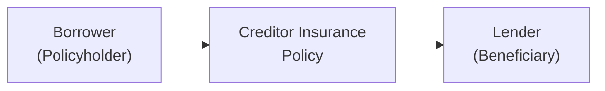
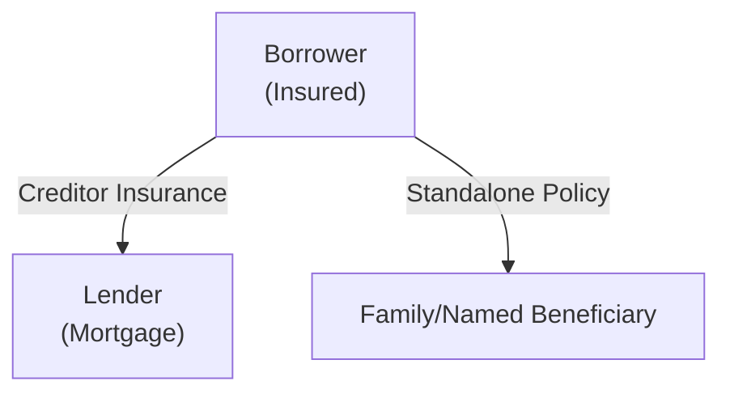

## 3.4 Creditor Insurance

So… let’s talk about creditor insurance—sometimes known as mortgage insurance or mortgage protection. You might have come across it during the mortgage application process, or maybe you’ve seen it advertised by lenders looking to help secure your home. The big question is: what exactly is creditor insurance, and how does it fit into your overall financial plan?

Creditor insurance is essentially designed to ensure that your outstanding mortgage balance (or a portion of it) is paid off if certain unfortunate events occur—like death, disability, or critical illness. This might sound pretty straightforward, but there are quite a few nuances, including different types of coverage, exclusions, underwriting processes, and regulations. Let’s dive in.

---

### Why Creditor Insurance Matters

To set the scene, picture this scenario: you’ve taken on a big mortgage for your dream home, but then life throws you (or your family) a curveball—serious illness or worse. It can be incredibly stressful to deal with sudden financial pressure while navigating a time of grief or physical hardship. Creditor insurance can reduce that stress by either fully paying off or reducing the mortgage balance. It protects your home from forced sale when the unexpected occurs.

In fact, I remember a friend—let’s call him Amit—who bought a house with a 25-year mortgage. He was so excited to host barbeques in his backyard. Then, just two years in, he faced a serious health challenge. If his wife hadn’t included some form of creditor coverage, they would’ve faced a horrifying choice: sell the house or struggle with monthly payments they could no longer afford. That’s the kind of situation creditor insurance is designed to prevent.

---

### Key Terminology

Before we go too deep, let’s clarify a few terms you’ll see floating around:

• **Creditor Insurance:** Insurance designed to pay a lender if the borrower can’t make mortgage payments or fully repay the debt due to death, disability, or critical illness.  
• **Underwriting:** The process by which insurers decide whether (and on what terms) to offer coverage. Some insurance policies underwrite at the time of application, others at claim time (which can lead to surprises).  
• **Insurable Interest:** A key legal requirement in insurance, meaning the policyholder must have a legitimate financial stake in the insured person’s continued life and well-being.  
• **Exclusions:** Specific conditions or events for which the coverage does not apply. For example, pre-existing conditions are often scrutinized.  
• **Beneficiary:** The recipient of the insurance proceeds. In creditor insurance, the lender (like a bank) usually receives the benefit directly to pay down the balance.

---

### Types of Creditor Insurance

Creditor insurance comes in different flavors, each corresponding to a particular risk: death, disability, or critical illness. We’ll also discuss a brief comparison to Chapter 3.1 and 3.3—where we explored mortgage affordability and the different mortgage options—so you can see how insurance weaves into the broader mortgage conversation.

#### Mortgage Life Insurance
Mortgage Life Insurance is the most common form of creditor coverage. If the borrower passes away during the mortgage term, this insurance pays out a lump sum directly to the lender to clear the outstanding mortgage balance.

• **Beneficiary:** The lender.  
• **Coverage:** Declines over time, matching your mortgage balance.  
• **Benefit:** Your family doesn’t inherit the mortgage debt, and the home can remain in their possession without financial strain.  
• **Potential Downsides:** Because the beneficiary is the lender instead of your loved ones, any remainder beyond paying off the mortgage (if it were a personal life insurance policy) won’t flow to your family.

#### Mortgage Disability Insurance
Mortgage Disability Insurance covers regular mortgage payments if the insured becomes disabled and can’t work. If you’re unable to earn income due to a disability, this coverage typically kicks in after a waiting period.

• **Payment Streams:** Often covers your mortgage payments for a specified period.  
• **Eligibility Criteria:** Medical underwriting, occupation details, and sometimes waiting periods for coverage to initiate.  
• **Benefit:** Removes the monthly mortgage burden when your paycheck is impacted by disability.

#### Mortgage Critical Illness Insurance
Mortgage Critical Illness Insurance provides funds if you’re diagnosed with certain specified illnesses—commonly cancer, heart attack, or stroke, though policies vary. The idea is to help reduce or pay off your mortgage so you can focus on recovery.

• **Coverage:** Typically a lump sum amount that can be used to pay down or pay off the mortgage.  
• **Conditions Covered:** Varies by policy, usually a specific list (e.g., cancer, heart disease, stroke). Make sure to check the fine print to confirm you’re comfortable with what’s covered and what’s not.  
• **Medical Underwriting:** Your health profile heavily influences acceptance and premium costs.

---

### Comparing Creditor Insurance with Standalone Policies

A common question we hear (and maybe you’re thinking it, too) is: “Should I get creditor insurance from my bank or a standalone life/disability/critical illness policy from an insurance company?” Truth is, both have pros and cons:

• **Creditor Insurance:**
  - Generally easier to add on during your mortgage application.
  - Coverage is tied directly to your mortgage debt (often decreasing as the mortgage balance decreases).
  - Beneficiary is the lender, so you’re effectively ensuring the mortgage is taken care of, but your loved ones won’t see a direct payout.
  - Premiums can be relatively high compared to the coverage amount, and underwriting often comes at the time of claim (a major point of caution).

• **Standalone Life/Disability/Critical Illness Insurance:**
  - Typically requires more underwriting upfront, but by doing so, you have clarity from the start about your coverage status.
  - Provides a fixed coverage amount (which doesn’t decrease unless you change it).
  - Beneficiary (family, estate, or whomever you choose) receives the proceeds. They can decide whether to pay off the mortgage or use the funds for something else.
  - Potentially more cost-effective, especially for younger, healthier applicants who might lock in lower premiums.

It’s important to weigh these factors. Some people prefer the simplicity of creditor insurance—everything is packaged with the mortgage—while others want the flexibility and potential savings of standalone coverage. From an advisor’s perspective, presenting both sides and letting the homeowner make an informed choice is a crucial step in shaping a well-rounded financial plan.

---

### Underwriting and Exclusions

One subtle “gotcha” with certain creditor insurance products is that underwriting may be deferred until you make a claim. This means you might believe you’re covered, only to discover later that the insurer denies your claim because of a pre-existing condition that was never medically underwritten at the outset. That can be a nasty surprise.

A better practice is to ensure the coverage terms are clearly understood from day one. If your lender’s creditor insurance relies on post-claim underwriting, be sure to read the application carefully. What health questions are you answering? Are there any disclaimers about coverage exclusions?

#### Common Exclusions
• **Pre-existing conditions** that were not disclosed.  
• **Self-inflicted injuries** or certain high-risk activities.  
• **Certain serious illnesses** not listed under critical illness coverage.  

---

### How Creditor Insurance Can Safeguard Families

Let’s be honest: talk about insurance can feel a bit dry or gloom-and-doom. But the heart of creditor insurance is the emotional relief it provides. If you’ve ever known someone who lost a loved one and had to scramble to keep up with mortgage payments, you know how tough that can be. Creditor insurance can be the difference between, “I’m sorry about your loss, now your house is in foreclosure,” and, “We can focus on healing and not worry about the house.”

This coverage can be especially helpful for first-time homebuyers who are stretching their finances. It can also be beneficial if you’re getting a larger mortgage relative to your income, leaving little wiggle room for life’s unexpected turns.

---

### A Simple Case Study

Imagine Serena, a 35-year-old accountant who just bought her first condo in Toronto. She has a $400,000 mortgage. Serena’s lender offers her mortgage life insurance with monthly premiums of around $30. Serena also considers a standalone life insurance policy that covers $400,000 of mortgage debt. The standalone is $25 per month but requires medical exams and more detailed questionnaires.

• If Serena chooses the creditor coverage, she’ll have the peace of mind that if she dies, the mortgage is cleared—no big financial hassle for her partner. The lender is the beneficiary.  
• If she chooses the standalone policy, her partner would receive $400,000 directly upon her passing. The couple could use the proceeds for more than just paying off the mortgage—maybe for funeral costs or other financial obligations. This flexibility might better suit their broader planning needs.

This scenario illustrates how crucial it is to weigh the benefits and drawbacks of each approach. Neither option is inherently “bad,” but they serve different purposes.

---

### Visual Overview of Creditor Insurance

Below is a simple diagram capturing the flow of creditor insurance benefits. This uses Mermaid.js for easier rendering.

In the flow above, if the borrower passes away or faces a covered event (such as a critical illness or disability), the insurance policy pays out directly to the lender (C). Note the difference from standalone coverage, where the beneficiary would typically be a family member or chosen individual.

---

### Regulatory Considerations in Canada

Because creditor insurance often feels like an “add-on” at the bank, it’s regulated to ensure transparency and fairness:

• **Financial Services Regulatory Authority of Ontario (FSRA):** If you’re in Ontario, FSRA oversees how insurance products—including creditor insurance—are offered and sold.  
• **Canadian Life and Health Insurance Association (CLHIA):** A national trade association. You can visit their website (https://www.clhia.ca) to learn about industry practices, consumer rights, and recommended best practices.  
• **CIRO (Canadian Investment Regulatory Organization):** Canada’s self-regulatory organization overseeing investment dealers and mutual fund dealers. If you offer creditor insurance in conjunction with other financial products, you must follow CIRO’s guidelines regarding suitability and disclosure. (CIRO came into existence on January 1, 2023, succeeding the former IIROC and MFDA.)  
• **Open-Source Calculation Tools:** There are various online mortgage insurance premium calculators you can use (some are entirely open source). These help you compare hypothetical premium rates based on age, health, mortgage balance, and coverage. Running these comparisons can be a real eye-opener, especially if you’re trying to decide between creditor insurance and standalone coverage.

---

### Best Practices for Advisors

If you’re advising clients about creditor insurance:

• **Communicate Coverage Limits Clearly:** Make sure they understand exactly what’s covered—and what’s not.  
• **Discuss Alternatives:** Include standalone life insurance or disability insurance in the conversation. A flexible plan might be more cost-effective or better aligned with their goals.  
• **Explain Declining Coverage:** Ensure they know that mortgage life insurance typically tracks the declining mortgage balance, so the coverage amount (and potential payout) decreases over time.  
• **Verify Underwriting Process:** Help them understand the differences between upfront underwriting versus underwriting at claim time.  
• **Highlight Potential Policy Exclusions:** Pre-existing conditions and other exclusions can seriously impact whether claims are upheld.

---

### Potential Pitfalls and Common Challenges

• **False Sense of Security:** Borrowers sometimes assume they’re covered for anything and everything once they check that insurance box on the mortgage paperwork. In reality, coverage might be denied later if they had a condition that was never properly disclosed.  
• **Limited Beneficiary Flexibility:** By naming the lender as beneficiary, the coverage exclusively targets the mortgage debt. This can be either beneficial (makes the process direct) or limiting (no extra funds for the family).  
• **Cost vs. Coverage Mismatch:** Premiums might be more expensive than comparable standalone policies, especially if you’re in excellent health or on the younger side.  
• **Redundant Coverage:** If the borrower also has robust group benefits and personal policies, they might be over-insuring, which means paying more than necessary.

---

### Practical Example with Numbers

Consider David and Michelle, each 40 years old, who just refinanced their home for $500,000. They compare two scenarios:

• **Scenario A: Creditor Insurance**  
  - Coverage starts at $500,000, decreasing as the mortgage balance goes down.  
  - Premiums are $70/month.  
  - If either passes away, the mortgage is paid off, but there’s no leftover benefit.  

• **Scenario B: Standalone Term Life Insurance**  
  - Fixed coverage of $500,000 for a 20-year term.  
  - Premiums are $50/month (with a standard underwriting process).  
  - If either dies within the term, the family gets $500,000 to pay off the mortgage or use however they want.

In Scenario A, the couple pays more for a coverage that strictly covers the mortgage. In Scenario B, they pay less for coverage that doesn’t decline—and their family decides how to use the insurance proceeds. Which is “better” depends on their personal situation, health profile, and comfort with underwriting processes.

---

### Using Diagrams to Compare Standalone vs. Creditor Insurance

Here’s a second visual, highlighting the beneficiary differences between creditor insurance and a personal policy:

• The top path shows the flow to the lender if the borrower has creditor insurance.  
• The bottom path shows the flow of funds to the family or a named individual if the borrower has a standalone policy.

---

### References and Further Exploration

• **Provincial Insurance Regulators:** In Ontario, check the [FSRA website](https://www.fsrao.ca) for regulations. Other provinces have similar regulators overseeing insurance offerings.  
• **Canadian Life and Health Insurance Association (CLHIA):** https://www.clhia.ca – They publish “Canadian Life and Health Insurance Facts,” a good read if you want more detail on market trends and compliance guidelines.  
• **CIRO (Canadian Investment Regulatory Organization):** https://www.ciro.ca – Overarching self-regulatory body for investment dealers and mutual fund dealers in Canada, providing guidelines for distributing insurance-related products.  
• **Open-Source Tools & Calculators:** Google “open-source mortgage life insurance calculator” to find interactive tools that let you compare premiums for creditor insurance vs. personal coverage.  
• **Chapter 3.1 and Chapter 3.3 of this Text:** For a better understanding of mortgage types, features, and how to assess affordability, refer back to earlier sections.

---

### Summary

Let’s face it: mortgage commitments can be nerve-wracking, especially if you start imagining the worst-case scenarios of sickness, disability, or death. Creditor insurance is designed to relieve some of that worry by covering your mortgage in those critical moments. However, it’s not a one-size-fits-all solution. Advisors should encourage clients to weigh the benefits of creditor insurance against other products, checking for cost-efficiency, coverage details, the beneficiary structure, and potential exclusions.

Ultimately, creditor insurance can be a powerful tool in a broad financial plan—just make sure it truly reflects your personal circumstances and goals. After all, we want to ensure that you (or your loved ones) can stay in the place you call home, even when life doesn’t go as planned.

---

## Test Your Knowledge: Creditor Insurance Fundamentals



### Which statement best describes creditor insurance (often called mortgage insurance)?

- [ ] It provides an investment return on mortgage equity.  
- [ ] It’s a policy that invests lump sums in the stock market for mortgage holders.  
- [x] It’s an insurance policy that pays off or reduces a mortgage balance in the event of death, disability, or critical illness.  
- [ ] It’s a mandatory government policy required for all high-ratio mortgages.  

> **Explanation:** Creditor insurance is designed to pay or reduce the mortgage balance when specific insurable events occur. It’s entirely different from investments or mandatory mortgage insurance products like CMHC mortgage loan insurance for high-ratio mortgages.

### What is a key difference between creditor insurance and standalone life insurance?

- [x] The beneficiary of creditor insurance is generally the lender.  
- [ ] Creditor insurance always has a cash value.  
- [ ] Standalone policies never require medical underwriting.  
- [ ] Creditor insurance premiums always decrease over time.  

> **Explanation:** With creditor insurance, the lender is typically the beneficiary, while standalone policies allow you to name your own beneficiary. Creditor insurance usually has no cash value and can involve post-claim underwriting.

### What is an important advantage of standalone life insurance policies over creditor insurance?

- [ ] You are not allowed to name your spouse as the beneficiary.  
- [ ] They are mandatory for all high-value mortgages.  
- [x] The coverage amount and beneficiary can be customized independently of the mortgage.  
- [ ] Standalone policies only pay a small fraction of the mortgage balance.  

> **Explanation:** Standalone life insurance lets you choose the coverage amount and beneficiary. If you pass away, the payout goes where you decide, which offers flexibility to pay off the mortgage or address other financial obligations.

### Which of the following is commonly an exclusion in creditor insurance policies?

- [x] Pre-existing health conditions not disclosed at application.  
- [ ] Mortgage default due to unemployment.
- [ ] Defaults on credit card bills.  
- [ ] Earthquake damage to your property.  

> **Explanation:** Pre-existing conditions are frequently excluded if they’re not properly disclosed. Creditor insurance typically focuses on health and mortality risks, not job loss or property damage.

### In a Mortgage Disability Insurance policy, which scenario typically triggers coverage?

- [x] The borrower becomes unable to work due to disability.  
- [ ] The home is damaged in a fire and becomes uninhabitable.  
- [x] The disability lasts through the policy’s waiting period.  
- [ ] The borrower retires early.  

> **Explanation:** Mortgage Disability Insurance usually provides monthly payments if the borrower cannot work due to disability. A waiting period often applies before benefits begin.

### Why is it crucial to verify whether underwriting is done at application or at claim time?

- [x] Post-claim underwriting can result in denied claims if medical questions were not fully addressed upfront.  
- [ ] Underwriting at claim time typically leads to cheaper premiums.  
- [ ] Application-time underwriting is illegal in Canada.  
- [ ] Claim-time underwriting is required for all mortgage providers.  

> **Explanation:** Some creditor insurance policies use post-claim underwriting, which can be risky for policyholders who may discover late in the process that their claim is denied due to undisclosed medical issues.

### Which regulatory body oversees how advisors distributing insurance products must conduct themselves in Canada today (2025)?

- [x] CIRO (Canadian Investment Regulatory Organization).  
- [ ] The historical MFDA (Mutual Fund Dealers Association).  
- [x] The historical IIROC (Investment Industry Regulatory Organization of Canada).  
- [ ] The defunct CIPF (Canadian Investor Protection Fund).  

> **Explanation:** MFDA and IIROC amalgamated into CIRO on January 1, 2023. CIRO now oversees investment dealers and mutual fund dealers. CIPF is still the investor protection fund, a separate entity from CIRO, not defunct. (Note: The question includes a tricky mention of “x,” so read carefully. There are two correct answers: the new name for the SRO is CIRO, while MFDA and IIROC are historical.)

### In Canada, which organization can you consult for industry best practices and consumer rights related to creditor insurance?

- [ ] CRA (Canada Revenue Agency)  
- [x] CLHIA (Canadian Life and Health Insurance Association)  
- [ ] FINTRAC (Financial Transactions and Reports Analysis Centre of Canada)  
- [ ] CIPF (Canadian Investor Protection Fund)  

> **Explanation:** CLHIA is the Canadian Life and Health Insurance Association, an industry group that provides data, guidelines, and consumer information on life and health insurance products, including creditor insurance.

### Which of the following best describes the role of the Financial Services Regulatory Authority of Ontario (FSRA)?

- [ ] It regulates only international insurance providers.  
- [ ] It creates and distributes insurance products to lenders.  
- [ ] It’s primarily for auditing corporate tax returns.  
- [x] It oversees how insurance products are offered and sold in Ontario.  

> **Explanation:** FSRA ensures that insurance, pensions, and other financial services in Ontario operate fairly and transparently, including creditor insurance practices.

### True or False: Mortgage Creditor Insurance always costs less than acquiring a standalone life insurance policy.

- [x] False  
- [ ] True  

> **Explanation:** Creditor insurance isn’t automatically cheaper. Premium differences depend on many factors, including age, health, mortgage amount, and type of coverage. Standalone policies can sometimes be more affordable, particularly for younger, healthier individuals.


