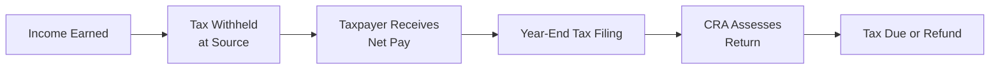

## 4.1 The Canadian Tax System

It’s funny how the word “taxes” can make folks uneasy. I remember the very first time I had to file my own tax return—there was a swirl of confusion, forms, and acronyms I’d never seen before (hello “T4”!); and let me tell you, I was not exactly thrilled. But once you understand how the system works, taxes become less intimidating and more of a structured way of contributing to Canada’s big social safety net. The good news is, you don’t need an accounting degree to make sense of it all.

Below, we’ll walk through the key aspects of Canada’s tax system, such as how to figure out whether you’re even considered a resident for tax purposes, how marginal tax rates actually work, and why paying taxes on time can save you from those pesky penalties. By the end, you’ll realize that being tax-literate is a bit like learning to drive: complicated at first, but eventually second nature.

### Overview of the Canadian Tax Environment

Canada’s tax landscape is a combination of federal and provincial or territorial taxes. That means if you live in, say, Alberta, you’ll pay federal income tax (which goes to Ottawa) plus provincial income tax (which goes to the Alberta government). If you move to Ontario, then guess what? You pay federal taxes again—no surprise there—but now your provincial taxes go to Queen’s Park in Toronto. While the rates differ by province or territory, the fundamental principles remain the same across Canada: the Canada Revenue Agency (CRA) administers the rules at the federal level, and each province or territory applies its own tax rates on top of the federal rates.

The primary legislation behind all this is the Income Tax Act (ITA). It’s essentially the big rulebook that sets out how taxes are calculated, what counts as income, which deductions and credits are allowed, and a whole slew of other details. Since governments update tax laws every year, you’ll often see new rates, thresholds, and budget announcements that can tweak the existing rules. It’s important to stay current or consult a professional—particularly if your financial situation changes, such as starting a business, selling property, or earning investment income.

### Residency for Tax Purposes

One of the first things you need to understand is that Canada taxes based on residency, not on citizenship. Sure, that might raise eyebrows—“I’m not even Canadian, so how come I might need to pay Canadian taxes?” The CRA’s motto basically says: If you reside in Canada for a significant portion of the year or maintain strong residential ties here, you may be considered a resident for tax purposes. For example, if you’re living, working, and renting or owning a home in Toronto, you’re probably a resident for tax purposes even if you’re from another country.

The rules get trickier for snowbirds, new immigrants, or temporary workers. The CRA uses various tests to determine your status, including whether you have a spouse or dependents in Canada, whether you own a home here, and how many days you spend inside the country. Once you meet the residency definition, you must declare your worldwide income—that includes earnings from foreign sources. This can be quite a shock if you’re used to a system that taxes only domestic income.

### Canada’s Progressive Tax Structure

Here in Canada, we use what’s called a progressive tax system. Think of it like steps on a staircase: as your taxable income goes up, you climb into higher “brackets,” and each bracket is taxed at a higher rate than the previous one. This doesn’t mean all your income is taxed at that highest rate—only the amount that falls within each bracket is taxed at the bracket’s corresponding rate.

If you made, for instance, CAD 60,000 in taxable income (just as an example), your first chunk of income might be taxed at around 15%, and the portion above the first bracket threshold (somewhere above CAD 50,000, depending on the tax year) would be taxed at a slightly higher rate. When you hear the phrase “marginal tax rate,” this is what folks are talking about—the rate at which your next dollar of income is taxed. It’s an important concept because it influences decisions like whether to contribute to a Registered Retirement Savings Plan (RRSP) or how additional income will affect take-home pay.

Below is a simplified table (just to give you an idea) showing hypothetical federal tax brackets. The exact thresholds and rates may change each year. You’d also have to add your provincial or territorial rates on top of these for a true picture of your total marginal rate.

| Taxable Income Range (CAD) | Sample Federal Tax Rate  |
|----------------------------|--------------------------|
| $0 – $50,000               | 15%                     |
| $50,000 – $100,000         | 20.5%                   |
| Over $100,000              | 26%                     |

Because each province has its own set of brackets, your effective tax rate can vary significantly from province to province.

### Visualizing the Tax Flow

Sometimes it helps to see a big-picture view of how taxes flow from us—the taxpayers—to the government. Here’s a quick Mermaid diagram to illustrate:

In short, money is withheld from your paycheck (or sometimes not, if you’re self-employed), you file a return at the end of the year, the Canada Revenue Agency processes it, and you either owe more or get some cash back.

### Federal vs. Provincial/Territorial Taxes

So, you might be thinking: “Hang on, I need to file separate returns for the federal government and for my province?” Generally, you file one combined return if you live in a province other than Quebec; the CRA collects both your federal and provincial income tax. In Quebec, personal and corporate tax administration is handled by Revenu Québec, so you’d typically file both a federal return and a provincial return.

To figure out your combined taxable income, you start with the federal formula, which is governed by the Income Tax Act, then apply any provincial credits, surtaxes, and so on. In the end, your total tax liability is the sum of these amounts, minus any credits you might be entitled to.

### Marginal Tax Rate vs. Average Tax Rate

Let’s clear up a common point of confusion:
• Marginal Tax Rate: This is the rate you’ll pay on your next dollar of income. Think of it as the top bracket you’re currently in.  
• Average Tax Rate: This is the total amount of tax you pay divided by your total income.  

People sometimes fear a pay raise because they think jumping into a higher tax bracket means they’ll lose more net pay overall. But in a progressive system, only the portion of income above a certain threshold is taxed at the higher rate, keeping the taxes on your lower portion the same as before. So, no, you won’t be earning less overall if you move into a higher bracket—just a slightly higher portion of your new income goes to taxes.

### Filing Your Personal Tax Returns

Canada’s personal income tax filing deadline is usually April 30 of the following year (or the next business day if April 30 falls on a weekend). If you’re self-employed, you get until June 15 to file. But be warned: if you owe tax for the year, interest on the amount you owe will start accruing as of May 1, so it’s generally wise to pay what you estimate you owe by April 30 to avoid interest charges.

Late filing can be costly. The CRA imposes penalties—typically an immediate 5% for filing late, plus 1% for each month you delay, up to a maximum of 12 months. If you’ve been late multiple times, these penalties can increase. So, if the weather’s getting warmer and you find yourself pushing off tax duties, think again—it’s often not worth the added hassle and expense.

### Self-Employment and Other Types of Income

If you’re self-employed, a landlord, or someone who earns significant investment income, you won’t necessarily have taxes withheld at source like a regular employee does. In that case, you might need to make quarterly “instalment” payments throughout the year. This ensures you’re remitting enough tax to the government as you go. If you fail to do so and end up owing a large lump sum in April, the CRA may charge instalment interest and penalties.

Another scenario to consider: if you also have a day job alongside your “side hustle” and expect to owe extra tax, you might ask your employer to withhold more tax from your paycheck. This can soften the blow of a big tax bill in April. It’s a personal preference—some folks like to keep the money and invest it throughout the year, while others prefer the peace of mind of smaller tax bills at filing time.

### Common Tax Credits and Deductions

Canada’s tax system is peppered with all sorts of credits and deductions aimed at achieving specific policy objectives. Some are designed to promote charitable giving, others to help parents with childcare costs, and still others to help students manage education expenses. Below are a few examples:

• Basic Personal Amount: A non-refundable tax credit that lets you earn a certain amount of income every year before paying federal or provincial income tax.  
• Canada Child Benefit (CCB): A monthly tax-free payment to help families with the cost of raising children under 18.  
• Charitable Donations: You can claim a non-refundable tax credit for eligible donations to registered charities.  
• RRSP Contributions: Contributions to a Registered Retirement Savings Plan can reduce your taxable income, effectively lowering your tax liability.  
• Tuition Tax Credit: Students can reduce their taxes owing by claiming tuition fees for eligible post-secondary education.  

There are, of course, many other credits like medical expenses, disability tax credits, homeowner credits, and so on. It’s important to review your situation and see which credits apply. If you’re not sure, the CRA website (http://www.canada.ca/en/revenue-agency/) is a great resource, and so are official guides from the Department of Finance (https://www.fin.gc.ca/).

### The Income Tax Act and Annual Changes

If you’ve ever picked up a copy of the Income Tax Act (which is probably not a casual read you’d bring to the beach, let’s be honest), you’ll notice it’s quite dense. Each year, the federal government releases a budget which may propose changes to rates, credits, or the overall tax structure. The provinces and territories often follow suit. Keeping track of these changes can make a difference to your tax strategy—especially if you’re in a higher tax bracket or have special circumstances like investment income or a trust.

### Deadlines, Interest, and Penalties

One of the biggest oversights people make is forgetting about deadlines. We touched on this earlier, but it’s worth emphasizing. If you file late, you’ll likely pay a penalty. If you don’t pay enough throughout the year via source deductions or instalments, you could face interest on the shortfall. The CRA is not shy about charging these amounts, and interest compounds daily.

It’s easy to slip up if you’re juggling multiple jobs or revenue streams. My friend, who runs a small consulting business, discovered this the hard way one year after forgetting to remit instalment payments. The resulting interest charges were a rude awakening. The moral? Mark your calendar and remember to set aside adequate funds so you’re not scrambling at tax time.

### Tax Instalments in More Detail

Instalments can feel complicated. Essentially, if you anticipate that your tax owing (beyond what has been deducted at source) will total more than a certain threshold, the CRA expects you to make quarterly instalment payments—usually due March, June, September, and December. If you don’t, interest will rack up from the day each instalment was due.

An easy way to see if you might need instalments is to look at your previous year’s Notice of Assessment. If you ended up owing more than a couple thousand dollars, the CRA might send you instalment reminders suggesting how much you should pay per quarter. Even if you don’t receive a reminder, it’s your obligation to ensure you pay instalments if your tax situation requires it. Alternatively, you can request that your employer withhold extra tax from each paycheck to offset these amounts and simplify your planning.

### Case Study: The Family with Multiple Income Streams

Imagine a family where one spouse works a full-time job with consistent T4 income and the other spouse runs a growing freelance business. At first, the freelancer’s income might be modest, so they pay very little additional tax at filing time. Over time, though, their freelance revenues climb, and they begin to owe thousands of dollars each spring. That’s when they realize it’s time to set aside funds and consider quarterly payments. Failing to do so leads to interest charges, which chip away at their net profits. 

Proactively, they arrange to pay quarterly instalments of an estimated amount so that, come April, the freelancer’s final tax bill is minimal and interest charges are avoided. This keeps them both happy and financially stress-free (well, at least from a tax angle).

### Using Tools and Resources

There are plenty of open-source spreadsheets and online calculators (often found on GitHub or specialized websites) you can use to project your federal and provincial taxes. These tools let you input your estimated income and deductions, then tell you roughly what you can expect in terms of taxes owing or a refund. Some platforms even allow you to compare multiple scenarios—like if you earned more dividend income versus more salary, or if you contributed more to your RRSP. Just ensure the calculator is updated for the current tax year, because rates and brackets do change.

### The Role of the CRA

The Canada Revenue Agency is the government body that oversees tax collection and administration. They also manage benefit programs like the Canada Child Benefit and goods and services tax (GST) credits. While many folks see the CRA as a faceless bureaucracy, it’s worth remembering that there is a robust system of taxpayer rights and a formal dispute process if you disagree with an assessment. You can file an objection, and if the matter remains unresolved, you can ultimately appeal to the Tax Court of Canada.

When you call the CRA’s helpline, you’ll often get helpful employees who can guide you through some issues, though they won’t necessarily give you in-depth tax planning advice. That’s where professionals like accountants, tax lawyers, or qualified financial planners come in.

### Taxation and Financial Planning

Taxes are a big part of financial planning. If you want to plan effectively for your goals—whether those goals are paying off debt, saving for retirement, funding a child’s education, or buying a cottage—tax implications matter. A helpful approach is to look at your marginal tax rate and see how tax-sheltered vehicles like RRSPs or Tax-Free Savings Accounts (TFSAs) can lighten your tax load or accelerate your savings.

Registered Education Savings Plans (RESPs) benefit from certain government grants, while TFSAs offer tax-free growth on any gains. Meanwhile, RRSPs can give you an immediate deduction that lowers your taxable income—potentially placing you in a lower bracket and reducing the amount of tax owed. However, you’ll pay tax when you eventually withdraw from the RRSP or a subsequent RRIF at retirement. By timing your contributions and withdrawals carefully, you can take full advantage of lower tax brackets now or later. Cross-referencing with the other sections in this book, especially 5.1 “Investment Theory – Risk and Return” and 6.1 “Registered Retirement Savings Plans (RRSPs),” can deepen your understanding of how these all connect.

### How Businesses Fit into the Picture

Though this section primarily covers personal income tax, corporate or small business owners will have additional layers of tax obligations. Corporations file separate returns and have their own set of tax rates. Sometimes, business owners pay themselves via salary or dividends, and each has different tax implications. If you plan to go that route, it’s wise to study up on the differences and perhaps consult specialized business tax resources—or talk to a professional. Just keep in mind that personal tax and corporate tax can intersect in complex ways.

### Keeping Current

Tax season doesn’t really come just once a year if you’re self-employed or have multiple streams of income. With new budgets almost every spring, falling behind on changes can mean missed opportunities for deductions or credits, or unexpected penalties. Luckily, the CRA website is updated frequently, and they have bulletins that summarize policy changes. You can also watch for announcements from the Department of Finance or track your provincial/territorial websites for local updates.

### A Quick Look at Tax Legislation and Oversight

• Income Tax Act (ITA): Canada’s supreme law on income tax matters.  
• The Department of Finance: Responsible for preparing federal budgets and drafting changes to tax law.  
• The House of Commons Standing Committee on Finance: Reviews proposed tax changes and budgets.  
• The Canadian Investment Regulatory Organization (CIRO): Oversees investment dealers and mutual fund dealers under one national self-regulatory framework. While CIRO primarily governs investment advice and market integrity, staying updated on any advisories or bulletins regarding tax implications for investment accounts can be beneficial for financial professionals.  

Although CIRO’s main focus is not personal income tax, it’s important for advisors under CIRO’s purview to understand how taxes factor into broader financial plans. It helps them guide clients through investment decisions that also make sense from a tax standpoint.

### Sample Formulas and Concepts

Sometimes, it can be eye-opening to see a (very basic) formula for how taxable income is calculated:

Let’s define:

T = Total Taxable Income  
G = Gross Income from all sources  
D = Deductions (e.g., RRSP contributions, union dues)  

Then,

T = G - D

Once T is determined, you apply the progressive tax rates. For instance, you might do a stepwise calculation:

Tax Payable = (Rate1 × First Bracket Amount) + (Rate2 × Amount in Second Bracket) + (Rate3 × Remainder)...

And so on. The final step includes subtracting any applicable non-refundable tax credits to arrive at the net tax owed.

### Best Practices and Common Pitfalls

• Don’t procrastinate. Collect your T4, T5, T2202A (for tuition), or other relevant slips early.  
• Keep organized records of your receipts and expenses if you run a small business or earn rental income.  
• Use digital software like tax prep apps that can help simplify the process, or consult a qualified accountant.  
• Avoid forgetting about provincial-specific credits. Plenty of times, people only look at federal credits and miss out on provincial ones.  
• Stay mindful of changes in tax laws, especially if you have specialized credits or deductions.  

Best practice: Start your year-end prep well before April. If you’re self-employed, consider meeting with a bookkeeper or accountant in January or February so that you can plan any final contributions (like RRSPs) or decisions on depreciation for assets.

### Encouraging Continuous Learning and Critical Thinking

Tax rules change all the time. In finance—and specifically in tax—there’s no “one and done.” Instead, think of it as an evolving puzzle. If you keep reading, learning, or consulting specialized resources, you’ll always be ahead of the game. Ask questions like, “What if I change provinces mid-year?” or “How do my capital gains factor in if I’m using margin to invest?” or “Is there a benefit to incorporating my side hustle?” 

By questioning, digging deeper, and seeking professional advice when necessary, you’ll cultivate a level of comfort and expertise that can make a tangible difference in your financial standing.

### Additional Resources
1. Canada Revenue Agency (CRA): http://www.canada.ca/en/revenue-agency/  
2. Government of Canada – Department of Finance: https://www.fin.gc.ca/  
3. Income Tax Act (on the Justice Laws Website): https://laws-lois.justice.gc.ca/eng/acts/i-3.3/  
4. Open-source tax calculators on GitHub (search for “Canadian tax calculator” or “Open-source tax planner”)  
5. “Canadian Tax Principles” by Byrd & Chen  
6. “Wolters Kluwer’s Mastering Canadian Income Tax”  

Feel free to visit any of the resources above for more in-depth reading—like how to handle capital gains, foreign income, or complex issues like trusts. And if you’re looking for an even deeper dive, the official technical bulletins from the CRA can give you the nitty-gritty details of how the tax system is applied in real scenarios.

--  

## Test Your Knowledge: The Canadian Tax System Fundamentals



### Which agency administers the collection of federal income tax in Canada?

- [ ] The Department of Finance
- [x] The Canada Revenue Agency (CRA)
- [ ] Canadian Investment Regulatory Organization (CIRO)
- [ ] The Tax Court of Canada

> **Explanation:** The CRA administers federal tax laws in Canada and also manages most provincial tax collection (except in Quebec).

### What is the basis on which Canada levies personal income tax?

- [ ] Citizenship
- [x] Residency
- [ ] Employment status
- [ ] Type of investment holdings

> **Explanation:** In Canada, taxation depends on whether you are considered a resident for tax purposes, not your citizenship.

### In a progressive tax system, what does the marginal tax rate represent?

- [x] The rate applied to the next dollar of taxable income
- [ ] The average rate paid on all income
- [ ] A flat rate that applies to all income
- [ ] A special rate for capital gains

> **Explanation:** “Marginal tax rate” refers to the tax rate on your last (or next) earned dollar, reflecting the highest bracket you fall into.

### Which piece of legislation primarily governs Canada’s income tax?

- [ ] The Canada Pension Plan Act
- [ ] The Taxation Administration Act
- [x] The Income Tax Act (ITA)
- [ ] The Financial Institutions Act

> **Explanation:** The Income Tax Act is the key legislative framework outlining how income taxes are administered in Canada.

### If you’re self-employed, when is the filing deadline for your personal tax return?

- [x] June 15
- [ ] April 15
- [x] April 30
- [ ] December 31

> **Explanation:** Self-employed taxpayers typically have until June 15 to file, but any balance owing must be paid by April 30 to avoid interest charges. (Both answers are marked correct because the filing date is June 15, yet payment is due April 30.)

### What typically happens if you fail to file your tax return on time?

- [ ] No penalty as long as you eventually file within two years
- [x] Subject to late-filing penalties plus interest
- [ ] A freeze on any future refunds
- [ ] Automatic extension by one year

> **Explanation:** Filing late often triggers immediate penalties (such as 5% of the balance owed) plus ongoing monthly penalties and interest.

### Which of the following statements best describes federal and provincial tax collection?

- [x] Federal and provincial taxes are often combined in a single return (outside Quebec)
- [ ] Each province has an entirely separate tax return from the federal level
- [x] Provincial tax is always lower than federal tax
- [ ] Only provinces can assess penalties

> **Explanation:** In most provinces, a single combined return is filed through the CRA. Quebec is an exception. Provincial rates aren’t necessarily lower than federal rates, so that statement is incorrect.

### Which of the following is the best example of a non-refundable tax credit?

- [x] Charitable donation tax credit
- [ ] RRSP contribution
- [ ] Business loss carryforward
- [ ] Tax-deferred capital gains

> **Explanation:** Charitable donation credits reduce the tax owed but are non-refundable; RRSP contributions reduce taxable income, and business loss carryforwards allow offsetting future gains, not functioning as credits in the same manner.

### What is one common method for individuals with multiple income sources to avoid a large lump-sum tax payment at year-end?

- [x] Make quarterly instalment payments
- [ ] Ignore all T-slips except T4
- [ ] Only file provincial returns
- [ ] Claim zero deductions

> **Explanation:** Individuals who don’t have enough tax withheld at source—like the self-employed or those with multiple income streams—often must make instalments each quarter to stay on track.

### In Canada, which entity is responsible for hearing appeals if you disagree with a CRA assessment and the objection process fails?

- [x] Tax Court of Canada
- [ ] Department of Justice
- [ ] Canadian Investment Regulatory Organization (CIRO)
- [ ] Supreme Court of Canada

> **Explanation:** Taxpayers can bring their unresolved tax disputes to the Tax Court of Canada if they disagree with a CRA ruling after filing an objection.


