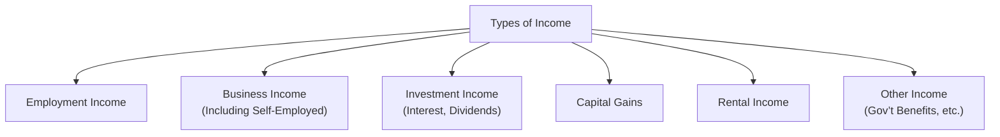

## 4.3 Types of Income

Have you ever paused and thought, “Wow, there are so many ways to earn money—do I report them all the same way to the Canada Revenue Agency (CRA)?” You’re not alone! Many Canadians wonder if income from a weekend side gig must be treated the same as their 9-to-5 paycheck. The short answer: They’re not always the same. Different streams of income often carry distinct tax implications that can be crucial to your financial planning. Understanding these differences is essential not only for filing a correct tax return but also for making smarter spending and investment decisions (because, well, no one wants to deal with avoidable tax headaches).

Below, we’ll explore various income types recognized by the CRA—employment income, business (or professional) income, rental income, investment income (interest, dividends, and capital gains), and more. We’ll also look at unique tax treatments, highlight T-slip classifications, and offer practical tips to help you confidently navigate your own income mosaic in Canada.

---

### Recognized Income Streams (An Overview)

The CRA categorizes income into several broad groups. Each group can have its own specific reporting requirements, deduction opportunities, and tax rate calculations. The main categories are:

- Employment Income  
- Business or Professional Income  
- Investment Income (including interest, dividends, and capital gains)  
- Rental Income  
- Other Income (government benefits and various taxable benefits)

Below is a simple diagram illustrating the key branches of recognized income in Canada:

Let’s break down each category in a bit more detail.

---

### Employment Income

Employment income is typically the easiest for most people to wrap their heads around: wages, salaries, commissions, bonuses—basically anything you earn under an employer-employee relationship. But don’t forget that certain non-cash perks might also count as taxable, such as employer-provided phone plans, the personal use of a company car, or even certain gift cards.

• T4 Slips: In most cases, employees receiving a salary, hourly wage, or commission compensation receive T4 slips from their employer. This slip sums up employment earnings, taxable benefits, and deductions (e.g., Canada Pension Plan (CPP) contributions, Employment Insurance (EI) premiums, and income tax withheld at source).  
• Taxable Benefits: If your job provides a benefit that can be converted to cash or used personally—like free gym memberships or an employer car for personal travel—the CRA generally views that perk as a taxable benefit.  

While you might be slightly bummed to pay taxes on these “extras,” keep in mind that they often come with convenience or cost savings in other areas of life. If you have questions about complex deductions, you can look at the CRA’s guides on employment income for clarifications, or talk to a tax professional for personalized advice.

#### Example:  
Imagine you work as a graphic designer for a marketing firm. Your total annual salary is $45,000, and your employer also covers your cellphone bill. Because you use your phone for personal calls, a portion of that bill is considered a taxable benefit. Your T4 slip will not just capture your salary, but also indicate the dollar value of that phone perk—and yes, you’ll pay tax on it.

---

### Business or Professional Income

Business income refers to what you earn from a self-owned enterprise, whether you’re a sole proprietor, a partner in a partnership, or running an incorporated company. If you’re a self-employed accountant, for instance, the fees you collect from clients count toward your business income. Likewise, if you’re a freelance photographer or own a small café, you’ll report business income instead of employment income.

• T4002 Guide: The CRA’s T4002 (Business and Professional Income) is a handy resource to help you correctly categorize and report business expenses and revenue. It breaks down what counts as deductible and how you can properly track your finances.  
• Self-Employment vs. Employment: Distinguishing between self-employment income and employment income is critical. Self-employed Canadians benefit from broadly deductible expenses (e.g., home office costs, advertising costs, and travel expenses) but must also handle their Canada Pension Plan contributions and taxes differently.  

#### Case Study:  
Let’s say you’re a self-employed interior designer. You work out of your own home and also rent a small studio space for client meetings. Your revenue for the year is $80,000, and you incur $10,000 in eligible expenses (rent, equipment, supplies, advertising, etc.). You’d report $70,000 of net business income ($80,000 minus expenses). On top of that, if you took any personal draws from your business bank account, it doesn’t affect your net income calculation—it’s just money you withdrew. But be sure to keep records of all your transactions so you can survive an audit, if ever.

---

### Professional Income and Incorporation

Certain professionals—like lawyers, accountants, doctors, dentists—may operate through corporations. In these cases, they can choose different compensation mixes:

- Salary  
- Dividends  
- A combination of both  

If they pay themselves a salary, it’s taxed as employment income in the professional’s hands, and the corporation gets a deduction. If they pay themselves dividends, that’s taxed via the dividend gross-up and tax credit system (more on that under Investment Income). Each approach has distinct tax implications, so incorporating can sometimes yield tax-planning benefits. However, it also leads to more filing requirements, such as corporate tax returns (T2) and additional recordkeeping. In other words, you might want to chat with a CPA or tax lawyer if you’re considering incorporating your professional practice.

---

### Investment Income

When it comes to your money growing on its own, there are three major categories of investment income:

1. **Interest Income**  
2. **Dividend Income**  
3. **Capital Gains**  

Each form has distinct tax rules and reporting requirements, so let’s take a quick spin through them.

#### Interest Income

Interest income is often what you earn from bank deposits, GICs (Guaranteed Investment Certificates), or bonds. It’s fully taxable at your marginal tax rate—meaning if you earn $1,000 in interest, you include $1,000 in your overall income.

• T5 Slips: If the interest you earned from a single institution in a given year exceeds $50, the institution usually issues you a T5 slip. That T5 slip forms part of your taxes and ensures you pay the correct amount.

#### Dividend Income

Dividends come from owning shares of Canadian or foreign corporations. Canadian dividends enjoy special tax treatment to help avoid double taxation (since corporate earnings are taxed within the corporation, and again when shareholders receive those earnings as dividends). The mechanics are:

- **Gross-Up**: Your eligible dividend is increased by a certain percentage to approximate pre-tax corporate profit.  
- **Dividend Tax Credit (DTC)**: You then claim a credit to offset part of the tax from the “grossed-up” component.

This might sound a bit complicated at first (it sure did to me!), but it essentially ensures you’re not taxed unfairly on corporate income that’s already been taxed at the corporate level. The net effect is often a lower tax rate on eligible dividends compared to interest income.

#### Capital Gains

A capital gain arises when you dispose of a capital property (like stocks, bonds, mutual funds, or real estate, other than a principal residence) for more than what you paid for it. In Canada, only half of your capital gains are taxable (the 50% inclusion rate). So, if you earn a $10,000 capital gain, only $5,000 is included in your taxable income.

• Capital Losses: If your investment value dropped and you ended up selling at a loss, that capital loss can be used to offset capital gains in the current year or be carried back up to three years (or forward indefinitely).  
• Mutual Funds and Distributions: Mutual funds and exchange-traded funds (ETFs) often distribute capital gains to unitholders. These are typically reported on T3 or T5 slips, depending on the structure. The Commodity Relational Code (CRC) documents can help you further understand how capital gains distributions work for specific funds.

---

### Rental Income

If you own property that you rent out—whether it’s a basement suite, an entire house, or a condo in a trendy part of town—your revenue is considered rental income. From it, you can deduct reasonable expenses like property taxes, repairs and maintenance, mortgage interest, insurance, and utilities (if you’re footing those bills). The net amount (rental income minus expenses) is what gets included in your taxable income.

- **Depreciation (CCA)**: You can also claim Capital Cost Allowance (CCA) on the property, though it’s typically recaptured (added back to income) upon sale. Deciding whether to claim CCA may require more advanced tax planning.  
- **Rental vs. Business**: If you’re doing short-term rentals (e.g., Airbnb) or providing significant additional services (like laundry, cleaning, meals), your rental operation might be considered a business. This classification would shift you from “rental income” to “business income,” changing the way you report it.

---

### Other Income (Government Benefits and Pensions)

The CRA also taxes many forms of government benefits and income supports:

- **Canada Pension Plan (CPP) and Old Age Security (OAS)**: These are taxable benefits. You’ll typically get a T4A(P) for CPP and a T4A(OAS) for OAS, which you include in your total income.  
- **Employment Insurance (EI)**: Also taxable and is reported via T4E slips.  
- **Social Assistance Payments** or certain provincial tax credits: These can have special rules. Sometimes a portion might be nontaxable or only included in certain calculations, so check the guidelines carefully.  

Note that government benefits can also add an extra wrinkle. For instance, OAS might be subject to a clawback if your overall income surpasses a certain threshold.

---

### T-Slip Summaries and Classifications

For clarity, Canada’s tax system uses a variety of T-slips to identify different forms of income:

- **T4**: Employment Income  
- **T4A**: Commission and self-employed or certain pension (e.g., annuity) income  
- **T3**: Income from trusts—including mutual funds, estate income, or investment trusts  
- **T5**: Interest, dividends, and certain foreign income  
- **T5013**: Partnership income  
- **T4A(P) & T4A(OAS)**: Canada Pension Plan and Old Age Security benefits  
- **T4E**: Employment Insurance benefits  

It’s a good idea to guard your T-slips carefully, because they’re among the primary ways the CRA tracks your income. If you lose a slip, you can often retrieve it via your CRA My Account portal or ask the issuer for a replacement.

---

### Tax Planning and Best Practices

1. **Stay Organized**: Maintain separate records for each source of income. That includes all relevant receipts, investment statements, or business invoices. Doing so helps you come tax season.  
2. **Claim Eligible Deductions**: Self-employed individuals should fully explore allowable expenses under the T4002 guidelines. Rental property owners might deduct repairs, property taxes, or mortgage interest.  
3. **Analyze Dividend vs. Salary**: If acceptable for your situation (say, you run a corporation), compare the net effect of paying yourself a salary versus taking dividends or a mix of both.  
4. **Track Your ACB (Adjusted Cost Base)**: Especially for capital gains, keep track of your original purchase price, plus any reinvested distributions. Not doing so can mean over-reporting your gains.  
5. **Use Professional Advice**: Tax rules can be complex—particularly for self-employed or incorporated professionals. An accountant, tax lawyer, or financial advisor can help you tailor a plan that fits your specific goals.  

---

### Special Considerations in the Canadian Regulatory Landscape

Historically, Canada had two self-regulatory organizations (SROs) for oversight of investment dealers and mutual fund dealers: the Investment Industry Regulatory Organization of Canada (IIROC) and the Mutual Fund Dealers Association of Canada (MFDA). As of January 1, 2023, these two have amalgamated into the Canadian Investment Regulatory Organization (CIRO), our single, national SRO for investment dealers, mutual fund dealers, and market integrity. If you pick an advisor to help you with tax or investment matters:

- Confirm they are registered with CIRO if they’re dealing with investment advice.  
- Know that the Canadian Investor Protection Fund (CIPF) is now the sole fund that protects client assets if a CIRO member firm becomes insolvent.  

While CRAs rules around taxable income remain the same, the regulatory environment for financial professionals has changed, so be sure to check ciro.ca for updates or clarifications.

---

### Potential Pitfalls

• **Ignoring Taxable Benefits**: It’s easy to forget that using a company car for personal trips is a taxable benefit, but the CRA won’t forget.  
• **Improperly Classifying Self-Employment vs. Employment**: If you’re claiming business expenses but the CRA deems you an employee, that can trigger audits and reassessments.  
• **Missing T-Slips**: Not reporting all your T-slip income is a common error. Accidental or not, missing reported income can lead to penalties.  
• **Overlooking Adjusted Cost Base**: Failing to maintain accurate ACB records for investments might lead to paying tax on more capital gains than you really realized.  
• **Neglecting Government Benefit Clawbacks**: If you’re near the threshold for an OAS or GIS (Guaranteed Income Supplement) clawback, being strategic with your income streams might save you from a surprise at tax time.

---

### Practical Example

Let’s walk through a quick scenario:

You have a full-time job earning $50,000 (T4 slip). Besides your day job, you occasionally consult as a self-employed IT specialist and earn $15,000 (T2125 business income statement). You also hold some dividend-paying stocks that yield $2,000 in eligible dividends (T5 slip). Finally, you rent your condo’s spare room on weekends, netting $2,400 in annual rental income after modest expenses.

At tax time:  
- You’ll gather a T4 from your employer for $50,000 in wages (plus any taxable benefits).  
- You’ll report $15,000 in self-employment income—minus relevant expenses, let’s say $3,000, leaving $12,000 net.  
- The $2,000 in dividends gets grossed up and you can claim the corresponding dividend tax credit.  
- The $2,400 in rental income goes onto a rental statement (T776 form).  
- Summing it all up, these amounts come together on your T1 General return, and you’re taxed accordingly at your marginal rate, with special treatments for dividends and potential further consideration if the self-employed portion triggers a need for more CPP contributions.

Sure, it’s a bit of juggling, but once you’re familiar with the system, you’ll see that each slip has its rightful place, and each form of income has tailored tax rules.

---

### Additional Resources

• [CRA Guide T4002 (Business and Professional Income)](https://www.canada.ca/en/revenue-agency/services/forms-publications/publications/t4002.html)  
• [CRA Information on Dividend Tax Credit](https://www.canada.ca/en/revenue-agency/services/tax/businesses/topics/corporations/dividends.html)  
• [Tax-Efficient Investing in Canada - RBC](https://www.rbcroyalbank.com/) (and other major Canadian financial institutions publish helpful guides)  
• [CIRO (Canadian Investment Regulatory Organization)](https://www.ciro.ca) – For information on regulations affecting investment dealers and mutual fund dealers  
• Commodity Relational Code (CRC) documents are sometimes available through mutual fund providers or aggregator sites that detail how mutual funds handle distributions, including capital gains.  

Remember, your financial planning journey is unique. Stay curious, stay organized, and never hesitate to reach out for professional help when you’re dealing with multiple income streams or complicated scenarios. 

---

## Test Your Knowledge of Canadian Income Types



### Which of the following best describes employment income?

- [ ] Net rent received from operating a rental property.  
- [x] Wages and salaries received under an employer-employee relationship, including taxable benefits.  
- [ ] Dividends from owning shares of a corporation.  
- [ ] Capital gains realized from selling a vacation property.  

> **Explanation:** Employment income includes wages, salaries, and certain taxable benefits. Rental income, capital gains, and dividends belong in other categories.

### What is one of the main advantages of being self-employed rather than employed?

- [ ] You don’t owe any CPP contributions.  
- [x] You can deduct a wide range of business-related expenses.  
- [ ] You are exempt from filing income taxes if your business is small.  
- [ ] You never have to issue invoices or keep receipts.  

> **Explanation:** Self-employed individuals (business income) can deduct eligible expenses to reduce their net income. However, they are generally responsible for both employer and employee portions of CPP and still need to file taxes with proper documentation.

### Which slip typically reports interest and dividend income?

- [ ] T4  
- [ ] T4A  
- [x] T5  
- [ ] T5013  

> **Explanation:** T5 slips are issued to report most interest and dividend income, whereas T4 is for employment, T4A is for various other income types, and T5013 is for partnership income.

### When an investor realizes a capital gain in Canada, what portion is considered taxable?

- [ ] 0%  
- [ ] 100%  
- [ ] 75%  
- [x] 50%  

> **Explanation:** Only 50% of a realized capital gain is taxable in Canada under current tax rules.

### Which of the following statements about dividends is correct?

- [x] Canadian dividends are subject to a gross-up and tax credit system.  
- [ ] Foreign dividends receive the same dividend tax credit as Canadian dividends.  
- [x] The “gross-up” aims to approximate pre-tax corporate earnings.  
- [ ] The gross-up entirely eliminates taxes on dividends.  

> **Explanation:** Eligible Canadian dividends benefit from a gross-up and tax credit system that approximates integration of corporate and personal taxes. Foreign dividends do not receive the same tax credit.

### What is a taxable benefit in the context of employment income?

- [x] A non-cash or cash-equivalent perk an employer provides that has personal value.  
- [ ] A random allowance that never needs to be reported on a T4.  
- [ ] A government-funded income support program.  
- [ ] U.S. dividends paid to Canadian employees.  

> **Explanation:** A taxable benefit is something of personal value provided to an employee by the employer, such as personal use of a company car or employer-paid cellphone. It needs to be reported as part of employment income.

### Which type of slip you are likely to receive if you earn income from a trust, such as a mutual fund trust?

- [x] T3  
- [ ] T4  
- [x] T5  
- [ ] T5013  

> **Explanation:** You’ll typically receive a T3 for income from trusts. Mutual funds structured as mutual fund trusts often issue T3 slips, whereas T5 might be used in some corporate structures or for direct interest/dividend payments. Also, T5013 is generally for partnership income, and T4 is for employment income.

### Suppose you own a small condo that you rent out. Which of the following statements is true?

- [x] You can deduct eligible expenses like property taxes, insurance, and repairs from your rental income before calculating net taxable income.  
- [ ] You can’t claim any expenses associated with the property.  
- [ ] You must always incorporate your rental activities into a corporation.  
- [ ] Rental income is not subject to Canadian taxes.  

> **Explanation:** Rental income is taxable, but you can deduct a wide range of legitimate expenses before arriving at your net rental income amount.

### What is the role of CIRO (Canadian Investment Regulatory Organization)?

- [x] It is the national self-regulatory body overseeing investment dealers, mutual fund dealers, and market integrity on equity and debt marketplaces.  
- [ ] It’s a private company providing trust services for high net-worth individuals.  
- [ ] It’s a global authority in charge of all financial regulations for G20 nations.  
- [ ] It’s the sole issuer of T-slips in Canada.  

> **Explanation:** CIRO is Canada’s national self-regulatory body that replaced IIROC and MFDA. It oversees registered investment dealers, mutual fund dealers, and related market activities.

### The capital cost allowance (CCA) claimed on a rental property:

- [x] May be recaptured and taxed when the property is sold.  
- [ ] Eliminates the need to report rental income fully.  
- [ ] Reduces the property’s adjusted cost base to $0 immediately.  
- [ ] Is never allowed for residential rental properties.  

> **Explanation:** CCA (depreciation) can be used to reduce rental income in the current year, but it can lead to a recapture of CCA (which is taxed as income) if the property is sold for more than its depreciated value.


