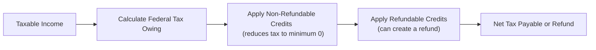

## 4.5 Tax Credits

Sometimes when I think about tax season, I remember the first time I filed my own return. I was, like, totally clueless and just plugged numbers into a free online calculator. I had no idea the difference between reducing my taxable income (via deductions) and lowering my tax payable (via credits). And let me tell you, I paid extra because I didn’t take advantage of credits I actually qualified for—ouch! Since then, I’ve learned a lot about tax credits, and hopefully, by the end of this section, you will too.

Tax credits can be a game-changer in your overall financial plan because they reduce what you owe the government, dollar for dollar—unlike deductions, which merely decrease your taxable income. This section starts with exploring what tax credits are and why they matter, then dives into two main categories—non-refundable and refundable credits. We’ll look at significant credits like the Basic Personal Amount, Charitable Donation Tax Credit, and the Disability Tax Credit. Finally, we’ll consider how provincial credits work and highlight best practices for record-keeping. Understanding all of this helps you or your clients pay the correct amount of tax (and maybe even receive a bit of a refund in the process).

Remember, the information we share here is especially relevant for those involved in the Canadian financial industry—particularly Approved Persons under the Canadian Investment Regulatory Organization (CIRO). By having a firm understanding of the tax credit system, you can provide well-rounded advice to clients, ensuring they’re leveraging every government initiative available to minimize tax burdens within the scope of Canadian rules and regulations.

---

### Overview of Tax Credits

A tax credit is an amount that directly reduces the total tax you owe. Let’s say your calculated federal tax owing is $3,000 and you have $1,000 in tax credits; that can bring your tax owed down to $2,000. These credits can be either non-refundable or refundable:

• Non-refundable: They can reduce your tax payable to a minimum of $0, but they can’t create a negative tax balance or a direct refund if you have no tax owing left to offset.  
• Refundable: They can reduce your tax payable below $0, potentially generating an actual cash refund from the Canada Revenue Agency (CRA).

Tax credits are central to Canadian tax policy, often used to further social and economic objectives—like assisting low-income families or encouraging charitable donations. They also support individuals with long-term disabilities and students incurring educational expenses.

---

### Non-Refundable Tax Credits

Non-refundable tax credits reduce tax liability but stop their benefit once the tax payable hits zero. I still remember a time when, as a student, I realized I had some additional tuition credits left over after eliminating my tax payable—only to discover I couldn’t use them to create a refund. Here are a few popular ones:

• Basic Personal Amount  
• Charitable Donation Tax Credit  
• Tuition Tax Credit  
• Disability Tax Credit  
• Spousal, common-law partner, or eligible dependent credits  

Non-refundable credits are calculated against your federal income tax. Each credit has a specific value determined by a formula (usually the tax credit amount multiplied by the lowest federal or provincial tax rate). Keep in mind that many of these credits also apply province-wide at relevant provincial rates.

---

### Refresher: The Basic Personal Amount

One of the best-known non-refundable credits is the Basic Personal Amount (BPA). This credit is indexed annually, meaning it may increase slightly every year to account for inflation. It is available to all Canadian taxpayers and effectively shelters a portion of their income from tax. So if the BPA stands at, for instance, $15,000 in a given year, that means up to $15,000 of your income is effectively offset for tax purposes by this credit.

Let’s consider a small numerical illustration, just to make sure we’re all on the same page:

Suppose you have $50,000 in taxable income, and the federally mandated Basic Personal Amount is $15,000. Let’s assume the lowest federal tax rate is 15%. The non-refundable credit from the BPA would be $15,000 × 15% = $2,250. You’d subtract that $2,250 straight off your federal tax bill.

Because the BPA is non-refundable, if your taxable income is so low that your total tax liability is wiped out by this credit, you generally can’t receive any additional refund from the unused portion. In other words, the Basic Personal Amount brings your federal tax owing down to zero but not below zero.

---

### Understanding Refundable Tax Credits

Unlike non-refundable credits, refundable credits can actually push your net tax owing below zero and result in a direct payment from the CRA. This is super handy for low-income individuals who may not have much tax owing but still need the income support offered by these credits. Here are some common refundable credits:

• GST/HST Credit  
• Canada Workers Benefit (CWB)  
• Provincial refundable credits (like Climate Action Tax Credit in BC, Ontario Trillium Benefit in Ontario, etc.)

Consider a practical example about the GST/HST Credit:

If you’re a single individual with a modest income, you might be entitled to quarterly installments from the CRA to offset the sales tax you pay throughout the year. If your income is too high, however, you won’t be eligible. That’s how many refundable credits work: they’re designed primarily for low-to-moderate-income Canadians, and their benefit often phases out as your income rises above certain thresholds.

---

### Charitable Donation Tax Credits

If you’ve donated to a registered Canadian charity, you might be in for some pleasant tax relief. The Charitable Donation Tax Credit encourages Canadians to support registered charities by giving them a credit on their donations. Here’s how it works:

• You can usually claim a federal credit at the lowest tax rate for the first portion of donations (up to a set threshold) and then at a higher rate for amounts beyond that threshold, encouraging larger donations.  
• Provinces offer a similar structure, meaning you get both federal and provincial credits.  
• You must keep official donation receipts from the registered charity. Remember, internet crowd-funding donations might not qualify unless they are arranged through registered charitable organizations.

A quick note: The maximum you’re generally allowed to claim on your annual tax return is 75% of your net income for the year, although unused donation credits can often be carried forward for up to five years.

---

### Tuition Tax Credit

If you’re a student enrolled in a post-secondary program at a qualified educational institution, you may claim the Tuition Tax Credit for eligible fees. This is another non-refundable tax credit. If you’re earning low or no income during your study period, you might not use the entire credit this year—but you can carry forward unused credits or transfer them to a spouse, common-law partner, or your parents (subject to specific limits).

I once had a friend, Sarah, who was taking advanced hairstyling courses at a recognized college. She didn’t think “hair school” would count for tuition credits. After all, it’s not your typical “university.” But guess what? Because the college was an eligible Canadian institution, she could claim those fees and reduce her taxable income once she finally jumped into full-time work.

---

### Disability Tax Credit (DTC)

The Disability Tax Credit helps individuals with severe, prolonged (12 months or longer) physical or mental impairments to reduce their taxable income. Qualification hinges on meeting specific medical criteria, all of which needs to be certified by a medical professional. The idea is to recognize that persons with disabilities often face additional expenses and that these costs aren’t fully addressed by other tax measures.

Even if you have no taxable income, you may be able to transfer the DTC to a supporting family member, just like some other non-refundable credits. This is crucial for families supporting children or elderly parents with disabilities who can’t utilize the credit themselves.

For more detailed official info, check out the Government of Canada’s Disability Tax Credit page:  
https://www.canada.ca/en/revenue-agency/services/tax/individuals/segments/tax-credits-deductions-persons-disabilities/disability-tax-credit.html  

---

### Provincial Tax Credits

Although Canada’s federal government defines much of our tax structure, provinces also have their own credits. For instance, Ontario offers the Ontario Trillium Benefit (OTB), which consolidates three credits: the Ontario Energy and Property Tax Credit, the Northern Ontario Energy Credit, and the Ontario Sales Tax Credit. British Columbia has the BC Climate Action Tax Credit. Each province does things a bit differently.

What’s important here is the principle: provinces often direct assistance toward specific conditions like housing affordability, rising energy costs, or climate incentives. These credits may be either non-refundable or refundable, depending on how the province structures them. They’re typically income-tested, meaning the benefit is phased out beyond an income threshold to ensure that assistance is targeted toward those who need it most.

---

### Case Study: Jake’s Surprising Refund

Let’s see how these credits might play out in practice. Suppose Jake, age 28, works part-time and attends a community college, paying $2,500 in tuition for the year. His net income is relatively low because he only works about 24 hours a week. Jake also donates $150 to a local eligible charity. Here’s how some of his credits might shape up:

• Basic Personal Amount: Jake claims the standard BPA, which reduces the first bit of his taxable income.  
• Tuition Tax Credit: He can claim the $2,500 at the applicable federal tax rate, potentially wiping out much of his tax owing. If there’s unused credit, he might carry it forward or transfer it to a supporting parent or spouse.  
• Charitable Donation Tax Credit: He claims the donation, which applies at the lower and then higher federal rates for amounts above the threshold—though $150 might not exceed the threshold, he’ll still get a nice credit.  
• Refundable Credits: If Jake’s income is low, he might be entitled to the GST/HST Credit or similar provincial refundable credits like the Ontario Trillium Benefit.  

At the end of the day, Jake finds he’s actually over-withheld on the taxes on his part-time paycheck, meaning after applying non-refundable credits, he still pays $0 in tax and even gets money back from refundable credits. That’s the power of a well-structured tax credit system.

---

### Keeping Records and Documentation

We’ve all heard those cautionary tales: folks who claimed donation credits without the official receipts, or who tried to claim DTC eligibility without the correct form from a qualified practitioner. Not to be harsh, but the CRA does check for these. You should:

• Keep your donation receipts (notes or scans might suffice, but you might need the originals if CRA specifically asks for them).  
• Have medical verification for the Disability Tax Credit if you’re planning to claim it.  
• Hang on to your T2202 (Tuition and Enrolment Certificate) if you claim tuition.  
• Document your rent or property taxes if you plan to claim certain provincial credits.  

Because the CRA can audit returns or request proof for up to several years back, you’ll want to be well-organized. Keeping an electronic folder labeled “Tax Documentation YYYY” is an easy approach. Then, if the CRA ever does come knocking, you’ve got all your receipts right there, saving yourself heartbreak—and perhaps a big government reassessment.

---

### Possible Pitfalls and Challenges

• Income Thresholds: Many refundable credits phase out for higher earners, so don’t assume you’re always getting that credit unless you confirm your income eligibility.  
• Overlooked Credits: Some might apply to you, like the Disability Tax Credit for a family member, yet it goes unclaimed simply because you never realized you qualified.  
• Changing Rates/Amounts: These credits often change every year or two, especially the Basic Personal Amount, which is indexed to inflation.  
• Provincial Variation: Because each province can have its own credits, you need knowledge of your local system, especially if you move mid-year from one province to another.

---

### Best Practices for Advisors

For Approved Persons under CIRO, providing comprehensive and accurate guidance about tax credits can be a real value-add. Here are a few suggestions:

• Conduct Regular Check-Ins: Encourage clients to do a mid-year tax projection. If they’re close to the threshold for certain benefits, you can advise them on the timing of income or expenses.  
• Educate on Eligibility: Make sure clients know which credits they might be eligible for—especially if they have children, disabilities, or are returning to school.  
• Cross-Reference with Provincial Programs: Being aware of provincial differences can help you tailor advice.  
• Verify Documentation: Remind clients to keep or request receipts. In most cases, no receipt, no credit.  
• Collaborate with Tax Professionals: If you’re not a tax specialist, consider collaborating with one—especially if your client’s situation is complex.  

By staying current on updates, you help clients seamlessly integrate tax credit claims into their broader financial strategies—whether for retirement planning, budgeting, or big life events.

---

### Visual Representation of Tax Credit Flow

Below is a simple Mermaid diagram to illustrate a high-level flow of how an individual’s tax payable might be reduced by both non-refundable and refundable credits:

In short:  
• Start with your taxable income.  
• Figure out federal (and provincial) tax owing.  
• Subtract non-refundable credits.  
• Then subtract refundable credits.  
• Arrive at your final tax payable or potential refund.

---

### Additional Resources

If you’d like to dig deeper, check out these resources:

• CRA Tax Credits Overview:  
  https://www.canada.ca/en/revenue-agency/services/tax/individuals/segments/tax-credits-deductions-individuals.html  
• Government of Canada’s Disability Tax Credit page:  
  https://www.canada.ca/en/revenue-agency/services/tax/individuals/segments/tax-credits-deductions-persons-disabilities/disability-tax-credit.html  
• Provincial government websites (e.g., Ontario Trillium Benefit, BC Climate Action Tax Credit) for localized programs and up-to-date credit amounts and thresholds.  
• Various open-source or official government calculators that help estimate eligibility for refundable credits such as the Canada Workers Benefit.  
• The Canadian Investment Regulatory Organization (CIRO): https://www.ciro.ca for official updates on regulatory responsibilities for Approved Persons.  

---

By understanding how non-refundable and refundable credits work, you can help ensure that neither you nor your clients is paying more tax than necessary. It’s all about knowing and applying the right credits—and following the rules—so you can keep more of your hard-earned money for the things that matter most in life.

## Test Your Knowledge of Canadian Tax Credits



### Which statement best describes a non-refundable tax credit?

- [x] It can reduce federal tax owing to zero but not below.
- [ ] It always results in a tax refund.
- [ ] It is only available for low-income taxpayers.
- [ ] It replaces the Basic Personal Amount.

> **Explanation:** A non-refundable credit can reduce your tax liability, but it will not generate a refund if unused. It simply brings you down to $0 owed.

### Which of the following is an example of a refundable tax credit in Canada?

- [ ] Basic Personal Amount
- [x] GST/HST Credit
- [ ] Disability Tax Credit
- [ ] Tuition Tax Credit

> **Explanation:** The GST/HST Credit is a refundable credit. If you qualify, you can receive a payment even if you have no tax payable.

### What does the Basic Personal Amount typically accomplish for Canadian taxpayers?

- [x] It shelters a portion of income from taxation through a non-refundable credit.
- [ ] It eliminates all tax for everyone.
- [ ] It’s only available if you have children.
- [ ] It applies exclusively to seniors.

> **Explanation:** The Basic Personal Amount is universal and reduces federal tax for all taxpayers. It’s indexed annually but is non-refundable and can’t create a negative tax balance.

### The Disability Tax Credit (DTC):

- [x] Reduces tax for individuals with severe disabilities and can be transferred to supporting family members.
- [ ] Eliminates the need to file a tax return for individuals with disabilities.
- [ ] Is fully refundable, giving a refund to any taxpayer with a disability.
- [ ] Requires no medical documentation.

> **Explanation:** The DTC is non-refundable and transferable. It’s specifically for individuals with severe and prolonged disabilities, requiring certification by an authorized medical practitioner.

### Which of the following statements about charitable donation tax credits is correct?

- [x] They have a two-tier credit rate, offering a higher credit for amounts beyond a certain threshold.
- [ ] They are calculated the same way in every province and territory.
- [x] They require official receipts from an eligible charity.
- [ ] They can eliminate social security contributions.

> **Explanation:** The credit has a two-tier federal rate, and official receipts are crucial. Additionally, provinces apply their own rates.

### What is a key difference between non-refundable and refundable credits?

- [x] Non-refundable credits cannot reduce tax liability below zero, whereas refundable credits can.
- [ ] Non-refundable credits require special forms from a medical practitioner, whereas refundable credits do not.
- [ ] Refundable credits are only available to individuals over 65.
- [ ] Non-refundable credits automatically apply to every taxpayer.

> **Explanation:** Non-refundable credits cannot create a refund if they exceed your liability; refundable credits can generate an actual payment if unused.

### Which of the following is an example of a provincial tax credit program?

- [x] Ontario Trillium Benefit
- [ ] SR&ED program
- [x] BC Climate Action Tax Credit
- [ ] Federal Basic Personal Amount

> **Explanation:** The Ontario Trillium Benefit, BC Climate Action Tax Credit, or similar programs in other provinces are prime examples of provincial tax credits. The Basic Personal Amount is federal.

### What is the main reason many refundable credits have an “income eligibility threshold”?

- [x] They are designed primarily for low-to-moderate-income Canadians.
- [ ] They are meant to encourage only high-income earners to donate more.
- [ ] They only benefit people who own a house.
- [ ] They automatically apply to all taxpayers.

> **Explanation:** Refundable credits such as the Canada Workers Benefit and GST/HST Credit typically focus on helping lower earners. Past certain income limits, the benefits phase out.

### Which of the following best ensures CRA acceptance of claimed credits?

- [x] Retaining all relevant receipts and documentation (donations, tuition, etc.).
- [ ] Filing returns only every two years.
- [ ] Sending in all receipts unsolicited with the tax return.
- [ ] Ignoring your Notice of Assessment.

> **Explanation:** CRA can ask for proof of any claimed tax credit, so keeping the necessary documentation is essential.

### True or False: The Basic Personal Amount (BPA) is indexed for inflation each year.

- [x] True
- [ ] False

> **Explanation:** The BPA typically increases annually in step with inflation, which means the amount you can claim each year may vary.


