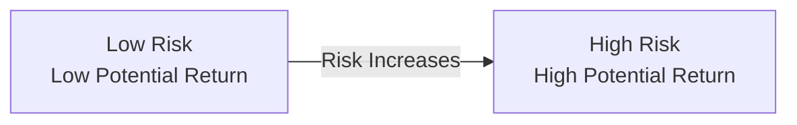

## 5.1 Investment Theory – Risk and Return

Have you ever felt that little jolt of excitement—maybe mixed with a dash of worry—when you bought your first stock or considered an investment opportunity? That mixture of emotions is often tied to the concept of risk and return. We all want favorable returns, but we also know there’s some level of danger that our expectations might not be met.

In this section, we’ll pull back the curtain on the intricate (and sometimes intimidating) world of risk and return. Don’t worry if you’re new to the game or if you’ve been studying finance for years—this explanation aims to strike a friendly, conversational tone while still giving you the meaty details you need. Let’s dive right in.

---

### Understanding the Relationship Between Risk and Return

At its core, risk simply represents the possibility that an investment’s actual return will differ—maybe a little, maybe a lot—from what you expected. Return is typically thought of as the reward for bearing that uncertainty. In an ideal world, you’d want maximum return and zero risk. But, of course, real-world investing is all about trade-offs:

• You can expect higher returns only if you’re willing to tolerate more uncertainty and potential volatility.  
• Lower-risk investments often provide more modest returns, but they also offer a smoother ride along the way.

The risk-return trade-off underpins just about every investing decision. As an advisor or an investor, you’ll confront it in virtually every recommendation or decision you make.

Below is a simple diagram to illustrate the basic idea that, as you move up the risk scale, your potential returns generally rise—but so does the chance of loss.

The arrow highlights that as you take on more risk, the range of possible outcomes widens. Things could go splendidly, or they could go sour.

---

### Measuring Risk: Standard Deviation, Beta, and More

#### Standard Deviation (Volatility)

One of the most commonly used measures of risk is standard deviation. It tells you how widely the returns on an investment vary around the average (or mean) return.

• If returns are tightly bunched around the average, the standard deviation is low, indicating lower volatility.  
• If returns swing all over the place, the standard deviation is high, highlighting a higher degree of uncertainty.

In everyday language, think of it this way: a business that has reasonably stable (though sometimes smaller) returns each year might have a low standard deviation, while a speculative technology startup’s stock price might bounce around wildly, indicating a much higher standard deviation.

#### Beta (Market Sensitivity)

While standard deviation measures absolute volatility, beta focuses on how sensitive a particular investment is to overall market movements. The market itself is usually assigned a beta of 1.0.

• A beta above 1.0 means your investment tends to move more dramatically than the market.  
• A beta below 1.0 indicates it moves less dramatically.  
• A negative beta means it often moves in the opposite direction from the market, which can be useful if you’re seeking diversification.

Understanding how an investment correlates with wider market shifts can help you integrate it into a broader portfolio. If you or your client are risk-averse, you might choose securities and funds with lower betas. Those with a higher risk tolerance and longer time horizons might opt for higher beta holdings for potential greater returns—while accepting bigger swings in value.

#### Variance

Variance is closely related to standard deviation. It’s effectively the square of the standard deviation, offering another way to assess how an asset’s returns scatter around its mean. Numerically, standard deviation is often easier to interpret because it’s expressed in the same units as the asset’s returns (e.g., percentages).  

---

### The Time Value of Money

Okay, let’s switch gears slightly. I remember the first time I lent money to a friend in college. He paid me back six months later, but guess what? For those six months, I didn’t have the money to invest or stash somewhere else. That experience taught me about the time value of money: the principle that a dollar in your hand today is more valuable than a dollar promised to you down the road (because you can invest it right away, or even just let it sit safely in an interest-bearing account).

In evaluating any investment, it’s crucial to discount future cash flows back to the present. Two key tools for doing this:

• Net Present Value (NPV): You calculate the present value of expected cash inflows and subtract your initial outflows. A positive NPV suggests the investment might be worthwhile, while a negative NPV could be a red flag.  
• Internal Rate of Return (IRR): This is the discount rate at which your NPV equals zero. If the IRR is higher than your required rate of return, you might consider moving forward.  

These techniques are especially handy for comparing projects or investments with different time horizons or cash-flow patterns.

---

### Systematic vs. Unsystematic Risk

Financial theory generally breaks risk into two broad categories:

• Systematic Risk (Market Risk): This is the risk that affects the entire market or economy—events like recessions, interest rate shifts, or global pandemics. No matter how many different stocks or bonds you hold, you can’t entirely dodge systematic risk because it arises from macroeconomic factors.  
• Unsystematic Risk (Company-Specific Risk): This is the risk unique to a particular company or industry (e.g., if one technology firm faces a patent lawsuit). Through diversification, you can significantly reduce unsystematic risk by spreading your money across various assets and sectors.

---

### Diversification and Correlation

Here’s a simple truth: if all your eggs are in one basket, you face a higher chance of losing them all should something go wrong. That’s why we diversify. By allocating funds across different asset classes—like equities, bonds, real estate, and cash equivalents—you can lower your overall portfolio volatility.

Correlation is a big deal in diversification. Two assets that are perfectly correlated (correlation coefficient of +1.0) move in lockstep. Assets that are negatively correlated (coefficient of –1.0) move in opposite directions—often beneficial when you want to offset losses in one part of your portfolio with gains or stability in another part.

---

### Risk-Adjusted Performance Measurements

So, you’ve figured out how to measure risk and monitor returns, but how do you know if you’re being compensated appropriately for the risk you’re taking? That’s where risk-adjusted performance metrics come into play.

• Sharpe Ratio:  
  – Formula: (Portfolio Return – Risk-Free Rate) / Portfolio Standard Deviation.  
  – Interpretation: Tells you how much excess return you’re getting per unit of total risk (volatility). A higher Sharpe Ratio is generally more attractive.

• Treynor Ratio:  
  – Formula: (Portfolio Return – Risk-Free Rate) / Portfolio Beta.  
  – Interpretation: Focuses on market risk (beta). This metric can be helpful if you’re comparing different portfolios or funds that might have different exposures to the same broad market.

Both these ratios help you gauge how “efficiently” you’re bearing risk. A big return might look great, but if it came with wild swings and stressful nights, you might reconsider your choice—or at least see if you can achieve a similar return with lower volatility.

---

### Practical Examples and Case Studies

Let’s illustrate with a straightforward scenario:

• Suppose you have $10,000 to invest. You’re comparing two mutual funds—Fund A and Fund B.  
  – Fund A has an average annual return of 8% and a standard deviation of 5%.  
  – Fund B shows an average annual return of 10% and a standard deviation of 15%.  

Clearly, Fund B’s higher average return might look tempting. But the standard deviation indicates that Fund B’s returns can deviate widely from its mean, potentially resulting in big losses in a bad year. If your time horizon is long and your risk tolerance is high, Fund B might still align well with your objectives. If you’re more conservative or closer to retirement, maybe you’d want a steadier (even if somewhat lower) option like Fund A.

Let’s apply a risk-adjusted measure: Suppose we assume a risk-free rate of 2%. The Sharpe Ratios:

• Fund A: (8% – 2%) / 5% = 1.2  
• Fund B: (10% – 2%) / 15% = 0.53  

Fund A’s higher Sharpe Ratio indicates it provides more return per unit of volatility compared to Fund B—even though Fund B’s absolute returns are higher on average. This mismatch can definitely surprise people who chase only the raw returns.

---

### Real-World Scenarios: Ties to Economic Events

• During an economic recession, nearly all equities may tumble—systematic risk in action—so even a well-diversified equity portfolio can take a hit.  
• A natural disaster might damage one company’s operations, but other companies remain unaffected—an example of unsystematic (company-specific) risk.  

Your diversification strategy, time horizon, and risk tolerance all shape how you respond to such events. For instance, long-term investors might temporarily accept paper losses, confident that markets will recover. On the other hand, short-term investors might flee to safer assets to prevent capital erosion.

---

### Balancing Risk Tolerance, Time Horizon, and Objectives

No matter how fancy the metrics get, your (or your client’s) comfort with uncertainty is key. Some people can handle big swings in value without losing sleep, while others crave steadiness. Your time horizon also matters. If you’re saving for a home down payment in a year, you might be more risk-averse than someone investing for retirement 20 years from now.

In practice, consider “stress-testing” a hypothetical portfolio for big losses:  
• How does it fare if there’s a sharp market correction?  
• How does it react to an interest rate hike or a significant global event?  

By modeling these scenarios, you can figure out which strategies can help keep you from panic-selling at inopportune times.

---

### Regulatory Considerations and Canadian Context

As of 2025, all investment dealers and mutual fund dealers in Canada are regulated by the Canadian Investment Regulatory Organization (CIRO). Historically, the Mutual Fund Dealers Association (MFDA) and the Investment Industry Regulatory Organization of Canada (IIROC) existed as separate self-regulatory organizations, but they merged on January 1, 2023, with CIRO as the continuing entity.

CIRO, along with the Canadian Securities Administrators (CSA), provides guidelines on how to communicate risk disclosures and returns to clients. If you’d like to dig deeper:

• Check out the CSA website at [https://www.securities-administrators.ca/](https://www.securities-administrators.ca/) for the latest regulations on risk disclosure.  
• For additional guidelines on managing investment risk and presenting these returns, consult CIRO at [https://www.ciro.ca/](https://www.ciro.ca/).  
• The Canadian Investor Protection Fund (CIPF) now serves as the sole investor protection fund. CIPF steps in to protect client assets if a member firm becomes insolvent.

Being aware of these regulations can help ensure that your risk analysis and communication align with professional and legal standards.

---

### Open-Source Tools and Data

You can tap into a variety of publicly available tools to deepen your analysis:

• Global Financial Data ([https://www.globalfinancialdata.com/](https://www.globalfinancialdata.com/)) provides massive datasets for world markets.  
• The Bank of Canada ([https://www.bankofcanada.ca/](https://www.bankofcanada.ca/)) offers valuable data on interest rates, inflation, and economic indicators.  
• Numerous open-source libraries (found in Python, R, etc.) allow you to calculate metrics like standard deviation, beta, correlation, and even advanced portfolio optimization.

These resources can help you build robust models, track historical trends, and stress-test potential investments without breaking the bank.

---

### Further Reading and Resources

If you’re itching to boost your know-how, here are some suggestions:

• “The Intelligent Investor” by Benjamin Graham. It’s the classic text on value investing and risk management.  
• “A Random Walk Down Wall Street” by Burton G. Malkiel for insight into market efficiency and volatility.  
• The Canadian Securities Institute (CSI) offers deeper dives into measuring and managing investment risks across various courses.

---

### Wrap-Up

The interplay between risk and return is the heartbeat of investing. By understanding core concepts—like standard deviation, beta, systematic vs. unsystematic risk, and the time value of money—you can build more resilient portfolios aligned with your or your clients’ long-term financial objectives. And if you’re an advisor, championing diversification, tracking low or even negative correlations, and knowing how to interpret risk-adjusted metrics like the Sharpe and Treynor ratios can help you present a more finely tuned strategy.

At the end of the day, it’s about balancing comfort with potential reward. Sure, you might earn a little more if you embrace risk wholeheartedly, but you might also wake up in the middle of the night with a knot in your stomach. That’s not fun, let me tell you. An investment that lets you sleep well is often the best bet in the long run.

---

## Test Your Understanding: Risk and Return in Investment Decisions



### Which statement best describes the relationship between risk and return?

- [ ] Higher risk always guarantees higher returns.
- [x] Higher risk can lead to higher returns, but there is also a higher potential for loss.
- [ ] Lower risk leads to zero return.
- [ ] Risk has no direct relationship with potential returns.

> **Explanation:** Higher risk does not guarantee, but it can allow for the possibility of higher returns, balanced by the possibility of bigger losses.

### If a mutual fund typically swings widely in value around its average return, it likely has:

- [ ] A low standard deviation.
- [ ] A near-zero correlation.
- [x] A high standard deviation.
- [ ] A negative beta.

> **Explanation:** Wide fluctuations around the mean (average) suggest a higher standard deviation (volatility).

### Beta is primarily used to measure:

- [ ] Total risk of an investment.
- [ ] The difference between gross and net returns.
- [x] The sensitivity of an investment to market movements.
- [ ] The interest rate risk on government bonds.

> **Explanation:** Beta shows how much an investment can be expected to move relative to the broader market.  

### Which type of risk can be significantly reduced by diversification?

- [ ] Market risk (systematic).
- [x] Unsystematic risk (specific).
- [ ] Inflation risk.
- [ ] Liquidity risk.

> **Explanation:** Unsystematic risk is particular to a firm or industry and can be reduced by spreading investments across different assets.

### What does a beta of greater than 1.0 indicate?

- [ ] The investment is risk-free.
- [x] The investment is more volatile than the market.
- [x] The investment may offer higher potential returns than the market, but at greater risk.
- [ ] The investment is negatively correlated with the market.

> **Explanation:** A beta above 1.0 suggests the investment moves more aggressively and may see higher highs and lower lows compared to the overall market.

### The Sharpe Ratio is calculated by:

- [ ] Standard Deviation ÷ Return.
- [x] (Portfolio Return – Risk-Free Rate) ÷ Standard Deviation.
- [ ] (Portfolio Return – Market Return) ÷ Beta.
- [ ] (Beta – 1.0) ÷ Market Volatility.

> **Explanation:** The Sharpe Ratio measures how much excess return is received for each unit of volatility.

### What is the main difference between systematic and unsystematic risk?

- [x] Systematic risk affects the entire market, while unsystematic risk affects specific companies or sectors.
- [ ] Systematic risk can be fully diversified away, while unsystematic risk cannot.
- [x] Systematic risk is also known as market risk, while unsystematic risk is company-specific.
- [ ] There is no difference; they are the same concept.

> **Explanation:** Systematic risk is market-wide and cannot be diversified away, whereas unsystematic risk is company-specific and can be reduced by diversification.

### Which of the following is used to discount future cash flows to the present?

- [ ] Beta.
- [ ] Correlation coefficient.
- [ ] Standard deviation.
- [x] Net Present Value (NPV).

> **Explanation:** NPV is used to find the present value of future cash flows, taking into account the time value of money.

### When an asset tends to move in the exact opposite direction of another asset (e.g., one goes up, the other goes down), we say:

- [ ] They have a correlation of +1.
- [ ] They have no correlation at all.
- [x] They have a correlation of –1.
- [ ] They are partially correlated.

> **Explanation:** A perfect negative correlation is indicated by –1, meaning they move in precisely opposite directions.

### Diversification is most effective when:

- [x] Assets in the portfolio have low or negative correlations.
- [ ] All assets in the portfolio have high positive correlations.
- [ ] Assets chosen are from the same industry to maintain consistency.
- [ ] You only hold one type of security to minimize complexities.

> **Explanation:** Diversification aims to include assets whose returns do not move together, thereby reducing overall volatility.


