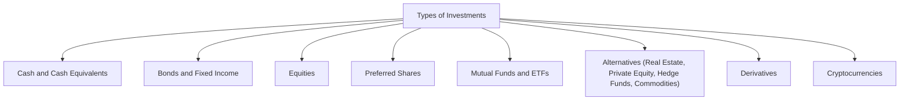

## 5.2 Types of Investments

So, picture yourself sitting at your kitchen table, sipping coffee (maybe decaf if you’re sensitive to caffeine like I am), and sorting through a stack of financial brochures, each one promising a path to prosperity. It can be overwhelming—trust me, I’ve been there! The key is to break down these investment options one by one, understand what they bring to the table, and figure out which ones make sense for your (or your client’s) objectives, timeline, and risk tolerance. That’s what we’ll do here, slowly and logically, exploring the main types of investments you’ll likely come across in the Canadian marketplace (and even some global ones).

This section aims to give you a solid foundation. For each category, we’ll cover some defining characteristics, typical risk/return profiles, how you might incorporate them into your portfolio, and pitfalls to avoid. Let’s dive in.

---

## Cash and Cash Equivalents

Cash and cash equivalents represent the investment world’s version of a comfy couch—safe, stable, and handy when you need immediate funds. These include things like Treasury bills (T-bills), money market funds, and high-interest savings accounts. 

### Key Features and Benefits
• Liquidity: They are super liquid, meaning you can access your money quickly to cover emergencies or sudden purchases.  
• Lower Volatility: Values rarely fluctuate, so your principal is generally secure.  
• Stability: Ideal for storing short-term funds or creating an emergency buffer.  

### Risks and Drawbacks
• Low Returns: Typically lower than bonds or equities. Over the long haul, inflation can erode purchasing power.  
• Opportunity Cost: Sticking too much in cash might mean missing out on higher returns from other asset classes.  

### Practical Example
Let’s say you’re saving for a vacation in six months. You might park your money in a high-interest savings account or a short-term GIC (Guaranteed Investment Certificate) rather than investing in something volatile like stocks. This ensures your funds are safe and accessible when booking that flight and hotel.

---

## Fixed-Income Investments (Bonds and Debentures)

Fixed-income investments are the “steady paycheck” of the investment world. When you invest in a bond, you’re lending money to a government or corporation. In return, you typically get fixed interest payments (called coupon payments) and the eventual return of your principal at maturity.

### Types of Fixed-Income
• Government Bonds: Issued by federal, provincial, or municipal governments. Generally considered lower risk, but yields may also be relatively lower.  
• Corporate Bonds: Issued by companies. Higher yields than government bonds, but with more risk.  
• Debentures: Unsecured bonds that rely on the lender’s faith in the issuer’s credit quality, rather than any specific collateral.

### Key Features
• Predictable Income: The coupon rate is often fixed, providing stable cash flow.  
• Hierarchy of Claims: Bondholders get paid before shareholders if a company defaults.  
• Maturity Dates: You typically know when you’ll get your principal back.  

### Risks
• Interest Rate Risk: If interest rates rise, the value of existing bonds (with lower rates) can drop.  
• Credit Risk: The bond issuer could default. Ratings from agencies like DBRS Morningstar (in Canada) or S&P help gauge this risk.  
• Reinvestment Risk: If interest rates fall, reinvesting coupon payments might yield a lower return.

### Real-World Perspective
I remember my grandparents always favored government bonds. They liked the predictability, even though the returns weren’t super high. For them, the peace of mind was worth it. With corporate bonds, you might earn more, but you’re also taking on more risk. It’s all about balance.

---

## Equities (Stocks)

Equities are about owning “little pieces” of a company. They can deliver significant growth, but they also come with higher risk. 

### Why Invest in Stocks?
• Potential for Capital Appreciation: Over the long term, historically, equities have outperformed most other asset classes.  
• Dividend Income: Some companies, especially well-established ones, pay regular dividends.  
• Partial Ownership: As a shareholder, you have voting rights and a claim to the company’s earnings and assets.

### Risks
• Volatility: Stock prices can fluctuate dramatically based on market sentiment, economic indicators, and corporate performance.  
• Business Risk: If the company underperforms or goes bankrupt, shareholders are last in line for claims.  
• Market Risk: Factors like inflation, interest rates, or global events can drive stock prices up or down.

### Strategy Tips
Many folks use a “buy and hold” strategy for core positions in stable blue-chip companies while dabbling in growth stocks for extra returns. Or they might employ dollar-cost averaging—investing a set amount of money at regular intervals—to smooth out price swings.

---

## Preferred Shares

Preferred shares lie somewhere between stocks and bonds. They resemble equities in that they represent ownership, but they act more like bonds because they pay a fixed dividend.

### Characteristics
• Fixed Dividends: Preferred shareholders typically receive a set dividend, which may be cumulative (i.e., unpaid dividends accumulate and must be paid before common dividends).  
• Priority: They rank above common equities for dividend payments and in the event of liquidation.  
• Sensitivity to Interest Rates: Because of their fixed-income-like structure, preferred shares can decline in value when interest rates rise.

### Use Cases
Preferred shares are often favored by investors seeking a higher yield than most bonds or GICs, combined with some of the benefits of equity ownership. However, remember they can be less liquid and can carry interest rate and credit risks.

---

## Mutual Funds and Exchange-Traded Funds (ETFs)

Mutual funds and ETFs let you buy into a basket of assets with a single purchase. They pool money from multiple investors and invest according to a specific mandate (e.g., Canadian equity, global fixed-income, technology sector).

### Mutual Funds 
• Active vs. Passive: Some mutual funds are actively managed by portfolio managers aiming to outperform a benchmark. Others, known as index funds, track market indexes with minimal human intervention.  
• Pricing: Mutual funds are typically priced once a day at their Net Asset Value (NAV).  
• Fees: Usually have a management expense ratio (MER) that includes management fees, trailing commissions, and operational costs.

### ETFs
• Trading on an Exchange: ETFs trade like stocks throughout the day.  
• Lower Costs: Many ETFs, especially index-based ones, tend to have lower management fees compared to mutual funds.  
• Diverse Strategies: You can find ETFs for almost any sector, theme, or strategy—broad market, sector-specific, commodity-backed, or even leveraged/inverse strategies.

### Why Invest in Funds?
• Diversification: Rather than buying individual stocks or bonds, you can gain broad exposure to a market with less capital and time.  
• Professional Management (for mutual funds): Ideal for those who prefer not to handle research and portfolio construction themselves.  
• Liquidity and Transparency (for ETFs): You see real-time prices, and can buy or sell intraday.

### Selecting a Fund
Check the fund’s investment objective, manager track record, fees, and holdings. Compare it to other funds with a similar focus. Tools like Morningstar (https://www.morningstar.ca/) and Fund Library (https://www.fundlibrary.com/) are great for quick performance snapshots and peer comparisons. And always be mindful of CIRO rules (https://www.ciro.ca/) on fund distributions, disclosures, and suitability.

---

## Alternative Investments

Alternative investments include real estate, private equity, hedge funds, commodities, and more. Many of these are less liquid and carry unique risks, but they can also provide diversification benefits and potentially higher returns.

### Real Estate
In real estate, you might invest in physical property (rental homes, commercial buildings) or through Real Estate Investment Trusts (REITs).  
• Income Generation: Rental income.  
• Capital Appreciation: Property values can rise over time.  
• Liquidity Concerns: Direct ownership is less liquid and comes with maintenance costs, property taxes, etc.

### Private Equity
Invest in private companies, often through specialized funds.  
• High Risk-High Reward: Potential for large returns if the company grows or goes public.  
• Long Lock-Up Periods: Your money might be tied up for years.  
• Expertise Needed: Thorough due diligence is critical.

### Hedge Funds
Fairly flexible investment vehicles that can invest in anything from stocks and bonds to derivatives, currencies, and arbitrage opportunities.  
• Complex Strategies: Could use short-selling, leverage, or derivatives to generate returns regardless of market direction.  
• Higher Fees: Often use a “2 and 20” model (2% management fee + 20% on profits).  
• Regulatory Considerations: Often limited to accredited investors (due to complexity and risk).

### Commodities
Invest directly in materials like gold, oil, wheat, or indirectly through futures contracts, ETFs, or commodity companies.  
• Global Supply and Demand: Prices can move due to geopolitical shifts, weather, or technological changes.  
• Diversification: Commodities often behave differently from stocks and bonds.

---

## Derivatives (Options, Futures, Swaps)

Derivatives get their value from an underlying asset (like a stock, bond, or commodity). They can be used to hedge risks or to speculate on price movements. Because of their complexity and leverage, they can be risky if not used properly.

### Options
• Call Options: Give the holder the right, but not the obligation, to buy an asset at a specified price within a certain period.  
• Put Options: Give the holder the right to sell an asset at a specified price.

### Futures
• Standardized Contracts: To buy or sell an asset at a future date at a predetermined price. Common in commodities but also used on indexes and currencies.

### Swaps
• Interest Rate Swaps: Parties exchange cash flows based on fixed and floating interest rates.  
• Currency Swaps: Exchange of principal and interest in one currency for principal and interest in another.

### Key Considerations
• High Leverage: Small price movements can lead to outsized gains or losses.  
• Margin Calls: You may need to post additional collateral if a position moves against you.  
• Regulatory Oversight: Derivatives are closely monitored by Canadian regulators; always comply with CIRO and relevant securities commissions.

---

## Cryptocurrencies and Digital Assets

As you’ve likely heard, cryptocurrencies like Bitcoin and Ethereum turned heads with dramatic price swings—sometimes up, sometimes (very) down. They’re enabled by blockchain technology and exist outside traditional banking systems.

### Potential Advantages
• High Growth Potential: Crypto values have risen sharply in certain periods, attracting speculative interest.  
• Diversification: Their price movements don’t always track with traditional markets.  
• Innovation: Underlying blockchain tech has applications across various industries.

### Challenges
• Volatility: Prices can surge or drop by double-digit percentages in a single day.  
• Regulatory Uncertainty: Canadian regulators are still outlining best practices. The Canadian Securities Administrators (CSA) regularly issue updates (https://www.securities-administrators.ca/).  
• Security Concerns: Storing crypto assets securely requires specialized “wallets”; hacking risks exist on some trading platforms.

### If You’re Curious
Consider crypto only if you’re prepared for potential significant losses and you thoroughly understand blockchain technology. Many financial professionals recommend keeping it as a small portion of a diverse portfolio.

---

## Constructing a Balanced Portfolio

The ultimate goal in combining these assets is to create a diversified portfolio that aligns with your (or your client’s) financial goals, risk tolerance, and time horizon. Here’s a quick look at how these investments might fit together:

• A younger investor with a long-term horizon might lean heavily toward equities for growth, plus some fixed income for stability.  
• A retiree might favor more fixed-income and cash for predictable income, sprinkling in some equities to keep pace with inflation.  
• Individuals looking for diversification or uncorrelated returns might add real estate or commodities.  
• Those with specialized knowledge might use derivatives for hedging or to generate incremental income (e.g., selling covered calls).

No matter the allocation, always check fees, do thorough due diligence, and consider regulatory guidelines. CIRO (https://www.ciro.ca/) oversees investment dealer and mutual fund dealer regulations in Canada. They publish rules and guidelines that can significantly affect product distribution and licensing requirements.

---

## Common Pitfalls

• Overconcentration: Investing too heavily in a single sector, asset class, or type of security can magnify losses.  
• Knee-Jerk Reactions: Jumping in and out based on market hype or panic leads to poor timing decisions.  
• Ignoring Fees: High fees eat into returns. Make sure you understand all expense ratios, loads, or commissions.  
• Lack of Research: Don’t invest in complex products (options, leveraged ETFs, hedge funds) without understanding risks, margin requirements, or liquidity.  

---

## Strategies for Success

• Start with a Plan: Outline your objectives, risk tolerance, and timeline.  
• Diversify: Spread your investments across multiple asset classes, sectors, and geographic regions.  
• Rebalance Regularly: If equity markets soar, your portfolio may need rebalancing to stay aligned with your target allocation.  
• Stay Informed: Keep up with regulatory changes from CIRO or the CSA, as these can impact your opportunities or obligations.  
• Seek Professional Advice: If you’re unsure, consulting a qualified financial planner can save you from costly mistakes.  

---

## Tools and Resources

• CIRO (https://www.ciro.ca/): For regulatory rules, investor alerts, and guidelines on mutual funds, ETFs, and more.  
• Canadian Securities Administrators (CSA) (https://www.securities-administrators.ca/): Coordinated approach to securities regulation across provinces.  
• Morningstar (https://www.morningstar.ca/) and Fund Library (https://www.fundlibrary.com/): For fund comparisons, performance tracking, analytics.  
• Open-Source Portfolio Management: Platforms like QuantConnect (https://www.quantconnect.com/) or Portfolio123 (https://www.portfolio123.com/) let you test strategies.  
• Government and Real Estate Resources: Provincial land registry systems, local municipal websites for property taxes, zoning, and regulations.  

---

## Final Thoughts

Anyway, the world of investments can be both exciting and nerve-wracking. I still remember back in the 2010s, I impulsively threw some spare cash into a tech startup’s crowdfunding campaign. It didn’t exactly pan out, but it taught me a valuable lesson about the importance of research and diversification. Whether you’re buying a bond, trading an ETF, or venturing into cryptocurrency, it’s crucial to remember that every investment comes with risk—and reward potential. A well-thought-out plan, a willingness to learn, and maybe a supportive financial advisor will help keep you (and your clients) on the right track.

Be sure to review each potential investment’s merits, stay aware of regulatory guidance, and never put all your eggs in one basket. With a bit of patience and some strategic decision-making, you’ll be able to piece together a robust portfolio that aligns with your financial goals and risk comfort level.

---

## Test Your Knowledge: Comprehensive Investments Quiz



### Which of the following is classified as a cash equivalent?  
- [ ] Preferred shares  
- [x] Treasury bills  
- [ ] Long-term corporate bonds  
- [ ] Common equities  

> **Explanation:** Treasury bills are highly liquid short-term debt instruments, often considered a “cash equivalent” due to their liquidity and stability.

### What is a typical characteristic of a corporate bond compared to a government bond?  
- [x] Higher yield, but also higher credit risk  
- [ ] Lower yield, but zero credit risk  
- [ ] Requires no interest payments  
- [ ] Backed by a government guarantee  

> **Explanation:** Corporate bonds usually offer higher yields but carry greater risk of default compared to government bonds.

### Which of the following statements about equities is accurate?  
- [x] They can offer dividend income and potential capital appreciation but come with higher volatility  
- [ ] They guarantee fixed returns over time  
- [ ] They are free from market risk  
- [ ] They tend to have lower returns than fixed income instruments  

> **Explanation:** Equities (stocks) often provide dividend income and the potential for capital appreciation, but price volatility and market risk are typically significant.

### Which type of share commonly pays a fixed dividend and ranks ahead of common shares in liquidation?  
- [ ] Common shares  
- [x] Preferred shares  
- [ ] Convertible debentures  
- [ ] Treasury shares  

> **Explanation:** Preferred shares combine features of equities and fixed-income instruments, generally paying a fixed dividend and ranking above common shares for payout.

### When comparing mutual funds and ETFs, which statement is true?  
- [x] ETFs are typically bought and sold throughout the trading day, whereas mutual funds are priced once daily.  
- [ ] Mutual funds usually trade intraday like stocks.  
- [ ] ETFs always charge higher fees than mutual funds.  
- [ ] Mutual funds provide no diversification while ETFs do.  

> **Explanation:** ETFs are traded on an exchange intraday, while mutual funds are priced once per trading day at Net Asset Value (NAV).

### Which might be considered an “alternative investment”?  
- [ ] Money market funds  
- [x] Real estate  
- [ ] Corporate bonds  
- [ ] Government T-bills  

> **Explanation:** Real estate is categorized as an alternative investment, offering different risk/return dynamics and lower liquidity than traditional assets like stocks or bonds.

### Which of the following best illustrates the use of derivatives for hedging?  
- [x] A wheat farmer sells futures contracts to lock in a price for a future harvest.  
- [ ] An investor buys a stock hoping its price will rise.  
- [x] An investor buys a call option purely for speculative gain.  
- [ ] A retiree invests in GICs for steady interest income.  

> **Explanation:** Selling futures can lock in a guaranteed price, helping the farmer avoid large losses if wheat prices drop. (Note: Buying a call might be more speculative than hedging, hence not the best example. However, some might use calls for partial hedging, but here the best hedging example is the wheat farmer.)

### Which potential benefit do commodities bring to a portfolio?  
- [x] Diversification  
- [ ] Guaranteed returns  
- [ ] Zero volatility  
- [ ] Immunity to global economic factors  

> **Explanation:** Commodities generally move based on supply and demand in global markets, and can behave differently than stocks or bonds, offering diversification.

### What is one major concern with cryptocurrencies?  
- [x] Extreme volatility and regulatory uncertainty  
- [ ] Guaranteed returns above inflation  
- [ ] No security considerations are necessary  
- [ ] They are fully insured by the Canadian government  

> **Explanation:** Cryptocurrencies can experience wide price swings, and regulatory stances continue to evolve, adding extra layers of uncertainty. They are not insured by the government.

### True or False: A diversified portfolio across different asset classes can help manage overall risk.  
- [x] True  
- [ ] False  

> **Explanation:** Diversification can spread risk across different types of assets, industries, and regions, often reducing the impact of a decline in any single area.


