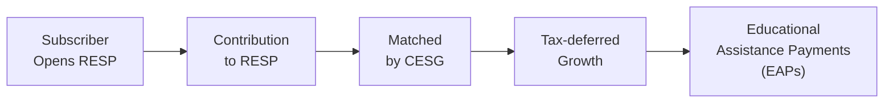

## 5.3 Registered Education Savings Plans (RESPs)

Have you ever found yourself daydreaming about helping someone you care about—maybe a niece, nephew, or your own child—get through college or university without carrying mountains of debt? Well, that’s pretty much what led me to explore Registered Education Savings Plans (RESPs) in more detail. I remember, years ago, I started an RESP for my own cousin. Honestly, I was a bit clueless at first. Questions popped up like, “How do I invest the funds?” or “Wait, do I get a tax deduction for this?” or “What’s this CESG I keep hearing about?” Over time, though, I learned that RESPs are absolutely central to education planning in Canada. So, if you’re looking to give someone you love a solid financial head start for post-secondary education, stick around. We’ll dig into the nuts and bolts of how RESPs work, what you need to watch out for, and how to maximize those sweet government incentives.

### Why RESPs Matter

An RESP is a tax-deferred savings vehicle specifically designed for funding post-secondary education in Canada. Think of it as a helpful box where you put money in and watch it grow, thanks to government grants and tax-sheltered returns. Contributions themselves aren’t tax-deductible (so you won’t see a reduction in your taxable income like with RRSP contributions), but the investment growth in the plan can compound tax-free until it’s withdrawn. Then, when it’s withdrawn for educational purposes, the growth portion (and the government incentives) are taxed in the hands of the student, who usually has a lower tax rate or sometimes no taxable income at all.

This structure can make a huge difference. By shifting the taxable income from the subscriber (the contributor) to the student, the tax bite is often minimal. For a lot of people, the star attraction is the Canada Education Savings Grant (CESG), which matches 20% of yearly contributions up to certain limits. It’s basically free money, which can really add up over the years.

### Key Features

RESPs might sound complex—or maybe just slightly confusing if you’re hearing about them for the first time. Let’s map out a few features that typically iron out the bigger questions.

• Tax-Deferred Growth: While inside an RESP, the investments grow sheltered from tax. This is a huge advantage because it allows for compounding returns over many years.  
• Government Grants: The Canada Education Savings Grant (CESG) is like an added bonus. Depending on your contribution, you might get up to $500 of CESG money each year, with a lifetime maximum of $7,200 per beneficiary.  
• Contribution Flexibility: You can pick which RESP structure suits your situation. Some allow you to contribute at your own pace, while others have more regimented contribution schedules.  
• Benefit for Student: The idea is that once the student is attending a qualifying post-secondary institution, they can start receiving Educational Assistance Payments (EAPs). The EAP portion is taxed in the student’s hands—potentially resulting in minimal or no tax at all.  

Let’s visualize the big picture of how an RESP works with a diagram:

In this flowchart:  
A is the subscriber (the person who opens and contributes to the plan).  
B represents contributions made by the subscriber.  
C is the Canada Education Savings Grant.  
D shows that these contributions and grants all grow tax-free.  
E is when the funds are paid out to cover education costs.

### Government Incentives: The CESG (and Beyond)

Let’s talk money—or free money, more precisely. The Canada Education Savings Grant (CESG) is easily one of the biggest draws for people opening an RESP. Essentially, the government matches 20% of your annual contributions up to $2,500 each year. That means if you deposit $2,500 into an RESP for your child, the government tosses in an extra $500. Over time, it’s possible to “catch up” on unclaimed CESG from previous years, provided certain conditions are met. 

You may also come across the Additional CESG or the Canada Learning Bond (CLB), which are aimed at families with lower incomes. The extra amounts can further boost the value of an RESP. The government changes thresholds and specifics from time to time, so it’s always wise to stay updated through the official Employment and Social Development Canada (ESDC) website at https://www.canada.ca/en/employment-social-development/services/learning.html.

### Types of RESPs

Sometimes people get confused about the different “flavors” of RESPs. The truth is, each type is suited for different family structures and preferences. Let’s break them down.

#### Individual Plan

An individual plan is straightforward: you open the RESP for a single beneficiary. The subscriber can be anyone—often a parent, but it could be an aunt, uncle, or even a family friend wanting to help out. This plan offers flexibility in how much you contribute and how you invest. You hold the reins in investment decisions and can vary the timing and amounts of your deposits. If you’re the type who wants direct control or you’re specifically saving for a single child, this is likely your go-to.

#### Family Plan

A family plan is designed for multiple siblings. It’s sometimes referred to as a great “large family” solution: you can have multiple beneficiaries—as long as they are related to you by blood or adoption. One key advantage is that if one child doesn’t go to post-secondary, the funds can potentially be used by another beneficiary in the plan. Also, CESG grants can be shared among eligible siblings, so it can be a more flexible option if you have more than one child or you’re a grandparent looking to help all your grandkids.

#### Group Plan (Scholarship Plan)

Ever seen advertisements for “pooled” or “group” education savings plans? These are often offered by scholarship plan dealers. In these plans, your contributions get combined with those of other subscribers. The plan manager invests the funds based on a specific strategy that’s often more conservative (particularly as the beneficiary nears university age). One caveat: group plans can come with stricter timelines and withdrawal schedules. You might also face higher upfront fees or more complex rules on how EAPs are disbursed. While these plans can encourage disciplined savings, the restrictions might not appeal to everyone. 

### Contribution Limits and Government Grants

There is a lifetime contribution limit of $50,000 per beneficiary (to avoid over-contribution penalties). That sets an upper cap on how much you can stash into an RESP for a single person. Now, it might take you a while to hit that $50,000 mark, especially if you’re also aiming to maximize the CESG in smaller yearly increments. 

As already mentioned, the government offers a 20% matching grant on your contributions through the CESG, with a maximum annual grant of $500 if you contribute $2,500 or more per year. Over a beneficiary’s lifetime, that CESG can total $7,200 in government contributions. Even if you decide to front-load your contributions in the first few years, remember that the CESG is still doled out each year in increments up to that annual maximum. So a strategic approach might be to contribute at least $2,500 a year (if you can afford it) to collect the full $500 in matching.

### Tax Implications

RESP contributions are made with after-tax dollars, meaning no immediate deduction for the subscriber. However, here’s where the magic happens: any growth and grants remain sheltered from taxes while in the plan. When the funds are later withdrawn to pay for qualifying educational expenses, the portion that represents growth and grant money is taxed in the beneficiary’s hands.

If the beneficiary is a typical student, possibly working part-time or just starting out, their marginal tax rate might be zero or quite low. As a result, the overall tax burden may be negligible. Meanwhile, the subscriber has enjoyed years of compounding growth in an environment free of annual tax drag.

A small note: if the beneficiary doesn’t use the plan or doesn’t pursue qualified education, you could face certain consequences like repaying grant money to the government or paying tax on the accumulated investment earnings if you wind up withdrawing them personally. Always consult with a tax professional or do thorough research on the Canada Revenue Agency (CRA) website (https://www.canada.ca/en/revenue-agency.html) to stay on top of the rules.

### Practical Example and Case Study

Let’s imagine you’re a parent named Alison, who has a 2-year-old daughter, Emily. Alison has decided to contribute $2,500 a year into an Individual RESP for Emily. Each time Alison contributes $2,500, the CESG adds $500. If we keep things super simple, and ignore possible investment returns for a moment:  
• After 10 years, Alison will have contributed $25,000, and the CESG will have added a total of $5,000. That’s already $30,000.  
• By the time Emily turns 18, if there have been modest investment returns in an equity or balanced fund, the value of the plan can be significantly higher.  
• When Emily enrolls in a qualified post-secondary program, she can start withdrawing EAPs. Those EAPs will be taxed in Emily’s hands, and if Emily has minimal income while she’s in college or university, she might pay little to no tax.  

It’s this combination of grant incentives, tax-deferred growth, and potential zero or very low taxation on withdrawal that makes RESPs so attractive for education saving.

### Best Practices

• Start Early: Time is your friend. Even modest monthly contributions can lead to a meaningful sum when combined with government grants and compound growth over many years.  
• Max Out the CESG: Aim to contribute at least $2,500 per year to collect the full available 20% federal match ($500). If you miss a year, see if you can “catch up” in a later year (though there’s a yearly limit to how much you can catch up on).  
• Choose Investments Wisely: Depending on the time horizon and your risk tolerance, you may opt for equity funds, bonds, or GICs. Diversification reduces risk. Your approach should align with your investment goals and the beneficiary’s age.  
• Keep an Eye on Deadlines: Generally, you can only collect CESG grants until the beneficiary turns 17. So if you wait too long to set up an RESP, you might miss out on valuable government funds.  
• Stay Updated: Regulations, contribution limits, and grant details can change over time. Make sure to stay updated through official government pages or your financial advisor.

### Potential Pitfalls and Challenges

• Over-Contribution: If you exceed the $50,000 lifetime contribution limit, you’ll face penalty taxes. Double-check your limits before making any lump-sum contributions.  
• Not Understanding Group Plans: Many people sign up for group (scholarship) plans without fully appreciating the strict rules on withdrawals or fees. It’s essential to read the fine print or consult with someone who knows the details.  
• Missing Out on CESG: Some families don’t realize they should be making additional contributions each year to get the maximum $500 match. If you don’t contribute enough, you miss out on that year’s full government match.  
• Changing Beneficiaries: Sometimes, you might want to switch the beneficiary or add siblings in a family plan. This can complicate how grants and earnings are allocated. Make sure you understand these rules.

### The Role of Advisors and Regulatory Considerations

RESPs involve careful investment decision-making, timing, and knowledge of government incentives. This is where a financial advisor may come in, offering guidance about asset allocation and helping you manage risk. Advisors in Canada operate under the regulatory framework of the Canadian Investment Regulatory Organization (CIRO). As of January 1, 2023, the Mutual Fund Dealers Association of Canada (MFDA) and the Investment Industry Regulatory Organization of Canada (IIROC) have amalgamated to form CIRO, which is now the national self-regulatory organization overseeing investment dealers, mutual fund dealers, and marketplace integrity.

For many Canadians, an advisor registered with a CIRO member firm can steer them toward suitable investments within an RESP, factoring in risk tolerance, time horizon (the child’s age), and personal preferences. If you’re considering a scholarship plan, it’s best to consult with a scholarship plan dealer, too, and verify that they adhere to the relevant disclosure requirements. Keep in mind that the Canadian Investor Protection Fund (CIPF) is now the single investor protection fund, ensuring eligible customer accounts if a member firm fails financially.

### Real-World Scenarios and Relatable Analogies

Sometimes, I compare saving in an RESP to planting a tree in your backyard. You plant it when the tree is just a small sapling (that’s your early contribution). You water it regularly (regular deposits), and the government helps out by adding extra nutrients like fertilizer (the CESG). Over time, as the tree grows, it provides a nice shady spot (the tax-deferred investment growth). When it’s time to actually enjoy the shade (post-secondary education), you get to sit under that tree (the funds go to the student), and the best part is they’re not paying hefty taxes on that shade. That’s the gist of what RESPs do: they support the growth of an educational fund so it’s ready to do its job when the beneficiary heads off to college, university, or any other eligible program.

### Tools and Additional Resources

• Government of Canada’s Learning Hub: Visit ESDC’s site at https://www.canada.ca/en/employment-social-development/services/learning.html for official RESP details.  
• Canada Revenue Agency: CRA’s official portal at https://www.canada.ca/en/revenue-agency.html provides tax guidelines on RESP contributions and withdrawals.  
• Income Tax Act: This is the legislative framework that underpins the tax treatment of RESPs. Check it out if you need the finer legal details.  
• CIRO: For regulatory updates and investor protection information, go to https://www.ciro.ca.  
• Calculators: The Government of Canada also provides tools (such as the former “CanLearn” site) to help you approximate future education costs. Third-party online calculators (e.g., Wealthsimple’s RESP calculator) can be very handy for modeling different contribution levels and growth scenarios.

### Putting It All Together

RESPs can feel a bit like a jigsaw puzzle with tax rules, grant details, and variable withdrawal conditions. But once you see the pieces click into place, you realize what a fantastic vehicle this is for easing the burden of higher education costs. In just a few years, your child, grandchild, niece, or nephew might say, “Hey, thanks for helping me graduate without a mountain of student debt!” And that feeling is priceless.

RESPs align well with other segments of your holistic financial plan. Sometimes, after discussing investment strategies (Chapter 5.1: Investment Theory – Risk and Return, or 5.2: Types of Investments), it becomes clearer how an RESP is part of a larger mosaic that includes TFSAs, RRSPs, or even more specialized accounts. The idea is to plan not only for your child’s academic future but also for your own retirement (Chapter 6: Retirement). Because, let's face it, balancing both goals is a common challenge.

In the end, if you’re uncertain, consider talking to a qualified financial planner or advisor to ensure you’re maximizing your contributions, capturing the full grants, and aligning the investments with your personal preferences. A little mindful planning can go a long way in setting up future generations for success.

-----

## Test Your Knowledge: Registered Education Savings Plans (RESPs) Quiz



### Which of the following best describes the tax treatment of RESP contributions?

- [ ] Contributions are tax-deductible for the subscriber.  
- [x] Contributions are not tax-deductible, but investment earnings are tax-sheltered.  
- [ ] Contributions are taxed twice, both at deposit and at withdrawal.  
- [ ] Contributions are tax-deductible only up to $500 annually.  

> **Explanation:** RESP contributions are made with after-tax dollars and are not tax-deductible. However, any earnings accumulate tax-free in the plan.

### When do you typically pay taxes on the income earned within an RESP?

- [ ] Immediately upon deposit into the plan.  
- [ ] Annually, based on capital gains.  
- [x] When payments are made to the beneficiary in the form of EAPs.  
- [ ] Never—RESP earnings are always tax-free.  

> **Explanation:** Investment growth and grants within an RESP are taxed in the beneficiary’s hands when withdrawn as Educational Assistance Payments (EAPs), typically at a lower tax bracket.

### What is the current lifetime contribution limit per beneficiary for an RESP?

- [ ] $25,000  
- [ ] $40,000  
- [ ] $60,000  
- [x] $50,000  

> **Explanation:** The lifetime contribution limit for an RESP is $50,000 per beneficiary. Exceeding this can result in penalty taxes.

### How does the Canada Education Savings Grant (CESG) generally work?

- [x] The federal government matches 20% of your annual contributions up to a maximum of $500 per year.  
- [ ] The federal government contributes a flat $1,000 annually.  
- [ ] The provincial government directly contributes 15% to your RESP.  
- [ ] The federal government provides refunds of taxes paid.  

> **Explanation:** The CESG matches 20% of your annual contributions, up to $500 per year, with a lifetime limit of $7,200 per beneficiary.

### Which type of RESP plan is specifically designed to benefit siblings of the same family?

- [ ] Individual Plan  
- [x] Family Plan  
- [ ] Group Plan  
- [ ] Universal Plan  

> **Explanation:** A Family Plan can include multiple beneficiaries who are siblings (by blood or adoption), allowing greater flexibility in sharing contributions and grants among them.

### In a Group (Scholarship) Plan, which of the following is true?

- [x] Contributions from different subscribers are pooled and invested under a common strategy.  
- [ ] You have complete autonomy over investment choices.  
- [ ] There is no restriction on withdrawal timelines.  
- [ ] Over-contribution penalties do not apply.  

> **Explanation:** Group plans pool contributions under a preset investment strategy, often resulting in a more structured and sometimes restrictive approach compared to Individual or Family Plans.

### Who is the person responsible for opening and contributing to an RESP?

- [x] The subscriber  
- [ ] The beneficiary  
- [x] A scholarship plan dealer  
- [ ] The Canada Revenue Agency  

> **Explanation:** The subscriber is the individual who opens the plan and makes contributions on behalf of the beneficiary. Scholarship plan dealers, by contrast, are organizations that administer group RESP plans.

### Which organization replaced MFDA and IIROC as Canada’s single self-regulatory body in 2023?

- [x] CIRO (Canadian Investment Regulatory Organization)  
- [ ] CIPF (Canadian Investor Protection Fund)  
- [ ] OSFI (Office of the Superintendent of Financial Institutions)  
- [ ] They remain separate as MFDA and IIROC  

> **Explanation:** Effective January 1, 2023, the MFDA and IIROC amalgamated into the Canadian Investment Regulatory Organization (CIRO).

### Which of the following is the maximum lifetime CESG a beneficiary can receive?

- [x] $7,200  
- [ ] $3,500  
- [ ] $10,000  
- [ ] $15,000  

> **Explanation:** The CESG has a lifetime limit of $7,200 per beneficiary, even if contributions exceed this grant threshold over time.

### Is the amount of money withdrawn from an RESP for education always taxable to the subscriber?

- [x] True  
- [ ] False  

> **Explanation:** The growth and grants portion of Educational Assistance Payments (EAPs) are taxable to the beneficiary (student), not the subscriber. The subscriber’s original contributions are withdrawn tax-free but do not result in any tax deductions when contributed.


