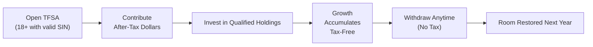

## 5.4 Tax-Free Savings Accounts (TFSAs)

You know, it’s funny—when I first heard the term “tax-free,” I got excited. Free is always good, right? Well, in the case of Tax-Free Savings Accounts (TFSAs), “tax-free” can really live up to the hype. This powerful savings vehicle has been a game-changer for many Canadians since it arrived on the scene in 2009. In this section, we’re going to explore all things TFSA: how they work, where they fit in a financial plan, and, yes, some of the pitfalls that can (unfortunately) come along for the ride. But trust me, once you get the hang of how TFSAs operate, you’ll see why they could be one of the most valuable pieces of your overall investment puzzle.

Let’s dive in.

---

### Overview of TFSAs

A Tax-Free Savings Account (TFSA) is a registered account that the Canadian government introduced back in 2009 to encourage individuals to save money in a tax-efficient way. Unlike contributions to an RRSP, which can be tax-deductible, TFSA contributions are made with after-tax dollars. But the real perk is that your investments grow tax-free inside the account, and any withdrawals you make—whether that’s tomorrow or 40 years from now—are also completely tax-free. The TFSA doesn’t just apply to savings accounts, either. You can hold various qualified investments inside your TFSA: stocks, bonds, mutual funds, ETFs, GICs, and more.

Since TFSAs have no restrictions on when or why you withdraw funds, many people use them for short- and medium-term goals like saving for a vacation, a car, or an emergency fund, while still enjoying the chance to invest for long-term growth. Heck, some folks even use them for retirement savings, especially if they worry about future tax brackets or want flexible access to their money.

---

### Key TFSA Features

1. **Eligibility Requirements**  
   Anyone who is a Canadian resident, aged 18 or older, and has a valid Social Insurance Number (SIN) can open a TFSA. It’s that simple. Now, the age of majority does differ in some provinces—if you’re 18 but the age of majority is 19 in your province, your contribution room still accumulates at 18, even though you might only be able to open a TFSA at 19. Once you’re in, it’s yours for life, buddy.

2. **After-Tax Contributions**  
   Unlike RRSPs, you don’t get an immediate tax deduction when you make a TFSA contribution. So if you contribute $6,500 this year (just as an example figure), there’s no direct tax break now. However, every bit of growth from that point on is tax-free, and all future withdrawals remain tax-free. This flexibility can be huge if you need your funds down the line—no penalty or added tax to worry about, and as you’ll see shortly, withdrawals also don’t affect income-tested government benefits.

3. **Carry-Forward Room**  
   Haven’t contributed the maximum to your TFSA in previous years? No worries. Unused contribution room automatically carries forward indefinitely. That means you can catch up at any time if you’ve missed past contribution opportunities. It’s almost like your TFSA is tapping you on the shoulder saying, “Hey, you still have a chance to stash more cash here!” 

4. **Withdrawals**  
   This is a biggie: *All* withdrawals from a TFSA are tax-free, and, in many cases, withdrawals are added back to your contribution room for the following year. If you withdraw $3,000 this year, your contribution room for next year effectively increases by that amount (on top of the new annual limit the government sets). From a planning standpoint, this can be ideal for folks who expect to need to dip into their investments.

5. **No Impact on Federal Benefits**  
   Another perk, TFSAs *don’t* affect your eligibility for federal income-tested benefits or tax credits—this includes programs like Old Age Security (OAS) and the Guaranteed Income Supplement (GIS). In other words, if you’re worried that taking money out of a registered plan might bump you into a higher income bracket or reduce your government benefits, the TFSA can help mitigate that risk.

---

### Contribution Limits and Rules

The Canadian government sets a maximum annual contribution limit each year. The TFSA was first introduced in 2009 with a limit of $5,000. Over time, this annual limit has been adjusted for inflation and government policy changes. Be sure to check the current contribution limit on the official Canada Revenue Agency (CRA) website or the Government of Canada’s announcements.

Say, for example, that in a certain year the contribution limit is $6,500. If you only manage to contribute $2,500, your remaining $4,000 essentially becomes “unused contribution room” that carries forward. Next year, if the annual limit rises (let’s say to $6,600), you would be eligible to contribute that new limit *plus* the unused $4,000, for a total potential of $10,600 that year. This can help you play catch-up if you need.

**A Simplified Formula** to keep track of your new contribution room each year could look like:


\text{New Contribution Room} = (\text{Unused Contribution Room from Prior Years}) + (\text{Current Year Limit}) + (\text{Amount Withdrawn in Previous Year})


Just keep an eye on it. You definitely don’t want to overshoot your contribution room.

---

### Over-Contributions and Penalties

Now, if you **do** overshoot your allowed contribution limit—even by a tiny amount—the Canada Revenue Agency (CRA) charges a penalty. Specifically, you’ll generally face a tax of 1% per month on the highest excess amount in each month. Trust me, you don’t want to do that. Over time, that penalty can pile up and it’s just not worth it. 

As an advisor, tracking your clients’ contributions across multiple institutions can get tricky, especially if they hold TFSAs at different banks or credit unions. Encourage them to check the CRA’s My Account portal or to keep personal records, so you’re all on the same page.

---

### Qualified Investments and Asset Mix

TFSAs can hold many of the same “registered” investments you can put into an RRSP or RESP:

- Cash (Savings Accounts)
- Bonds (Government and Corporate)
- Stocks (Listed on a designated stock exchange)
- Exchange-Traded Funds (ETFs)
- Mutual Funds
- Guaranteed Investment Certificates (GICs)

Because any earnings are tax-free, TFSAs can be especially valuable for assets with high growth potential (e.g., equities). However, you also want to match the investment risk to the investor’s goals. If your client needs the money in, say, six months, might be a good idea to keep it in something more stable like short-term GICs or high-interest savings solutions. 

**Foreign Dividends Consideration**  
If you hold foreign stocks in your TFSA, you might be subject to foreign withholding taxes on dividends. For dividends from U.S. corporations, for instance, there’s no treaty that fully exempts TFSAs from withholding taxes the way RRSPs might be exempt. So you may end up losing a portion of the dividend yield. As always, weigh the pros and cons before placing foreign dividend-paying stocks inside a TFSA.

---

### Case Study: Emily’s Vacation Fund

Let’s see how a TFSA might work in practice:

• **Beginnings**: Emily, age 25, decides she wants to save for a big trip to Europe. She opens a TFSA as soon as she’s eligible and contributes $5,000.  
• **Investing**: Instead of just leaving the money parked in a standard savings account, she invests in a balanced mutual fund. Over the course of three years, her account grows to $6,200 thanks to market gains.  
• **Withdrawal**: Emily withdraws the entire $6,200 to fund her plane tickets and hotels for her trip. She pays zero tax on that withdrawal.  
• **Room Restoration**: Here’s the best part: the amount she withdrew—$6,200—will be added back to her available contribution room the following year. So she can rebuild her savings without losing that space for good.

Now, imagine Emily invests in a more volatile equity fund, and the money grows even faster. She could have used that money for school, a house down payment, or left it to keep compounding tax-free for the long haul. The TFSA is *that* flexible.

---

### Best Practices and Common Pitfalls

1. **Keep an Eye on Contribution Room**  
   Over-contribution penalties aren’t fun. Try to maintain a detailed record or use the CRA’s My Account tool, which provides your total TFSA room each year. If you’re ever unsure, wait until you find out your updated limit.

2. **Match Your Asset Mix to Your Goal**  
   Because TFSAs revolve around flexibility, it’s easy to get carried away investing in high-risk assets for short-term goals, or overly conservative assets for long-term goals. Always align the time horizon and risk tolerance with your chosen investments.

3. **Use It for Both Short and Long-Term**  
   A TFSA can simultaneously serve as an emergency fund, a vacation fund, or a retirement supplement. However, don’t get so whimsical that you lose track of your bigger objectives.

4. **Estate Planning**  
   Depending on your province, naming a spouse or common-law partner as a “successor holder” may allow them to take over the TFSA upon your passing without any tax implications—often bypassing probate. Non-spouse beneficiaries may receive the proceeds tax-free, but the account itself won’t remain a TFSA for them in most cases.

5. **Watch for Provincial Nuances**  
   While TFSAs are governed federally, some provinces have important legal differences or additional estate laws that can come into play. If you’re not sure, consult an estate lawyer or a qualified financial planner.

6. **Avoid Frequent Trading**  
   Though not typically an issue for most TFSA users, if the CRA determines that your TFSA is used for “carrying on a business” (i.e., day-trading or flipping stocks frequently in a manner that suggests professional activity), the tax agency might argue those earnings are not all tax-free. This scenario is relatively rare, but it’s worth noting if you’re actively trading in your TFSA.

---

### TFSA Structure – A Visual Overview

Below is a simplified diagram to illustrate the progression of a TFSA: from opening one, to contributing, to investing, and eventually withdrawing. This visual might help underscore the flexibility of the TFSA.

In this flowchart, notice how once you withdraw, the “restored space” doesn’t get added immediately. Instead, it’s typically added back to your contribution room at the *start* of the next calendar year. However, you can always confirm how much you can contribute within the same year by checking your specific situation with CRA records.

---

### TFSA in the Context of Other Registered Plans

TFSAs are not the only game in town when you’re aiming to invest in a tax-friendly structure. A few other registered accounts exist, each with its own pros and cons:

- **RRSP (Registered Retirement Savings Plan)**: Contributions are tax-deductible, but withdrawals are taxed. Great for deferring taxes until retirement. Best for individuals who expect to be in a lower tax bracket after they stop working.
- **RESP (Registered Education Savings Plan)**: Specifically for educational savings. Contributions aren’t tax-deductible, but withdrawals of growth and grant money are taxed in the student’s hands, often at a lower rate.
- **RDSP (Registered Disability Savings Plan)**: For Canadians with disabilities. It offers special government grants and bonds.

TFSAs stand out, though, for their sheer flexibility and the fact that no tax is levied on withdrawals. Balancing how much you put into a TFSA vs. an RRSP or RESP typically depends on your current tax bracket, your future plans, and how soon you might need that money.

---

### Regulatory Environment and Protection

The Canada Revenue Agency (CRA) regulates TFSAs from a tax perspective. Financial institutions offering TFSAs in 2025 must also comply with the rules enforced by the Canadian Investment Regulatory Organization (CIRO), which took over the roles of the Investment Industry Regulatory Organization of Canada (IIROC) and the Mutual Fund Dealers Association of Canada (MFDA) as of 2023. 

On the investor protection side, the Canadian Investor Protection Fund (CIPF) is now Canada’s sole investor protection fund, providing coverage if a member firm becomes insolvent. Although CIPF coverage does not protect against losses arising from market volatility, it does safeguard your account assets if your investment dealer fails. For official information, check out CIRO’s resource page at https://www.ciro.ca.

---

### Practical Considerations for Advisors

1. **Client Discovery**  
   Right from the start, figure out your client’s goals. Are they saving for something immediate, like a wedding or a home renovation? Or are they building up for retirement? That will determine the type of investments you or they might choose in the TFSA.

2. **Monitoring Contribution Room**  
   Advisors aren’t automatically privy to their clients’ exact TFSA room unless the client shares that info. Encourage them to keep records or log into My Account on the CRA site regularly. One small slip-up can lead to big penalty taxes.

3. **Asset Allocation**  
   For more aggressive, long-term growth, TFSAs are often used for higher-volatility investments since all that growth remains tax-free. For a client who simply wants a liquidity buffer, a cash-based or GIC-based TFSA might make sense.

4. **Estate Planning**  
   Don’t forget to talk about successor holder vs. beneficiary designations. A spouse or common-law partner can become the new owner, continuing the account’s tax-free status. Seek legal counsel for provincial differences and best practices.

5. **Tax-Efficient Retirement Tool**  
   TFSAs can complement RRSPs if you expect your marginal tax rate in retirement to be high or at least comparable to your working years. Withdrawals from TFSAs won’t reduce your eligibility for OAS, GIS, or other income-tested benefits.

6. **Use Technology**  
   Financial planning software (e.g., Snap Projections, RazorPlan) can help visualize scenarios:  
   • If a client maxes out their TFSA for 20 years.  
   • If they withdraw lumps for big purchases halfway through.  
   • If they integrate TFSA with their RRSP to balance pre- and post-retirement tax optimization.  

---

### TFSA Glossary

• **Contribution Limit**: The annual maximum dollar amount you can contribute to your TFSA in a calendar year, determined by the Canadian government.  
• **Unused Contribution Room**: Carries forward any unused space from prior years indefinitely. Withdrawals also get re-added (the next year) to your contribution room.  
• **Account Holder**: The individual who owns the TFSA. This person controls the contributions, withdrawals, and the investments within the account.  
• **Over-Contribution**: Putting in more money than your total contribution room allows, leading to penalty taxes.  
• **Qualified Investments**: Acceptable asset classes you can hold in your TFSA (like mutual funds, ETFs, stocks from recognized exchanges).  
• **Estate Considerations**: TFSAs can be passed on to heirs. Naming a spouse as successor holder allows the account to remain a TFSA. Non-spousal beneficiaries typically receive funds directly and tax-free, but the account is closed.  

---

### Summary

Tax-Free Savings Accounts (TFSAs) open the door to flexible, tax-free investment growth. Whether you’re saving for a car, a rainy-day fund, or your golden years, the TFSA can shoulder multiple financial objectives all at once. As a financial advisor—or a self-directed investor—you can leverage TFSAs to tailor solutions that complement the rest of your (or your client’s) portfolio. The big secret sauce here is understanding the rules: keep track of contribution limits, be mindful of over-contributions, and invest according to your time horizon and risk tolerance. If you do things right, TFSAs can free up huge potential for financial growth—without that dreaded tax bite.

---

### References and Resources

• **CRA TFSA Guidelines**:  
  https://www.canada.ca/en/revenue-agency/services/tax/individuals/topics/tax-free-savings-account.html

• **Government of Canada** (For current annual contribution limits):  
  https://www.canada.ca

• **CIRO** (For best practices, regulatory oversight, and investor protection policies):  
  https://www.ciro.ca

• **Financial Planning Tools**  
  - Snap Projections: https://www.snapprojections.com  
  - RazorPlan: https://www.razorplan.com  

• **Canadian Securities Institute (CSI)**: Offers advanced strategies for integrating TFSA with other investment vehicles.

• **Estate Planning Services**: Consult legal experts for provincial details regarding probate, successors, and beneficiary designations.

If you’re just starting out, you only need to remember: TFSAs provide a unique blend of tax freedom and flexibility that can be tailored to almost any financial goal. Let’s keep these in your toolbox whenever you plan for the future—no matter how foreseeable or unexpected it may be.

---

## Test Your Knowledge: TFSA Essentials and Strategies



### Which of the following best describes a Tax-Free Savings Account (TFSA)?

- [ ] A registered account where contributions are tax-deductible, and withdrawals are taxable.
- [x] A registered account where contributions are made with after-tax dollars, and withdrawals are tax-free.
- [ ] A registered account available only for education savings.
- [ ] A registered account only available to individuals over age 65.

> **Explanation:** A TFSA is funded with after-tax dollars, grows tax-free, and withdrawals are tax-free.

### What happens if you do not use all your TFSA contribution room in a given year?

- [ ] It expires at the end of the year.
- [x] It carries forward indefinitely and can be used in future years.
- [ ] It must be donated to a registered charity.
- [ ] It reduces the following year’s contribution limit.

> **Explanation:** Unused TFSA room rolls forward indefinitely. It never expires.

### Which of the following statements about TFSA withdrawals is correct?

- [ ] Withdrawals can only be made after age 71.
- [x] Withdrawn amounts are tax-free and are added back to your contribution room the following year.
- [ ] Withdrawals from a TFSA are subject to a 10% early withdrawal penalty.
- [ ] Withdrawals can only be re-contributed after five years.

> **Explanation:** TFSA withdrawals are always tax-free, and the amount withdrawn is added to your next year’s contribution room.

### True or False: Holding foreign dividend-paying stocks in a TFSA may result in foreign withholding taxes on the dividends.

- [x] True
- [ ] False

> **Explanation:** TFSAs don’t benefit from the same tax treaties that sometimes exempt RRSPs from foreign dividend withholding taxes.

### In the event of your passing, naming your spouse as the “successor holder” of your TFSA generally means:

- [x] They can seamlessly take over the TFSA and maintain its tax-free status.
- [ ] They must withdraw all money and pay taxes on the gains.
- [x] They continue holding the account under their name without triggering probate.
- [ ] They are ineligible to receive any of the TFSA funds.

> **Explanation:** Designating a spouse or common-law partner as the successor holder allows them to take ownership of the TFSA upon your death, preserving the account’s tax-free nature and often bypassing probate.

### Which government body regulates the tax aspects of TFSAs?

- [x] The Canada Revenue Agency (CRA)
- [ ] The Department of Finance
- [ ] The provincial securities commissions
- [ ] Canada Mortgage and Housing Corporation (CMHC)

> **Explanation:** The CRA oversees tax rules related to TFSAs.

### If you over-contribute to your TFSA, which of the following penalties may apply?

- [x] A 1% monthly penalty tax on the highest excess amount.
- [ ] A 5% penalty on overall portfolio value.
- [x] An additional administrative fee charged by the bank of your TFSA.
- [ ] No penalties for over-contributions.

> **Explanation:** The CRA imposes a 1% per month penalty on the entire over-contributed amount. Some financial institutions might also charge administrative fees if they handle the correction process.

### Which of the following investments can be held within a TFSA?

- [x] Mutual funds
- [ ] Real estate properties not traded through a REIT
- [ ] Artwork and collectibles
- [x] GICs

> **Explanation:** Qualified investments include common investment vehicles such as mutual funds, stocks, bonds, GICs, and certain ETFs. Physical real estate, artwork, or collectibles usually don’t qualify.

### Why might a TFSA be a good choice for an investor who anticipates remaining in a high tax bracket during retirement?

- [x] Withdrawals from a TFSA do not add to taxable income.
- [ ] TFSA contributions are tax-deductible, which helps reduce high tax rates.
- [ ] TFSAs convert to RRSPs automatically at retirement, locking in a lower tax rate.
- [ ] TFSAs offer lower interest rates, which help avoid higher taxes.

> **Explanation:** Because withdrawals from a TFSA aren’t considered taxable income, they won’t push the retiree into a higher bracket nor reduce income-tested government benefits.

### TFSA withdrawal amounts affect federal income-tested benefits like OAS or GIS.

- [x] False
- [ ] True

> **Explanation:** TFSA withdrawals do not count as income for OAS or GIS purposes, making the TFSA an attractive tool for retirees.


