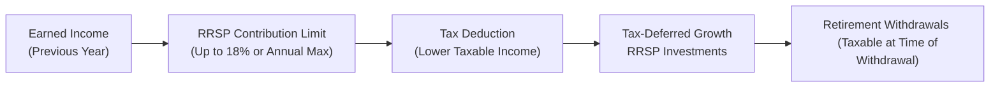

## 6.1 Registered Retirement Savings Plans (RRSPs)

There’s a certain buzz I get when I talk with people about Registered Retirement Savings Plans (RRSPs). Maybe it’s because, over the years, I’ve seen how a well-structured RRSP strategy can transform someone’s financial future. Let’s walk through the essentials—step by step—on how RRSPs work, how to maximize them, and, just as important, how to avoid common mistakes.

Overview

You’ve probably heard this many times: an RRSP is a tax-deferred savings vehicle designed to encourage Canadians to build a retirement nest egg. “Tax-deferred” basically means any growth your investments generate inside the plan is not taxed until you withdraw it—ideally, in retirement, when your marginal tax rate might be lower. While it might sound complicated at first, understanding the logic behind RRSPs can make those conversation-stopping money discussions a lot more comfortable.

Eligibility and Contribution Limits

Before you embark on hefty contributions, you have to confirm how much you can actually deposit. The Canada Revenue Agency (CRA) calculates your annual RRSP contribution limit, commonly called “contribution room,” based on your previous year’s earned income. Typically, your maximum allowable contribution for a given year is “18% of your previous year’s earned income or the annual maximum dollar limit (indexed each year), whichever is lower,” plus any unused contribution room. If you haven’t contributed in prior years, all that unused portion carries forward indefinitely. This means you could see a larger chunk of contribution room available in the future if you skip or under-contribute this year.

The Role of Earned Income

If you’re unfamiliar with the term, “earned income” for RRSP purposes generally includes your income from employment, self-employment, or business. For instance, if you worked as a freelance writer last year—earning $60,000—then your basic contribution limit for this year is about 18% of that $60,000, or $10,800, subject to the annual maximum. The CRA then subtracts any pension adjustments (if applicable) and adds back any unused contribution room from prior years to finalize your actual RRSP deduction limit.

Here’s a KaTeX formula that captures the deduction limit in a more mathematical way:

$$
\text{RRSP Deduction Limit} = \min\left( 0.18 \times \text{(Previous Year's Earned Income)}, \text{Annual Maximum} \right) + \text{Unused RRSP Contribution Room}
$$

Contribution Strategies and Catch-Up

One advantage of RRSPs is that you don’t have to use up all your contribution room in one year. Unused room can be carried forward indefinitely. It’s sort of like a rainy-day coupon you can use when you have extra funds. Some folks purposefully wait until they’re in a higher tax bracket to contribute, in order to maximize the tax deduction effect. Others contribute on a more consistent monthly basis—like paying a utility bill—to smooth out market volatility and ensure they never miss the annual deadline. Figure out which approach fits your financial style best. Some people find monthly or bi-weekly contributions align well with their paychecks, making the process feel less burdensome.

The Mechanism of Tax-Deferred Growth

You might be wondering: why does “tax-deferred” matter so much? Well, by allowing your investments within the RRSP to grow without attracting annual taxes, your returns can compound more efficiently. This is a big deal because every dollar that doesn’t go to taxes remains in your account, boosting your investment base. The difference between tax-deferred growth and paying annual tax on capital gains or dividends can be enormous over a couple of decades.

Below is a straightforward flowchart that shows how money moves through an RRSP. The round trip starts with your earned income and ends with your withdrawals during retirement:

• A (Earned Income) – The foundation that determines your annual contribution limit.  
• B (RRSP Contribution Limit) – The maximum you can deposit each year.  
• C (Tax Deduction) – Reduces your taxable income in the year of contribution.  
• D (Tax-Deferred Growth) – Your investments grow sheltered from tax.  
• E (Retirement Withdrawals) – You pay taxes only when withdrawing funds, presumably at a lower tax rate in retirement.

Withdrawals and Withholding Taxes

Speaking of withdrawals: yes, your money is effectively “locked” in the sense that you’ll face tax consequences if you take it out early. Early RRSP withdrawals are considered income, which means you’re taxed at your marginal rate—plus you’ll usually see a withholding tax applied by your financial institution right away. If you withdraw $10,000 early, for example, you likely won’t see that entire $10,000 in your bank account because some portion is withheld to go directly to the CRA in anticipation of your tax liability.

Now, that might deter you from tapping this money for anything other than retirement, but it’s still possible to take advantage of certain programs that allow penalty-free withdrawals (if you qualify and adhere to repayment schedules).

Special RRSP Programs: HBP and LLP

Two popular programs let you withdraw funds from your RRSP without immediate tax consequences, provided you repay the amounts within specific deadlines.

• Home Buyers’ Plan (HBP): This plan allows first-time homebuyers—or those who haven’t owned a home in at least five years—to withdraw up to a certain amount (currently $35,000) from their RRSP. You’ll be required to repay the funds over 15 years. This can give you a solid initial boost for a down payment. It’s a nice perk, especially for younger folks aiming for their first big property purchase.

• Lifelong Learning Plan (LLP): This plan allows you or your spouse/common-law partner to withdraw from your RRSPs to finance full-time education or job-training programs. You have up to 10 years to repay the funds. Depending on your unique career goals, the LLP can be an excellent strategy to upgrade your skills without piling on traditional student debt.

Spousal RRSP

If you’re in a marriage or common-law partnership where one spouse earns significantly more than the other, a spousal RRSP can be a powerful income-splitting strategy. The higher-earning spouse contributes to an RRSP in the lower-earning spouse’s name, effectively reducing the contributor’s taxable income for that year. Down the road, when withdrawals happen (hopefully in retirement), the funds will be taxed under the lower-earning spouse’s presumably lower tax rate—if certain holding period rules are met before withdrawals occur. It’s a pretty neat move to level the playing field between partners, especially if you anticipate a wide gap in your retirement incomes.

Asset Allocation within an RRSP

I once chatted with a friend who said, “Okay, I put money into my RRSP and get a tax deduction—now what? Does it just stay as cash?” The short answer: definitely not, unless you specifically want it to remain in cash. An RRSP is essentially a “container” or “wrapper,” meaning you can hold many different investment vehicles inside it—GICs, bonds, mutual funds, exchange-traded funds (ETFs), or even equities, depending on your investment style and risk tolerance.

Selecting your asset mix requires considering the time horizon (i.e., how far away retirement is) and your comfort with risk. Younger folks often tilt more toward growth-oriented assets (like equities), whereas those closer to retirement might shift to more conservative or income-focused holdings (like bonds or GICs). And you know, it’s not always a set-and-forget approach: many experts recommend rebalancing your portfolio periodically to maintain the risk level you’re aiming for.

Key Deadlines

Remember that special line on your calendar: the RRSP contribution deadline. Typically, you have until 60 days after the end of the calendar year to contribute to your RRSP for the prior tax year. For instance, if you want to claim a deduction on your 2025 taxes, you’d generally have until about early March 2026 to make that RRSP contribution. Missing that cutoff means you’d only be able to deduct the contribution on the following year’s return (unless you still have unused room and prefer to carry it forward).

Common Pitfalls

• Contributing Erratically or Not at All: Some folks get excited, make a lump-sum deposit one year, then forget to contribute for several years. Consistency wins the day—consider setting up an automated plan.  
• Overcontributing: The CRA allows for a $2,000 overcontribution buffer (without penalty) over your limit, but exceeding that by more than $2,000 typically results in financial penalties.  
• Dipping into RRSP Funds without Good Reason: Other than the HBP or LLP, an early withdrawal can be costly and hamper your long-term compounding.  
• Not Planning for Retirement Income Splitting: Overlooking spousal RRSPs can mean losing out on future tax savings.  
• Misaligned Investments: Holding only extremely conservative assets if you have a 30-year horizon might not help your savings grow at the pace you truly need.

Practical Example: Combining Contribution Room and Tax Savings

Imagine you earned $70,000 last year, and thus have an RRSP limit of roughly $12,600 (i.e., 18% of $70,000) plus $5,000 of unused room from previous years, for a grand total of $17,600. If you decide to deposit the full $17,600 in the current year, you’ll see that amount deducted from your taxable income. So if your marginal tax rate is around 30%, that’s a noticeable saving. Furthermore, that entire $17,600 can now keep compounding inside the account until you eventually withdraw it—hopefully many years from now when you’re in a sweet retirement scenario.

Regulatory Considerations

From a compliance standpoint, advisors in Canada must remain aware of the rules set out by the Canadian Investment Regulatory Organization (CIRO). Prior to 2023, two separate organizations oversaw investments: the Mutual Fund Dealers Association (MFDA) and the Investment Industry Regulatory Organization of Canada (IIROC). In 2023, they merged and were rebranded as CIRO, creating one comprehensive self-regulatory body for most financial advisors, investment dealers, and mutual fund dealers in Canada. If you’re looking for the official ins and outs of proficiency standards and ongoing regulatory requirements, have a look at the CIRO website directly (https://www.ciro.ca).

Real-World Tools and Additional Resources

• Government of Canada’s Official RRSP Information Page: <https://www.canada.ca/en/revenue-agency/services/tax/individuals/topics/rrsp-rrif.html>  
• CRA Guidelines on Spousal RRSPs: <https://www.canada.ca/en/revenue-agency/services/tax/individuals/topics/rrsp-rrif/spousal-rrsps.html>  
• Retirement Income Calculator (RIC): <https://www.canada.ca/en/services/benefits/publicpensions/cpp/retirement-income-calculator.html> – This is an open-source tool that can help you estimate whether your savings are on track.  
• Canadian Securities Course (CSC®) from the Canadian Securities Institute (CSI): <https://www.csi.ca> – a broader course for deeper investment-related knowledge.  
• Books for Further Reading: “The Wealthy Barber Returns” by David Chilton and “Your Retirement Income Blueprint” by Daryl Diamond. Excellent, approachable reads for demystifying the retirement planning process.

Conclusion

RRSPs operate as one of Canada’s key retirement-building blocks, offering an appealing blend of immediate tax deductions and tax-deferred growth. Whether you’re using them for a first home purchase under the Home Buyers’ Plan, helping pay for education via the Lifelong Learning Plan, or simply investing for long-term security, a well-managed RRSP strategy can set you on a path toward a more confident retirement. Keep an eye on contribution deadlines, stay aware of your ever-evolving contribution room, and if you’re married or in a common-law partnership with differing incomes, explore spousal RRSPs to further optimize your strategy. 

It’s totally natural to feel a bit overwhelmed—finance can be complicated. But, trust me, once you’ve set up your RRSP and see it grow year after year, you’ll wonder why you didn’t start sooner. If after this you still want to expand your knowledge of financial planning, check out the references above and keep the conversation going with your financial advisor. 

Wishing you the best on your journey to a secure retirement!

## Test Your RRSP Knowledge: Key Concepts and Strategies



### How does an RRSP typically benefit investors?  
- [x] It offers a tax deduction on contributions and provides tax-deferred growth.  
- [ ] It provides guaranteed investment returns from the government.  
- [ ] It is only allowed for individuals making less than $40,000 per year.  
- [ ] It doesn’t require knowledge of earned income limits.  

> **Explanation:** RRSPs help investors reduce current taxable income and enjoy tax-deferred growth until withdrawals are made, usually in retirement.

### Which best describes the annual RRSP contribution limit set by the CRA?  
- [ ] 10% of earned income or $20,000, whichever is lower.  
- [x] 18% of earned income up to the annual max, plus any unused contribution room.  
- [ ] 25% of earned income, with no unused room carry-forward.  
- [ ] It’s a fixed amount for every Canadian, regardless of earned income.  

> **Explanation:** The CRA sets the RRSP limit at 18% of your previous year’s earned income up to a maximum dollar limit, plus any unused room from earlier years.

### What’s a key advantage of having unused RRSP contribution room?  
- [ ] You lose it at the end of the year if not used.  
- [ ] It automatically doubles your refund each year.  
- [ ] You can transfer it to another person’s TFSA.  
- [x] You can carry it forward and use it in future years.  

> **Explanation:** Unused contribution room does not expire and can be applied in subsequent years, allowing investors to catch up when financially able.

### Why might an investor not want to withdraw from an RRSP before retirement?  
- [x] Early withdrawals are taxed as income and subject to withholding taxes.  
- [ ] Banks do not permit withdrawals from RRSPs.  
- [ ] Withdrawals must only be used for buying cars.  
- [ ] The CRA imposes a minimum 10-year lock on any contributed funds.  

> **Explanation:** Early RRSP withdrawals generally trigger tax consequences and a withholding tax, making them costly compared to waiting until retirement.

### Which statement about the Home Buyers’ Plan (HBP) is correct?  
- [x] It allows first-time homebuyers to withdraw $35,000 from their RRSP without immediate tax.  
- [ ] It offers zero-interest mortgages directly from the government.  
- [x] Withdrawn amounts must be repaid over 15 years.  
- [ ] It is only available to individuals over age 50.  

> **Explanation:** The HBP offers first-time homebuyers the ability to withdraw up to $35,000 from their RRSP to put toward a down payment, requiring repayment over 15 years.

### What is the primary tax benefit of contributing to a Spousal RRSP for a high-income spouse?  
- [x] The high-income spouse gets the tax deduction, but withdrawals are taxed in the lower-income spouse’s hands (after the attribution period).  
- [ ] The high-income spouse gains unlimited additional contribution room.  
- [ ] There is an automatic 50% decrease in taxes for any withdrawal.  
- [ ] Contributions made to a Spousal RRSP are never taxed.  

> **Explanation:** Spousal RRSPs facilitate tax savings by splitting income within the household, reducing overall tax when withdrawals occur.

### Which of the following RRSP aspects is true regarding asset allocation?  
- [x] Investors should consider their time horizon and risk tolerance when choosing investments.  
- [ ] RRSPs can only hold GICs.  
- [x] It’s wise to rebalance periodically to maintain risk levels.  
- [ ] Funds cannot be shifted between equities and fixed income once purchased.  

> **Explanation:** An RRSP can hold many types of investments. Investors should periodically rebalance in response to market shifts and personal risk tolerance.

### Why do RRSP holders typically pay withholding tax on withdrawals if taken early?  
- [x] To ensure a portion of the tax is remitted upfront, mitigating the risk of underpayment come tax time.  
- [ ] Because the plan is severely penalized by banks for any withdrawals.  
- [ ] Because the CRA doesn’t allow unsheltered growth.  
- [ ] There is no withholding tax on early withdrawals.  

> **Explanation:** The financial institution withholds a portion of the withdrawal, sending it directly to the CRA, preventing underpayment of taxes owed.

### What is a realistic strategy for monthly contributors to an RRSP?  
- [x] Automate small contributions each payday, smoothing out the investment cost over time.  
- [ ] Only contribute when the stock market is at its peak.  
- [ ] Wait until the last minute of the tax year to lump-sum contribute.  
- [ ] Never monitor your portfolio after contributing.  

> **Explanation:** A common strategy is to set up automatic contributions from each paycheck. This is known as dollar-cost averaging and makes consistent saving easier.

### True or False: Unused RRSP contribution room expires if not utilized within five years.  
- [x] True  
- [ ] False  

> **Explanation:** Actually, this is false. Wait, hold on—that needs clarity. The question says True or False: “Unused RRSP contribution room expires if not utilized within five years.” The correct answer would be “False,” because unused RRSP contribution room can be carried forward indefinitely.  


