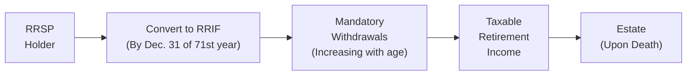

## 6.2 Registered Retirement Income Funds (RRIFs)

Have you ever found yourself pouring another cup of coffee at age 60-something and thinking, “Hmm, what now? My RRSP’s been growing, but I know I can’t keep it there forever—am I supposed to just cash out?” That’s the question a friend of mine asked when she was approaching 71. And maybe you’re asking yourself something similar. Well, the answer usually is: Watch out for your Registered Retirement Savings Plan (RRSP) conversion deadline, because that’s when the Registered Retirement Income Fund (RRIF) becomes your new best friend—or, at least, your new retirement arrangement.

A RRIF is designed to help Canadians transform their hard-earned retirement savings into a consistent income stream. You probably already know that you must stop contributing to your RRSP at the end of the year you turn 71. At that point, you either convert it to a RRIF, an annuity, or withdraw it all (which is almost never recommended because it triggers a massive tax bill). Anyway, let’s walk through the details and strategies so that you can gain confidence about your retirement income planning.

---

### RRIF Basics

A RRIF is sort of like an RRSP that has entered its spending phase. You’ve spent years (or decades) contributing to your RRSP and letting the investments grow tax-deferred. But the government says, “Hey, you can’t keep it in there forever. We need to gradually bring those funds into your taxable income.” That’s where a RRIF comes in.

• You open (or “convert to”) a RRIF no later than December 31st of the year you turn 71. If you want to open it earlier, you can do that too (some folks convert in their 60s).  
• Once the RRIF is opened, you transfer assets directly from your RRSP. Take care not to withdraw the funds before transferring, because that could force you to pay tax right away.  
• You can choose various investments inside the RRIF. Similar to an RRSP, the investments within your RRIF continue to grow tax-deferred until you withdraw them.  
• Unlike an RRSP, you’re not allowed to make new contributions to your RRIF (except under some spousal RRIF provisions or partial conversions, but that’s a more unique scenario).  

Everyone’s favorite (or maybe least favorite) part is that there’s a mandatory minimum amount you must withdraw each year. We’ll talk about that in detail in just a minute.

If you’d like to see government-specific guidelines, check out the Canada Revenue Agency (CRA) references here:  
<https://www.canada.ca/en/revenue-agency/services/tax/individuals/topics/rrsp-rrif/rrifs.html>

And for the regulatory environment, remember that the Canadian Investment Regulatory Organization (CIRO) now oversees investment dealers and mutual fund dealers nationwide. Any references to the (defunct) MFDA or IIROC apply only historically. For the present (2025 onward), consult:  
<https://www.ciro.ca>

---

### Mandatory Minimum Withdrawals

The mandatory minimum withdrawal schedule is one of the key features of a RRIF. Essentially, the government prescribes a set percentage that crawls upward as you age. The older you get, the higher the percentage of your RRIF you must withdraw yearly.

Why? The government wants to ensure that tax-deferred income eventually gets taxed. Also, it ensures that you actually have steady income in retirement—no leaving everything locked away without accessing it. But I should warn you: if you open a RRIF at 65, your minimum amounts start from that age’s factor. Once you hit 71, the factor increases further.

Facts about the minimum withdrawals:  
• The mandatory minimum factor typically starts in the 5% range in your early 70s and ramps up noticeably in your 80s and beyond.  
• If you withdraw any amount above the minimum, the financial institution will withhold tax on the excess portion.  
• You can choose to receive your RRIF payments monthly, quarterly, or annually—whatever fits your lifestyle. But do meet the annual minimum by December 31st.  

Below is a simplified example of how the withdrawal factor may escalate:

| Age (at start of year) | Approximate Minimum Withdrawal (%) |
|------------------------|-------------------------------------|
| 65                     | ~4.00%                               |
| 71                     | ~5.28%                               |
| 75                     | ~5.82%                               |
| 80                     | ~6.58%                               |
| 85                     | ~8.51%                               |
| 90                     | ~11.92%                              |
| 95                     | ~20.00%                              |

(These percentages occasionally change based on federal regulations, so always check the latest official tables.)

To illustrate the typical flow of how funds move from an RRSP into a RRIF and eventually into your hands, take a look at this diagram:

This diagram highlights how you start with an RRSP, convert to a RRIF, withdraw a minimum yearly amount (or more), and eventually, any remaining balance can pass to your estate or beneficiaries.

---

### Tax Implications

Now for the not-so-fun part: taxes. Once you move your funds into a RRIF, the money is still tax-deferred while inside. However, when you withdraw any portion, that amount becomes fully taxable in the year you receive it. Think of it as delayed taxes on all that previously untaxed RRSP money.

• **Minimum withdrawal:** There’s no withholding tax on the minimum amount— but that doesn’t mean you dodge taxes entirely. You just pay them at tax-filing time (or you can request voluntary withholdings).  
• **Excess withdrawal (beyond the minimum):** Your financial institution will withhold tax at source immediately. This can help you avoid a big tax bill come April, but the withheld tax might not always match your actual marginal rate.  
• If your withdrawal pushes you into a higher tax bracket, you might owe more at year-end. Alternatively, if it was too much withholding, you might receive a refund.  

The choice of monthly, quarterly, or annual withdrawals might affect your tax obligations. Some folks prefer monthly RRIF payments to even out their cash flow and keep their tax installments more predictable. Others withdraw annually and invest or manage their income in different ways. There’s no one-size-fits-all approach—tax planning is key.

---

### Deciding When to Convert 

Although you must convert your RRSP to a RRIF by the end of the year you turn 71, you can convert earlier. And that’s not always a bad idea.

Here are some reasons someone might convert early:

• **Retirement at 60 or 65:** If you stop working earlier, you might need your RRSP to be an income source. Converting to a RRIF (or partially converting) can put you on a schedule.  
• **Bridging early retirement:** Some Canadians want to maintain a certain lifestyle and create a more consistent “paycheck.” A RRIF does that nicely.  
• **Splitting income with a younger spouse:** In certain circumstances, the age used to calculate minimum withdrawals can be based on a younger spouse, reducing your required withdrawal.  

But hold on. If you convert too early, you start paying taxes earlier. Salary plus RRIF income can push you into higher tax brackets. Everyone’s situation is unique, so it’s wise to talk it through with a financial advisor or consult a robust retirement calculator or tax software.  

---

### Crafting a Withdrawal Strategy

Your withdrawal strategy can significantly impact your lifetime tax liability. Factors that typically influence your plan:

• **Other Sources of Income:** Government pension benefits (like the Canada Pension Plan (CPP) and Old Age Security (OAS)), private pensions, annuities, or part-time work.  
• **Age Considerations:** If you withdraw later, your mandatory minimum is higher—but deferring might leave more room for tax-deferred growth.  
• **Splitting Income with a Spouse:** If you’re older than your spouse, it might be beneficial to use their age for your RRIF minimum. This lowers your mandatory withdrawal percentage, letting funds remain tax-deferred longer.  
• **Avoiding OAS Clawback:** With higher income, part of your OAS might be clawed back. Carefully planning the timing of RRIF withdrawals can help minimize that.  

Some individuals might keep a smaller budget during their 60s, to keep them in a lower tax bracket, and then ramp up withdrawals later. Others do the opposite, pulling more while they’re healthy and traveling, then reducing spending later. Both approaches can be valid based on personal priorities.

If you’re curious about sample strategies and real-world success stories, a resource such as “The Retirement Lifestyle Center” (<https://retirementlifestyle.com>) can offer fictional case studies that are grounded in realistic scenarios. The nuance of bridging investments, RRSP meltdown strategies (like paying down debt with RRSP withdrawals while incomes are lower), or deferring RRIF draws might interest you if you want to optimize each tax dollar.

---

### Estate Planning with RRIFs

When you pass away, any remaining amount in your RRIF typically becomes income on your final tax return—unless you’ve named a qualified beneficiary (for example, your spouse) or set up the RRIF to continue to a successor annuitant. This can reduce or defer taxes upon death.

• **Spousal RRIF:** If you name your spouse as the successor annuitant (or beneficiary), the RRIF can effectively roll to them without triggering immediate taxes.  
• **Children or other beneficiaries:** If you leave your RRIF to your children, the value of the RRIF is generally fully taxed in your final return, then the net proceeds are passed to them.  
• **Estate implications:** Proper beneficiary designations can help avoid probate fees, speed up asset transfer, and reduce estate complexities.  

If no beneficiary is named, the RRIF’s value is often paid to your estate, possibly incurring probate fees (depending on your province) and additional legal processes. Keeping your estate plan up to date is crucial.  

---

### Personal Anecdote: A Father’s RRIF Decision

Let me share a small anecdote: My father had just turned 70 and was all about traveling with my mother. He decided to convert his RRSP to a RRIF after talking to advisors who recommended a semi-early conversion. He set up monthly payments that matched his travel budget. It was a sweet setup—he got his “paycheck,” didn’t have to worry about big lumps of cash management, and the rest in the RRIF kept on growing tax-deferred. He found it easier than making ad-hoc withdrawals (we teased him about being a “pensioner on direct deposit”).

When Dad turned 72, his mandatory minimum jumped. By that time, he was more settled at home, so the extra payments came in handy for supporting new hobbies. Sure, it meant paying taxes earlier, but he was comfortable living within that monthly deposit. The moral? A little planning can turn the “scary” side of mandatory withdrawals into a more convenient flow of income so you can enjoy your retirement years.  

---

### Common Pitfalls and How to Avoid Them

• **Forgetting the Deadline:** Some folks forget to convert by December 31st of the year they turn 71. If that happens, your entire RRSP might be de-registered automatically, and you could face a hefty tax bill. Mark that calendar!  
• **Taking Only the Minimum Forever:** The minimum is just that—the minimum. It might not always be the best strategy for your goals. Perhaps you need more or perhaps you want to deplete your RRIF earlier for tax reasons. Keep reevaluating your plan.  
• **Ignoring Withholding Tax on Excess:** If you withdraw more than the minimum, the withholding tax might not match your actual marginal tax rate. This can lead to an unwelcome surprise at tax time.  
• **Poor Beneficiary Designations:** Not naming a spouse or beneficiary can create additional estate headaches. Keep this updated, especially after major life events like marriage, divorce, or the death of a spouse.  
• **OAS Clawback Overlooked:** Large withdrawals can push your net income above OAS clawback thresholds. If that’s a concern, plan your withdrawal amounts accordingly.  

---

### Tools and References

It always helps to have authoritative resources and helpful calculators at your side:

• **CRA Official RRIF Guidelines:**  
  <https://www.canada.ca/en/revenue-agency/services/tax/individuals/topics/rrsp-rrif/rrifs.html>  
• **CIRO (Canadian Investment Regulatory Organization):**  
  For the overarching regulatory framework and proficiency standards of Canadian financial professionals, see <https://www.ciro.ca>.  
• **“Plan Your Retirement” by Pauline Arnett:**  
  A resource covering everything from transitioning out of RRSPs to advanced estate planning tips.  
• **Income Tax Act (Canada):**  
  The legislative backbone for RRIF rules, spousal rollovers, and associated tax treatments (check consolidated versions for up-to-date regulations).  
• **Retirement Calculators and Budgeting Tools:**  
  Various open-source budgeting tools can help you do “what-if” scenarios. For instance, you can find a few free Excel-based retirement planners from personal finance communities online.  
• **Retirement Lifestyle Center:**  
  <https://retirementlifestyle.com> (fictional example) If you want more scenario-based examples on bridging and withdrawal strategies.

Keeping up to date is vital. Federal budgets or policy changes can tweak minimum withdrawal rates or other RRIF rules.  

---

### Putting It All Together

Ultimately, RRIFs give you a structured path to convert your tax-deferred savings (RRSP) into a predictable income stream. The mandatory minimum withdrawal, while initially imposing, can be molded to suit your retirement plans. Whether you’re traveling the world in your early retirement days or focusing on estate planning, remember that the timing and method of your conversions and withdrawals can really shift your tax picture.

So, how do you decide on the sweet spot between mandatory government rules and your personal retirement ambitions? It’s a continuous balancing act. Reassessing your plan every year with a financial advisor or by using updated software tools is usually a smart move. Think of your RRIF less like a rigid government requirement and more like a flexible retirement paycheck that can be tailored—within reason—to your lifestyle.

Wishing you smooth sailing in your retirement journey, lots of good coffee, and enough leftover to spoil the grandkids (if you have them). If all else fails, talk to a pro—no one regrets peace of mind in retirement.

---

This second diagram underscores that setting up a RRIF is just part of a bigger cycle. You plan, you convert, you figure out how to withdraw, you examine your tax situation, and then you review. Over and over.

---

## Test Your Knowledge: RRIF Strategies and Considerations



### Which of the following is true about converting an RRSP to a RRIF?

- [ ] You must convert by the end of the year you turn 65.  
- [ ] You can only convert at age 71 and not earlier.  
- [x] You must convert no later than December 31 of the year you turn 71, although earlier conversion is allowed.  
- [ ] You must withdraw all funds before converting to a RRIF.  

> **Explanation:** Legally, you must convert your RRSP no later than December 31 of the year you turn 71, but you can convert at any time before that if you wish.

### What happens if you withdraw more than your RRIF’s mandatory minimum amount?

- [ ] No tax is withheld at source on any withdrawals.  
- [x] Tax will be withheld at source on the amount exceeding the mandatory minimum.  
- [ ] You are not allowed to withdraw more than the mandatory minimum under any circumstances.  
- [ ] There is an additional penalty for withdrawing more than the mandatory minimum.  

> **Explanation:** Although the mandatory minimum withdrawal amount is not subject to withholding tax, any amount above it will be subject to withholding tax.

### What is one reason some individuals convert their RRSP to a RRIF before age 71?

- [x] They may want to create a predictable retirement income stream earlier.  
- [ ] They receive a pension credit bonus for converting early.  
- [ ] They are required by law to convert at age 65.  
- [ ] They avoid future mandatory minimum withdrawals.  

> **Explanation:** Converting earlier can help if you want to begin receiving regular income sooner, especially if you’ve retired before age 71.

### Which statement is true about RRIF minimum withdrawals?

- [x] The minimum withdrawal percentage generally increases with age.  
- [ ] The minimum withdrawal percentage remains constant once set.  
- [ ] RRIF holders can choose their own minimum withdrawal percentage without government guidance.  
- [ ] There is no minimum withdrawal requirement for RRIFs.  

> **Explanation:** The government prescribes a schedule where the mandatory minimum withdrawal percentage increases as you age.

### How might naming a spouse as “successor annuitant” on a RRIF assist in estate planning?

- [x] It allows a direct rollover of the RRIF’s value to the spouse, avoiding immediate taxation in the deceased’s final tax return.  
- [ ] It doubles the withdrawals available each year without penalty.  
- [x] It can reduce probate fees and simplify asset transfer.  
- [ ] It eliminates all future tax obligations for the spouse.  

> **Explanation:** A spouse who is named as successor annuitant can continue receiving RRIF payments, deferring taxes, and often avoiding probate. However, it does not eliminate taxes forever; those come due eventually when the spouse passes or withdraws funds.

### Which strategy might help reduce the required minimum withdrawals for an older RRIF holder?

- [x] Using a younger spouse’s age to calculate the minimum withdrawal factor.  
- [ ] Deferring the RRIF until age 80.  
- [ ] Making larger monthly withdrawals to “spread out” taxation.  
- [ ] Withdrawing everything at once in a single year.  

> **Explanation:** When a spouse is younger, it is permissible to use their age to set a lower minimum percentage, allowing more funds to remain in the RRIF longer.

### What is one potential drawback of choosing only the mandatory minimum RRIF withdrawal each year?

- [x] You may end up paying higher taxes in later years due to larger withdrawals, or missing out on planned lifestyle goals.  
- [ ] You automatically lose OAS benefits at age 71.  
- [x] You might not be aligning with your actual income needs.  
- [ ] You must pay extra “minimum withdrawal penalty” to the CRA.  

> **Explanation:** While taking just the minimum can be an effective tax deferral, it may lead to higher cumulative taxes in later years or insufficient income to meet current needs.

### How is withholding tax handled on the RRIF’s mandatory minimum withdrawals?

- [x] Typically, there is no automatic withholding tax on the mandatory minimum.  
- [ ] The mandatory minimum is taxed at the highest marginal rate.  
- [ ] The financial institution always withholds a flat 20%.  
- [ ] The mandatory minimum triggers a 10% penalty.  

> **Explanation:** Generally, institutions do not withhold taxes from the mandatory minimum, but the tax is still owed at year-end, unless you request voluntary withholding.

### If you fail to convert your RRSP by December 31 of the year you turn 71, what commonly happens?

- [x] Your RRSP might be de-registered, resulting in a lump-sum withdrawal and a large tax bill.  
- [ ] Nothing serious happens; you can convert anytime after.  
- [ ] You automatically enter a spousal RRIF arrangement.  
- [ ] You forfeit all RRSP funds to the CRA.  

> **Explanation:** Missing the conversion deadline can lead to forced deregistration of your RRSP, causing a taxable lump sum. This can create a significant tax burden.

### True or False: You cannot name a beneficiary on a RRIF.

- [x] True  
- [ ] False  

> **Explanation:** Actually, the statement is false. You can indeed name a beneficiary or a successor annuitant for your RRIF, which is typically recommended for estate planning.


