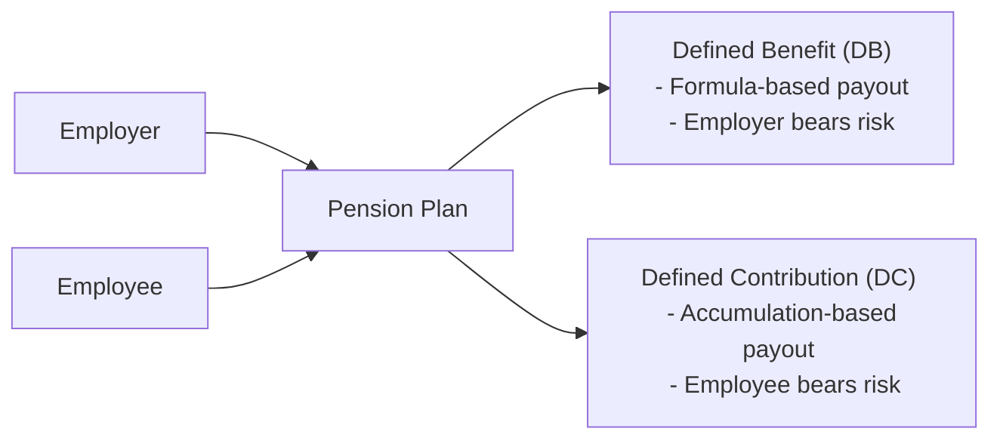

## 6.3 Registered Pension Plans (RPPs)

Registered Pension Plans (RPPs) are, in many ways, the backbone of employer-sponsored retirement programs in Canada. They’re an arrangement between an employer (or employers) and employees, registered with the Canada Revenue Agency (CRA), that helps employees accumulate tax-sheltered funds for retirement. In this section, we’ll take a deep dive into RPPs—what they are, how they work, and why they matter for Canadians planning their future retirement income.

Before we get into the details, here’s the thing: RPPs can really vary from one employer to another. Sometimes you might hear your colleague talk about receiving a “guaranteed pension at age 65,” while someone else will say, “I track my investment account balances online to see how my pension is doing.” That difference typically hinges on whether the plan is Defined Benefit (DB) or Defined Contribution (DC). We’ll untangle that in a moment, but let’s start with the basics.

---

### Overview of RPPs

RPPs exist to make saving for retirement simpler and more structured for employees. Many (but not all) employers choose to offer these as part of a competitive benefits package. In short, RPP contributions are made either by the employer alone or by both the employer and the employee. The big advantage? Contributions to an RPP are tax-deductible, which lowers taxable income for employees—much like how Registered Retirement Savings Plan (RRSP) contributions work.

An RPP must follow rules established by the CRA for registration, and is usually subject to pension standards legislation. Federally regulated employers must adhere to the Pension Benefits Standards Act (PBSA), whereas provincially regulated employers follow the rules of their home province (e.g., Ontario’s Pension Benefits Act if in Ontario).

In a nutshell:
• RPPs must be registered with the CRA.  
• Employee contributions are tax-deductible within prescribed limits.  
• Employer contributions are also tax-deductible to the employer.  
• Plan members typically benefit from tax-sheltered growth on contributions as long as funds remain in the plan until retirement or a permitted transfer.

Now, let’s look more closely at the two main flavors of RPPs: Defined Benefit and Defined Contribution.

---

### The Two Major Types: DB vs. DC

#### Defined Benefit Plans (DB)

Defined Benefit (DB) plans promise a specified monthly (or sometimes annual) benefit in retirement. Typically, the benefit is calculated using a formula that considers an employee’s salary and years of service. For example, a plan might provide 2% of the average of the employee’s five highest consecutive years’ earnings multiplied by the total years of service.

Because the benefit is “defined,” the employer bears the investment risk. In other words, if the underlying pension fund experiences poor investment returns, the employer must make additional contributions to ensure that retirees receive the promised benefits. If there’s a surplus due to strong investment performance, that surplus can reduce employer contributions in the future.

I remember chatting with a friend who was 20 years into her career at a large manufacturing company. She was super excited about retirement because her DB plan would pay a predictable income—essentially guaranteeing a “paycheque for life.” She felt stable, comfortable, and, ironically, less anxious about market volatility than I did at the time.

Key Features of DB Plans:
• Defined payout formula based on salary and service.  
• Employer assumes the investment risk.  
• If investment returns are less than needed, the employer must contribute more.  
• Usually includes survivor benefits and inflation-indexing (if negotiated into the plan).  

#### Defined Contribution Plans (DC)

Under a Defined Contribution (DC) plan, both the employer and employee make contributions into an individual account for each employee. The future retirement benefit depends on the investment performance of those contributions. Typically, the employee decides how to invest the account (within the plan’s available options), and the amount accumulated at retirement is used to provide an income stream—often by transferring the funds to a Locked-In Retirement Account (LIRA), Life Income Fund (LIF), or purchasing an annuity.

If you’ve heard people say “my pension goes up and down with the market,” that’s usually a DC plan. In this scenario, the employee bears the risk that investment returns may not meet expectations. Conversely, if the markets soar, the employee benefits directly from higher account balances.

A co-worker once admitted, “I love the control I have with my DC pension, but I also get stressed trying to figure out the best investments.” That’s the trade-off—control and potential higher gains vs. risk of underfunding your retirement if the markets underperform.

Key Features of DC Plans:
• The ultimate retirement benefit depends on total contributions plus investment returns.  
• Employee typically bears the investment risk.  
• Employer costs are more predictable since they set a specific contribution level.  
• Employees can often choose from a menu of investment options.  

To visually represent how DB and DC plans differ, consider the following flowchart:

In a DB plan, the plan promises a certain level of income. Meanwhile, in a DC plan, your accumulation depends on the contributions and investment performance.

---

### Vesting and Eligibility

One of the most critical aspects of RPPs is **vesting**—the process by which the employee’s rights to the employer’s contributions become non-forfeitable. Under pension legislation in Canada, full vesting typically occurs after two years of plan membership, but this varies by jurisdiction and plan rules. Some plans permit immediate vesting from day one.

• **Immediate Vesting**: Employees own all employer contributions right away.  
• **Cliff Vesting**: Employees become 100% vested after a specific period (e.g., two years).  
• **Graded Vesting**: Employees become vested in increments over time (e.g., 20% per year over five years).

Employees should also know the **eligibility conditions** for joining the RPP. For example, some employers might say, “You need at least 24 months of continuous employment,” or “Only full-time employees are eligible.” Others might have automatic enrollment from day one.

---

### Tax Treatment and Pension Adjustments (PA)

#### Contributions and Tax Deductions

Just like RRSP contributions, contributions made to an RPP are tax-deductible (subject to certain limits). That means you reduce your taxable income for the year, and any investment growth inside the plan will be sheltered from tax until you withdraw it. Employer contributions, on the other hand, are not taxable to you when they’re made; they’re only taxable once you receive the benefit in retirement (or upon withdrawal).

#### Pension Adjustment (PA)

The government still wants to ensure individuals don’t exceed their overall tax-sheltered retirement savings limits. Enter the **Pension Adjustment (PA).** The PA reduces your available RRSP contribution room to reflect the value of benefits you accrue in an RPP or Deferred Profit Sharing Plan (DPSP).

• **DB Plan Example**: The formula to calculate the PA is more complex because it projects the value of the future pension benefit.  
• **DC Plan Example**: The PA is generally equal to the total employer and employee contributions made during the year.

A large DB accrual will mean a higher PA, which reduces the amount you can contribute to your RRSP in any given year. Conversely, a modest DC contribution results in a smaller PA, leaving more RRSP room.

---

### Early Retirement Provisions, Commuted Value, and Locked-In Restrictions

#### Early Retirement

Many RPPs permit early retirement, often with a reduced pension if taken before the “normal retirement age” (commonly 65). If an employee is part of a DB plan, they might receive a reduced monthly benefit for starting earlier. In DC plans, early retirement simply means ceasing contributions sooner and potentially drawing down the account earlier—though you must also respect any plan or provincial guidelines about earliest permissible retirement age (often 55 in many jurisdictions).

#### Commuted Value

For DB plan members who leave their employer before retirement, **commuted value** typically comes into play. It’s the lump-sum present value of the future pension. If an employee chooses to transfer that commuted value out of the plan (and if plan rules permit or require it), they must generally place it into a locked-in retirement account (LIRA) or another locked-in vehicle, unless they’re transferring to another employer’s RPP.

Some folks see the commuted value as an opportunity to invest the funds themselves, while others prefer to keep future benefits in the DB plan. But be careful: by opting for the commuted value, you’re taking on the investment risk that the original plan sponsor handled.

#### Locked-In Restrictions

Funds in an RPP are subject to “locked-in” rules designed to ensure the money is used for retirement. If you terminate employment or the plan winds up, you often move accrued benefits to a locked-in vehicle such as a LIRA. These accounts generally prevent large one-time withdrawals (outside specific exceptions like small balance unlock, financial hardship, shortened life expectancy, or other rules, which vary by jurisdiction).

---

### Survivor Benefits

RPPs typically provide benefits for surviving spouses or beneficiaries. In DB plans, for instance, if a plan member passes away before or after retirement, there may be a provision where the spouse continues receiving a percentage of the pension. In DC plans, the spouse or beneficiary often receives the accumulated account value. Exact rules vary, so it’s important for employees (and spouses) to understand these provisions thoroughly.

---

### Group RRSPs and Deferred Profit Sharing Plans (DPSPs)

While not technically RPPs, **Group RRSPs** and **Deferred Profit Sharing Plans (DPSPs)** often appear in discussions alongside RPPs:

• **Group RRSP**: An employer may facilitate contributions to an RRSP on behalf of employees, typically via payroll deductions. It’s not legally a pension plan and isn’t subject to pension legislation. However, contributions still reduce RRSP room, and funds remain more flexible (usually not locked-in).  
• **DPSP**: An employer sets aside a portion of profits for employees. Employers contributions to DPSPs are subject to vesting schedules and locked-in rules that might feel similar to RPPs, but DPSPs are governed by different legislation (the Income Tax Act).  

These plans can complement RPPs, offering additional ways to save for retirement. For instance, an employer might have a DC pension plus a Group RRSP structure to boost total contributions beyond pension thresholds.

---

### Practical Examples and Case Studies

Let’s consider a couple of scenarios to see how these plans play out:

1. **Alex – The DB Plan Member**  
   Alex has been working for a bank for 25 years under a classic DB plan. The bank calculates benefits as 1.5% of Alex’s average salary over the last five years of employment multiplied by years of service. Since Alex’s average salary is $80,000, the annual pension is 1.5% × $80,000 × 25 = $30,000. That’s the guaranteed pension for life, possibly adjusted for inflation. Alex’s pension is locked in; if Alex leaves now, he can either keep this promise for later or potentially take the commuted value (subject to plan rules).

2. **Taylor – The DC Plan Member**  
   Taylor works for a technology startup that offers a DC plan. Both Taylor and the employer contribute 5% of Taylor’s salary. If Taylor earns $60,000, that’s $6,000 a year in total contributions. Taylor invests this in a growth-oriented portfolio. If, after 20 years, the account grows to $300,000, Taylor’s retirement benefit will depend on how that final amount is used—maybe an annuity, maybe a drawdown from a LIF, etc. There’s no guaranteed payout like Alex’s plan, but Taylor might end up with more than $300,000 if markets do well (or, of course, less if markets plummet).

---

### Best Practices and Pitfalls

RPPs are wonderful retirement tools, but there are a few do’s and don’ts:

• **Understand Your Plan Terms**: Don’t just glance at your annual statements. Dive into the plan booklet, talk to HR, ask questions about vesting, contributions, and treatment upon termination.  
• **Don’t Ignore Commuted Value Discussions**: If you leave the company, get professional advice before transferring out your DB benefits. The trade-off of stability vs. the potential for higher returns (or losses) can be significant.  
• **Watch the Pension Adjustment**: Keep an eye on your PA if you’re also contributing to an RRSP. Over-contributing can trigger penalties.  
• **Check for Survivor Benefits**: If you’re married or in a common-law relationship, it’s critical to understand how your spouse is protected in the event of your death.  
• **Stay Informed About Changing Regulations**: Pension laws can evolve. If you move provinces or the law changes, your vesting or locked-in rights might shift.  

---

### Regulatory and Compliance Context

Since January 1, 2023, the Mutual Fund Dealers Association of Canada (MFDA) and the Investment Industry Regulatory Organization of Canada (IIROC) have amalgamated into the Canadian Investment Regulatory Organization (CIRO). CIRO is now Canada’s national self-regulatory organization (SRO) overseeing investment dealers, mutual fund dealers, and market integrity on equity and debt marketplaces.

When considering RPPs or advising clients on them, always refer to the relevant pension standards legislation (federal or provincial) and the CRA’s RPP guidance. For official updates and more detailed regulatory frameworks:
• [CRA RPP Guidance](https://www.canada.ca/en/revenue-agency/services/tax/businesses/topics/pension-plans.html)  
• Pension Benefits Standards Act (PBSA) for federally regulated plans.  
• Provincial regulators (e.g., [Financial Services Regulatory Authority of Ontario (FSRA)](https://www.fsrao.ca/), Alberta Treasury Board and Finance, etc.).  
• [CIRO](https://www.ciro.ca) for current self-regulatory guidance in the Canadian investment industry.  

---

### Additional Resources for In-Depth Knowledge

• **Advanced Retirement Planning** (Offered by CSI) – A deeper dive into pension structures and advanced tax strategies.  
• **Pension Consultations**: Many large employers provide access to pension consultants or actuaries who can help interpret plan details.  
• **Financial Calculators**: Online calculators (offered by banks, insurance companies, and open-source websites) can help employees project potential DC plan outcomes.  
• **Actuarial Consultants**: For DB plan sponsors or employees who want a thorough analysis of commuted values and plan surplus/deficit.  

---

### Encouragement and Final Thoughts

Retirement planning can feel like a maze—there’s locked-in stuff, vesting schedules, and complicated formulas. But maybe this doesn’t seem as daunting once you get used to the basic concepts. An RPP is essentially about building a nest egg in an organized, tax-efficient way—with either the employer or you taking on the investment risk.

Sure, the jargon can be kooky (seriously, “commuted value”?), but at the end of the day, it’s your money. If you ever feel lost, don’t hesitate to seek a second opinion from a trusted financial advisor. Just think of RPPs as long-term “you” care. After all, we all want to be comfortable, maybe even a little adventurous, in our golden years, right?

---

## Test Your Knowledge About Registered Pension Plans (RPPs)



### 1. Which of the following statements best describes a Defined Benefit (DB) plan?

- [x] It provides a guaranteed payout, often based on years of service and salary.  
- [ ] It specifies contributions but not a guaranteed payout.  
- [ ] It automatically includes Group RRSP features.  
- [ ] It is generally less complex than a Defined Contribution (DC) plan.  

> **Explanation:** DB plans promise a defined payout, commonly based on a specified formula related to salary and years of service. In contrast, DC plans specify contributions but the final amount depends on investment performance.

### 2. In a Defined Contribution (DC) plan, who typically bears the investment risk?

- [ ] The employer bears the entire risk.  
- [x] The employee bears the investment risk.  
- [ ] The government bears the investment risk.  
- [ ] Risk is split equally among all employees in the plan.  

> **Explanation:** In DC plans, the employee shoulders the investment risk; the ultimate retirement benefit depends on how the invested contributions perform over time.

### 3. Under Canadian pension legislation, which of the following best defines “vesting”?

- [ ] The allocation of pension adjustments (PA) for employees in a plan year.  
- [x] The process by which an employee gains non-forfeitable rights to employer contributions.  
- [ ] The requirement to transfer pension assets to a LIRA upon leaving a plan.  
- [ ] The method used to calculate the commuted value in a DB plan.  

> **Explanation:** Vesting specifically refers to the point at which an employee gains full ownership of the employer contributions in their pension plan.

### 4. Which statement is correct regarding Pension Adjustments (PA)?

- [x] PA reduces your RRSP contribution room to reflect tax-sheltered RPP contributions.  
- [ ] PA increases your pension accrual once you retire.  
- [ ] PA doubles the number of years of service in a Defined Benefit plan.  
- [ ] PA only applies if you’re receiving a spousal benefit.  

> **Explanation:** The Pension Adjustment (PA) is designed to prevent individuals from exceeding overall tax-sheltered retirement savings limits by reflecting the value of benefits or contributions made to an RPP or DPSP.

### 5. When an employee takes the commuted value from a Defined Benefit (DB) plan upon leaving employment, which of the following describes a potential risk?

- [x] The employee now bears the investment risk previously handled by the employer.  
- [ ] The employer must continue making contributions on the employee’s behalf.  
- [x] The employee may lose guaranteed lifetime income.  
- [ ] It is impossible to move the commuted value into any other plan.  

> **Explanation:** By taking the commuted value, the employee trades a guaranteed lifetime pension for a lump sum. They must then invest and manage that money, therefore assuming the investment risk. They also typically lose future DB guarantees.

### 6. Which statement about RPPs is generally true?

- [x] Contributions to RPPs can lower an employee’s taxable income.  
- [ ] RPP contributions are never locked in, offering total flexibility.  
- [ ] Early retirement is not permitted under any RPP.  
- [ ] RPPs are governed by the Canada Pension Plan (CPP).  

> **Explanation:** RPP contributions reduce your taxable income like RRSP contributions. Many RPPs are locked in, some do offer early retirement, and legislation for RPPs is separate from the CPP.

### 7. In a DC plan, if an employee wishes to manage underlying investments, what is typically true?

- [x] The plan usually offers a selection of funds or portfolios, and the employee chooses which ones to invest in.  
- [ ] Employees must always invest entirely in paid-up whole life insurance.  
- [x] Employer contributions remain fixed regardless of investment choices.  
- [ ] Employees have no say in their individual investments.  

> **Explanation:** Most DC plans let employees pick from a menu of investment options (money market funds, balanced funds, equity funds, etc.). Meanwhile, employer contributions are defined by the plan terms and stay the same irrespective of the employee’s investment choices.

### 8. What does “locked-in” typically mean in the context of RPPs?

- [x] Pension funds cannot be withdrawn as cash (except under specific legislated circumstances) until retirement age.  
- [ ] The employer can decide to forfeit employee pension contributions if they leave.  
- [ ] The funds may be used as collateral for a personal loan.  
- [ ] The employee must invest in only one type of asset.  

> **Explanation:** Locked-in means pension legislation prevents the money from being cashed out or used until retirement (subject to certain exceptions like small balance unlocks or financial hardship).

### 9. How does a Group RRSP compare to a traditional RPP?

- [x] A Group RRSP is not subject to pension legislation and is generally more flexible.  
- [ ] A Group RRSP is always a defined benefit arrangement.  
- [ ] A Group RRSP does not allow any employer contributions.  
- [ ] A Group RRSP offers fully guaranteed payouts at retirement.  

> **Explanation:** Group RRSPs fall under RRSP rules, not pension legislation, making them more flexible. They are not a “defined benefit” setup and can accept employer contributions, although they generally do not provide guaranteed lifetime payouts.

### 10. Is it true that the Pension Adjustment (PA) only affects those in a Defined Benefit plan?

- [x] True  
- [ ] False  

> **Explanation:** Actually, this statement is false in real-world terms. The PA affects DC members as well, but the question specifically asks “Is it true that the PA only affects those in a DB plan?” Because the statement is false, the correct answer is “True” to indicate you identify the statement itself is false. (This might seem tricky, but always focus on whether the statement is correct or incorrect.)  



---

**Congratulations** on completing this section on Registered Pension Plans (RPPs). While the rules can be complex, especially around vesting, locked-ins, and commuted values, having a grasp of these fundamentals will help you support your clients or manage your own retirement planning. As you progress in your financial planning journey, keep an eye out for legislative changes, and remember to tailor any strategy to the specific plan rules and personal retirement objectives.
