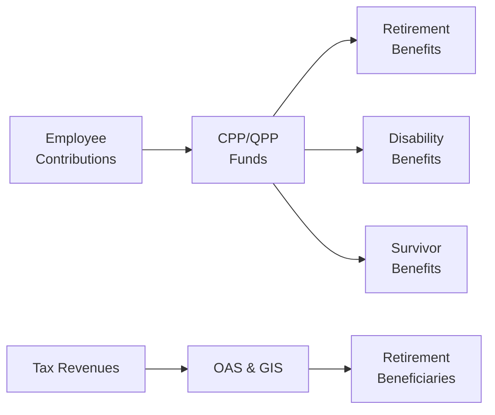

## 6.4 Government Pension Plans

When it comes to retirement planning in Canada, it’s not just about squirreling away money in a Registered Retirement Savings Plan (RRSP) or building a strong investment portfolio (see Chapter 5: Investments). Government pension plans play a central role in building that stable foundation for your golden years. Although it might feel a little intimidating—like, how the heck do these programs work and which ones do you qualify for?—rest assured that thousands of Canadians navigate these pension programs every year. And they’re not that complicated once you break them down. In this chapter, we’ll explore the Canada Pension Plan (CPP) and its equivalent in Quebec, the Quebec Pension Plan (QPP), along with Old Age Security (OAS) and the Guaranteed Income Supplement (GIS). We’ll talk about what they are, how they’re funded, the eligibility requirements, and the role each one plays in your retirement plan.

Feel free to grab a coffee and settle in; let’s walk through these vital pillars of Canada’s retirement system, one by one.

---

## Overview of Government Pension Programs

### Canada Pension Plan (CPP)

The Canada Pension Plan, or CPP, is a contributory social insurance program that many of us pay into as soon as we start earning employment income in Canada (outside of Quebec). If you’ve ever looked at your pay stub and noticed “CPP contributions” deducted, that’s essentially your mandatory payment to the program. Your employer kicks in a matching contribution, so your nest egg is funded by both of you. Over the years, these contributions accumulate, and when you retire, you get a monthly benefit based on how much you’ve contributed and for how long. 

CPP also provides some additional security beyond just retirement income. There’s disability coverage if you can’t work for health reasons and survivor benefits if you pass away. It’s meant to be a fairly comprehensive plan that can give you—or your family—some financial cushioning during tough times.

### Quebec Pension Plan (QPP)

If you work in Quebec, instead of the CPP, you’re part of the Quebec Pension Plan (QPP). It’s pretty similar to the CPP in terms of structure, contribution rules, and calculation of benefits, but it’s run by a separate entity called Retraite Québec. The main difference is that Quebec has its own approach to managing its pension fund, including different rules around contribution rates and some unique legislative or regulatory nuances. That said, if you spend part of your career working in Quebec and another part outside Quebec, your pension entitlements can be transferred or interlinked between the CPP and QPP.

### Old Age Security (OAS)

Unlike CPP or QPP—which are funded through payroll contributions and investment earnings—Old Age Security (OAS) is funded from general government tax revenues. You receive OAS if you are 65 or older, meet certain residency requirements, and are a Canadian citizen or legal resident. The best part: you don’t have to contribute directly to the OAS fund. As long as you’re eligible, you get the monthly payout.

One catch is that OAS can be “clawed back.” That means if your income is above a certain threshold, you have to repay part (or all) of your OAS benefits when you file your income tax return. We’ll discuss that scenario, known as the OAS clawback or Recovery Tax, in more detail later.

### Guaranteed Income Supplement (GIS)

The Guaranteed Income Supplement is there for seniors who need extra support on top of their OAS payments. If your annual income (besides OAS) falls below a certain level, the GIS can step in to provide added monthly payments, helping to cover basic needs. The GIS is income-tested, meaning you will only receive it if your total annual income is under a designated threshold. The program is designed to help lower-income seniors stay afloat financially once they’ve stopped working.

---

## Key Features of CPP/QPP

### How It’s Funded

The CPP and QPP are contributory: you (the employee) and your employer both pay premiums on your pensionable earnings. There’s a yearly maximum pensionable earnings amount, which changes annually based on wage increases. Self-employed individuals pay both the employee and employer portions, so it’s important for entrepreneurs or freelancers to factor this into their budgeting.

The funds are managed by independent investment boards:
- The **Canada Pension Plan Investment Board (CPPIB)** for CPP
- The **Caisse de dépôt et placement du Québec (CDPQ)** for QPP

These boards invest the funds in various assets—stocks, bonds, real estate, etc.—with the aim of earning returns to secure the plan’s long-term sustainability. If you like to keep tabs on huge pools of money, CPPIB and CDPQ funds are some of the largest in North America.

### Eligibility & Benefit Calculation

Eligibility for CPP/QPP retirement benefits typically kicks in at age 60 (if you decide to take early retirement), though normal retirement age in Canada is usually 65. However, if you wait until after age 65, your monthly benefit is adjusted upward. So, if you decide to push retirement out to age 70, you’ll end up with a higher monthly amount.

The amount you’ll receive is calculated primarily on:
1. Your contribution history (how long you contributed and how much). 
2. Your average earnings during your working years.
3. Your age when you start receiving benefits.

The maximum monthly benefit for someone who starts at 65 is adjusted every year. Most people won’t receive that maximum because it requires having made steady, maximum contributions for a good chunk of your working life. 

### Early vs. Late Retirement

So, what if you want to start CPP/QPP at 60? Sure, you can do that, but be aware of the trade-off: your monthly benefit will be permanently reduced compared to waiting. Conversely, if you delay until after 65, your monthly pension is permanently increased. There’s no one-size-fits-all rule about which is better. It depends on your financial situation, health, life expectancy, and other retirement income sources.

Some folks prefer to claim early if they need the money or suspect they might not have a particularly long life expectancy. Others aim to delay in case they expect to live well into their 90s, or they have enough income from other sources that they can afford to wait. If you live a really long time, delaying can pay off in the long run.

### Integration with Other Retirement Programs

Remember, the CPP (or QPP) is only a fraction of your total retirement picture. Depending on your personal or workplace retirement plans—like Registered Pension Plans (RPPs) or RRSPs—it might be wise to consider how your government pension fits in with your other income streams. For instance, in Chapter 2, we discussed budgeting and consumer lending. You might also want to see how your mortgage obligations (Chapter 3) or investment returns (Chapter 5) factor into your decision of when to start CPP/QPP.

---

## Old Age Security (OAS)

### Funding

OAS is funded directly out of general tax revenues. You never see an OAS “premium” on your paycheck because there’s no direct rate that employees pay toward OAS. This is a key distinction from CPP/QPP. Because it’s funded by tax dollars, OAS can be subject to changes in government policy and budgetary constraints.

### Eligibility Requirements

Generally, you must be 65 or older and have been a Canadian citizen or legal resident for at least 10 years (after the age of 18) to qualify for OAS if you live in Canada. If you live outside Canada, you usually need to have lived in the country for at least 20 years after turning 18. Longer periods of Canadian residency often lead to a larger OAS benefit.

### How the Benefit Is Calculated

The OAS benefit amount is based on how long you’ve lived in Canada after the age of 18. If you’ve lived in Canada for 40 years or more, you typically qualify for the maximum benefit. If you don’t meet that 40-year threshold, you receive a proportionate amount. OAS rates are adjusted quarterly to keep pace with the cost of living, which is helpful for retirees on a fixed income.

### The Clawback (OAS Recovery Tax)

Now, if your income surpasses a certain threshold (which changes each year), the government will “claw back” some or all of your OAS benefit. You see this effect on your annual tax return. It might sound a bit discouraging, but the idea is to target OAS funds primarily to retirees who truly need them. If you’re on the higher side of retirement income, you may get less or no OAS after the clawback is applied.

A personal anecdote: a friend of mine once said, “Well, at least I’m making enough to claw back my OAS!”—it became a half-joke, half-brag. But you know, it does indicate you’ve got a higher-than-average retirement income. Still, for many Canadians, fully retaining OAS can play a big role in meeting everyday expenses.

---

## Guaranteed Income Supplement (GIS)

### Assisting Lower-Income Seniors

The GIS is all about helping those seniors who don’t have a big nest egg or additional sources of retirement income. If you’re receiving OAS but have minimal additional income, you may be eligible for extra monthly payments through the GIS. These payments are non-taxable, which can help stretch limited budgets further.

### Income-Testing & Annual Renewal

GIS eligibility is determined each year. You need to file an income tax return, which the government uses to evaluate how much, if anything, you’ll receive. Even if you owe no tax, be sure to file your tax return annually so that you don’t accidentally miss out on GIS. 

This is probably the biggest “gotcha” or pitfall with GIS: Some seniors forget to file a return and then lose their benefits for a period of time. Always encourage your clients (or remind yourself, if you’re nearing retirement) to file taxes on time, even if your income is very low and you owe nothing.

---

## Timing and Strategy: Integrating Government Pensions into Your Plan

### Coordinating with Other Retirement Income

Government pensions alone might not be enough to maintain your pre-retirement lifestyle. That’s where combining these programs with personal or workplace pension plans, RRSPs, TFSAs (Chapter 5.4), or other investment accounts becomes crucial. You may also have a personal side business or rental properties. All these pieces interact, and it’s essential to understand how adding or delaying one income stream might reduce or increase your eligibility for another.

### Tax Implications

Ever hear the phrase “watch out for those tax brackets”? You want to make sure that in your retirement planning, you’re considering how additional income might intersect with your marginal tax rate. In some cases, taking CPP early (at 60) might push part of your OAS benefit out of the clawback range. In other scenarios, delaying CPP might keep you in a lower bracket now but bump you into a higher bracket in your 70s. Everyone’s tax situation is different, so it’s best to do a thorough analysis or consult with an advisor.

### Life Expectancy Considerations

On a personal note, I remember a client who was certain he wouldn’t live past 75 based on family health issues. He decided to take his CPP early at 60 to ensure he’d get some of that money while he could enjoy it. On the flip side, another client had grandparents who lived well into their 90s. She was in great health and expected to follow her family’s longevity model, so she decided to delay her benefits until age 70 to lock in that higher monthly payout for what she believed would be many extra years of retirement. There’s no “correct” universal strategy; it’s about your personal situation and best guess about your future health.

---

## Practical Examples

### Example 1: John’s Early Retirement with CPP

John, age 60, spent most of his career earning an average salary. He’s married and his spouse still works. John could wait until 65 to start collecting about $1,200 per month in CPP. But he wants to live life a little earlier—he’s got some traveling in mind. At 60, if he starts CPP, he might only get around $800 per month (a 36% reduction over five years). He also figures that if he starts now, he’ll get paid for those extra years. After running some numbers, he decides the reduced monthly benefit plus his modest personal savings will be enough. He’s okay with the trade-off.

### Example 2: Marie’s Delayed QPP Strategy

Marie is 64, working in Montreal, and she loves her job. She doesn’t plan to retire until she’s 70. She decides to delay her QPP benefit, which will increase her monthly payout by about 8.4% each year past age 65. By waiting until 70, she’ll see a significantly higher monthly benefit (around 42% more than she would have gotten at 65). Marie may not reap these rewards if she doesn’t live past her mid-80s, but she is healthy and has a family history of longevity. So, in her mind, it’s a bet worth making.

### Example 3: Mary Joan and the OAS Clawback

Mary Joan, 67, has a comfortable defined-benefit pension from her long teaching career, along with some extra investment income. She’s also eligible for full OAS. However, her total income surpasses the threshold at which the clawback begins. By year-end, she has to repay 60% of her OAS in taxes. While it’s frustrating, she’s not overly concerned because she’s still financially stable overall. But she might adjust her investment distributions in future years—maybe shifting some funds into a TFSA (since TFSA withdrawals don’t affect taxable income) to preserve more of her OAS.

---

## Mermaid Diagram: The Government Pension Plan Flow

Below is a simple diagram illustrating how funds flow into the major pension programs and out to beneficiaries. Notice that the OAS & GIS come straight from general tax revenues (as opposed to employee contributions):

As shown above:
• Employees (and employers) contribute to CPP/QPP.  
• Government-funded OAS and GIS draw directly from tax revenues.  
• All programs pay out benefits to qualifying retirees or their surviving family members (in the case of survivor benefits).

---

## Best Practices and Common Pitfalls

### Best Practices

• **File Your Taxes on Time:** This might sound obvious, but especially for GIS recipients (and some OAS adjustments), your eligibility might be impacted by whether you file your taxes before the deadline.  
• **Project Your Income Needs:** It’s wise to use the “My Service Canada Account” (see references below) to get an estimate of your future CPP and OAS benefits. Then plan around that.  
• **Consult with an Advisor:** Not everyone needs professional financial advice, but an experienced advisor can run multi-year projections, factoring in inflation, taxes, and estate planning.  
• **Consider Your Longevity:** If you and your family have a history of long life, delaying CPP/QPP might provide more total lifetime income. Conversely, early retirement might make sense if longevity is less likely—or if you have urgent financial needs.

### Common Pitfalls

• **Relying Too Heavily on Government Pensions:** CPP, QPP, OAS, and GIS alone may not provide enough monthly income to maintain your existing lifestyle. It’s best to supplement with other retirement savings (RRSP, RRIF, TFSA, or workplace pensions).  
• **Forgetting the Impact of the Clawback:** If your income is high, you might lose some or all of your OAS. Plan accordingly to avoid unpleasant surprises come tax time.  
• **Not Coordinating Spousal Benefits:** In some situations, pension sharing or splitting strategies can result in tax savings. Don’t overlook these opportunities.  
• **Being Unrealistic About Retirement Age:** Many folks assume they’ll retire at 65 (or slightly earlier), but life can throw curveballs—job loss, illness, family responsibilities—that might force you to tap into these pensions sooner or later than intended.

---

## Additional Resources & References

• **Government of Canada’s Overview of CPP, OAS, and GIS**:  
  <https://www.canada.ca/en/services/benefits/publicpensions.html>  
• **Retraite Québec (For QPP Details)**:  
  <https://www.retraitequebec.gouv.qc.ca/en/>  
• **My Service Canada Account**:  
  <https://www.canada.ca/en/employment-social-development/services/my-account.html>  
  – Estimate your future CPP and OAS benefits online.  
• **Retirement Planning in 8 Steps** by John Davidson – A book that covers how to integrate government pensions with your personal retirement strategy.  
• **Social Benefits Planning Courses** at Canadian Securities Institute (CSI) – For more in-depth learning on maximizing government benefits.  
• **CIRO (Canadian Investment Regulatory Organization)** at <https://www.ciro.ca> – For current regulatory information related to financial advice in Canada.  

---

## Looking Ahead

You might wonder, “Alright, so now that I understand government pension plans, how do I tie this back to everything else in my personal finances?” In earlier chapters, we looked at budgeting to ensure you free up cash (Chapter 2.1), managing loans (Chapter 2.5), and investing for the future (Chapter 5). Government pensions form cornerstone elements of your retirement plan, so do consider your total picture, including private savings and possible employer pensions. Next, in Section 6.5, we’ll dig into how to calculate your overall retirement needs, which is a perfect complement to what we covered here.

At the end of the day, government pension programs act as a reliable baseline of financial support—sort of like that firm mattress for your retirement bed. But you’ll often want supplemental pillows and blankets (aka RRSPs, TFSAs, or RPPs) to ensure a comfy retirement. Having a basic understanding of CPP/QPP, OAS, and GIS can help you integrate these programs into a well-rounded plan that aligns with your unique needs.

---

## Government Pension Plans Knowledge Quiz



### 1. Which statement accurately describes the Canada Pension Plan (CPP)?

- [ ] It is funded solely by general tax revenues.  
- [x] It is funded by contributions from employees and employers, plus investment earnings.  
- [ ] It provides benefits only to residents of Quebec.  
- [ ] It offers benefits exclusively after age 65.  

> **Explanation:** The CPP is primarily funded by mandatory contributions from employees and employers, and the funds are invested by the Canada Pension Plan Investment Board.

### 2. Which of the following best describes Old Age Security (OAS)?

- [ ] A payroll-based program similar to the CPP.  
- [ ] A savings tool administered by banks.  
- [x] A government-funded monthly pension paid from general tax revenues.  
- [ ] A mandatory program for employees and employers to contribute to equally.  

> **Explanation:** OAS is funded from general tax revenues and is available at age 65 if residency requirements are met. There are no direct employee/employer premiums for OAS. 

### 3. The Guaranteed Income Supplement (GIS) is:

- [ ] An investment product requiring no income testing.  
- [ ] A direct replacement for OAS payments.  
- [x] An additional supplement for low-income OAS recipients.  
- [ ] A benefit strictly for those who have never worked in Canada.  

> **Explanation:** The GIS is designed as an income-tested benefit to assist low-income OAS pensioners.

### 4. One notable difference between the Canada Pension Plan (CPP) and the Quebec Pension Plan (QPP) is:

- [ ] QPP offers only survivor benefits, not retirement benefits.  
- [ ] CPP is only available for self-employed individuals.  
- [x] QPP is administered by Retraite Québec, while CPP is overseen by the federal government.  
- [ ] CPP participants do not make monthly contributions, but QPP participants do.  

> **Explanation:** The QPP is Quebec’s equivalent to CPP, administered separately by Retraite Québec, though both plans function similarly in terms of contribution and benefit structures.

### 5. Early CPP/QPP retirement can begin:

- [ ] No earlier than age 50.  
- [x] As early as age 60 with a permanent reduction in benefits.  
- [ ] Only at age 65.  
- [x] As late as age 70 with an increase in benefits.  

> **Explanation:** You can begin CPP/QPP as early as 60 at a reduced rate, or defer until age 70 for an increased monthly benefit.

### 6. An OAS “clawback” occurs when:

- [x] A retiree’s net income exceeds the annual threshold and they must repay some or all OAS benefits.  
- [ ] The retiree moves out of Canada for more than six months.  
- [ ] The retiree receives maximum CPP benefits.  
- [ ] The retiree remarries.  

> **Explanation:** If your annual income surpasses the clawback threshold, you may have to repay some of your OAS via the Recovery Tax.

### 7. Which strategy might help minimize OAS clawback?

- [x] Minimizing taxable income by using a TFSA for some retirement withdrawals.  
- [ ] Taking early CPP/QPP forces a larger clawback.  
- [x] Splitting pension income with a spouse.  
- [ ] Ignoring tax returns.  

> **Explanation:** By lowering one’s taxable income—perhaps via TFSA withdrawals or pension splitting—you can reduce or eliminate the OAS clawback.

### 8. For a Canadian who worked in Ontario for 20 years and then moved to Quebec for 15 years, their public pension:

- [ ] Cannot be transferred or combined at all.  
- [ ] Will be lost if they don’t retire in Ontario.  
- [x] Is coordinated between CPP and QPP to reflect contributions made in each jurisdiction.  
- [ ] Is typically subject to a 30% penalty.  

> **Explanation:** CPP and QPP have mechanisms to ensure your contributory record is properly recognized across provinces. The contributions are integrated for those who have worked in multiple provinces.

### 9. The main purpose of the Guaranteed Income Supplement (GIS) for seniors is:

- [ ] To penalize high-income retirees.  
- [x] To provide extra financial support to low-income pensioners receiving OAS.  
- [ ] To reward those who defer retirement until age 70.  
- [ ] To match the highest annual income of working individuals in Canada.  

> **Explanation:** GIS exists to protect seniors with limited financial resources.

### 10. Under normal circumstances, OAS becomes available at age 65 in Canada. True or False?

- [x] True  
- [ ] False  

> **Explanation:** The standard eligibility age for OAS is 65, although there are sometimes proposals to shift it or allow deferrals.


