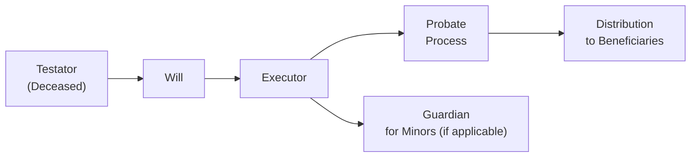

## 7.1 Writing a Will

Writing a will is a crucial step in any well-rounded financial plan. If you’re like many people, you might put off drafting a will, thinking, “I’m too young,” or “It’s too expensive,” or simply, “I don’t have enough assets to worry about.” Yet, that single piece of paper (or a set of pages, if you prefer) can transform into a powerful legal document that determines how your home, investments, family heirlooms, and other treasures will be distributed when you’re no longer around. Maybe—like me—when I first encountered the concept of a will, I had vague flashes of old detective movies, reading scenes full of drama while the family lawyer unveiled the testator’s “true wishes.” But in real life, the process is far simpler and, well, far less dramatic (most of the time).

A written will is a legal instrument that ensures your personal effects and finances end up in the hands of the people (or organizations) you choose. This chapter aims to give you a full, friendly breakdown of how wills work in Canada, why they’re so important, and the practical steps you can take to write one that’s legally valid and easy for your loved ones to follow. We’ll explore the fundamental requirements for drafting a will, highlight best practices, share a few pitfalls, and give you a sense of what to do next if you want to dig deeper. So let’s jump in and talk about how you can effectively write a will that serves as the cornerstone of your estate plan.

---

### The Purpose of a Will

A will speaks for you after you’re gone. In Canada, as in many countries, the legal system provides a set of “default rules” if a person dies without a will (a state called intestacy). But there’s a very good chance those default rules won’t match your personal wishes. For example, you might want to leave your guitar collection to a dear niece, or you might have charitable organizations you’re passionate about supporting. A will ensures all that is properly documented.

In most Canadian provinces, the applicable legislation is grounded in common law, with specific statutes governing wills and estates. In Quebec, the system is governed by the Civil Code of Québec, which includes unique procedures for how wills should be created and validated. But overall, the big idea remains the same: a will is that central document guaranteeing your instructions are followed. Without it, your estate could be distributed in ways you never intended, and your loved ones might have to endure a lengthy court process to figure out who gets what.

A big part of your role as a financial advisor—or as someone planning your own estate—is to ensure that the final distribution of assets aligns with your or your client’s personal, financial, and familial goals. Think of a will as the bedrock that anchors the rest of the estate plan.

---

### Key Players and Terms

Before we delve into the nitty-gritty, let’s define some common terms you’ll see frequently:

• **Testator:** The individual who creates and signs the will. In other words, you (or your client).  
• **Beneficiary:** A person—or organization—who receives benefits (assets, property, or other privileges) from a will.  
• **Estate:** The total assets and liabilities of the deceased person. This includes everything from real estate holdings and bank accounts to personal items like jewelry.  
• **Executor (or Estate Trustee in some provinces):** The person you name in your will to administer your estate, pay any outstanding debts and taxes, and distribute your assets to beneficiaries.  
• **Testamentary Capacity:** The legal and mental ability to make or alter a valid will. Essentially, being of sound mind and understanding the nature and consequences of writing a will.

---

### Creating a Valid Will

In Canada, provincial and territorial laws govern the specifics of how a will must be written and executed. Yet, there are some universal elements you should be aware of:

#### Age and Mental Capacity

The testator typically must be of the age of majority in their province or territory of residence (18 or 19 in most places). Exceptions sometimes exist—particularly if you’re married or a member of the armed forces. It’s also crucial that the testator has “testamentary capacity,” meaning they understand:

• The nature of the document they’re signing (i.e., that it’s their will).  
• The extent of their assets and belongings.  
• Who their legal heirs or dependents might be.  
• That this document explains what should happen to their property upon death.

If someone is not of sound mind or lacks testamentary capacity, the document may be challenged or deemed invalid at a later time.

#### Writing and Form Requirements

A valid will must be in writing. Within that requirement, there are generally three types of recognized formats in Canada:

• **Formal Will:** Typed, printed, and signed by the testator in the presence of witnesses (usually two witnesses). These witnesses also sign, affirming that they watched the testator sign and that the testator appeared competent.  
• **Holograph Will:** Handwritten entirely by the testator and signed by them. No witnesses are required in many jurisdictions for a holograph will. But holograph wills often lead to disputes if they’re not crystal clear or if there’s concern about the testator’s mental state.  
• **Notarial Will (Quebec):** In Quebec, a notarial will is drawn up by a notary according to specific formalities provided by the Civil Code. The will is read, signed, and authenticated by the notary, which usually simplifies the probate process later on.

In some provinces, even if your will doesn’t fully meet these formal requirements, the courts can still validate it if they see evidence of the testator’s intentions. But it’s definitely best to follow all formalities meticulously to reduce uncertainty. I once had a friend discover that their aunt’s home-written, single-page “letter of intent” was never formally witnessed. Getting that recognized in court took patience, legal fees, and more than a few migraines.

#### Clear Identification and Language

Your will should identify who you are (the testator); appoint one or more executors; name beneficiaries for each significant asset or portion of the estate; and list any guardians for minor children. It’s also a good idea to include a residual clause covering the distribution of any property not specifically mentioned. Using clear, unambiguous language helps prevent confusion or disputes after you’re gone. Ambiguity is the number-one culprit behind inheritance battles—nobody wants that.

---

### Distribution of Assets

Distributing assets in a will might seem straightforward but can grow complex depending on your financial situation. For instance, if you have an investment portfolio, you need to be precise about how many shares or what percentage of your investment portfolio goes to each beneficiary. Also note that certain assets (like life insurance policies or Registered Retirement Savings Plans (RRSPs) with named beneficiaries) might pass outside your will. In that scenario, the designated beneficiaries on those accounts typically override any instructions in your will. Keep that in mind as you coordinate your entire estate plan.

Many advisors also suggest setting up trusts, especially if there are minor beneficiaries or family members with special needs. A trust can be established in the will (called a “testamentary trust”) to ensure resources are managed properly and professionally until the beneficiary reaches a certain age or meets specific conditions.

---

### Appointing an Executor

The executor is often both an honored and challenging role. This individual becomes responsible for wrapping up affairs, applying for probate, paying off any debts, filing taxes, and distributing assets as outlined in the will. So it’s wise to pick someone you trust implicitly—maybe a close family member who is well-organized and can handle the administrative tasks or a close friend who’s got that detail-oriented knack. In some cases, people even choose professional corporate executors, such as a trust company, although this usually comes with a fee.

It’s prudent to have at least one alternate executor in case your primary executor is unable or unwilling to take on the role. Clarity in your will can help everything run smoothly and reduce friction among survivors. 

---

### Guardianship for Minor Children

If you have minor children, your will is the place to indicate who should care for them if you’re not around. This is not a decision to be taken lightly, and it’s definitely one you’ll probably want to discuss with the prospective guardians before making it official (trust me, it’s an awkward surprise if they have no idea!). The guardian will typically have legal custody and make day-to-day decisions, ranging from education to healthcare. It’s common to have a separate trustee take care of the child’s inheritance, ensuring that funds are managed responsibly until the child reaches the age you set—often 18 or 21, depending on your preference and provincial law.

---

### The Signature and Witness Requirements

Signatures are a big deal. In most provinces, your witnesses:

• Must be present together with you (the testator) when you sign (or acknowledge your signature).  
• Should not be beneficiaries or even spouses of beneficiaries under the will (or you risk invalidating the gifts made to them).  
• Are typically at least the age of majority.  

Though digital or electronic wills are gaining traction in some jurisdictions, the majority of Canadian provinces have not fully embraced them. Check your local provincial or territorial regulations if a digital approach is something you’re considering.

---

### Storing Your Will

Um, so about all that care you put into writing your will—where do you keep it so it’s safe and accessible? You can place a will in a secure location, such as a home safe or a safety deposit box at your financial institution. There’s also the option of leaving your will with your lawyer or notary, who can store it for you. A big “must-do” is to let your executor know where exactly the will is kept. Some provinces even allow for registration of wills with official registries, giving you and your loved ones another layer of certainty. 

Nothing’s more stressful for your executor than having to rummage through your entire house to find a single piece of paper—especially if your will is taped behind a painting, or stashed in your freezer (true story: I once heard a legal professional mention that a client stored their holograph will in a plastic wrap inside a freezer “for safekeeping.” It was found, eventually, but definitely not ideal).

---

### The Need for Periodic Reviews

Life changes quickly. You get married, buy a business, have a new grandchild, or maybe you go through a separation—any major life event is a good cue to revisit your will. Actually, you should consider reviewing your will at least every three to five years, even if no major event has occurred. Over time, your financial position might shift drastically, and you want to be sure that your current resources are distributed exactly the way you’d want.

It’s often simplest to update your will with a formal codicil, or to rewrite it altogether if changes are extensive. Think of it as routine maintenance—just like how you’d update your resume when you change jobs, you update your will when your personal or financial life evolves.

---

### Working with Professionals

Although there are free or low-cost will kits and open-source templates available, it’s generally recommended to consult with a lawyer or notary (particularly in Quebec) to ensure your will meets all requirements of your province or territory. Often, a standardized form might not capture the nuances of your particular family situation, or might contain ambiguous language leading to confusion down the road. Working with a qualified professional is the best way to avoid those pitfalls and ensure your wishes are respected.

If you’re a financial advisor under the purview of the Canadian Investment Regulatory Organization (CIRO)—the national self-regulatory body that replaced the defunct MFDA and IIROC—familiarizing yourself with estate-related client inquiries is quite important. While you typically wouldn’t draft a will yourself, understanding core principles helps you guide clients effectively. You can recommend they seek legal advice, highlight potential pitfalls, or coordinate the discussion on how certain assets (like registered plans or insurance policies) align with the overall estate distribution strategy.

---

### Practical Example

Imagine a scenario: Teresa, a 45-year-old single parent with two kids under 10, owns a condo in Toronto, has an RRSP, and a TFSA. She earns a decent salary and wants to be sure her kids are cared for if something unexpected happens. She drafts a will appointing:

• Her sister as both guardian and trustee.  
• Her parents as alternate guardians if her sister can’t fulfill the role.  
• A trust to hold her assets until her children turn 21.  
• A gift of $5,000 to her favorite animal shelter.  

Teresa also reviews the beneficiary designations on her RRSP and TFSA, naming her estate as the beneficiary so that the funds flow into the trust she’s established in the will. She meets with a lawyer to confirm all formalities, ensuring the language is crystal clear. She signs it in front of two witnesses who have no stake in the will.

Three years later, Teresa decides to review everything after building up an even larger RDC account. She updates the guardian instructions because her parents’ health has deteriorated, so she now wants her best friend to serve as an alternate guardian. She’s also started to invest in real estate. She updates her instructions accordingly—turns out that original will from three years ago was no longer a perfect fit. This is exactly how maintaining a will in response to life changes can make a world of difference.

---

### Mermaid Diagram: Estate Distribution Overview

Below is a simple diagram showing the flow of a will from the moment of the testator’s passing to the final distribution of assets. This is just a high-level schematic to trace the roles and steps.

• The “Testator (Deceased)” indicates the individual who has passed away.  
• The “Will” is the legal document.  
• The “Executor” steps in to manage the estate as directed by the will.  
• The “Probate Process” is a court-supervised procedure that may be required in various provinces for validating the will.  
• Lastly, once all debts are paid and the court has deemed the will valid, the “Distribution to Beneficiaries” occurs in line with the will’s instructions.  
• “Guardian for Minors” is a parallel consideration if the testator’s children are minors and require a legally designated caregiver.

---

### Common Pitfalls

• **Failing to Name an Alternate Executor:** If your first executor can’t or won’t serve, there’s a risk of confusion.  
• **Forgetting to Update Beneficiary Designations:** Sometimes the designations on RRSPs, TFSAs, or insurance policies override the will. That mismatch can create big headaches (and heartbreaks!).  
• **Using Ambiguous Language:** “I leave my house to my sister,” might be unclear if you own multiple properties or co-own real estate with someone else. Spell out details so the nature of your ownership is clear.  
• **Not Reviewing the Will After Major Life Events:** Inheritance can get tossed around in unexpected ways if you get married, divorced, or have new children but fail to update your will.  
• **Lack of Professional Help:** While it’s possible to draft a valid will on your own, complicated family or financial situations can benefit from professional guidance.

---

### Best Practices

• **Be Thorough:** List out your assets and clarify who gets what.  
• **Be Clear:** Use plain language so there’s less room for dispute.  
• **Keep It Safe:** Store the original in a secure but accessible place.  
• **Communicate:** Talk with your executor, and if relevant, your proposed guardian in advance so they understand your intentions.  
• **Review and Update:** Make periodic reviews or updates, especially after life milestones.  
• **Seek Professional Input:** If you have complex assets (like a business partnership or multiple properties across provinces), definitely consult a lawyer or notary.

---

### Additional Resources

If you’d like to explore more detailed information on wills and estate planning, check out:

• **Government of Canada**: “What to include in a will and powers of attorney” (https://www.canada.ca/)  
• **The Canadian Bar Association**: Offers extensive resources, checklists, and best practices for writing a will (https://www.cba.org/)  
• **People’s Law School (British Columbia)** and **Éducaloi (Quebec)**: Both provide free, accessible online legal information to the public.  
• **“The Canadian Guide to Will and Estate Planning”** by Douglas Gray and John Budd: An in-depth, plain-language reference that covers a wide range of estate planning topics.  
• Local provincial **Law Society** websites often provide basic will forms and tips for engaging a lawyer.  
• For official updates regarding the financial industry, including compliance and regulations, refer to the **Canadian Investment Regulatory Organization (CIRO)** website at https://www.ciro.ca.  
• Keep in mind that the **Canadian Investor Protection Fund (CIPF)** is the sole investor protection fund in Canada, providing coverage if a member firm becomes insolvent.

Staying informed and leveraging these resources can help ensure that your will accurately captures both your financial realities and your personal wishes. Ultimately, a will is not just a piece of paper; it’s part of your lasting legacy—one that protects the people and values you care about the most.

---

## Test Your Knowledge: Key Steps in Writing a Will



### Which of the following statements best describes the role of a will? 
- [ ] It is solely used to name a guardian for minor children.
- [ ] It exists primarily to protect the executor from liabilities.
- [x] It dictates how a person’s property and assets should be distributed after death.
- [ ] It only applies to life insurance policies.

> **Explanation:** A will is a legal document that outlines how a person’s assets and property should be distributed after their passing. It may also include guardianship instructions for minor children, but that’s not its sole purpose. 

### Which term describes the legal and mental ability to make or alter a valid will?
- [ ] Beneficiary Capacity
- [x] Testamentary Capacity
- [ ] Executive Capacity
- [ ] Trustee Capacity

> **Explanation:** Testamentary capacity means understanding the nature of writing a will, the value of one’s assets, and the effect of the document’s instructions.

### In Canada, who generally must witness the signing of a formal will?
- [x] Two witnesses who are not beneficiaries under the will
- [ ] Three family members who are direct heirs or beneficiaries
- [ ] One lawyer and one family member
- [ ] Notaries only, regardless of province

> **Explanation:** The typical requirement is two witnesses (not beneficiaries) who observe the signing of the will. This prevents conflicts of interest and ensures the validity of the process.

### Which of the following is a unique characteristic of notarial wills in Quebec?
- [ ] They do not require a signature.
- [ ] They can be created entirely electronically.
- [ ] They bypass the probate process in every other province.
- [x] They are drawn up by a notary and usually simplify later estate settlement.

> **Explanation:** In Quebec, a notarial will is prepared and signed before a notary. It often simplifies the probate process compared to other forms of wills.

### When should a will typically be reviewed or updated?
- [x] Whenever there’s a major life event such as marriage, divorce, or birth of a child
- [ ] Only after receiving professional legal advice
- [x] Every few years or whenever significant financial changes occur
- [ ] Only upon reaching retirement age

> **Explanation:** It’s best practice to review your will periodically (e.g., every three to five years) and after major life events to ensure it reflects your current wishes, assets, and family structure.

### Which document is created after the testator passes away to validate the will in many provinces?
- [ ] The Holograph Letter of Instruction
- [x] A Grant of Probate
- [ ] Intestacy Certificate
- [ ] Executor’s Deed

> **Explanation:** “A Grant of Probate” is the document received once the court validates the will and confirms the executor’s authority to distribute the estate.

### Who or what usually determines the distribution of some registered assets (like RRSPs) if designated beneficiaries differ from the will’s provisions?
- [x] The beneficiary designation form
- [ ] The will automatically overrides all beneficiary designations
- [x] The testator’s immediate family members
- [ ] The probate court refuses to recognize such assets

> **Explanation:** Registered assets like RRSPs or TFSAs with named beneficiaries typically pass outside the will, and the beneficiary designation generally overrides the will.

### Why is storing a will securely yet accessibly important?
- [x] Because it ensures the executor can locate it quickly
- [ ] Because it accelerates the estate settlement without probate
- [ ] Because it replaces the need for witnesses
- [ ] Because handwritten wills cannot be stored

> **Explanation:** Keeping a will safe and accessible helps the executor and beneficiaries avoid unnecessary delay or confusion when settling the estate.

### What can happen if a will uses ambiguous language regarding the distribution of property?
- [x] The will might be contested or challenged in court.
- [ ] The assets automatically pass to the legal spouse.
- [ ] The will becomes null and void overnight.
- [ ] Ambiguous language is always upheld by default.

> **Explanation:** Ambiguity can lead to disputes and prolonged court proceedings, making it crucial to use clear and specific language.

### True or False: A person under 18 can never create a valid will in any Canadian province.
- [x] True
- [ ] False

> **Explanation:** Generally, individuals must be at the age of majority to create a valid will, but remember that certain exceptions may apply (e.g., being married or serving in the military). The statement as presented is tricky because some exceptions do exist, so in most conventional scenarios, an under-18 individual can’t create a will. However, the strict reading of the statement might differ in very specific jurisdictions or unusual conditions. 


