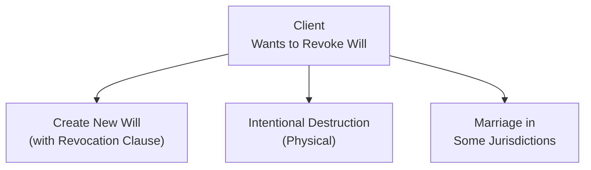

## 7.2 Revoking and Amending a Will

Imagine this scenario: you’ve settled down for the evening with a nice cup of tea, thinking everything is perfectly arranged in your estate plan—then you remember your will was drafted years ago, before you had the slightest clue about your changing family circumstances. You may have overlooked a new grandchild, or maybe you’re newly married and forgot to factor in your spouse. In these moments, advisors (like you or me or any financial planner friend you might have) start to say, “Hmm, maybe it’s time we look at how to update that will.” That’s exactly why understanding how to revoke and amend a will is crucial. Ready for a deep dive?

Revoking and amending a will is not just about fiddling with fancy documents; it’s about ensuring your wishes stay aligned with your reality. And trust me, life doesn’t stand still—marriages happen, divorces occur, births fill our lives with new responsibilities, loved ones pass away, and sometimes financial circumstances simply shift. If our will doesn’t keep pace, it can lead to confusion, heartache, and unintended results down the road. So let’s roll up our sleeves and explore the many ways to ensure your last will and testament always reflects your current goals and desires.

---

### Why Revoking or Amending a Will Matters

Before we talk about the nuts and bolts of revocation or amendments, let’s think about why it even matters:

• Life events: Marriage, divorce, birth of a child, death in the family—these are all major turning points. If your will doesn’t reflect those events, the people you want to take care of could end up left out or subject to legal battles.

• Asset changes: Your financial picture may evolve significantly over time. For example, you might acquire property, sell a business, or invest in new ventures. If your will doesn’t reflect those changes, your assets might not be allocated the way you originally intended.

• Clarity and fairness: A will that doesn’t match your current thought process can be ambiguous and cause disputes among relatives. A properly updated will, on the other hand, can help minimize confusion and the potential for legal contests.

• Peace of mind: Finally, there’s a sense of relief in knowing your estate plan is up to date. Why leave things uncertain when you can ensure your instructions are crystal clear?

---

### Common Methods of Revoking a Will

It might sound a bit dramatic to say we’re “revoking” a will. But hey, it’s the correct legal term for effectively canceling an existing will’s power. Generally, there are three main ways to revoke a will:

1. Creating a brand-new will with a revocation clause.  
2. Intentionally destroying the existing will.  
3. Under certain jurisdictions, marrying (or re-marrying) can automatically revoke an existing will, unless the will explicitly states it was drafted in contemplation of that marriage.

Let’s talk through each of these.

#### Creating a New Will with a Revocation Clause
Arguably the most straightforward way to revoke—and simultaneously replace—your existing will is to write a new one. Usually, this new document includes a standard “revocation clause.” You might have seen language like, “I hereby revoke all previous wills and codicils,” near the start of the document.

Best practice is to ensure this statement is clear and unequivocal so there’s no doubt you’re canceling any other testamentary documents. Think of it like upgrading your phone’s operating system; once you install the new version, the old system is no longer relevant. But, obviously, this is far more important than a phone OS, so clarity is paramount.

#### Intentional Destruction
You’ve seen dramatic scenes in movies: someone sets fire to a piece of paper and declares, “Be gone!” Indeed, physically destroying a will with the intention to revoke it can be effective. The same is true if you tear it to pieces or otherwise damage it to make it unreadable. But it’s important that the destruction be intentional. Accidental damage—like spilling your morning coffee or losing the will in the attic—doesn’t necessarily revoke the will, and it can lead to disputes about the will’s validity if found partially intact.

If you decide to go this route, I’d say be thorough. The last thing you want is an incomplete revocation where only part of the document is destroyed, leaving grounds for someone to argue about what your “true” intent really was.

#### Marriage in Some Jurisdictions
Here’s a twist: In many Canadian jurisdictions, getting married can automatically revoke your previously existing will. The logic behind this is that marriage often changes your obligations and financial responsibilities. However, it’s not universal—some jurisdictions have changed or adapted these rules, and in some places, you can draft a will that specifically states it’s “in contemplation of marriage.” That language effectively says, “Look, I know I’m getting married, but I still want this will to stand.”

Because these rules can vary by province, it’s wise to double-check with a legal advisor or reference guidance from your provincial law society. Keep in mind that the professional oversight of a lawyer or notary can ensure you’re following local laws correctly.

---

### Codicils: A Quick Way to Amend

Sometimes, you don’t need to forcefully revoke the entire will. Maybe you just want to change one clause. Suppose your sister, who was a beneficiary under your will, moved overseas and you’d like to simplify that bequest or reassign her portion. The classical approach would be to use a codicil—a separate legal document that amends a previously executed will. 

• How does a codicil work?  
  Well, you draft a separate document laying out exactly which parts of the will you’re changing. Then, like the will itself, your codicil must be signed and witnessed with the same legal formalities governing wills in your province or territory. If you fail to observe the same execution requirements, the codicil might be ruled invalid.

• Watch out for confusion.  
  One reason many lawyers advocate drafting a fresh will instead is that multiple codicils can create confusion and increase the risk of contradictory statements. If you have one codicil from ten years ago, another from five years ago, and a brand-new one from last year, there’s a chance these documents will conflict with each other or confuse your executors.

• Examples:  
  – Let’s say you only want to add a contingency for a new child. A quick codicil might do the trick.  
  – Or maybe you sold a cottage property you’d referenced in your original will. That’s a smaller, straightforward update that you can handle with a codicil.  

Even with these examples, many folks these days find it simpler to just create a new version of the entire will to avoid the patchwork effect that multiple codicils can bring.

---

### Important Triggers for Updating a Will

We all know life changes are unavoidable. Here are some events that should wake you up to the need for amending or revoking a will:

• Marriage or divorce.  
• Birth or adoption of a child.  
• Death of a beneficiary or executor.  
• Significant changes in assets (acquisition or sale of a business, property, investments, etc.).  
• Moving to another jurisdiction with different estate laws.  
• A substantial shift in your philosophy about bequests or charitable giving.  

Advisors should always encourage their clients to do a “will check-up” after major life changes or at least every three to five years. I had a friend, let’s call her Susan, who got divorced but never bothered updating her will for nearly a decade. When she remarried, let’s just say the situation got messy, and the will didn’t remotely reflect the new arrangement. After that fiasco, Susan became the strongest advocate of “schedule that check-up now!”

---

### Keeping Tabs on Assets, Liabilities, and Beneficiaries

It might seem mundane to maintain an itemized list of your assets, liabilities, and beneficiaries, but trust me, it’s incredibly helpful. If you have to add a new beneficiary, or remove one, or shift the distribution, having that up-to-date list means less guesswork. You can more seamlessly integrate changes—whether by codicil or a new will—while also minimizing the possibility of something slipping through the cracks.

Most people keep spreadsheets or use personal finance software, and some folks rely on open-source financial tools. As long as the list is updated regularly (like every six months or every time a big life event happens), it’ll make the entire process of revoking or amending your will that much smoother.

---

### Execution Requirements for Codicils and New Wills

This part can feel a bit formal, but it’s critical. In Canada, wills and codicils must typically meet these criteria:

1. Signed by the testator (person making the will) in front of witnesses, usually two (2) in most provinces.  
2. Witnesses can’t generally be beneficiaries.  
3. Each page (in some jurisdictions) may need the testator’s initials to indicate it’s part of the same document.

If you’re using a codicil, you generally have to meet the same formal requirements. Many provinces have online resources from their law societies explaining the specifics. The Law Society of Ontario, for instance, has a set of guidelines you can follow, and so does the Law Society of British Columbia. 

Pro Tip: The Canadian Bar Association also provides great resources (https://www.cba.org/For-The-Public) detailing how a will can be changed and what formalities must be observed. It’s always a good idea to reference these guidelines or consult a lawyer to make sure you don’t stumble on a minor technicality that could invalidate your document.

---

### Best Practices for Advisors

In the spirit of encouraging best practices:

• Proactive communication: If you’re a financial advisor or planner governed by CIRO (the Canadian Investment Regulatory Organization)—which, by the way, replaced the old IIROC and MFDA—you should guide clients to periodically review their estates. Remind them of the triggers that might require a will update.

• Collaborate with legal professionals: Estate planning usually intersects with the services provided by lawyers. A strong collaboration ensures your financial planning recommendations align properly with the client’s legal documents.

• Keep a thorough paper trail: Whenever your client discusses amending or revoking a will, keep notes summarizing the conversation, especially if you collaborated with their lawyer. This ensures you have a record of the client’s intentions and reduces liability for everyone involved.

• Avoid partial or confusing changes: If a client’s will is riddled with codicils or if they’re wanting to make multiple modifications, gently nudge them toward drafting a new will. That can prevent confusion and reduce the risk of contradictory instructions.

• Offer a “clients’ life-event checklist”: Something as simple as a one-page summary of possible triggers—marriage, divorce, changes in net worth—can be a great addition to an advisor’s toolkit.

---

### Potential Pitfalls and How to Avoid Them

• Failing to consult a professional: Even though one can technically draft a will or codicil without a lawyer, doing so can result in errors or unintended consequences.

• Overlooking witness requirements: If the will or codicil is not witnessed properly, it could be partially or wholly invalid. In some provinces, failing to follow witnessing guidelines might make your codicil worthless in the eyes of the court.

• Multiple codicils leading to contradictions: Too many cooks in the kitchen, so to speak, can create confusion. Instead of having one codicil for your new cottage, another for adjusting your executor, and yet another for changing a beneficiary, consider consolidating all those changes into a new will.

• Not telling anyone: A will hidden away is not very helpful if nobody knows it exists or that it’s been amended. Make sure the people who need to know—your executor, a trusted friend, or family member—understand where the most current legal documents are kept.

• Forgetting to destroy older versions: If you draft a new will but don’t physically destroy old ones, you might cause confusion if someone digs up that older will in a desk drawer. This is especially risky when the new will doesn’t contain a proper revocation clause.

---

### Real-Life Examples and Case Studies

1. The “Unanticipated Marriage” Case:  
   Let’s say Fred gets married but forgets that in his province, marriage automatically revokes any prior will unless it’s explicitly stated otherwise. After his marriage, he passes away, leaving an old will behind that makes no mention of his new spouse. The courts may rule that, due to local legislation, his old will was revoked at the time of marriage. This can lead to an intestacy scenario (where the state decides how his estate is distributed). If Fred wanted his new spouse to inherit everything, but that’s not how the intestacy rules are set up, we suddenly have a big issue—one that could have been avoided with a simple revision to his will.

2. The “Too Many Codicils” Snafu:  
   Linda wrote her will 10 years ago, then a codicil 7 years ago, another codicil 3 years ago, and yet another codicil 1 year ago. Now her son says the third codicil contradicts the second one on how the vacation property is passed down. The confusion leads to a family dispute in court, costing time, money, and emotional stress. Again, a comprehensive new will could have boiled all those changes down into a single, coherent document.

---

### Visualizing the Revocation Process

Sometimes a picture can help. Below is a simple Mermaid diagram to illustrate the main ways to revoke a will:

Explanation:  
• Start with the node “Client Wants to Revoke Will” (A). From there, you can either (B) create a brand-new will with a revocation clause, (C) physically destroy the existing will, or (D) rely on marriage-based revocation rules (where applicable).

---

### Role of Regulatory and Professional Bodies

You may be wondering, “What do professional bodies like CIRO have to do with this?” In Canada, the Canadian Investment Regulatory Organization (CIRO) oversees investment dealers, mutual fund dealers, and market integrity. While CIRO doesn’t directly regulate the drafting of wills—that’s more of a provincial responsibility—advisors under CIRO’s oversight typically provide guidance or referral services concerning estate planning.

If you come across references to MFDA or IIROC in older texts, keep in mind they’re now defunct predecessor self-regulatory organizations that merged into CIRO. For official updates, you can check out the CIRO website at https://www.ciro.ca.

Advisors or planners governed by CIRO are expected to uphold standards of professionalism and client care. That often includes maintaining knowledge of when to refer clients to estate lawyers and highlighting the importance of a valid, up-to-date will.

---

### Additional Resources for Revoking and Amending Wills

• Provincial Law Societies:  
  – Law Society of Ontario  
  – Law Society of British Columbia  
  – Law Society of Alberta  
  Each offers resources on proper procedures for revocation and codicils.

• Estate Administration—A Practical Guide for Lawyers and Paralegals (varies by province):  
  These guides can be helpful for those wanting an in-depth legal approach to codicils, witnessing requirements, or best practices for storing wills.

• Canadian Bar Association:  
  – Their site (https://www.cba.org/For-The-Public) is full of articles on how to change a will, how to plan an estate, and where to find legal assistance.

• Open-Source Financial Tools:  
  – While direct coding or open-source spreadsheets can help track assets and liabilities, be sure to keep them updated. Tools like GnuCash or simple spreadsheet templates can ensure you have a record of what goes where in your estate plan.

If you’re aiming to deepen your expertise, I’d also recommend reading about the Uniform Wills Act, which some provinces have adopted in part. It provides more standardized rules around how wills can be revoked or clarified.

---

### Bringing It All Together

Revoking and amending a will might seem like a daunting concept, but if you break it down, it’s all about ensuring your legal documents match your current wishes. Just remember:

• A brand-new will with a revocation clause is typically the cleanest way to update your estate plan.  
• Destroy the old will if you want to be certain there’s no confusion.  
• Keep an eye on provincial rules regarding marriage and revocation.  
• A codicil can work if you only have minor changes, but sometimes, writing a new will is simpler.  
• Always follow the proper execution formalities for a will or codicil.  
• Keep an updated list of assets, liabilities, and beneficiaries so you’re never playing catch-up.  

If you tackle these issues methodically—and keep a legal professional in the loop—your estate plan will stay tidy and clearly reflect your intentions. Think of it as an ongoing part of financial wellness. After all, your estate is the legacy you’ll leave behind, so it’s worth giving it the proper attention and care now.

---

## Test Your Knowledge: Revoking and Amending a Will Quiz



### Which of the following statements accurately describes a revocation clause in a will?

- [x] It declares that all previous wills and codicils are canceled.
- [ ] It only cancels previous codicils, not the entire will.
- [ ] It allows a will to be revoked automatically after 10 years.
- [ ] It only applies to digital wills.

> **Explanation:** A revocation clause is intended to revoke all prior testamentary documents, ensuring no earlier will or codicil remains valid.

### Which of the following is NOT a valid way to revoke a will in most Canadian jurisdictions?

- [ ] Creating a new will with a clear revocation clause.
- [x] Damaging the front cover of your existing will by accident.
- [ ] Manually tearing it up with the intent to destroy it entirely.
- [ ] Drafting a will that states it is made in contemplation of marriage in jurisdictions where marriage normally revokes a will.

> **Explanation:** An accidental partial destruction (e.g., damaging only the front cover without intent to revoke) generally does not constitute valid revocation.

### When might a codicil be preferable to drafting a whole new will?

- [x] When the changes are minor and do not introduce conflicting instructions.
- [ ] When you want to change more than half of the provisions.
- [ ] When your old will has no revocation clause.
- [x] When you only need to add or remove a small bequest or adjust a single executor appointment.

> **Explanation:** A codicil works best for minor amendments, such as small revisions to beneficiaries or executors, while extensive changes might require a new will.

### What is an important execution requirement for both wills and codicils in most provinces?

- [x] They must be witnessed by two individuals who are not beneficiaries.
- [ ] They can be witnessed by close family members as long as they sign twice.
- [ ] They only require the testator’s signature without witnesses.
- [ ] They must be notarized by a bank manager.

> **Explanation:** Witnessing requirements are strict; typically, two witnesses who are not beneficiaries or spouses of beneficiaries must sign to validate the will or codicil.

### Which scenario might automatically revoke your previously existing will in certain Canadian jurisdictions?

- [x] Entering into a legal marriage if the will was not created “in contemplation” of that marriage.
- [ ] The birth of your second child.
- [x] Getting married in a province that follows automatic revocation upon marriage.
- [ ] Turning 65 years old.

> **Explanation:** Some jurisdictions stipulate that a will is revoked upon marriage unless it specifies it was drafted in contemplation of that marriage. Birth of a child or turning 65 does not automatically revoke a will.

### Which document amends a will without replacing it entirely?

- [x] Codicil
- [ ] Residual Clause
- [ ] Probate Certificate
- [ ] QAnon Clause (not an actual clause)

> **Explanation:** A codicil is specifically designed to modify or clarify a previously executed will, rather than replacing it altogether.

### Why might writing multiple codicils lead to complications?

- [x] Each codicil might introduce contradictory clauses.
- [ ] It automatically invalidates the original will.
- [x] It can create confusion for executors and beneficiaries.
- [ ] It is illegal in all Canadian provinces.

> **Explanation:** Multiple codicils can conflict with one another or the original will, leading to confusion and challenges in probate.

### Which of the following is a best practice when drafting a new will?

- [x] Explicitly state in the document that all previous wills and codicils are revoked.
- [ ] Keep all old wills and codicils for reference, without any revocation clause.
- [ ] Allow your primary beneficiary to act as the witness.
- [ ] File it directly with your bank without signatures.

> **Explanation:** Stating that all previous wills and codicils are revoked is crucial to avoid having multiple valid estate documents.

### What is a common trigger for needing to update a will?

- [x] Divorce or remarriage.
- [ ] Watching a television show about wills.
- [ ] Buying new furniture for your living room.
- [ ] Obtaining a credit card with a rewards program.

> **Explanation:** Major life events such as marriage, divorce, or the death of a beneficiary typically warrant revisiting your will to ensure it aligns with your new situation.

### True or False: All Canadian provinces automatically revoke a will upon marriage.

- [x] True
- [ ] False

> **Explanation:** Though some provinces have altered this tradition, historically many Canadian jurisdictions stipulate that marriage revokes an existing will unless the document expressly states it is made “in contemplation of marriage.” However, be sure to check provincial law, as there is variation.


