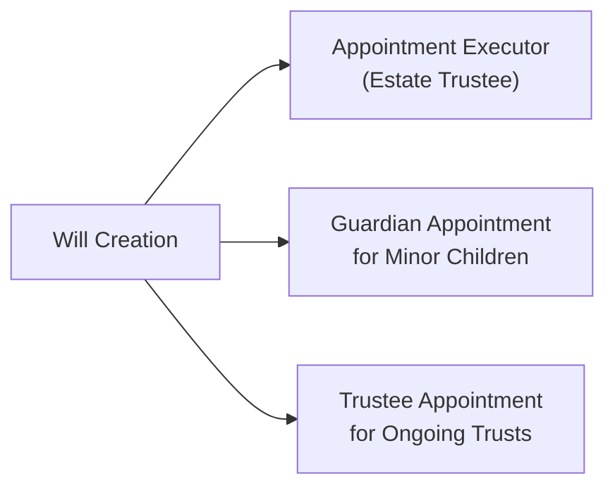

## 7.3 Appointment of Executors, Guardians, and Trustees

Imagine you've just finished writing your will—maybe after chatting with a friend who enthusiastically urged you to “get your estate in order.” You’re feeling pretty good until you realize you have some impressive-sounding roles to fill: executor, guardian, trustee. Um, how do you even begin figuring out which names should go in those spots?

It’s a question I faced personally when I helped my aunt manage her estate documents. I remember flipping through legal forms and thinking, “Wait, I need to name who?” and “They do what exactly?” So, let’s break down what these roles are all about. In this section, we’ll unravel the responsibilities of executors (also known as estate trustees), guardians for minors, and trustees for ongoing trusts—highlighting how they differ, what qualities you should look for when choosing them, and why backup appointments can save everyone from big headaches down the road.

By the end, you’ll feel equipped to confidently designate the right people in your will. And hey, if you still feel a little uncertain, that’s totally normal—just remember that estate planning is a process that evolves as your life and financial situation change.

---

### Overview of Key Roles

In Canada, the terms executor, guardian, and trustee may overlap or differ slightly depending on provincial legislation, but here’s a quick overview:

• Executor (or Estate Trustee): This is the person (or persons) who carries out the instructions of your will—everything from settling debts and filing taxes to distributing assets among beneficiaries.  
• Guardian: If you have minor children, this is the individual who assumes legal responsibility for them should you pass away or become unable to care for them. Sometimes a court will confirm this appointment.  
• Trustee: If your will creates a trust (for example, for a child’s education or for a relative with special needs), the trustee is responsible for managing the trust assets in the best interests of the beneficiary.

These roles can sometimes overlap. For instance, your executor might also be the trustee for a child’s trust. Or your child’s guardian may naturally become trustee of the child’s inheritance. However, you don’t have to conflate them if it’s not in the best interest of the estate or the child.

Below is a simple diagram illustrating how these different appointments flow from the will:

You can see that all appointments—executor, guardian, and trustee—are essentially “activated” by the will once the testator (the person writing the will) passes away. Each has separate but complementary duties.

---

### Executor (Estate Trustee): Responsibility, Power, and Challenges

#### Purpose and Duties

When the testator dies, the executor (or estate trustee, depending on the province) steps in to:

• Locate the will and file for probate if needed.  
• Manage and protect the estate’s assets—things like bank accounts, property, and investments.  
• Pay outstanding debts, expenses, and taxes (including final income tax returns, estate administration tax, etc.).  
• Distribute remaining assets to beneficiaries as instructed in the will.  

That might sound straightforward—collect the money, pay the bills, hand over what’s left. But there’s so much more nuance, especially if the estate has complex assets or if there are family conflicts. A friend of mine was named executor for her mom’s estate, and she was shocked at the amount of paperwork involved, the back-and-forth with the Canada Revenue Agency, and juggling the beneficiaries’ expectations. She learned the hard way that it’s not just about handing over big checks; it’s about meticulously documenting everything, making sure no legitimate creditor is overlooked, and filing the correct tax forms. 

#### Choosing an Executor

A good executor is someone detail-oriented, organized, and diplomatic. You want to ensure they’re responsible enough to handle the estate’s financial and legal complexities. An executor may need to:

• Consult professionals (lawyers, accountants, or trust officers).  
• Communicate clearly with beneficiaries.  
• Make tough decisions under stressful circumstances—maybe even facing disputes.  

It’s also perfectly acceptable to appoint a corporate executor (like a trust company) if you believe no one in your inner circle is prepared to handle the complexity, or if you’d rather avoid straining personal relationships. This will, of course, entail a fee for professional services, but it can be worthwhile in more complicated estates.

#### Contingent Executor

Imagine you put your best friend, Linda, as the executor. But if Linda is unable or unwilling to serve at the time of your death—maybe she’s dealing with a serious illness of her own—who steps in? That’s why you appoint a contingent (or backup) executor. This ensures continuity for your estate’s administration, preventing your beneficiaries from having to scramble to the courts to appoint someone.

---

### Guardians: Caring for Minor Children

#### The Role of Guardians

Guardianship can be divided into two main categories:

• Guardian of the Person: Responsible for the daily care and well-being of the child—think of it as the new parental figure.  
• Guardian of Property (or Trustee for the Child): Manages assets on behalf of the minor.  

In some cases, the same person does both. In others, you might separate the roles. For example, maybe your sister is wonderful with kids and you’d love her to raise yours, but you prefer your brother (who’s a whiz with finances) to manage the child’s inheritance until they come of age. That’s perfectly valid.

Keep in mind that guardianship appointments might need approval from the courts. If a guardianship appointment isn’t clearly laid out in your will (or if it’s contested), the provincial Office of the Public Guardian and Trustee (OPGT) may step in to help make decisions or even take over temporarily.

#### When Are Guardians Needed?

Typically, guardians are needed when both parents have passed away, or if the surviving parent is deemed unfit or unable to care for the child. Actually, I once saw a scenario where a colleague had a severely ill spouse, and they named a guardian in advance just to be safe in case both were no longer around. It was one of those “better safe than sorry” moves that can be a huge blessing if tragedy strikes.

#### The Emotional Side

Selecting a guardian can be more emotionally charged than picking an executor because you’re literally asking someone to raise your children. You’ll want to consider:

• Values, lifestyle, and parenting style of the potential guardian.  
• Practical factors—do they have the space, time, and willingness to raise another child?  
• The guardian’s own family dynamics.  
• Location: Are you okay with your children moving out of province or out of the country?  

Remember to talk to your intended guardian first! It can be a serious shock for someone to discover they’re named as a guardian in a will without prior discussion.

#### Contingent Guardians

Like with executors, you may want a secondary guardian in case your first choice cannot serve. The last thing anyone wants is a legal scramble while children are left without a clear caretaker.

---

### Trustees: Ongoing Management of Trusts

#### Testamentary Trusts

Sometimes you don’t want to hand an 18-year-old a huge lump sum of inherited wealth. Instead, you might create a testamentary trust, which comes into effect upon your death. The trustee then holds and manages those assets for the beneficiary until they reach a more mature age—or until certain milestones are met (like graduating university).

• Common scenario: “I direct that my estate be held in trust for my child until they reach, say, 25, at which point the funds are distributed.”  
• The trustee invests, manages, and pays out expenses in alignment with the trust’s rules.  

Whether you’re dealing with a special needs trust, a spousal trust, or an education trust, the trustee’s role is to uphold the beneficiary’s best interests. That might involve balancing the trust’s growth with the beneficiary’s current financial needs.

#### Choosing a Capable Trustee

Selecting a trustee involves many of the same considerations as selecting an executor—someone responsible, financially savvy, and able to handle record-keeping. However, the trustee’s duties can last for years. If you name a dear friend who’s approaching 75, consider whether they’ll be comfortable managing a trust for the next decade or two. In such cases, you might prefer a younger trustee or a corporate trustee for long-term stability.

Sometimes, for large or complex trusts, families employ trust companies or specialized professionals. These can be costlier but offer professional oversight and reduce the potential for personal conflicts. 

#### Oversight and Accountability

Trustees must comply with formal duties under provincial legislation, ensuring they manage the trust’s assets prudently and provide periodic accounts to the beneficiaries or the court. If you read up on Ontario’s Trustee Act or the Alberta Estate Administration Act, you’ll see guidelines regarding trustee powers and obligations. The guiding principle is always the “trustee’s fiduciary duty”—to act in the best interests of the beneficiary.

---

### Practical Examples and Case Studies

Let’s ground these concepts in a few hypothetical scenarios:

• Scenario A: John and Lisa have two children, ages 8 and 12. Their will names Lisa’s brother as the guardian because he lives nearby and shares similar values. They name John’s cousin, an accountant by profession, as trustee to manage the inheritance. That cousin is also the contingent executor if John’s longtime best friend cannot serve.  

• Scenario B: Marie, a single professional with no children, has complex assets (a company, multiple investment accounts). Marie names a corporate executor because none of her relatives have the expertise—or temperament—to handle a multi-million-dollar estate. She also establishes a trust for her niece’s education, appointing a professional trustee to oversee it for the next 15 years.  

• Scenario C: Tomas and Rachel have one child with special needs who may require long-term care. Their will includes a testamentary trust specifically for special-needs planning. They name a trustee familiar with provincial disability grants, the Registered Disability Savings Plan (RDSP), and the child’s day-to-day care needs. This trustee works closely with the child’s guardian to ensure a stable, supportive environment.

In each scenario, you notice how duties are allocated based on who is best suited for each job. And having backups is a safety measure against unforeseen obstacles.

---

### Best Practices and Common Pitfalls

#### Best Practices

• Communicate in Advance: Let people know you’re naming them. It helps avoid unpleasant surprises.  
• Consider Professional Advice: Complex estates often require lawyers, accountants, or trust professionals for a reason—don’t hesitate to bring them in.  
• Create Contingencies: Always name backup executors, guardians, and trustees.  
• Keep It Updated: If relationships change or the person moves overseas, you might want to revisit your appointments.  

#### Common Pitfalls

• Appointing Someone Unreliable: A friend might be well-intentioned but has zero organizational skills or is dealing with their own financial troubles.  
• Failing to Provide Direction: If your will is too vague, your executor or trustee might struggle to interpret your wishes correctly (and you could face legal challenges).  
• Avoiding the Conversation: Many people don’t talk to the potential guardian or trustee ahead of time, leading to confusion or refusal when the time comes.  
• Neglecting Local Laws: Each province has distinct rules (e.g., Ontario’s Estates Act, Alberta’s Estate Administration Act). Overlooking these can cause legal complications.

---

### Legal and Regulatory Considerations

Estate administration is firmly guided by provincial and territorial law in Canada, so:

• Ontario’s Estates Act or Alberta’s Estate Administration Act set out many responsibilities for executors.  
• The Office of the Public Guardian and Trustee (OPGT) in each province can step in if minors are involved and there’s no appointed guardian, or if there’s a dispute.  
• Provincial guardianship legislation often requires that the proposed guardian apply for formal guardianship if the appointment is contested or if other complexities arise.  
• In some provinces, an executor may be required to apply for a Grant of Probate (or Grant of Administration), especially if the estate is large or if the will’s validity is questioned.

On a federal level, the Canada Revenue Agency (CRA) has requirements for final tax returns, clearance certificates, and other tax matters related to estates and trusts. If your estate includes investment accounts or mutual funds, remember that your investment dealer is regulated by the Canadian Investment Regulatory Organization (CIRO), Canada’s single self-regulatory body overseeing investment dealers, mutual fund dealers, and market integrity. (Note: The MFDA and IIROC were amalgamated into CIRO on January 1, 2023, so references to those organizations now apply only historically.)

---

### Open-Source Financial Tools and Additional Resources

While there isn’t a huge catalog of specialized open-source estate planning software, you can still use open-source personal finance programs (e.g., GnuCash, KMyMoney) to keep track of your assets, making it simpler for executors or trustees to handle your estate. The more organized and transparent your records are, the less likely your appointed individuals will encounter confusion.

If you want more advanced estate planning resources, here are some places to start:

• **Society of Trust and Estate Practitioners (STEP Canada)**: Offers professional education and certification in trust and estate planning. (https://step.ca/)  
• **Office of the Public Guardian and Trustee (OPGT)**: Consult their website for details on guardianship, powers of attorney, and estate administration in your province.  
• **CIRO**: Canada’s national self-regulatory body for investment dealers and mutual fund dealers. If your estate includes significant investment holdings, ensure your executor coordinates with a CIRO-regulated firm. (https://www.ciro.ca)  
• **Provincial Legislation**: Familiarize yourself with local estate acts (e.g., Ontario’s Estates Act, Alberta’s Estate Administration Act).  

---

### Encouraging Thought and Action Steps

Estate planning isn’t just a one-and-done scenario. It evolves along with your life’s circumstances—marriage, children, property purchases, even new business ventures. It’s perfectly normal to amend your will multiple times to keep up. Just be sure to review the appointments if something major changes in your proposed executor’s or guardian’s life.

Anyway, if you find yourself thinking, “But I’m only 30—do I really need all this?” trust me: it’s easier to name a guardian, trustee, and executor now than to scramble in a crisis. Life can surprise us, and the simplest gift you can give your loved ones is clarity through your legal documents. So take a moment, consider who you can rely on, maybe chat with a legal professional, and ensure your will has these bases covered.

Remember, the next section will talk about intestacy, but we obviously want to avoid that scenario if possible. By thoughtfully appointing executors, guardians, and trustees, you’re taking a massive step to ensure your wishes are honored in the smoothest way possible when you’re no longer around to call the shots.

---

## Test Your Knowledge: Executors, Guardians, and Trustees



### Which responsibility typically falls under the executor's role?

- [x] Paying the deceased's outstanding debts and distributing assets to beneficiaries
- [ ] Serving as a guardian of minor children
- [ ] Creating a trust for minors after the will is written
- [ ] Filing for child custody in provincial court

> **Explanation:** The executor is primarily in charge of administering the estate, which includes paying debts and distributing assets. Guardianship pertains specifically to caring for minors, and trusteeship pertains to managing trust assets.

### What is a primary consideration when choosing a guardian for minor children?

- [x] Whether the individual shares similar values and parenting philosophies
- [ ] Their professional credentials in estate planning
- [ ] Whether they are an accountant or banker
- [ ] The ability to rewrite the will after your death

> **Explanation:** When choosing a guardian, the most critical factor is whether the individual can provide a stable, loving environment that aligns with your values. Professional credentials matter more when selecting a trustee to manage finances.

### Which statement best describes a testamentary trust?

- [x] A trust established under the terms of a will that activates upon the testator’s death
- [ ] A trust valid only during the testator’s lifetime
- [ ] A trust that circumvents all Canadian tax laws
- [ ] A trust requiring a letter of direction from the executor

> **Explanation:** A testamentary trust is created when the will takes effect after the testator’s death. It doesn’t exist during the testator’s lifetime.

### Why might someone appoint a contingent guardian?

- [x] To provide an alternative if the primary guardian cannot serve
- [ ] To allow the executor to share guardianship responsibilities
- [ ] Because the guardian is automatically disqualified by provincial law
- [ ] To avoid needing to list specific guardians in the will

> **Explanation:** A contingent, or backup, guardian is specified in case the first-named guardian is unwilling or unable to fulfill the role, ensuring continuity of care for minors.

### Which quality is essential for someone serving as a trustee?

- [x] Strong financial management skills
- [ ] Personal familiarity with all family members
- [x] Willingness to serve for a potentially long duration
- [ ] Private legal practice in any Canadian province

> **Explanation:** A trustee should be financially adept to manage assets responsibly and must be willing (and able) to serve for possibly many years if a trust endures. Legal practice is not necessary if the trustee seeks professional guidance.

### Which of the following statements is TRUE about appointing an executor?

- [x] You can name a corporate trustee or trust company if no suitable individual is available
- [ ] The executor must be an immediate family member
- [ ] Provincial law mandates the executor must reside in your home province
- [ ] The executor can transfer their responsibilities to the OPGT without probate

> **Explanation:** It’s permissible to name a professional or corporate executor if you lack a reliable personal option. There is no legal requirement that the executor be an immediate family member; selection criteria focus on capability and suitability.

### When does the Office of the Public Guardian and Trustee (OPGT) typically get involved?

- [x] If there is no valid will or no qualified guardian for a minor
- [ ] To manage all of the deceased’s outstanding debts
- [x] In cases of dispute over guardianship or trustee appointments
- [ ] To restructure all testamentary trusts into living trusts

> **Explanation:** The OPGT steps in when minors are left without proper guardianship or if there’s a significant dispute about estate administration. They do not routinely manage a deceased’s debts unless they become a court-appointed administrator.

### Which factor is often overlooked when appointing a guardian?

- [x] The guardian’s long-term capacity to raise a child
- [ ] The guardian’s ability to pass a stockbroker exam
- [ ] The guardian’s net worth
- [ ] The guardian’s preference for advanced estate planning

> **Explanation:** People often forget to consider whether the guardian can provide care for many years. Financial ability matters, but the more important factors are emotional readiness, stability, and willingness to serve long-term.

### Why do experts recommend choosing a backup executor?

- [x] In case the primary executor declines or predeceases you
- [ ] So the guardian has authority to decide the estate’s distribution
- [ ] To help the OPGT appoint a trustee automatically
- [ ] Backup executors cannot access estate funds

> **Explanation:** If the named executor cannot act, having a backup avoids court delays and simplifies estate administration.

### Choosing different individuals for guardian and trustee is sometimes recommended because:

- [x] It separates the duties of child-rearing from financial management
- [ ] Provincial laws forbid single individuals from performing both roles
- [ ] It removes the potential for any communication between them
- [ ] Only a professional can serve in both capacities

> **Explanation:** Some prefer to split the responsibilities between someone who is good at parenting and another who can handle finances, ensuring each can focus on their strengths. There is no law requiring that they be different individuals, but it can be a sensible choice in certain situations.


