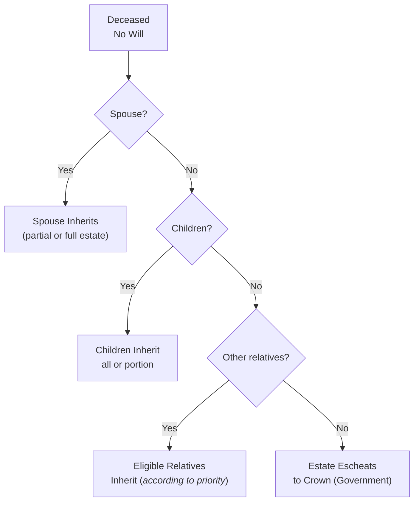

## 7.4 Intestacy

Have you ever heard a story where someone passed away unexpectedly, leaving behind a decent-sized estate, but no will? This can happen more often than you’d think. A few years ago, I remember chatting with a neighbour who told me all about his cousin’s estate and how the family was struggling to figure out who should inherit what. The cousin, apparently, had never quite gotten around to writing a will, so his estate went through this labyrinthine court process that shocked everyone with how long it took. That’s the gist of “intestacy”—when someone dies without a valid will in place.

Intestacy introduces a whole bunch of complications, and it raises important questions about who inherits, which relatives get priority, and whether common-law spouses or distant cousins have any claim to the assets. If you’re trying to help clients avoid such a fate (or maybe even avoid it yourself), it’s useful to walk through the basics, highlight the pitfalls, and suggest strategies to ensure people’s intended wishes come to life—even after they’re gone.

### What Is Intestacy?

Intestacy occurs when a person passes away without leaving a valid will. When this happens in Canada, each province or territory’s legislation steps in to decide how the estate is distributed. The laws governing this topic vary from one region to another and can be quite detailed. However, the overarching principle is that if there’s no valid will, the provincial or territorial “intestate succession” laws determine which heirs inherit the property and in what proportions.

Key definitions often include:
• Intestacy: The condition of an estate when no valid will exists.  
• Escheat: The reversion of property to the crown (i.e., the government) if no eligible heirs are found.  
• Intestate Succession: The statutory scheme that outlines how to divide an estate when a valid will is absent.

### The Importance of a Will

Why should Canadians bother writing a will if their property will be divided anyway? Well, let’s say your client wanted to leave money to a best friend or to a cherished charity, or maybe they wanted their grandchild to receive their classic car. Without a valid will, none of that can happen according to their wishes. Intestacy laws only recognize legal heirs (for instance, spouses, children, parents, siblings, nieces/nephews, etc.). Friends, charities, and more distant relatives might not be entitled to any portion of the estate.

Additionally, in some provinces, a common-law partner may not automatically inherit under intestacy. That can definitely complicate matters for couples who have lived together for years—maybe even decades—but never formalized their status through marriage or a valid cohabitation agreement. If you’re dealing with clients in such relationships, encouraging them to draft a will becomes absolutely crucial.

### How Intestate Succession Usually Works

Although specific rules vary by province or territory, the usual pattern of intestate succession in many parts of Canada often begins with the surviving spouse, then moves on to any surviving children, and continues down a specific family tree. If no spouse, child, or close relative can be located, the estate escheats to the province or territory.

The general flow can be summarized in broad strokes:

1. Spouse and Children: If an individual leaves behind a spouse, that spouse often inherits a preferential share (a set amount that can depend on provincial legislation) plus a percentage of what remains. Children might then inherit any leftover portion. If there are no children, the spouse typically inherits the entire estate.

2. Other Immediate Family: If there is no spouse or children, the estate may pass to surviving parents, siblings, nieces, nephews, or extended relatives depending on the province’s priority scheme.

3. The Government: If no eligible heirs exist or can be located, the estate escheats—meaning it returns to the provincial or territorial government, essentially becoming government property.

#### A Visual Overview

The following diagram outlines a simplified (high-level) intestacy distribution flow in many provinces. Actual distribution rules and percentages differ among jurisdictions, so treat this purely as a conceptual overview:

In some provinces, the spouse’s share depends on whether there are children from that marriage or other relationships. Some provinces establish a “preferential share” rule, which means the spouse is entitled to a set sum before the rest of the estate is divided.

### Provincial Variations and Quebec’s Civil Code

The complexities increase when we account for the unique rules of each province. For example, in Ontario, intestate succession is governed by the Succession Law Reform Act, which sets out a specific preferential share for a surviving spouse. In British Columbia, a similar concept arises in the Wills, Estates and Succession Act (WESA). Meanwhile, in Quebec, the Civil Code has its own approach to inheritance, which can differ quite a bit from the rest of Canada.

When someone passes away in Quebec without a will, the Civil Code typically divides the property among the spouse and children, if any, but the exact proportions might differ from what Ontarians or British Columbians expect. Quebec also has distinct rules that define common-law relationships differently (known as “de factounions”), potentially affecting inheritance rights for those partners if there’s no valid will in place.

### Common-Law Partners and Intestacy

One of the most significant issues arises for those in common-law relationships. In several provinces, if you’re not legally married, your partner may not automatically receive any share of your estate if you die intestate. This is a real eye-opener for many people who assume that living together for several years or having children together automatically grants the same rights as marriage. It doesn’t, at least not in all Canadian jurisdictions.

Where recognized, common-law spouses might have partial inheritance rights, but it’s best never to count on that. If you or your clients don’t want to leave intestacy to chance—and you really shouldn’t—drafting a valid will ensures that your intended partner is taken care of, no matter what statutes say.

### Real-World Example

Let’s consider a hypothetical scenario. Suppose Jane and Tom have been in a common-law relationship for 10 years in Alberta. Tom owns a home solely in his name, worth around $600,000, and has other assets like bank accounts and an investment portfolio. Unfortunately, Tom experiences a sudden medical emergency and passes away without leaving a will.

- In this scenario, how is Tom’s property distributed under Alberta’s intestacy rules? Alberta’s legislation does provide some rights to a “partner” who has lived in a relationship of interdependence for at least three years, but the exact entitlement can be drastically different than, say, a formal spouse in a legal marriage.  
- If Tom’s father is still alive, or if Tom has siblings, they could potentially share part of the estate, depending on how the statute is structured.  
- If Tom and Jane have no children and Jane can’t satisfy the legal definition for adult interdependent partners (or something along those lines), some portion of the estate might go to Tom’s father or siblings instead of Jane.

As you can see, the results could be heartbreaking for someone who relied on the legal system to “do the right thing,” only to discover that intestacy rules didn’t protect them at all.

### Consequences and Pitfalls of Dying Intestate

If you dig deeper into these rules, you might wonder, “Well, if the estate still ends up going to the spouse or the kids, is that so bad?” Actually, some serious pitfalls can arise:

• Unintended Beneficiaries: Without a valid will, you lose the ability to choose who inherits your assets. Maybe you want to leave a precious heirloom to a friend or something for your favorite charity—intestacy laws won’t accommodate that.  
• Delays and Court Costs: The process of finalizing an intestate estate often involves court-appointed administrators and can be more expensive and time-consuming than if a will named an executor.  
• Family Disputes: Relatives might challenge the distribution, especially if there are complicating factors like step-children, ex-partners, or extended family.  
• Common-Law Exclusion: As highlighted, your common-law spouse may be left with little or nothing, depending on your province’s legislation, if there isn’t a recognized marriage.  
• Additional Taxes and Inefficiencies: In certain cases, intestate distribution can lead to tax inefficiencies, where the estate might not benefit from strategies that a will could have implemented—such as tax deferral for spousal rollovers on registered accounts.

### Escheat: When No Heirs Are Found

On the rare occasion that no relatives can be found, the entire estate (or the portion without heirs) might revert to the government. This concept is known as “escheat.” While some folks might joke that they’re OK with the government receiving their assets, most people think otherwise. If it’s at all possible that a distant cousin or philanthropic cause could inherit, a will is the simpler way to ensure that your property doesn’t just vanish into government hands.

### Advisor Considerations

If you’re providing financial advice, you’ll probably find yourself discussing estate planning basics with clients sooner or later. To help them avoid the traps of intestacy:

• Encourage Will Drafting: Remind clients that writing a will is generally simpler and less expensive than people imagine, especially if their assets and family situation aren’t overly complex. Even an online or do-it-yourself kit might be better than having no will, though it’s typically best to consult a legal professional.  
• Highlight Regional Differences: Make sure your clients understand that intestacy rules vary by province or territory. If they own property in multiple jurisdictions, specialized legal advice becomes even more essential.  
• Discuss Common-Law Implications: If your client is in a common-law relationship, a frank conversation about how provincial law treats (or fails to treat) such relationships might encourage them to formalize estate plans.  
• Identify Off-Shore Assets: If the client has assets in different countries, they should investigate those local laws as well.  
• Plan for Complex Families: If your client has step-children or blended families, intestacy can be particularly messy. Encourage them to talk to an estate lawyer to clarify everyone’s inheritance rights.  
• Review Other Estate Tools: Explore beneficiary designations on RRSPs, TFSAs, insurance policies, and other registered accounts. These designations can sometimes override or bypass a will, but they can also cause confusion if not kept up to date.

### Best Practices for Avoiding Intestacy

While drafting a will is the most straightforward way to avoid intestacy, it’s not the only step you should consider:

• Update Regularly: A will can become out-of-date after significant life events (marriage, divorce, birth of children, etc.). Regular review helps ensure your wishes remain valid.  
• Keep Clear Records: Maintenance of organized documentation for bank accounts, investments, insurance policies, and real property can make estate settlement smoother.  
• Appoint an Executor: Name someone trustworthy who will handle the legal and financial responsibilities of distributing the estate. This avoids having a court-appointed administrator whose decisions might not align with your personal wishes.  
• Supplement with Powers of Attorney: Consider powers of attorney for property and personal care to clarify your intentions if you become incapacitated, as discussed in other sections of this chapter.

### A Brief Look at CIRO and Investor Protection

From an investment side, ensure you’re aware of the Canadian Investment Regulatory Organization (CIRO), which is Canada’s national self-regulatory body overseeing investment dealers, mutual fund dealers, and marketplace integrity. After the amalgamation of the Mutual Fund Dealers Association of Canada (MFDA) and the Investment Industry Regulatory Organization of Canada (IIROC), CIRO now provides a unified regulatory framework and resources at https://www.ciro.ca.

Additionally, the Canadian Investor Protection Fund (CIPF) remains the country’s only investor protection fund, protecting client assets if a member firm becomes insolvent. Although these aspects might not directly dictate intestacy rules, a solid estate plan should account for investments governed by CIRO to ensure beneficiaries receive optimal protection.

### Practical Examples and Case Studies

Imagine a scenario where your client invests in registered and non-registered accounts through a CIRO-regulated firm. If they haven’t designated a beneficiary for their RRSP or TFSA, or worse, if they pass away intestate, those assets may become part of the overall estate, subject to provincial intestacy rules. If the individual would have preferred to name someone else—say, a sibling or a cherished niece—those intentions won’t matter if not properly documented. This is a reminder that thorough beneficiary designations and well-structured wills go hand in hand, preventing the confusion that might otherwise arise.

Likewise, advisors should point out that certain cultural traditions or personal beliefs might influence how clients view estate distribution. Some clients might assume that a certain family member automatically inherits land or property based on tradition. Unfortunately, Canada’s legal system might not align with those cultural expectations unless they’re spelled out in a legally valid document.

### References and Further Exploration

• Each province’s or territory’s Succession Law Reform Act or Wills, Estates and Succession Act: Search your local government website for the most up-to-date statutes.  
• British Columbia’s Wills, Estates and Succession Act (WESA) for specific West Coast rules: https://bclaws.gov.bc.ca/civix/document/id/complete/statreg/09013_01  
• “Intestate Succession in Canada: A Provincial Overview” – Government or law society websites often compile these.  
• Community Legal Education Ontario (CLEO) and other public legal education portals provide user-friendly guides.  
• Civil Code of Quebec (for Quebec residents) – https://www.legisquebec.gouv.qc.ca/en  
• CIRO at https://www.ciro.ca for regulatory resources affecting investment accounts and how they’re governed in the context of estate planning.

It’s also a good idea for readers to check out specialized estate lawyers, local government resources, and financial planners with thorough estate planning expertise.

### Final Thoughts

Dying intestate can create chaos, invite conflict, and distribute assets in ways that may not reflect the deceased’s genuine wishes. By planning ahead and drafting a valid will, Canadians ensure their loved ones receive a clear, fair inheritance, while also simplifying the executor’s job. Understandably, some folks procrastinate, thinking they “have plenty of time,” or they avoid the topic because it feels gloomy—but the peace of mind that comes from having your affairs in order can be priceless.

As always, encourage clients to see an estate planning lawyer for the final word on drafting and executing wills. With a bit of foresight, you can help them skip the frustration and heartbreak that often accompanies intestacy.

--------------------------------------------------------------------------------

## Test Your Knowledge: Intestacy and Estate Planning in Canada



### What does "intestacy" refer to?

- [x] A situation in which someone dies without a valid will.
- [ ] A situation where a trust holds all assets.
- [ ] The probate process after a will is declared invalid.
- [ ] The process of designating beneficiaries to insurance policies.

> **Explanation:** Intestacy refers to when a person passes away with no valid will in place, causing their estate to be distributed according to legislated rules.

### Which of the following statements best describes the concept of "escheat"?

- [x] The reversion of an estate to the Crown (government) in the absence of legally recognized heirs.
- [ ] The process of transferring funds to minor beneficiaries.
- [ ] A penalty for failing to pay estate taxes.
- [ ] The shifting of property ownership from one province to another.

> **Explanation:** Escheat occurs when the state or government takes ownership of a deceased’s estate if there are no surviving heirs identified.

### In certain provinces, common-law partners:

- [x] May not automatically inherit under intestacy.
- [ ] Gain full control of the estate without probate.
- [ ] Always inherit an equal share to the spouse.
- [ ] Inherit only the debts, not the assets.

> **Explanation:** Common-law partners do not automatically have the same rights as legally married spouses under intestacy laws, and this varies among provinces.

### If no spouse or children are alive, intestacy rules generally look to:

- [x] Other relatives such as parents, siblings, or extended family.
- [ ] The same distribution as if the decedent had a valid will.
- [ ] A private trust designated by the deceased's employer.
- [ ] The decedent’s creditors only.

> **Explanation:** Without a spouse or children, intestacy laws usually direct the estate to other next-of-kin, such as parents, siblings, nieces/nephews, or more distant relatives.

### Which of the following typically happens when an estate is settled under intestacy?

- [x] The court appoints an administrator to manage the estate distribution.
- [ ] A private executor chosen by the decedent at random manages the estate.
- [x] Family disputes are more likely to occur due to unclear inheritance instructions.
- [ ] The estate remains in limbo until the beneficiary designations are updated.

> **Explanation:** In intestacy situations, the court usually appoints an estate administrator. With no will-based instructions, disputes are more common because family members may have conflicting ideas about who should inherit.

### Which jurisdiction in Canada has intestacy rules guided by the Civil Code rather than common law?

- [x] Quebec
- [ ] Ontario
- [ ] British Columbia
- [ ] Saskatchewan

> **Explanation:** Quebec’s legal system is governed by the Civil Code, which has distinct rules on intestacy and inheritance compared to common law provinces.

### In Ontario, what law primarily governs intestate succession?

- [x] The Succession Law Reform Act
- [ ] The Wills, Estates and Succession Act (WESA)
- [ ] The Civil Code of Quebec
- [ ] The Estate Distribution Act of 1882

> **Explanation:** Ontario’s Succession Law Reform Act outlines how an intestate estate is handled, including specific directives regarding the surviving spouse and children.

### Which of the following is a key reason why intestacy might lead to undesirable outcomes?

- [x] It may force an estate to be divided contrary to the decedent’s actual wishes.
- [ ] It reduces potential probate fees to zero.
- [ ] It guarantees higher asset value for relatives.
- [ ] It allows immediate distribution to any friend of the deceased.

> **Explanation:** Intestacy generally applies a legal formula for asset division that may not reflect the individual’s personal preferences or relationships.

### What is the best way to ensure specific heirs or charities receive assets from an estate?

- [x] Draft a valid will explicitly naming beneficiaries.
- [ ] Leave it up to the courts to interpret the decedent’s intention.
- [ ] Hope that intestacy rules align with personal preferences.
- [ ] Create an unwritten agreement and rely on family goodwill.

> **Explanation:** A valid, up-to-date will is the only reliable method to specify how and to whom assets should be distributed, ensuring the decedent’s wishes are honored.

### True or False: Once MFDA and IIROC merged, they ceased to exist as separate entities, now operating under CIRO.

- [x] True
- [ ] False

> **Explanation:** The MFDA and IIROC were amalgamated to form CIRO, which took over the regulatory functions for mutual fund dealers, investment dealers, and market integrity.


