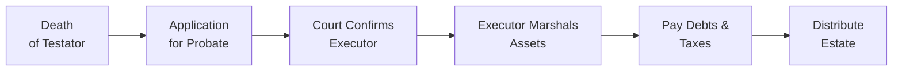

## 7.5 Probate

Probate—sometimes called “proving the will”—is the legal process that confirms the validity of a deceased person’s will and officially appoints the executor (or estate trustee) who will administer the estate. In most Canadian provinces, the executor (the person named in the will to manage the estate) must apply to the court or relevant provincial registry for a Grant of Probate (also known in some jurisdictions as a Certificate of Appointment of Estate Trustee). This court application provides the executor with legal authority to collect the deceased’s assets, pay any outstanding debts and taxes, and distribute the remaining property to beneficiaries according to the will’s instructions.

You might hear people talk about probate as though it’s a big scary word—and, sure, it can be confusing if you’ve never had to deal with it before! But once you break it down a little, it becomes much easier to manage or at least to plan for. In this section, we’ll dig deep into how probate works, the types of fees or taxes involved (often called estate administration taxes), and some of the ways that thoughtful estate planning can reduce or bypass probate. We’ll also explore how advisors—whether you’re a seasoned financial rep or just someone who’s helping a family member—can guide clients (or relatives) through the ins and outs of probate with lesser stress. 

This process is primarily governed by provincial legislation, so specific requirements vary from one province to another. Generally, though, the core concept of confirming the will and appointing an executor remains consistent across Canada. If you’ve ever heard someone say “The will’s not worth the paper it’s printed on unless it’s probated,” that’s an exaggeration, but it underscores one important fact: financial institutions typically need to see the probate grant before they’ll release most of the deceased’s assets. 

Below, we’ll delve into the world of probate in detail, including the fun stuff like how to mitigate probate fees (sometimes called estate administration taxes), how to handle the process from start to finish, and key pitfalls to avoid.

---

## What Is Probate?

Probate is the court-supervised process of validating a will. When a person passes away, the will they left behind outlines how their assets should be distributed and identifies who should handle those distributions—often the “executor.” Once probate is granted, banks, investment dealers, and other institutions feel confident that the executor has the authority to manage and distribute the deceased’s assets.

Because estate matters can be sensitive, most provinces have tried to make the probate process as straightforward as possible (though some might argue it’s still a maze of paperwork). There are typically standard forms and procedures you can find through provincial justice department or court service websites. For instance, Ontario Court Services has downloadable forms, and Alberta Courts provide detailed checklists explaining what is required to probate an estate. In any case, the underlying need is for the court to be satisfied that the will is indeed the final, legally valid version and that the executor applying is the correct person to handle the estate.

---

## How the Grant of Probate Works

Once an executor submits the necessary forms and fees to the provincial authority, the court or registry reviews the will. If everything checks out, the court issues a Grant of Probate (in some provinces, it might be titled slightly differently—Certificate of Appointment of Estate Trustee, for example). This grant is the formal legal document that states, “Yes, this is the valid last will of the deceased, and this individual is the authorized executor.”

It’s typically at this point that the executor can confidently approach banks, investment dealers governed by the Canadian Investment Regulatory Organization (CIRO), insurance companies, or other institutions to gather the deceased’s assets. Prior to your receiving that official stamp of approval, it can be tricky to move forward because many institutions simply refuse to release funds without it. They don’t want to risk giving money or property to the wrong person or someone with an outdated will.

---

## Why Probate Is Often Required

• Financial institutions require it: Banks, insurance companies, and investment firms want assurance that the executor is legitimate.  
• Prevents disputes: Probate is a legal confirmation, so it helps short-circuit conflicts from potential heirs who may claim the will is invalid—or that they’re actually the proper executor.  
• Transfers assets with confidence: Probate ensures that property transfers follow the correct legal procedure.  

In essence, probate is like an official seal of approval that helps keep the distribution process fair and transparent.

---

## Probate Fees and Estate Administration Taxes

Here’s one of the first questions people ask: “How much are probate fees going to cost me (or my estate)?” The answer: It depends on which province or territory you’re in. Each jurisdiction sets its own fee schedule, sometimes as a flat fee and sometimes scaled based on the total value of the estate.

• In Ontario, for instance, probate fees (officially called Estate Administration Tax) are calculated mostly on that portion of the estate’s value that exceeds $50,000, at a rate of 1.5%.  
• In British Columbia, the cost is 0.6% on the first $50,000 above a threshold and 1.4% on the portion above $50,000.  
• In Alberta, there is a maximum cap, so the fees typically end up less costly for larger estates.  

No matter the province, these fees can add up. If you have a sizable estate—especially one that’s real-estate-heavy—this can be a significant hit. 

Below is a simplified illustration showing how probate fees might differ across the country:

| Province | Approx. Fee Structure (Subject to Change) |
|----------|-------------------------------------------|
| Ontario  | $0 for first $50K, 1.5% on amount > $50K  |
| B.C.     | 0.6% on estate > $25K to $50K; 1.4% +     |
| Alberta  | Tiered flat fees, max ~$525               |
| Quebec   | No “estate administration tax” per se, but must pay notarial fees (if applicable) |
| Nova Scotia | 0.5% on first $100K, 1.5% above $100K  |

(This table is for illustration only—check province-specific websites to confirm the latest fees.)

Being aware of these fees can help you and your clients plan ahead. For example, in high-fee provinces, some individuals may incorporate probate-avoidance techniques, which we’ll see can be a wise move or a total headache, depending on the situation.

---

## Avoiding or Minimizing Probate

It can be tempting to try to sidestep probate fees altogether. And, yes, in many cases that’s possible—for instance:

• Joint Ownership with Right of Survivorship: Placing assets in joint name with another person (often a spouse) can mean that when the original owner passes away, the asset passes automatically to the surviving joint owner without needing probate.  
• Beneficiary Designations: Certain assets, such as Registered Retirement Savings Plans (RRSPs), Registered Retirement Income Funds (RRIFs), Tax-Free Savings Accounts (TFSAs), and life insurance policies, allow you to name a direct beneficiary. If a beneficiary is named, the asset bypasses the estate and goes straight to that person on death—again, typically no probate needed.  

However, be cautious: “probate-avoidance” isn’t always that straightforward. A well-intentioned parent might add an adult child onto a bank account to avoid probate, but that can create problems:  

1. Family-law implications: Assets that pass outside the estate might be subject to claims by the new owner’s creditors or ex-spouse.  
2. Tax complications: Shifting assets might trigger capital gains or attribution rules.  
3. Control issues: Adding someone as a joint owner means they have immediate co-ownership—you can’t just “take it back” at will.  

So, while skipping the probate process can seem great from a cost-savings perspective, you’ve got to weigh the pros and cons. Is avoiding the $1,000 or $2,000 in fees worth potential complications or disputes among family members? It might be simpler—and more secure—to keep full control of your assets and let them flow into your estate, paying the probate fees in due course. In some estates, paying the fees is truly the “cost of doing business” for a smooth settlement.

---

## Timeline and Process

Now, let’s walk through a typical, simplified probate timeline. Of course, exact durations will vary depending on the complexity of the estate, backlog in the courts, and any family disputes that arise.

• Death of Testator: The individual passes away, leaving behind a will (hopefully stored safely in a place someone can find it).  
• Application for Probate: The named executor completes and submits probate forms to the local court or registry, along with filing fees and original documents as required.  
• Court Confirms Executor: Once approved, the executor receives the Grant of Probate, which signals to third parties—banks, insurance companies—that the executor can legally manage the deceased’s assets.  
• Executor Marshals Assets: Gathering bank accounts, investment accounts with CIRO member firms, real estate deeds, insurance policies, etc.  
• Pay Debts & Taxes: The executor must ensure that all outstanding debts, including credit cards, mortgages, funeral costs, and final income tax return balances, are dealt with.  
• Distribute Estate: Finally, the executor can distribute remaining assets to the beneficiaries in line with the will’s instructions.  

Depending on the complexity, this can be as short as a few months or drag out over a year or more, especially if something is contested or if the estate has complicated tax or legal issues.

---

## Practical Example: A Real-Life (Brief) Anecdote

A friend of mine, let’s call him Michael, recently acted as executor for his aunt’s estate in Ontario. He’d never dealt with probate before—he was, you know, that nephew who was “the only one with a spreadsheet.” When Michael started, he didn’t realize how quickly the estate administration taxes could add up. After some research, he found that his aunt’s home was worth quite a bit. The probate fees were large but still manageable (it was around 1.5% of the estate value over $50,000). 

Yes, he could have saved a bit by transferring property to family beforehand, but his aunt had always been hesitant to do that. In the end, Michael paid the probate fees from the estate, processed the forms, and got everything approved. He said the hardest part was just the logistical details—collecting all those official documents, making sure the funeral home bills and taxes were paid. However, with proper organization, it went surprisingly smoothly, even though it took about six months from death to final distribution.

Moral of the story: Whether or not you try to minimize probate fees, it’s critical to keep good records, keep lines of communication open with institutions, and (if you’re the executor) don’t hesitate to get professional help if you need it.

---

## Common Pitfalls in Probate

• Missing deadlines: Some provinces have specific timelines for filing documents or notices. Missing these can delay distribution and potentially incur penalties.  
• Disorganized records: If the deceased never told anyone where the will was stored—or if they have assets spread across five different banks—compiling everything can become a real headache.  
• Family disputes: Siblings might question the validity of the will or resent the executor’s decisions. Probate helps, but it can’t prevent all conflict!  
• Unintended tax issues: Joint ownership or other transfer tactics might inadvertently trigger taxes or capital gains liabilities that could have been avoided with professional tax planning.  

---

## Advisor’s Role and Best Practices

Advisors—financial planners, investment reps, or simply well-informed friends—play a crucial role both before and after the testator’s death:

• Encourage estate planning: Making or updating a will, choosing an executor, and documenting assets can spare loved ones a ton of stress.  
• Clarify beneficiary designations: Double-check that registered accounts (e.g., RRSP, TFSA) and insurance policies have correct and updated beneficiaries.  
• Estimate probate fees: Everyone hates surprises. Provide rough estimates of probate costs based on provincial rules.  
• Consider alternatives carefully: Weigh pros and cons of naming joint owners or using trusts to bypass probate.  
• Keep records: The best gift an executor can give themselves is a well-arranged set of documents. Digital tools can help track assets, liabilities, insurance policies, and more.  

In addition, it’s important that advisors understand provincial rules around probate. Even if you can’t give “legal advice,” you can at least point your clients in the right direction—“You may want to talk to a lawyer or visit Ontario Court Services’ website for the forms you’ll need,” or “Check out the provincial guidelines for the exact fees to expect.”

---

## Potential Family Law and Tax Consequences of Probate Avoidance

Holding assets jointly with a spouse can work smoothly if the relationship is good, the spouse is financially responsible, and there’s no second spouse from a different marriage in the picture. But many times, life is complicated. Adding an adult child as joint owner to an account might have unintended family-law consequences if that child goes through a divorce or has creditors chasing them. 

From a tax perspective, moving assets around hastily can trigger capital gains if the asset has increased in value. Also, if the “joint owner” only owns a portion legally, you might have an attribution issue for tax purposes. Executors need to watch out for these pitfalls because it’s easy to get caught off guard. It’s always wise to consult with a tax professional or an estate lawyer to ensure there are no nasty surprises.  

---

## Tips for Speeding Up the Probate Process

• Organize original documents: Confirm that copies of the will are easy to find and that the originals are stored securely (e.g., in a safe deposit box or with the lawyer who drafted them).  
• Notify key institutions early: As soon as you have the death certificate and the court application in progress, notify banks and investment dealers regulated by CIRO. They can provide estimates of account balances and let you know if anything else is required.  
• Pay taxes and debts promptly: The estate can’t be wrapped up until liabilities are settled. Keep track of due dates and consider setting up an estate bank account for easier recordkeeping.  
• Seek professional guidance: Especially for complex estates, an estate lawyer or accountant can keep the process on track.  

---

## Glossary

• Probate (Grant of Probate): The court certificate confirming the validity of a will and appointing an executor.  
• Right of Survivorship: Ownership structure where, upon the death of one owner, the ownership of the asset passes directly (outside the estate) to the surviving owner(s).  
• Estate Administration Tax (or Probate Fee): The fee charged by the province for granting probate or registering the estate for administration.  

---

## Additional Resources and References

• Provincial Court Services:  
  – Ontario: Visit ontario.ca/page/estate-administration-tax for up-to-date probate fees and forms.  
  – Alberta: alberta.ca/wills-and-estates.aspx for checklists and detailed procedures.  
  – British Columbia: gov.bc.ca (search “Probate and Estate Administration”)  
• Executor’s Handbook by Jennifer Greenan: A comprehensive guide with checklists and templates for handling estates.  
• Law Depot & Other Online Platforms: Provide basic legal document templates. Although they can be helpful, you’ll generally want to seek professional legal advice to avoid mistakes.  
• CIRO: Canada’s self-regulatory body overseeing investment dealers, mutual fund dealers, and market integrity (https://www.ciro.ca).  
• Canada Revenue Agency (CRA): For detailed information on final tax returns, see canada.ca/en/revenue-agency.html.  

If you’re helping someone with their estate planning or acting as an executor, it never hurts to read up on the relevant legislation, like Ontario’s Estates Act or the Wills and Succession Act in Alberta, to confirm you’re following the right procedures.

---

## Reflecting on Cross-References

• In relation to 7.1 Writing a Will: Remember that probate starts with a valid will. If the will is invalid or contested, the process can take much longer (sometimes known as “intestacy” when there’s no valid will—see section 7.4 Intestacy).  
• In relation to 7.4 Intestacy: If you don’t leave a valid will, the estate distribution follows provincial intestacy rules, which also require a legal process akin to probate—except the court first has to identify someone to manage the estate.  
• In many cases, the discussion of probate also intersects with sections 8.1 to 8.6 on risk management and life insurance (see Chapter 8). Insurance proceeds can bypass probate if properly structured with a named beneficiary.  

---

## Conclusion

Probate can sound intimidating, but it’s essentially a legal process designed to protect everyone: testators, beneficiaries, and institutions holding assets. By confirming that the will is valid and formally appointing the executor, probate helps ensure that an estate is settled in an orderly manner, with minimal dispute. Yes, it can involve paying fees, gathering a mountain of documents, and waiting for the courts to approve everything, but for most families, that’s just part of life’s final administrative tasks.

As an advisor or a well-informed personal representative, your role is to guide individuals in understanding what probate entails, how to plan for it, and when it’s worth trying to avoid it (while being mindful of potential unintended consequences). If you or your clients keep organized records, communicate clearly, and possibly seek legal and accounting advice for complex estates, the probate process can roll along more smoothly—a thoughtful last testament to the deceased’s legacy.

---

## Test Your Knowledge: The Ultimate Probate Essentials Quiz



### 1. Which statement best describes probate in Canada?

- [x] It is the legal process confirming the validity of a will and appointing an executor.  
- [ ] It is the mandatory requirement to file a tax return after someone’s death.  
- [ ] It is the inheritance tax levied by federal authorities.  
- [ ] It is the only way to name a beneficiary for registered accounts.  

> **Explanation:** Probate confirms that the will is valid and the specified executor has legal authority to manage the estate on behalf of the deceased.

---

### 2. What is typically the official outcome of a probate application?

- [ ] A certificate of early inheritance allowing beneficiaries to claim assets right away.  
- [ ] A notarized letter from the bank.  
- [x] A court-issued Grant of Probate (or Certificate of Appointment).  
- [ ] A statement that the executor is personally liable for any debts of the estate.  

> **Explanation:** After filing the proper documentation and fees, the court issues the Grant of Probate, naming the executor or estate trustee and confirming the will’s validity.

---

### 3. Which of the following assets usually bypass probate?

- [x] RRSPs or RRIFs with a named beneficiary.  
- [ ] A GIC with no named beneficiary.  
- [ ] Real estate held in a deceased’s sole name.  
- [ ] Personal artwork within the estate.  

> **Explanation:** Assets with a direct beneficiary designation (e.g., registered investments, life insurance policies) often pass outside the estate and thus do not require probate to be transferred.

---

### 4. How are probate fees (or estate administration taxes) determined in most provinces?

- [ ] They are charged as a flat rate of $10,000, regardless of estate size.  
- [x] They vary by province and often relate to the estate’s total value.  
- [ ] They are waived for all estates under $1,000,000.  
- [ ] They include a separate federal levy set by the CRA.  

> **Explanation:** Probate fees (or estate administration taxes) vary across provinces and typically depend on the value of the assets passing through the estate.

---

### 5. Which arrangement can help avoid probate, but may introduce potential family-law or tax complications?

- [ ] Creating a formal trust with a corporate trustee.  
- [x] Holding assets jointly with an adult child who may face divorce or creditor issues.  
- [ ] Drafting a second will for a different province.  
- [ ] Purchasing additional life insurance coverage.  

> **Explanation:** Adding another person as joint owner can indeed bypass probate, but it can also expose those assets to that joint owner’s potential legal, creditor, or family disputes.

---

### 6. Identify one major duty of an executor after receiving the Grant of Probate.

- [x] Paying all outstanding debts and taxes of the estate before distributing to beneficiaries.  
- [ ] Immediately dissolving any existing mortgages on real property.  
- [ ] Automatically receiving life insurance proceeds for personal use.  
- [ ] Filing a “waiver of liability” for personal obligations.  

> **Explanation:** The executor has a legal duty to settle all debts, taxes, and other liabilities before distributing remaining estate assets.

---

### 7. In many provinces, what is a common reason a financial institution demands to see a probated will?

- [ ] To confirm the testator’s final instructions on charitable donations.  
- [x] To ensure the executor is legally recognized and has the authority to access the deceased’s accounts.  
- [ ] To reduce the institution’s own taxes.  
- [ ] To validate that the will was created by a lawyer.  

> **Explanation:** Probate is a safeguard for institutions, ensuring they release funds only to the legally authorized executor.

---

### 8. Why might the probate process take more than a year for some estates?

- [ ] Most Canadian courts close for six months each year.  
- [x] The estate may have complex assets, pending family disputes, or tax reviews causing delays.  
- [ ] All beneficiaries must appear before a judge in person.  
- [ ] Creditors can automatically extend the probate process by four years.  

> **Explanation:** Multiple factors—from complicated assets to disputes and tax reviews—can extend the timeline well beyond a few months.

---

### 9. Which statement about minimizing probate fees is most accurate?

- [x] Attempts to avoid probate fees (e.g., joint ownership, beneficiary designations) should be balanced against potential tax or legal risks.  
- [ ] Probate fees can be waived if the estate is filed within 90 days of death.  
- [ ] Most provinces impose a 10 percent penalty if you attempt to avoid probate.  
- [ ] Naming an executor who lives abroad automatically reduces fees.  

> **Explanation:** While there are strategies to minimize probate, they can create unintended legal or tax consequences that could outweigh the savings.

---

### 10. True or False: The executor’s authority to manage and distribute the deceased’s assets is only confirmed after probate is granted.

- [x] True  
- [ ] False  

> **Explanation:** An executor’s authority is formally recognized once the court issues probate (or a similar certificate), meaning institutions will typically wait until probate is granted before giving the executor control of the deceased’s assets.


