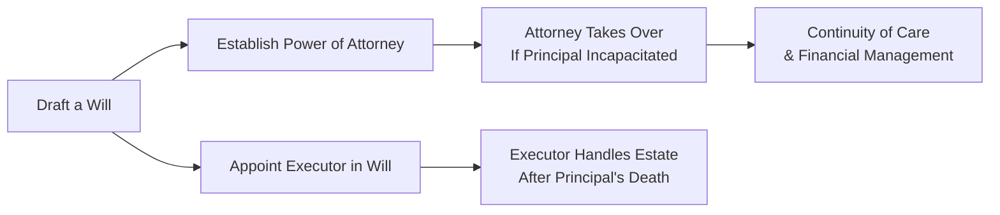

## 7.6 Objectives of Powers of Attorney

Sometimes, we’re so focused on growing our assets or figuring out the right investment strategy that we forget a simple truth: life can be unpredictable. Maybe you know a relative or friend who suddenly found themselves unable to manage their personal finances or health decisions due to an accident or illness. Well, that’s precisely when a Power of Attorney (POA) comes into play. I remember chatting with my uncle—he was healthy, but he wanted to make sure that if anything ever happened, someone he trusted could easily handle his bank accounts and day-to-day matters. A POA made perfect sense for that peace of mind.

In this section, we’ll explore the main objectives of Powers of Attorney, their importance in the broader context of estate planning, and how they can ultimately protect you and your loved ones from the complexities that may surface when someone is unable to manage their own affairs. We’ll also look at some of the regional variations across Canada, the differences between limited and general POAs, and best practices to make sure your POA works as intended.

---

### Overview of Power of Attorney

A Power of Attorney (POA) is a legal arrangement in which one person (the principal) gives authority to another individual (the attorney, also known in Quebec as the mandatary) to act on their behalf. This authority can span various aspects, such as financial matters, property management, or even personal care decisions. The key is that when you appoint someone under a POA, you empower them to “step into your shoes” and act decidedly for you if you can’t do so yourself. 

Let’s break down some of the primary reasons why people typically put these documents in place:

• They want to ensure continuity: Even if you’re traveling or temporarily incapacitated, your attorney has the legal ability to make decisions, pay bills, and handle pressing financial matters.  
• They want to avoid court proceedings: A formal guardianship or trusteeship application can be lengthy, expensive, and draining for everyone involved. A valid POA, properly executed, helps bypass much of that.  
• They want peace of mind: Plain and simple, it’s reassuring to know a trusted person, like a close friend or family member, can make decisions on your behalf if you’re ever in a vulnerable spot.

**Key Note:** While the literal name can vary across provinces—“Mandate in Case of Incapacity” in Quebec, for instance—the concept remains similar: you’re legally delegating specific decision-making powers to a chosen representative.

---

### The Objectives of a POA

The objectives of a Power of Attorney revolve around ensuring that the principal’s best interests remain front and center, whether it’s about financial control, property management, or personal care. Let’s walk through these objectives in more detail:

#### 1. Continuity of Financial and Personal Care Management

One of the central goals is to create a seamless transition if you become incapacitated. Imagine you’re hospitalized after an accident. While you’re recovering, your bills still need to be paid, and financial or personal care decisions may have to be made quickly. A POA steps in behind the scenes, ensuring your financial obligations are met and your personal matters are addressed without interruption.

In different provinces, this might look slightly different:

- **Ontario:** The Substitute Decisions Act covers both a Power of Attorney for Property (managing finances) and a Power of Attorney for Personal Care (handling health or personal care decisions).  
- **Alberta:** The concept of a Personal Directive covers health care, while enduring powers of attorney handle financial and property matters.  
- **Quebec:** A mandate given in anticipation of incapacity can cover both property and personal care.  

No matter the region, the core principle is the same: ensuring day-to-day life goes on smoothly.

#### 2. Avoiding Court-Imposed Guardianship or Trusteeship

If a valid POA isn’t in place, loved ones might have to apply to the courts for guardianship or trusteeship. These processes can be expensive, time-consuming, and emotionally draining for a family that’s already coping with the stress of a loved one’s illness or injury. A timely, well-executed POA is like an insurance policy against this scenario.

#### 3. Fostering Peace of Mind

Knowing you have a trustworthy attorney in place can be incredibly comforting. Many folks say, “I didn’t think I needed a POA until I realized how complicated life can get.” You might also appoint more than one attorney or even a professional corporate attorney—though that might come with fees—if you don’t have a personal contact who can reliably serve in the role. The bottom line: you’re safeguarding your interests in a clear, legally recognized way.

#### 4. Defining the Scope of Authority

Objectives also include clarity. Not every attorney needs the authority to oversee everything. Some individuals only want to delegate specific tasks (like managing investment accounts) or define a time window (such as authority to handle affairs while you’re away for six months). This is called a “limited” POA. However, many people prefer a “general” POA that grants broader authority for managing multiple areas (banking, property transactions, etc.). 

While a general POA is convenient, it involves a high degree of trust that the attorney will act responsibly. Setting clear boundaries or instructions within the document helps keep the roles and responsibilities understandable and transparent.

---

### Types of Powers of Attorney

To expand on the concept of scope, let’s map out a few common types of POAs. The exact terminology can vary, but these categories give you a sense of the possibilities:

1. **General Power of Attorney**  
   • Broad authority.  
   • Often used when you trust someone fully with all financial matters.   

2. **Limited (or Specific) Power of Attorney**  
   • Restricted to a certain transaction—like selling a property on your behalf—or limited to a set time.  
   • Useful if you travel or temporarily can’t attend to a specific task.

3. **Enduring or Continuing Power of Attorney**  
   • Remains in effect even if the principal becomes mentally or physically incapable.  
   • Highly relevant when planning for potential incapacity.

4. **Power of Attorney for Personal Care**  
   • Covers personal decisions such as health care, residence, and daily living.  
   • May also be called a “Personal Directive” in Alberta or “Mandate in Case of Incapacity” in Quebec.

---

### Mermaid Diagram: How a POA Fits Into Estate Planning

Below is a simple Mermaid diagram illustrating how a POA fits into a broader estate-planning framework:

- A: Drafting a will is a core step in estate planning.  
- B: Naming an executor in your will clarifies who manages your estate after death.  
- C: Establishing a Power of Attorney addresses decision-making during your life if you can't act for yourself.  
- D and F: Your attorney steps in to handle financial or personal care matters without interruption.  
- E: Your executor steps in after death, so note that a POA ends when the principal passes away.

---

### The Canadian Legislative Angle

In Canada, POA legislation is largely governed at the provincial level. Here’s a quick look at some of the provincial frameworks that outline the creation and enforcement of POAs:

• **Ontario’s Substitute Decisions Act**: Governs the creation of POAs for property and personal care, including formalities such as witnesses, forms, and capacity criteria.  
• **Alberta’s Personal Directives Act & Powers of Attorney Act**: Covers personal directives for health care decisions and enduring POAs for finances.  
• **Manitoba’s Powers of Attorney Act**: Outlines rules for creating and revoking POAs, along with capacity requirements.  
• **Quebec’s Civil Code**: Mandate given in anticipation of incapacity must be homologated by the court if the person becomes incapacitated.  
• **British Columbia’s Power of Attorney Act**: Provides guidelines on both enduring and general POAs.  

Regardless of where you live, the law typically requires the principal to be mentally capable when granting a POA. That means the person should fully understand the nature and consequences of the document.

---

### Real-World Application Scenarios

Consider a scenario where Rosa, 68, is concerned about a potential decline in mobility. She travels often to visit her grandchildren. While away, she wants a trusted family member to handle her utility payments, property taxes, and any other urgent matter that might pop up. Setting up a general POA with her daughter ensures bills get paid on time—no late fees, no missed insurance renewals. If Rosa eventually faces a serious health issue, that same POA could help her daughter seamlessly take over more comprehensive financial management. Rosa also decides to put a Personal Directive in place to handle any healthcare decisions if she can’t make them herself.

Now picture Adam, a busy entrepreneur who temporarily relocates abroad for a major business project. He grants a limited POA to a colleague, specifically authorizing them to sign legal documents on behalf of his Canadian corporation for six months. Once that period is over, the POA automatically terminates. Adam ensures his business runs smoothly without missing a beat.

---

### Safeguarding Financial POAs: Best Practices

You’re probably thinking, “This is a lot of power to hand over!” Indeed, the attorney can do quite a bit on your behalf, so it’s essential to safeguard your interests:

1. **Choose your attorney carefully**: This is not a decision to make lightly. Look for someone you trust deeply—often a spouse, close friend, or reliable family member. Double-check they’re willing to take on the role.

2. **Set clear limits**: If you’re not comfortable granting broad authority, consider a limited POA. Or specify certain instructions, like requiring a second signature for any transactions over a certain dollar amount.

3. **Use official forms if available**: Many provinces have standard POA forms. These forms ensure the document meets the legal requirements. Some banks or financial institutions also recommend using their own POA forms for simplifying internal procedures.

4. **Keep your POA up to date**: Life changes—divorce, a falling out with a friend, changes in financial circumstances—so you need to review your POA regularly to ensure it still reflects your wishes.

5. **Consult a legal professional**: It’s always wise to have a lawyer help you draft or review a POA. Although do-it-yourself kits exist, the potential pitfalls of a poorly drafted document can be huge.

---

### The Public Guardian and Trustee

In cases of alleged attorney misuse or conflict, each province has an office of the Public Guardian and Trustee (PGT). The PGT can provide oversight, investigate suspected abuse, and sometimes step in if no suitable alternative decision-makers exist. It’s also a resource for families unsure about how to handle a POA for a loved one experiencing capacity challenges.

Let’s not forget that if legal disputes arise—maybe the attorney isn’t acting in the principal’s best interest—courts and the PGT can intervene. This further highlights the importance of selecting an attorney with integrity and having open discussions about your expectations.

---

### Role of Financial Institutions and Advisors

Financial institutions, such as banks, typically have internal policies on acceptable POA documentation. They might require:

- Original or notarized copies of the POA.  
- Completion of specific internal forms.  
- Confirmation that the POA is valid and the principal is still alive.  
- Some institutions may want to see evidence of the principal’s incapacity if the POA is meant to be triggered by an event.  

Advisors, on the other hand, can play a valuable role by prompting clients to draft or review their POAs, especially when discussing estate planning or retirement planning. Advisors should keep up-to-date with the latest guidelines from provincial bodies, the Canadian Bankers Association, and relevant policies from the Canadian Investment Regulatory Organization (CIRO). Even though CIRO does not directly regulate POAs, its guidelines encourage proactive disclosure and best practices to protect clients.

---

### Potential Pitfalls and Challenges

Though POAs are powerful tools, they’re not immune to issues or misunderstandings. Common pitfalls include:

- **Unclear scope**: If your POA is vague, it can be challenging to interpret which powers are included.  
- **Selecting the wrong attorney**: If the chosen attorney mismanages assets or doesn’t communicate with family members, it could lead to legal battles or financial loss.  
- **Timing and triggers**: In some regions, your POA might not become active until you’re deemed incapable by a medical professional. This could create confusion if you need assistance before reaching that threshold of incapacity.  
- **Overlooking personal care**: Many folks focus on financial matters and forget personal care. If you want someone to handle healthcare decisions, you need the relevant documents (e.g., a separate POA for Personal Care in Ontario, or a Personal Directive in Alberta).

---

### Financial Case Study: David’s Dilemma

Let’s consider a more complex scenario that ties together several threads we’ve discussed:

David, a semi-retired engineer from Manitoba, initially set up a general POA with his nephew, Mark. Years later, David married and relocated to Ontario, forgetting to update his POA. Then, after a major surgery, David’s ongoing care left him partially incapacitated. Mark attempted to manage David’s finances under the old POA, but some Ontario banks refused, stating that the Manitoba document wasn’t recognized under their internal policies because it didn’t comply with certain witnesses’ requirements from the Substitute Decisions Act.

David’s spouse, Kate, had to scramble and apply for a new POA in Ontario—an approach that would have been unnecessary if David had updated his document in time. This caused friction among family members, confusion for the banks, and additional legal fees. The lesson? POAs cross provincial lines only when validly executed under each relevant jurisdiction’s rules, and it’s crucial to keep the document updated when you move or undergo major life events.

---

### Collaboration with Estate Planning Professionals

Drafting a POA is often part of a bigger estate planning picture. Lawyers, notaries in Quebec, and financial planners should all work in tandem to:

1. Identify your assets, potential liabilities, and personal circumstances.  
2. Determine capacity requirements and timing for a POA to come into force.  
3. Coordinate your will, insurance beneficiaries, and other estate documents so everything aligns consistently.  
4. Provide clear guidance on choosing the right attorney and ensuring they understand their responsibilities.

This synergy ensures your estate plan functions as a cohesive strategy rather than a patchwork of documents that might contradict each other or cause confusion.

---

### References and Further Exploration

- **Provincial Legislation**: 
  - Ontario’s Substitute Decisions Act: https://www.ontario.ca/laws/statute/92s30  
  - Alberta’s Personal Directives Act: https://www.alberta.ca/personal-directive.aspx  
  - Manitoba’s Powers of Attorney Act: https://web2.gov.mb.ca/laws/statutes/ccsm/p097e.php  
  - Quebec’s Civil Code on Mandates: https://www.legisquebec.gouv.qc.ca/en/document/cs/ccq-1991  
- **Public Guardian and Trustee**: Each province has a PGT website providing guidance on POAs and protective measures against misuse.  
- **Canadian Bankers Association**: Offers guidelines on safeguarding financial POAs. Great for understanding how banks handle these documents. https://cba.ca  
- **CIRO** (Canadian Investment Regulatory Organization): https://www.ciro.ca, to stay informed on broader guidelines affecting advisors.

---

### Bringing It All Together

So, how does a POA really work in your financial plan? Let’s do a quick recap:

1. **Drafting a POA**: You assign an attorney (or multiple attorneys) with either specific or general authority over your affairs, including financial or personal care duties.  
2. **Ensuring Recognition**: Make sure the POA meets your province’s legislative requirements. Provincial rules can differ on witnessing, signing, and capacity.  
3. **Activation**: Some POAs are active immediately, while others begin only when you’re deemed incapacitated.  
4. **Attorney’s Responsibility**: The attorney must always act in the principal’s best interest—honestly, in good faith, and in line with any instructions or limitations you set out.  
5. **Monitoring and Oversight**: The PGT or courts can intervene if something goes wrong.  
6. **Ends at Death**: The POA is valid during your lifetime. After death, your will (and the named executor) takes over for estate settlement.

If your attorney needs to handle a request such as selling your home, they’ll usually need to present the POA document to the relevant parties. Moreover, if you’re working with an advisor, they’re likely to ask for a copy of the POA (or keep one on file) to ensure correct instructions.

Ultimately, the objective is to protect you from the chaos that can arise when life throws unexpected challenges your way. A properly designed POA can take the headache out of an already stressful situation, letting your finances and personal care stay on track.

---

## Test Your Knowledge: The Objectives of Powers of Attorney Quiz



### Which of the following is the BEST definition of a Power of Attorney (POA)?
- [ ] A legal document used to distribute assets after death.
- [x] A legal document authorizing someone else to act on your behalf while you are alive.
- [ ] A mandatory health directive that applies only to medical decisions.
- [ ] An informal arrangement that doesn’t require any legal documents.

> **Explanation:** A Power of Attorney is a legal document that designates someone else to make decisions on your behalf during your lifetime, typically in the event of incapacity or absence.

### What is one of the primary objectives of creating a Power of Attorney?
- [ ] Ensuring an executor is in place after your death.
- [ ] Avoiding the need for a will.
- [x] Providing continuity of financial and/or personal care if you become incapacitated.
- [ ] Mandating that courts establish your guardianship.

> **Explanation:** Continuity of financial and personal care in case of incapacitation is a key goal of a POA. The executor and will come into play after death, not before.

### Which of the following is a potential advantage of having a valid POA?
- [x] Avoiding expensive and time-consuming court proceedings for guardianship.
- [ ] Guaranteeing that your spouse will inherit all your assets automatically.
- [x] Gaining peace of mind that someone you trust can manage your affairs.
- [ ] Changing your will without legal assistance.

> **Explanation:** A valid POA can help you sidestep court applications for guardianship or trusteeship. It also provides peace of mind because a trusted individual can step in if you cannot manage your affairs.

### In Ontario, the legislation that governs POAs is known as:
- [ ] The Powers of Attorney Act.
- [ ] The Personal Directives Act.
- [x] The Substitute Decisions Act.
- [ ] The Civil Code of Ontario.

> **Explanation:** Ontario’s Substitute Decisions Act governs both the Power of Attorney for Property and Power of Attorney for Personal Care.

### Which statement best describes a “limited” (or specific) Power of Attorney?
- [x] It grants authority for a particular action or limited time period.
- [ ] It remains valid indefinitely, even after the principal loses capacity.
- [x] It can narrowly define what the attorney can do, like selling a house while you are out of the country.
- [ ] It automatically grants authority over personal care decisions.

> **Explanation:** A limited POA restricts the attorney’s authority to a specific task or timeframe. This can include selling property, handling certain bank accounts, or other narrow duties.

### True or False: A POA ends immediately upon the principal’s death.
- [x] True
- [ ] False

> **Explanation:** A POA is only valid during the lifetime of the principal. After the principal passes away, the executor named in the will takes over.

### Which office in each province can step in if there is a dispute or misuse of a POA?
- [x] The Public Guardian and Trustee.
- [ ] The Canadian Bankers Association.
- [x] The provincial Department of Finance.
- [ ] CIRO.

> **Explanation:** The Public Guardian and Trustee typically oversees alleged misuse or conflict in POAs. CIRO oversees investment dealers and markets, and the Canadian Bankers Association provides guidelines but doesn’t enforce disputes.

### What is a common pitfall if you do NOT keep your POA updated after moving to a new province?
- [ ] No consequences, as all POAs are perfectly valid across provinces.
- [x] Potentially facing difficulties at financial institutions due to differing provincial requirements.
- [ ] It automatically converts into a living will.
- [ ] The POA becomes irrevocable.

> **Explanation:** Because of varying provincial laws, an outdated POA may not meet legal requirements in a new province, possibly causing refusal or confusion at banks and other institutions.

### Which of the following best describes the “Enduring” or “Continuing” POA?
- [ ] A POA that terminates as soon as the principal is declared incapacitated.
- [x] A POA that specifically remains in force or comes into force upon incapacity.
- [ ] A POA that is valid only for one year.
- [ ] A POA that automatically gives doctors the right to make medical decisions.

> **Explanation:** An Enduring or Continuing POA is drafted to remain valid (or become valid) when the principal loses capacity, thereby helping to manage affairs without interruption.

### True or False: POA legislation is governed solely by federal law in Canada.
- [ ] True
- [x] False

> **Explanation:** POW legislation falls under provincial and territorial jurisdiction, meaning the rules can vary across Ontario, Alberta, Quebec, British Columbia, and other provinces/territories.


