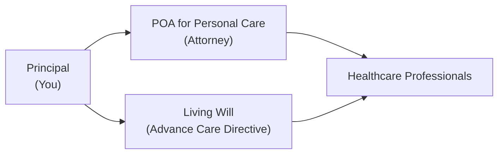

## 7.8 Powers of Attorney for Personal Care and Living Wills

Few topics are as personal and emotional as planning for our own health and end-of-life care. And yet, it’s something many of us tend to put off. Maybe you’ve thought, “I’m still young; do I really need this?” or “I’m healthy, so why bother?” Well, I once had a friend—only in her forties—who suffered a sudden medical crisis. She quickly realized that her loved ones weren’t sure how she wanted her medical care handled if she couldn't speak for herself. That experience totally changed my perspective. Even if you never need it, having clear documents like a Power of Attorney for Personal Care and a Living Will can relieve a giant burden from your loved ones and give you peace of mind.

Below, we’ll explore what these documents are, why you should consider them, and how to ensure they meet legal requirements in your province. We’ll also cover strategies for effectively communicating your personal wishes to those tasked with carrying them out.

### Why Personal Care Documents Matter

When we talk about powers of attorney, typically we think of finances, such as paying bills or managing investments on someone’s behalf. But our personal care decisions—like the kind of medical treatment we want, our preferred living arrangements if we can’t stay home, or even spiritual and cultural preferences—are arguably just as important to plan for. A Power of Attorney for Personal Care (POAPC) (often called a “mandate for protection of the person” in Quebec) is designed exactly for that: to authorize someone to make non-financial decisions if you become unable to do so.

A Living Will, also known as an Advanced Healthcare Directive, is a statement you create while you are mentally capable that outlines your preferred medical treatments, such as whether you want life support under specific conditions. You might combine it with a POAPC or keep it a separate document—ultimately, it’s about having your voice heard even when you can’t speak.

### Key Definitions

• Power of Attorney for Personal Care (POAPC):  
  A legal instrument appointing someone—often called your “attorney” or “proxy”—to make healthcare, housing, and personal care decisions if you become mentally incapable. In Quebec, it’s referred to as a “Mandate for Protection of the Person.”

• Living Will (Advance Healthcare Directive):  
  A statement, typically written, that outlines your wishes regarding medical treatment and end-of-life care. It can stand alone or work alongside your POAPC. Think of it as a blueprint: “If I’m in this medical state, here’s what I do and don’t want.”

• Healthcare Proxy:  
  A term sometimes used interchangeably with POAPC or used to describe the person appointed to make medical decisions—but usage varies by jurisdiction.

### Understanding Powers of Attorney for Personal Care

In many provinces, a POAPC covers the appointment of an individual (or multiple individuals) to manage every aspect of your personal well-being should you become incapacitated. This could include:

• Deciding what type of medical care or treatments you receive.  
• Determining the best living environment to suit your needs (e.g., in-home care or a long-term care facility).  
• Making day-to-day life decisions, such as dietary preferences and who can visit you.  

Even though the specifics vary by province—Ontario has the Health Care Consent Act, for instance, while Quebec’s Civil Code has separate rules—the concept remains consistent: The appointed person steps into your shoes for personal decisions when and if you can’t make them yourself.

#### Requirements and Execution

Each province has forms and guidelines that specify how to create a valid POAPC. Here are some typical steps:

• You must be of legal age (often 16 or 18).  
• You must be mentally capable at the time you sign.  
• You may need witnesses who are not your appointed attorney.  
• The document might require standardized language (e.g., in Quebec, a Mandate for Protection of the Person could need notarization or signatures before witnesses).

It’s essential to check local legislation: for example, Ontario might have slightly different requirements than Alberta. And if you move provinces, you might want to confirm your POAPC is still recognized where you now reside.

### What Is a Living Will?

A Living Will (or Advance Healthcare Directive) expresses your preferences about treatments that affect your quality of life and end-of-life care. Sometimes people worry that it’s too grim to plan for these scenarios, but trust me, it can be a real gift to your family. When you provide a clear roadmap—such as whether you want life support, whether you prefer palliative care at home, or if you’re open to certain types of invasive procedures—your loved ones have less guesswork. They can follow your stated wishes rather than agonizing over what they believe you “might” have wanted.

Different provinces have varied levels of formal recognition for Living Wills. In some places, these documents are explicitly governed by legislation. In others, they are more informal but respected by healthcare professionals and institutions as expressions of your intent.

### Working Together: Living Will + POAPC

The POAPC and Living Will often go hand in hand. Typically:

• The Living Will is your set of instructions.  
• The POAPC is the appointed person (or persons) who ensures those instructions are carried out.

Sometimes, your Living Will might address general guiding principles—like “I value quality of life over extending life by artificial means”—while deferring finer details to your attorney. Other times, it might be highly specific. Either way, the synergy between these documents is powerful.

Below is a simple diagram illustrating how these documents and people connect:

In this diagram:  
• You (the Principal) establish a POAPC by naming an attorney.  
• You also create a Living Will that spells out your treatment preferences.  
• Your attorney coordinates these preferences with healthcare professionals (e.g., doctors, hospital staff, long-term care facility administrators) if you become incapable of making or communicating decisions yourself.

### Navigating Provincial Differences

In Canada, health care is primarily a provincial matter, so the rules that govern POAPCs and Living Wills vary:

• In Ontario, this might be called a “Power of Attorney for Personal Care” under the Substitute Decisions Act.  
• In British Columbia, the documents might be separate: one for personal care (Representation Agreement) and one for advance directives.  
• Quebec’s Civil Code uses a “Mandate for Protection of the Person” to address personal care decisions.  
• In Alberta, the Personal Directives Act covers personal care directives.  

Because of these differences, it’s crucial to ensure that you’re using the correct forms and abiding by the correct guidelines for your province. If you plan to split time between multiple provinces (say, you’re a “snowbird” and live half the year out of province), you’ll want to be sure your documents align with applicable laws in each jurisdiction—or at least consult a legal professional to confirm how your documents might be interpreted.

### Choosing the Right Attorney or Mandatary

Selecting someone to have POAPC over you isn’t like picking a random name out of a hat. You want someone you trust, who knows you well—someone capable of making difficult medical and personal decisions with your best interests at heart. Here are a few points to consider:

• Trust and Values: They should understand your values and beliefs—what quality of life means to you, your comfort with certain treatments, your approach to spirituality, or your sense of dignity.  
• Availability: Are they in a location where regular visits are possible if you require ongoing care? Could they easily communicate with your medical team?  
• Emotional Preparedness: If it comes down to making end-of-life decisions, it can be incredibly tough on loved ones. Make sure the person you appoint is both willing and emotionally ready to take this on.  
• Conflict of Interest: Avoid appointing someone who might have interests that conflict with yours.  

Keep open communication with your appointed attorney. Have a real conversation. Maybe write down your healthcare philosophies, or record a video (some folks find that more personal). This can help your attorney truly grasp how you feel about different scenarios.

### Making a Living Will Effective

If you decide to create a Living Will, the biggest pitfall is being too vague. Generic statements like, “I don’t want to live on machines” might not help doctors figure out precisely what you mean by “machines.” Does it include a temporary ventilator post-surgery while you recover? Does it exclude aggressive treatment for a reversible condition? Clarifying medical terms can help. Consider, for instance:

• Your stance on “heroic” or invasive procedures like intubation, feeding tubes, or dialysis.  
• Do Not Resuscitate (DNR) orders, if that’s your desire.  
• Your desire for palliative or hospice care in the last days/weeks of life.  
• Situations like permanent unconsciousness, advanced dementia, or severe brain injury.  

Also, be sure to update your Living Will if your preferences change. People’s perspectives sometimes shift over time. One day you might feel strongly about refusing a certain treatment, but as you age or your health evolves, your stance might soften or become more firm.

### Communicating with Healthcare Professionals

Healthcare professionals will look to your POAPC and Living Will for guidance if you are unconscious or deemed mentally incapable of making decisions. However, they might also rely on clinical judgment and your attorney’s interpretation if your instructions aren’t crystal clear. That’s why it’s a good idea to:

• Let your primary care physician know you have a Living Will.  
• Discuss your general wishes with your doctor ahead of time.  
• Provide a copy of your documents to close family members, your attorney, and possibly your lawyer.  

Continued open communication ensures there’s less room for misunderstanding when challenging decisions need to be made quickly.

### Legal and Ethical Complexities

Even with well-prepared documents, complex ethical questions can arise. In some cases, family members might challenge a Living Will, claiming it no longer reflects your current beliefs. In other cases, new medical technologies might appear that your directive doesn’t address. Additionally, how one person interprets “no life support” might differ drastically from another person’s interpretation. Being proactive—and explicit—helps to minimize these pitfalls.

### Personal Case Studies

Imagine Nadia. She’s 60 years old, lives alone, and has no children. Nadia’s always been independent. She creates a POAPC naming her good friend Charles, who’s more like a brother to her. She tells Charles about her strong preference not to receive extended life support if she’s in a permanent vegetative state. She also puts that in writing in her Living Will. 

Years later, Nadia suffers a massive stroke, leaving her with severely limited cognition. Charles references her Living Will to guide the medical team, clarifying that Nadia would not want mechanical ventilation to keep her alive indefinitely if there’s zero chance of meaningful recovery. Because their conversations were detailed and open, Charles, while heartbroken, feels assured that he is honoring Nadia’s deepest wishes.

Now imagine Ronald. He didn’t have a Living Will. He told his wife over coffee once, rather casually, that he “hated the idea of tubes.” But no one’s clear on specifics when an unexpected accident lands him in the ICU. Ronald’s adult children are left in distress, trying to interpret what he meant. Some think “no tubes at all,” while others believe “only short-term support is okay.” These kinds of scenarios commonly lead to conflict and guilt. A Living Will or POAPC defining those preferences clearly would have helped enormously.

### The Advisor’s Role

While financial advisors and planners aren’t (and shouldn’t pretend to be) lawyers, they do have a role in guiding clients to the right resources. Advisors can  
• Encourage clients to think about personal care plans as part of a broader financial and estate plan.  
• Remind clients to have up-to-date POAPCs and Living Wills, just like they’d keep their will or beneficiary designations current.  
• Offer resources—like directing them to provincial websites or local organizations providing standard forms.  
• Emphasize the new regulatory environment under CIRO (Canadian Investment Regulatory Organization), which replaced the MFDA and IIROC as of January 2023. While CIRO primarily oversees investment dealers and mutual fund dealers, a thorough financial plan should address personal directives alongside wealth management.  

### Regulatory Considerations (Historical and Current)

Prior to 2023, the MFDA and IIROC were separate self-regulatory organizations for mutual fund dealers and investment dealers, respectively. As of January 1, 2023, they merged to form CIRO. This change doesn’t directly alter the requirements for a POAPC or Living Will, but it signals that all aspects of Canadian financial regulation—particularly investor protection—are centralized under one umbrella. For official updates or external references, you can explore CIRO resources at https://www.ciro.ca.

### Insurance and Financial Support

Supplementary health or creditor insurance can potentially offset costs associated with long-term care or specialized living arrangements if you lose capacity. In Chapter 3 on Mortgages, we explored creditor insurance for homes; similarly, in Chapter 8 on Risk Management and Life Insurance, we’ll look at how life insurance might provide financial security for your loved ones. But it’s also important to note that if you have a separate health insurance policy or rely on provincial government programs, your POAPC might need to work with those institutions to ensure coverage of treatments or care facilities.

### Family Conversations

People often ask, “How do I even bring this up with my spouse, kids, or parents?” My suggestion is to plan a relaxed, open chat—maybe around a Sunday afternoon or a time when everyone’s calm. You might say, “I’ve been thinking about the future, and I’d feel better if we knew each other’s wishes, you know?” Let them know you care; you’re not trying to scare anyone or be morbid. Personal care planning is about having a voice, even if you lose yours temporarily or permanently.

### Maintaining and Updating the Documents

A POAPC or Living Will isn’t a “set it and forget it” type of exercise. Regular reviews are wise, especially if:

• You move to a different province or country.  
• You experience changes in your health status (e.g., a new diagnosis, significant surgery, major shift in mental or physical capabilities).  
• Your attorney can no longer serve (maybe they moved away or passed on).  
• Your personal relationships change (e.g., divorce, a falling-out with a friend).  

Keep a copy in a safe yet accessible place—tucked away in the bottom of a locked safe defeats the purpose if no one can find it. Some folks keep a short note in their wallet or phone, indicating that they have a POAPC or Living Will and listing contact information for their attorney or lawyer.

### Common Pitfalls

• Failing to Consult Legal Professionals: While do-it-yourself forms are an option, it’s often best to consult a legal professional if your situation is complex.  
• Not Telling Anyone: A hidden or unknown directive doesn’t do much good. Make sure those who need to know, do know.  
• Appointing Unreliable Attorneys: Choosing someone who’s geographically distant or not comfortable with tough decisions can sabotage your intentions.  
• Overlooking Confidentiality Issues: In some family dynamics, friction emerges if one child or sibling is chosen over another. Consider how you can keep lines of communication open and respectful.

### Practical Suggestions and Resources

• Books and Articles:  
  – “Life on Your Terms: A Practical Guide to Estate Planning in Canada” by an experienced Canadian estate lawyer.  
  – “Being Mortal” by Atul Gawande (though US-based, it’s an insightful read on end-of-life care).  

• Websites:  
  – Canadian Virtual Hospice (https://www.virtualhospice.ca) for guidance on palliative and end-of-life planning.  
  – Advance Care Planning (https://www.advancecareplanning.ca/) for templates and tips.  
  – Ontario’s Health Care Consent Act and other provincial statutes: Check your provincial government’s official website.  
  – CIRO (https://www.ciro.ca) for updates on the self-regulatory environment of investment dealers and how it might relate to broader estate discussions.  

• Professional Advice:  
  – Consult lawyers familiar with estate law and personal directives in your province.  
  – Speak to your financial advisor about incorporating personal care directives into your overall financial plan.  

### Conclusion

If all this sounds like a lot, think of it this way: preparing a POAPC and a Living Will is one of the most caring things you can do for yourself and for the people you love. You remove uncertainty and potential guilt from tough decisions, and you ensure that your values and preferences guide your care when you can’t speak for yourself.  

Maybe you’re reading this and thinking, “Alright, I get it. I should probably do this.” Great! Your next step might be to jot down some personal thoughts or talk with a lawyer about local requirements. And, hey, if you have a financial advisor, don’t be shy about bringing these topics up. It’s all part of the holistic view of your financial and personal well-being.  

Remember: planning for personal care is not just about facing mortality—it’s about safeguarding your personal autonomy, no matter what life throws your way.

---

## Test Your Knowledge: Powers of Attorney for Personal Care and Living Wills



### Which of the following best describes a Power of Attorney for Personal Care (POAPC)?

- [x] A legal document that authorizes someone to make non-financial decisions if you become unable to do so.
- [ ] A formal arrangement to authorize someone to manage only your bank accounts.
- [ ] A document that only outlines your wishes for distributing assets after death.
- [ ] An administrative step required for obtaining long-term disability benefits.

> **Explanation:** A POAPC (or a similar mandate in Quebec) is specifically for non-financial decisions, such as healthcare and personal matters.

### What is the main function of a Living Will?

- [x] To state a person’s preferences regarding medical treatment and end-of-life care.
- [ ] To authorize an attorney to invest on the person’s behalf.
- [ ] To outline how debt is handled after one’s passing.
- [ ] To direct financial transactions for beneficiaries.

> **Explanation:** A Living Will—also known as an Advance Healthcare Directive—expresses medical treatment preferences if the person cannot communicate.

### Which statement about choosing an attorney for personal care is correct?

- [x] The chosen individual should fully understand the person’s values and be able to respect them in healthcare decisions.
- [ ] The chosen attorney can ignore the person’s wishes if they believe it’s in the person’s best interest.
- [ ] The attorney must be an immediate family member, such as a child or sibling.
- [ ] The attorney only needs to manage financial items, not healthcare decisions.

> **Explanation:** The attorney for personal care is tasked with making decisions in line with the person’s values and beliefs, so trust and understanding are crucial.

### When creating a valid POAPC, which factor is often required by provincial law?

- [x] The document must be signed by you while you’re mentally capable.
- [ ] You must have an existing life insurance policy.
- [ ] A notary must be present in all provinces.
- [ ] It can only be prepared for individuals under the age of 16.

> **Explanation:** In most provinces, the principal must be mentally capable at the time of signing, but the notarization requirements vary among jurisdictions.

### Which scenario illustrates an ideal use of both a POAPC and a Living Will?

- [x] Kate names her friend as her personal care attorney and also drafts a separate document outlining her wishes for specific medical scenarios.
- [ ] Alex invests in mutual funds and references living wills in his investment agreement.
- [x] Maria writes detailed healthcare instructions and appoints her daughter to ensure they are followed if she loses capacity.
- [ ] Joel only signs a Power of Attorney for Property, ignoring healthcare decisions.

> **Explanation:** Both Kate and Maria have spelled out their healthcare wishes and designated a person to carry them out, illustrating the synergy of a POAPC and a Living Will.

### Which of the following is generally NOT a function of a POAPC?

- [x] Managing the person’s stock portfolio to maximize returns.
- [ ] Deciding on medical treatment.
- [ ] Determining where the person lives if long-term care is necessary.
- [ ] Navigating day-to-day personal care decisions.

> **Explanation:** A POAPC doesn’t authorize financial management; it focuses on personal and healthcare decisions.

### If someone with a POAPC also has a Living Will, how do these documents typically interact?

- [x] The Living Will provides instructions, while the attorney under the POAPC enforces or interprets those instructions.
- [ ] The Living Will cancels out the authority of the attorney.
- [x] The Living Will and POAPC have no relationship and are used for different people.
- [ ] The POAPC is only valid if the Living Will is signed the same day.

> **Explanation:** The Living Will states the principal’s preferences, and the attorney uses that guidance to make decisions on the principal’s behalf.

### Which is a common pitfall in preparing a Living Will?

- [x] Being too vague about the specific healthcare interventions one would want or not want.
- [ ] Listing multiple attorneys for property management.
- [ ] Storing it in a place that is easy to access.
- [ ] Updating it periodically.

> **Explanation:** A common pitfall is lack of clarity or detail, leaving loved ones and healthcare providers uncertain about what the person truly desired.

### In Quebec, which document typically handles personal care decisions?

- [x] A Mandate for Protection of the Person.
- [ ] A mutual fund prospectus.
- [ ] A Post-Retirement Healthcare Agreement.
- [ ] An Inter Vivos Trust.

> **Explanation:** Under Quebec’s Civil Code, a Mandate for Protection of the Person addresses non-financial personal care decisions, effectively acting like a POAPC.

### True or False: Reviewing and updating a POAPC is important if your personal relationships or health circumstances change significantly.

- [x] True
- [ ] False

> **Explanation:** Regular reviews ensure that the appointed attorney and recorded wishes still reflect your current situation and preferences.


